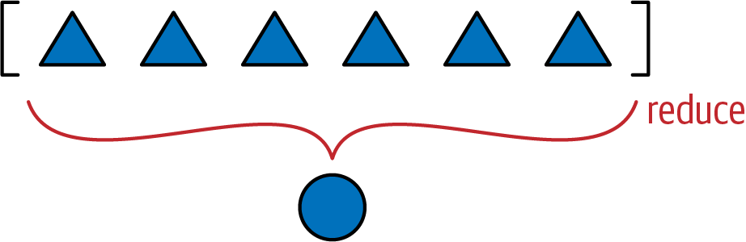
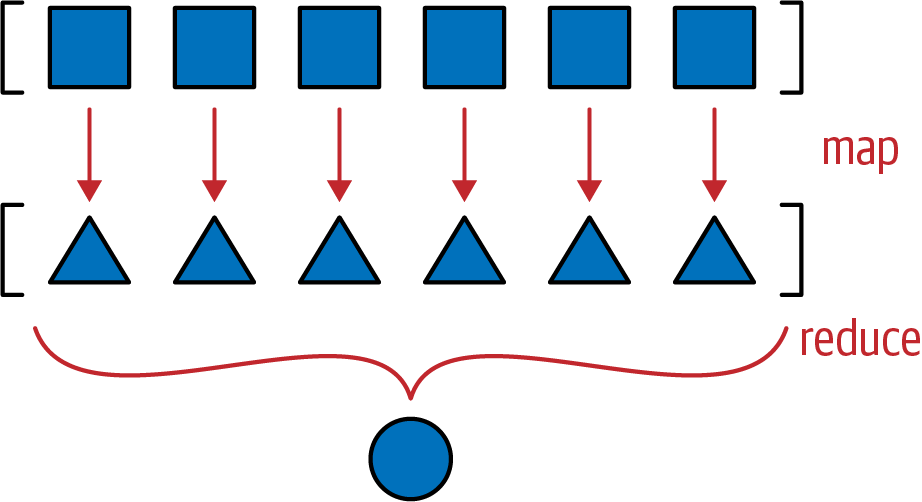

[[ch_seq_methods]]
== Métodos especiais para sequências
:example-number: 0
:figure-number: 0

[quote, Alex Martelli]
____
Não queira saber se aquilo _é_-um pato: veja se ele _grasna_-como-um pato, +
_anda_-como-um pato, etc., etc., dependendo de qual subconjunto de
comportamentos de pato você precisa usar em seu jogo de palavras. (`comp.lang.python`, Jul. 26, 2000)
____

Neste((("sequences, special methods for", "topics covered")))((("Vector class, multidimensional",
"topics covered"))) capítulo, vamos criar uma classe `Vector`,
para representar um vetor multidimensional—um avanço significativo sobre o `Vector2D` bidimensional do <<ch_pythonic_obj>>.
`Vector` vai se comportar como uma sequência plana imutável como outras que existem em Python.
Seus elementos serão números de ponto flutuante, e ao final do capítulo a classe suportará o seguinte:

* O protocolo de sequência básico: `+__len__+` e `+__getitem__+`
* Representação abreviada de instâncias com  muitos itens
* Suporte adequado a fatiamento, produzindo novas instâncias de `Vector`
* _Hashing_ agregado, considerando cada elemento contido na sequência
* Um extensão customizada da linguagem de formatação

Também vamos implementar, com `+__getattr__+`, o acesso dinâmico a atributos,
como forma de substituir as propriedades apenas para leitura
que usamos no `Vector2d`&#x2014;apesar disso não ser comum em sequências.

Além disso, teremos uma discussão conceitual sobre a ideia de protocolos como interfaces informais.
Vamos discutir a relação entre protocolos e a tipagem pato (_duck typing_),
e as implicações práticas disso na criação de seus próprios tipos.

=== Novidades neste capítulo

Não((("sequences, special methods for", "significant changes to"))) fiz grandes
mudanças neste capítulo. Há uma breve discussão nova sobre o `typing.Protocol`
em um quadro de dicas, no final da <<protocol_duck_sec>>.

Na <<slice_aware_sec>>, a implementação do `+__getitem__+` no <<ex_vector_v2>>
está mais concisa e robusta que o exemplo na primeira edição, graças ao _duck
typing_ e ao `operator.index`. Essa mudança foi replicada para as implementações
seguintes de `Vector` aqui e no <<ch_op_overload>>.

Vamos começar.

=== Vector: tipo sequência definido pelo usuário

Nossa((("sequences, special methods for", "Vector implementation
strategy")))((("Vector class, multidimensional", "implementation strategy")))
estratégia na implementação de `Vector` será usar composição, não herança. Vamos
armazenar os componentes em um array de números de ponto flutuante, e
implementar os métodos necessários para que nossa classe `Vector` se comporte
como uma sequência plana imutável.

Mas antes de implementar os métodos de sequência, vamos desenvolver uma
implementação básica de `Vector` compatível com nossa classe `Vector2d`, vista
anteriormente--exceto onde tal compatibilidade não fizer sentido.

.Aplicações de vetores além de três dimensões
****

Quem((("Vector class, multidimensional", "applications beyond three
dimensions")))((("sequences, special methods for", "applications beyond three
dimensions"))) precisa de vetores com 1.000 dimensões? Vetores N-dimensionais
(com valores grandes de N) são bastante utilizados em recuperação de informação,
onde documentos e consultas textuais são representados como vetores, com uma
dimensão para cada palavra. Isso se chama
https://fpy.li/6b[Modelo vetorial].
Nesse modelo, a métrica fundamental de relevância é a
__similaridade de cosseno__—o cosseno do ângulo entre um vetor que representa a
consulta e um vetor representando um documento. Conforme o ângulo diminui, o valor
do cosseno aumenta, indicando a relevância do documento para aquela consulta:
cosseno próximo de 1 significa alta relevância; próximo de 0 indica baixa
relevância.

Dito isto, a classe `Vector` nesse capítulo é um exemplo didático. O objetivo é
apenas demonstrar alguns métodos especiais de Python no contexto de um tipo
sequência, sem grandes conceitos matemáticos.

A NumPy e a SciPy são as ferramentas que você precisa para fazer cálculos
vetoriais em aplicações reais. O pacote https://fpy.li/12-2[_gensim_] do PyPi, de
Radim Řehůřek, implementa a modelagem de espaço vetorial para processamento de
linguagem natural e recuperação de informação, usando a NumPy e a SciPy.

****

[[vector_take1_sec]]
=== Vector versão #1: compatível com Vector2d

A((("Vector class, multidimensional", "Vector2d compatibility", id="VCM2d12")))((("sequences, special methods for", "Vector2d compatibility", id="SSM2d12"))) primeira versão de `Vector` deve ser tão compatível quanto possível com nossa classe `Vector2d` desenvolvida anteriormente.

Entretanto, pela((("&#x005F;&#x005F;repr&#x005F;&#x005F;")))((("&#x005F;&#x005F;init&#x005F;&#x005F;"))) própria natureza das classes, o construtor de `Vector` não é compatível com o construtor de `Vector2d`. Poderíamos fazer `Vector(3, 4)` e `Vector(3, 4, 5)` funcionarem, recebendo argumentos arbitrários com `*args` em `+__init__+`. Mas a melhor prática para um construtor de sequências é receber os dados através de um argumento iterável, como fazem todos os tipos embutidos de sequências.
O <<ex_vector_demo>> mostra algumas maneiras de instanciar objetos do nosso novo `Vector`.

[[ex_vector_demo]]
.Testes de `+Vector.__init__+` e `+Vector.__repr__+`
====
[source, python]
----
>>> Vector([3.1, 4.2])
Vector([3.1, 4.2])
>>> Vector((3, 4, 5))
Vector([3.0, 4.0, 5.0])
>>> Vector(range(10))
Vector([0.0, 1.0, 2.0, 3.0, 4.0, ...])
----
====

Exceto pela nova assinatura do construtor, verifiquei que todos os testes
realizados com `Vector2d` (por exemplo, `Vector2d(3, 4)`) passam e
produzem os mesmos resultados com um `Vector` de dois componentes,
como `Vector([3, 4])`.

[WARNING]
====
Quando um `Vector` tem mais de seis componentes, a string produzida por `repr()` é abreviada com
`\...`, como visto na última linha do <<ex_vector_demo>>. Isso é fundamental para qualquer tipo de coleção que possa conter um número grande de itens, pois `repr` é usado na depuração—e você não quer que um único objeto grande ocupe milhares de linhas em seu console ou arquivo de log. Use o módulo `reprlib` para produzir representações de tamanho limitado, como no <<ex_vector_v1>>. O módulo `reprlib` se chamava `repr` no Python 2.7.
====

O <<ex_vector_v1>> é a primeira versão de `Vector`
baseada no <<ex_vector2d_v0>> e <<ex_vector2d_v1>> do <<ch_pythonic_obj>>.

[[ex_vector_v1]]
.vector_v1.py: baseado em vector2d_v1.py
====
[source, python]
----
include::../code/12-seq-hacking/vector_v1.py[tags=VECTOR_V1]
----
====

<1> O atributo de instância "protegido" `self._components` vai manter um `array`
com os componentes do `Vector`.

<2> Para permitir iteração, devolvemos um itereador sobre
`self._components`; a função `iter()` é assunto do <<ch_generators>>,
juntamente com o método `+__iter__+`.

<3> Usa `reprlib.repr()` para obter um representação de tamanho limitado de
`self._components` (por exemplo, `+array('d', [0.0, 1.0, 2.0, 3.0, 4.0, ...])+`).

<4> Remove o prefixo `array('d',` e o `)`  final, antes de inserir a string em
uma chamada ao construtor de `Vector`.

<5> Cria um objeto `bytes` diretamente de `self._components`.

<6> Desde o Python 3.8, `math.hypot` aceita pontos N-dimensionais. Já usei a
seguinte expressão antes: `math.sqrt(sum(x * x for x in self))`.

<7> A única mudança necessária no `frombytes` anterior é na última linha:
passamos a `memoryview` diretamente para o construtor, sem desempacotá-la com
`*`, como fazíamos antes.

O uso de `reprlib.repr` merece uma explicação.
Essa função produz representações seguras de estruturas grandes ou recursivas,
limitando a tamanho da string devolvida e indicando a abreviação com `'\...'`.
Eu queria que o `repr` de um `Vector` se parecesse com `Vector([3.0, 4.0, 5.0])` e
não com `Vector(array('d', [3.0, 4.0, 5.0]))`, porque a existência de um `array`
dentro de um `Vector` é um detalhe de implementação. Como essas chamadas ao
construtor criam objetos `Vector` idênticos, preferi a sintaxe mais simples,
usando um argumento `list`.

Ao escrever o `+__repr__+`, eu poderia construir uma string para exibir
`components` com este código:
`reprlib.repr(list(self._components))`.
Mas isto teria um custo adicional, pois eu estaria copiando cada item de `self._components` para uma
`list` só para usar a `list` no `repr`. Em vez disso, decidi aplicar
`reprlib.repr` diretamente no array `self._components`, e então remover os
caracteres fora dos `[]`. É isso o que faz a segunda linha do `+__repr__+` no
<<ex_vector_v1>>.

[TIP]
====
Por seu papel na depuração, chamar `repr()` em um objeto não deveria nunca gerar uma exceção.
Se alguma coisa der errado dentro de sua implementação de `+__repr__+`,
você deve lidar com o problema e fazer o melhor possível para produzir uma saída aproveitável,
que dê ao usuário uma chance de identificar o objeto receptor (`self`).
====

Observe que os métodos `+__str__+`, `+__eq__+`, e `+__bool__+` são idênticos a
suas versões em  `Vector2d`, e apenas um caractere mudou em `frombytes`
(retirei um `*` na última linha). Esta é uma das vantagens de fazer o
`Vector2d` original iterável.

Poderíamos criar `Vector` como uma subclasse de `Vector2d`, mas
escolhi não fazer assim por duas razões. Em primeiro lugar, os construtores
são incompatíveis, o que torna relação de super/subclasse desaconselhável,
por violar o
https://fpy.li/6c[princípio de substituição de Liskov].
Seria possível contornar isso como um tratamento engenhoso dos argumenos em
`+__init__+`, mas a segunda razão é mais importante: eu queria que `Vector` fosse
um exemplo independente de uma classe que implementa o protocolo de sequência.
É o que faremos a seguir, após uma discussão sobre o termo _protocolo_.((("",
startref="VCM2d12")))((("", startref="SSM2d12")))

[[protocol_duck_sec]]
=== Protocolos e a tipagem pato

Desde((("Vector class, multidimensional",
"protocols and duck typing")))((("sequences, special methods for",
"protocols and duck typing")))((("protocols", "duck typing and")))((("duck typing")))
o primeiro capítulo vimos que não é necessário herdar de qualquer classe específica
para criar um tipo sequência completamente funcional em Python;
basta implementar os métodos que satisfazem o protocolo de sequência.
Mas de que tipo de protocolo estamos falando?

No contexto da programação orientada a objetos, um protocolo é uma interface
informal, definida apenas na documentação (e não no código). Por exemplo, o
protocolo de sequência no Python implica apenas no métodos `+__len__+` e
`+__getitem__+`. Qualquer classe `Spam`, que implemente esses métodos com a
assinatura e a semântica padrão, pode ser usada em qualquer lugar onde uma
sequência é esperada. É irrelevante se `Spam` é uma subclasse dessa ou daquela
outra classe; tudo o que importa é que ela fornece os métodos necessários. Vimos
isso no <<ex_pythonic_deck>> do <<ch_data_model>>,
reproduzido no <<ex_pythonic_deck_rep>>.

[[ex_pythonic_deck_rep]]
.Código do <<ex_pythonic_deck>> do <<ch_data_model>>, reproduzido aqui por conveniência
====
[source, python]
----
include::../code/01-data-model/frenchdeck.py[]
----
====

A classe `FrenchDeck`, no <<ex_pythonic_deck_rep>>, pode tirar proveito de
muitas facilidades de Python por implementar o protocolo de sequência, mesmo que
isso não esteja declarado em qualquer ponto do código. Um programador Python
experiente vai olhar para ela e entender que aquilo _é_ uma sequência, mesmo
sendo apenas uma subclasse de `object`.
Dizemos que ela _é_ uma sequênca porque ela _se comporta_ como uma sequência.

Esta abordagem ficou conhecida como _duck typing_ (literalmente "tipagem pato"),
após o post de Alex Martelli citado no início deste capítulo.

Como protocolos são informais e não obrigatórios, muitas vezes é possível
resolver nosso problema implementando apenas parte de um protocolo,
se exatamente como a classe será utilizada.
Por exemplo, apenas `+__getitem__+` é necessário para suportar iteração;
não é preciso implemtar `+__len__+`.

[TIP]
====

Com((("protocol classes")))((("protocols", "static protocols"))) a
https://fpy.li/pep544[_PEP 544—Protocols: Structural subtyping (static duck typing)_]
(Protocolos: sub-tipagem estrutural (tipagem pato estática))],
o Python 3.8 suporta _classes protocolo_: subclasses de `typing.Protocol`,
que estudamos na https://fpy.li/8m[«Seção 8.5.10»] (vol.1).
Este novo uso da palavra "protocolo" no Python tem um significado parecido, mas não idêntico.
Quando preciso diferenciá-los, escrevo((("static protocols", "versus dynamic protocols",
secondary-sortas="dynamic protocols")))
"protocolo estático" para me referir a um protocolos formalizado por uma classe
subclasse de `typing.Protocol`, e((("dynamic protocols")))
"protocolo dinâmico" para me referir ao sentido tradicional.
Uma diferença fundamental é que
uma implementação de um protocolo estático precisa oferecer todos os métodos
definidos na classe protocolo. A <<two_kinds_protocols_sec>>
apresentará muito mais detalhes.

====

Vamos agora implementar o protocolo de sequência em `Vector`,
primeiro sem suporte adequado ao fatiamento, que acrescentaremos mais tarde.

[[sliceable_sequence_sec]]
=== Vector versão #2: sequência fatiável

Como((("Vector class, multidimensional", "sliceable sequences",
id="VCMslice12")))((("sequences, special methods for", "sliceable sequences",
id="SSMslice12")))((("slicing", "sliceable sequences",
id="Sslseq12")))((("&#x005F;&#x005F;len&#x005F;&#x005F;",
id="len12")))((("&#x005F;&#x005F;getitem&#x005F;&#x005F;", id="getitem12")))
vimos no exemplo da classe `FrenchDeck`, suportar o protocolo de sequência é
muito fácil se você puder delegar para um atributo sequência em seu objeto, como
nosso array `self._components`. Esses `+__len__+` e `+__getitem__+` de uma linha
são um bom começo:

[source, python]
----
class Vector:
    # muitas linhas omitidas...

    def __len__(self):
        return len(self._components)

    def __getitem__(self, index):
        return self._components[index]
----

Com tais acréscimos, as seguintes operações funcionam:

[source, python]
----
>>> v1 = Vector([3, 4, 5])
>>> len(v1)
3
>>> v1[0], v1[-1]
(3.0, 5.0)
>>> v7 = Vector(range(7))
>>> v7[1:4]
array('d', [1.0, 2.0, 3.0])
----

Como se vê, até o fatiamento é suportado—mas não muito bem. Seria melhor se uma
fatia de um `Vector` fosse também uma instância de `Vector`, e não um `array`.
A classe `FrenchDeck` do primeiro capítulo tem o mesmo problema: quando fatiamos,
obtemos uma `list`. No caso de `Vector`, perdemos muita funcionalidade
quando o fatiamento devolve um simples array.

Considere os tipos sequência embutidos: cada um deles, ao ser fatiado, produz
uma nova instância de seu próprio tipo, e não de um outro tipo.

Para fazer `Vector` produzir fatias como instâncias de `Vector`, não podemos
simplesmente delegar o fatiamento para `array`. Precisamos analisar os
argumentos recebidos em `+__getitem__+` e fazer a coisa certa.

Vejamos agora como Python transforma a sintaxe `my_seq[1:3]` em argumentos para
`+my_seq.__getitem__(...)+`.

[[how_slicing_works_sec]]
==== Como funciona o fatiamento

Uma demonstração vale mais que mil palavras, então veja o <<ex_slice0>>.

[[ex_slice0]]
.Examinando o comportamento de `+__getitem__+` e fatias
====
[source, python]
----
>>> class MySeq:
...     def __getitem__(self, index):
...         return index  # <1>
...
>>> s = MySeq()
>>> s[1]  # <2>
1
>>> s[1:4]  # <3>
slice(1, 4, None)
>>> s[1:4:2]  # <4>
slice(1, 4, 2)
>>> s[1:4:2, 9]  # <5>
(slice(1, 4, 2), 9)
>>> s[1:4:2, 7:9]  # <6>
(slice(1, 4, 2), slice(7, 9, None))
----
====
<1> Para essa demonstração, o método `+__getitem__+` simplesmente devolve o que for passado a ele.
<2> Um único índice, nada de novo.
<3> A notação `1:4` se torna `slice(1, 4, None)`.
<4> `slice(1, 4, 2)` significa comece em 1, pare em 4, ande de 2 em 2.
<5> Surpresa: a presença de vírgulas dentro do `[]` significa que `+__getitem__+` recebe uma tupla.
<6> A tupla pode inclusive conter vários objetos `slice`.

Vamos agora olhar mais de perto a própria classe `slice`, no <<ex_slice1>>.

[[ex_slice1]]
.Inspecionando os atributos da classe `slice`
====
[source, python]
----
>>> slice  # <1>
<class 'slice'>
>>> dir(slice) # <2>
['__class__', '__delattr__', '__dir__', '__doc__', '__eq__',
 '__format__', '__ge__', '__getattribute__', '__gt__',
 '__hash__', '__init__', '__le__', '__lt__', '__ne__',
 '__new__', '__reduce__', '__reduce_ex__', '__repr__',
 '__setattr__', '__sizeof__', '__str__', '__subclasshook__',
 'indices', 'start', 'step', 'stop']
----
====
<1> `slice` é um tipo embutido (que já vimos antes na <<slice_objects_sec>>).
<2> Inspecionando uma `slice` descobrimos os atributos de dados
`start`, `stop`, e `step`, e um método `indices`.

No <<ex_slice1>>, a chamada `dir(slice)` revela um atributo `indices`, um método
pouco conhecido mas muito interessante. Eis o que diz `help(slice.indices)`:

`S.indices(len) {rt-arrow} (start, stop, stride)`::
  Supondo uma sequência de tamanho `len`, calcula os índices `start` (_início_) e `stop` (_fim_), e a extensão do `stride` (_passo_) da fatia estendida descrita por `S`. Índices fora dos limites são recortados, exatamente como acontece em uma fatia normal.

Em outras palavras, o método `indices` expõe a lógica complexa implementada nas
sequências embutidas, para tratar índices inexistentes ou
negativos e fatias maiores que a sequência original. Esse método produz
tuplas "normalizadas" com os inteiros não-negativos `start`, `stop`, e `stride`
ajustados para uma sequência de um dado tamanho.

Aqui estão dois exemplos. Imagine que estamos lidando com
uma sequência de `len == 5`, por exemplo `'ABCDE'`.
Neste casos, passamos o valor `5` para `indices`:

[source, python]
----
>>> slice(None, 10, 2).indices(5)  # <1>
(0, 5, 2)
>>> slice(-3, None, None).indices(5)  # <2>
(2, 5, 1)
----
<1> `'ABCDE'[:10:2]` é o mesmo que `'ABCDE'[0:5:2]`.
<2> `'ABCDE'[-3:]` é o mesmo que  `'ABCDE'[2:5:1]`.

No código de nosso `Vector` não vamos precisar do método `slice.indices()`,
pois quando recebermos uma fatia como argumento vamos
delegar seu tratamento para o `array` interno `_components`.
Mas quando você não puder contar com  os serviços de uma sequência subjacente,
esse método poupa o trabalho de implementar uma lógica sutil.

Agora que sabemos como tratar fatias, vamos ver a implementação aperfeiçoada de `+Vector.__getitem__+`.

[[slice_aware_sec]]
==== Um &#x5f;&#x5f;getitem&#x5f;&#x5f; que trata fatias

O <<ex_vector_v2>> lista os dois métodos necessários para fazer `Vector` se comportar como uma sequência: `+__len__+` e `+__getitem__+` (com o último implementado para tratar corretamente o fatiamento).

[[ex_vector_v2]]
.Parte de vector_v2.py: métodos `+__len__+` e `+__getitem__+` adicionados à classe `Vector`, de vector_v1.py (no <<ex_vector_v1>>)
====
[source, python]
----
include::../code/12-seq-hacking/vector_v2.py[tags=VECTOR_V2]
----
====
<1> Se o argumento `key` é uma `slice`...
<2> ...obtém a classe da instância (isto é, `Vector`) e...
<3> ...invoca a classe para criar outra instância de `Vector` a partir de uma fatia do array `_components`.
<4> Se podemos obter um `index` de `key`...
<5> ...devolve o item específico de `_components`.

A função `operator.index()` chama o método especial `+__index__+`.
A função e o método especial foram definidos na
https://fpy.li/pep357[_PEP 357—Allowing Any Object to be Used for Slicing_]
(Permitir que Qualquer Objeto seja Usado para Fatiamento),
proposta por Travis Oliphant, para permitir que qualquer um dos numerosos tipos
de inteiros na NumPy fossem usados como argumentos de índices e fatias. A
diferença essencial entre `operator.index()` e `int()` é que a primeira foi
projetada para o propósito específico de obter índices.
Por exemplo, `int(3.14)` devolve `3`,
mas `operator.index(3.14)` gera um `TypeError`,
porque não faz sentido tentar usar um `float` como índice de um array.

[NOTE]
====
O uso excessivo de `isinstance` pode ser um sinal de design orientado a objetos ruim, mas tratar fatias em `+__getitem__+` é um caso de uso justificável.
Na primeira edição, também usei um teste `isinstance` com `key`, para checar se esse argumento era um inteiro.
O uso de `operator.index` evita esse teste, e gera um `TypeError` com uma mensagem muito informativa, se não for possível obter o `index` a partir de `key`.
Observe a última mensagem de erro no <<ex_vector_v2_demo>>, abaixo.
====

Após a adição do código do <<ex_vector_v2>> à classe `Vector` class, temos o comportamento apropriado para fatiamento, como demonstra o  <<ex_vector_v2_demo>> .

[[ex_vector_v2_demo]]
.Testes do `+Vector.__getitem__+` aperfeiçoado, do <<ex_vector_v2>>
====
[source, python]
----
include::../code/12-seq-hacking/vector_v2.py[tags=VECTOR_V2_DEMO]
----
====
<1> Um índice inteiro recupera apenas o valor de um componente, um `float`.
<2> Uma fatia como índice cria um novo `Vector`.
<3> Um fatia de `len == 1` também cria um `Vector`.
<4> `Vector` não suporta indexação multidimensional, então tuplas de índices ou de fatias geram um erro.((("", startref="getitem12")))((("", startref="len12")))((("", startref="Sslseq12")))((("", startref="SSMslice12")))((("", startref="VCMslice12")))

[[vector_dynamic_attrs_sec]]
=== Vector versão #3: atributos dinâmicos

Ao((("Vector class, multidimensional", "dynamic attribute access",
id="VCMdyn12")))((("sequences, special methods for", "dynamic attribute access",
id="SSMdyn12")))((("&#x005F;&#x005F;getattr&#x005F;&#x005F;",
id="getattr12")))((("attributes", "dynamic attribute access", id="Adyn12")))
evoluir `Vector2d` para `Vector`, perdemos a habilidade de acessar os
componentes do vetor por nome (por exemplo, `v.x`, `v.y`). Agora estamos
trabalhando com vetores que podem ter um número grande de componentes. Ainda
assim, pode ser conveniente acessar os primeiros componentes usando letras como
atalhos, como `v.z` em vez de `v[2]`.

Esta é a sintaxe alternativa que queremos oferecer para a leitura dos quatro
primeiros componentes de um vetor:

[source, python]
----
>>> v = Vector(range(10))
>>> v.x
0.0
>>> v.y, v.z, v.t
(1.0, 2.0, 3.0)
----

No `Vector2d`, oferecemos acesso somente para leitura a `x` e `y` através do
decorador `@property` (veja o <<ex_vector2d_v3>> do <<ch_pythonic_obj>>). Poderíamos incluir quatro
propriedades no `Vector`, mas isso seria tedioso. O método especial
`+__getattr__+` é uma opção melhor.

O método `+__getattr__+` é invocado pelo interpretador quando a busca por um
atributo falha. Simplificando, dada a expressão `my_obj.x`, Python verifica se a
instância de `my_obj` tem um atributo chamado `x`; em caso negativo, a busca
passa para a classe (`+my_obj.__class__+`) e depois sobe pelo diagrama de
herança.footnote:[A pesquisa de atributos é mais complicada que isso; veremos
todos os detalhes sinistros na <<metaprog_part>>. Por ora, esta
explicação simplificada nos serve.] Se por fim o atributo `x` não for
encontrado, o método `+__getattr__+`, definido na classe de `my_obj`, é chamado
com `self` e o nome do atributo em formato de string (por exemplo, `'x'`).

O <<ex_vector_v3_getattr>> lista nosso método `+__getattr__+`. Ele basicamente
verifica se o atributo desejado é uma das letras `xyzt`. Em caso positivo,
devolve o componente correspondente do vetor.

[[ex_vector_v3_getattr]]
.Parte de _vector_v3.py_: método `+__getattr__+` acrescentado à classe `Vector`
====
[source, python]
----
include::../code/12-seq-hacking/vector_v3.py[tags=VECTOR_V3_GETATTR]
----
====

<1> Define `+__match_args__+` para permitir casamento de padrões posicionais sobre
os atributos dinâmicos suportados por `+__getattr__+`.footnote:[Apesar de
`+__match_args__+` existir para suportar casamento de padrões desde o Python 3.10,
é inofensivo definir este atributo em versões anteriores da linguagem. Na
primeira edição chamei este atributo de `shortcut_names`. Com o novo nome, ele
cumpre dois papéis: suportar padrões posicionais em instruções `case` e guardar
os nomes dos atributos dinâmicos suportados por uma lógica especial em
`+__getattr__+` e `+__setattr__+`.]

<2> Obtém a classe de `Vector`, para uso posterior.

<3> Tenta obter a posição de `name` em `+__match_args__+`.

<4> `.index(name)` gera um `ValueError` quando `name` não é encontrado; define
`pos` como `-1`. (Eu preferiria usar algo como `str.find` aqui, mas `tuple` não
implementa esse método.)

<5> Se `pos` está dentro da faixa de componentes disponíveis, devolve aquele
componente.

<6> Se chegamos até aqui, gera um `AttributeError` com uma mensagem de erro
padrão.

Não é difícil implementar `+__getattr__+`, mas neste caso não é o suficiente.
Observe a interação bizarra no <<ex_vector_v3_getattr_bug>>.

[[ex_vector_v3_getattr_bug]]
.Comportamento inapropriado: realizar uma atribuição a `v.x` não gera um erro, mas introduz uma inconsistência
====
[source, python]
----
>>> v = Vector(range(5))
>>> v
Vector([0.0, 1.0, 2.0, 3.0, 4.0])
>>> v.x  # <1>
0.0
>>> v.x = 10  # <2>
>>> v.x  # <3>
10
>>> v
Vector([0.0, 1.0, 2.0, 3.0, 4.0])  # <4>
----
====
<1> Acessa o elemento `v[0]` como `v.x`.
<2> Atribui um novo valor a `v.x`. Isso deveria gera uma exceção.
<3> Ler `v.x` obtém o novo valor, `10`.
<4> Entretanto, os componentes do vetor não mudam.

Você consegue explicar o que está acontecendo?
Em especial, por que no passo `③`, `v.x` devolve `10`,
se este valor não está presente no array de componentes do vetor?
Se você não souber responder de imediato,
estude a explicação de `+__getattr__+` que aparece logo antes do <<ex_vector_v3_getattr>>.
A razão é um pouco sutil, mas é um fundamento importante
para entender técnicas que veremos mais tarde no livro.

Após pensar um pouco sobre essa questão, veja a seguir a explicação para o que aconteceu.

A inconsistência no <<ex_vector_v3_getattr_bug>> ocorre devido à forma como
`+__getattr__+` funciona: Python só chama esse método como último recurso,
quando o objeto não contém o atributo nomeado.
Entretanto, após atribuirmos `v.x = 10`, o objeto `v` agora contém
um atributo `x`, e então `+__getattr__+` não
será mais invocado para obter `v.x`: o interpretador vai apenas devolver o valor
`10`, que agora está vinculado a `v.x`.
Por outro lado, nossa implementação de
`+__getattr__+` obtém os valores dos "atributos
virtuais" listados em `+__match_args__+` acessando apenas
`self._components`, ignorando qualquer outro atributo da instância.

Para evitar essa inconsistência, precisamos mudar a lógica de definição de
atributos em nossa classe `Vector`.

Como você se lembra, nos nossos últimos exemplos de `Vector2d` no
<<ch_pythonic_obj>>, tentar atribuir valores aos atributos de instância `.x` ou
`.y` gerava um `AttributeError`. Em `Vector`, queremos produzir a mesma exceção
em resposta a tentativas de atribuição a qualquer nome de atributo com um única
letra minúscula, para evitar confusão. Para fazer isso, implementaremos
`+__setattr__+`, como listado no <<ex_vector_v3_setattr>>.

[[ex_vector_v3_setattr]]
.Parte de vector_v3.py: o método `+__setattr__+` na classe `Vector`
====
[source, python]
----
include::../code/12-seq-hacking/vector_v3.py[tags=VECTOR_V3_SETATTR]
----
====
<1> Tratamento especial para nomes de atributos com uma única letra.
<2> Se `name` está em `+__match_args__+`, configura uma mensagem de erro específica.
<3> Se `name` é uma letra minúscula, configura a mensagem de erro sobre nomes de uma letra.
<4> Caso contrário, configura uma mensagem de erro vazia.
<5> Se existir uma mensagem de erro não-vazia, gera um `AttributeError`.
<6> Caso default: chama `+__setattr__+` na superclasse para seguir o comportamento padrão.

[TIP]
====

A((("super() function")))((("functions", "super() function"))) função `super()`
fornece uma maneira de acessar dinamicamente métodos de superclasses, uma
necessidade em uma linguagem dinâmica que suporta herança múltipla, como Python.
Ela é usada para delegar alguma tarefa de um método em uma subclasse para um
método adequado em uma superclasse, como visto no <<ex_vector_v3_setattr>>.
Falaremos mais sobre `super` na <<mult_inherit_mro_sec>>.

====

Ao escolher a menssagem de erro para mostrar com `AttributeError`, primeiro eu
verifiquei o comportamento do tipo embutido `complex`, pois ele é imutável e tem
um par de atributos de dados `real` and `imag`. Tentar mudar qualquer um dos
dois em uma instância de `complex` gera um `AttributeError` com a mensagem
`+"can't set attribute"+` ("não é possível setar o atributo"). Por outro
lado, a tentativa de modificar um atributo protegido por uma propriedade, como
fizemos no <<hashable_vector2d_sec>>, produz a mensagem `"read-only attribute"`
("atributo apenas para leitura"). Eu me inspirei em ambas as frases para definir
a string `error` em `+__setitem__+`, mas fui mais explícito sobre os atributos
proibidos.

Note que não estamos proibindo a modificação de todos os atributos, apenas
daqueles com nomes formados por uma letra minúscula, para evitar
conflitos com os atributos suportados apenas para leitura: `x`, `y`, `z`, e `t`.

[WARNING]
====

Sabendo((("&#x005F;&#x005F;slots&#x005F;&#x005F;"))) que declarar `+__slots__+`
no nível da classe impede a definição de novos atributos de instância, é
tentador usar esse recurso em vez de implementar `+__setattr__+` como fizemos.
Entretanto, por todas as ressalvas discutidas na <<problems_with_slots_sec>>, usar
`+__slots__+` apenas para prevenir a criação de atributos de instância não é
recomendado. `+__slots__+` deve ser usado apenas para economizar memória, e
apenas quando isso for um problema real.

====

Mesmo não suportando escrita nos componentes de `Vector`, aqui está uma lição importante deste exemplo: muitas vezes, quando você implementa `+__getattr__+`, é necessário também escrever o `+__setattr__+`, para evitar comportamentos inconsistentes em seus objetos.

Para permitir a modificação de componentes, poderíamos implementar `+__setitem__+`, para permitir `v[0] = 1.1`, e/ou `+__setattr__+`, para fazer `v.x = 1.1` funcionar.
Mas `Vector` permanecerá imutável, pois queremos torná-lo _hashable_, na próxima seção.((("", startref="VCMdyn12")))((("", startref="SSMdyn12")))((("", startref="getattr12")))((("", startref="Adyn12")))

[[multi_hashing_sec]]
=== Vector versão #4: o hash e um == mais rápido

Vamos((("Vector class, multidimensional", "&#x005F;&#x005F;hash&#x005F;&#x005F;
and &#x005F;&#x005F;eq&#x005F;&#x005F;", secondary-sortas="hash",
id="VCMhasheq12")))((("sequences, special methods for",
"&#x005F;&#x005F;hash&#x005F;&#x005F; and &#x005F;&#x005F;eq&#x005F;&#x005F;",
secondary-sortas="hash",
id="SSMhasheq12")))((("&#x005F;&#x005F;hash&#x005F;&#x005F;",
id="hash12")))((("&#x005F;&#x005F;eq&#x005F;&#x005F;", id="eq12"))) novamente
implementar um método `+__hash__+`. Juntamente com o `+__eq__+` existente, isso
tornará as instâncias de `Vector` _hashable_.

O `+__hash__+` do `Vector2d` (no <<ex_vector2d_v3_hash>> do <<ch_pythonic_obj>>) computava o _hash_ de
uma `tuple` construída com os dois componentes, `self.x` and `self.y`. Agora
podemos estar lidando com milhares de componentes, então criar uma `tuple` pode
ser caro demais. Em vez disso, vou aplicar sucessivamente o operador `^` (xor)
aos _hashes_ de todos os componentes, assim: `v[0] ^ v[1] ^ v[2]`. É para isso
que serve a função `functools.reduce`. Anteriormente afirmei que `reduce` não é
mais tão popular quanto antes,footnote:[`sum`, `any`, e `all` cobrem a maioria
dos casos de uso comuns de `reduce`. Veja a discussão na
<<map_filter_reduce_sec>>.] mas computar o _hash_ de todos os componentes do
vetor é um bom caso de uso para ela. A <<reduce_fig>> ilustra a ideia geral
da((("reducing functions"))) função `reduce`.

[[reduce_fig]]
.Funções de redução—`reduce`, `sum`, `any`, `all`—produzem um único resultado agregando valores de uma sequência ou de qualquer objeto iterável finito.

Até aqui vimos que `functools.reduce()` pode ser substituída por `sum()`. Vamos
agora explicar exatamente como ela funciona. A ideia chave é reduzir uma série
de valores a um valor único. O primeiro argumento de `reduce()` é uma função com
dois argumentos, o segundo argumento é um iterável. Vamos dizer que temos uma
função `fn`, que recebe dois argumentos, e uma lista `lst`. Quando chamamos
`reduce(fn, lst)`, `fn` será aplicada ao primeiro par de elementos de
`lst`—`fn(lst[0], lst[1])`—produzindo um primeiro resultado, `r1`. Então `fn` é
aplicada a `r1` e ao próximo elemento—`fn(r1, lst[2])`—produzindo um segundo
resultado, `r2`. Agora `fn(r2, lst[3])` é chamada para produzir `r3` ... e assim
por diante, até o último elemento, quando finalmente um único elemento, `rN`, é
produzido e devolvido.

Veja como `reduce` pode ser usada para computar `5!` (o fatorial de 5):

[source, python]
----
>>> 2 * 3 * 4 * 5  # resultado esperado: 5! == 120
120
>>> import functools
>>> functools.reduce(lambda a,b: a*b, range(1, 6))
120
----

Voltando a nosso problema de _hash_, o <<ex_reduce_xor>> demonstra a ideia da
computação de um xor agregado, fazendo isso de três formas diferente: com um
laço `for` e com dois modos diferentes de usar `reduce`.

[[ex_reduce_xor]]
.Três maneiras de calcular o xor acumulado de inteiros de 0 a 5
====
[source, python]
----
>>> n = 0
>>> for i in range(1, 6):  # <1>
...     n ^= i
...
>>> n
1
>>> import functools
>>> functools.reduce(lambda a, b: a^b, range(6))  # <2>
1
>>> import operator
>>> functools.reduce(operator.xor, range(6))  # <3>
1
----
====
<1> xor agregado com um laço `for` e uma variável de acumulação.
<2> `functools.reduce` usando uma função anônima.
<3> `functools.reduce` substituindo a `lambda` customizada por `operator.xor`.

Das alternativas apresentadas no <<ex_reduce_xor>>, a última é minha favorita, e
o laço `for` vem a seguir. Qual sua preferida?

Como visto na <<operator_module_sec>>, `operator` oferece a funcionalidade de
todos os operadores infixos de Python em formato de função, diminuindo a
necessidade do uso de `lambda`.

Para escrever `+Vector.__hash__+` no meu estilo preferido precisamos importar os
módulos `functools` e `operator`.
O <<ex_vector_v4>> apresenta as mudanças relevantes.

[[ex_vector_v4]]
.Parte de vector_v4.py: duas importações e o método `+__hash__+` adicionados à classe `Vector` de vector_v3.py
====
[source, python]
----
from array import array
import reprlib
import math
import functools  # <1>
import operator  # <2>

class Vector:
    typecode = 'd'

    # many lines omitted in book listing...

    def __eq__(self, other):  # <3>
        return tuple(self) == tuple(other)

    def __hash__(self):
        hashes = (hash(x) for x in self._components)  # <4>
        return functools.reduce(operator.xor, hashes, 0)  # <5>

    # more lines omitted...
----
====
<1> Importa `functools` para usar `reduce`.
<2> Importa `operator` para usar `xor`.
<3> Não há mudanças em `+__eq__+`; listei-o aqui porque é uma boa prática manter `+__eq__+` e
`+__hash__+` próximos no código-fonte, pois eles precisam trabalhar juntos.
<4> Cria uma expressão geradora para computar sob demanda o _hash_ de cada componente.
<5> Alimenta `reduce` com `hashes` e a função `xor`, para computar o código _hash_ agregado;
o terceiro argumento, `0`, é o inicializador (veja o aviso a seguir).

[WARNING]
====

Ao usar `reduce`, é uma boa prática fornecer o terceiro argumento,
`reduce(function, iterable, initializer)`, para prevenir a seguinte exceção:
`TypeError: reduce() of empty sequence with no initial value`
("reduce() de uma sequência vazia sem valor inicial", uma mensagem bem escrita:
explica o problema e diz como resolvê-lo).
O `initializer` é o valor devolvido se a sequência for vazia e
é usado como primeiro argumento no laço de redução,
e portanto deve ser o elemento neutro da operação.
Assim, o `initializer` para `{plus}`, `|`, `^` (xor) deve ser `0`,
mas para  `*` e `&` deve ser `1`.

====

Da forma como está implementado, o método `+__hash__+` no <<ex_vector_v4>> é um
exemplo perfeito de uma do padrão _map-reduce_ (mapear e reduzir). Veja a
(<<map_reduce_fig>>).

[[map_reduce_fig]]
.Map-reduce: `map` aplica uma função a cada item, gerando uma nova série , `reduce` computa o agregado.

A etapa de mapeamento produz um _hash_ para cada componente, e a etapa de
redução agrega todos os _hashes_ com o operador +xor+.
Se usarmos a função `map` em vez de uma _genexp_, a etapa de mapeamento fica ainda mais visível:

[source, python]
----
    def __hash__(self):
        hashes = map(hash, self._components)
        return functools.reduce(operator.xor, hashes)
----

[TIP]
====

A solução com `map` era menos eficiente no Python 2, onde a função `map` criava
uma nova `list` com os resultados. Mas no Python 3, `map` é preguiçosa (_lazy_):
ela cria um gerador que produz os resultados sob demanda, e assim economiza
memória—exatamente como a expressão geradora que usamos no método `+__hash__+`
do <<ex_vector_v3_getattr>>.

====

E enquanto estamos falando de funções de redução, podemos substituir nossa implementação apressada de `+__eq__+` com uma outra, menos custosa em termos de processamento e uso de memória, pelo menos para vetores grandes.
Como visto no <<ex_vector2d_v0>> do <<ch_pythonic_obj>>, temos esta implementação bastante concisa de `+__eq__+`:

[source, python]
----
    def __eq__(self, other):
        return tuple(self) == tuple(other)
----

Isso funciona com `Vector2d` e com `Vector`—e até considera `Vector([1, 2])`
igual a `(1, 2)`, o que pode ser um problema, mas por ora vamos ignorar esta
questão.footnote:[Vamos considerar seriamente o caso de `++Vector([1, 2]) == (1,
2)++` na <<op_overloading_101_sec>>.] Mas para instâncias de `Vector`, que podem
ter milhares de componentes, esse método é muito ineficiente. Ele cria duas
tuplas copiando todo o conteúdo dos operandos, apenas para usar o `+__eq__+` do
tipo `tuple`. Para  `Vector2d` (com apenas dois componentes), é um bom atalho.
Mas não para grandes vetores multidimensionais. Uma forma melhor de comparar um
`Vector` com outro `Vector` ou iterável seria o código do <<ex_eq_loop>>.

[[ex_eq_loop]]
.A implementação de `+Vector.__eq__+` usando `zip` em um laço `for`, para uma comparação mais eficiente
====
[source, python]
----
    def __eq__(self, other):
        if len(self) != len(other):  # <1>
            return False
        for a, b in zip(self, other):  # <2>
            if a != b:  # <3>
                return False
        return True  # <4>
----
====
<1> Objetos de tamanho diferentes não são iguais.
Teste necessário porque `zip` retorna quando termina o iterável menor.
<2> `zip` produz um gerador de tuplas criadas a partir dos itens em cada argumento iterável.
<3> Sai assim que dois componentes sejam diferentes, devolvendo `False`.
<4> Caso contrário, os objetos são iguais.

[TIP]
====
O((("zip() function")))((("functions", "zip() function"))) nome da função `zip` vem de zíper,
pois o fecho de roupas funciona engatando pares de dentes a partir de duas abas paralelas,
uma boa analogia visual para o que faz `zip(esquerda, direita)`.
Nenhuma relação com arquivos comprimidos.

Por padrão, `zip` encerra silenciosamente a geração de tuplas assim que um de seus argumentos
é consumido até o fim, ainda que sobrem itens em outros argumentos.
Escrevi na primeira edição deste livro que este comportamento violava o princípio
_fail fast_ (falhar logo) do Python, e que `zip` deveria gerar um `ValueError` se os iteráveis
não forem todos do mesmo tamanho, como acontece quando se desempacota um
iterável para uma tupla de variáveis de tamanho diferente.

No Python 3.10, `zip` passou a aceitar o argumento nomeado opcional `strict=True`,
que faz o que eu imaginava. 
Mas atenção: para preservar a compatibilidade, o default é `strict=False`,
portanto o comportamento padrão ainda é parar sem avisar assim que
um dos argumentos é consumido.

Veja a caixa <<zip_box>> logo adiante para saber mais sobre zip.
====

O <<ex_eq_loop>> é eficiente, mas a função `all` pode produzir a mesma computação de um agregado do laço `for` em apenas uma linha:
se todas as comparações entre componentes correspoendentes nos operandos forem `True`, o resultado é `True`.
Assim que uma comparação é `False`, `all` devolve `False`. O <<ex_eq_all>> mostra um `+__eq__+` usando `all`.

[[ex_eq_all]]
.A implementação de `+Vector.__eq__+` usando `zip` e `all`: mesma lógica do <<ex_eq_loop>>
====
[source, python]
----
    def __eq__(self, other):
        return (len(self) == len(other) and
                all(a == b for a, b in zip(self, other)))
----
====

Observe que primeiro comparamos o `len()` dos operandos porque
não queremos comparar item a item se os vetores têm tamanhos diferentes.

O <<ex_eq_all>> é a implementação que escolhemos para `+__eq__+` em
_vector_v4.py_.((("", startref="eq12")))((("", startref="hash12")))((("",
startref="SSMhasheq12")))((("", startref="VCMhasheq12")))

[[zip_box]]
.O fantástico zip
****

Ter um laço `for` que itera sobre itens sem perder tempo com variáveis de índice
é muito bom e evita muitos bugs, mas exige algumas funções utilitárias
especiais. Uma delas é a função embutida `zip`, que facilita a iteração em
paralelo sobre dois ou mais iteráveis, devolvendo tuplas que você pode
desempacotar em variáveis, uma para cada item nas entradas paralelas. Veja o
<<zip_demo>>.

[[zip_demo]]
.A função embutida `zip` trabalhando
====
[source, python]
----
>>> zip(range(3), 'ABC')  # <1>
<zip object at 0x10063ae48>
>>> list(zip(range(3), 'ABC'))  # <2>
[(0, 'A'), (1, 'B'), (2, 'C')]
>>> list(zip(range(3), 'ABC', [0.0, 1.1, 2.2, 3.3]))  # <3>
[(0, 'A', 0.0), (1, 'B', 1.1), (2, 'C', 2.2)]
>>> from itertools import zip_longest  # <4>
>>> list(zip_longest(range(3), 'ABC', [0.0, 1.1, 2.2, 3.3], fillvalue=-1))
[(0, 'A', 0.0), (1, 'B', 1.1), (2, 'C', 2.2), (-1, -1, 3.3)]
----
====
<1> `zip` devolve um gerador que produz tuplas sob demanda.
<2> Cria uma `list` apenas para exibição; normalmente iteramos sobre o gerador.
<3> `zip` para sem aviso quando um dos iteráveis é esgotado.
<4> A função `itertools.zip_longest` se comporta de forma diferente: ela usa um
`fillvalue` opcional (por default `None`) para preencher os valores ausentes, e
assim consegue gerar tuplas até que o último iterável seja esgotado.

A função `zip` pode também ser usada para transpor uma matriz, representada como
iteráveis aninhados. Por exemplo:

[source, python]
----
>>> a = [(1, 2, 3),
...      (4, 5, 6)]
>>> list(zip(*a))
[(1, 4), (2, 5), (3, 6)]
>>> b = [(1, 2),
...      (3, 4),
...      (5, 6)]
>>> list(zip(*b))
[(1, 3, 5), (2, 4, 6)]
----

Se você quiser entender `zip`, passe algum tempo considerando como esses
exemplos funcionam.

A função embutida `enumerate` é outra função geradora usada com frequência em
laços `for`, para evitar manipulação direta de variáveis índice. Quem não
estiver familiarizado com `enumerate` deve estudar a seção dedicada a ela na
documentação das
https://fpy.li/6d[Funções embutidas].
Voltaremos a falar sobre `zip` e `enumerate`, bem como
várias outras funções geradores na biblioteca padrão, na
<<stdlib_generators_sec>>.

****

Vamos encerrar esse capítulo trazendo de volta o método `+__format__+` do
`Vector2d` para o `Vector`.

=== Vector versão #5: Formatando

O((("Vector class, multidimensional", "&#x005F;&#x005F;format&#x005F;&#x005F;",
secondary-sortas="format", id="VCMformat12")))((("sequences, special methods
for", "&#x005F;&#x005F;format&#x005F;&#x005F;", secondary-sortas="format",
id="SSMformat12")))((("&#x005F;&#x005F;format&#x005F;&#x005F;", id="format12")))
método `+__format__+` de `Vector` será parecido com o mesmo método em
`Vector2d`, mas em vez de fornecer uma exibição customizada em coordenadas
polares, `Vector` usará coordenadas esféricas—também conhecidas como coordendas
"hiperesféricas", pois agora suportamos _n_ dimensões, e esferas com mais
de 3 dimensões são "hiperesferas".footnote:[O website Wolfram Mathworld tem um artigo
sobre https://fpy.li/12-4[hypersphere (_hiperesfera_)]; na Wikipedia,
"hypersphere" redireciona para a página https://fpy.li/nsphere[_n_-sphere]]
Por este motivo, mudaremos o sufixo do formato customizado de `'p'` para `'h'`.

[TIP]
====

Como vimos na <<format_display_sec>>, ao estender a
https://fpy.li/63[Minilinguagem de especificação de formato] é melhor evitar a reutilização dos códigos de formato
usados por tipos embutidos. Em particular, nossa minilinguagens estendida também
usa os códigos de formato dos números de ponto flutuante (`'eEfFgGn%'`), com seus
significados originais, então devemos certamente evitar qualquer um daqueles.
Inteiros usam `'bcdoxXn'` e strings usam `'s'`. Escolhi `'p'` para as
coordenadas polares de `Vector2d`. O código `'h'` para coordendas hiperesféricas
é uma boa opção.

====

Por exemplo, dado um objeto `Vector` em um espaço 4D (`len(v) == 4`), o código
`'h'` irá produzir uma linha como `<3.2, 15.0, 45.0, 30.0>`, onde `3.2` é a
magnitude (`abs(v)`), e os demais números são os componentes angulares
que uma matemática chamaria de Φ~1~, Φ~2~, Φ~3~.

Aqui estão algumas amostras do formato de coordenadas esféricas em 4D, retiradas dos doctests de _vector_v5.py_ (veja o <<ex_vector_v5>>):

[source, python]
----
>>> format(Vector([-1, -1, -1, -1]), 'h')
'<2.0, 2.0943951023931957, 2.186276035465284, 3.9269908169872414>'
>>> format(Vector([2, 2, 2, 2]), '.3eh')
'<4.000e+00, 1.047e+00, 9.553e-01, 7.854e-01>'
>>> format(Vector([0, 1, 0, 0]), '0.5fh')
'<1.00000, 1.57080, 0.00000, 0.00000>'
----

Antes de podermos implementar as pequenas mudanças necessárias em
`+__format__+`, precisamos escrever um par de métodos de apoio: `angle(n)`, para
computar uma das coordenadas angulares (por exemplo, Φ~1~), e `angles()`, para
devolver um iterável com todas as coordenadas angulares. Não vou descrever a
matemática aqui; se você tiver curiosidade, a página
https://fpy.li/nsphere[_n_-sphere] da Wikipedia apresenta as
fórmulas que usei para calcular coordenadas esféricas a partir das coordendas
cartesianas no array de componentes de `Vector`.

O <<ex_vector_v5>> é a listagem completa de _vector_v5.py_, consolidando tudo que implementamos desde a <<vector_take1_sec>>, e acrescentando a formatação customizada

[[ex_vector_v5]]
.vector_v5.py: a classe `Vector` com métodos para suportar `+__format__+`
====
[source, python]
----
include::../code/12-seq-hacking/vector_v5.py[tags=VECTOR_V5]
----
====
<1> Importa `itertools` para usar a função `chain` em `+__format__+`.
<2> Computa uma das coordendas angulares, conforme o artigo
https://fpy.li/nsphere[_n_-sphere] na Wikipedia.
<3> Cria uma expressão geradora para computar sob demanda todas as coordenadas
angulares.
<4> Produz uma _genexp_ usando `itertools.chain`, para iterar de forma contínua
sobre a magnitude e as coordenadas angulares.
<5> Configura uma coordenada esférica para exibição delimitada por `<` e `>`.
<6> Configura uma coordenda cartesiana para exibição entre parênteses.
<7> Cria uma genexp para formatar cada componente.
<8> Insere componentes separados por vírgulas nos delimitadores.

[NOTE]
====
Usamos intensivamente expressões geradoras em `+__format__+`, `angle`, e
`angles`, mas nosso foco aqui é fornecer um `+__format__+` para levar `Vector`
ao mesmo nível de implementação de `Vector2d`. Quando tratarmos de geradores, no
<<ch_generators>>, vamos usar parte do código de `Vector` nos exemplos, e lá
o funcionamento dos geradores será explicado em detalhes.
====

Completamos a missão deste capítulo. Aperfeiçoaremos a classe `Vector`
com operadores infixos no <<ch_op_overload>>. Nosso objetivo aqui foi explorar
técnicas para programação de métodos especiais que são úteis em uma grande
variedade de classes que implementam coleções de
valores.((("", startref="VCMformat12")))((("", 
startref="SSMformat12")))((("", startref="format12")))

=== Resumo do capítulo

A((("Vector class, multidimensional", "overview of")))((("sequences, special
methods for", "overview of"))) classe `Vector`, o exemplo que desenvolvemos
nesse capítulo, foi projetada para ser compatível com `Vector2d`, exceto pelo
uso de uma assinatura de construtor diferente, aceitando um único argumento
iterável, como fazem todos os tipos embutidos de sequências. O fato de `Vector`
se comportar como uma sequência apenas por implementar `+__getitem__+` e
`+__len__+` deu margem a uma discussão sobre protocolos, as interfaces informais
usadas em linguagens com tipagem pato.

A seguir vimos como a sintaxe `my_seq[a:b:c]` funciona por baixo dos panos,
criando um objeto `slice(a, b, c)` e entregando esse objeto a `+__getitem__+`.
Armados com esse conhecimento, fizemos `Vector` responder corretamente ao
fatiamento, devolvendo novas instâncias de `Vector`, como se espera de qualquer
sequência pythônica.

O próximo passo foi fornecer acesso somente para leitura aos primeiros
componentes de `Vector`, usando uma notação do tipo `my_vec.x`. Fizemos isso
implementando `+__getattr__+`.
Ao suportar esta forma de acessar atributos, podemos induzir o
usuário tentar alterar aqueles componentes usando a forma `my_vec.x = 7`,
revelando um possível bug.
Consertamos o problema implementando também
`+__setattr__+`, para barrar a atribuição de valores a atributos
com nomes de uma letra. Após escrever um `+__getattr__+`, é comum
surgir a necessidade de adicionar também `+__setattr__+`,
para evitar comportamentos surpreendentes.

Implementar a função `+__hash__+` nos deu um contexto perfeito para usar
`functools.reduce`, pois precisávamos aplicar o operador xor (`^`)
sucessivamente aos _hashes_ de todos os componentes de `Vector`, para produzir
um código de _hash_ agregado para o `Vector` como um todo.
Após aplicar `reduce` em `+__hash__+`, usamos a função de redução embutida `all`,
para criar um método `+__eq__+` eficiente.

O último aperfeiçoamento a `Vector` foi reimplementar o método `+__format__+` de
`Vector2d`, para suportar coordenadas esféricas como alternativa às coordenadas
cartesianas default. Usamos alguma matemática e vários geradores para
programar `+__format__+` e suas funções auxiliares, mas esses são detalhes de
implementação. Voltaremos aos geradores no <<ch_generators>>. O objetivo
daquela última seção foi suportar um formato customizado, cumprindo assim a
promessa de um `Vector` capaz de fazer tudo que um `Vector2d` faz, e algo mais.

Como fizemos no <<ch_pythonic_obj>>, muitas vezes aqui examinamos como os
objetos padrão de Python se comportam, para emulá-los e dar a `Vector` uma
funcionalidade "pythônica".

No <<ch_op_overload>> vamos implemenar vários operadores infixos em `Vector`.
A matemática será mais simples que o método `angle()` de `Vector`,
mas explorar como os operadores infixos funcionam no Python
é uma grande lição sobre design orientado a objetos.
Mas antes de chegar à sobrecarga de operadores em uma classe,
vamos estudar a organização de várias classes com interfaces e herança,
os assuntos do <<ch_ifaces_prot_abc>> e do <<ch_inheritance>>.

=== Para saber mais

A((("Vector class, multidimensional", "further reading on")))((("sequences,
special methods for", "further reading on"))) maioria dos métodos especiais
tratados no exemplo `Vector` também apareceram no exemplo `Vector2d`,
no <<ch_pythonic_obj>>, então as referências na <<pythonic_reading_sec>>
são relevantes aqui também.

A poderosa função de ordem superior `reduce` também é conhecida como _fold_
(dobrar), _accumulate_ (acumular), _aggregate_ (agregar), _compress_
(comprimir), e _inject_ (injetar).
Para mais informações, veja o artigo
https://fpy.li/12-5[_Fold (higher-order function)_] (Dobrar (função de
ordem superior)), que apresenta aplicações daquela função,
com ênfase em programação funcional com estruturas de dados
recursivas. O artigo também inclui uma tabela mostrando funções similares a
_fold_ em dezenas de linguagens de programação.

Em
https://fpy.li/12-6[_What's New in Python 2.5_]
(Novidades no Python 2.5) há uma pequena explicação sobre o método `+__index__+`,
projetado para suportar métodos `+__getitem__+`, como vimos na
<<slice_aware_sec>>. A 
https://fpy.li/pep357[_PEP 357—Allowing Any Object to be Used for Slicing_]
(Permitir que Qualquer Objeto seja Usado para Fatiamento)
detalha a necessidade daquele método especial na perspectiva do mantenedor
de uma extensão em C—Travis Oliphant, o principal criador da NumPy.
As muitas contribuições de Oliphant tornaram Python uma das mais importantes
linguagem para computação científica, favorecendo sua ampla adoção em
aplicações de aprendizagem de máquina.

[[sequence_hacking_soapbox]]
.Ponto de vista
****

[role="soapbox-title"]
**Protocolos como interfaces informais**

Protocolos((("Soapbox sidebars", "protocols as informal
interfaces")))((("sequences, special methods for", "Soapbox discussion",
id="SSMsoap12")))((("protocols", "as informal interfaces",
secondary-sortas="informal interfaces")))((("interfaces", "protocols as
informal"))) não são uma invenção de Python. Os criadores de Smalltalk, que
também cunharam a expressão "orientado a objetos", usavam "protocolo" como um
sinônimo para aquilo que hoje chamamos de interfaces. Alguns ambientes de
programação Smalltalk permitiam que os programadores marcassem um grupo de
métodos como um protocolo, mas tal marcação era só para documentação e
navegação pelo código, e não era usada pela linguagem.
Por isso acredito que "interface
informal" é uma explicação curta razoável para "protocolo" quando falo para uma
audiência mais familiar com interfaces formais, que são
checadas por um compilador.

Protocolos bem estabelecidos ou consagrados evoluem naturalmente em qualquer
linguagem que usa tipagem dinâmica (isto é, quando a checagem de tipos acontece
durante a execução), porque não há informação estática de tipo em assinaturas de
métodos e em variáveis. Ruby é outra importante linguagem orientada a objetos
que tem tipagem dinâmica e usa protocolos.

Na documentação de Python, muitas vezes podemos perceber que um protocolo está
sendo discutido pelo uso de palavras como "_a file like object_"
("um objeto semelhante a um arquivo").
Esta é uma forma abreviada de dizer "algo que se comporta como um arquivo,
implementando as partes da interface de arquivo relevantes no presente contexto".

Você poderia achar que implementar apenas parte de um protocolo é um desleixo,
mas isso tem a vantagem de manter as coisas simples. A
https://fpy.li/6e[Seção3.3]
do capítulo "Modelo de Dados" na documentação de Python sugere:

[quote]
____
Ao implementar uma classe que emula qualquer tipo embutido, é importante que a
emulação seja implementada apenas na medida em que faça sentido para o objeto
que está sendo modelado. Por exemplo, algumas sequências podem funcionar
bem com a recuperação de elementos individuais, mas extrair uma fatia pode
não fazer sentido.
____

Quando((("KISS principle"))) não precisamos escrever métodos inúteis apenas para
cumprir o contrato de uma interface excessivamente detalhista e satisfazer o
compilador, fica mais fácil seguir o
https://fpy.li/6f[princípio KISS].

Por outro lado, se quiser usar um checador de tipos para checar suas
implementações de protocolos, então uma definição mais estrita de "protocolo" é
necessária. É isso que `typing.Protocol` possibilita.

Terei mais a dizer sobre protocolos e interfaces no <<ch_ifaces_prot_abc>>,
onde esses conceitos são o assunto principal.

[role="soapbox-title"]
**De onde vieram os patos**

Creio((("Soapbox sidebars", "duck typing")))((("duck typing"))) que a comunidade
Ruby, mais que qualquer outra, ajudou a popularizar o termo _duck typing_,
ao pregar para as massas de convertidos do Java. Mas a expressão
já era usada nas discussões de Python muito antes de Ruby ou Python se
tornarem "populares". De acordo com a Wikipedia, um dos primeiros exemplos de
uso da analogia do pato, no contexto da programação orientada a objetos, foi uma
mensagem para https://fpy.li/12-11[Python-list], escrita por Alex Martelli
e datada de 26 de julho de 2000: https://fpy.li/12-9["polymorphism (was Re: Type
checking in python?)" (_polimorfismo (era Re: Verificação de tipo em
python?_))]. Foi dali que veio a citação no início desse capítulo. Se você tiver
curiosidade sobre as origens literárias do termo "duck typing", e a aplicação
desse conceito de orientação a objetos em muitas linguagens, veja a página
https://fpy.li/6g[Duck typing] na Wikipedia.

[role="soapbox-title"]
**Um &#x5f;&#x5f;format&#x5f;&#x5f; seguro, com usabilidade aperfeiçoada**

Ao((("&#x005F;&#x005F;format&#x005F;&#x005F;")))((("Soapbox sidebars",
"&#x005F;&#x005F;format&#x005F;&#x005F;", secondary-sortas="format")))
implementar `+__format__+`, não tomei qualquer precaução a respeito de
instâncias de `Vector` com um número muito grande de componentes, como fizemos
no `+__repr__+` usando `reprlib`. A justificativa é que `repr()` é usado para
depuração e registro de logs, então precisa sempre gerar uma saída minimamente
aproveitável, enquanto `+__format__+` é usado para exibir resultados para
usuários finais, que presumivelmente desejam ver o `Vector` inteiro.
Se isso for inconveniente, então seria bom implementar um nova extensão à
minilinguagem de especificação de formato.

O quê eu faria: por default, qualquer `Vector` formatado mostraria um número
razoável mas limitado de componentes, digamos uns 30. Se existirem mais
elementos que isso, o comportamento default seria similar ao de `reprlib`:
cortar o excesso e exibir `\...`. Entretanto, se o especificador
de formato terminar com um código especial `+*+`, significando "all" (_todos_),
então a limitação de tamanho seria desabilitada. Assim, um usuário
que desconhece o problema de exibição de vetores muito grandes não será
penalizado. Mas se a limitação não for desejada, a presença das `\...`
pode levar o usuário a consultar a documentação e descobrir
o uso do `*` como opção de formatação.

[role="soapbox-title"]
**A busca por uma soma pythônica**

Na((("Soapbox sidebars", "Pythonic sums",
id="SSpysum12")))((("Pythonic sums", id="pysum12")))
https://fpy.li/12-11[_python-list_], há uma thread de abril de 2003 intitulada
https://fpy.li/12-12[_Pythonic Way to Sum n-th List Element?_]
(A forma pythônica de somar o n-ésimo elemento em listas).

Não há uma resposta única para a "O que é pythônico?", da mesma
forma que não há uma resposta única para "O que é belo?"

Mas talvez esta troca de ideias traga alguma luz.

O autor original, Guy Middleton, pediu melhorias para a solução abaixo, afirmando
não gostar de usar `lambda`. Adaptei o código apresentado aqui: em
2003, `reduce` era uma função embutida, mas no Python 3 precisamos importá-la;
também substitui os nomes `x` e `y` por `my_list` e `sub` (para sub-lista),
e usei `ac` como variável acumuladora para o `reduce`.

No caso específico, Middleton quer somar o segundo item de cada lista de uma série de listas.

[source, python]
----
>>> from functools import reduce
>>> my_list = [[1, 2, 3], [30, 50, 70], [9, 8, 7]]
>>> reduce(lambda ac, n: ac+n, [sub[1] for sub in my_list])
60
----

Esse código usa várias peculiaridades de Python:
`lambda`, `reduce` e uma compreensão de lista.
Ele provavelmente ficaria em último lugar em um concurso de popularidade, pois
ofende quem odeia `lambda` e também aqueles que desprezam as compreensões de
lista.

Se você vai usar `lambda`, provavelmente não há razão para usar uma compreensão
de lista—exceto para filtrar com `if`, que não é o caso aqui.

Aqui está uma solução minha que ofenderá todo mundo, exceto os fanáticos por `lambda`:

[source, python]
----
>>> reduce(lambda ac, sub: ac + sub[1], my_list, 0)
60
----

Não participei da discussão original,
e não usaria este código porque também não gosto muito de `lambda`,
principalmente em casos obscuros como este.
Apenas quis mostrar aqui um exemplo sem uma compreensão de lista.

A primeira resposta veio de Fernando Perez, criador do IPython e do Jupyter
Notebook, mostrando como a NumPy suporta arrays _n_-dimensionais e fatiamento
_n_-dimensional:

[source, python]
----
>>> import numpy as np
>>> my_array = np.array(my_list)
>>> np.sum(my_array[:, 1])
60
----

Acho a solução de Perez boa, mas Guy Middleton elogiou essa próxima solução,
de Paul Rubin e Skip Montanaro:

[source, python]
----
>>> import operator
>>> reduce(operator.add, [sub[1] for sub in my_list], 0)
60
----

Então Evan Simpson perguntou, "O que há de errado em fazer assim?":

[source, python]
----
>>> ac = 0
>>> for sub in my_list:
...     ac += sub[1]
...
>>> ac
60
----

Muitos concordaram que esse código era bastante pythônico.
Alex Martelli chegou a escrever que Guido provavelmente 
resolveria o problema desta maneira.

Gosto do código de Evan Simpson, mas também gosto do comentário
de David Eppstein sobre ele:

[quote]
____

Se você quer a soma de uma lista de itens, deveria escrever algo como
"a soma de uma lista de itens", não como "faça um laço sobre
esses itens, mantenha uma variável `ac`, execute uma série de somas".
Por que temos linguagens de alto nível, senão para expressar nossas
intenções em um nível mais alto e deixar a linguagem se preocupar
com as operações de baixo nível necessárias para executá-las?

____

E daí Alex Martelli voltou para sugerir:

[quote]
____

Fazemos somas com tanta frequência que eu não me importaria de forma
alguma se Python a tornasse uma função embutida. Mas `reduce(operator.add,
\...)` não é mesmo uma boa maneira de expressar isso, na minha opinião (e vejam
que, como um antigo APListafootnote:[NT: Aqui Martelli refere-se à
linguagem https://fpy.li/6h[APL]]
e um apreciador da FPfootnote:[NT: E aqui à linguagem https://fpy.li/6j[FP]],
eu _deveria_ gostar daquilo, mas não gosto).

____

Martelli então sugere uma função `sum()`, que ele mesmo programa e propõe para
Python. Ela se torna uma função embutida no Python 2.3, lançado apenas três
meses após aquela conversa na lista. E a sintaxe preferida de Alex se torna a
regra:

[source, python]
----
>>> sum([sub[1] for sub in my_list])
60
----

No final do ano seguinte (novembro de 2004), Python 2.4 foi lançado e incluía
expressões geradoras, fornecendo o que agora é, na minha opinião, a resposta
mais pythônica para a pergunta original de Guy Middleton:

[source, python]
----
>>> sum(sub[1] for sub in my_list)
60
----

Isso não só é mais legível que `reduce`, também evita a armadilha da sequência
vazia: `sum([])` é `0`, simples assim.

Na mesma conversa, Alex Martelli sugeriu que a função embutida `reduce` de
Python 2 trazia mais problemas que soluções, porque encorajava idiomas de
programação difíceis de explicar. Ele foi bastante convincente: a função foi
rebaixada para o módulo `functools` no Python 3.

Ainda assim, `functools.reduce` tem seus usos. Ela resolveu o problema de nosso
`+Vector.__hash__+` de uma forma que eu chamaria de pythônica.((("",
startref="SSMsoap12")))((("", startref="SSpysum12")))((("",
startref="pysum12")))

****
