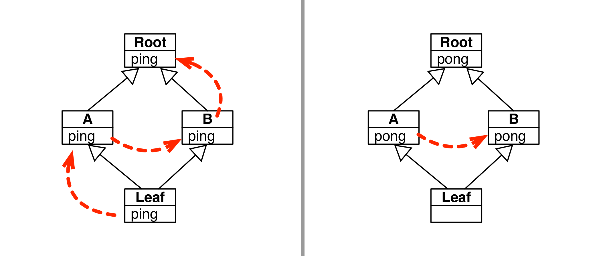
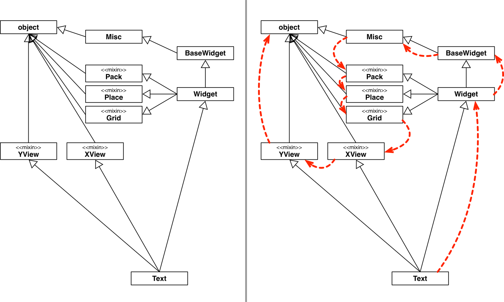
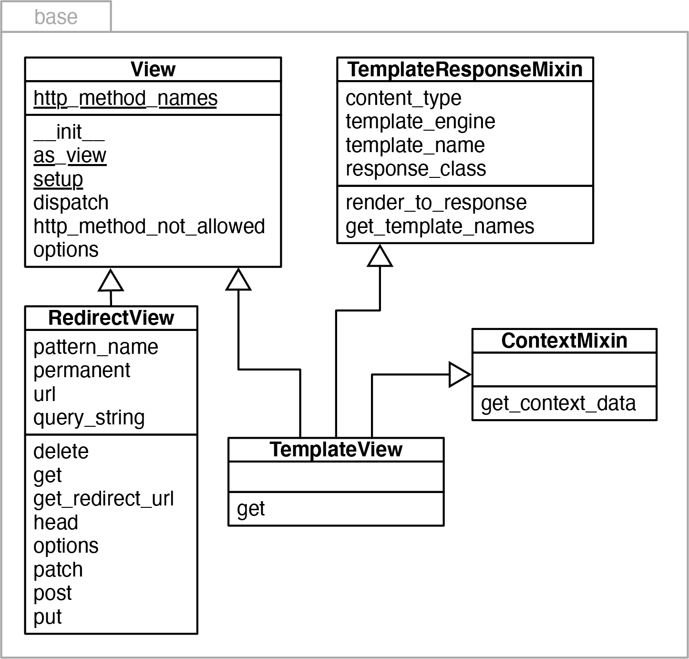
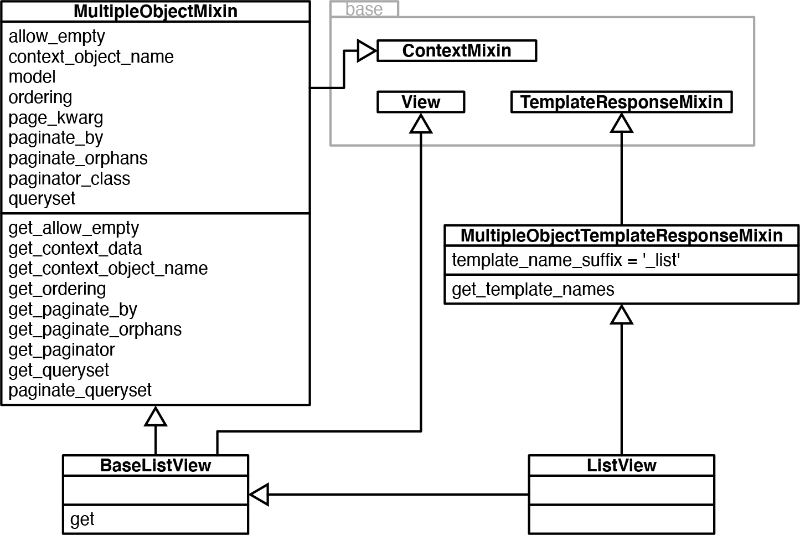
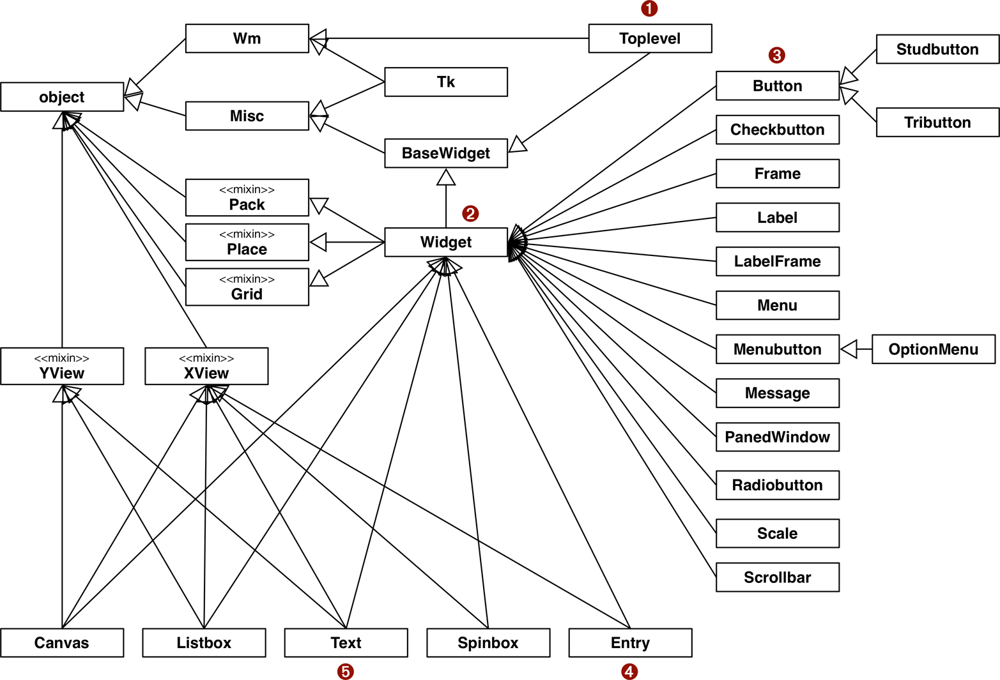

[[ch_inheritance]]
== Herança: para o bem ou para o mal
:example-number: 0
:figure-number: 0

[quote, Alan Kay, Os Primórdios de Smalltalk]
____

[...] precisávamos de toda uma teoria melhor sobre herança (e ainda precisamos).
Por exemplo, herança e instanciação (que é um tipo de herança) confundem
a pragmática (fatorar o código para economizar espaço) quanto a
semântica (usada para tarefas demais, como: especialização, generalização,
especiação, etc.).footnote:[Alan Kay, "The Early History of Smalltalk" (_Os
Primórdios de Smalltalk_), na SIGPLAN Not. 28, 3 (março de 1993), 69&#x2013;95.
Também disponível https://fpy.li/14-1[online]. Agradeço a meu amigo
Christiano Anderson, por compartilhar essa referência quando eu estava
escrevendo este capítulo.]

____

Este((("inheritance and subclassing", "topics covered"))) capítulo é sobre
herança e criação de subclasses. Vou presumir um entendimento básico destes
conceitos, que você pode ter aprendido lendo
https://fpy.li/6w[O Tutorial de Python],
ou trabalhando com outra linguagem orientada a objetos, tal como
Java, C# ou {cpp}. Vamos nos concentrar em quatro características de
Python:

* A função `super()`
* Armadilhas na criação de subclasses de tipos embutidos
* Herança múltipla e a ordem de resolução de métodos
* Classes mixin

Herança múltipla acontece quando uma classe tem mais de uma classe base.
Ela existe em {cpp}, mas não em Java e C#.
Muitos consideram que a herança múltipla não vale
os problemas que causa. Ela foi deliberadamente deixada de fora de
Java, após supostamente ser usada em excesso nos primeiras bases de código em {cpp}.

Este capítulo apresenta a herança múltipla para aqueles que nunca a usaram,
e oferece orientações sobre como lidar com herança simples ou múltipla,
quando necessário.

Em 2021, quando escrevo essas linhas, há uma forte reação contra o uso excessivo
de herança em geral—não apenas herança múltipla—porque superclasses e subclasses
são fortemente acopladas, ou seja, interdependentes. Esse acoplamento forte
significa que modificações em uma classe podem ter efeitos inesperados e de longo
alcance em suas subclasses, tornando os sistemas frágeis e difíceis de entender.

Entretanto, ainda temos que dar manutenção a sistemas existentes, que podem ter
hierarquias de classe complexas, ou trabalhar com frameworks que nos obrigam a
usar herança—algumas vezes até herança múltipla.

Vou ilustrar as aplicações práticas da herança múltipla com a biblioteca padrão,
o framework Django e o toolkit para programação de
interface gráfica Tkinter.

=== Novidades neste capítulo

Não((("inheritance and subclassing", "significant changes to"))) há nenhum
recurso novo no Python relacionado ao tema deste capítulo, mas fiz
inúmeras modificações baseadas nos comentários dos revisores técnicos da segunda
edição, especialmente Leonardo Rochael e Caleb Hattingh.

Escrevi uma nova seção de abertura, tratando especificamente da função embutida
`super()`, e mudei os exemplos na <<mult_inherit_mro_sec>>, para explorar mais
profundamente a forma como `super()` suporta a herança múltipla cooperativa.

A <<mixin_classes_sec>> também é nova. Reorganizei a <<multi_real_world_sec>>,
apresentando exemplos mais simples de _mixin_ na bilbioteca
padrão, antes de apresentar o exemplos com o Django e a 
hierarquia complicada do Tkinter.

Como o próprio título sugere, as ressalvas à herança sempre foram um dos temas
principais desse capítulo. Mas como cada vez mais desenvolvedores consideram
essa técnica problemática, acrescentei alguns parágrafos sobre como evitar a
herança no final da <<inheritance_summary>> e da
<<inheritance_further_reading>>.

Vamos começar com uma revisão da mal compreendida função `super()`.

=== A função super()

O((("inheritance and subclassing", "super() function",
id="IACsuper14")))((("super() function", id="super14")))((("functions", "super() function")))
uso consistente da função embutida `super()` é essencial na criação
de programas orientados a objetos fáceis de manter em Python.

Quando uma subclasse sobrescreve um método de uma superclasse, o novo método
normalmente precisa invocar o método correspondente na superclasse. Aqui está o
modo recomendado de fazer isso, tirado de um exemplo da documentação do módulo
_collections_, na seção
https://fpy.li/6x[OrderedDict: Exemplos e Receitas].:footnote:[A docstring
original estava errada, reportei no https://fpy.li/7e[_issue #141721_],
enviei PR, e traduzi aqui.]

[source, python]
----
class LastUpdatedOrderedDict(OrderedDict):
    """Armazena itens mantendo por ordem de atualização."""

    def __setitem__(self, key, value):
        super().__setitem__(key, value)
        self.move_to_end(key)
----

Para executar sua tarefa, `LastUpdatedOrderedDict` sobrescreve `+__setitem__+` para:

. Usar `+super().__setitem__+`, invocando aquele método na superclasse e
permitindo que ele insira ou atualize o par chave/valor.

. Invocar `self.move_to_end`, para garantir que a `key` atualizada esteja na
última posição.

Invocar um `+__init__+` herdado é particulamente importante, para permitir que a
superclasse execute sua parte na inicialização da instância.

[TIP]
====

Se você aprendeu programação orientada a objetos com Java, deve se lembrar de
que, naquela linguagem, um método construtor invoca automaticamente o construtor
sem argumentos da superclasse. Python não faz isso. Acostume-se a escrever o
seguinte código padrão:

[source, python]
----
    def __init__(self, a, b) :
        super().__init__(a, b)
        ...  # more initialization code
----
====

Você pode já ter visto código que não usa `super()`, e em vez disso invoca o
método na superclasse diretamente, assim:

[source, python]
----
class NotRecommended(OrderedDict):
    """Isto é um contra-exemplo!"""

    def __setitem__(self, key, value):
        OrderedDict.__setitem__(self, key, value)
        self.move_to_end(key)
----

Esta alternativa até funciona nesse caso em particular, mas não é recomendada por duas razões.
Primeiro, codifica a superclasse explicitamente.
O nome `OrderedDict` aparece na declaração `class` e também dentro de
`+__setitem__+`. Se, no futuro, alguém modificar a declaração `class` para mudar
a classe base ou adicionar outra, pode se esquecer de atualizar o corpo de
`+__setitem__+`, introduzindo um bug.

A segunda razão é que `super` implementa lógica para tratar hierarquias de
classe com herança múltipla.
Voltaremos a isso na <<mult_inherit_mro_sec>>.
Para concluir essa recapitulação de `super`, é bom rever como essa função era
invocada no Python 2. Sem os parâmetros default, a assinatura de `super` é mais
reveladora:

[source, python]
----
class LastUpdatedOrderedDict(OrderedDict):
    """Funciona igual em Python 2 e Python 3"""

    def __setitem__(self, key, value):
        super(LastUpdatedOrderedDict, self).__setitem__(key, value)
        self.move_to_end(key)
----

Os dois parâmetros de `super` agora são opcionais.
O compilador de bytecode de Python 3 fornece os argumentos examinando o contexto
quando `super()` é invocado dentro de um método.
Os parâmetros são:

`type`::
    O início do caminho para a superclasse que implementa o método desejado.
    Por default, é a classe onde está o método que invoca `super()`.

`object_or_type`::
    O objeto (ao invocar métodos de instância) ou classe (ao invocar
    métodos de classe) que será o receptor da chamada ao
    método.footnote:[Adotamos o termo "receptor" como tradução para _receiver_,
    que é o objeto `x` vinculado um método `m` no momento da chamada `x.m()`.]
    Por default, é `self` se a chamada `super()` acontece no corpo de um método
    de instância.

A chamada a `super()` devolve um objeto proxy dinâmico que encontra um método (tal
como `+__setitem__+` no exemplo) em uma superclasse do argumento `type` e o
vincula a `object_or_type`, de modo que não precisamos passar explicitamente o
receptor (`self`) quando invocamos o método.

No Python 3, ainda é permitido passar explicitamente o primeiro e o segundo
argumentos a `super()`.footnote:[Também é possível passar apenas o primeiro
argumento, mas isso não é útil e pode logo ser descontinuado, com as bênçãos de
Guido van Rossum, o próprio criador de `super()`. Veja a discussão em
https://fpy.li/14-4[_Is it time to deprecate unbound super methods?_]
(Está na hora de descontinuar métodos "super" não vinculados?).]
Mas eles são necessários apenas em casos especiais, para testes, ou depuração,
ou para contornar algum comportamento indesejado em uma superclasse.

Vamos agora discutir as ressalvas à criação de subclasses de tipos
embutidos.((("", startref="super14")))((("", startref="IACsuper14")))

[[subclass_builtin_woes_sec]]
=== Problemas com subclasses de tipos embutidos

Nas((("inheritance and subclassing", "subclassing built-in types",
id="IASsubbuilt14"))) primeiras versões do Python não era possível criar
subclasses de tipos embutidos como `list` ou `dict`. Desde o Python 2.2 isso é
possível, mas há uma limitação importante: o código em C dos tipos
embutidos normalmente não invoca os métodos sobrescritos por classes definidas
pelo usuário. Há uma boa descrição curta do problema na documentação do PyPy, na
seção _Differences between PyPy and CPython_ (Diferenças entre o PyPy e o
CPython), em https://fpy.li/pypydif[_Subclasses of built-in types_]
(Subclasses de tipos embutidos)]:

[quote]
____
Oficialmente, o CPython não tem nenhuma regra sobre exatamente quando um método
sobrescrito de subclasses de tipos embutidos é ou não invocado implicitamente.
Como uma aproximação, esses métodos nunca são chamados por outros métodos
embutidos do mesmo objeto. Por exemplo, um `+__getitem__+` sobrescrito em uma
subclasse de `dict` nunca será invocado pelo método `get()` do tipo embutido.
____

Concretamente, isto significa que `meu_dict['x']` e `meu_dict.get('x')`
podem produzir resultados diferentes, mesmo no caso mais simples quando
a chave `'x'` existe, supondo que `meu_dict` é uma instância de uma subclasse
de `dict` criada por você.

O <<ex_doppeldict>> ilustra o problema.

[[ex_doppeldict]]
.Nosso `+__setitem__+` sobrescrito é ignorado pelos métodos `+__init__+` e `+__update__+` to tipo embutido `dict`
====
[source, python]
----
>>> class DoppelDict(dict):
...     def __setitem__(self, key, value):
...         super().__setitem__(key, [value] * 2)  # <1>
...
>>> dd = DoppelDict(one=1)  # <2>
>>> dd
{'one': 1}
>>> dd['two'] = 2  # <3>
>>> dd
{'one': 1, 'two': [2, 2]}
>>> dd.update(three=3)  # <4>
>>> dd
{'three': 3, 'one': 1, 'two': [2, 2]}
----
====

<1> `+DoppelDict.__setitem__+` duplica os valores ao armazená-los (por nenhuma
razão, apenas para termos um efeito visível). Ele funciona delegando
para a superclasse.

<2> O método `+__init__+`, herdado de `dict`, claramente ignora que
`+__setitem__+` foi sobrescrito: o valor de `'one'` não foi duplicado.

<3> O operador `[]` invoca nosso `+__setitem__+` e funciona como esperado:
`'two'` está mapeado para o valor duplicado `[2, 2]`.

<4> O método `update` de `dict` também não usa nossa versão de `+__setitem__+`:
o valor de `'three'` não foi duplicado.

Este comportamento dos tipos embutidos viola uma regra básica da
programação orientada a objetos: a busca por métodos deveria sempre começar pela
classe do receptor (`self`), mesmo quando a invocação ocorre dentro de um método
implementado na superclasse. Isso é o que se chama _late binding_ (vinculação tardia),
que Alan Kay—um dos criadores de Smalltalk—considera ser uma
característica essencial da programação orientada a objetos: em qualquer chamada na
forma `x.method()`, o método exato a ser chamado deve ser determinado durante a
execução, baseado na classe do receptor `x`.footnote:[É interessante observar
que o {cpp} diferencia métodos virtuais e não-virtuais. Métodos virtuais têm
vinculação tardia, enquanto os métodos não-virtuais são vinculados na
compilação. Apesar de todos os métodos que podemos escrever em Python serem de
vinculação tardia, como um método virtual, objetos embutidos escritos em C
parecem ter métodos não-virtuais por default, pelo menos no CPython.] Este
triste estado de coisas contribui para os problemas que vimos na
<<inconsistent_missing_sec>>.

O problema não está limitado a chamadas dentro de uma instância—saber se
`self.get()` invoca `+self.__getitem__()+`. Também acontece com métodos
sobrescritos de outras classes que deveriam ser chamados por métodos embutidos.
O <<ex_other_subclass>> foi adaptado da https://fpy.li/14-5[documentação do
PyPy].

[[ex_other_subclass]]
.O `+__getitem__+` de `AnswerDict` é ignorado por `dict.update`
====
[source, python]
----
>>> class AnswerDict(dict):
...     def __getitem__(self, key):  # <1>
...         return 42
...
>>> ad = AnswerDict(a='foo')  # <2>
>>> ad['a']  # <3>
42
>>> d = {}
>>> d.update(ad)  # <4>
>>> d['a']  # <5>
'foo'
>>> d
{'a': 'foo'}
----
====
<1> `+AnswerDict.__getitem__+` sempre devolve `42`, independente da chave.
<2> `ad` é um `AnswerDict` carregado com o par chave-valor `('a', 'foo')`.
<3> `ad['a']` devolve `42`, como esperado.
<4> `d` é uma instância direta de `dict`, que atualizamos com `ad`.
<5> O método `dict.update` ignora nosso `+AnswerDict.__getitem__+`.

[WARNING]
====

Criar subclasses diretamente de tipos embutidos, como `dict`, `list` ou `str`, é
um processo propenso ao erro, pois os métodos embutidos quase sempre ignoram 
métodos sobrescritos pelo usuário. Em vez de criar subclasses de tipos
embutidos, derive suas classes do módulo
https://fpy.li/2w[`collections`], usando
as classes `UserDict`, `UserList`, e `UserString`, que foram projetadas para
serem fáceis de estender.

====

Herdando de `collections.UserDict` em vez de `dict`, os problemas expostos no
<<ex_doppeldict>> e no <<ex_other_subclass>> desaparecem. Veja o
<<ex_userdict_ok>>.

[[ex_userdict_ok]]
.`DoppelDict2` and `AnswerDict2` funcionam como esperado, porque estendem `UserDict` e não `dict`
====
[source, python]
----
>>> import collections
>>>
>>> class DoppelDict2(collections.UserDict):
...     def __setitem__(self, key, value):
...         super().__setitem__(key, [value] * 2)
...
>>> dd = DoppelDict2(one=1)
>>> dd
{'one': [1, 1]}
>>> dd['two'] = 2
>>> dd
{'two': [2, 2], 'one': [1, 1]}
>>> dd.update(three=3)
>>> dd
{'two': [2, 2], 'three': [3, 3], 'one': [1, 1]}
>>>
>>> class AnswerDict2(collections.UserDict):
...     def __getitem__(self, key):
...         return 42
...
>>> ad = AnswerDict2(a='foo')
>>> ad['a']
42
>>> d = {}
>>> d.update(ad)
>>> d['a']
42
>>> d
{'a': 42}
----
====

Como um experimento, para medir o trabalho extra necessário para criar uma
subclasse de um tipo embutido, reescrevi a classe `StrKeyDict` 
(<<ex_strkeydict>> do <<ch_dicts_sets>>),
para torná-la uma subclasse de `dict` em vez de `UserDict`.
Para fazê-la passar pelo mesmo banco de testes, tive que implementar
`+__init__+`, `get`, e `update`, pois as versões herdadas de `dict` se recusaram
a cooperar com os métodos sobrescritos `+__missing__+`, `+__contains__+` e
`+__setitem__+`. A subclasse de `UserDict` no <<ex_strkeydict>> do <<ch_dicts_sets>>
tem 16 linhas, enquanto a subclasse experimental de `dict` acabou com 33 linhas.footnote:[Se
você tiver curiosidade, o experimento está no arquivo
https://fpy.li/14-7[_14-inheritance/strkeydict_dictsub.py_] do repositório
https://fpy.li/code[_fluentpython/example-code-2e_].]

Para deixar claro: esta seção tratou de um problema que se aplica apenas à
delegação a métodos dentro do código em C dos tipos embutidos, e afeta apenas
classes derivadas diretamente daqueles tipos. Se você criar uma subclasse de uma
classe escrita em Python, tal como `UserDict` ou `MutableMapping`, não vai
encontrar este problema.footnote:[Aliás, nesse mesmo tópico, o PyPy se comporta
mais "corretamente" que o CPython, às custas de introduzir uma pequena
incompatibilidade. Veja os detalhes em https://fpy.li/14-5["Differences between
PyPy and CPython" (_Diferenças entre o PyPy e o CPython_)].]

Vamos agora examinar uma questão que aparece na herança múltipla: se uma classe
tem duas superclasses, como Python decide qual atributo usar quando invocamos
`super().attr`, mas ambas as superclasses têm um atributo com este
nome?((("",startref="IASsubbuilt14")))

[[mult_inherit_mro_sec]]
=== Herança múltipla e a Ordem de Resolução de Métodos

Qualquer((("inheritance and subclassing", "multiple inheritance and method resolution order",
id="IASmultiple14")))((("multiple inheritance", "method resolution order and",
id="mulinh14")))((("method resolution order (MRO)", id="methres14")))
linguagem que implemente herança múltipla precisa lidar com o
potencial conflito de nomes, quando superclasses contêm métodos com nomes
iguais. Este é o chamado "problema do losango" (_diamond problem_),
ilustrado na <<diamond_uml>> e no <<ex_diamond>>, onde da hiearquia
começa na classe base `Root` (raiz) e termina na classe `Leaf`
(folha).footnote:[Adotamos a convenção dos computólogos
e desenhamos árvores de cabeça para baixo: a raiz no topo, as folhas na base.]

[[diamond_uml]]
.Esquerda: Sequência de ativação para a chamada `leaf1.ping()`. Direita: Sequência de ativação para a chamada `leaf1.pong()`.

[[ex_diamond]]
.diamond.py: classes `Leaf`, `A`, `B`, `Root` formam o grafo na <<diamond_uml>>
====
[source, python]
----
include::../code/14-inheritance/diamond.py[tags=DIAMOND_CLASSES]
----
====
<1> `Root` fornece `ping`, `pong`, e `+__repr__+` (para facilitar a leitura da saída).
<2> Os métodos `ping` e `pong` na classe `A` chamam `super()`.
<3> Apenas o método `ping` na classe `B` invoca `super()`.
<4> A classe `Leaf` implementa apenas `ping`, e invoca `super()`.

Vejamos agora o efeito da invocação dos métodos `ping` e `pong` em uma instância
de `Leaf` (<<ex_diamond_demo>>).

[[ex_diamond_demo]]
.Doctests para chamadas a `ping` e `pong` em um objeto `Leaf`
====
[source, python]
----
include::../code/14-inheritance/diamond.py[tags=DIAMOND_CALLS]
----
====
<1> `leaf1` é uma instância de `Leaf`.

<2> Chamar `leaf1.ping()` ativa os métodos `ping` em `Leaf`, `A`, `B`, e `Root`,
porque os métodos `ping` nas três primeiras classes chamam `super().ping()`.

<3> Chamar `leaf1.pong()` ativa `pong` em `A` através da herança, que por sua
vez invoca `super.pong()`, ativando `B.pong`.

As sequências de ativação que aparecem no <<ex_diamond_demo>> e na
<<diamond_uml>> são determinadas por dois fatores:

* A ordem de resolução de métodos da classe `Leaf`.
* O uso de `super()` em cada método.

A ordem de resolução de métodos é conhecida pela sigla MRO (_Method Resolution
Order_). Em Python, todas as classes têm um atributo chamado `+__mro__+`, que
armazena uma tupla de referências a superclasses, na ordem de resolução dos
métodos, indo desde a classe corrente até a classe `object`.footnote:[Classes
também têm um método `.mro()`, mas este é um recurso avançado de programaçõa de
metaclasses, mencionado na <<anatomy_of_classes_sec>>. Durante o uso normal de uma
classe, apenas o conteúdo do atributo `+__mro__+` importa.] Para a classe `Leaf`,
o `+__mro__+` é o seguinte:

[source, python]
----
include::../code/14-inheritance/diamond.py[tags=LEAF_MRO]
----

[NOTE]
====

Na <<diamond_uml>>, pode parecer que a MRO descreve uma
https://fpy.li/6y[busca em largura], mas isso é apenas uma
coincidência para esta hierarquia de classes simples. A MRO é computada
por um algoritmo da literatura de computação, chamado C3.
Seu uso no Python está detalhado no artigo
https://fpy.li/14-10[_The Python 2.3 Method Resolution Order_] (A Ordem
de Resolução de Métodos no Python 2.3), de Michele Simionato. É um texto
difícil, mas Simionato escreve: "...a menos que você use herança
múltipla intensivamente, e mantenha hierarquias não-triviais,
não é necessário entender o algoritmo C3,
e você pode facilmente ignorar este artigo."

====

A MRO determina apenas a ordem de ativação, mas se um método específico será ou
não ativado em cada uma das classes vai depender de cada implementação chamar ou
não `super()`.

Considere o experimento com o método `pong`. A classe `Leaf` não sobrescreve
aquele método, então a chamada `leaf1.pong()` ativa a implementação na próxima
classe listada em `+Leaf.__mro__+`: a classe `A`. O método `A.pong` invoca
`super().pong()`. A classe `B` class é e próxima na MRO, portanto `B.pong` é
ativado. Mas aquele método não invoca `super().pong()`, então a sequência de
ativação termina ali.

Além do grafo de herança, a MRO também considera a ordem na qual as
superclasses aparecem na declaração da uma subclasse. Considerando o programa
_diamond.py_ (no <<ex_diamond>>), se a classe `Leaf` fosse declarada como `Leaf(B,
A)`, daí a classe `B` apareceria antes de `A` em `+Leaf.__mro__+`. Isso afetaria
a ordem de ativação dos métodos `ping`, e também faria `leaf1.pong()` ativar
`B.pong` através da herança, mas `A.pong` e `Root.pong` não seriam invocados,
porque `B.pong` não invoca `super()`.

Quando um método invoca `super()`, ele é um método cooperativo. Métodos
cooperativos permitem((("cooperative multiple inheritance"))) a herança
múltipla cooperativa. Esses termos são intencionais: para funcionar, a herança
múltipla no Python exige a cooperação ativa dos métodos envolvidos invocando
`super()`. Na classe `B`, `ping` coopera, mas `pong` não.

[WARNING]
====

Um método não-cooperativo pode ser a causa de bugs sutis. Muitos programadores,
lendo o <<ex_diamond>>, poderiam esperar que, quando o método `A.pong` invoca
`super.pong()`, isso acabaria por ativar `Root.pong`. Mas se `B.pong` for
ativado antes, ele deixa a bola cair. Por isso, recomenda-se que um método
subrescrito `m` de uma classe não-base invoque `super().m()`.

====

Métodos cooperativos devem ter assinaturas compatíveis, porque nunca se sabe se
`A.ping` será chamado antes ou depois de `B.ping`. A sequência de ativação
depende da ordem de `A` e `B` na declaração de cada subclasse que herda de
ambos.

Python é uma linguagem dinâmica, então a interação de `super()` com a MRO também
é dinâmica. O <<ex_diamond2>> mostra um resultado surpreendente desse
comportamento dinâmico.

[[ex_diamond2]]
.diamond2.py: classes para demonstrar a natureza dinâmica de `super()`
====
[source, python]
----
include::../code/14-inheritance/diamond2.py[tags=DIAMOND_CLASSES]
----
====
<1> A classe `A` vem de _diamond.py_ (no <<ex_diamond>>).
<2> A classe `U` não tem relação com `A` ou `Root` do módulo `diamond`.
<3> O que `super().ping()` faz? Resposta: depende. Continue lendo.
<4> `LeafUA` é subclasse de `U` e `A`, nessa ordem.

Se você criar uma instância de `U` e tentar chamar `ping`, ocorre um erro:

[source, python]
----
include::../code/14-inheritance/diamond2.py[tags=UNRELATED_DEMO_1]
----

O objeto `'super'` devolvido por `super()` não tem um atributo `'ping'`, porque
a MRO de `U` tem duas classes: `U` e `object`, e esta última não tem um atributo
chamado `'ping'`.

Entretanto, o método `U.ping` não é completamente inútil. Veja isso:

[source, python]
----
include::../code/14-inheritance/diamond2.py[tags=UNRELATED_DEMO_2]
----

A chamada `super().ping()` em `LeafUA` ativa `U.ping`,
que também coopera chamando `super().ping()`,
ativando `A.ping` e, por fim, `Root.ping`.

Observe que as clsses base de `LeafUA` são `(U, A)`, nesta ordem. Se em vez
disso as bases fossem `(A, U)`, daí `leaf2.ping()` nunca chegaria a `U.ping`,
porque o `super().ping()` em `A.ping` ativaria `Root.ping`, e esse último não
invoca `super()`.

Em um programa real, uma classe como `U` poderia ser uma classe _mixin_: uma
classe projetada para ser usada ao lado outras classes em herança múltipla,
fornecendo funcionalidade adicional. Vamos estudar isso em breve, na
<<mixin_classes_sec>>.

Para((("UML class diagrams", "Tkinter Text widget class and superclasses")))
concluir essa discussão sobre a MRO, a <<tkwidgets_mro_uml>> ilustra parte do
complexo grafo de herança múltipla do toolkit de interface gráfica Tkinter, da
biblioteca padrão de Python.

[[tkwidgets_mro_uml]]
.Esquerda: diagrama UML da classe e das superclasses do componente `Text` do Tkinter. Direita: O longo e sinuoso caminho de `+Text.__mro__+`, desenhado com as setas pontilhadas.

Para estudar a figura, comece pela classe `Text`, na parte inferior. A classe
`Text` implementa um componente de texto completo, editável e com múltiplas
linhas. Ele sozinho fornece muita funcionalidade, mas também herda muitos
métodos de outras classes. A imagem à esquerda mostra um diagrama de classe UML
simples. À direita, a mesma imagem é decorada com setas mostrando a MRO, como
listada no <<ex_tkinter_text_mro>> com a ajuda de uma função de conveniência
`print_mro`.

[[ex_tkinter_text_mro]]
.MRO de `tkinter.Text`
====
[source, python]
----
>>> def print_mro(cls):
...     print(', '.join(c.__name__ for c in cls.__mro__))
>>> import tkinter
>>> print_mro(tkinter.Text)
Text, Widget, BaseWidget, Misc, Pack, Place, Grid, XView, YView, object
----
====

Vamos agora falar sobre mixins.((("", startref="methres14")))((("", startref="mulinh14")))((("", startref="IASmultiple14")))

[role="pagebreak-before less_space"]
[[mixin_classes_sec]]
=== Classes mixin

Uma((("inheritance and subclassing", "mixin classes",
id="IASmixin14")))((("mixin classes", id="mixin14"))) classe mixin é feita
para ser herdada com pelo menos uma outra classe, em um arranjo de
herança múltipla. Uma mixin não é feita para ser a única classe base de uma
classe concreta, pois não fornece toda a funcionalidade para um objeto concreto,
apenas adicionando ou customizando o comportamento de classes filhas ou irmãs.

[NOTE]
====

Classes mixin são uma convenção sem qualquer suporte explícito no Python e no
{cpp}. Ruby permite a definição explícita e o uso de módulos que funcionam como
mixins—coleções de métodos que podem ser incluídas para adicionar funcionalidade
a uma classe. C#, PHP, e Rust implementam traits (_traços_
ou _aspectos_), que são também uma forma explícita de mixin.

====

Vamos ver um exemplo simples e útil de uma classe mixin.

==== Mapeamentos maiúsculos

O <<ex_uppermixin>> mostra a `UpperCaseMixin`, uma((("mappings",
"case-insensitive", id="Mcase14"))) classe criada para fornecer acesso
indiferente a maiúsculas/minúsculas para mapeamentos com chaves do tipo string,
convertendo todas as chaves para maiúsculas quando elas são adicionadas ou
consultadas.

[[ex_uppermixin]]
.uppermixin.py: `UpperCaseMixin` suporta mapeamentos indiferentes a maiúsculas/minúsculas
====
[source, python]
----
include::../code/14-inheritance/uppermixin.py[tags=UPPERCASE_MIXIN]
----
====

<1> Esta função auxiliar recebe uma `key` de qualquer tipo e tenta devolver
`key.upper()`; se isto falha, devolve a `key` inalterada.

<2> A mixin implementa quatro métodos essenciais de mapeamentos, sempre chamando
`super()` após tentar converter a chave em maiúsculas.

Como todos os métodos de `UpperCaseMixin` chamam `super()`, esta mixin depende
de uma classe irmã que implemente ou herde métodos com a mesma assinatura. Para
dar sua contribuição, uma mixin normalmente precisa aparecer antes de outras
classes na MRO de uma subclasse. Na prática, isto significa que mixins
devem aparecer primeiro na tupla de classes base em uma declaração de classe.
O <<ex_upperdict>> apresenta dois exemplos.

[[ex_upperdict]]
.uppermixin.py: duas classes que usam `UpperCaseMixin`
====
[source, python]
----
include::../code/14-inheritance/uppermixin.py[tags=UPPERDICT]
----
====

<1> `UpperDict` não precisa implementar nenhum método, mas
`UpperCaseMixin` tem ser a primeira classe base,
caso contrário os métodos chamados seriam os de `UserDict`.

<2> `UpperCaseMixin` também funciona com `Counter`.

<3> Em vez de `pass`, é melhor fornecer uma docstring para satisfazer
a sintaxe da instrução `class`, que precisa ter um corpo.

Aqui estão alguns doctests de `UpperDict`, do módulo
https://fpy.li/14-11[_uppermixin.py_]:

[source, python]
----
include::../code/14-inheritance/uppermixin.py[tags=UPPERDICT_DEMO]
----

E uma rápida demonstração de `UpperCounter`:

[source, python]
----
include::../code/14-inheritance/uppermixin.py[tags=UPPERCOUNTER_DEMO]
----

`UpperDict` e `UpperCounter` parecem quase mágicas, mas tive que estudar
cuidadosamente o código de `UserDict` e `Counter` para fazer `UpperCaseMixin`
trabalhar com eles.
Por exemplo, minha primeira versão de `UpperCaseMixin` não incluía o método `get`.
Aquela versão funcionava com `UserDict`, mas não com `Counter`.
A classe `UserDict` herda `get` de `collections.abc.Mapping`, e aquele `get`
invoca `+__getitem__+`, que implementei.
Mas as chaves não eram transformadas em maiúsculas quando uma `UpperCounter` era
carregada no `+__init__+`.
Isso acontecia porque `+Counter.__init__+` usa `Counter.update`, que por sua vez
recorre ao método `get` herdado de `dict`. Entretanto, o método `get` na classe
`dict` não invoca `+__getitem__+`.

Esta é a essência do problema discutido na <<inconsistent_missing_sec>>. É também
uma clara demonstração da natureza frágil e quebradiça de programas que se
apoiam no acoplamento forte da herança, mesmo nessa pequena escala.

A próxima seção apresenta vários exemplos de herança múltipla, muitas vezes
usando classes mixin.((("", startref="Mcase14")))((("",
startref="mixin14")))((("", startref="IASmixin14")))

[[multi_real_world_sec]]
=== Herança múltipla no mundo real

No((("inheritance and subclassing", "real-world examples of",
id="IASreal14")))((("multiple inheritance", "real-world examples of",
id="MIreal14"))) livro _Design Patterns_ (Padrões de Projetos),footnote:[Erich
Gamma, Richard Helm, Ralph Johnson, e John Vlissides, _Padrões de Projetos:
Soluções Reutilizáveis de Software Orientados a Objetos_ (Bookman).] quase todo
o código está em {cpp}. O único exemplo de herança múltipla é o padrão
_Adapter_ (Adaptador). Em Python a herança múltipla também não é regra, mas
há exemplos importantes, que comentarei nessa seção.

==== ABCs também são mixins

Na((("collections.abc module", "multiple inheritance in")))((("mixin methods")))
biblioteca padrão de Python, o uso mais visível de herança múltipla é o pacote
`collections.abc`. Nenhuma controvérsia aqui:  afinal, até o Java suporta
herança múltipla de interfaces, e ABCs são declarações de interface que podem,
opcionalmente, fornecer implementações concretas de métodos.footnote:[Como já
mencionado, o Java 8 permite que interfaces também forneçam implementações de
métodos. Esse novo recurso é chamado https://fpy.li/14-12[_Default Methods_]
(Métodos Default) no Tutorial oficial de Java.]

A documentação oficial do pacote
https://fpy.li/6z[`collections.abc`]
chama de _mixin methods_ (métodos mixin) os métodos concretos
implementados nas ABCs de coleções. As ABCs que oferecem métodos
mixin cumprem dois papéis: elas são definições de interfaces e também classes
mixin. Por exemplo, a
https://fpy.li/14-14[«implementação»] de `collections.UserDict` aproveita
vários dos métodos mixin fornecidos por `collections.abc.MutableMapping`.

==== ThreadingMixIn e ForkingMixIn

O pacote https://fpy.li/72[_http.server_]
inclui((("ThreadingMixIn class")))((("ForkingMixIn")))((("HTTPServer class")))((("ThreadingHTTPServer class")))((("servers",
"ThreadingHTTPServer class")))((("servers", "HTTPServer class")))
as classes `HTTPServer` e `ThreadingHTTPServer`.
Esta última foi adicionada ao Python 3.7.
A documentação de `ThreadingHTTPServer` diz (nossa tradução):

____
Esta classe é idêntica a `HTTPServer`, mas trata requisições com threads, 
usando a `ThreadingMixIn`. Isso é útil para lidar com navegadores web que abrem
sockets prematuramente, situação na qual o `HTTPServer` esperaria indefinidamente.
____

As duas linhas abaixo são o
https://fpy.li/14-16[código-fonte completo]
da classe `ThreadingHTTPServer` no Python 3.10:

[source, python]
----
class ThreadingHTTPServer(socketserver.ThreadingMixIn, HTTPServer):
    daemon_threads = True
----

O https://fpy.li/14-17[código-fonte] de `socketserver.ThreadingMixIn` tem 38
linhas, incluindo os comentários e as docstrings.
O <<ex_threadmixin>> apresenta um resumo de sua implementação.

[[ex_threadmixin]]
.Parte de _Lib/socketserver.py_ no Python 3.10
====
[source, python]
----
class ThreadingMixIn:
    """Mixin class to handle each request in a new thread."""

    # 8 linhas omitidas aqui

    def process_request_thread(self, request, client_address):  # <1>
        ... # 6 linhas omitidas aqui

    def process_request(self, request, client_address):  # <2>
        ... # 8 linhas omitidas aqui

    def server_close(self):  # <3>
        super().server_close()
        self._threads.join()
----
====

<1> `process_request_thread` não invoca `super()` porque é um método novo,
não sobrescreve um método herdado. Sua implementação invoca três métodos de
instância que `HTTPServer` implementa ou herda.

<2> Isto sobrescreve o método `process_request`, que `HTTPServer` herda de
`socketserver.BaseServer`, iniciando uma thread e delegando o trabalho real
para a `process_request_thread` que roda naquela thread. O método não invoca
`super()`.

<3> `server_close` invoca `super().server_close()` para parar de receber
requisições, e então espera que as threads iniciadas por `process_request`
terminem sua execução.

A documentação do módulo https://fpy.li/73[`socketserver`]
apresenta a `ThreadingMixIn` e a `ForkingMixIn`.
Esta última classe foi projetada para
suportar servidores concorrentes baseados em
https://fpy.li/74[`os.fork()`],
uma API para iniciar processos filhos, disponível em sistemas derivados do
Unix, compatíveis com a norma https://fpy.li/7c[POSIX].

[[django_cbv_sec]]
==== Mixins de views genéricas no Django

[NOTE]
====

Não é necessário conhecer Django para acompanhar essa seção. Uso uma pequena
parte do framework como um exemplo prático de herança múltipla, e tentarei
fornecer todo o pano de fundo necessário (supondo que você tenha alguma
experiência com desenvolvimento Web no lado servidor, com qualquer linguagem ou
framework).

====

No((("Django generic views mixins", id="Django14"))) Django, uma view é um
objeto invocável que recebe um argumento `request`—um objeto representando uma
requisição HTTP—e devolve um objeto representando uma resposta HTTP. Nosso
interesse  aqui são as diferentes respostas. Elas podem ser tão simples quanto
um redirecionamento, sem nenhum conteúdo em seu corpo, ou tão complexas quanto
uma página de catálogo de uma loja online, renderizada a partir de um template
HTML que exibe múltiplas mercadorias, com botões de compra e links para páginas
com detalhes.

Originalmente, o Django oferecia uma série de funções, chamadas _generic views_ (views genéricas),
que implementavam alguns casos de uso comuns. Por exemplo, muitos sites precisam
exibir resultados de busca que incluem dados de vários itens, com listagens
ocupando múltiplas páginas, cada resultado contendo também  um link para uma
página de informações detalhadas sobre aquele item. No Django, uma view de lista
e uma view de detalhes são feitas para funcionarem juntas, resolvendo esse
problema: uma view de lista renderiza resultados de busca, e uma view de
detalhes produz uma página para cada item individual.

Entretanto, as views genéricas originais eram funções, então não eram
extensíveis. Se quiséssemos algo similar mas não exatamente igual a uma
view de lista genérica, era  preciso começar do zero.

O conceito de views baseadas em classes foi introduzido no Django 1.3,
juntamente com um conjunto de classes de views genéricas divididas em classes
base, mixins e classes concretas prontas para o uso. No Django 3.2, as classes
base e as mixins estão no módulo `base` do pacote `django.views.generic`,
ilustrado((("UML class diagrams", "django.views.generic.base module"))) na
<<django_view_base_uml>>. No topo do diagrama vemos duas classes que se
encarregam de responsabilidades muito diferentes: `View` e
`TemplateResponseMixin`.

[role="width-80"]
[[django_view_base_uml]]
.Diagrama de classes UML do módulo `django.views.generic.base`.

[TIP]
====

Um ótimo recurso para estudar essas classes é o site
https://fpy.li/14-21[_Classy Class-Based Views_], onde você pode navegar
facilmente pelo diagrama das classes, ver todos os métodos em cada classe
(métodos herdados, sobrescritos e adicionados), consultar sua documentação e
estudar seu
https://fpy.li/14-22[código-fonte no GitHub].

====

`View` é a classe base de todas as views (ela poderia ser uma ABC), e oferece
funcionalidade essencial como o método `dispatch`, que delega para métodos de
tratamento de requisições (_request handling_) como `get`, `head`, `post`, etc.,
implementados por subclasses concretas para tratar os diversos verbos
HTTP.footnote:[Os programadores Django sabem que o método de classe `as_view` é
a parte mais visível da interface `View`, mas isso não é relevante para nós
aqui.] A classe `RedirectView` herda apenas de `View`. Note que ela
implementa `get`, `head`, `post`, etc.

Espera-se que as subclasses concretas de `View` implementem os métodos de
tratamento, então por que aqueles métodos não são parte da interface de `View`?
A razão: subclasses são livres para implementar apenas os métodos de tratamento
que querem suportar. Uma `TemplateView` é usada apenas para exibir conteúdo,
então ela implementa apenas `get`. Se uma requisição HTTP `POST` é enviada para
uma `TemplateView`, o método herdado `View.dispatch` verifica que não há um
método de tratamento para `post`, e produz uma resposta HTTP `405 Method Not
Allowed`.footnote:[Se você gosta de padrões de projetos, note que o mecanismo de
despacho do Django é uma variação dinâmica do padrão
https://fpy.li/75[_Template Method_] (Método Template).
Ele é dinâmico porque a classe `View` não obriga
subclasses a implementarem todos os métodos de tratamento, mas `dispatch`
verifica, durante a execução, se um método de tratamento concreto está
disponível para cada requisição específica.]

A `TemplateResponseMixin` fornece funcionalidade que interessa apenas às views
que precisam usar um template. Uma `RedirectView`, por exemplo, não tem
conteúdo, então não precisa de um template e não herda dessa mixin.
`TemplateResponseMixin` fornece comportamentos para `TemplateView`
e outras views que renderizam templates, tal como `ListView`, `DetailView`,
etc., definidas nos subpacotes de `django.views.generic`. A
<<django_view_list_uml>> mostra o módulo `django.views.generic.list`((("UML
class diagrams", "django.views.generic.list module"))) e parte do módulo `base`.

[[django_view_list_uml]]
.Diagrama de classe UML do o módulo `django.views.generic.list`. Aqui as três classes do módulo `base` aparecem recolhidas (veja a <<django_view_base_uml>>). A classe `ListView` não tem métodos ou atributos: é uma classe agregada.

Para usuários do Django, a classe mais importante na <<django_view_list_uml>> é
`ListView`, uma classe agregada sem qualquer código (seu corpo é apenas uma
docstring). Quando instanciada, uma `ListView` tem um atributo de instância
`object_list`, através do qual o código do template pode iterar para montar o
conteúdo da página, normalmente o resultado de uma consulta a um banco de dados,
composto de múltiplos objetos. Toda a funcionalidade relacionada com a geração
deste iterável de objetos vem da `MultipleObjectMixin`. Esta mixin também
oferece uma lógica complexa de paginação—para exibir parte dos resultados em uma
página e links para mais páginas.

Suponha que você queira criar uma view que não vai renderizar um template, mas
sim produzir uma lista de objetos em formato JSON. Para isso existe
`BaseListView`. Ela oferece um ponto inicial de extensão fácil de usar, unindo a
funcionalidade de `View` e de `MultipleObjectMixin`, mas sem a complexidade do
mecanismo de templates.

A API de views baseadas em classes do Django é um exemplo melhor de herança
múltipla que o Tkinter. Em especial, é fácil entender suas classes mixin: cada
uma tem um propósito bem definido, e tseus nomes terminam com o sufixo
`…Mixin`.

Views baseadas em classes não são universalmente aceitas por usuários do Django.
Muitos as usam de forma limitada, como caixas opacas. Mas quando é necessário
criar algo novo, muitos programadores Django continuam criando funções
monolíticas de views, para abarcar todas aquelas responsabilidades, ao invés de
tentar reutilizar as views base e as mixins.

Demora um certo tempo para aprender a usar as views baseadas em classes e a
forma de estendê-las para suprir as necessidades específicas de uma aplicação,
mas considero que vale a pena estudá-las. Elas eliminam muito código repetitivo,
facilitam o reuso de soluções, e melhoram até a comunicação das
equipes—por exemplo, pela definição de nomes padronizados para os templates e
para as variáveis passadas para contextos de templates. Views baseadas em
classes são views do Django "on rails"footnote:[NT: Literalmente "nos trilhos",
mas claramente uma referência ao popular framework _Ruby on Rails_].((("", startref="Django14")))

==== Herança múltipla no Tkinter

Um((("Tkinter GUI toolkit", "multiple inheritance in", id="tinkter14"))) exemplo
extremo de herança múltipla na biblioteca padrão de Python é o
https://fpy.li/76[toolkit de interface gráfica Tkinter]. 
No momento em que escrevo essa seção, o Tkinter já tem 25 anos de idade. Não
é um exemplo das melhores práticas atuais. Mas mostra como a herança múltipla
era usada quando os programadores ainda não conheciam suas desvantagens. E vai
nos servir de contra-exemplo, quando tratarmos de algumas boas práticas, na
próxima seção.

Usei parte da
hierarquia de componentes do Tkinter para ilustrar a MRO na
<<tkwidgets_mro_uml>>. A <<tkinter_uml>> mostra todas as classes de componentes
no pacote base `tkinter` (há mais componentes gráficos no subpacote
https://fpy.li/77[`tkinter.ttk`]).

[[tkinter_uml]]
.Diagrama de classes resumido da hierarquia de classes de interface gráfica do Tkinter; classes marcadas com «mixin» existem para oferecer metodos concretos a outras classes, por herança múltipla.

Considere as seguintes classes na <<tkinter_uml>>:

`① Toplevel`: A classe de uma janela principal em um aplicação Tkinter.

`② Widget`: A superclasse de todos os objetos visíveis que podem ser colocados em uma janela.

`③ Button`: Um componente de botão simples.

`④ Entry`: Um campo de texto editável de uma única linha.

`⑤ Text`: Um campo de texto editável de múltiplas linhas.

Aqui estão as MROs dessas classes, como exibidas pela função `print_mro` do <<ex_tkinter_text_mro>>:

[source, python]
----
>>> import tkinter
>>> print_mro(tkinter.Toplevel)
Toplevel, BaseWidget, Misc, Wm, object
>>> print_mro(tkinter.Widget)
Widget, BaseWidget, Misc, Pack, Place, Grid, object
>>> print_mro(tkinter.Button)
Button, Widget, BaseWidget, Misc, Pack, Place, Grid, object
>>> print_mro(tkinter.Entry)
Entry, Widget, BaseWidget, Misc, Pack, Place, Grid, XView, object
>>> print_mro(tkinter.Text)
Text, Widget, BaseWidget, Misc, Pack, Place, Grid, XView, YView, object
----

[NOTE]
====

Pelos padrões atuais, a hierarquia de classes do Tkinter é profunda demais.
Poucas partes da bilbioteca padrão de Python tem mais que três ou quatro níveis
de classes concretas, e o mesmo pode ser dito da biblioteca de classes de Java.
Entretanto, é interessante observar que algumas das hierarquias mais profundas
da biblioteca de classes de Java são precisamente os pacotes relacionados à
programação de interfaces gráficas:
https://fpy.li/14-26[`java.awt`] e
https://fpy.li/14-27[`javax.swing`].
O https://fpy.li/14-28[Squeak], 
uma versão moderna e aberta de Smalltalk, inclui o poderoso e inovador toolkit
de interface gráfica Morphic, também com uma hierarquia de classes profunda. Na
minha experiência, é nos toolkits de interface gráfica que a herança é mais
útil.

====

Observe como essas classes se relacionam com outras:

* `Toplevel` é a única classe gráfica que não herda de `Widget`, porque ela é a
janela primária e não se comporta como um componente; por exemplo, ela não pode
ser fixada a uma janela ou moldura (_frame_). `Toplevel` herda de `Wm`, que
fornece funções de acesso direto ao gerenciador de janelas do ambiente gráfico
do sistema operacional, para tarefas como definir o título da janela e
configurar suas bordas.

* `Widget` herda diretamente de `BaseWidget` e de `Pack`, `Place`, e `Grid`. As
últimas três classes são gerenciadores de geometria: são responsáveis por
organizar componentes dentro de uma janela ou moldura. Cada uma delas encapsula
uma estratégia de layout e uma API de colocação de componentes diferente.

* `Button`, como a maioria dos componentes, descende diretamente apenas de
`Widget`, mas indiretamente de `Misc`, que fornece dezenas de métodos para todos
os componentes.

* `Entry` é subclasse de `Widget` e `XView`, que suporta rolagem horizontal.

* `Text` é subclasse de `Widget`, `XView` e `YView` (para rolagem vertical).

Vamos agora discutir algumas boas práticas de herança múltipla e examinar
como o Tkinter se comporta.((("", startref="tinkter14")))((("",
startref="IASreal14")))((("", startref="MIreal14")))

[role="pagebreak-before less_space"]
=== Lidando com a herança

Aquilo((("inheritance and subclassing", "best practices", id="IAScop14"))) que
Alan Kay escreveu na epígrafe continua sendo verdade: ainda não existe um teoria
geral sobre herança que guie os programadores. O que temos são regras
gerais, padrões de projetos, "melhores práticas", acrônimos perspicazes, tabus,
etc. Alguns desses nos dão orientações úteis, mas nenhum deles é universalmente
aceito ou sempre aplicável.

É fácil criar projetos frágeis e incompreensíveis usando herança, mesmo sem
herança múltipla. Como não temos uma teoria abrangente, aqui estão algumas dicas
para evitar diagramas de classes parecidos com um prato de espaguete.

[[favor_composition_sec]]
==== Prefira a composição de objetos à herança de classes

O título desta seção é o segundo princípio do design orientado a objetos, do
livro _Padrões de Projetos_,footnote:[Esse princípio aparece na página 20 da
introdução, na edição em inglês.] e é o melhor conselho que posso oferecer aqui.
Uma vez que você se sinta confortável com a herança, é fácil usá-la em excesso.
Colocar objetos em uma hierarquia elegante apela para nosso senso de ordem;
programadores fazem isso por pura diversão.

Preferir a composição leva a designs mais flexíveis. Por exemplo, no caso da
classe `tkinter.Widget`, em vez de herdar os métodos de todos os gerenciadores
de geometria, instâncias do componente poderiam manter uma referência para um
gerenciador de geometria, e invocar seus métodos. Afinal, um `Widget` não
deveria "ser" um gerenciador de geometria, mas poderia usar os serviços de um
deles por delegação. E daí você poderia adicionar um novo gerenciador de
geometria sem afetar a hierarquia de classes do componente e sem se preocupar
com colisões de nomes. Mesmo com herança simples, este princípio aumenta a
flexibilidade, porque a subclasses são uma forma de acoplamento forte, e árvores
de herança muito altas tendem a ser quebradiças.

A composição e a delegação podem substituir o uso de mixins para tornar
comportamentos disponíveis para diferentes classes, mas não podem substituir o
uso de herança de interfaces para definir uma hierarquia de tipos.

==== Entenda o motivo de usar herança em cada caso

Ao lidarmos com herança múltipla, é útil ter claras as razões pelas quais
subclasses são criadas em cada caso específico. As principais razões são:

* Herança de interface cria um subtipo, implicando em uma relação _é-um_.
A melhor forma de fazer isso é usando ABCs.

* Herança de implementação evita duplicação de código pela reutilização.
Mixins podem ajudar nisso.

Na prática, frequentemente as duas razões coexistem, mas quando você puder
tornar a intenção clara, faça isso. Herança para reutilização de código é um
detalhe de implementação, e muitas vezes pode ser substituída por composição e
delegação. Por outro lado, herança de interfaces é o fundamento de qualquer
framework. Idealmente, a herança de interfaces deveria usar apenas ABCs como
classes base.

==== Torne a interface explícita com ABCs

No Python moderno, se uma classe tem por objetivo definir uma interface, ela
deveria ser explicitamente uma ABC ou uma subclasse de `typing.Protocol`. Uma
ABC deveria ser subclasse apenas de `abc.ABC` ou de outras ABCs. A herança
múltipla de ABCs não é problemática.

==== Use mixins explícitas para reutilizar código

Se uma classe é projetada para fornecer implementações de métodos para
reutilização por múltiplas subclasses não relacionadas, sem implicar em uma
relação do tipo _é-uma_, ele deveria ser uma classe mixin explícita. No Python,
não há uma maneira formal de declarar uma classe como mixin. Por isso, recomendo
que seus nomes incluam o sufixo `Mixin`. Conceitualmente, uma mixin não define
um novo tipo; ela simplesmente empacota métodos para reutilização. Uma mixin não
deveria nunca ser instanciada, e classes concretas não devem herdar apenas de
uma mixin. Cada mixin deveria fornecer um único comportamento específico,
implementando poucos métodos intimamente relacionados. Mixins devem evitar
manter qualquer estado interno; isto é, uma classe mixin não deve ter atributos
de instância.

[[aggregate_class_sec]]
==== Ofereça classes agregadas aos usuários

[quote, Grady Booch et al., Object-Oriented Analysis and Design with Applications]
____

Uma classe construída principalmente herdando de mixins, sem adicionar estrutura
ou comportamento próprios, é chamada de _classe agregada_.footnote:[Grady Booch
et al., "Object-Oriented Analysis and Design with Applications" (_Análise e
Projeto Orientados a Objetos, com Aplicações_), 3ª ed. (Addison-Wesley),  p.
109.]

____

Se alguma combinação de ABCs ou mixins for especialmente útil para o código cliente, ofereça uma classe que una essas funcionalidades de uma forma sensata.

Por exemplo, aqui está o https://fpy.li/14-29[código-fonte] completo
da classe `ListView` do Django, do canto inferior direito da <<django_view_list_uml>>:

[source, python]
----
class ListView(MultipleObjectTemplateResponseMixin, BaseListView):
    """
    Render some list of objects, set by `self.model` or `self.queryset`.
    `self.queryset` can actually be any iterable of items, not just a
    queryset.
    """
----

O corpo de `ListView` é vaziofootnote:[NT: a doctring diz "Renderiza alguma
lista de objetos, definida por `self.model` ou `self.queryset`. `self.queryset`
na pode ser qualquer iterável de itens, não apenas um queryset."], mas a
classe fornece um serviço útil: ela une uma mixin e uma classe base que devem
ser usadas em conjunto.

Outro exemplo é https://fpy.li/14-30[`tkinter.Widget`], que tem quatro classes
base e nenhum método ou atributo próprios—apenas uma docstring. Graças à classe
agregada `Widget`, podemos criar um novo componente com as mixins necessárias,
sem precisar descobrir em que ordem elas devem ser declaradas para funcionarem
como desejado.

Note que classes agregadas não precisam ser inteiramente vazias (mas
frequentemente são).

==== Só crie subclasses de classes feitas para serem herdadas

Em um comentário sobre esse capítulo, o revisor técnico Leonardo Rochael sugeriu
o alerta abaixo.

[WARNING]
====

Criar subclasses e sobrescrever métodos de qualquer classe complexa é um
processo muito suscetível a erros, porque os métodos da superclasse podem
ignorar inesperadamante métodos sobrescritos na subclasse. Sempre que
possível, evite sobrescrever métodos, ou pelo menos limite-se a criar
subclasses de classes projetadas para serem facilmente estendidas, e apenas
daquelas formas pelas quais a classe foi desenhada para ser estendida.

====

É um ótimo conselho, mas como descobrimos se uma classe foi projetada para ser
estendida?

A primeira resposta é a documentação (algumas vezes na forma de docstrings ou
até de comentários no código). Por exemplo, o pacote
https://fpy.li/78[`socketserver`] de Python é descrito como "um framework
para servidores de rede". Sua classe
https://fpy.li/79[`BaseServer`] foi
projetada para a criação de subclasses, como o próprio nome sugere. E mais
importante, a documentação e a
https://fpy.li/14-33[docstring] no
código-fonte da classe informa explicitamente quais de seus métodos foram
criados para serem sobrescritos por subclasses.

No Python ≥ 3.8 uma nova forma de tornar tais restrições de projeto explícitas
foi oferecida pela
https://fpy.li/pep591[_PEP 591—Adding a final qualifier to
typing_] (Acrescentando um qualificador "final" à tipagem).
A PEP introduz um decorador
https://fpy.li/7a[`@final`], que pode ser aplicado a classes ou a
métodos individuais, para que IDEs ou checadores de tipos possam detectar
tentativas de criar subclasses de classes ou de sobrescrever métodos
que não foram projetados para serem herdadas ou sobrescritos.footnote:[A
PEP 591 também introduz uma anotação https://fpy.li/7d[`Final`] para
variáveis e atributos que não devem ser reatribuídos ou sobrescritos.]

==== Evite criar subclasses de classes concretas

Criar subclasses de classes concretas é mais perigoso que criar subclasses de
ABCs e mixins, pois instâncias de classes concretas normalmente têm um estado
interno, que pode ser corrompido quando sobrescrevemos métodos que
interferem naquele estado. Mesmo se nossos métodos cooperarem chamando `super()`,
e o estado interno seja protegido através da sintaxe `__x`, restarão ainda
inúmeras formas pelas quais sobrescrever um método pode introduzir bugs.

No texto <<waterfowl_essay>> (<<goose_typing_sec>>), Alex Martelli cita _More Effective {cpp}_, de Scott
Meyer, que diz: "toda classe não-final (não-folha) deveria ser abstrata". Em
outras palavras, Meyer recomenda que subclasses deveriam ser criadas apenas a
partir de classes abstratas.

Se você precisar usar subclasses para reutilização de código, então o código a
ser reutilizado deve estar em métodos mixin de ABCs, ou em classes mixin
explicitamente nomeadas.

Vamos agora analisar o Tkinter do ponto de vista destas recomendações.

==== Tkinter: o bom, o mau e o feio

A maioria dos conselhos da seção anterior não são seguidos pelo Tkinter, com a
notável exceção de oferecer classes agregadas (<<aggregate_class_sec>>). E
mesmo assim, este não é um grande exemplo, pois a composição provavelmente
funcionaria melhor para integrar os gerenciadores de geometria a `Widget`, como
discutido na <<favor_composition_sec>>.

Mas((("Tkinter GUI toolkit", "benefits and drawbacks of"))) lembre-se que o
Tkinter é parte da biblioteca padrão desde o Python 1.1, lançado em 1994. O
Tkinter é uma fachada em Python para o toolkit de GUI Tk, escrito na linguagem
Tcl. O combo Tcl/Tk não é, na origem, orientado a objetos, então a API Tk é
basicamente um imenso catálogo de funções. Entretanto, o toolkit é
conceitualmente orientado a objetos, apesar de não usar classes na implementação
original em Tcl.

A docstring de `tkinter.Widget` começa com as palavras "Internal class" (Classe
interna). Isto sugere que `Widget` deveria provavelmente ser uma ABC. Apesar da
classe `Widget` não ter métodos próprios, ela define uma interface. Sua mensagem
é: "Você pode contar que todos os componentes do Tkinter vão oferecer os métodos
básicos de componente (`+__init__+`, `destroy`, e dezenas de funções da API Tk),
além dos métodos de todos os três gerenciadores de geometria". Vamos combinar
que essa não é uma boa definição de interface (é abrangente demais), mas ainda
assim é uma interface, e `Widget` a "define" como a união das interfaces de suas
superclasses.

A classe `Tk`, que encapsula a lógica da aplicação gráfica, herda de `Wm` e
`Misc`, nenhuma das quais é abstrata ou mixin (`Wm` não é uma mixin típica,
porque `TopLevel` é subclasse apenas dela). O nome da classe `Misc` é, por sí
só, um mau sinal. `Misc` tem mais de 100 métodos, e todos os componentes herdam
dela. Por que é necessário que cada um dos componentes tenham métodos para
tratamento do clipboard, seleção de texto, gerenciamento de timer e coisas
assim? Não é possível colar algo em um botão ou selecionar texto de uma barra de
rolagem. `Misc` deveria ser dividida em várias classes mixin especializadas, e
nem todos os componentes deveriam herdar de todas aquelas mixins.

Para ser justo, como usuário do Tkinter você não precisa, de forma alguma,
entender ou usar herança múltipla. Ela é um detalhe de implementação, oculto
atrás das classes de componentes que serão instanciadas ou usadas como base para
subclasses em seu código. Mas você sofrerá as consequências da herança múltipla
excessiva quando digitar `dir(tkinter.Button)` e tentar encontrar um método
específico em meio aos 214 atributos listados. E terá que enfrentar a
complexidade, caso decida implementar um novo componente Tk.

[TIP]
====

Apesar de ter problemas, o Tkinter é estável, flexível, e fornece um visual
moderno se você usar o pacote `tkinter.ttk` e seus componentes tematizados. Além
disso, alguns dos componentes originais, como `Canvas` e `Text`, são
incrivelmente poderosos. Em poucas horas é possível transformar um objeto
`Canvas` em uma aplicação de desenho razoavelmente completa. Se você se
interessa pela programação de interfaces gráficas, com certeza vale a pena
estudar o Tkinter e o Tcl/Tk.

====

Aqui termina nossa viagem através do labirinto da herança.((("", startref="IAScop14")))

[[inheritance_summary]]
=== Resumo do capítulo

Este((("inheritance and subclassing", "overview of"))) capítulo começou com uma
revisão da função `super()` no contexto de herança simples. Daí discutimos o
problema da criação de subclasses de tipos embutidos: seus métodos nativos,
implementados em C, não invocam os métodos sobrescritos em subclasses, exceto em
uns poucos casos especiais. É por isso que, quando precisamos de tipos `list`,
`dict`, ou `str` customizados, é mais fácil criar subclasses de `UserList`,
`UserDict`, ou `UserString (todos definidos no módulo
https://fpy.li/2w[`collections`]), que encapsulam os tipos embutidos
correspondentes e delegam operações para aqueles—três exemplos a favor da
composição sobre a herança na biblioteca padrão. Se o comportamento desejado for
muito diferente daquilo que os tipos embutidos oferecem, pode ser mais fácil
criar uma subclasse da ABC apropriada em
https://fpy.li/6z[`collections.abc`],
e escrever sua própria implementação.

O restante do capítulo foi dedicado à faca de dois gumes da herança múltipla.
Primeiro vimos como a ordem de resolução de métodos, definida no atributo de
classe `+__mro__+`, trata o problema de conflitos potenciais de nomes em métodos
herdados. Também examinamos como a função embutida `super()` se comporta em
hierarquias com herança múltipla, e como ela às vezes tem um comportamento
surpreendente. O comportamento de `super()` foi projetado para suportar classes
mixin, que estudamos usando o exemplo simples de `UpperCaseMixin` (para
mapeamentos indiferentes a maiúsculas/minúsculas).

Exploramos como a herança múltipla e os métodos mixin são usados nas ABCs de
Python, bem como na construção de servidores HTTP com mixins baseados em threads
e forks de `socketserver`. Usos mais complexos de herança múltipla foram
exemplificados com as views baseadas em classes do Django e com o toolkit de
interface gráfica Tkinter. Apesar do Tkinter não ser um exemplo das melhores
práticas modernas, é um exemplo de hierarquias de classe complexas que podemos
encontrar em sistemas legados.

Encerrando o capítulo, apresentamos sete recomendações para lidar com herança,
e aplicamos alguns daqueles conselhos em um comentário sobre a hierarquia de
classes do Tkinter.

Rejeitar a herança—mesmo a herança simples—é uma tendência moderna. Go é uma das
mais bem sucedidas linguagens criadas no século 21. Ela não inclui um elemento
chamado "classe", mas você pode construir tipos que são estruturas (_structs_)
de campos encapsulados, e associar métodos a essas estruturas. Em Go é possível
definir interfaces, que são checadas pelo compilador usando tipagem estrutural,
também conhecida como((("static duck typing"))) tipagem pato estática—algo
muito similar ao que temos com os tipos protocolo desde o Python 3.8. Essa
linguagem também tem uma sintaxe especial para a criação de tipos e interfaces
por composição, mas não há suporte a herança—nem entre interfaces.

Então talvez o melhor conselho sobre herança seja: evite-a se puder. Mas,
frequentemente, não temos essa opção: os frameworks que usamos nos impõe suas
escolhas de design.

[[inheritance_further_reading]]
=== Para saber mais

[quote, Hynek Schlawack, "Subclassing in Python Redux"]
____

No que diz respeito à legibilidade, composição feita adequadamente é
superior a herança. Como é mais frequente ler o código que escrevê-lo, como
regra geral evite subclasses, mas em especial não misture os vários tipos de
herança e não crie subclasses para compartilhar código.

____

Durante((("inheritance and subclassing", "further reading on"))) a revisão final
desse livro, o revisor técnico Jürgen Gmach recomendou o post
https://fpy.li/14-37[_Subclassing in Python Redux_]
(O ressurgimento das subclasses em Python), de Hynek Schlawack—a fonte da citação acima.
Schlawack
é o autor do popular pacote _attrs_, e foi um dos principais contribuidores do
framework de programação assíncrona Twisted, um projeto criado por Glyph
Lefkowitz em 2002. De acordo com Schlawack, após algum tempo os desenvolvedores
perceberam que haviam criado subclasses em excesso no projeto. O post é longo, e
cita outros posts e palestras importantes. Muito recomendado.

Naquela mesma conclusão, Hynek Schlawack escreve: "Não esqueça que, na maioria
dos casos, tudo o que você precisa é de uma função." Concordo, e é precisamente
por essa razão que _Python Fluente_ trata em detalhes das funções, antes de
falar de classes e herança. Meu objetivo foi mostrar o quanto você pode alcançar
com funções se valendo das classes na biblioteca padrão, antes de criar suas
próprias classes.

A criação de subclasses de tipos embutidos, a função `super`, e recursos
avançados como descritores e metaclasses, foram todos introduzidos no artigo
https://fpy.li/descr101[_Unifying types and classes in Python 2.2_]
(Unificando tipos e classes em Python 2.2), de Guido van Rossum. Desde então, nada
realmente importante mudou nesses recursos. Python 2.2 foi uma proeza fantástica
de evolução da linguagem, adicionando vários novos recursos poderosos em um todo
coerente, sem quebrar a compatibilidade com versões anteriores. Os novos recursos
eram 100% opcionais. Para usá-los, bastava programar explicitamente uma
subclasse de direta ou indirta de `object`, para criar uma assim chamada
_new-style class_ (classe no novo estilo) . No Python 3,
todas as classes são subclasses de `object`.

O _Python Cookbook_, 3ª ed., de David Beazley e Brian K. Jones (O'Reilly) inclui
várias receitas mostrando o uso de `super()` e de classes mixin. Você pode
começar pela esclarecedora seção
https://fpy.li/14-38[_8.7. Calling a Method on a Parent Class_]
(Invocando um método em uma superclasse), e seguir as
referências internas a partir dali.

O post https://fpy.li/14-39[_Python's super() considered super!_]
(O _super() de Python é mesmo super!)], de Raymond Hettinger, explica o funcionamento de
`super` e a herança múltipla de uma perspectiva positiva. Ele foi escrito em
resposta a 
https://fpy.li/14-40[_Python's Super is nifty, but you can't use it (Previously: Python's Super Considered Harmful)_]
(O super de Python é bacana, mas você não deve usá-lo (Antes: super de Python considerado nocivo)), de James
Knight. A resposta de Martijn Pieters a
https://fpy.li/14-41[_How to use super() with one argument?_]
(Como usar super() com um só argumento?)
inclui uma explicação concisa e aprofundada de `super`, incluindo sua relação
com descritores, um conceito que estudaremos apenas no <<ch_descriptors>>. 
Assim é `super`: simples de usar nos casos básicos, mas também
uma ferramenta poderosa e complexa, que alcança alguns dos recursos dinâmicos
mais avançados de Python, raramente encontrados em outras linguagens.

Apesar dos títulos daqueles posts, o problema não é exatamente a função
embutida `super`—que no Python 3 ficou mais fácil de usar do que era no Python 2.
A questão real é a herança múltipla, algo inerentemente complicado e traiçoeiro.
Michele Simionato vai além da crítica, e de fato oferece uma solução em seu
https://fpy.li/14-42[_Setting Multiple Inheritance Straight_]
(Colocando a herança múltipla em seu devido lugar):
ele implementa _traits_ ("traços"), uma forma explícita de mixin originada na linguagem Self.
Simionato escreveu, em seu blog, uma longa série de posts sobre herança múltipla em Python, incluindo
https://fpy.li/14-43[_The wonders of cooperative inheritance, or using super in Python 3_]
(As maravilhas da herança cooperativa, ou usando super em Python 3);
https://fpy.li/14-44[_Mixins considered harmful, part 1_]
(Mixins consideradas nocivas, parte 1) e
https://fpy.li/14-45[_part 2_];
e https://fpy.li/14-46[_Things to Know About Python Super, part 1_]
(O que você precisa saber sobre o super de Python),
https://fpy.li/14-47[_part 2_], e
https://fpy.li/14-48[_part 3_].
Os posts mais antigos usam a sintaxe de `super` de Python 2, mas ainda são relevantes.

Li a primeira edição do _Object-Oriented Analysis and Design_, 3ª ed., de
Grady Booch et al., e o recomendo fortemente como uma introdução geral ao
pensamento orientado a objetos, independente da linguagem de programação. É um
dos raros livros que trata da herança múltipla sem preconceitos.

Hoje, mais que nunca, aconselha-se evitar a herança. Então cá estão duas
referências sobre como fazer isso. Brandon Rhodes escreveu
https://fpy.li/14-49[_The Composition Over Inheritance Principle_]
(O princípio da composição antes da herança), parte de seu excelente guia
https://fpy.li/14-50[_Python Design Patterns_]
(Padrões de Projetos no Python). Augie Fackler e Nathaniel Manista apresentaram
https://fpy.li/14-51[_The End Of Object Inheritance & The Beginning Of A New Modularity_]
(O Fim da Herança de Objetos & O Início de Uma Nova Modularidade)
na PyCon 2013. Fackler e Manista falam sobre organizar sistemas em torno de
interfaces e das funções que lidam com os objetos que implementam aquelas
interfaces, evitando o acoplamento forte e os pontos de falha de classes e da
herança. Isso me lembrou muito a maneira de pensar do Go, mas aqui os autores a
defendem para Python.

.Soapbox
****

**Pense nas classes realmente necessárias**

[quote, Alan Kay, The Early History of Smalltalk ("Os Primórdios de Smalltalk")]
____

[...] começamos a defender a ideia de herança como uma maneira de permitir que
iniciantes pudessem construir [algo] a partir de frameworks que só poderiam ser
projetadas por especialistasfootnote:[Alan Kay, _The Early History of Smalltalk_
(Os Promórdios de Smalltalk), na SIGPLAN Not. 28, 3 (março de 1993),
69&#x2013;95. Também disponível https://fpy.li/14-1[online]. Agradeço a meu
amigo Cristiano Anderson, que compartilhou esta referência quando eu estava
escrevendo esse capítulo)].

____

A((("inheritance and subclassing", "Soapbox discussion",
id="IASsoap14")))((("Soapbox sidebars", "multilevel class hierarchies"))) imensa
maioria dos programadores escreve aplicações, não frameworks. Mesmo aqueles que
escrevem frameworks provavelmente passam boa parte de seu tempo
escrevendo aplicações. Quando escrevemos aplicações, normalmente não precisamos
criar hierarquias de classes. No máximo escrevemos classes que são subclasses de
ABCs ou de outras classes oferecidas pelo framework. Como desenvolvedores de
aplicações, é muito raro precisarmos escrever uma classe que funcionará como
superclasse de outra. Quase sempre as classes que escrevemos são classes
folha: classes concretas sem subclasses.

Se, trabalhando como desenvolvedor de aplicações, você se pegar criando
hierarquias de classe de múltiplos níveis, aposto que está vivendo uma destas
situações:

* Você está reinventando a roda. Procure um framework ou biblioteca que forneça
componentes você possa reutilizar em sua aplicação.

* Você está usando um framework mal projetado. Procure uma alternativa.

* Você está complicando demais. Lembre-se((("KISS principle"))) do
_Princípio KISS_.

* Você ficou entediado programando aplicações e decidiu criar um novo framework.
Parabéns e boa sorte!

Também é possível que todas as alternativas acima descrevam situação:
você ficou entediado e decidiu reinventar a roda, escrevendo seu próprio
framework mal projetado e excessivamente complexo, e está sendo forçado a
programar classe após classe para resolver problemas triviais. Espero que você
esteja se divertindo, ou pelo menos que esteja sendo pago para fazer isso.

**Tipos embutidos mal-comportados: bug ou _feature_?**

Os((("Soapbox sidebars", "trade-offs of built-ins"))) tipos embutidos `dict`,
`list`, e `str` são blocos básicos essenciais do próprio Python, então precisam
ser rápidos—qualquer problema de desempenho ali teria severos impactos em
praticamente todo o resto. É por isso que o CPython adotou atalhos que fazem com
que muitos métodos embutidos escritos em C se comportem mal, ao não cooperarem
com os métodos sobrescritos por subclasses em Python. 

Uma solução para este dilema seria oferecer duas implementações para cada um
desses tipos: uma "interno", otimizada para uso pelo interpretador, e uma externa,
facilmente extensível. 

Mas veja só, isso nós já temos: `UserDict`, `UserList`, e `UserString` não são
tão rápidos quanto seus equivalentes embutidos, mas são fáceis de estender. A
abordagem pragmática tomada pelo CPython significa que também podemos usar, em
nossas próprias aplicações, as implementações altamente otimizadas mas difíceis
estender. E isso faz sentido, considerando que não é tão frequente precisarmos
de um mapeamento, uma lista ou uma string customizados, mas usamos `dict`,
`list`, e `str` diariamente. Só precisamos estar cientes dos compromissos
envolvidos.

**Herança através das linguagens**

Alan Kay((("Soapbox sidebars", "inheritance across languages"))) criou o termo
"orientado a objetos", e Smalltalk tinha apenas herança simples, apesar de
existirem versões com diferentes formas de suporte a herança múltipla, incluindo
os dialetos modernos de Smalltalk, Squeak e Pharo, que suportam _traits_
("traços")—um dispositivo de linguagem que pode substituir classes mixin, mas
evita alguns dos problemas da herança múltipla.

A primeira linguagem popular a implementar herança múltipla foi o {cpp}, e esse
recurso foi abusado o suficiente para que o Java—criado para ser um substituto
do {cpp}—fosse projetado sem suporte a herança múltipla de implementação (isto
é, sem classes mixin). Quer dizer, isso até o Java 8 (e Kotlin) permitir métodos
default, que que aproximam suas interfaces do conceito de classes abstratas
que temps em Python e {cpp}.

Outras linguagens que suportam _traits_ são versões recentes de PHP e Groovy,
bem como Rus, Scala, t e Raku—a linguagem antes conhecida como Perl 6.footnote:[Meu amigo
e revisor técnico Leonardo Rochael explica isso melhor do que eu poderia: "A
existência continuada junto com o persistente adiamento da chegada do Perl 6
estava drenando a força de vontade da evolução do próprio Perl. Agora o Perl
continua a ser desenvolvido como uma linguagem separada (está na versão 5.34),
sem a ameaça de ser descontinuada pela linguagem antes conhecida como Perl 6."]
Então podemos dizer que _traits_ estão na moda em 2021.

Ruby traz uma perspectiva original para a herança múltipla: não a suporta, mas
introduz mixins como um recurso explícito da linguagem. Uma classe Ruby pode
incluir um módulo em seu corpo, e aí os métodos definidos no módulo se tornam
parte da implementação da classe. Essa é uma forma "pura" de mixin, sem herança
envolvida, e está claro que uma mixin em Ruby não influencia o tipo da classe
onde que a utiliza. Isto oferece os benefícios das mixins, evitando muitos de
seus problemas mais comuns.

Duas novas linguagens orientadas a objetos que estão recebendo muita atenção
limitam severamente a herança: Go e Julia. Ambas giram em torno de programar
"objetos" implementando "métodos", e suportam https://fpy.li/7b[polimorfismo],
mas evitam o termo "classe".

Go não tem nenhum tipo de herança, mas oferece uma sintaxe que facilita a
composição de suas interfaces e structs. Julia tem uma hierarquia de tipos, mas
subtipos não podem herdar estrutura, só comportamentos, e só é permitido
criar subtipos de tipos abstratos. Além disso, os métodos de Julia são
implementados com despacho múltiplo—uma forma mais avançada do mecanismo de
despacho único que vimos na <<single_dispatch_sec>>.((("",
startref="IASsoap14")))

****
