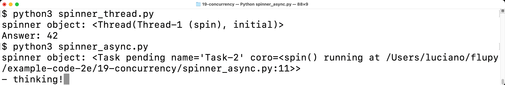
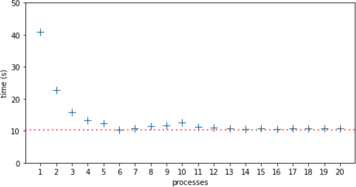
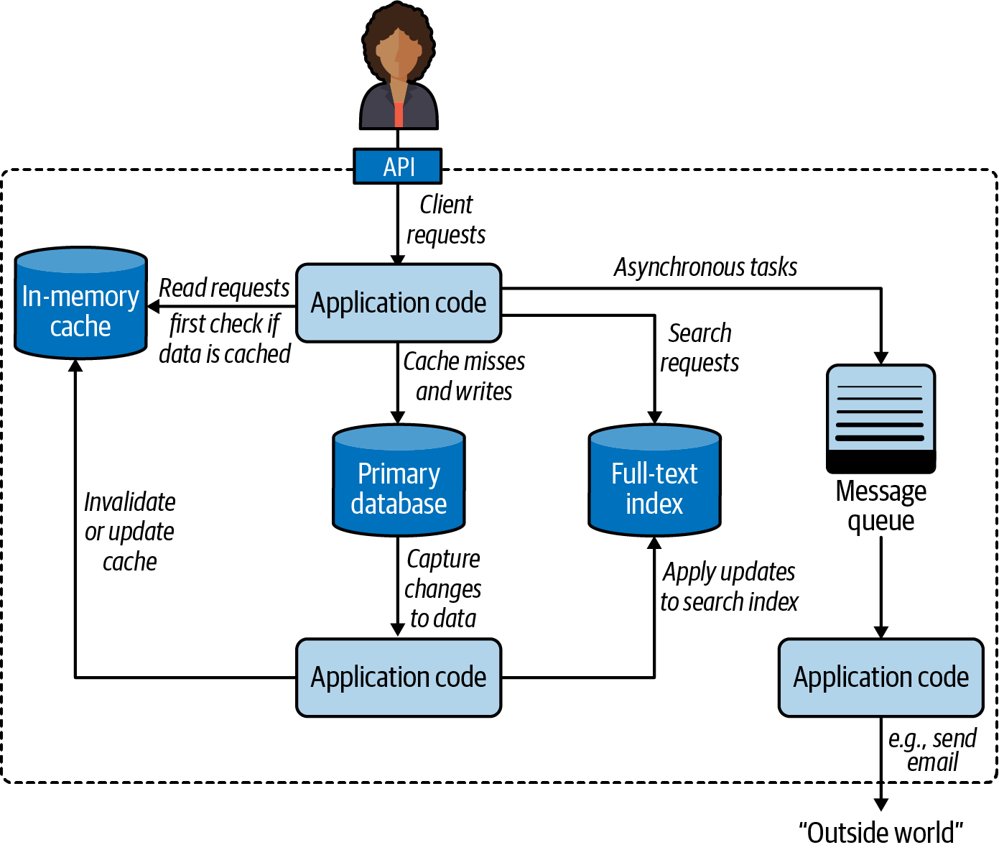
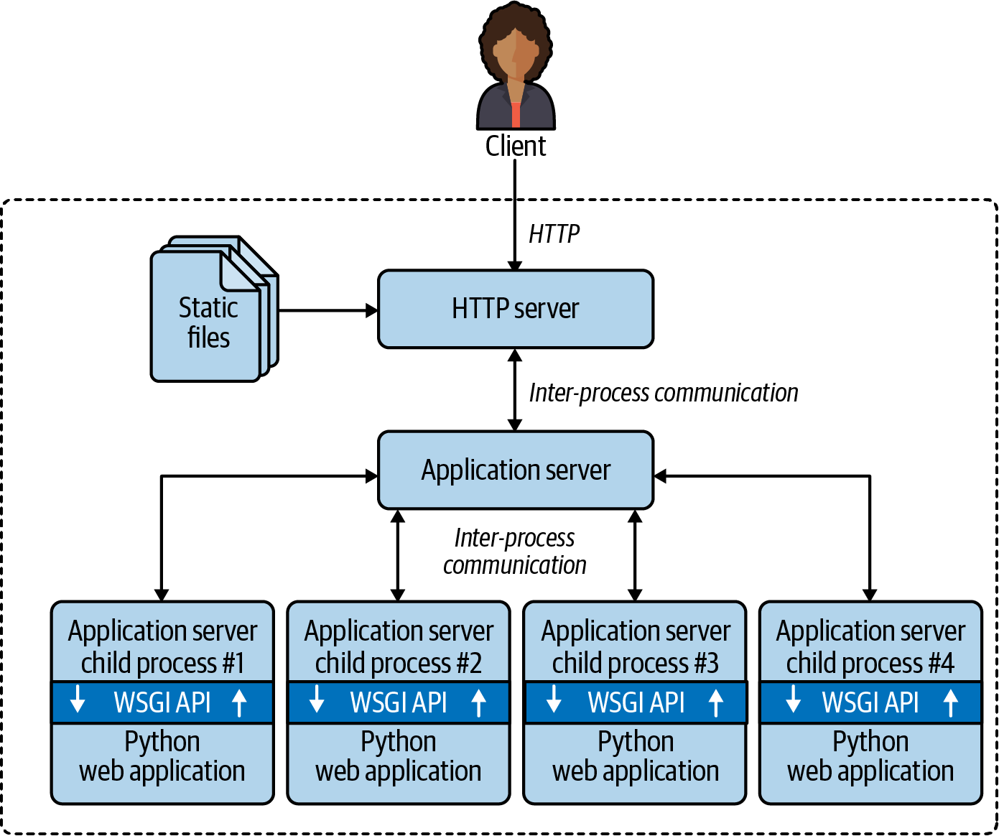

[[ch_concurrency_models]]
== Modelos de concorrência em Python
:example-number: 0
:figure-number: 0

[quote, Rob Pike, Co-criador da linguagem Go]
____
Concorrência é lidar com muitas coisas ao mesmo tempo. +
Paralelismo é fazer muitas coisas ao mesmo tempo. +
Não são iguais, mas têm relação. +
[Concorrência] é sobre estrutura, [paralelismo] é sobre execução. +
A concorrência fornece uma maneira de estruturar uma solução para resolver um problema que pode (mas não necessariamente) ser paralelizado.footnote:[Slide 8 of the talk https://fpy.li/19-1[_Concurrency Is Not Parallelism_].]

____

Este((("concurrency models", "benefits of concurrency"))) capítulo é sobre como
fazer Python "lidar com muitas coisas ao mesmo tempo." Isso pode envolver
programação concorrente ou paralela. Até mesmo acadêmicos discordam sobre
o uso destas palavras. Vou adotar as definições
informais de Rob Pike, na epígrafe acima, mas encontrei
artigos e livros que dizem ser sobre computação paralela, mas são quase que
inteiramente sobre concorrência.footnote:[Estudei e trabalhei com o Prof. Imre
Simon, que gostava de dizer que há dois grandes pecados na ciência: usar
palavras diferentes para significar a mesma coisa e usar uma palavra para
significar coisas diferentes. Imre Simon (1942-2009) foi um pioneiro da ciência
da computação no Brasil, com contribuições seminais para a Teoria dos Autômatos.
Ele fundou o campo da Matemática Tropical e foi também um defensor do software
livre, da cultura livre, e da Wikipédia.]

Na perspectiva de Pike, o paralelismo((("parallelism"))) é, um caso especial de concorrência.
Todo sistema paralelo é concorrente,
mas nem todo sistema concorrente é paralelo.
No início dos anos 2000, usávamos laptops GNU Linux de um único núcleo, que rodavam 100 processos ao mesmo tempo.
Um laptop moderno com quatro núcleos de CPU rotineiramente está executando mais de 200 processos a qualquer momento, sob uso normal, casual.
Para executar 200 tarefas em paralelo, você precisaria de 200 núcleos.
Portanto, na prática, a maior parte da computação 
em nosso cotidiano é concorrente e não paralela.
O SO administra centenas de processos, assegurando que cada um tenha a oportunidade de progredir,
mesmo quando a CPU em si não roda mais que quatro tarefas em paralelo.

Este((("concurrency models", "topics covered"))) capítulo não assume que você tenha conhecimento prévio de programação concorrente ou paralela.
Após uma breve introdução conceitual, vamos estudar exemplos simples,
para apresentar e comparar os principais pacotes da biblioteca padrão de Python dedicados à programação concorrente:
`threading`, `multiprocessing`, e `asyncio`.

O último terço do capítulo é uma revisão geral de ferramentas, servidores de aplicação e filas de tarefas distribuídas
(_distributed task queues_) de vários fornecedores, capazes de melhorar o desempenho e a escalabilidade de aplicações Python.
Todos esses são tópicos importantes, mas fogem do escopo de um livro focado nos recursos fundamentais da linguagem Python.
Mesmo assim, achei importante mencionar estes temas nesta segunda edição do _Python Fluente_,
porque a aptidão de Python para computação concorrente e paralela não está limitada ao que a biblioteca padrão oferece.
Por isso YouTube, DropBox, Instagram, Reddit e outros foram capazes de atingir alta escalabilidade quando começaram,
usando Python como sua linguagem primária—apesar das persistentes alegações de que "Python não escala."

=== Novidades neste capítulo

Este((("concurrency models", "significant changes to"))) capítulo é novo, escrito para a segunda edição do _Python Fluente_.
Os exemplos com os caracteres giratórios na <<concurrent_hello_world>> antes estavam no capítulo sobre `asyncio`.
Aqui eles foram revisados, e apresentam uma primeira ilustração das três abordagens de Python à concorrência: threads, processos e corrotinas nativas.

O resto do conteúdo é novo, exceto por alguns parágrafos, que apareciam originalmente nos capítulos sobre `concurrent.futures` e `asyncio`.

A <<py_in_multicore_world_sec>> é diferente do resto do livro: não há código exemplo.
O objetivo ali é apresentar brevemente ferramentas importantes,
que você pode querer estudar para conseguir concorrência e paralelismo de alto desempenho,
para além do que é possível com a biblioteca padrão de Python.

.Nota sobre o cenário em 2026
[NOTE]
====
Contratualmente, esta tradução precisa seguir o conteúdo do
_Fluent Python, Second Edition_, que publiquei pela O'Reilly em 2022.

Pesquisei e escrevi este capítulo em 2021, quando a versão mais recente do Python era a 3.10.
Desde então, novas versões do Python têm trazido melhorias importantes para a programação
concorrente, inclusive novas formas de contornar a GIL.

Além disso, o ecosistema de desenvolvimento para novas aplicações Web hoje é
dominado pelas soluções de provedores de nuvem, como AWS, que oferecem
substitutos para gerenciadores de fila como _Cellery_ e novas arquiteturas para
execução concorrente diferentes dos servidores de aplicação como _uWSGI_ e
_Gunicorn_.

Mais do que qualquer outro capítulo no livro,
este precisaria de muitas atualizações para refletir o cenário em 2026,
mas os princípios e conceitos fundamentais continuam válidos,
especialmente para o desenvolvimento de sistemas _on premise_,
independentes de um provedor de nuvem.
====

=== A visão geral

Há((("concurrency models", "basics of concurrency"))) muitos fatores que tornam a programação concorrente difícil,
mas quero tocar no mais básico deles: iniciar threads ou processos é fácil, mas como administrá-los?footnote:[Essa seção foi sugerida por meu amigo Bruce Eckel—autor de livros sobre Kotlin, Scala, Java, e {cpp}.]

Quando você invoca uma função, o código que faz a chamada aguarda até que a função retorne.
Então você sabe que a função terminou, e pode facilmente acessar o valor devolvido por ela.
Se a função lançar uma exceção, o código cliente pode cercar aquela chamada com um bloco `try/except` para tratar o erro.

Tais opções não existem quando você inicia threads ou um processo:
você não sabe automaticamente quando eles terminaram,
e obter os resultados ou os erros requer algum canal de comunicação
que você precisa fornecer, como uma fila de mensagens (_message queue_).

Além disso, criar uma thread ou um processo tem um custo,
você não quer iniciar um deles apenas para executar uma única computação e encerrar.
Muitas vezes queremos amortizar o custo de inicialização transformando cada thread ou processo em um _worker_ ou "unidade de trabalho",
que entra em um laço e espera por dados para processar.
Isso complica ainda mais a comunicação e introduz mais questões.
Como terminar um "worker" quando ele não é mais necessário?
E como fazer para encerrá-lo sem interromper uma tarefa inacabada,
deixando dados inconsistentes e recursos não liberados—tal como arquivos abertos?
A resposta envolve novamente filas e mensagens.

Uma corrotina é fácil de iniciar.
Se você inicia uma corrotina usando a palavra-chave `await`,
é fácil obter o valor de retorno e há um local óbvio para tratar exceções.
Mas corrotinas muitas vezes são iniciadas pelo framework assíncrono,
e isso pode torná-las tão difíceis de monitorar quanto threads ou processos.

Por fim, as corrotinas e threads de Python não são adequadas para tarefas de uso intensivo da CPU, como veremos.

Programação concorrente envolve conceitos e modelos de programação que podem ser novidade para você.
Então vamos primeiro garantir que estamos na mesma página em relação a alguns conceitos centrais.

=== Um pouco de jargão

Aqui((("concurrency models", "relevant terminology", id="CBterm19")))
estão alguns termos que usaremos pelo restante deste capítulo e nos dois seguintes:

Concorrência::
    A capacidade de lidar com múltiplas tarefas pendentes, fazendo progredir uma por vez ou várias em paralelo (se possível),
    de forma que cada uma delas avance até terminar com sucesso ou falhar.
    Uma CPU de um núcleo é capaz de concorrência se rodar um _scheduler_ (escalonador) do sistema operacional, que intercale a execução das tarefas pendentes.
    Esta capacidade também é conhecida como multitarefa (_multitasking_).

Paralelismo::
    A((("parallelism"))) habilidade de executar múltiplas operações computacionais ao mesmo tempo. Isso requer uma CPU com múltiplos núcleos, múltiplas CPUs, uma
    https://fpy.li/19-2[GPU], ou múltiplos computadores em um _cluster_ (agrupamento).

Unidades de execução::
    Termo genérico((("execution units"))) para objetos que executam código de forma concorrente, cada um com um estado e uma pilha de chamada independentes.
    Python suporta de forma nativa três tipos de unidade de execução:
    _processos_, _threads_, e _corrotinas_.

Processo::
    Uma((("processes", "definition of term"))) instância de um programa de computador em execução, usando parte da memória e uma fatia do tempo da CPU.
    Os sistemas operacionais modernos em nossos computadores e celulares rodam rotineiramente centenas de processos de forma concorrente, cada um deles isolado em seu próprio espaço de memória privado.
    Processos se comunicam via _pipes_, soquetes ou arquivos mapeados na memória (_memory mapped files_). Todos esses métodos só comportam bytes em estado bruto.
    Objetos Python precisam ser serializados (convertidos em sequências de bytes) para passarem de um processo a outro.
    Isto é caro, e nem todos os objetos Python podem ser serializados.
    Um processo pode gerar subprocessos, chamados "processos filhos".
    Estes também rodam isolados entre si e do processo original.
    Os processos permitem _multitarefa preemptiva_:
    o agendador do sistema operacional exerce __preempção__—isto é, suspende cada processo em execução periodicamente,
    para permitir que outros processos sejam executados.
    Isto significa que um processo travado não pode travar todo o sistema—em teoria.

Thread::
    Uma((("threads", "definition of term"))) unidade de execução dentro de um processo.
    Quando um processo se inicia, ele tem uma única thread: a thread principal.
    Um processo pode chamar APIs do sistema operacional para criar mais threads para operar de forma concorrente.
    Threads dentro de um processo compartilham o mesmo espaço de memória, onde são mantidos objetos Python "vivos" (não serializados).
    Isso facilita o compartilhamento de informações entre threads, mas pode também levar à corrupção de dados,
    se uma thread está lendo um objeto enquanto ele está sendo modificado por outra thread.
    Como os processos, as threads também possibilitam a _multitarefa preemptiva_ sob a supervisão do agendador do SO.
    Uma thread consome menos recursos que um processo para realizar a mesma tarefa.

Corrotina::
    Uma((("coroutines", "definition of term"))) função que pode suspender sua própria execução e continuar depois.
    Em Python, corrotinas clássicas são criadas a partir de funções geradoras, e corrotinas nativas são definidas com `async def`.
    A <<classic_coroutines_sec>> introduziu o conceito, e o <<ch_async>> trata do uso de corrotinas nativas.
    As corrotinas de Python normalmente rodam dentro de uma única thread, sob a supervisão de um laço de eventos (_event loop_), também na mesma thread.
    Frameworks de programação assíncrona como `asyncio`, _Curio_, ou _Trio_ fornecem um laço de eventos e bibliotecas de apoio para E/S não-bloqueante baseado em corrotinas.
    Corrotinas permitem _multitarefa cooperativa_:
    cada corrotina deve ceder explicitamente o controle com as palavras-chave `yield` ou `await`, para que outra possa continuar de forma concorrente (mas não em paralelo).
    Isso significa que qualquer código bloqueante em uma corrotina bloqueia a execução do laço de eventos e de todas as outras corrotinas—ao contrário da _multitarefa preemptiva_ suportada por processos e threads.
    Por outro lado, cada corrotina consome menos recursos para executar o mesmo trabalho que uma thread ou processo.

Fila (_queue_)::
    Uma((("queues", "definition of term"))) estrutura de dados que nos permite adicionar e retirar itens, normalmente na ordem FIFO: o primeiro que entra é o primeiro que sai.footnote:[NT: "FIFO" é a sigla em inglês para "first in, first out".]
    Filas permitem que unidades de execução separadas troquem dados da aplicação e mensagens de controle, como códigos de erro e sinais de término.
    A implementação de uma fila varia de acordo com o modelo de concorrência subjacente: o pacote `queue` na biblioteca padrão de Python fornece classes de fila para suportar threads, já os pacotes `multiprocessing` e `asyncio` implementam suas próprias classes de fila. Os pacotes `queue` e `asyncio` também incluem filas não FIFO: `LifoQueue` e `PriorityQueue`.

Trava (_lock_)::

    Um((("locks, definition of term"))) objeto que as unidades de execução podem usar para sincronizar suas ações e evitar corrupção de dados.
    Ao atualizar uma estrutura de dados compartilhada, o código em execução deve invocar uma função para obter uma trava associada a tal estrutura.
    Isso sinaliza a outras partes do programa que elas devem aguardar até que a trava seja liberada, antes de acessar a mesma estrutura de dados.
    A variante mais simples de trava é conhecida também como mutex (de _mutual exclusion_, exclusão mútua).
    O mecanismo para implementar uma trava depende do modelo de concorrência subjacente.

Contenda (_contention_)::
    Disputa((("contention"))) por um recurso limitado.
    Contenda por recursos ocorre quando múltiplas unidades de execução tentam acessar um recurso compartilhado—tal como uma trava ou unidade de armazenamento.
    Há também contenda pela CPU, quando processos ou threads de computação intensiva precisam aguardar até que o agendador do SO dê a eles uma quota do tempo da CPU.

Agora vamos usar um pouco desse jargão para entender o suporte à concorrência no Python.((("", startref="CBterm19")))

==== Processos, threads, e a infame GIL de Python

Veja((("concurrency models", "Python programming concepts", id="CMconcepts19"))) como os conceitos que acabamos de tratar se aplicam ao Python, em dez pontos:

. Cada instância do interpretador Python é um processo. Você pode iniciar
processos Python adicionais usando as bibliotecas `multiprocessing` ou
`concurrent.futures`. A biblioteca _subprocess_ de Python foi projetada para
rodar programas externos escritos em qualquer linguagem.

. O interpretador Python usa uma única thread para rodar o programa do usuário e o coletor de lixo da memória. Você pode iniciar threads Python adicionais usando as bibliotecas _threading_ ou _concurrent.futures_.

. O acesso à contagem de referências a objetos e outros estados internos do interpretador é controlado por uma trava,
a((("Global Interpreter Lock (GIL)"))) Global Interpreter Lock (GIL) ou _Trava Global do Interpretador_.
A qualquer dado momento, apenas uma thread de Python pode reter a trava.
Isso significa que apenas uma thread pode executar código Python a cada momento, mesmo que a CPU tenha vários núcleos.

. Para evitar que uma thread de Python segure a GIL indefinidamente, o interpretador de bytecode de Python pausa a thread Python corrente a cada 5ms por default, liberando a GIL.footnote:[Invoque https://fpy.li/a5[`sys.getswitchinterval()`] para obter o intervalo; ele pode ser modificado com https://fpy.li/ag[`sys.setswitchinterval(s)`].]
A thread pode então tentar readquirir a GIL, mas se existirem outras threads esperando, o agendador do SO pode escolher uma delas para continuar.

. Quando escrevemos código Python, não temos controle sobre a GIL. Mas uma função embutida ou uma extensão escrita em C—ou qualquer linguagem que trabalhe no nível da API Python/C—pode liberar a GIL enquanto estiver rodando alguma tarefa demorada.

. Toda função na biblioteca padrão de Python que executa uma _syscall_ libera a
GILfootnote:[Uma syscall é uma chamada a partir do código do usuário para uma
função do núcleo (_kernel_) do sistema operacional. E/S, temporizadores e travas
são alguns dos serviços do núcleo do SO disponíveis através de syscalls. Para
aprender mais sobre esse tópico, leia o artigo https://fpy.li/a6[«Chamada de
sistema»] na Wikipedia.]. Isto inclui todas as funções que executam operações de
escrita e leitura de arquivos, escrita e leitura na rede, e `time.sleep()`.
Muitas funções de uso intensivo da CPU nas bibliotecas NumPy/SciPy, bem como as
funções de compressão e descompressão dos módulos `zlib` e `bz2`, também
liberam a GIL.footnote:[Os módulos `zlib` e `bz2` são mencionados nominalmente
em uma https://fpy.li/19-6[mensagem de Antoine Pitrou na python-dev]. Pitrou
contribuiu para a lógica da divisão de tempo da GIL no Python 3.2.]

. Extensões binárias que se comunicam via API Python/C também podem iniciar outras threads não-Python, que não são afetadas pela GIL. Essas threads fora do controle da GIL normalmente não podem modificar objetos Python, mas podem ler e escrever na memória usada por objetos que suportam o https://fpy.li/pep3118[buffer protocol], como `bytearray`, `array.array`, e arrays do _NumPy_.

. O efeito da GIL sobre a programação de redes com threads Python é relativamente pequeno, porque as funções de E/S liberam a GIL, e ler e escrever na rede sempre implica em alta latência—comparado a ler e escrever na memória. Consequentemente, cada thread individual já passa muito tempo esperando mesmo, então sua execução pode ser intercalada sem maiores impactos no desempenho geral. Por isso David Beazley diz: "As threads de Python são ótimas em fazer nada."footnote:[Fonte: slide 106 do tutorial de Beazley, https://fpy.li/19-7["Generators: The Final Frontier"].]

. As contendas pela GIL desaceleram as threads Python que fazem processamento intensivo. Código sequencial de uma única thread é mais simples e mais rápido para este tipo de tarefa.

. Para rodar código Python de uso intensivo da CPU em múltiplos núcleos, você precisa usar múltiplos processos Python.

Aqui está um bom resumo, parte da https://fpy.li/a7[documentação do módulo `threading`]:

[quote]
____
*Detalhe de implementação do CPython*: Em CPython, devido à Trava Global do Interpretador, apenas uma thread pode executar código Python de cada vez (mas certas bibliotecas de alto desempenho podem contornar esta limitação). Se você quer que sua aplicação faça melhor uso dos recursos computacionais de máquinas com CPUs de múltiplos núcleos, aconselha-se usar `multiprocessing` ou
 `concurrent.futures.ProcessPoolExecutor`.

Entretanto, threads ainda são o modelo adequado se você deseja rodar múltiplas tarefas ligadas a E/S simultaneamente.
____

O parágrafo anterior começa com "Detalhe de implementação do CPython" porque a
GIL não é parte da definição da linguagem Python. As implementações Jython e o
IronPython não têm uma GIL. Infelizmente, ambas estão ficando para trás, ainda
compatíveis apenas com Python 2.7 e 3.4, respectivamente. O interpretador de
alto desempenho https://fpy.li/19-9[PyPy] também tem uma GIL em suas versões
2.7, 3.8 e 3.9 (a mais recente em março de 2021).

[NOTE]
====
Esta seção não mencionou corrotinas, por que por default elas compartilham a mesma thread Python entre si e com o laço de eventos supervisor fornecido por um framework assíncrono—então não são afetadas pela GIL.
É possível usar múltiplas threads em um programa assíncrono, mas a melhor prática é ter uma thread rodando o laço de eventos e todas as corrotinas, enquanto as threads adicionais executam tarefas específicas.
Isso será explicado na <<delegating_to_executors_sec>>.
====

Mas chega de conceitos por agora. Vamos ver algum código.((("", startref="CMconcepts19")))

[[concurrent_hello_world]]
=== Um "Olá mundo" concorrente

Durante((("concurrency models", "Hello World example", id="CMhello19"))) uma discussão sobre threads e sobre como evitar a GIL,
o contribuidor do Python Michele Simionato https://fpy.li/19-10[postou um exemplo] que é praticamente um "Olá Mundo" concorrente:
o programa mais simples possível mostrando como o Python pode "assobiar e chupar cana ao mesmo tempo".

O programa de Simionato usa `multiprocessing`,
mas eu o adaptei para apresentar também `threading` e `asyncio`.
Vamos começar com a versão `threading`, que pode parecer familiar se você já estudou threads em Java ou C.

==== Caracteres animados com threads

A((("spinners (loading indicators)", "created with threading", id="Sthread19")))((("threads", "spinners (loading indicators) using", id="Tspin19"))) ideia dos próximos exemplos é simples: iniciar uma função que pausa por 3 segundos enquanto anima caracteres no terminal, para deixar o usuário saber que o programa está "pensando" e não congelado.

O script cria uma animação giratória mostrando em sequência cada caractere da string `'\|/-'`
na mesma posição da tela.footnote:[O Unicode tem muitos caracteres úteis para animações simples, como por exemplo os https://fpy.li/19-11[padrões Braille]. Usei os caracteres ASCII `'\|/-'` para simplificar os exemplos do livro.] Quando a computação lenta termina, a linha com a animação é apagada e o resultado é apresentado: `Answer: 42`.

<<spinner_fig>> mostra a saída de duas versões do exemplo: primeiro com threads, depois com corrotinas.
Se você estiver longe do computador, imagine que o hífen (`-`) na última linha está girando.

[[spinner_fig]]
.Os scripts spinner_thread.py e spinner_async.py produzem um resultado similar: o repr do objeto spinner e o texto "Answer: 42". Na captura de tela, spinner_async.py ainda está rodando, e a mensagem animada "- thinking!" é apresentada; aquela linha será substituída por "Answer: 42" após 3 segundos.

Vamos estudar o script _spinner_thread.py_ primeiro. O <<spinner_thread_top_ex>>
lista as duas primeiras funções no script, e o <<spinner_thread_rest_ex>> mostra o restante.

[[spinner_thread_top_ex]]
.spinner_thread.py: as funções `spin` e `slow`
====
[source, python]
----
include::../code/19-concurrency/spinner_thread.py[tags=SPINNER_THREAD_TOP]
----
====
<1> Esta função vai rodar em uma thread separada. O argumento `done` é uma instância de `threading.Event`, um objeto simples para sincronizar threads.
<2> Isto é um laço infinito, porque `itertools.cycle` produz um caractere por vez, circulando pela string para sempre.
<3> O truque para animação em modo texto: mova o cursor de volta para o início da linha com o caractere ASCII _carriage return_: `'\r'`.
<4> O método `Event.wait(timeout=None)` retorna `True` quando o evento é sinalizado por outra thread; se o `timeout` passou, ele retorna `False`. O tempo de 0,1s estabelece a velocidade da animação em 10 FPS (quadros por segundo). Se quiser uma animação mais rápida, use um tempo menor aqui.
<5> Sai do laço infinito.
<6> Sobrescreve a linha de status com espaços para limpá-la e move o cursor de volta para o início.
<7> `slow()` será chamada pela thread principal. Imagine que isso é uma chamada de API lenta, através da rede. Chamar `sleep` bloqueia a thread principal, mas a GIL é liberada e a thread da animação pode continuar.

[TIP]
====
O primeiro detalhe importante deste exemplo é que `time.sleep()` bloqueia a thread que a chama, mas libera a GIL, permitindo que outras threads Python rodem.
====

As funções `spin` e `slow` serão executadas de forma concorrente.
A thread principal—a única thread quando o programa é iniciado—vai iniciar uma nova thread para rodar `spin` e então chamará `slow`.
Propositalmente, não existe API para terminar uma thread em Python.
É preciso enviar algum sinal para encerrar uma thread.

A classe `threading.Event` é o mecanismo de sinalização para coordenar threads mais simples no Python.
Uma instância de `Event` tem um atributo booleano interno que começa como `False`.
Uma chamada a `Event.set()` muda o atributo para `True`.
Enquanto o atributo for falso, se uma thread chamar `Event.wait()`, ela será bloqueada até que outra thread chame `Event.set()`.
Então a próxima invocação de `Event.wait()` retornará `True`, sem esperar.
Se um tempo de espera (_timeout_) em segundos é passado para `Event.wait(s)`, essa chamada retorna `False` quando aquele tempo tiver passado, ou retorna `True` assim que `Event.set()` é chamado por outra thread.

A função `supervisor`, que aparece no <<spinner_thread_rest_ex>>, usa um `Event` para sinalizar para a função `spin` que ela deve encerrar.

[[spinner_thread_rest_ex]]
.spinner_thread.py: as funções `supervisor` e `main`
====
[source, python]
----
include::../code/19-concurrency/spinner_thread.py[tags=SPINNER_THREAD_REST]
----
====
<1> `supervisor` retornará o resultado de `slow`.
<2> A instância de `threading.Event` é a chave para coordenar as atividades das threads `main` e `spinner`, como explicado abaixo.
<3> Para criar uma nova `Thread`, forneça uma função como nomeado `target`, e argumentos posicionais para a `target` como uma tupla passada via `args`.
<4> Mostra o objeto `spinner`. A saída é `<Thread(Thread-1, initial)>`, onde `initial`
é o estado da thread—significando aqui que ela ainda não foi iniciada.
<5> Inicia a thread `spinner`.
<6> Chama `slow`, que bloqueia a thread principal. Enquanto isso, a thread secundária está rodando a animação.
<7> Muda o estado de `Event` para `True`; isso vai encerrar o laço `for` dentro da função `spin`.
<8> Espera até que a thread `spinner` termine.
<9> Roda a função `supervisor`. Escrevi `main` e `supervisor` como funções separadas para deixar esse exemplo mais parecido com a versão `asyncio` no <<spinner_async_start_ex>>.

Quando a thread `main` sinaliza o evento `done`, a thread `spinner` acabará notando e encerrará corretamente.

Agora vamos ver um exemplo similar usando o pacote `multiprocessing`.((("", startref="Tspin19")))((("", startref="Sthread19")))

==== Animação com processos

O((("spinners (loading indicators)", "created with multiprocessing package")))((("multiprocessing package"))) pacote `multiprocessing` permite executar tarefas concorrentes em processos Python separados em vez de threads.
Quando você cria uma instância de `multiprocessing.Process`, todo um novo interpretador Python é iniciado como um processo filho, em segundo plano.
Como cada processo Python tem sua própria GIL, isto permite que seu programa use todos os núcleos de CPU disponíveis—mas isso depende, em última instância, do agendador do sistema operacional.
Veremos os efeitos práticos na <<naive_multiprocessing_sec>>, mas para este programa simples não faz grande diferença.

O objetivo dessa seção é apresentar o `multiprocessing`
e mostrar como sua API emula a API de `threading`, 
facilitando a conversão de programas simples de threads para processos, como mostra o _spinner_proc.py_ (<<spinner_proc_ex>>).

[[spinner_proc_ex]]
.spinner_proc.py: apenas as partes modificadas são mostradas; todo o resto é idêntico a spinner_thread.py
====
[source, python]
----
include::../code/19-concurrency/spinner_proc.py[tags=SPINNER_PROC_IMPORTS]

# [snip] o resto das funções spin e slow são iguais a spinner_thread.py

include::../code/19-concurrency/spinner_proc.py[tags=SPINNER_PROC_SUPER]

# [snip] main function is unchanged as well
----
====
<1> A API básica de `multiprocessing` imita a API de `threading`, mas as dicas de tipo e o Mypy revelam esta diferença: `multiprocessing.Event` é uma função (e não uma classe como `threading.Event`) que retorna uma instância de `synchronize.Event`...
<2> ...nos obrigando a importar `multiprocessing.synchronize`...
<3> ...para escrever essa dica de tipo.
<4> O uso básico da classe `Process` é similar ao da classe `Thread`.
<5> O objeto `spinner` aparece como `<Process name='Process-1' parent=14868 initial>`,
onde `14868` é o `id` do processo filho: a outra instância de Python que está executando o
_spinner_proc.py_.

As APIs básicas de `threading` e `multiprocessing` são similares,
mas sua implementação é muito diferente, e `multiprocessing`
tem uma API muito maior, para dar conta da complexidade adicional da programação multiprocessos.
Por exemplo, um dos desafios ao converter um programa de threads para processos é a comunicação entre processos, que são isolados pelo sistema operacional e não podem compartilhar objetos Python.
Isso significa que objetos cruzando fronteiras entre processos precisam ser serializados e deserializados, criando custos adicionais.
No <<spinner_proc_ex>>, o único dado que cruza a fronteira entre os processos é o estado de `Event`, implementado com um semáforo de baixo nível do SO, no código em C sob o módulo `multiprocessing`.footnote:[O semáforo é um bloco fundamental que pode ser usado para implementar outros mecanismos de sincronização. Python fornece diferentes classes de semáforos para uso com threads, processos e corrotinas. Veremos o `asyncio.Semaphore` na <<using_as_completed_sec>> (<<ch_async>>).]

[TIP]
====
Desde o Python 3.8, existe o pacote https://fpy.li/a8[`multiprocessing.shared_memory`]
na biblioteca padrão, mas ele não suporta instâncias de classes definidas pelo usuário.
Além de bytes puros, o pacote permite que processos compartilhem uma `ShareableList`, uma sequência mutável que pode manter um número fixo de itens dos tipos `int`, `float`, `bool`, e `None`, bem como `str` e `bytes`, até o limite de 10 MB por item.
Veja a documentação de
https://fpy.li/a9[`ShareableList`]
para mais detalhes.
====

Agora vamos ver como o mesmo comportamento pode ser obtido com corrotinas em vez de threads ou processos.

[[spinner_async_sec]]
==== Animação com corrotinas

[NOTE]
====
O <<ch_async>> é((("spinners (loading indicators)", "created using coroutines", id="Scoroutine19")))((("coroutines", "spinners (loading indicators) using", id="Cspin19"))) inteiramente dedicado à programação assíncrona com corrotinas. Esta seção é apenas uma introdução rápida, para contrastar esta abordagem com as threads e os processos. Por isso, vamos passar por cima de alguns detalhes.
====

Alocar tempo da CPU para a execução de threads e processos é trabalho dos agendadores do SO. As corrotinas, por outro lado, são controladas por um laço de evento no nível da aplicação, que gerencia uma fila de corrotinas pendentes, as executa uma por vez, monitora eventos disparados por operações de E/S iniciadas pelas corrotinas, e passa o controle de volta para a corrotina correspondente quando cada evento acontece.
O laço de eventos, as corrotinas da biblioteca, e as corrotinas do usuário rodam todas em uma única thread.
Assim, o tempo gasto em uma corrotina bloqueia o laço de eventos e todas as outras corrotinas.

A versão com corrotinas do programa de animação é mais fácil de entender se começarmos por uma função `main`, e depois olharmos a `supervisor`.
É isso que o <<spinner_async_start_ex>> mostra.

[[spinner_async_start_ex]]
.spinner_async.py: a função `main` e a corrotina `supervisor`
====
[source, python]
----
include::../code/19-concurrency/spinner_async.py[tags=SPINNER_ASYNC_START]
----
====
<1> `main` é a única função normal definida nesse programa—as outras são corrotinas.
<2> A função `asyncio.run` inicia o laço de eventos para acionar a corrotina que em algum momento colocará as outras corrotinas em movimento.
A função `main` ficará bloqueada até que `supervisor` retorne.
O valor devolvido por `supervisor` será o valor devolvido por `asyncio.run`.
<3> Corrotinas nativas são definidas com `async def`.
<4> `asyncio.create_task` agenda a execução futura de `spin`, retornando imediatamente uma instância de `asyncio.Task`.
<5> O `repr` do objeto `spinner` se parece com `<Task pending name='Task-2' coro=<spin() running at /path/to/spinner_async.py:11>>`.
<6> A palavra-chave `await` chama `slow`, bloqueando `supervisor` até que `slow` retorne. O devolvido por `slow` é atribuído a `result`.
<7> O método `Task.cancel` lança uma exceção `CancelledError` dentro da corrotina, como veremos no <<spinner_async_top_ex>>.

O <<spinner_async_start_ex>> demonstra as três principais formas de rodar uma corrotina:

`asyncio.run(coro())`::
    É invocada a partir de uma função normal, para acionar o objeto corrotina, que é o ponto de entrada para todo o código assíncrono no programa, como a `supervisor` neste exemplo. Esta chamada bloqueia até que `coro` retorne. O resultado de `coro` será o resultado de `run`.
`asyncio.create_task(coro())`::
    É invocada dentro de uma corrotina para agendar a execução futura de outra corrotina.
    Essa chamada não suspende a corrotina atual.
    Ela retorna imediatamente uma instância de `Task`, um objeto que contém o objeto corrotina e fornece métodos para controlar e consultar seu estado.
`await coro()`::
    É invocada dentro de uma corrotina para transferir o controle para o objeto corrotina retornado por `coro()`. Isto suspende a corrotina atual até que `coro` retorne. O valor da expressão `await` será o que quer que `coro` devolva como resultado.

[NOTE]
====
Lembre-se: invocar uma corrotina como `coro()` retorna imediatamente um objeto corrotina, mas não executa o corpo da função `coro`.
Acionar o corpo de corrotinas é a função do laço de eventos.
====

Vamos estudar agora as corrotinas `spin` e `slow` no <<spinner_async_top_ex>>.

[[spinner_async_top_ex]]
.spinner_async.py: as corrotinas `spin` e `slow`
====
[source, python]
----
include::../code/19-concurrency/spinner_async.py[tags=SPINNER_ASYNC_TOP]
----
====
<1> Não precisamos do argumento `Event`, que era usado para sinalizar que `slow` havia terminado de rodar no _spinner_thread.py_ (<<spinner_thread_top_ex>>).
<2> Use `await asyncio.sleep(.1)` em vez de `time.sleep(.1)`, para pausar sem bloquear outras corrotinas. Veja o experimento após o exemplo.
<3> `asyncio.CancelledError` é lançada quando o método `cancel` é chamado na `Task` que controla essa corrotina. É hora de sair do laço.
<4> A corrotina `slow` também usa `await asyncio.sleep` em vez de `time.sleep`.

===== Experimento: quebrar a animação para revelar um fato

Aqui está um experimento que recomendo para entender como _spinner_async.py_ funciona. Importe o módulo `time`, daí vá até a corrotina `slow` e substitua a linha `await asyncio.sleep(3)` por uma chamada a `time.sleep(3)`, como no <<spinner_async_time_sleep_ex>>.

[[spinner_async_time_sleep_ex]]
.spinner_async.py: substituindo `await asyncio.sleep(3)` por `time.sleep(3)`
====
[source, python]
----
async def slow() -> int:
    time.sleep(3)
    return 42
----
====

Observar o comportamento é mais memorável que ler sobre ele.
Vai lá, eu espero.

Ao rodar o experimento, você vê o seguinte:

. O objeto `spinner` aparece: `<Task pending name='Task-2' coro=<spin() running at …/spinner_async.py:12>>`.
. A animação nunca aparece. O programa trava por 3 segundos.
. `Answer: 42` aparece e o programa termina.

Para entender o que está acontecendo, lembre-se que o código Python que está usando `asyncio` tem apenas uma unidade de execução,
a menos que você inicie explicitamente threads ou processos adicionais.
Isso significa que apenas uma corrotina é executada a qualquer dado momento.
A concorrência é obtida controlando a passagem de uma corrotina a outra.
No <<spinner_async_experiment_ex>>, vamos nos concentrar no que ocorre nas corrotinas `supervisor` e `slow` durante o experimento proposto.

[[spinner_async_experiment_ex]]
.spinner_async_experiment.py: as corrotinas `supervisor` e `slow`
====
[source, python]
----
include::../code/19-concurrency/spinner_async_experiment.py[tags=SPINNER_ASYNC_EXPERIMENT]
----
====
<1> A tarefa `spinner` é criada para, no futuro, acionar a corrotina `spin`.
<2> O display mostra que `Task` está _pending_ (pendente, em espera).
<3> A expressão `await` transfere  o controle para a corrotina `slow`.
<4> `time.sleep(3)` bloqueia tudo por 3 segundos; nada pode acontecer no programa, porque a thread principal está bloqueada—e ela é a única thread. O sistema operacional vai seguir com outras atividades. Após 3 segundos, `sleep` desbloqueia, e `slow` retorna.
<5> Logo após `slow` retornar, a tarefa `spinner` é cancelada. O corpo da corrotina `spin` nunca foi acionado.

O _spinner_async_experiment.py_ ensina uma lição importante, como explicado no box abaixo.

[WARNING]
====
Nunca use `time.sleep(…)` em corrotinas assíncronas, a menos que você queira pausar o programa inteiro.
Se uma corrotina precisa passar algum tempo sem fazer nada, use `await asyncio.sleep(DELAY)`.
Isto devolve o controle para o laço de eventos do `asyncio`, que pode acionar outras corrotinas pendentes.((("", startref="Cspin19")))((("", startref="Scoroutine19")))
====

[[gevent_box]]
.Greenlet e gevent
****
Ao((("greenlet package"))) discutir concorrência com corrotinas,
vale mencionar o pacote https://fpy.li/19-14[_greenlet_],
que já existe há muitos anos e é muito usado.footnote:[Agradeço aos revisores técnicos Caleb Hattingh e Jürgen Gmach, que não me deixaram esquecer de
_greenlet_ e _gevent_.]
O pacote suporta multitarefa cooperativa através de corrotinas leves—chamadas  _greenlets_—que não exigem qualquer sintaxe especial tal como `yield` ou `await`,
e assim são mais fáceis de integrar a bases de código sequencial existentes.
O https://fpy.li/19-15[SQL Alchemy 1.4 ORM] usa greenlets
internamente para implementar sua nova
https://fpy.li/19-16[API assíncrona] compatível com `asyncio`.

A((("gevent library"))) biblioteca de programação de redes
https://fpy.li/19-17[_gevent_] modifica o módulo `socket` padrão de Python via _monkey patching_, tornando-o não-bloqueante ao substituir parte do código por greenlets.
Na maior parte dos casos, _gevent_ é transparente para o código em seu entorno,
tornando mais fácil adaptar aplicações e bibliotecas sequenciais—tal como drivers de bancos de dados—para executar E/S de rede de forma concorrente.
https://fpy.li/19-18[Inúmeros projetos open source]
usam _gevent_, incluindo o muito usado
https://fpy.li/gunicorn[_Gunicorn_]—mencionado na <<wsgi_app_server_sec>>.
****

==== Supervisores lado a lado

O((("spinners (loading indicators)", "comparing supervisor functions"))) número
de linhas de _spinner_thread.py_ e _spinner_async.py_ é quase o mesmo.
As funções `supervisor` são a parte mais importante destes exemplos. Vamos compará-las mais
detalhadamente. O <<thread_supervisor_ex>> mostra apenas a `supervisor` do
<<spinner_thread_rest_ex>>.

[[thread_supervisor_ex]]
.spinner_thread.py: a função `supervisor` com threads
====
[source, python]
----
def supervisor() -> int:
    done = Event()
    spinner = Thread(target=spin,
                     args=('thinking!', done))
    print('spinner object:', spinner)
    spinner.start()
    result = slow()
    done.set()
    spinner.join()
    return result
----
====

Para comparar, o <<asyncio_supervisor_ex>> mostra a corrotina  `supervisor` do <<spinner_async_start_ex>>.

[[asyncio_supervisor_ex]]
.spinner_async.py: a corrotina assíncrona `supervisor`
====
[source, python]
----
async def supervisor() -> int:
    spinner = asyncio.create_task(spin('thinking!'))
    print('spinner object:', spinner)
    result = await slow()
    spinner.cancel()
    return result
----
====

Aqui está um resumo das diferenças e semelhanças notáveis entre as duas implementações de `supervisor`:

* Uma `asyncio.Task` é aproximadamente equivalente  a `threading.Thread`.
* Uma `Task` aciona um objeto corrotina, e uma `Thread` invoca um _callable_.
* Uma corrotina passa o controle explicitamente com a palavra-chave `await`
* Você não instancia objetos `Task` diretamente, eles são obtidos passando uma corrotina para `asyncio.create_task(…)`.
* Quando `asyncio.create_task(…)` devolve um objeto `Task`,
ele já está agendado para rodar, mas uma instância de `Thread` precisa ser iniciada explicitamente através de uma chamada a seu método `start`.
* Na `supervisor` da versão com threads, `slow` é uma função comum e é invocada diretamente pela thread principal. Na versão assíncrona da `supervisor`, `slow` é uma corrotina acionada por `await`.
* Não existe um método para terminar uma thread externamente; em vez disso, é preciso enviar um sinal—como invocar `set` no objeto `Event`.
Objetos `Task` oferecem o método `.cancel()`, que levantará um `CancelledError` na expressão `await` onde a corrotina está suspensa naquele momento.
* A corrotina `supervisor` é acionada com `asyncio.run` na função `main`.

Essa comparação ajuda a entender como a concorrência é orquestrada com `asyncio`,
em contraste com como isso é feito com o módulo `threading`, que pode ser mais familiar
para quem já usou threads em qualquer linguagem.

Um último ponto relativo a threads versus corrotinas:
quem já escreveu qualquer programa não-trivial com threads
sabe quão desafiador é estruturar o programa, porque o agendador pode interromper uma thread a qualquer momento.
É preciso lembrar de manter travas para proteger seções críticas do programa, para evitar ser interrompido no meio de uma operação de muitas etapas—algo que poderia deixar dados em um estado inválido.

Com corrotinas, seu código está protegido de interrupções arbitrárias.
É preciso chamar `await` explicitamente para deixar o resto do programa rodar.
Em vez de manter travas para sincronizar as operações de múltiplas threads,
corrotinas são "sincronizadas" por definição:
apenas uma delas está rodando em qualquer momento.
Para entregar o controle, você usa `await` para passar o controle de volta ao agendador.
Por isso é possível cancelar uma corrotina de forma segura:
por definição, uma corrotina só pode ser cancelada quando está suspensa em uma expressão `await`, então é possível realizar qualquer limpeza necessária capturando a exceção `CancelledError` naquele ponto da corrotina.

A chamada `time.sleep()` bloqueia mas não faz nada. Vamos agora experimentar com
uma função intensiva em CPU, para entender melhor a GIL, bem como o
efeito de funções de processamento intensivo sobre código assíncrono.((("",
startref="CMhello19")))

=== O verdadeiro impacto da GIL

Na((("concurrency models", "Global Interpreter Lock impact",
id="CMimpact19")))((("Global Interpreter Lock (GIL)", id="gil19")))((("spinners (loading indicators)",
"Global Interpreter Lock impact", id="SPgil19"))) versão
com threads(<<spinner_thread_top_ex>>), você pode trocar a chamada
`time.sleep(3)` na função `slow` por uma requisição de cliente HTTP de sua
biblioteca favorita, e a animação continuará girando. Isso acontece porque
qualquer boa biblioteca de programação para rede vai liberar a GIL enquanto
estiver esperando uma resposta. Por padrão, toda operação de E/S em Python
libera a GIL.

Você também pode trocar a expressão `asyncio.sleep(3)` na corrotina `slow` para
fazer `await` esperar a resposta de uma corrotina de biblioteca bem desenhada de
acesso assíncrono à rede. Tais bibliotecas implementam corrotinas para devolver
o controle para o laço de eventos enquanto esperam por uma resposta da rede.
Enquanto isso, a animação seguirá girando.

Com código de uso intensivo da CPU, a história é outra.
Considere a função `is_prime` no <<def_is_prime_ex>>,
que retorna `True` se o argumento for um número primo, `False` se não for.

[[def_is_prime_ex]]
.primes.py: uma checagem de números primos fácil de entender, do exemplo em https://fpy.li/aa[`ProcessPoolExecutor`] na documentação de Python]
====
[source, python]
----
include::../code/19-concurrency/primes/primes.py[tags=IS_PRIME]
----
====
A chamada `is_prime(5_000_111_000_222_021)` leva cerca de 3s no laptop da empresa que estou usando agora.footnote:[É um MacBook Pro 15” de 2018, com uma CPU Intel Core i7 2.2 GHz de 6 núcleos.]

==== Teste Rápido

Dado o que vimos até aqui,
pare um instante para pensar sobre a seguinte questão, de três partes.
Uma das partes da resposta é um pouco mais complicada (pelo menos para mim foi).

[quote]
____
O que aconteceria à animação após as seguintes modificações,
presumindo que `n = 5_000_111_000_222_021`—aquele número primo que minha máquina levou 3s para checar:

. Em _spinner_proc.py_, substitua `time.sleep(3)` por uma chamada a `is_prime(n)`?
. Em _spinner_thread.py_, substitua `time.sleep(3)` por uma chamada a `is_prime(n)`?
. Em _spinner_async.py_, substitua `await asyncio.sleep(3)` por uma chamada a `is_prime(n)`?
____

Antes de executar o código ou continuar lendo,
recomendo dedicar um tempo para considerar as perguntas e formular suas respostas.
Depois, copie, modifique e rode os exemplos _spinner_ como sugerido.

Agora as respostas, da mais fácil para a mais difícil.

Resposta para multiprocessamento (_spinner_proc.py_)::
A animação é controlada por um processo filho, então continua girando enquanto o teste de números primos é computado no processo raiz.footnote:[Isso é verdade hoje porque você provavelmente está usando um SO moderno, com _multitarefa preemptiva_. O Windows antes da era NT e o MacOS antes da era OSX não eram "preemptivos", então qualquer processo podia tomar 100% da CPU e paralisar o sistema inteiro. Não estamos inteiramente livres desse tipo de problema hoje, mas confie na minha barba branca: esse tipo de coisa assombrava todos os usuários nos anos 1990, e a única cura era um reset de hardware.]

Resposta para asyncio (_spinner_async.py_)::
Se((("coroutines", "Global Interpreter Lock impact"))) você chamar `is_prime(5_000_111_000_222_021)` na corrotina `slow` do exemplo _spinner_async.py_,
a animação nunca vai aparecer.
O efeito é o que vimos no <<spinner_async_time_sleep_ex>>,
quando substituímos `await asyncio.sleep(3)` por `time.sleep(3)`:
nenhuma animação.
O fluxo de controle vai passar da `supervisor` para `slow`, e então para `is_prime`.
Quando `is_prime` retornar, `slow` vai retornar também, e `supervisor` retomará a execução, cancelando a tarefa `spinner` antes dela ser executada sequer uma vez.
O programa parecerá congelado por aproximadamente 3s, e então mostrará a resposta.((("", startref="CMimpact19")))((("", startref="gil19")))((("", startref="SPgil19")))

Resposta para threads (_spinner_thread.py_)::
A((("threads", "Global Interpreter Lock impact"))) animação é controlada por uma thread secundária, então continua girando enquanto o teste de número primo é computado na thread principal.

Não acertei essa resposta inicialmente:
eu esperava que a animação congelasse, porque superestimei o impacto da GIL.

Neste exemplo em particular, a animação segue girando porque Python suspende a thread em execução a cada 5ms (por default), tornando a GIL disponível para outras threads pendentes.
Assim, a thread principal executando `is_prime` é interrompida a cada 5ms, permitindo à thread secundária acordar e executar uma vez o laço `for`, até chamar o método `wait` do evento `done`, quando então ela liberará a GIL.
A thread principal então pegará a GIL, e o cálculo de `is_prime` continuará por mais 5 ms.

Isso não tem um impacto visível no tempo de execução deste exemplo específico, porque a função `spin` rapidamente realiza uma iteração e libera a GIL, enquanto espera pelo evento `done`, então não há muita contenda pela GIL.
A thread principal executando `is_prime` terá a GIL na maior parte do tempo.

Conseguimos nos safar usando threads para uma tarefa de processamento intensivo nesse experimento simples porque só temos duas threads: uma ocupando a CPU, e a outra acordando apenas 10 vezes por segundo para atualizar a animação.

Mas se você tiver duas ou mais threads disputando mais tempo da CPU, seu programa será mais lento que um programa sequencial.

.Soneca profunda com `sleep(0)`
****
Uma((("spinners (loading indicators)", "keeping alive"))) maneira de manter a animação funcionando é reescrever `is_prime` como uma corrotina,
e periodicamente chamar `asyncio.sleep(0)` em uma expressão `await`, para passar o controle de volta para o laço de eventos, como no <<example-19-11>>.

[[example-19-11]]
.spinner_async_nap.py: `is_prime` agora é uma corrotina
====
[source, python]
----
include::../code/19-concurrency/primes/spinner_prime_async_nap.py[tags=PRIME_NAP]
----
====
<1> Vai dormir a cada 50.000 iterações (porque o argumento `step` em `range` é 2).

O https://fpy.li/19-20[_Issue #284_] no repositório do `asyncio` trata do uso de `asyncio.sleep(0)`.

Entretanto, observe que isso vai tornar `is_prime` mais lento, e—mais
importante—vai também atrasar o laço de eventos e tornar o programa inteiro mais
lento. Quando usei `await asyncio.sleep(0)` a cada 100.000 iterações, a
animação foi suave mas o programa rodou por 4,9s na minha máquina, quase 50% a
mais que a função `primes.is_prime` rodando sozinha com o mesmo argumento
(`5_000_111_000_222_021`).

Usar `await asyncio.sleep(0)` pode ser uma medida paliativa até o código assíncrono ser refatorado para delegar computações de uso intensivo da CPU para outro processo.
Veremos como fazer isso com o https://fpy.li/19-21[`asyncio.loop.run_in_executor`], abordado no <<ch_async>>. Outra opção seria uma fila de tarefas, que vamos discutir brevemente na <<distributed_task_queues_sec>>.
****

Até aqui experimentamos com uma única chamada para uma função de uso intensivo de CPU. A próxima seção apresenta a execução concorrente de múltiplas chamadas de uso intensivo da CPU.

[[naive_multiprocessing_sec]]
=== Um pool de processos caseiro

[NOTE]
====

Não conheço boas traduções para _process pool_.
Uma alternativa seria "um banco de processos".
A ideia é que vários processos são iniciados e ficam aguardando tarefas.
Este padrão amortiza o custo de subir um processo para cada tarefa.

Escrevi((("concurrency models", "process pools", id="CMprocess19")))((("process pools", "example problem")))
esta seção para mostrar o uso de um banco de processos em cenários de uso intensivo de CPU,
com filas para distribuir tarefas para os processos, e coletar os resultados.
O <<ch_executors>> apresenta uma forma mais simples de distribuir tarefas para processos:
o `ProcessPoolExecutor` do pacote `concurrent.futures`, que também usa filas,
mas elas não são visíveis para o usuário.

====

Nesta seção vamos escrever programas para checar se os números dentro de uma amostra de 20 inteiros são primos. Os números variam de 2 até 9.999.999.999.999.999—isto é, 10^16^ - 1, ou mais de 2^53^.
A amostra inclui números primos pequenos e grandes, bem como números compostos com fatores primos pequenos e grandes.

O((("sequential.py program"))) programa _sequential.py_ fornece a linha base de desempenho.
Aqui está o resultado de uma execução de teste:

[source]
----
$ python3 sequential.py
               2  P  0.000001s
 142702110479723  P  0.568328s
 299593572317531  P  0.796773s
3333333333333301  P  2.648625s
3333333333333333     0.000007s
3333335652092209     2.672323s
4444444444444423  P  3.052667s
4444444444444444     0.000001s
4444444488888889     3.061083s
5555553133149889     3.451833s
5555555555555503  P  3.556867s
5555555555555555     0.000007s
6666666666666666     0.000001s
6666666666666719  P  3.781064s
6666667141414921     3.778166s
7777777536340681     4.120069s
7777777777777753  P  4.141530s
7777777777777777     0.000007s
9999999999999917  P  4.678164s
9999999999999999     0.000007s
Total time: 40.31
----

Os resultados aparecem em três colunas:

* O número a ser checado.
* `P` se é um número primo, vazia se é um número composto.
* Tempo decorrido para checar se aquele número é primo.

Neste exemplo, o tempo total é aproximadamente a soma do tempo de cada checagem,
mas está computado separadamente, como se vê no <<primes_sequential_ex>>.

[[primes_sequential_ex]]
.sequential.py: checagem de números primos em um pequeno conjunto de dados
====
[source, python]
----
include::../code/19-concurrency/primes/sequential.py[]
----
====
[role="pagebreak-before less_space"]
<1> A função `check` (logo abaixo) devolve uma tupla `Result` com o valor booleano da chamada a `is_prime` e o tempo decorrido.
<2> `check(n)` chama `is_prime(n)` e calcula o tempo decorrido para retornar um `Result`.
<3> Para cada número na amostra, chamamos `check` e apresentamos o resultado.
<4> Calcula e mostra o tempo total decorrido.

[[proc_based_solution]]
==== Solução baseada em processos

O((("process pools", "process-based solution"))) próximo exemplo, _procs.py_, mostra o uso de múltiplos processos para distribuir a checagem de números primos por muitos núcleos da CPU.
Esses são os tempos obtidos com _procs.py_:

[source]
----
$ python3 procs.py
Checking 20 numbers with 12 processes:
               2  P  0.000002s
3333333333333333     0.000021s
4444444444444444     0.000002s
5555555555555555     0.000018s
6666666666666666     0.000002s
 142702110479723  P  1.350982s
7777777777777777     0.000009s
 299593572317531  P  1.981411s
9999999999999999     0.000008s
3333333333333301  P  6.328173s
3333335652092209     6.419249s
4444444488888889     7.051267s
4444444444444423  P  7.122004s
5555553133149889     7.412735s
5555555555555503  P  7.603327s
6666666666666719  P  7.934670s
6666667141414921     8.017599s
7777777536340681     8.339623s
7777777777777753  P  8.388859s
9999999999999917  P  8.117313s
20 checks in 9.58s
----

A última linha dos resultados mostra que _procs.py_ foi 4,2 vezes mais rápido que _sequential.py_.

==== Entendendo os tempos decorridos

Observe((("process pools", "understanding elapsed times"))) que o tempo decorrido na primeira coluna é o tempo para checar aquele número específico. Por exemplo, `is_prime(7777777777777753)` demorou quase 8,4s para retornar `True`. Enquanto isso, outros processos estavam checando outros números em paralelo.

Há 20 números para serem checados. Escrevi _procs.py_ para iniciar um número de processos de trabalho igual ao número de núcleos na CPU, como determinado por `multiprocessing.cpu_count()`.

O tempo total neste caso é muito menor que a soma dos tempos decorridos para cada checagem individual. Há algum tempo gasto em iniciar processos e na comunicação entre processos, então o resultado final é que a versão multiprocessos é apenas cerca de 4,2 vezes mais rápida que a sequencial. Isso é bom, mas um pouco desapontador, considerando que o código inicia 12 processos, para usar todos os núcleos desse laptop.

[NOTE]
====

A função `multiprocessing.cpu_count()` retorna `12` no MacBook Pro que usei para
escrever este capítulo. Ele é um i7 com uma CPU de 6 núcleos, mas o SO informa
12 CPUs devido ao _hyperthreading_, uma tecnologia da Intel que executa duas
threads por núcleo. Entretanto, _hyperthreading_ funciona melhor quando uma das
threads não está trabalhando tão pesado quanto a outra thread no mesmo
núcleo—talvez a primeira esteja parada, esperando por dados após a invalidação
do cache, enquanto a outra está mastigando números. De qualquer forma, não
existe almoço grátis: este laptop tem o desempenho de uma máquina com 6 CPUs
para atividades de processamento intensivo com pouco uso de memória,
como este exemplo.

====

[[code_for_multicore_prime_sec]]
==== Código do checador de primos usando múltiplos núcleos

Quando((("process pools", "code for multicore prime checker",
id="PPmulticore19"))) delegamos processamento para threads e processos, nosso
código não invoca diretamente a função que realiza o trabalho, então não
conseguimos simplesmente devolver um resultado com `return`. Em vez disso, a
função de trabalho é acionada pela biblioteca de threads ou processos, e
produz um resultado que precisa ser armazenado em algum lugar. Coordenar threads
ou processos de trabalho e coletar resultados são usos comuns de filas em
programação concorrente, e também em sistemas distribuídos.

Muito do código novo em  _procs.py_ se refere a configurar e usar filas. O início do arquivo está no <<ex_primes_procs_top>>.

[WARNING]
====
`SimpleQueue` foi acrescentada a `multiprocessing` no Python 3.9.
Se você estiver usando uma versão anterior de Python,
pode substituir `SimpleQueue` por `Queue` no <<ex_primes_procs_top>>.
====

[[ex_primes_procs_top]]
.procs.py: checagem de primos com múltiplos processos; importações, tipos, e funções
====
[source, python]
----
include::../code/19-concurrency/primes/procs.py[tags=PRIMES_PROC_TOP]
----
====
<1> Na tentativa de emular `threading`, `multiprocessing` fornece `multiprocessing.SimpleQueue`, mas esse é um método vinculado a uma instância pré-definida de uma classe de nível mais baixo, `BaseContext`.
Temos que chamar essa `SimpleQueue` para criar uma fila. Mas não podemos usá-la em dicas de tipo.
<2> `multiprocessing.queues` contém a classe `SimpleQueue` que precisamos para dicas de tipo.
<3> `PrimeResult` inclui o número checado. Preservar `n` com os outros campos do resultado simplifica a exibição mais tarde.
<4> Isso é um apelido de tipo para uma `SimpleQueue` que a função `main` (<<primes_procs_main_ex>>) vai usar para enviar os números para os processos que farão a checagem.
<5> Apelido de tipo para uma segunda `SimpleQueue` que vai coletar os resultados em `main`. Os valores na fila serão tuplas contendo o número a ser testado e uma tupla `Result`.
<6> Isso é similar a _sequential.py_.
<7> `worker` recebe uma fila com os números a serem checados, e outra para colocar os resultados.
<8> Nesse código, usei o número `0` como um sinal para que o processo encerre. Se `n` não é `0`, o laço continua.footnote:[Nesse exemplo, `0` é um sinal conveniente. `None` também é bastante usado para este fim, mas o `0` simplifica a dica de tipo para `PrimeResult` e a implementação de `worker`.]
<9> Invoca a checagem de número primo e coloca o `PrimeResult` na fila.
<10> Devolve um `PrimeResult(0, False, 0.0)`, para informar ao laço principal que esse processo terminou seu trabalho.
<11> `procs` é o número de processos que executarão a checagem de números primos em paralelo.
<12> Coloca na fila `jobs`todos os números a serem checados.
<13> Cria um processo filho para cada `worker`. Cada um desses processos executará o laço dentro de sua própria instância da função `worker`, até encontrar um `0` na fila `jobs`.
<14> Inicia cada processo filho.
<15> Coloca um `0` na fila para cada processo, para encerrá-los.

[[good_poison_pill_tip]]
.Laços, sentinelas e pílulas venenosas
****
A((("concurrency models", "indefinite laços and sentinels")))((("indefinite laços")))((("sentinels")))
função `worker` no <<ex_primes_procs_top>> segue um modelo comum em programação concorrente:
rodar um laço continuamente, pegando itens de uma fila e processando cada um com uma função que realiza o trabalho real.
O laço termina quando `worker` retira da fila um valor sentinela.
Neste modelo, a sentinela que encerra o processo é muitas vezes chamada de _poison pill_ (pílula venenosa).

`None` é bastante usado como valor sentinela, mas pode não ser adequado se for também um valor válido na série de dados.
Invocar `object()` é uma forma comum de obter um objeto único para usar como sentinela.
Entretanto, isto não funciona entre processos, pois os objetos Python precisam ser serializados para comunicação entre processos.
Quando você serializa um objeto com `pickle.dump` e desserializa com `pickle.load`,
a instância recuperada tem uma identidade diferente do original.
Uma boa alternativa a `None` é o objeto embutido `Ellipsis` (também conhecido como `\...`),
que sobrevive à serialização sem perder sua identidade.footnote:[Sobreviver à serialização sem perder nossa identidade é um ótimo objetivo de vida.]

A biblioteca padrão de Python usa
https://fpy.li/19-22[«muitos valores diferentes»] como sentinelas.
A https://fpy.li/pep661[_PEP 661—Sentinel Values_]
propõe um tipo sentinela padrão.
****

Agora vamos estudar a função `main` de _procs.py_ no <<primes_procs_main_ex>>.

[[primes_procs_main_ex]]
.procs.py: checagem de números primos com múltiplos processos; função `main`
====
[source, python]
----
include::../code/19-concurrency/primes/procs.py[tags=PRIMES_PROC_MAIN]
----
====
<1> Se nenhum argumento é dado na linha de comando,
define o número de processos como o número de núcleos na CPU;
caso contrário, cria a quantidade de processos indicada no primeiro argumento.
<2> `jobs` e `results` são as filas descritas no <<ex_primes_procs_top>>.
<3> Inicia `proc` processos para consumir `jobs` e computar `results`.
<4> Recupera e exibe os resultados; `report` está definido em `⑥`.
<5> Mostra quantos números foram checados e o tempo total decorrido.
<6> Os argumentos são o número de `procs` e a fila para armazenar os resultados.
<7> Percorre o laço até que todos os processos terminem.
<8> Obtém um `PrimeResult`. Chamar `.get()` em uma fila deixa o processamento bloqueado até que haja um item na fila. Também é possível fazer isso de forma não-bloqueante ou estabelecer um timeout. Veja os detalhes na documentação de https://fpy.li/ab[`SimpleQueue.get`].
<9> Se `n` é zero, então um processo terminou; incrementa o contador `procs_done`.
<10> Senão, incrementa o contador `checked` (para acompanhar os números checados) e mostra os resultados.

Os resultados não vão retornar na mesma ordem em que as tarefas foram submetidas.
Por isso inclui `n` em cada tupla `PrimeResult`.
De outra forma não teríamos como saber qual resultado corresponde a cada número.

Se o processo principal terminar antes que todos os subprocessos finalizem,
podemos ter _tracebacks_ difíceis de analisar,
com referências a exceções de `FileNotFoundError` levantadas por uma trava interna em `multiprocessing`.
Depurar código concorrente é sempre difícil,
e depurar código baseado no `multiprocessing` é ainda mais difícil devido a toda a complexidade por trás da fachada que imita threads.
Felizmente, o `ProcessPoolExecutor` que veremos no <<ch_executors>> é mais fácil de usar e mais robusto.

[NOTE]
====
Agradeço((("race conditions"))) ao leitor Michael Albert, que notou que o código que publiquei
durante o pré-lançamento tinha uma _race condition_ (https://fpy.li/ac[condição de corrida]) no <<primes_procs_main_ex>>.
Uma condição de corrida é um bug que pode ou não ocorrer,
dependendo da ordem das ações realizadas pelas unidades de execução concorrentes.
Se "A" acontecer antes de "B", tudo segue normal;
mas se "B" acontecer antes, acontece um erro.
Esta é a corrida.

Se tiver curiosidade, veja o https://fpy.li/19-25[«diff que mostra o bug e a correção»]
(mas saiba que depois eu refatorei o exemplo para delegar partes de `main`
para as funções `start_jobs` e `report`).
Escrevi um
https://fpy.li/19-26[_README.md_]
no mesmo diretório explicando o problema e a solução.((("", startref="PPmulticore19")))
====

==== Experimentando com mais ou menos processos

Você((("process pools", "varying process numbers"))) pode experimentar rodar _procs.py_,
passando argumentos que modifiquem o número de processos filhos. Por exemplo, este comando...

[source]
----
$ python3 procs.py 2
----

...vai iniciar dois subprocessos, produzindo os resultados quase duas vezes mais rápido
que _sequential.py_—se a sua máquina tiver uma CPU com pelo menos dois núcleos
e não estiver muito ocupada rodando outros programas.

Rodei _procs.py_ 12 vezes, usando de 1 a 20 subprocessos, totalizando 240 execuções. Então calculei a mediana do tempo para todas as execuções com o mesmo número de subprocessos, e desenhei a <<procs_x_time_fig>>.

[[procs_x_time_fig]]
.Mediana dos tempos de execução para cada número de subprocessos de 1 a 20. O maior tempo mediano foi 40,81s, com 1 processo. O tempo mediano mais baixo foi 10,39s, com 6 processos, indicado pela linha pontilhada.

Neste laptop de 6 núcleos, o menor tempo mediano ocorreu com 6 processos: 10.39s—marcado pela linha pontilhada na <<procs_x_time_fig>>.
Seria de se esperar que o tempo de execução aumentasse após 6 processos, devido à disputa pela CPU,
e ele atingiu um máximo local de 12.51s, com 10 processos.
Eu não esperava e não sei explicar por que o desempenho melhorou com 11 processos e permaneceu praticamente igual com 13 a 20 processos,
com tempos medianos apenas ligeiramente maiores que o menor tempo mediano com 6 processos.

[[thread_non_solution_sec]]
==== Solução equivocada baseada em threads

Também((("process pools", "thread-based nonsolution")))((("threads", "thread-based process pools")))
escrevi _threads.py_, uma versão de _procs.py_ usando `threading` em vez de
`multiprocessing`. O código é muito similar quando convertemos exemplo simples
entre as duas APIs.footnote:[See
https://fpy.li/19-27[_19-concurrency/primes/threads.py_] no
https://fpy.li/code[repositório de código do _Fluent Python_].]
Devido à GIL e à
natureza de processamento intensivo de `is_prime`, a versão com threads é mais
lenta que a versão sequencial do <<primes_sequential_ex>>, e fica mais lenta
conforme aumenta o número de threads, por causa da disputa pela CPU e o custo da
mudança de contexto. Para passar de uma thread para outra, o SO precisa salvar
os registradores da CPU e atualizar o contador de programas e o ponteiro do
stack, disparando efeitos colaterais custosos, como invalidar os caches da CPU e
talvez até trocar páginas de memória. footnote:[Para saber mais, consulte
https://fpy.li/ad["Troca de contexto"] na Wikipedia.]

Os dois próximos capítulos tratam de mais temas ligados à programação concorrente em Python, usando a biblioteca de alto nível _concurrent.futures_ para gerenciar threads e processos (<<ch_executors>>) e a biblioteca `asyncio` para programação assíncrona (<<ch_async>>).

As((("", startref="CMprocess19"))) demais seções nesse capítulo procuram responder à questão:

[quote]
____
Dadas as limitações discutidas até aqui, como é possível que Python seja tão bem-sucedido em um mundo de CPUs com múltiplos núcleos?
____

[[py_in_multicore_world_sec]]
=== Python no mundo multi-núcleo.

Considere((("Python", "functioning with multicore processors",
id="Pmulti19")))((("concurrency models", "multicore processors and",
id="CMmulti19")))((("multicore processing", "increased availability of"))) o
seguinte trecho do artigo
https://fpy.li/19-29[_The Free Lunch Is Over: A Fundamental Turn Toward Concurrency in Software_]
(O Almoço Grátis Acabou: Uma Virada Fundamental do Software em Direção à Concorrência) de Herb
Sutter, publicado em 2005 e muito citado desde então:

[quote]
____

Os fabricantes e arquiteturas de processadores mais importantes, desde Intel e 
AMD até Sparc e PowerPC, esgotaram o potencial da maioria das abordagens
tradicionais de aumento do desempenho das CPUs. Ao invés de aumentar a frequência
do _clock_ [dos processadores] e acelerar o processamento das instruções
sequenciais, eles estão se voltando em massa para o
hyper-threading e para arquiteturas multi-núcleo.

____

O que Sutter chama de "almoço grátis" era a tendência do software ficar mais rápido sem
qualquer esforço adicional por parte dos desenvolvedores,
porque as CPUs executavam código sequencial cada vez mais rápido,
com avanços exponenciais a cada nova geração.
Desde 2004 isto não é mais verdade:
a frequência dos _clocks_ das CPUs e as otimizações de execução atingiram um platô,
e agora qualquer melhoria significativa no desempenho precisa vir
do aproveitamento de múltiplos núcleos ou do _hyperthreading_,
avanços que só beneficiam código escrito para execução concorrente.

A história de Python começa no início dos anos 1990, quando as CPUs ainda
estavam ficando exponencialmente mais rápidas na execução de código sequencial.
Naquele tempo não se falava de CPUs com múltiplos núcleos, exceto para
supercomputadores. Assim, a decisão de ter uma
((("Global Interpreter Lock (GIL)"))) GIL era óbvia.
A GIL torna mais leve e rápido o interpretador rodando
em um único núcleo, e simplifica sua implementação.footnote:[Provavelmente foram
estas razões que levaram o criador de Ruby, Yukihiro Matsumoto, a também
usar uma GIL no seu interpretador.] A GIL também torna mais fácil escrever
extensões simples com a API Python/C.

[NOTE]
====

Escrevi "extensões simples" porque uma extensão não é obrigada a lidar com a
GIL. Uma função escrita em C ou Fortran pode ser centenas de vezes mais rápida
que sua equivalente em Python.footnote:[Na faculdade, como exercício, tive que
implementar o algorítimo de compressão LZW em C. Mas antes escrevi o código em
Python, para verificar meu entendimento da especificação. A versão C foi cerca
de 900 vezes mais rápida.] Assim, a complexidade adicional de liberar a GIL para
tirar proveito de CPUs multi-núcleo pode ser desnecessária em muitos casos.
Então podemos agradecer à GIL por muitas das extensões disponíveis em Python—e
isso é certamente uma das razões fundamentais da popularidade da linguagem hoje.

====

Apesar da GIL, Python está cada vez mais popular entre aplicações que exigem execução concorrente ou paralela,
graças a bibliotecas e arquiteturas de software que contornam as limitações do CPython.

Agora vamos discutir como Python é usado em administração de sistemas, ciência de dados,
e desenvolvimento de aplicações para servidores no mundo do processamento distribuído e dos multi-núcleos de 2023.

==== Administração de sistemas

O ((("multicore processing", "system administration")))((("system administration")))
Python é largamente utilizado para gerenciar grandes frotas
de servidores, roteadores, balanceadores de carga e armazenamento conectado à
rede (_network-attached storage_ ou NAS). Ele é também a opção preferencial para
redes definidas por software (SDN, _software-defined networking_) e hacking
ético. Os maiores provedores de serviços na nuvem suportam Python através de
bibliotecas e tutoriais de sua própria autoria, ou criados pela grande
comunidade de usuários da linguagem.

Nesse campo, scripts Python automatizam tarefas de configuração, emitindo
comandos a serem executados pelas máquinas remotas, então raramente há operações
limitadas pela CPU da máquina do administrador de sistemas. Threads ou
corrotinas são bastante adequadas para tais atividades. Em particular, o pacote
`concurrent.futures`, que veremos no <<ch_executors>>, pode ser usado para
realizar as mesmas operações em muitas máquinas remotas ao mesmo tempo, sem
grande complexidade.

Além da biblioteca padrão, há muitos projetos populares baseados em Python para gerenciar clusters (_agrupamentos_) de servidores:
ferramentas como o
https://fpy.li/19-30[_Ansible_] e o
https://fpy.li/19-31[_Salt_],
bem como bibliotecas como a
https://fpy.li/19-32[_Fabric_].

Há também um número crescente de bibliotecas para administração de sistemas que suportam corrotinas e `asyncio`.
Em 2016, a https://fpy.li/19-33[«equipe de Engenharia de Produção»] do Facebook relatou:
"Estamos cada vez mais confiantes no AsyncIO, introduzido no Python 3.4,
e vendo ganhos de desempenho imensos conforme migramos as bases de código de Python 2."

==== Ciência de dados

A ciência de dados—incluindo((("multicore processing", "data science")))((("data science"))) a inteligência artificial—e a computação científica estão muito bem servidas pelo Python.

Aplicações nesses campos são de processamento intensivo, mas os usuários de Python se beneficiam de um vasto ecossistema de bibliotecas de computação numérica, escritas em
C, {cpp}, Fortran, Cython, etc.—muitas delas capazes de aproveitar os benefícios de máquinas multi-núcleo, GPUs, e/ou computação paralela distribuída em clusters heterogêneos.

Em 2021, o ecossistema de ciência de dados de Python já incluía algumas ferramentas impressionantes:

https://fpy.li/19-34[Project Jupyter]::
    Duas((("Project Jupyter"))) interfaces para navegadores—Jupyter Notebook e JupyterLab—que permitem aos usuários rodar e documentar código analítico, que pode ser executado através da rede em máquinas remotas.
    Ambas são aplicações híbridas Python/JavaScript, suportando servidores de processamento (chamados _kernel_) escritos em diferentes linguagens, todos integrados via ZeroMQ—uma biblioteca de comunicação por mensagens assíncrona para aplicações distribuídas.
    O nome _Jupyter_ remete a Julia, Python, e R, as três primeiras linguagens suportadas pelo Notebook.
    O rico ecossistema construído sobre as ferramentas Jupyter inclui o https://fpy.li/19-35[_Bokeh_], uma poderosa biblioteca de visualização iterativa que permite aos usuários navegarem e interagirem com grandes conjuntos de dados ou um fluxo de dados continuamente atualizado, graças ao desempenho dos navegadores modernos e seus interpretadores JavaScript.

https://fpy.li/19-36[TensorFlow] e https://fpy.li/19-37[PyTorch]::
    Estes((("TensorFlow")))((("PyTorch"))) são os principais frameworks de aprendizagem profunda (_deep learning_),
    de acordo com o
    https://fpy.li/19-38[«relatório de Janeiro de 2021 da O'Reilly»]
    medido pela utilização em 2020.
    Os dois projetos são escritos em {cpp}, e conseguem se beneficiar de múltiplos núcleos, GPUs e clusters.
    Eles também suportam outras linguagens, mas Python é seu maior foco e é usado pela maioria de seus usuários.
    O _TensorFlow_ foi criado e é usado internamente pelo Google; o _PyTorch_ pelo Facebook.

https://fpy.li/dask[Dask]::
    Uma((("Dask"))) biblioteca de computação paralela que delega tarefas para processos locais ou um cluster de máquinas,
    "testado em alguns dos maiores supercomputadores do mundo"—como seu https://fpy.li/dask[«site afirma»].
    O Dask oferece APIs que emulam muito bem a NumPy, a pandas, e a scikit-learn—hoje as mais populares bibliotecas em ciência de dados e aprendizagem de máquina.
    O Dask pode ser usado a partir do JupyterLab ou do Jupyter Notebook, e usa o _Bokeh_
    não apenas para visualização de dados mas também para um painel interativo (_dashboard_) que mostra o fluxo de dados e a carga de processamento entre processos/máquinas quase em tempo real.
    O Dask é tão impressionante que recomendo assistir o https://fpy.li/19-39[«vídeo de demonstração»], onde o mantenedor Matthew Rocklin apresenta o Dask mastigando dados em 64 núcleos distribuídos por 8 máquinas EC2 na AWS.

Estes são apenas alguns exemplos para ilustrar como a comunidade de ciência de
dados está criando soluções que aproveitam o melhor de Python e superam as
limitações do runtime do CPython.

[[server_side_sec]]
==== Servidires para Web/Computação Móvel

O((("multicore processing", "server-side Web/mobile development")))((("server-side Web/mobile development")))((("Web/mobile development")))
Python é largamente utilizado em aplicações Web e em APIs de
apoio a aplicações para computação móvel no servidor. Como o Google, o YouTube,
o Dropbox, o Instagram, o Quora, e o Reddit—entre outros—conseguiram desenvolver
aplicações de servidor em Python que atendem centenas de milhões de usuários
todo dia? Novamente, a resposta vai bem além do que Python fornece em sua biblioteca padrão.
Antes de discutir as ferramentas necessárias para usar Python em larga escala,
preciso citar uma advertência do relatório _Technology Radar_ da consultoria Thoughtworks:

[quote]
____
*Inveja de alto desempenho/inveja de escala da Web*

Vemos muitas equipes se metendo em apuros por escolher ferramentas, frameworks
ou arquiteturas complexas, porque eles "talvez precisem de escalabilidade".
Empresas como Twitter e Netflix precisam suportar cargas extremas, então
precisam dessas arquiteturas, mas elas também têm equipes de desenvolvimento
numerosas, com anos de experiência, capazes de lidar com a complexidade. A
maioria das situações não exige estas façanhas de engenharia; as equipes devem
manter sua _inveja da escalabilidade na web_ sob controle, e preferir soluções
simples que fazem o que precisa ser feito.footnote:[Fonte:
Thoughtworks Technology Advisory Board, https://fpy.li/19-40[_Technology
Radar—November 2015_].]

____

Na _escala da Web_, a chave é uma arquitetura que permita escalabilidade
horizontal. Neste cenário, todos os sistemas são sistemas distribuídos, e
possivelmente nenhuma linguagem de programação será a alternativa ideal para
todas as partes da solução.

Sistemas distribuídos são um campo da pesquisa acadêmica,
mas felizmente alguns profissionais da área escreveram livros acessíveis,
baseados em pesquisas sólidas e experiência prática.
Um deles é Martin Kleppmann, o autor de _Designing Data-Intensive Applications_ (Projetando Aplicações de Uso Intensivo de Dados) (O'Reilly).

Observe a <<one_possible_architecture_fig>>, o primeiro de muitos diagramas de arquitetura que adaptamos do livro de Kleppmann.
Aqui há alguns componentes que vi em muitos ambientes Python onde trabalhei ou que conheci pessoalmente:

* Caches de aplicação:footnote:[Compare os caches de aplicação—usados diretamente pelo código de sua aplicação—com caches HTTP, que estariam no limite superior da <<one_possible_architecture_fig>>, servindo recursos estáticos como imagens e arquivos CSS ou JS. Redes de Fornecimento de Conteúdo (CDNs de _Content Delivery Networks_) oferecem outro tipo de cache HTTP, instalados em datacenters próximos aos usuários finais de sua aplicação.] _memcached_, _Redis_, _Varnish_
* Bancos de dados relacionais: _PostgreSQL_, _MySQL_
* Bancos de documentos: _Apache CouchDB_, _MongoDB_
* Full-text indexes (_índices de texto integral_): _Elasticsearch_, _Apache Solr_
* Filas de mensagens: _RabbitMQ_, _Redis_

[[one_possible_architecture_fig]]
.Uma arquitetura possível para um sistema, combinando diversos componentes.footnote:[Diagrama adaptado da Figure 1-1, _Designing Data-Intensive Applications_ de Martin Kleppmann (O'Reilly).]

Há outros produtos de código aberto extremamente robustos em cada uma dessas categorias.
Os grandes fornecedores de serviços na nuvem também oferecem suas próprias alternativas proprietárias

O diagrama de Kleppmann é genérico e independente da linguagem—como seu livro.
Para aplicações de servidor em Python, dois componentes específicos são comumente utilizados:

* Um servidor de aplicação, para distribuir a carga entre várias instâncias da
aplicação Python. O servidor de aplicação apareceria perto do topo na
<<one_possible_architecture_fig>>, processando as requisições dos clientes antes
delas chegarem ao código da aplicação.

* Uma fila de tarefas construída em torno da fila de mensagens no lado direito da <<one_possible_architecture_fig>>, oferecendo uma API de alto nível e mais fácil de usar, para distribuir tarefas para processos rodando em outras máquinas.

As duas próximas seções exploram esses componentes, recomendados pelas boas práticas de implementações de aplicações Python de servidor.

[[wsgi_app_server_sec]]
==== Servidores de aplicação WSGI

A((("multicore processing",
"WSGI application servers")))((("Web Server Gateway Interface (WSGI)")))((("servers",
"Web Server Gateway Interface (WSGI)"))) WSGI,
https://fpy.li/pep3333[_Web Server Gateway Interface_] (Interface de Integração de
Servidores Web), é a API padrão para uma aplicação ou um framework Python
receber requisições de um servidor HTTP e enviar para ele as
respostas.footnote:[Alguns palestrantes soletram a sigla WSGI, enquanto outros a
pronunciam como uma palavra rimando com "whisky."] Servidores de aplicação WSGI
gerenciam um ou mais processos rodando a sua aplicação, maximizando o uso das
CPUs disponíveis.

A <<app_server_fig>> ilustra uma instalação WSGI típica.

[TIP]
====

Se quiséssemos fundir os dois diagramas, o conteúdo do retângulo tracejado na
<<app_server_fig>> substituiria o retângulo sólido "Application code"(_código da
aplicação_) no topo da <<one_possible_architecture_fig>>.

====

Os servidores de aplicação mais conhecidos em projetos Web com Python são:

* https://fpy.li/19-41[_mod_wsgi_]

* https://fpy.li/19-42[_uWSGI_]footnote:[_uWSGI_ é escrito com um "u" minúsculo,
mas pronunciado como a letra grega "µ," então o nome completo soa como
"micro-whisky", mas com um "g" no lugar do "k."]

* https://fpy.li/gunicorn[_Gunicorn_]

* https://fpy.li/19-43[_NGINX Unit_]

Para usuários do servidor HTTP Apache, _mod_wsgi_ é a melhor opção. Ele é tão
antigo quanto a própria WSGI, mas é ativamente mantido, e agora pode ser iniciado
via linha de comando com o `mod_wsgi-express`, que o torna mais fácil de
configurar e mais apropriado para uso com containers Docker.

[[app_server_fig]]
.Clientes se conectam a um servidor HTTP que entrega arquivos estáticos e roteia outras requisições para o servidor de aplicação, que gerencia processos filhos para executar o código da aplicação, utilizando múltiplos núcleos de CPU. A API WSGI integra o servidor de aplicação ao código da aplicação Python.

O _uWSGI_ e o _Gunicorn_ são as escolhas mais populares entre os projetos
recentes que conheço. Ambos são frequentemente combinados com o servidor HTTP
_NGINX_. _uWSGI_ oferece muita funcionalidade adicional, incluindo um cache de
aplicação, uma fila de tarefas, tarefas periódicas estilo cron, e muitas outras.
Por outro lado, o _uWSGI_ é mais difícil de configurar corretamente que o
_Gunicorn_.footnote:[Os engenheiros da Bloomberg Peter Sperl and Ben Green
escreveram https://fpy.li/19-44["Configuring uWSGI for Production Deployment"
(_Configurando o uWSGI para Implantação em Produção_)], explicando como muitas
das configurações default do _uWSGI_ não são adequadas para cenários comuns de
implantação. Sperl apresentou um resumo de suas recomendações na
https://fpy.li/19-45[EuroPython 2019]. Muito recomendado para usuários de
_uWSGI_.]

Lançado em 2018, o _NGINX Unit_ é um novo produto dos desenvolvedores do conhecido servidor HTTP e proxy reverso _NGINX_.

O _mod_wsgi_ e o _Gunicorn_ só suportam aplicações Web Python,
enquanto o _uWSGI_ e o _NGINX Unit_ funcionam também com outras linguagens.
Para saber mais, consulte a documentação de cada um deles.

O ponto principal: todos esses servidores de aplicação podem, potencialmente, utilizar todos os núcleos de CPU no servidor, criando múltiplos processos Python para executar aplicações Web tradicionais escritas no bom e velho código sequencial em _Django_, _Flask_, _Pyramid_, etc.
Isto explica como é possível ganhar a vida como desenvolvedor Python em aplicações _server side_ sem nunca ter estudado os módulos `threading`, `multiprocessing`, ou `asyncio`:
o servidor de aplicação lida de forma transparente com a concorrência.

[[asgi_note]]
.ASGI—Asynchronous Server Gateway Interface
[NOTE]
====
A WSGI((("Asynchronous Server Gateway Interface (ASGI)")))((("servers",
"Asynchronous Server Gateway Interface (ASGI)"))) é uma API síncrona.
Ela não suporta corrotinas com `async/await`, que são a forma mais eficiente de implementar WebSockets em Python.
A https://fpy.li/19-46[especificação da ASGI] é a sucessora assíncrona da WSGI,
projetada para frameworks Python assíncronos para programação Web, como _aiohttp_, _Sanic_, _FastAPI_, etc.,
bem como _Django_ e _Flask_, que estão gradualmente incorporando mais funcionalidades assíncronas.
====

Agora vamos examinar outra forma de evitar a GIL para obter um melhor desempenho em aplicações Python de servidor.

[[distributed_task_queues_sec]]
==== Filas de tarefas distribuídas

Quando((("multicore processing", "distributed task queues")))((("distributed
task queues")))((("queues", "distributed task queues"))) o servidor de aplicação
entrega uma requisição a um dos processos Python rodando sua aplicação, seu
código precisa responder rápido: você quer que o processo esteja disponível para
processar a requisição seguinte assim que possível. Entretanto, algumas
requisições exigem ações que podem demorar—por exemplo, enviar um e-mail ou
gerar um PDF. As filas de tarefas distribuídas foram projetadas para resolver
este problema.

A https://fpy.li/19-47[_Celery_] e a https://fpy.li/19-48[_RQ_] são as filas de
tarefas _Open Source_ mais conhecidas com uma API para Python. Provedores de
serviços na nuvem também oferecem suas filas de tarefas proprietárias.

Esses produtos encapsulam filas de mensagens e oferecem uma API de alto nível
para delegar tarefas a processos executores, possivelmente rodando em máquinas
diferentes.

[NOTE]
====

No contexto de filas de tarefas, as palavras _produtor_ e _consumidor_ são
usadas no lugar da terminologia tradicional de cliente/servidor. Por exemplo,
para gerar documentos, uma view do Django _produz_ requisições de serviço,
colocadas em uma fila para serem _consumidas_ por um ou mais processos
renderizadores de PDFs.

====

Citando diretamente o https://fpy.li/19-49[FAQ] da Celery, eis alguns casos de uso:

[quote]
____

* Executar algo em segundo plano. Por exemplo, para encerrar uma requisição Web o mais rápido possível, e então atualizar a página do usuário de forma incremental. Isso dá ao usuário a impressão de um bom desempenho e de "vivacidade", ainda que o trabalho real possa na verdade demorar um pouco mais.
* Executar algo após a requisição Web ter terminado.
* Assegurar-se de que algo seja feito, através de execução assíncrona, repetindo tentativas quando necessário.
* Agendar tarefas periódicas.

____

Além de resolver esses problemas imediatos, as filas de tarefas suportam escalabilidade horizontal.
Produtores e consumidores são desacoplados: um produtor não precisa chamar um consumidor, ele coloca uma requisição em uma fila.
Consumidores não precisam saber nada sobre os produtores (mas a requisição pode incluir informações sobre o produtor, se uma confirmação for necessária).
Pode-se adicionar mais unidades de execução para consumir tarefas à medida que a demanda cresce.
Por isso a _Celery_ e a _RQ_ são chamadas de filas de tarefas distribuídas.

Lembre-se de que nosso simples _procs.py_ (<<ex_primes_procs_top>>) usava duas filas:
uma para requisitar tarefas, outra para coletar resultados.
A arquitetura distribuída do _Celery_ e do _RQ_ usa um esquema similar.
Ambos suportam o uso do banco de dados NoSQL https://fpy.li/19-50[_Redis_] para armazenar as filas de mensagens e resultados.
O _Celery_ também suporta outras filas de mensagens, como a _RabbitMQ_ ou a _Amazon SQS_, e também alguns bancos de dados para armazenar resultados.

Isto encerra nossa introdução à concorrência em Python.
Os dois próximos capítulos continuam nesse tema com mais código, demonstrando os pacotes `concurrent.futures` e `asyncio` da biblioteca padrão.((("", startref="CMmulti19")))((("", startref="Pmulti19")))

=== Resumo do capítulo

Após((("concurrency models", "overview of"))) um pouco de teoria, esse capítulo
apresentou scripts da animação giratória, implementados em cada um dos três
modelos de programação de concorrência nativos de Python:

* Threads, com o pacote `threading`
* Processo, com `multiprocessing`
* Corrotinas assíncronas com `asyncio`

Então exploramos o impacto real da GIL com um experimento:
mudar os exemplos de animação para computar se um inteiro grande era primo e observar o comportamento resultante.
Assim comprovamos que funções que usam a CPU intensivamente devem ser evitadas em `asyncio`, pois elas bloqueiam o laço de eventos.
A versão com threads do experimento funcionou—apesar da GIL—porque Python interrompe periodicamente as threads, e o exemplo usou apenas duas threads:
uma fazendo um trabalho de computação intensiva, a outra controlando a animação apenas 10 vezes por segundo.
A variante com `multiprocessing` contornou a GIL, iniciando um novo processo só para a animação, enquanto o processo principal calculava se o número era primo.

O exemplo seguinte, computando a primalidade de uma série de números, destacou a
diferença entre `multiprocessing` e `threading`, provando que apenas processos
permitem ao Python se beneficiar de CPUs com múltiplos núcleos. A GIL de Python
faz com que as threads sejam mais lentas que o código sequencial para processamento pesado.

A GIL domina as discussões sobre computação concorrente e paralela em Python, mas não devemos superestimar seu impacto.
Este foi o tema da <<py_in_multicore_world_sec>>.
Por exemplo, a GIL não afeta muitos dos casos de uso de Python em administração de sistemas.
Por outro lado, as comunidades de ciência de dados e de desenvolvimento para servidores evitaram os problemas com a GIL usando soluções robustas, criadas sob medida para suas necessidades específicas.
As últimas duas seções mencionaram os dois elementos comuns que sustentam o uso de Python em aplicações de servidor escaláveis:
servidores de aplicação WSGI e filas de tarefas distribuídas.

[[concurrency_further_reading_sec]]
=== Para saber mais

Este((("concurrency models", "further reading on", id="CMfurther19"))) capítulo tem uma extensa lista de referências, então a dividi em subseções.

[[concurrency_further_threads_procs_sec]]
==== Concorrência com threads e processos

A((("threads", "further reading on"))) biblioteca `concurrent.futures`, tratada no <<ch_executors>>, usa threads, processos, travas e filas debaixo dos panos, mas você não verá as instâncias individuais destes componentes;
eles são encapsulados e gerenciados por abstrações de nível mais alto: `ThreadPoolExecutor` ou `ProcessPoolExecutor`.
Para aprender mais sobre a prática da programação concorrente com aqueles objetos de baixo nível,
https://fpy.li/19-51[_An Intro to Threading in Python_] (Uma introdução a _threading_ em Python) de Jim Anderson é uma boa primeira leitura.
Doug Hellmann tem um capítulo chamado _Concurrency with Processes, Threads, and Coroutines_
em seus https://fpy.li/19-52[site] e livro,
https://fpy.li/19-53[_The Python 3 Standard Library by Example_]
(Addison-Wesley).

O https://fpy.li/effectpy[_Effective Python_], 2nd ed. (Addison-Wesley), de Brett Slatkin,
_Python Essential Reference_, 4th ed. (Addison-Wesley), de David Beazley, e _Python in a Nutshell_, 3rd ed. (O'Reilly) de Martelli et.al. são outras referências gerais de Python com uma cobertura significativa de `threading` e `multiprocessing`.
A vasta documentação oficial de `multiprocessing` inclui conselhos úteis em sua seção
https://fpy.li/ae[_Programming guidelines_] (Diretrizes de programação).

Jesse Noller e Richard Oudkerk contribuíram para o pacote `multiprocessing`,
proposto na https://fpy.li/pep371[_PEP 371—Addition of the multiprocessing package to the standard library_].
A documentação oficial do pacote é um
https://fpy.li/ah[arquivo _.rst_] de 93 KB (cerca de 63 páginas),
um dos capítulos mais longos da biblioteca padrão de Python.

Em https://fpy.li/19-56[_High Performance Python_] (O'Reilly), os autores Micha
Gorelick e Ian Ozsvald incluem um capítulo sobre `multiprocessing` com um
exemplo sobre checagem de números primos usando uma estratégia diferente do
nosso exemplo _procs.py_.
Para cada número, eles dividem a faixa de fatores possíveis-de 2 a `sqrt(n)`—em
subfaixas, e fazem cada unidade de execução iterar sobre uma das subfaixas. Sua
abordagem de dividir para conquistar é típica de aplicações de computação
científica, onde os conjuntos de dados são enormes, e as estações de trabalho
(ou clusters) têm mais núcleos de CPU que usuários. Em um sistema servidor,
processando requisições de muitos usuários, é mais simples e mais eficiente
deixar cada processo realizar uma tarefa computacional do início ao
fim—reduzindo a sobrecarga de comunicação e coordenação entre processos. Além de
`multiprocessing`, Gorelick e Ozsvald apresentam muitas outras formas de
desenvolver e implantar aplicações de ciência de dados de alto desempenho,
aproveitando múltiplos núcleos de CPU, GPUs, clusters, analisadores e
compiladores como _Cython_ e _Numba_. Seu capítulo final, _Lessons from the Field_
(Lições da Vida Real) é uma valiosa coleção de estudos de caso curtos,
contribuição de outros praticantes de computação de alto desempenho em Python.

O https://fpy.li/19-57[_Advanced Python Development_], de Matthew Wilkes (Apress),
mostra como desenvolver uma aplicação realista pronta para implantação em produção:
um agregador de dados, similar aos sistemas de monitoramento DevOps ou aos coletores de dados para sensores distribuídos IoT.
Dois capítulos no _Advanced Python Development_ tratam de programação concorrente com `threading` e `asyncio`.

O https://fpy.li/19-58[_Parallel Programming with Python_] (Packt, 2014), de Jan Palach,
explica os principais conceitos por trás da concorrência e do paralelismo, abarcando a biblioteca padrão de Python bem como a _Celery_.

_The Truth About Threads_ (A Verdade Sobre as Threads) é o título do capítulo 2 de
https://fpy.li/hattingh[_Using Asyncio in Python_],
de Caleb Hattingh (O'Reilly).footnote:[Caleb é um dos revisores técnicos da segunda edição de _Python Fluente_.]
O capítulo trata dos benefícios e das desvantagens das threads—com citações
convincentes de várias fontes confiáveis—deixando claro que os desafios
fundamentais das threads não têm relação com Python ou a GIL. Citando
literalmente a página 14 de _Using Asyncio in Python_ (nossa tradução):

[quote]
____
Estes temas se repetem com frequência:

* Programação com threads torna o código difícil de analisar.

* Programação com threads é um modelo ineficiente para concorrência em larga escala (milhares de tarefas concorrentes).
____

Se você quiser aprender do jeito difícil como é complicado raciocinar sobre threads e
travas—sem colocar seu emprego em risco—tente resolver os problemas no livro de Allen Downey https://fpy.li/19-59[_The Little Book of Semaphores_] (Green Tea Press). O livro inclui exercícios muito difíceis e até sem solução conhecida,
mas até os fáceis são desafiadores.

==== A GIL

Se((("Global Interpreter Lock (GIL)"))) você ficou curioso sobre a GIL, lembre-se de que não temos controle sobre ela a partir do código em Python, então a referência canônica é a documentação da C-API:
https://fpy.li/19-60[_Thread State and the Global Interpreter Lock_] (O Estado das Threads e a Trava Global do Interpretador).
A resposta no FAQ _Python Library and Extension_ (A Biblioteca e as Extensões de Python):
https://fpy.li/af[_Can’t we get rid of the Global Interpreter Lock?_] (Não podemos remover o Bloqueio Global do interpretador?).
Também vale a pena ler os posts de Guido van Rossum e Jesse Noller (contribuidor do pacote `multiprocessing`), respectivamente:
https://fpy.li/19-62[_It isn't Easy to Remove the GIL_] (Não é Fácil Remover a GIL) e
https://fpy.li/19-63[_Python Threads and the Global Interpreter Lock_] (As Threads de Python e a Trava Global do Interpretador).

https://fpy.li/19-64[_CPython Internals_], de Anthony Shaw (Real Python) explica a implementação do interpretador CPython 3 no nível da programação em C.
O capítulo mais longo do livro é "Parallelism and Concurrency" (_Paralelismo e Concorrência_):
um mergulho profundo no suporte nativo de Python a threads e processos,
incluindo o gerenciamento da GIL por extensões usando a API C/Python.

David Beazley apresentou uma exploração detalhada em https://fpy.li/19-65[_Understanding the Python GIL_]
(_Entendendo a GIL de Python_).footnote:[Agradeço a Lucas Brunialti por me enviar um link para essa palestra.]
No slide 54 da https://fpy.li/19-66[apresentação],
Beazley relata um aumento no tempo de processamento de um benchmark específico com o novo algoritmo da GIL, introduzido no Python 3.2.
O problema não tem importância com cargas de trabalho reais, de acordo com um
https://fpy.li/19-67[«comentário»] de Antoine Pitrou (que implementou um novo algoritmo para a GIL) no relatório de bug submetido por Beazley:
https://fpy.li/19-68[_Python issue #7946_].

==== Concorrência além da biblioteca padrão

O _Python Fluente_ se concentra nos recursos fundamentais da linguagem e nas partes centrais da biblioteca padrão. https://fpy.li/19-69[_Full Stack Python_] é um ótimo complemento para esse livro: é sobre o ecossistema de Python, com seções chamadas "Development Environments (_Ambientes de Desenvolvimento_)," "Data (_Dados_)," "Web Development (_Desenvolvimento Web_)," e "DevOps," entre outros.

Já mencionei dois livros que abordam a concorrência usando a biblioteca padrão
de Python e também incluem conteúdo significativo sobre bibliotecas externas
e ferramentas: 
https://fpy.li/19-56[_High Performance Python, 2nd ed._] e
https://fpy.li/19-58[_Parallel Programming with Python_].
O https://fpy.li/19-72[_Distributed Computing with Python_] de Francesco Pierfederici
(Packt) cobre a biblioteca padrão e também provedores de infraestrutura de nuvem
e clusters HPC (_High-Performance Computing_, computação de alto desempenho).

O https://fpy.li/19-73[_Python, Performance, and GPUs_] de Matthew Rocklin é uma
atualização do status do uso de aceleradores GPU com Python, publicado em junho
de 2019.

"O Instagram hoje representa a maior instalação do mundo do framework Web _Django_, escrito inteiramente em Python."
Essa é a linha de abertura do post
https://fpy.li/19-74[_Web Service Efficiency at Instagram with Python_], escrito
por Min Ni, da engenharia do Instagram. O post descreve as métricas e
ferramentas usadas pelo Instagram para otimizar a eficiência de sua base de
código Python, bem como para detectar e diagnosticar regressões de desempenho a
cada uma das "30 a 50 vezes diárias" que o back-end é atualizado.

https://fpy.li/19-75[_Architecture Patterns with Python: Enabling Test-Driven Development, Domain-Driven Design, and Event-Driven Microservices_], de Harry Percival e Bob Gregory (O'Reilly) apresenta modelos de arquitetura para aplicações de servidor em Python. Os autores publicaram o livro gratuitamente online em https://fpy.li/19-76[_cosmicpython.com_].

Duas bibliotecas elegantes e fáceis de usar para a paralelização de processos são a https://fpy.li/19-77[_lelo_] de João S. O. Bueno e a https://fpy.li/19-78[_python-parallelize_] de Nat Pryce.
O pacote _lelo_ define um decorador `@parallel` que você pode aplicar a qualquer função para torná-la magicamente não-bloqueante:
quando você chama uma função decorada, sua execução é iniciada em outro processo.
O pacote _python-parallelize_ de Nat Pryce fornece um gerador `parallelize`, que distribui a execução de um laço `for` por múltiplas CPUs.
Ambos os pacotes são baseados na biblioteca _multiprocessing_.

Eric Snow, um dos mantenedores do Python,
mantém um wiki chamado https://fpy.li/19-79[_Multicore Python_],
com observações sobre os esforços dele e de outros para melhorar o suporte de Python para execução em paralelo.
Snow é o autor da https://fpy.li/pep554[_PEP 554-Multiple Interpreters in the Stdlib_]
(Múltiplos interpretadores na biblioteca padrão).
A PEP 554 assenta as bases para melhorias futuras,
que podem um dia permitir que Python use múltiplos núcleos sem pagar os altos custos de inicialização, memória, e comunicação
do _multiprocessing_.
Um dos grandes empecilhos é a iteração entre múltiplos subinterpretadores ativos e extensões que assumem a existência de um único interpretador.

Mark Shannon—também um mantenedor do Python—criou uma
https://fpy.li/19-80[«tabela»] bem útil
comparando os modelos de concorrência em Python, referida em uma discussão sobre subinterpretadores entre ele, Eric Snow e outros desenvolvedores na lista de discussão https://fpy.li/19-81[_python-dev_].
Na tabela de Shannon, a coluna "Ideal CSP" se refere ao modelo teórico
https://fpy.li/19-82[_Communicating Sequential Processes_] (processos sequenciais comunicantes), proposto por Tony Hoare em 1978,
que influenciou o projeto da linguagem Go.
Go também permite objetos compartilhados, violando uma das restrições essenciais
do CSP: as unidades de execução devem se comunicar somente por mensagens
enviadas por canais.

O https://fpy.li/19-83[_Stackless Python_] (também conhecido como _Stackless_) é um fork do CPython que implementa microthreads, que são threads leves no nível da aplicação—ao contrário das threads do SO.
O jogo online multijogador massivo
https://fpy.li/19-84[_EVE Online_] foi desenvolvido com _Stackless_,
e os engenheiros da desenvolvedora de jogos
https://fpy.li/19-85[_CCP_] foram
https://fpy.li/19-86[«mantenedores do _Stackless_»] por algum tempo.
Alguns recursos do _Stackless_ foram reimplementados no interpretador
https://fpy.li/19-87[_Pypy_] e no pacote https://fpy.li/19-14[_greenlet_],
a tecnologia central da biblioteca de programação em rede https://fpy.li/19-17[_gevent_],
que por sua vez é a fundação do servidor de aplicação https://fpy.li/gunicorn[_Gunicorn_].

O modelo de atores (_actor model_) de programação concorrente está no centro das linguagens altamente escaláveis Erlang e Elixir, e é também o modelo do framework Akka para Scala e Java.
Se você quiser experimentar o modelo de atores em Python, veja as bibliotecas https://fpy.li/19-90[_Thespian_] e https://fpy.li/19-91[_Pykka_].

Minhas recomendações restantes fazem pouca ou nenhuma menção direta ao Python,
mas são importantes para aprofundar o tema das arquiteturas escaláveis com
suporte à concorrência.

==== Concorrência e escalabilidade para além de Python

https://fpy.li/19-92[_RabbitMQ in Action_] (Manning), de Alvaro Videla e Jason J. W. Williams, é uma introdução muito bem escrita ao _RabbitMQ_ e ao padrão AMQP (_Advanced Message Queuing Protocol_, Protocolo Avançado de Enfileiramento de Mensagens), com exemplos em Python, PHP, e Ruby.
Independente do resto de seu stack tecnológico, e mesmo se você planeja usar _Celery_ com _RabbitMQ_ debaixo dos panos,
recomendo esse livro por sua abordagem dos conceitos, da motivação e dos modelos das filas de mensagem distribuídas, bem como a operação e configuração do _RabbitMQ_ em larga escala.

Aprendi muito lendo https://fpy.li/19-93[_Seven Concurrency Models in Seven Weeks_],
de Paul Butcher (Pragmatic Bookshelf), que traz o eloquente subtítulo _When Threads Unravel_.footnote:[NT: Trocadilho intraduzível com thread no sentido de "fio" ou "linha", algo como "Quando as linhas desfiam."]
O capítulo 1 do livro apresenta os conceitos centrais e os desafios da programação com threads e travas em Java.footnote:[As APIs Python `threading` e `concurrent.futures` foram fortemente influenciadas pela biblioteca padrão de Java.]
Os outros seis capítulos do livro são dedicados ao que o autor considera as melhores alternativas para programação concorrente e paralela, e como funcionam com diferentes linguagens, ferramentas e bibliotecas.
Os exemplos usam Java, Clojure, Elixir, e
C (no capítulo sobre programação paralela com o framework https://fpy.li/19-94[OpenCL]).
O modelo CSP é exemplificado com código Clojure, e não Go—que popularizou esta abordagem.
Elixir é a linguagem dos exemplos que ilustram o modelo de atores.
Um https://fpy.li/19-95[«capítulo bonus»] (disponível online gratuitamente) sobre atores usa Scala e o framework Akka.
A menos que você já saiba Scala, Elixir é uma linguagem mais acessível para aprender e experimentar o modelo de atores e plataforma de sistemas distribuídos Erlang/OTP.

Unmesh Joshi, da Thoughtworks criou uma série de artigos documentando padrões
de sistemas distribuídos no https://fpy.li/19-96[«blog de Martin Fowler»]. A
https://fpy.li/19-97[«página de abertura da série»] é uma ótima introdução ao assunto, com
links para vários padrões. Joshi está acrescentando modelos gradualmente,
mas o que já está publicado reflete anos de experiência adquirida a duras penas
em sistema de missão crítica.

O https://fpy.li/19-98[_Designing Data-Intensive Applications_]
(Projetando aplicações intensivas em dados), de Martin
Kleppmann (O'Reilly), é um dos raros livros escritos por um profissional com
vasta experiência prática e também conhecimento acadêmico avançado sobre
sistemas distribuídos. O autor trabalhou com infraestrutura de dados em larga
escala no LinkedIn e em duas startups, antes de se tornar um pesquisador de
sistemas distribuídos na Universidade de Cambridge. Cada capítulo do livro
termina com uma extensa lista de referências, incluindo resultados de pesquisas
recentes. O livro também inclui vários diagramas esclarecedores e lindos mapas
conceituais.

Tive a sorte de assistir ao excelente workshop de Francesco Cesarini sobre a arquitetura de sistemas distribuídos confiáveis, na OSCON 2016:
_Designing and architecting for scalability with Erlang/OTP_ (Projetando e estruturando para a escalabilidade com Erlang/OTP)
(https://fpy.li/19-99[«video só para assinantes»] na _O'Reilly Learning Platform_).
Apesar do título, aos 9:35 no vídeo, Cesarini explica:

[quote]
____
Muito pouco do que vou dizer será específico de Erlang […].
Resta o fato de que o Erlang remove muitas dificuldades acidentais no desenvolvimento de sistemas resilientes 
que nunca falham, além de serem escaláveis.
Então será mais fácil se vocês usarem Erlang ou uma linguagem rodando na máquina virtual Erlang.
____

Aquele workshop foi baseado nos últimos quatro capítulos do
https://fpy.li/19-100[_Designing for Scalability with Erlang/OTP_]
de Francesco Cesarini e Steve Vinoski (O'Reilly).

Desenvolver((("KISS principle"))) sistemas distribuídos é desafiador e empolgante, mas cuidado com a
https://fpy.li/19-40[«inveja da escalabilidade na web»].
O https://fpy.li/19-102[«princípio KISS»] (KISS é a sigla de _Keep It Simple, Stupid_: "Deixe Simples, Idiota")
continua sendo uma recomendação sábia de engenharia.

Veja também o artigo
https://fpy.li/19-103[_Scalability! But at what COST?_],
de Frank McSherry, Michael Isard, e Derek G. Murray.
Os autores identificaram sistemas paralelos de processamento de grafos apresentados em simpósios acadêmicos que
precisavam de centenas de núcleos para superar "uma implementação competente com uma única thread."
Eles também encontraram sistemas que "têm desempenho pior que uma thread em todas as configurações documentadas."

Estes((("", startref="CMfurther19"))) resultados me lembram uma piada clássica entre _hackers_:

[quote]
____
Meu script Perl é mais rápido que seu cluster Hadoop.
____

[[concurrency_models_soapbox]]
.Ponto de vista
****

*Para gerenciar a complexidade, precisamos de restrições*

Aprendi((("concurrency models", "Soapbox discussion", id="CMsoap19")))((("Soapbox sidebars", "threads-and-locks versus actor-style programming", id="SSthread19"))) a programar em uma calculadora TI-58. Sua "linguagem" era similar ao assembler. Naquele nível, todas as "variáveis" eram globais, e não havia o conforto dos comandos estruturados de controle de fluxo.
Existiam saltos condicionais: instruções que transferiam a execução diretamente para uma localização arbitrária—à frente ou atrás do local atual—dependendo do valor de um registrador na CPU.

É possível fazer basicamente qualquer coisa em assembler, e esse é o desafio:
há muito poucas restrições para evitar que você cometa erros, e para ajudar mantenedores a entender o código quando mudanças são necessárias.

A segunda linguagem que aprendi foi o BASIC desestruturado que vinha nos
computadores de 8 bits—nada comparável ao Visual Basic, que surgiu mais tarde.
BASIC tinha as instruções `FOR`, `GOSUB` e `RETURN`, mas não variáveis locais!
Todas as linhas de código eram explicitamente numeradas no código-fonte.
O `GOSUB` não permitia passagem de parâmetros: era apenas um `GOTO` mais chique,
que guardava um número de linha de retorno em uma pilha, fornecendo um
local para a instrução `RETURN` saltar de volta.
Subrotinas só podiam ler e escrever dados globais.
Era preciso improvisar outras formas de controle de fluxo,
com combinações de `IF` e `GOTO`—que permitia saltar para qualquer
linha do programa.

Após alguns anos programando com saltos e variáveis globais, lembro da batalha
para reestruturar meu cérebro para a "programação estruturada", quando aprendi
Pascal. Agora era obrigatório usar instruções de controle de fluxo em torno de
blocos de código que tinham um único ponto de entrada. Não podia mais saltar
para qualquer instrução que desejasse. Variáveis globais eram inevitáveis em
BASIC, mas agora se tornaram tabu. Eu precisava repensar o fluxo de dados e
passar argumentos para funções explicitamente.

Meu próximo desafio foi aprender programação orientada a objetos. No fundo,
programação orientada a objetos é programação estruturada com mais restrições e
polimorfismo. O ocultamento de informações (_information hiding_) força uma nova
perspectiva sobre onde os dados residem. Lembro de mais de uma vez ficar
frustrado por ter que refatorar meu código, para que um método que estava
escrevendo pudesse obter informações que estavam encapsuladas em um objeto que
aquele método não conseguia acessar.

Linguagens de programação funcionais acrescentam outras restrições,
mas a imutabilidade é a mais difícil de engolir, após décadas de programação imperativa e orientada a objetos.
Após nos acostumarmos a tais restrições, as vemos como bênçãos.
Elas facilitam pensar sobre o código.

A falta de restrições é o maior problema com o modelo de threads-e-travas de programação concorrente.
Ao resumir o capítulo 1 de _Seven Concurrency Models in Seven Weeks_, Paul Butcher escreveu:

[quote]
____
A maior fraqueza da abordagem, entretanto, é que programação com threads-e-travas é difícil.
Pode ser fácil para um projetista de linguagens acrescentá-las a uma linguagem,
mas elas oferecem muito pouca ajuda a nós, pobres programadores.
____

Alguns exemplos de comportamento sem restrições naquele modelo:

* Threads podem compartilhar estruturas de dados mutáveis arbitrárias.

* O _scheduler_ pode interromper uma thread praticamente em qualquer ponto,
incluindo no meio de uma operação simples, como `a += 1`. Muito poucas operações
são atômicas no nível das expressões do código-fonte.

* Travas são, em geral, recomendações (_advisory_). Esse é um termo técnico,
dizendo que você precisa lembrar de obter explicitamente uma trava antes de
atualizar uma estrutura de dados compartilhada. Se você esquecer de obter a
trava, nada impede seu código de bagunçar os dados enquanto outra thread, que
obedientemente detém a trava, está atualizando os mesmos dados.

Em comparação, considere algumas restrições impostas pelo modelo de atores, no
qual a unidade de execução é chamada _actor_ (ator):footnote:[A comunidade
Erlang usa o termo "processo" para se referir a um ator. Em Erlang, cada
processo é apenas uma função em seu próprio laço, então são muito leves, 
possibilitando ter milhões deles ativos ao mesmo tempo em uma única máquina—nenhuma
relação com os pesados processos do SO, dos quais falamos em outros pontos desse
capitulo. Então temos aqui exemplos dos dois pecados descritos pelo Prof. Simon:
usar palavras diferentes para se referir à mesma coisa, e usar uma palavra para
se referir a coisas diferentes.]

* Um ator pode ter um estado interno, mas não pode compartilhar este estado com outros atores.
* Atores só podem se comunicar enviando e recebendo mensagens.
* Mensagens contém só cópias de dados, e não referências para dados mutáveis.
* Um ator só processa uma mensagem de cada vez. Não há execução concorrente dentro de um único ator.

Claro, é possível adotar uma forma de programação no estilo de atores em qualquer
linguagem, seguindo essas regras. Você também pode usar padrões de programação
orientada a objetos em C, e até padrões de programação estruturada em
assembler. Mas fazer isso requer muita consistência e disciplina da parte de
qualquer um que mexa no código.

Gerenciar travas é desnecessário no modelo de atores,
como implementado em Erlang e Elixir, onde todos os tipos de dados são imutáveis.

Threads-e-travas não vão desaparecer.
Eu só acho que lidar com tais mecanismos de baixo nível não é um bom uso do meu tempo
quando escrevo aplicações—e não módulos do kernel, drivers de hardware, ou servidores de bancos de dados.

Sempre me reservo o direito de mudar de opinião. Mas neste momento, estou
convencido de que o modelo de atores é o modelo de programação concorrente mais
sensato que existe. CSP (Communicating Sequential Processes) também é sensato,
mas sua implementação em Go deixa de fora algumas restrições importantes. A
ideia em CSP é que corrotinas (ou _goroutines_ em Go) trocam dados e se
sincronizam somente usando filas, chamadas _channels_ (canais) em Go. Mas Go
também permite compartilhamento de memória e travas. Vi um livro sobre Go
defender o uso de memória compartilhada e travas em vez de canais—para
maximizar o desempenho. É difícil abandonar velhos hábitos.((("",
startref="CMsoap19")))((("", startref="SSthread19")))

****
