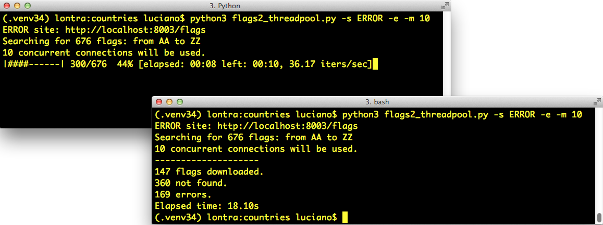

[[ch_executors]]
== Executores concorrentes
:example-number: 0
:figure-number: 0

[quote, Michele Simionato, profundo pensador de Python.]
____
Quem fala mal de threads são tipicamente programadoras de sistemas,
que têm em mente casos de uso que a programadora de aplicações típica nunca encontrará na vida.[...]
Em 99% dos casos de uso que a programadora de aplicações poderá encontrar,
o modelo simples de disparar um monte de threads independentes
e coletar os resultados em uma fila é tudo que se precisa
saber.footnote:[Trecho do texto 
https://fpy.li/20-1[_Threads, processes and concurrency in Python: some thoughts_]
(Threads, processos e concorrência em Python: algumas reflexões), resumido assim pelo autor:
"Removendo exageros sobre a (não-)revolução dos múltiplos núcleos e alguns comentários
sensatos (oxalá) sobre threads e outras formas de concorrência."]
____

Este((("concurrent executors", "purpose of"))) capítulo se concentra nas subclasses
de `concurrent.futures.Executor`, que incorporam o modelo descrito por
Michele Simionato: "disparar um monte
de threads independentes e coletar os resultados em uma fila".
Executores concorrentes implementam internamente este modelo,
não apenas com threads mas também com processos—que oferecem melhor desempenho
em tarefas de processamento intensivas no uso de CPUs.

Também((("futures", "definition of term"))) introduzo aqui o conceito de
_futures_—objetos que representam a execução assíncrona de uma operação,
similares aos _promises_ de JavaScript.
Esta ideia é a fundação de `concurrent.futures`
bem como do pacote `asyncio`, assunto do <<ch_async>>.

=== Novidades neste capítulo
Mudei((("concurrent executors", "significant changes to"))) o título deste capítulo de
"Concorrência com futures" para "Executores concorrentes",
porque os executores são o recurso de alto nível mais importante tratado aqui.
_Futures_ são objetos de baixo nível, tratados na <<where_futures_sec>>,
mas quase invisíveis no resto do capítulo.

Todos os exemplos de clientes HTTP agora usam a biblioteca
https://fpy.li/httpx[_HTTPX_], que oferece APIs síncronas e assíncronas.

Simplifiquei a configuração para os experimentos na <<flags2_sec>>,
porque desde o Python 3.7 o pacote https://fpy.li/20-2[`http.server`]
é _multi-thread_. Antes, o `http.server` só usava uma thread,
então não servia para experimentos com clientes concorrentes,
o que me obrigou a usar um servidor externo na primeira edição.

A <<launching_processes_sec>> agora demonstra como um executor simplifica o
código que vimos na <<code_for_multicore_prime_sec>>.

Por fim, movi a maior parte da teoria para o <<ch_concurrency_models>>,
_Modelos de concorrência em Python_.

[[ex_web_downloads_sec]]
=== Downloads concorrentes da Web

A((("network I/O", "essential role of concurrency in",
id="IOconcur20")))((("concurrent executors", "concurrent Web downloads",
id="CEwebdown20"))) concorrência é essencial para uma comunicação eficiente via
rede: em vez de esperar de braços cruzados por respostas de máquinas remotas, a
aplicação pode fazer outra coisa enquanto a resposta não
chega.

Para demonstrar, escrevi três programas simples que baixam da Web imagens de 20 bandeiras de países.
O primeiro, _flags.py_, roda sequencialmente:
ele só requisita a imagem seguinte quando a anterior foi baixada e salva localmente.
Os outros dois scripts fazem downloads concorrentes:
eles requisitam várias imagens quase ao mesmo tempo, e as salvam conforme chegam.
O script _flags_threadpool.py_ usa o pacote `concurrent.futures`,
enquanto _flags_asyncio.py_ usa `asyncio`.

Os scripts baixam imagens de _https://fluentpython.com_, que usa uma CDN
(_Content Delivery Network_, Rede de Entrega de Conteúdo),
então você pode observar resultados mais lentos nos primeiros testes.
Obtive os resultados no <<ex_flags_sample_runs>> após vários testes,
então o cache da CDN estava "quente" (carregado com os dados).

O <<ex_flags_sample_runs>> mostra o resultado da execução dos três scripts, três vezes cada um.

[[ex_flags_sample_runs]]
.Saida dos scripts flags.py, flags_threadpool.py, e flags_asyncio.py
====
[source, text]
----
$ python3 flags.py
BD BR CD CN DE EG ET FR ID IN IR JP MX NG PH PK RU TR US VN  <1>
20 flags downloaded in 7.26s  <2>
$ python3 flags.py
BD BR CD CN DE EG ET FR ID IN IR JP MX NG PH PK RU TR US VN
20 flags downloaded in 7.20s
$ python3 flags.py
BD BR CD CN DE EG ET FR ID IN IR JP MX NG PH PK RU TR US VN
20 flags downloaded in 7.09s
$ python3 flags_threadpool.py
DE BD CN JP ID EG NG BR RU CD IR MX US PH FR PK VN IN ET TR
20 flags downloaded in 1.37s  <3>
$ python3 flags_threadpool.py
EG BR FR IN BD JP DE RU PK PH CD MX ID US NG TR CN VN ET IR
20 flags downloaded in 1.60s
$ python3 flags_threadpool.py
BD DE EG CN ID RU IN VN ET MX FR CD NG US JP TR PK BR IR PH
20 flags downloaded in 1.22s
$ python3 flags_asyncio.py  <4>
BD BR IN ID TR DE CN US IR PK PH FR RU NG VN ET MX EG JP CD
20 flags downloaded in 1.36s
$ python3 flags_asyncio.py
RU CN BR IN FR BD TR EG VN IR PH CD ET ID NG DE JP PK MX US
20 flags downloaded in 1.27s
$ python3 flags_asyncio.py
RU IN ID DE BR VN PK MX US IR ET EG NG BD FR CN JP PH CD TR  <5>
20 flags downloaded in 1.42s
----
====

<1> A saída de cada execução começa com os códigos dos países de cada bandeira a medida que as imagens são baixadas, e termina com uma mensagem mostrando o tempo decorrido. Note que as siglas dos países estão em ordem alfabética, para podermos comparar com a ordem dos resultados nas versões concorrentes.

<2> _flags.py_ precisou em média de 7,18s para baixar 20 imagens.

<3> A média para _flags_threadpool.py_ foi 1,40s.

<4> Já _flags_asyncio.py_, obteve um tempo médio de 1,35s.

<5> Note a ordem dos códigos dos países: nos scripts concorrentes, as imagens foram baixadas em ordem diferente a cada vez.

As versões concorrentes são mais de cinco vezes mais rápidas que o script sequencial,
mas entre as versões concorrentes não há diferença significativa de desempenho. 
Nestes exemplos, a tarefa é baixar 20 arquivos, com poucos kilobytes cada um.
Se você escalar a tarefa para centenas de downloads,
os scripts concorrentes podem superar o código sequencial por um fator de 20 ou mais.

[WARNING]
====

Ao testar clientes HTTP concorrentes usando servidores Web públicos, você pode
acidentalmente lançar um ataque de negação de serviço (DoS, _Denial of Service_,
negação de serviço),
ou se tornar suspeito de tentar um ataque. No caso do
<<ex_flags_sample_runs>> não há problema, pois aqueles scripts estão codificados
para realizar apenas 20 requisições. Mais adiante neste capítulo usaremos o
pacote `http.server` de Python para executar localmente outros testes com
centenas de requisições.

====

Vamos agora estudar as implementações de dois dos scripts testados no
<<ex_flags_sample_runs>>: _flags.py_ e _flags_threadpool.py_. Vou deixar o
terceiro, _flags_asyncio.py_, para o <<ch_async>>, mas queria demonstrar os três
juntos para fazer duas observações:

. Independente dos elementos de concorrência que você use—threads ou
corrotinas—haverá um ganho enorme de desempenho sobre código sequencial em
operações de E/S de rede, se o script for escrito corretamente.

. Para clientes HTTP que podem controlar quantas requisições eles fazem, não há
diferenças significativas de desempenho entre threads e
corrotinas.footnote:[Para servidores que podem receber requisições de muitos
clientes, há uma diferença: as corrotinas escalam melhor, pois usam menos
memória que as threads, e também reduzem o custo das mudanças de contexto, que
mencionei na <<thread_non_solution_sec>>.]

Agora vamos ao código.((("", startref="IOconcur20")))

==== Um script de download sequencial

O <<flags_module_ex>> contém((("network I/O", "sequential download script",
id="IOsequen20"))) a implementação de _flags.py_, o primeiro script que rodamos
no <<ex_flags_sample_runs>>. Não é muito interessante, mas vamos reutilizar a
maior parte do código e das configurações para implementar os scripts
concorrentes, então ele merece alguma atenção.

[NOTE]
====

Por uma questão didática, o <<flags_module_ex>> não faz tratamento de erros.
Vamos tratar exceções em outros exemplos, mas agora vamos focar na
estrutura básica do código, para facilitar a comparação deste script com os
scripts que usam concorrência.

====

[[flags_module_ex]]
.flags.py: script de download sequencial; algumas funções serão reutilizadas pelos outros scripts
====
[source, python]
----
include::../code/20-executors/getflags/flags.py[tags=FLAGS_PY]
----
====

<1> Importa a biblioteca `httpx`. Ela não é parte da biblioteca padrão. Assim,
por convenção, a importação aparece após os módulos da biblioteca padrão e uma
linha em branco.

<2> Lista do código de país ISO 3166 para os 20 países mais populosos, em ordem
decrescente de população.

<3> O diretório com as imagens das bandeiras.footnote:[As imagens são
originalmente do https://fpy.li/20-4[CIA World Factbook], uma publicação de
domínio público do governo norte-americano. Copiei as imagens para o meu site,
para evitar o risco de lançar um ataque de DoS contra _cia.gov_.]

<4> Diretório local onde as imagens são salvas.

<5> Salva os bytes de `img` em `filename` no `DEST_DIR`.

<6> Dado um código de país, constrói a URL e baixa a imagem, retornando o
conteúdo binário da resposta.

<7> É uma boa prática adicionar um timeout razoável para operações de rede, para
evitar ficar bloqueado  sem motivo por vários minutos.

<8> Por default, o _HTTPX_ não segue redirecionamentos.footnote:[Definir
`follow_redirects=True` não é necessário neste exemplo, mas eu queria destacar
essa importante diferença entre _HTTPX_ e _requests_. Além disso, definir
`follow_redirects=True` no exemplo permite que eu coloque os
arquivos de imagem em outro lugar no futuro. Considero sensata a configuração default
do _HTTPX_, `follow_redirects=False`, pois
redirecionamentos inesperados podem mascarar requisições desnecessárias e
complicar o diagnóstico de erros.]

<9> Não há tratamento de erros neste script, mas o método `.raise_for_status` 
lança uma exceção se o status da resposta HTTP não está na faixa 2XX, para evitar
falhas silenciosas.

<10> `download_many` é a função chave para comparar com as implementações
concorrentes.

<11> Percorre a lista de códigos de país em ordem alfabética, para facilitar a
confirmação de que a ordem é preservada na saída; devolve o número de códigos de
país baixados.

<12> Mostra um código de país por vez na mesma linha, para vermos o progresso a
cada download. O argumento `end=' '` substitui a quebra de linha no final de
cada `print` por um espaço, assim todos os códigos de país aparecem
na mesma linha. O argumento `flush=True` é necessário porque,
por default, o Python usa um buffer de linha na saída padrão, 
então só após uma quebra de linha o resultado seria visível no terminal.
A opção `flush=True` força o esvaziamento do buffer,
então podemos ver as siglas aparecendo progressivamente.

<13> `main` precisa ser invocada passando a função que fará os downloads; assim
podemos usar `main` como uma função de biblioteca com outras implementações de
`download_many` nos exemplos de `threadpool` e `ascyncio`.

<14> Cria o `DEST_DIR` se necessário; não acusa erro se o diretório existir.

<15> Registra e apresenta o tempo decorrido após rodar a função `downloader`.

<16> Invoca `main` com a função `download_many`.

[TIP]
====
A biblioteca https://fpy.li/httpx[_HTTPX_] é inspirada no pacote pythônico
https://fpy.li/20-5[_requests_],
mas foi desenvolvida sobre bases mais modernas.
Em particular, _HTTPX_ oferece APIs síncronas e assíncronas,
então podemos usá-la em todos os exemplos de clientes HTTP neste capítulo e no próximo.
A biblioteca padrão do Python contém o módulo `urllib.request`,
mas sua API é somente síncrona, e não é nada amigável.
====

Não há nada de novo em _flags.py_, mas serve de base para comparação
com outros scripts, e o usei como uma biblioteca, para evitar código redundante ao implementá-los.
Vamos ver agora uma reimplementação usando `concurrent.futures`.((("", startref="IOsequen20")))

[[downloading_with_futures_sec]]
==== Download com `concurrent.futures`

Os((("network I/O", "downloading with concurrent.futures",
id="IOfutures20")))((("concurrent.futures", "downloading with", id="confut20")))
principais recursos do pacote `concurrent.futures` são as classes
`ThreadPoolExecutor` e `ProcessPoolExecutor`, que implementam uma API para
submeter _callables_ (invocáveis) para execução em um banco de threads ou
processos (_thread pool_ ou _process pool_).
As classes gerenciam de forma transparente um banco de threads ou
processos de trabalho, e filas para distribuição de tarefas e coleta de
resultados. Mas a interface é de um nível muito alto,
então não precisamos lidar diretamente com estes
componentes em um caso de uso simples como nossos downloads de bandeiras.

O <<flags_threadpool_ex>> mostra a forma mais fácil de implementar os downloads de forma concorrente, usando o método `ThreadPoolExecutor.map`.

[[flags_threadpool_ex]]
.flags_threadpool.py: script de download com threads, usando `futures.ThreadPoolExecutor`
====
[source, python]
----
include::../code/20-executors/getflags/flags_threadpool.py[tags=FLAGS_THREADPOOL]
----
====
<1> Reutiliza algumas funções do módulo `flags` (<<flags_module_ex>>).
<2> Função para baixar uma única imagem; é ela que cada thread de trabalho vai executar.
<3> Instancia o `ThreadPoolExecutor` como um gerenciador de contexto;
o método `executor.__exit__` vai invocar `executor.shutdown(wait=True)`,
que bloqueia até que todas as threads terminem de rodar.
<4> O método `map` é similar à função embutida `map`, mas a função `download_one` será chamada de forma concorrente por múltiplas threads; ele devolve um gerador que você pode iterar para recuperar o valor devolvido por cada chamada da função—neste caso, cada chamada a `download_one` vai retornar um código de país.
<5> Devolve o número de resultados obtidos. Se alguma das chamadas das threads levantar uma exceção, aquela exceção será levantada aqui quando a chamada implícita `next()`, dentro do construtor de `list`, tentar recuperar o valor de retorno correspondente, no iterador devolvido por `executor.map`.
<6> Chama a função `main` do módulo `flags`, passando a versão concorrente de `download_many`.

Observe que a função `download_one` do <<flags_threadpool_ex>> é essencialmente
o corpo do laço `for` na função `download_many` do <<flags_module_ex>>. Esta é
uma refatoração comum quando em código concorrente: transformar
o corpo de um laço `for` sequencial em uma função a ser chamada de modo
concorrente.

[TIP]
====
O <<flags_threadpool_ex>> é muito curto porque pude reutilizar a maior parte das funções do script sequencial _flags.py_.
Uma das melhores características do `concurrent.futures` é facilitar a execução concorrente de código sequencial.
====

O construtor de `ThreadPoolExecutor` recebe muitos argumentos além dos mostrados
aqui, mas o primeiro e mais importante é `max_workers`, definindo o número
máximo de threads de trabalho a serem executadas. Quando `max_workers` é `None`
(o default), `ThreadPoolExecutor` decide seu valor
usando a seguinte expressão, desde o Python 3.8:

[source, python]
----
max_workers = min(32, os.cpu_count() + 4)
----

A justificativa é apresentada na https://fpy.li/aj[documentação de `ThreadPoolExecutor`]:

[quote]
____

Este valor default reserva pelo menos 5 threads de trabalho para tarefas de E/S.
Ele utiliza no máximo 32 núcleos da CPU para tarefas de processamento que
liberam a GIL. E ele evita usar implicitamente recursos demais em
máquinas com muitos núcleos.

`ThreadPoolExecutor` agora também reutiliza threads de inativas antes
de iniciar a quantidade de threads de trabalho definida em `max_workers`.

____

Concluindo: o valor default calculado de `max_workers` é razoável, e
`ThreadPoolExecutor` evita iniciar novas threads de trabalho desnecessariamente.
Entender a lógica por trás de `max_workers` pode ajudar a decidir quando e como
definir um valor diferente do default em seu código.

A biblioteca se chama `concurrency.futures`, mas não há qualquer _future_
à vista no <<flags_threadpool_ex>>,
então você pode estar se perguntando onde eles estão.
A próxima seção explica.((("", startref="confut20")))((("", startref="IOfutures20")))

[[where_futures_sec]]
==== Onde estão os _futures_?

Os((("network I/O", "role of futures", id="IOfuturesrole20")))((("futures",
"basics of", id="Fbasic20"))) _futures_ (literalmente "futuros") são componentes
centrais de `concurrent.futures` e de `asyncio`, mas como usuários dessas
bibliotecas, raramente os vemos. O <<flags_threadpool_ex>> depende de _futures_
por trás do palco, mas o código apresentado não lida diretamente com objetos
desta classe. Esta seção apresenta uma visão geral dos _futures_, com um exemplo
mostrando-os em ação.

Desde o Python 3.4, há duas classes chamadas `Future` na biblioteca padrão:
`concurrent.futures.Future` e `asyncio.Future`.
Elas têm o mesmo propósito:
uma instância de qualquer uma das classes `Future` representa um processamento adiado,
que pode ou não ter sido completado.
Isso é algo similar à classe `Deferred` no Twisted,
a classe `Future` no Tornado, e objetos `Promise` em JavaScript moderno.

Os _futures_ encapsulam operações pendentes de forma que possamos colocá-los em filas,
verificar se terminaram, e recuperar resultados (ou exceções) quando eles ficam disponíveis.

É importante entender que eu e você não devemos criar _futures_ diretamente:
eles devem ser instanciados exclusivamente pelo framework de concorrência,
seja ele `concurrent.futures` ou `asyncio`.
O motivo é que uma instância de `Future` representa algo que será executado em algum momento,
portanto precisa ser agendado para rodar, e quem agenda tarefas é o framework.

Especificamente, instâncias de `concurrent.futures.Future` são criadas como resultado de submeter um objeto invocável (_callable_)
para execução a uma subclasse de `concurrent.futures.Executor`.
Por exemplo, o método `Executor.submit()` recebe um invocável, agenda sua execução, e devolve um `Future`.

O código da aplicação não deve mudar o estado de um _future_:
o framework de concorrência muda o estado de um _future_ quando
o processamento que ele representa termina, e não controlamos quando isso acontece.

Os dois tipos de `Future` têm um método `.done()` não-bloqueante, que devolve um `bool` informando se o invocável encapsulado por aquele `future` foi ou não executado.
Entretanto, em vez de perguntar repetidamente se um _future_ terminou, o código cliente em geral pede para ser notificado.
Por isso as duas classes `Future` têm um método `.add_done_callback()`:
você passa a ele uma função que será invocada com o _future_ como único argumento, quando o _future_ tiver terminado.
Aquela função de callback será invocada na mesma thread ou processo de trabalho que rodou a função encapsulada no _future_.

Há também um método `.result()`, que funciona igual nas duas classes quando a execução do _future_ termina:
ele devolve o resultado do invocável, ou relança qualquer exceção que possa ter aparecido quando o invocável foi executado.
Entretanto, quando o _future_ não terminou, o comportamento do método `result` é bem diferente entre os dois sabores de `Future`.
Em uma instância de `concurrency.futures.Future`,
invocar `f.result()` vai bloquear a thread que chamou até o resultado ficar pronto.
Um argumento `timeout` opcional pode ser passado, e se o _future_ não tiver terminado após aquele tempo, o método `result` gera um `TimeoutError`.
O método `asyncio.Future.result` não suporta um timeout, e `await` é a forma preferencial de obter o resultado de _futures_ no `asyncio`—mas `await` não funciona com instâncias de `concurrency.futures.Future`.

Várias funções em ambas as bibliotecas devolvem _futures_; outras os usam em sua implementação de uma forma transparente para o usuário.
Um exemplo deste último caso é o `Executor.map`, que vimos no <<flags_threadpool_ex>>:
ele devolve um iterador no qual `+__next__+` chama o método `result` de cada _future_,
então recebemos os resultados dos _futures_, mas não os _futures_ em si.

==== Lidando com _futures_

Para ver uma experiência prática com os _futures_, podemos reescrever o <<flags_threadpool_ex>> para usar a função https://fpy.li/ak[`concurrent.futures.as_completed`], que recebe um iterável de _futures_ e devolve um iterador que
entrega _futures_ quando cada um encerra sua execução.

Usar `futures.as_completed` exige mudanças apenas na função `download_many`.
A chamada ao `executor.map`, de alto nível, é substituída por dois laços `for`:
um para criar e agendar os _futures_, o outro para recuperar seus resultados.
Já que estamos aqui, vamos acrescentar algumas chamadas a `print` para mostrar cada _future_ antes e depois do término de sua execução.
O <<flags_threadpool_futures_ex>> mostra o código da nova função `download_many`.
O código de `download_many` aumentou de 5 para 17 linhas,
mas agora podemos inspecionar os misteriosos _futures_.
As outras funções são idênticas às do <<flags_threadpool_ex>>.

[[flags_threadpool_futures_ex]]
.flags_threadpool_futures.py: substitui `executor.map` por `executor.submit` e `futures.as_completed` na função `download_many`
====
[source, python]
----
include::../code/20-executors/getflags/flags_threadpool_futures.py[tags=FLAGS_THREADPOOL_AS_COMPLETED]
----
====
[role="pagebreak-before less_space"]
<1> Para esta demonstração, usa apenas os cinco países mais populosos.
<2> Configura `max_workers` para `3`, para podermos ver os _futures_ pendentes na saída.
<3> Itera pelos códigos de país em ordem alfabética, para deixar claro que os resultados vão aparecer fora de ordem.
<4> `executor.submit` agenda o invocável a ser executado, e devolve o `future` representando essa operação pendente.
<5> Armazena cada `future`, para podermos recuperá-los mais tarde com `as_completed`.
<6> Mostra uma mensagem com o código do país e seu respectivo `future`.
<7> `as_completed` produz _futures_ à medida que eles terminam.
<8> Recupera o resultado deste `future`.
<9> Exibe o `future` e seu resultado.

A chamada a `future.result()` nunca bloqueará a thread neste
exemplo, pois `future` está vindo de `as_completed`. O
<<flags_threadpool_futures_run>> mostra a saída de uma execução do
<<flags_threadpool_futures_ex>>.

[[flags_threadpool_futures_run]]
.Saída de flags_threadpool_futures.py
====
[source, text]
----
$ python3 flags_threadpool_futures.py
Scheduled for BR: <Future at 0x100791518 state=running> <1>
Scheduled for CN: <Future at 0x100791710 state=running>
Scheduled for ID: <Future at 0x100791a90 state=running>
Scheduled for IN: <Future at 0x101807080 state=pending> <2>
Scheduled for US: <Future at 0x101807128 state=pending>
CN <Future at 0x100791710 state=finished returned str> result: 'CN' <3>
BR ID <Future at 0x100791518 state=finished returned str> result: 'BR' <4>
<Future at 0x100791a90 state=finished returned str> result: 'ID'
IN <Future at 0x101807080 state=finished returned str> result: 'IN'
US <Future at 0x101807128 state=finished returned str> result: 'US'

5 downloads in 0.70s
----
====
<1> Os _futures_ são agendados em ordem alfabética; o `repr()` de um `future` mostra seu estado: os três primeiros estão `running`, pois há três threads de trabalho.
<2> Os dois últimos `futures` estão `pending`; esperando pelas threads de trabalho.
<3> O primeiro `CN` aqui é a saída de `download_one` em uma thread de trabalho; o resto da linha é a saída de `download_many`.
<4> Aqui, duas threads exibem códigos antes que `download_many` na thread principal possa mostrar o resultado da primeira thread.

[TIP]
====
Recomendo brincar com _flags_threadpool_futures.py_.
Se você o rodar várias vezes, verá a ordem dos resultados variar.
Aumentar `max_workers` para `5` aumentará a variação na ordem dos resultados.
Diminuir aquele valor para `1` fará o script rodar sequencialmente, e a ordem dos resultados será sempre a ordem das chamadas a `submit`.
====

Vimos duas variantes do script de download usando `concurrent.futures`:
uma no <<flags_threadpool_ex>> com `ThreadPoolExecutor.map` e
uma no <<flags_threadpool_futures_ex>> com `futures.as_completed`.
Se tem curiosidade sobre o código de _flags_asyncio.py_,
veja o <<flags_asyncio_ex>> do <<ch_async>>, onde ele é explicado.

Agora vamos dar uma olhada rápida em um modo simples de evitar a GIL para
tarefas que usam a CPU intensivamente, usando 
`concurrent.futures`.((("", startref="Fbasic20")))((("", startref="IOfuturesrole20")))((("", startref="CEwebdown20")))

[[launching_processes_sec]]
=== Processos com `concurrent.futures`

A((("concurrent executors", "launching processes with concurrent.futures",
id="CElaunch20")))((("concurrent.futures", "launching processes with",
id="CFlaunch20")))((("processes", "launching with concurrent.futures",
id="Plaunch20")))
https://fpy.li/am[página de documentação] de
`concurrent.futures` tem o subtítulo _Iniciando tarefas em paralelo_. O
pacote permite computação paralela em máquinas multi-núcleo porque suporta a
distribuição de trabalho entre vários processos Python usando a classe
`ProcessPoolExecutor`.

As classes `ProcessPoolExecutor` e `ThreadPoolExecutor` implementam a interface
https://fpy.li/20-9[`Executor`],
então é fácil mudar de uma solução baseada em threads para uma baseada em processos usando `concurrent.futures`.

Não há vantagem em usar um `ProcessPoolExecutor` no exemplo de download de bandeiras ou em qualquer tarefa limitada por E/S.
É fácil comprovar, alterando as seguintes linhas no <<flags_threadpool_ex>>:

[source, python]
----
def download_many(cc_list: list[str]) -> int:
    with futures.ThreadPoolExecutor() as executor:
----

para:

[source, python]
----
def download_many(cc_list: list[str]) -> int:
    with futures.ProcessPoolExecutor() as executor:
----

O construtor de `ProcessPoolExecutor` também tem um parâmetro `max_workers`, que
por default é `None`. Nesse caso, o executor limita o número de processos de
trabalho ao número resultante de uma chamada a `os.cpu_count()`.

Processos usam mais memória e demoram mais para iniciar que threads, então o real valor de of `ProcessPoolExecutor` é em tarefas de uso intensivo da CPU.
Vamos voltar ao exemplo de teste de checagem de números primos da <<naive_multiprocessing_sec>>, e reescrevê-lo com `concurrent.futures`.

[[multicore_prime_redux_sec]]
==== A volta do checador de primos multi-núcleos

Na <<code_for_multicore_prime_sec>>, estudamos _procs.py_, um script que checava se alguns números grandes eram primos usando `multiprocessing`.
No <<proc_pool_py>> resolvemos o mesmo problema com o programa _proc_pool.py_, usando um `ProcessPool.Executor`.
Do primeiro `import` até a chamada a `main()` no final, _procs.py_ tem 43 linhas de código não-vazias, e _proc_pool.py_ tem 31—uma redução de 28%.

[[proc_pool_py]]
.proc_pool.py: _procs.py_ reescrito com `ProcessPoolExecutor`
====
[source, python]
----
include::../code/20-executors/primes/proc_pool.py[tags=PRIMES_POOL]
----
====

<1> Não precisamos importar `multiprocessing`, `SimpleQueue` etc.;
`concurrent.futures` esconde tudo isso.

<2> A tupla `PrimeResult` e a função `check` são as mesmas que vimos em
_procs.py_, mas não precisamos mais das filas nem da função `worker`.

<3> Em vez de definir quantos processos de trabalho serão
usados se um argumento não for passado na linha de comando, atribuímos `None` a
`workers` e deixamos o `ProcessPoolExecutor` decidir.

<4> Aqui criei o `ProcessPoolExecutor` antes do bloco `with` em `⑦`, para poder
mostrar o número real de processos na próxima linha.

<5> `_max_workers_` é um atributo de instância não documentado de um
`ProcessPoolExecutor`. Decidi usá-lo para mostrar o número de processos de
trabalho criados quando a variável `workers` é `None`. O _Mypy_
reclama quando eu acesso esse atributo, então coloquei o comentário `type:
ignore` para silenciar o aviso.

<6> Ordena os números a serem checados em ordem descendente. Isto vai mostrar a
diferença no comportamento de _proc_pool.py_ quando comparado a _procs.py_. Veja
a explicação após esse exemplo.

<7> Usa o `executor` como um gerenciador de contexto.

<8> A chamada a `executor.map` devolve as instâncias de `PrimeResult` retornadas
por `check` na mesma ordem dos argumentos `numbers`.

Se você rodar o <<proc_pool_py>>, verá os resultados aparecendo em ordem rigorosamente descendente, como mostrado no <<proc_pool_py_output>>.
Por outro lado, a ordem da saída de _procs.py_ (da <<proc_based_solution>>) é determinada pela dificuldade em checar se cada número é ou não primo.
Por exemplo, _procs.py_ mostra o resultado para 7777777777777777 próximo ao topo, pois ele tem 7 como divisor, então `is_prime` rapidamente determina que ele não é primo.

O número 7777777536340681 é 88191709^2^. Como estes fatores grandes, `is_prime` vai demorar mais para determinar que é um número composto,
e ainda mais para descobrir que 7777777777777753 é primo. Por isso esses números aparecem perto do final da saída do _procs.py_ original.

Ao rodar _proc_pool.py_, podemos observar não apenas a ordem descendente dos resultados, mas também que o programa parece emperrar após mostrar o resultado de 9999999999999999.

[[proc_pool_py_output]]
.Saída de proc_pool.py
====
[source, text]
----
$ ./proc_pool.py
Checking 20 numbers with 12 processes:
9999999999999999     0.000024s  # <1>
9999999999999917  P  9.500677s  # <2>
7777777777777777     0.000022s  # <3>
7777777777777753  P  8.976933s
7777777536340681     8.896149s
6666667141414921     8.537621s
6666666666666719  P  8.548641s
6666666666666666     0.000002s
5555555555555555     0.000017s
5555555555555503  P  8.214086s
5555553133149889     8.067247s
4444444488888889     7.546234s
4444444444444444     0.000002s
4444444444444423  P  7.622370s
3333335652092209     6.724649s
3333333333333333     0.000018s
3333333333333301  P  6.655039s
 299593572317531  P  2.072723s
 142702110479723  P  1.461840s
               2  P  0.000001s
Total time: 9.65s
----
====
<1> Esta linha aparece muito rápido.
<2> Esta linha demora mais de 9,5s para aparecer.
<3> As linhas restantes aparecem quase imediatamente.

Agora vamos entender o comportamento estranho de _proc_pool.py_:

* Como mencionado antes, `executor.map(check, numbers)` devolve o resultado na mesma ordem em que `numbers` é submetido.
* Por default, _proc_pool.py_ usa um número de processos de trabalho igual ao número de CPUs—isso é o que `ProcessPoolExecutor` faz quando `max_workers` é `None`. Neste laptop foram 12 processos.
* Como estamos submetendo `numbers` em ordem descendente, o primeiro é 9999999999999999; com 9 como divisor, ele retorna rapidamente.
* O segundo número é 9999999999999917, o maior número primo na amostra. Ele vai demorar mais que todos os outros para checar.
* Enquanto isso, os 11 processos restantes estarão checando outros números, que são ou primos ou compostos com fatores grandes ou compostos com fatores muito pequenos.
* Quando o processo de trabalho encarregado de 9999999999999917 finalmente determina que ele é primo, todos os outros processos já completaram suas últimas tarefas, então os resultados aparecem logo depois.

[NOTE]
====

Apesar do progresso de _proc_pool.py_ não ser tão visível quanto o de
_procs.py_ na <<code_for_multicore_prime_sec>>, o tempo total de execução é praticamente igual
ao retratado na <<procs_x_time_fig>> do <<ch_concurrency_models>>, 
para as mesmas quantidades de processos de trabalho e núcleos de CPU.

====

Entender como programas concorrentes se comportam não é fácil,
então aqui está um segundo experimento que pode ajudar a visualizar o
funcionamento de `Executor.map`.((("", startref="CFlaunch20")))((("",
startref="CElaunch20")))((("", startref="Plaunch20")))

=== Experimento com `Executor.map`

Vamos((("concurrent executors", "Executor.map",
id="CEexecutormap20")))((("Executor.map", id="execumap20"))) investigar
`Executor.map`, agora usando um `ThreadPoolExecutor` com três threads de
trabalho rodando cinco invocáveis que exibem mensagens com data/hora. O código
está no <<demo_executor_map_ex>>, o resultado no <<demo_executor_map_run>>.

[[demo_executor_map_ex]]
.demo_executor_map.py: Uma demonstração simples do método map de `ThreadPoolExecutor`
====
[source, python]
----
include::../code/20-executors/demo_executor_map.py[tags=EXECUTOR_MAP]
----
====

<1> Esta função exibe o momento da execução no formato `[HH:MM:SS]` e os
argumentos recebidos.

<2> `loiter` significa "vadiar"; esta função não faz nada além mostrar uma
mensagem quando inicia, cochilar por `n` segundos, e mostrar uma mensagem quando
termina; usei tabulações para indentar as mensagens de acordo com o valor de `n` 

<3> `loiter` devolve `n + 10`, para que o valor devolvido seja diferente do
argumento `n`, tornando mais visível o fluxo de dados.

<4> Cria um `ThreadPoolExecutor` com três threads.

<5> Submete cinco tarefas para o `executor`. Como há três threads,
apenas três daquelas tarefas vão iniciar imediatamente: a chamadas `loiter(0)`,
`loiter(1)`, e `loiter(2)`; `executor.map` não bloqueia, retorna imediatamente.

<6> Exibe `results` devolvido por `executor.map`: é um
gerador, como se vê na saída no <<demo_executor_map_run>>.

<7> A chamada `enumerate` no laço `for` invocará implicitamente
`next(results)`, que por sua vez invocará `f.result()` no _future_ (interno)
`f`, representando a primeira chamada, `loiter(0)`. O método `result`
bloqueará a thread até que o _future_ termine, portanto cada volta nesse laço vai
esperar até que o próximo resultado esteja disponível.

Sugiro que você rode o <<demo_executor_map_ex>> para ver o resultado sendo exibido incrementalmente.

Para experimentar, altere o argumento `max_workers` do `ThreadPoolExecutor`.
Mude também a chamada a `range`, que produz os argumentos para invocar `executor.map`—ou
forneça uma lista de valores escolhidos, para criar intervalos diferentes.

O <<demo_executor_map_run>> mostra um teste do <<demo_executor_map_ex>>.

[[demo_executor_map_run]]
.Amostra da execução de demo_executor_map.py, do <<demo_executor_map_ex>>
====
[source, text]
----
$ python3 demo_executor_map.py
[15:56:50] Script starting.  <1>
[15:56:50] loiter(0): napping for 0s...  <2>
[15:56:50] loiter(0): done.
[15:56:50]      loiter(1): napping for 1s...  <3>
[15:56:50]              loiter(2): napping for 2s...
[15:56:50] results: <generator object result_iterator at 0x106517168>  <4>
[15:56:50]                      loiter(3): napping for 3s...  <5>
[15:56:50] Waiting for individual results:
[15:56:50] result 0: 10  <6>
[15:56:51]      loiter(1): done. <7>
[15:56:51]                              loiter(4): napping for 4s...
[15:56:51] result 1: 11  <8>
[15:56:52]              loiter(2): done.  <9>
[15:56:52] result 2: 12
[15:56:53]                      loiter(3): done.
[15:56:53] result 3: 13
[15:56:55]                              loiter(4): done.  <10>
[15:56:55] result 4: 14
----
====

<1> Este teste começou em 15:56:50.

<2> A primeira thread executa `loiter(0)`, então vai cochilar por 0s e retornar
antes mesmo da segunda thread ter chance de começar, mas YMMV.footnote:[Acrônimo
de _your mileage may vary_, algo como "sua quilometragem pode variar", querendo
dizer "seu caso pode ser diferente". Com threads, você nunca sabe a sequência
exata de eventos que deveriam acontecer quase ao mesmo tempo; é possível que, em
outra máquina, se veja `loiter(1)` começar antes de `loiter(0)` terminar,
especialmente porque `sleep` sempre libera a GIL, então Python pode mudar para
outra thread mesmo se você dormir por 0s.]

<3> `loiter(1)` e `loiter(2)` começam imediatamente (como o banco de threads tem
três threads de trabalho, é possível rodar três funções concorrentemente).

<4> Isto mostra que `results` devolvido por `executor.map` é um gerador: nada
até aqui é bloqueante, independente do número de tarefas e do valor de
`max_workers`.

<5> Como `loiter(0)` terminou, a primeira thread de trabalho está disponível
para processar `loiter(3)`.

<6> Aqui é onde a execução pode ser bloqueada, dependendo dos parâmetros
passados nas chamadas a `loiter`: o método `+__next__+` do gerador `results`
precisa esperar até o primeiro _future_ completar. Neste caso, ele não vai
bloquear porque a chamada a `loiter(0)` terminou antes deste laço iniciar.
Observe que tudo até aqui aconteceu dentro do mesmo segundo: 15:56:50.

<7> `loiter(1)` termina um segundo depois, em 15:56:51. A segunda thread está livre para
iniciar `loiter(4)`.

<8> O resultado de `loiter(1)` é exibido: `11`. Agora o laço `for` ficará
bloqueado, esperando o resultado de `loiter(2)`.

<9> O padrão se repete: `loiter(2)` terminou, seu resultado é exibido; o mesmo
ocorre com `loiter(3)`.

<10> Há um intervalo de 2s até `loiter(4)` terminar, porque ela começou em
15:56:51 e cochilou por 4s.

A função `Executor.map` é fácil de usar, mas muitas vezes é preferível obter o resultado
de cada tarefa assim que esteja pronta, e não necessariamente na ordem em que foram submetidas.
Para isso, precisamos de uma combinação do método
`Executor.submit` e da função `futures.as_completed` como vimos no
<<flags_threadpool_futures_ex>>. Vamos voltar a essa técnica na
<<using_futures_as_completed_sec>>.

[TIP]
====

A combinação de `Executor.submit` e `futures.as_completed` é mais flexível que
`executor.map`, pois você pode submeter invocáveis diferentes e argumentos
diferentes. Já `executor.map` é projetado para rodar o mesmo invocável com
argumentos diferentes. Além disso, o conjunto de _futures_ que você passa para
`futures.as_completed` pode vir de mais de um executor—talvez alguns tenham sido
criados por uma instância de `ThreadPoolExecutor` enquanto outros vêm de um
`ProcessPoolExecutor`.

====

Na próxima seção vamos retomar os exemplos de download de bandeiras com novos
requisitos que vão nos obrigar a iterar sobre os resultados de
`futures.as_completed` em vez de usar `executor.map`.((("",
startref="execumap20")))((("", startref="CEexecutormap20")))

[[flags2_sec]]
=== Barra de progresso e tratamento de erros

Como((("concurrent executors", "downloads with progress display and error handling",
id="CEdown20")))((("network I/O", "downloads with progress display and error handling",
id="IOprog20")))((("progress displays",
id="progdisp20")))((("error handling, in network I/O", secondary-sortas="network I/O",
id="EHnetwork20"))) mencionado, os scripts na <<ex_web_downloads_sec>> não
têm tratamento de erros, para torná-los mais fáceis de ler e para comparar a
estrutura das três abordagens: sequencial, com threads e assíncrona.

Para testar o tratamento de uma variedade de condições de erro, criei os exemplos `flags2`:

flags2_common.py:: Este módulo contém as funções e configurações comuns, usadas
por todos os exemplos da série `flags2`, incluindo a função `main`, que cuida de
ler os argumentos da linha de comando, medir o tempo e mostrar os
resultados. Isto é código de apoio, sem relevância direta para o assunto desse
capítulo, então não vou incluir o código-fonte aqui, mas você pode vê-lo no
https://fpy.li/code[«repositório de exemplos»], arquivo
https://fpy.li/20-10[_20-executors/getflags/flags2_common.py_].

flags2_sequential.py:: Um cliente HTTP sequencial com tratamento de erro correto e a exibição de uma barra de progresso. Sua função `download_one` também é usada por `flags2_threadpool.py`.

flags2_threadpool.py:: Cliente HTTP concorrente, baseado em `futures.ThreadPoolExecutor`, para demonstrar o tratamento de erros e a integração da barra de progresso.

flags2_asyncio.py:: Mesma funcionalidade do exemplo anterior, mas implementado com  `asyncio` e `httpx`. Será explicado na <<flags2_asyncio_sec>>, no <<ch_async>>.

[[careful_testing_clients]]
[WARNING]
.Tenha cuidado ao testar clientes concorrentes
====
Ao testar clientes HTTP concorrentes em servidores Web públicos, você pode gerar muitas requisições por segundo, e é assim que ataques de negação de serviço (DoS, _denial-of-service_) são feitos.
Monitore cuidadosamente seus clientes quando for usar servidores públicos.
Para testar, configure um servidor HTTP local. Veja instruções após o <<flags2_help_demo>>.
====

A característica mais visível dos exemplos `flags2` é sua barra de progresso
animada em modo texto, implementada com o https://fpy.li/20-11[pacote _tqdm_].
Publiquei no YouTube um
https://fpy.li/20-12[«vídeo de 108s»] mostrando a barra de
progresso e comparando a velocidade dos três scripts `flags2`. No vídeo, começo
com o download sequencial, mas interrompo a execução após 32s. O script
demoraria mais de 5 minutos para acessar 676 URLs e baixar 194 bandeiras. Então
rodo o script que usa threads e o script que usa `asyncio`, três vezes cada um, e todas
as vezes eles completam a tarefa em 6s ou menos (isto é mais de 60 vezes mais
rápido). A <<flags2_progress_fig>> mostra duas capturas de tela: durante e após
a execução de _flags2_threadpool.py_.

[[flags2_progress_fig]]
.Acima: flags2_threadpool.py rodando com a barra de progresso em tempo real gerada pelo tqdm; abaixo: mesma janela do terminal após o script terminar de rodar.

O exemplo de uso mais simples do _tqdm_ aparece em um _.gif_ animado, no https://fpy.li/20-13[_README.md_] do projeto.
Se você digitar o código abaixo no console de Python após instalar o pacote _tqdm_,
uma barra de progresso animada aparecerá no lugar onde está o comentário:

[source, python]
----
>>> import time
>>> from tqdm import tqdm
>>> for i in tqdm(range(1000)):
...     time.sleep(.01)
...
>>> # -> a barra de progresso aparece aqui <-
----

Além do efeito bonitinho, o gerador `tqdm` também é interessante
conceitualmente: ele consome qualquer iterável, e produz um iterador que,
enquanto é consumido, mostra a barra de progresso e estima o tempo restante para
completar todas as iterações. Para fazer a estimativa, o `tqdm` precisa
receber um iterável que implemente `len`, ou o argumento
`total=` com o número esperado de itens. Integrar o `tqdm` com nossos exemplos
`flags2` permite observar mais profundamente o
funcionamento real dos scripts concorrentes, obrigando-nos a usar as funções
https://fpy.li/20-7[`futures.as_completed`] e
https://fpy.li/20-15[`asyncio.as_completed`], para que o `tqdm` atualize
a barra de progresso conforme cada `future` termina.

A outra característica dos exemplos `flags2` é a interface de linha de comando.
Todos os três scripts aceitam várias opções para experimentar,
que você pode ver passando a opção `-h`.
O <<flags2_help_demo>> mostra o texto de ajuda.

[[flags2_help_demo]]
.Tela de ajuda dos scripts da série flags2
====
[source, text]
----
$ python3 flags2_threadpool.py -h
usage: flags2_threadpool.py [-h] [-a] [-e] [-l N] [-m CONCURRENT] [-s LABEL]
                            [-v]
                            [CC [CC ...]]

Download flags for country codes. Default: top 20 countries by population.

positional arguments:
  CC                    country code or 1st letter (eg. B for BA...BZ)

optional arguments:
  -h, --help            show this help message and exit
  -a, --all             get all available flags (AD to ZW)
  -e, --every           get flags for every possible code (AA...ZZ)
  -l N, --limit N       limit to N first codes
  -m CONCURRENT, --max_req CONCURRENT
                        maximum concurrent requests (default=30)
  -s LABEL, --server LABEL
                        Server to hit; one of DELAY, ERROR, LOCAL, REMOTE
                        (default=LOCAL)
  -v, --verbose         output detailed progress info

----
====

Todos os argumentos são opcionais. Mas o `-s/--server` é essencial para os testes:
ele permite escolher qual servidor HTTP e qual porta serão usados no teste.
Passe um desses parâmetros (insensíveis a maiúsculas/minúsculas) para determinar onde o script vai buscar as bandeiras:

`LOCAL`:: Usa `http://localhost:8000/flags`; esse é o default. Você deve configurar um servidor HTTP local, respondendo na porta 8000. Veja as instruções na nota a seguir.

`REMOTE`:: Usa `http://fluentpython.com/data/flags`; este é meu site público, hospedado em um servidor compartilhado. Por favor, não o martele com requisições concorrentes excessivas. O domínio _https://fluentpython.com_ é gerenciado pela CDN da https://fpy.li/20-16[_Cloudflare_], então você pode notar que os primeiros downloads são mais lentos, mas ficam mais rápidos conforme o cache da CDN é carregado.

`DELAY`:: Usa `http://localhost:8001/flags`; um servidor atrasando as respostas HTTP deve responder na porta 8001. Escrevi o _slow_server.py_ para facilitar o experimento. Ele está no diretório _20-futures/getflags/_ do https://fpy.li/code[repositório de código do _Python Fluente_]. Veja as instruções na nota a seguir.

`ERROR`:: Usa `http://localhost:8002/flags`; um servidor devolvendo alguns erros HTTP deve responder na porta 8002. Instruções a seguir.

[[setting_up_servers_box]]
.Configurando os servidores de teste
[NOTE]
====

Escrevi((("test servers")))((("servers", "test servers"))) 
instruções para subir servidores HTTP para testes
usando apenas Python ≥ 3.9 (nenhuma biblioteca externa) em
https://fpy.li/20-17[_20-executors/getflags/README.adoc_]
no https://fpy.li/code[«repositório de exemplos»] .
Em resumo, o _README.adoc_ descreve como rodar:

`python3 -m http.server`:: O servidor `LOCAL` na porta 8000
`python3 slow_server.py`:: O servidor `DELAY` na porta 8001, que acrescenta um atraso aleatório de 0,5s a 5s antes de cada resposta
`python3 slow_server.py 8002 --error-rate .25`:: O servidor `ERROR` na porta 8002, que além do atraso aleatório tem uma chance de 25% de retornar um erro https://fpy.li/20-18["418 I'm a teapot"] como resposta

====

Por default, cada script _flags2*.py_ irá baixar as bandeiras dos 20 países mais populosos do servidor `LOCAL` (`http://localhost:8000/flags`), usando um número default de conexões concorrentes, que varia de script para script.
O <<flags2_sequential_run>> mostra uma execução padrão do script  _flags2_sequential.py_ usando as configurações default.
Para rodá-lo, você precisa de um servidor local, como explicado acima.

[[flags2_sequential_run]]
.Rodando flags2_sequential.py com todos os defaults: `site LOCAL`, as 20 bandeiras dos países mais populosos, 1 conexão concorrente
====
[source]
----
$ python3 flags2_sequential.py
LOCAL site: http://localhost:8000/flags
Searching for 20 flags: from BD to VN
1 concurrent connection will be used.
--------------------
20 flags downloaded.
Elapsed time: 0.10s
----
====

Você pode selecionar as bandeiras a serem baixadas de várias formas.
O <<flags2_threadpool_run>> mostra como baixar todas as bandeiras com códigos de país começando pelas letras A, B ou C.

[[flags2_threadpool_run]]
.Roda flags2_threadpool.py para obter do servidor `DELAY` todas as bandeiras com prefixos de códigos de país A, B ou C
====
[source]
----
$ python3 flags2_threadpool.py -s DELAY a b c
DELAY site: http://localhost:8001/flags
Searching for 78 flags: from AA to CZ
30 concurrent connections will be used.
--------------------
43 flags downloaded.
35 not found.
Elapsed time: 1.72s
----
====

Independente de como os códigos de país são selecionados, o número de bandeiras a serem obtidas pode ser limitado com a opção `-l/--limit`. O <<flags2_asyncio_run>> demonstra como fazer exatamente 100 requisições, combinando a opção `-a` para obter todas as bandeiras com `-l 100`.

[[flags2_asyncio_run]]
.Roda flags2_asyncio.py para baixar 100 bandeiras (`-al 100`) do servidor `ERROR`, usando 100 requisições concorrentes (`-m 100`)
====
[source]
----
$ python3 flags2_asyncio.py -s ERROR -al 100 -m 100
ERROR site: http://localhost:8002/flags
Searching for 100 flags: from AD to LK
100 concurrent connections will be used.
--------------------
73 flags downloaded.
27 errors.
Elapsed time: 0.64s
----
====

Vimos a interface de usuário dos exemplos _flags2_. Agora veremos como eles estão implementados.

==== Tratamento de erros nos exemplos _flags2_

A estratégia comum nos três exemplos para lidar com erros HTTP é que
erros 404 (not found) são tratados pela função encarregada de baixar um único
arquivo (`download_one`). Outras exceções são tratadas pela
função `download_many` ou pela corrotina `supervisor`—no exemplo com `asyncio`.

Vamos novamente começar estudando o código sequencial, que é mais fácil de
compreender, e boa parte dele será reutilizado pelo script com um banco de threads. O
<<flags2_basic_http_ex>> mostra as funções que efetivamente fazem os downloads
nos scripts _flags2_sequential.py_ e _flags2_threadpool.py_.

[[flags2_basic_http_ex]]
.flags2_sequential.py: funções básicas encarregadas dos downloads; ambas são reutilizadas no flags2_threadpool.py
====
[source, python]
----
include::../code/20-executors/getflags/flags2_sequential.py[tags=FLAGS2_BASIC_HTTP_FUNCTIONS]
----
====
<1> Importa a biblioteca de exibição de barra de progresso `tqdm`, e diz ao Mypy para não checá-la.footnote:[Em setembro de 2021 não havia dicas de tipo na versão (então) atual do `tqdm`. Tudo bem. O mundo não vai acabar por causa disso. Obrigado, Guido, pela tipagem opcional!]
<2> Importa algumas funções e um `Enum` do módulo `flags2_common`.
<3> Dispara um `HTTPStatusError` se o código de status do HTTP não está em `range(200, 300)`.
<4> `download_one` trata o `HTTPStatusError`, especificamente para tratar o código HTTP 404...
<5> ...mudando seu `status` local para `DownloadStatus.NOT_FOUND`; `DownloadStatus` é um `Enum` importado de _flags2_common.py_.
<6> Qualquer outra exceção de `HTTPStatusError` é re-emitida e propagada para quem chamou a função.
<7> Se a opção de linha de comando `-v/--verbose` está vigente, o código do país e a mensagem de status são exibidos; é assim que você verá o progresso no modo `verbose`.

O <<flags2_download_many_seq>> lista a versão sequencial da função
`download_many`. O código é simples, mas vale a pena estudar para compará-lo com
as versões concorrentes que veremos a seguir. Note como ele informa o
progresso, trata erros, e conta os downloads.

[[flags2_download_many_seq]]
.flags2_sequential.py: a implementação sequencial de `download_many`
====
[source, python]
----
include::../code/20-executors/getflags/flags2_sequential.py[tags=FLAGS2_DOWNLOAD_MANY_SEQUENTIAL]
----
====
<1> Este `Counter` vai registrar os diferentes resultados possíveis dos downloads: `DownloadStatus.OK`, `DownloadStatus.NOT_FOUND`, ou `DownloadStatus.ERROR`.
<2> `cc_iter` preserva a lista de códigos de país recebidos como argumentos, em ordem alfabética.
<3> Se não estamos rodando em modo `verbose`, `cc_iter` é passado para o `tqdm`, que devolve um iterador que produz os itens em `cc_iter` enquanto também anima a barra de progresso.
<4> Faz chamadas sucessivas a `download_one`.
<5> As exceções do código de status HTTP ocorridas em `get_flag` e não tratadas por `download_one` são tratadas aqui.
<6> Outras exceções referentes à rede são tratadas aqui. Qualquer outra exceção vai interromper o script, porque a função `flags2_common.main`,
que chama `download_many`, não tem um `try/except`.
<7> Sai do laço se o usuário pressionar CTRL-C.
<8> Se nenhuma exceção saiu de `download_one`, limpa a mensagem de erro.
<9> Se houve um erro, muda o `status` local de acordo com o erro.
<10> Incrementa o contador para aquele `status`.
<11> No modo `verbose`, mostra a mensagem de erro do código de país atual, se houver.
<12> Devolve `counter` para que `main` possa mostrar os números no relatório final.

Agora vamos estudar _flags2_threadpool.py_, o exemplo com banco de threads aperfeiçoado.

[[using_futures_as_completed_sec]]
==== Usando `futures.as_completed`

Para((("futures.as_completed", id="futuresas20"))) integrar a barra de progresso
do _tqdm_ e tratar os erros a cada requisição, o script _flags2_threadpool.py_
usa o `futures.ThreadPoolExecutor` com a função `futures.as_completed`.
O <<flags2_threadpool_full>> é a listagem completa de _flags2_threadpool.py_.
Apenas a função `download_many` é implementada; as outras funções são
reutilizadas de _flags2_common.py_ e _flags2_sequential.py_.

[[flags2_threadpool_full]]
.flags2_threadpool.py: listagem completa
====
[source, python]
----
include::../code/20-executors/getflags/flags2_threadpool.py[tags=FLAGS2_THREADPOOL]
----
====

<1> Reutiliza `download_one` de `flags2_sequential` (<<flags2_basic_http_ex>>).

<2> Se a opção de linha de comando `-m/--max_req` não é passada, este será o
número máximo de requisições concorrentes, definido como o tamanho do banco de
threads; o número real pode ser menor se o número de bandeiras a serem baixadas
for menor.

<3> `MAX_CONCUR_REQ` limita o número máximo de requisições concorrentes
independente do número de bandeiras a serem baixadas ou da opção de linha de
comando `-m/--max_req`. É uma medida de segurança, para evitar iniciar threads
demais, com seu uso significativo de memória.

<4> Cria o `executor` com `max_workers` determinado por `concur_req`, calculado
pela função `main` como o menor valor entre `MAX_CONCUR_REQ`, o tamanho de
`cc_list`, ou a opção de linha de comando `-m/--max_req`. Assim evitamos criar
mais threads que o necessário.

<5> Este `dict` vai mapear cada instância de `Future`—representando um
download—com o respectivo código de país, para exibição de erros.

<6> Itera sobre a lista de códigos de país em ordem alfabética. A ordem dos
resultados vai depender, mais do que de qualquer outra coisa, do tempo das
respostas HTTP; mas se o tamanho do banco de threads (dado por `concur_req`) for
muito menor que  `len(cc_list)`, você poderá ver os downloads aparecendo em
ordem alfabética.

<7> Cada chamada a `executor.submit` agenda a execução de um invocável e
devolve uma instância de `Future`. O primeiro argumento é o invocável, o
restante são os argumentos que ele receberá.

<8> Armazena o `future` e o código de país no `dict`.

<9> `futures.as_completed` devolve um iterador que produz _futures_ conforme
cada tarefa é completada.

<10> Se não estiver no modo `verbose`, passa o resultado de `as_completed` para a
função `tqdm`, para mostrar a barra de progresso; como `done_iter` não tem
`len`, precisamos informar o gerador `tqdm` qual o número de itens esperado com o
argumento `total=`, para que ele possa estimar o trabalho restante.

<11> Itera sobre os _futures_ conforme eles vão terminando.

<12> Chamar o método `result` em um _future_ devolve o valor devolvido pela
invocável ou dispara qualquer exceção que tenha sido capturada quando o
invocável foi executado. Este método pode bloquear, esperando por uma
resolução. Mas não nesse exemplo, porque `as_completed` só produz _futures_ que
terminaram sua execução.

<13> Trata exceções em potencial; o resto desta função é idêntica à função
`download_many` no <<flags2_download_many_seq>>, exceto pela observação a
seguir.

<14> Para dar contexto à mensagem de erro, recupera o código de país do
`to_do_map`, usando o `future` atual como chave. Isso não era necessário na
versão sequencial, pois estávamos iterando sobre a lista de códigos de país,
então sabíamos qual era o `cc` atual; aqui estamos iterando sobre _futures_.

[TIP]
====

O <<flags2_threadpool_full>> usa um padrão que é muito útil com
`futures.as_completed`: construir um `dict` mapeando cada _future_ a outros
dados que podem ser úteis quando o _future_ terminar de executar. Aqui o
`to_do_map` mapeia cada _future_ ao código de país atribuído a ele.
Assim fica mais fácil o pós-processamento dos resultados dos _futures_, apesar deles
serem produzidos fora de ordem.

====

As threads de Python são bastante adequadas a aplicações de uso intensivo de E/S, e o pacote `concurrent.futures` as torna relativamente simples de implementar em certos casos de uso. Com `ProcessPoolExecutor` você também pode resolver problemas de uso intensivo de CPU em múltiplos núcleos—se o processamento for https://fpy.li/20-19["embaraçosamente paralelo"]. Isso encerra nossa introdução básica a `concurrent.futures`.((("", startref="futuresas20")))((("", startref="EHnetwork20")))((("", startref="progdisp20")))((("", startref="IOprog20")))((("", startref="CEdown20")))

=== Resumo do capítulo

Começamos((("concurrent executors", "overview of"))) o capítulo comparando dois
clientes HTTP concorrentes com um sequencial, demonstrando que as soluções
concorrentes mostram um ganho significativo de desempenho sobre o script
sequencial.

Após estudar o primeiro exemplo, baseado no `concurrent.futures`, olhamos mais
de perto os objetos _future_, instâncias de `concurrent.futures.Future` ou de
`asyncio.Future`, enfatizando as semelhanças entre
essas classes (suas diferenças serão examinadas no <<ch_async>>). Vimos como
criar _futures_ chamando `Executor.submit`, e como iterar sobre _futures_ que
terminaram sua execução com `concurrent.futures.as_completed`.

Então discutimos o uso de múltiplos processos com a classe
`concurrent.futures.ProcessPoolExecutor`, para evitar a GIL e usar múltiplos
núcleos de CPU, simplificando o checador de números primos multi-núcleo que
vimos antes no <<ch_concurrency_models>>.

Na seção seguinte, estudamos como funciona a classe `ThreadPoolExecutor`,
com um exemplo didático, iniciando tarefas que não faziam nada por alguns
segundos, exceto exibir seu status e a hora naquele instante.

Então voltamos para os exemplos de download de bandeiras. Melhorar aqueles
exemplos com uma barra de progresso e tratamento de erro adequado nos ajudou a
explorar melhor a função geradora `future.as_completed` mostrando um modelo
comum: armazenar _futures_ em um `dict` para vincular a eles informações adicionais
quando são submetidos, para usá-las quando o _future_
sai do gerador `as_completed`.

=== Para saber mais

O((("concurrent executors", "further reading on"))) pacote `concurrent.futures`
foi uma contribuição de Brian Quinlan, que o apresentou em uma palestra
sensacional intitulada
https://fpy.li/20-20[_The Future Is Soon!_] (O futuro é logo!), na
PyCon Australia 2010. A palestra de Quinlan não tinha slides; ele mostra o que a
biblioteca faz digitando código diretamente no console de Python. Como exemplo
motivador, a apresentação inclui um pequeno vídeo com o cartunista/programador
do XKCD, Randall Munroe, executando um ataque de negação de serviço (DoS)
acidental contra o Google Maps, para criar um mapa colorido de tempos de
locomoção pela cidade. A introdução formal à biblioteca é a
https://fpy.li/pep3148[PEP 3148—`futures`: execute computations
asynchronously] (executar processamentos assíncronos). Na PEP,
Quinlan escreveu que a biblioteca `concurrent.futures` foi "muito influenciada
pelo pacote `java.util.concurrent` de Java."

Para mais recursos sobre `concurrent.futures`, por favor consulte o
<<ch_concurrency_models>>. As referências que tratam de `threading` e
`multiprocessing` de Python na <<concurrency_further_threads_procs_sec>> também
tratam do `concurrent.futures`.

.Ponto de vista
****

*Evitando Threads*

[quote, David Beazley, instrutor de Python e cientista louco.]
____
Concorrência: um dos tópicos mais difíceis na ciência da computação (normalmente é melhor
evitá-lo).footnote:[Slide #9 do tutorial
https://fpy.li/20-21[_A Curious Course on Coroutines and Concurrency_]
(Um Curioso Curso sobre Corrotinas e Concorrência), apresentado na PyCon 2009.]
____

Concordo((("concurrent executors", "Soapbox discussion")))((("Soapbox sidebars",
"thread avoidance")))((("threads", "thread avoidance")))
com as citações aparentemente contraditórias de David Beazley e Michele Simionato no início desse capítulo.

Assisti a um curso de graduação sobre concorrência no IME/USP.
Tudo o que vimos foi programação de https://fpy.li/an[«threads POSIX»].
O que aprendi: não quero gerenciar threads e travas na unha,
pela mesma razão que não quero gerenciar a alocação e desalocação de memória na unha.
Estas tarefas são para programadores de sistemas, que têm o conhecimento,
a inclinação e o tempo para fazê-las direito (ou assim esperamos).
Sou pago para desenvolver aplicações, não sistemas operacionais.
Não preciso desse controle fino de threads,
travas, `malloc` e `free`—veja https://fpy.li/ap[_Alocação dinâmica de memória em C_].

Por isso acho o pacote `concurrent.futures` interessante: ele trata threads,
processos, e filas como infraestrutura, algo a seu serviço, não algo que você
precisa controlar diretamente. Claro, ele foi projetado pensando em tarefas
simples, os assim chamados problemas "embaraçosamente paralelos"—ao contrário de
sistemas operacionais ou servidores de banco de dados, como aponta Simionato
na epígrafe deste capítulo.

Para problemas de concorrência mais complexos, threads e travas também não são a
solução. Ao nível do sistema operacional, as threads nunca vão desaparecer. Mas
todas as linguagens de programação que achei interessantes nos últimos 20 anos
oferecem abstrações de alto nível para concorrência, como demonstra o excelente
livro de Paul Butcher, https://fpy.li/20-24[_Seven Concurrency Models in Seven
Weeks_] (Sete Modelos de Concorrência em Sete Semanas). Go, Elixir, e
Clojure estão entre elas. Erlang—a linguagem de implementação do Elixir—é um
exemplo claro de uma linguagem projetada desde o início pensando em
concorrência. Erlang não me empolga só porque acho sua sintaxe deselegante.
Python me acostumou mal.

José Valim, antigo mantenedor do _Ruby on Rails_, projetou o
Elixir com uma sintaxe moderna e agradável. Como Lisp e Clojure, o Elixir
implementa macros sintáticas. Isto é uma faca de dois gumes. Macros sintáticas
permitem criar DSLs—sigla de _Domain-Specific Language_
(Linguagem de Domínio Específico), facilitando determinadas tarefas.
Mas a proliferação de sub-linguagens pode levar a
bases de código incompatíveis e à fragmentação da comunidade. O Lisp se afogou
em um mar de macros, cada empresa e grupo de desenvolvedores Lisp usando seu
próprio dialeto arcano. A padronização que criou o Common Lisp resultou em uma
linguagem inchada quando muitas macros foram incorporadas ao padrão.
Espero que José Valim inspire a comunidade do Elixir a evitar
um destino semelhante. Até agora, o cenário parece bom. A biblioteca
de banco de dados https://fpy.li/20-25[_Ecto_] é muito agradável de usar:
um grande exemplo do uso de macros para criar uma DSL flexível e amigável para
interagir com bases de dados relacionais e não-relacionais.

Como, Elixir, Go é uma linguagem moderna com ideias novas.
Mas, em alguns aspectos, é uma linguagem conservadora, se comparada ao Elixir.
Go não tem macros, e sua sintaxe é mais simples que a de Python.
Go não suporta herança ou sobrecarga de operadores, e oferece menos oportunidades para metaprogramação que Python.
Estas limitações são consideradas vantagens.
Elas proporcionam comportamento e desempenho mais previsíveis.
Isto é uma grande vantagem em ambientes de missão crítica altamente concorrentes,
onde o Go pretende substituir {cpp}, Java e Python.

Enquanto Elixir e Go são competidores diretos no espaço da alta concorrência,
seus projetos e filosofias atraem públicos diferentes.
Ambos têm boas chances de prosperar.
Mas historicamente, as linguagens mais conservadoras tendem a atrair mais programadores.

****
