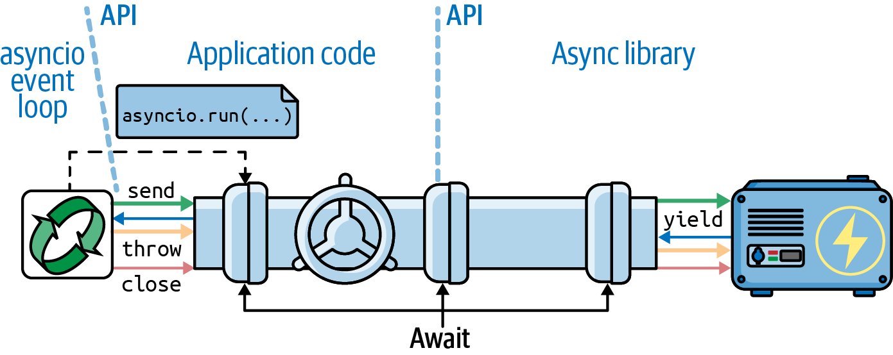
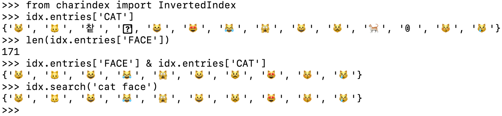
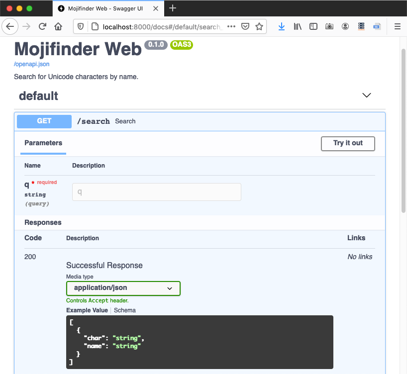
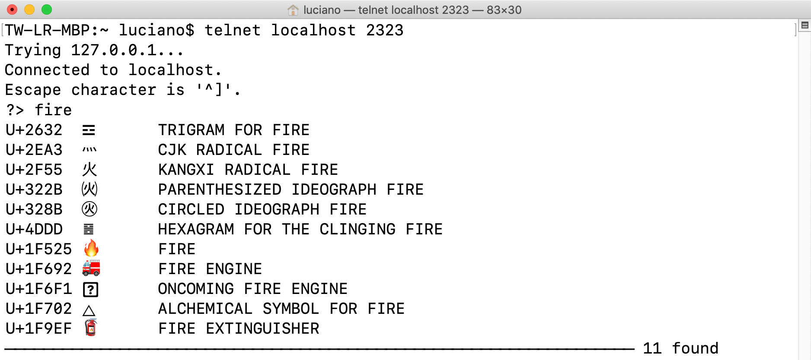

[[ch_async]]
== Programação assíncrona
:example-number: 0
:figure-number: 0

++++
<blockquote>
    
O problema com as abordagens usuais da programação assíncrona é que elas são propostas do tipo "tudo ou nada". Ou você reescreve todo o código, de forma que nada nele bloqueie [o processamento] ou você está só perdendo tempo.

    
Alvaro Videla e Jason J. W. Williams, <em>RabbitMQ in Action (RabbitMQ em Ação)</em>Videla &#38; Williams, <em>RabbitMQ in Action (RabbitMQ em Ação)</em> (Manning), Capítulo 4, "Solving Problems with Rabbit: coding and patterns <em>(Resolvendo Problemas com Rabbit: programação e modelos)</em>," p. 61.

</blockquote>
++++

// [quote, Alvaro Videla &#38; Jason J. W. Williams, RabbitMQ in Action]
// ____
// The problem with normal approaches to asynchronous programming as that they're all-or-nothing propositions. You rewrite all your code so none of it blocks or you're just wasting your time.footnote:[Videla &#38; Williams, _RabbitMQ in Action (Manning, 2012)_, Chapter 4, _Solving Problems with Rabbit: coding and patterns_, p. 61]
// ____

Este((("asynchronous programming", "topics covered"))) capítulo trata de três grandes tópicos intimamente interligados:

* Os elementos de linguagem `async def`, `await`, `async with`, e `async for` de Python;
* Objetos que suportam tais elementos através de métodos especiais como  `+__await__+`, `+__aiter__+` etc., como corrotinas nativas e variantes assíncronas de gerenciadores de contexto, iteráveis, geradores e compreensões;
* _asyncio_ e outras bibliotecas assíncronas.

Este capítulo parte das ideias de iteráveis e geradores (<<ch_generators>>,
em particular da <<classic_coroutines_sec>>), gerenciadores de contexto (no <<ch_with_match>>),
e conceitos gerais de programação concorrente (no <<ch_concurrency_models>>).

Vamos estudar clientes HTTP concorrentes similares aos vistos no <<ch_executors>>, reescritos com corrotinas nativas e gerenciadores de contexto assíncronos, usando a mesma biblioteca _HTTPX_ de antes, mas agora através de sua API assíncrona.
Veremos também como evitar o bloqueio do loop de eventos, delegando operações lentas para um executor de threads ou processos.

Após os exemplos de clientes HTTP, teremos duas aplicações simples de servidor,
uma delas usando o framework cada vez mais popular _FastAPI_.
A seguir tratamos de outros artefatos da linguagem viabilizados pelas palavras-chave `async/await`:
funções geradoras assíncronas, compreensões assíncronas, e expressões geradoras assíncronas. Para realçar o fato daqueles recursos da linguagem não estarem limitados ao _asyncio_, veremos um exemplo reescrito para usar a _Curio_—o elegante e inovador framework inventado por David Beazley.

Finalizando o capítulo, escrevi uma pequena seção sobre vantagens e
armadilhas da programação assíncrona.

Há um longo caminho à nossa frente. Teremos espaço apenas para exemplos básicos,
mas eles vão ilustrar as características mais importantes de cada ideia.

[TIP]
====
A https://fpy.li/21-1[documentação do _asyncio_] melhorou((("asyncio package", "documentation"))) muito após Yury Selivanovfootnote:[Selivanov implementou `async/await` no Python, e escreveu as PEPs relacionadas:
https://fpy.li/pep492[492],
https://fpy.li/pep525[525], e
https://fpy.li/pep530[530].
] reorganizá-la, dando maior destaque às funções úteis para desenvolvedores de aplicações.
A maior parte da API de _asyncio_ consiste em funções e classes voltadas para
criadores de pacotes como frameworks web e drivers de bancos de dados, ou seja,
são necessários para criar bibliotecas assíncronas, mas não aplicações.

Para mais profundidade sobre _asyncio_, recomendo
pass:[<a href="https://fpy.li/hattingh" class="orm:hideurl"><em>Using Asyncio in Python ("Usando Asyncio em Python")</em></a>]
de Caleb Hattingh (O'Reilly).
Política de transparência: Caleb é um dos revisores técnicos deste livro.
====

=== Novidades neste capítulo

Quando((("asynchronous programming", "significant changes to"))) escrevi a primeira edição de _Python Fluente_, a biblioteca _asyncio_ era provisória e as palavras-chave `async/await` não existiam.
Assim, todos os exemplos desse capítulo precisaram ser atualizados.
Também criei novos exemplos: scripts de sondagem de domínios, um serviço web com _FastAPI_, e experimentos com o novo modo assíncrono do console de Python.

Novas seções tratam de recursos da linguagem inexistentes naquele momento, como corrotinas nativas, `async with`, `async for`, e os objetos que suportam essas instruções.

As ideias na <<how_async_works_and_does_not_sec>> refletem lições importantes tiradas da experiência prática, e a considero uma leitura essencial para qualquer um trabalhando com programação assíncrona. Elas podem ajudar você a evitar muitos problemas—seja no Python, seja no Node.js.

Por fim, removi vários parágrafos sobre `asyncio.Futures`, que agora considero parte das APIs de baixo nível do _asyncio_.

[role="pagebreak-before less_space"]
=== Algumas definições.

No ((("asynchronous programming", "relevant terminology"))) início da <<classic_coroutines_sec>>, vimos que, desde o Python 3.5, a linguagem oferece três tipos de corrotinas:

Corrotina nativa::
    Uma((("native coroutines", "definition of term")))((("coroutines", "types of"))) função corrotina definida com `async def`. Você pode delegar de uma corrotina nativa para outra corrotina nativa, usando a palavra-chave `await`, de forma similar àquela como as corrotinas clássicas usam `yield from`. O comando `async def` sempre define uma corrotina nativa, mesmo se a palavra-chave `await` não seja usada em seu corpo. A palavra-chave `await` não pode ser usada fora de uma corrotina nativa.footnote:[Há uma exceção a essa regra: se você iniciar Python com a opção `-m asyncio`, pode então usar `await` diretamente no prompt `>>>` para controlar uma corrotina nativa. Isso é explicado na <<python_async_console_sec>>.]

Corrotina clássica::
    Uma função geradora que consome dados enviados a ela via chamadas a `my_coro.send(data)`, e que lê aqueles dados usando `yield` em uma expressão.
    Corrotinas clássicas podem delegar para outras corrotinas clássicas usando `yield from`.
    Corrotinas clássicas não podem ser controladas por `await`, e não são mais suportadas pelo _asyncio_.

Corrotinas baseadas em geradoras::
    Uma((("generators", "generator-based coroutines")))((("coroutines", "generator-based"))) função geradora decorada com `@types.coroutine`—introduzido no Python 3.5.
    Esse decorador torna a geradora compatível com a nova palavra-chave `await`.

Nesse capítulo vamos nos concentrar nas corrotinas nativas, bem como nas _geradoras assíncronas_:

Geradora assíncrona::
    Uma((("asynchronous generators"))) função geradora definida com `async def` que usa `yield` em seu corpo.
    Ela devolve um objeto gerador assíncrono que oferece um `+__anext__+`, um método corrotina para obter o próximo item.

.@asyncio.coroutine Não Tem Futurofootnote:[Desculpe, não consegui resistir.]
[WARNING]
====
O((("@asyncio.coroutine decorator"))) decorador `@asyncio.coroutine` para corrotinas clássicas e corrotinas baseadas em gerador foi descontinuado no Python 3.8, e está previsto para ser removido no Python 3.11, de acordo com o https://fpy.li/21-2[Issue 43216].
Por outro lado, `@types.coroutine` deve continuar existindo, como se vê aqui:
https://fpy.li/21-3[Issue 36921].
Esse decorador não é mais suportado pelo _asyncio_, mas é usado em código interno nos frameworks assíncronos _Curio_ e _Trio_.
====

=== Um exemplo de asyncio: sondando domínios

Imagine((("asyncio package", "example script", id="APexample21")))((("asynchronous programming", "asyncio script example", id="APRscript21")))
que você esteja prestes a lançar um novo blog sobre Python,
e planeje registrar um domínio usando uma palavra-chave de Python e o sufixo _.DEV_—por exemplo, _AWAIT.DEV._
O <<blogdom_ex>> é um script usando _asyncio_ que verifica vários domínios de forma concorrente.
Essa é saída produzida pelo script:

[source, text]
----
$ python3 blogdom.py
  with.dev
+ elif.dev
+ def.dev
  from.dev
  else.dev
  or.dev
  if.dev
  del.dev
+ as.dev
  none.dev
  pass.dev
  true.dev
+ in.dev
+ for.dev
+ is.dev
+ and.dev
+ try.dev
+ not.dev
----

Observe que os domínios aparecem fora de ordem.
Se você rodar o script, os verá sendo exibidos um após o outro, a intervalos variados.
O sinal de `+` indica que sua máquina foi capaz de resolver o domínio via DNS.
Caso contrário, o domínio não foi resolvido e pode estar disponível.footnote:[`true.dev` está disponível por US$ 360,00 ao ano no momento em que escrevi isso. Também notei que `for.dev` está registrado, mas seu DNS não está configurado.]

No _blogdom.py_, a sondagem de DNS é feita por objetos corrotinas nativas.
Como as operações assíncronas são intercaladas, o tempo necessário para verificar 18 domínios é bem menor que se eles fosse verificados sequencialmente.
Na verdade, o tempo total é quase o igual ao da resposta mais lenta, em vez da soma dos tempos de todas as respostas do DNS.

O <<blogdom_ex>> mostra o código dp _blogdom.py_.

[[blogdom_ex]]
.blogdom.py: procura domínios para um blog sobre Python
====
[source, python]
----
include::../code/21-async/domains/asyncio/blogdom.py[]
----
====
<1> Estabelece o comprimento máximo da palavra-chave para domínios, pois quanto menor, melhor.
<2> `probe` devolve uma tupla com o nome do domínio e um valor booleano; `True` significa que o domínio foi resolvido. Incluir o nome do domínio aqui facilita a exibição dos resultados.
<3> Obtém uma referência para o loop de eventos do `asyncio`, para usá-la a seguir.
<4> O método corrotina https://docs.python.org/pt-br/3/library/asyncio-eventloop.html#asyncio.loop.getaddrinfo[`loop.getaddrinfo(…)`]
devolve uma https://docs.python.org/pt-br/3/library/socket.html#socket.getaddrinfo[tupla de parâmetros com cinco partes] para conectar ao endereço dado usando um socket. Neste exemplo não precisamos do resultado. Se conseguirmos um resultado, o domínio foi resolvido; caso contrário, não.
<5> `main` precisa ser uma corrotina, para podermos usar `await` aqui.
<6> Gerador para produzir palavras-chave com tamanho até `MAX_KEYWORD_LEN`.
<7> Gerador para produzir nome de domínio com o sufixo `.dev`.
<8> Cria uma lista de objetos corrotina, invocando a corrotina `probe` com cada argumento `domain`.
<9> `asyncio.as_completed` é um gerador que produz corrotinas que devolvem os resultados das corrotinas passadas a ele. Ele as produz na ordem em que elas terminam seu processamento, não na ordem em que foram submetidas. É similar ao `futures.as_completed`, que vimos no <<ch_executors>>, <<flags_threadpool_futures_ex>>.
<10> Nesse ponto, sabemos que a corrotina terminou, pois é assim que `as_completed` funciona. Portanto, a expressão `await` não vai bloquear, mas precisamos dela para obter o resultado de `coro`. Se `coro` gerou uma exceção não tratada, ela será gerada novamente aqui.
<11> `asyncio.run` inicia o loop de eventos e retorna apenas quando o loop terminar. Esse é um modelo comum para scripts usando `asyncio`: implementar `main` como uma corrotina e controlá-la com `asyncio.run` dentro do bloco `if __name__ == '__main__':`.

[TIP]
====
A função `asyncio.get_running_loop` surgiu no Python 3.7, para uso dentro de corrotinas, como visto em `probe`.
Se não houver um loop em execução, `asyncio.get_running_loop` gera um `RuntimeError`.
Sua implementação é mais simples e mais rápida que a de `asyncio.get_event_loop`, que pode iniciar um loop de eventos se necessário.
Desde o Python 3.10, `asyncio.get_event_loop` foi https://docs.python.org/pt-br/3.10/library/asyncio-eventloop.html#asyncio.get_event_loop[descontinuado], e em algum momento se tornará um alias para `asyncio.get_running_loop`.
====

==== O truque de Guido para ler código assíncrono

Há muitos conceitos novos para entender no _asyncio_, mas a lógica básica do <<blogdom_ex>> é fácil de compreender se você usar o truque sugerido pelo próprio Guido van Rossum:
cerre os olhos e finja que as palavras-chave `async` e `await` não estão ali.
Fazendo isso, você vai perceber que as corrotinas podem ser lidas como as boas e velhas funções sequenciais.

Por exemplo, imagine que o corpo dessa corrotina...

[source, python]
----
async def probe(domain: str) -> tuple[str, bool]:
    loop = asyncio.get_running_loop()
    try:
        await loop.getaddrinfo(domain, None)
    except socket.gaierror:
        return (domain, False)
    return (domain, True)
----

...funciona como a função abaixo, exceto que, magicamente, ela nunca bloqueia a execução:

[source, python]
----
def probe(domain: str) -> tuple[str, bool]:  # no async
    loop = asyncio.get_running_loop()
    try:
        loop.getaddrinfo(domain, None)  # no await
    except socket.gaierror:
        return (domain, False)
    return (domain, True)
----

Usar a sintaxe `await loop.getaddrinfo(...)` evita o bloqueio, porque `await` suspende o objeto corrotina atual.
Por exemplo, durante a execução da corrotina `probe('if.dev')`,
um novo objeto corrotina é criado por `getaddrinfo('if.dev', None)`.
Aplicar `await` sobre ele inicia a consulta de baixo nível `addrinfo` e devolve o controle para o loop de eventos, não para a corrotina `probe(‘if.dev’)`, que está suspensa.
O loop de eventos pode então ativar outros objetos corrotina pendentes, tal como `probe('or.dev')`.

Quando o loop de eventos recebe uma resposta para a consulta `getaddrinfo('if.dev', None)`,
aquele objeto corrotina específico prossegue sua execução, e devolve o controle pra o `probe('if.dev')`—que estava suspenso no `await`—e pode agora tratar alguma possível exceção e devolver a tupla com o resultado.

Até aqui, vimos `asyncio.as_completed` e `await` sendo aplicados apenas a corrotinas.
Mas eles podem lidar com qualquer objeto "esperável". Esse conceito será explicado a seguir.((("", startref="APexample21")))((("", startref="APRscript21")))

=== Novo conceito: awaitable ou esperável

A((("asynchronous programming", "awaitables")))((("await keyword")))((("keywords", "await keyword"))) palavra-chave `for` funciona com _iteráveis_.
A palavra-chave `await` funciona com _esperáveis_ (_awaitable_).

Como um usuário final do _asyncio_, esses são os esperáveis que você verá diariamente:

* Um _objeto corrotina nativa_, que você obtém chamando uma _função corrotina nativa_
* Uma `asyncio.Task`, que você normalmente obtém passando um objeto corrotina para `asyncio.create_task()`

Entretanto, o código do usuário final nem sempre precisa `await` por uma `Task`.
Usamos `asyncio.create_task(one_coro())` para agendar `one_coro` para execução concorrente, sem esperar que retorne.
Foi o que fizemos com a corrotina `spinner` em _spinner_async.py_ (no <<spinner_async_start_ex>>).
Criar a tarefa é o suficiente para agendar a execução da corrotina.

[WARNING]
====
Mesmo que você não precise cancelar a tarefa ou esperar por ela,
é necessário preservar o objeto `Task` devolvido por `create_task`,
atribuindo ele a uma variável ou coleção que você controla.
O loop de eventos usa referências fracas para gerenciar as tarefas,
o que significa que elas podem ser descartadas pelo coletor de lixo
antes de executarem. Por isso você precisa criar referências fortes para
manter cada tarefa na memória.
Veja a documentação de
https://docs.python.org/pt-br/3/library/asyncio-task.html#asyncio.create_task[`asyncio.create_task`].
Sobre referências fracas, escrevi o artigo
https://fpy.li/weakref["Weak References"] _fluentpython.com_ (EN).footnote:[Agradeço ao leitor Samuel Woodward por ter reportado esse erro para a O'Reilly em fevereiro de 2023]
====

Por outro lado, usamos `await other_coro()` para executar `other_coro` agora mesmo
e esperar que ela termine, porque precisamos do resultado para prosseguir.
Em _spinner_async.py_, a corrotina `supervisor` usava `res = await slow()`
para executar `slow` e aguardar seu resultado..

Ao implementar bibliotecas assíncronas ou contribuir para o próprio _asyncio_,
você pode também encontrar esse esperáveis de baixo nível:

* Um objeto com um método `+__await__+` que devolve um iterador; por exemplo, uma instância de `asyncio.Future` (`asyncio.Task` é uma subclasse de `asyncio.Future`)
* Objetos escritos em outras linguagens usando a API Python/C, com uma função `tp_as_async.am_await`, que devolvem um iterador (similar ao método `+__await__+`)

As bases de código existentes podem também conter um tipo adicional de esperável: _objetos corrotina baseados em geradores_, que estão no processo de serem descontinuados.

[NOTE]
====
A PEP 492 https://fpy.li/21-7[afirma] (EN) que a expressão `await`
"usa a [mesma] implementação de `yield from` [mas] com um passo adicional de validação de seu argumento"
e que “`await` só aceita um esperável.”
A PEP não explica aquela implementação em detalhes, mas se refere à https://fpy.li/pep380[PEP 380], que introduziu `yield from`.
Eu postei uma explicação detalhada no texto https://fpy.li/21-8["The Meaning of yield from"] (EN) da seção  https://fpy.li/oldcoro["Classic Coroutines"] (EN)
do pass:[<a href="http://fluentpython.com" class="orm:hideurl"><em>fluentpython.com</em></a>].
====

Agora vamos estudar a versão _asyncio_ de um script que baixa um conjunto fixo de imagens de bandeiras.

[[flags_asyncio_sec]]
=== Downloads com asyncio e HTTPX

O((("asyncio package", "downloading with", id="APdown21")))((("network I/O", "downloading with asyncio", id="NIOdownload21")))((("HTTPX library", id="httpx21"))) script _flags_asyncio.py_ baixa um conjunto fixo de 20 bandeiras de  _fluentpython.com_.
Já mencionamos esse script na <<ex_web_downloads_sec>>,
mas agora vamos examiná-lo em detalhes, aplicando os conceitos que acabamos de ver.

A partir de Python 3.10, o _asyncio_ só suporta TCP e UDP diretamente,
e não há pacotes de cliente ou servidor HTTP assíncronos na bilbioteca padrão.
Estou usando o https://fpy.li/httpx[_HTTPX_] em todos os exemplos de cliente HTTP.

Vamos explorar o _flags_asyncio.py_ de baixo para cima, isto é, olhando primeiro as função que configuram a ação no <<flags_asyncio_start_ex>>.

[WARNING]
====
Para deixar o código mais fácil de ler, _flags_asyncio.py_ não tem qualquer tratamento de erro.
Nessa introdução a `async/await` é útil se concentrar inicialmente no "caminho feliz", para entender como funções regulares e corrotinas são dispostas em um programa.
Começando na <<flags2_asyncio_sec>>, os exemplos incluem tratamento de erros e outros recursos.

Os exemplos de pass:[<em>flags_.py</em>] aqui e no <<ch_executors>> compartilham código e dados, então os coloquei juntos no diretório
https://fpy.li/21-9[_example-code-2e/20-executors/getflags_].
====

[[flags_asyncio_start_ex]]
.flags_asyncio.py: funções de inicialização
====
[source, py]
----
include::../code/20-executors/getflags/flags_asyncio.py[tags=FLAGS_ASYNCIO_START]
----
====
<1> Essa precisa ser uma função comum—não uma corrotina—para poder ser passada para e chamada pela função `main` do módulo _flags.py_ (<<flags_module_ex>>).
<2> Executa o loop de eventos, monitorando o objeto corrotina `supervisor(cc_list)` até que ele retorne. Isso vai bloquear enquanto o loop de eventos roda. O resultado dessa linha é o que quer que `supervisor` devolver.
<3> Operação de cliente HTTP assíncronas no `httpx` são métodos de `AsyncClient`, que também é um gerenciador de contexto assíncrono: um gerenciador de contexto com métodos assíncronos de configuração e destruição (veremos mais sobre isso na <<async_context_manager_sec>>).
<4> Cria uma lista de objetos corrotina, chamando a corrotina `download_one` uma vez para cada bandeira a ser obtida.
<5> Espera pela corrotina `asyncio.gather`, que aceita um ou mais argumentos esperáveis e aguarda até que todos terminem, devolvendo uma lista de resultados para os esperáveis fornecidos, na ordem em que foram enviados.
<6> `supervisor` devolve o tamanho da lista vinda de `asyncio.gather`.

Agora vamos revisar a parte superior de _flags_asyncio.py_ (<<flags_asyncio_ex>>). Reorganizei as corrotinas para podermos lê-las na ordem em que são iniciadas pelo loop de eventos.

[[flags_asyncio_ex]]
.flags_asyncio.py: imports and download functions
====
[source, py]
----
include::../code/20-executors/getflags/flags_asyncio.py[tags=FLAGS_ASYNCIO_TOP]
----
====
<1> `httpx` precisa ser importado—não faz parte da biblioteca padrão
<2> Reutiliza código de _flags.py_ (<<flags_module_ex>>).
<3> `download_one` precisa ser uma corrotina nativa, para poder `await` por `get_flag`—que executa a requisição HTTP. Ela então mostra o código de país bandeira baixada, e salva a imagem.
<4> `get_flag` precisa receber o `AsyncClient` para fazer a requisição.
<5> O método `get` de uma instância de `httpx.AsyncClient` devolve um objeto `ClientResponse`, que também é um gerenciador assíncrono de contexto.
<6> Operações de E/S de rede são implementadas como métodos corrotina, então eles são controlados de forma assíncrona pelo loop de eventos do `asyncio`.

[NOTE]
====
Seria melhor, em termos de desempenho, que a chamada a `save_flag` dentro de `get_flag` fosse assíncrona, evitando bloquear o loop de eventos.
Entretanto, atualmente _asyncio_ não oferece uma API assíncrona de acesso ao sistema de arquivos—como faz o Node.js.

A <<using_as_completed_sec>> vai mostrar como delegar `save_flag` para uma thread.
====

O seu código delega para as corrotinas do `httpx` explicitamente, usando `await`, ou implicitamente, usando os métodos especiais dos gerenciadores de contexto assíncronos, como pass:[<code>Async&#x200b;Client</code>] e `ClientResponse`—como veremos na <<async_context_manager_sec>>.

==== O segredo das corrotinas nativas: humildes geradores

A((("native coroutines", "humble generators and")))((("humble generators")))((("generators", "humble generators"))) diferença fundamental entre os exemplos de corrotinas clássicas vistas nas <<classic_coroutines_sec>> e _flags_asyncio.py_ é que não há chamadas a `.send()` ou expressões `yield` visíveis nesse último.
O seu código fica entre a biblioteca _asyncio_ e as bibliotecas assíncronas que você estiver usando, como por exemplo a _HTTPX_. Isso está ilustrado na <<await_channel_fig>>.

[[await_channel_fig]]
.Em um programa assíncrono, uma função do usuário inicia o loop de eventos, agendando uma corrotina inicial com `asyncio.run`. Cada corrotina do usuário aciona a seguinte com uma expressão `await`, formando um canal que permite a comunicação entre uma biblioteca como a _HTTPX_ e o loop de eventos.

Debaixo dos panos, o loop de eventos do `asyncio` faz as chamadas a `.send` que acionam as nossas corrotinas, e nossas corrotinas `await` por outras corrotinas, incluindo corrotinas da biblioteca.
Como já mencionado, a maior parte da implementação de `await` vem de `yield from`, que também usa chamadas a `.send` para acionar corrotinas.

O canal `await` acaba por chegar a um esperável de baixo nível, que devolve um gerador que o loop de eventos pode acionar em resposta a eventos tais com cronômetros ou E/S de rede.
Os esperáveis e geradores no final desses canais `await` estão implementados nas profundezas das bibliotecas, não são parte de suas APIs e podem ser extensões Python/C.

Usando funções como `asyncio.gather` e `asyncio.create_task`,
é possível iniciar múltiplos canais `await` concorrentes, permitindo a execução concorrente de múltiplas operações de E/S acionadas por um único loop de eventos, em uma única thread.

==== O problema do tudo ou nada

Observe que, no <<flags_asyncio_ex>>, não pude reutilizar a função `get_flag` de
_flags.py_ (<<flags_module_ex>>).
Tive que reescrevê-la como uma corrotina para usar a API assíncrona do _HTTPX_.
Para((("asyncio package", "achieving peak performance with"))) obter o melhor desempenho do _asyncio_, precisamos substituir todas as funções que fazem E/S por uma versão assíncrona, que seja ativada com `await` ou `asyncio.create_task`. Dessa forma o controle é devolvido ao loop de eventos  enquanto a função aguarda pela operação de entrada ou saída. Se você não puder reescrever a função bloqueante como uma  corrotina, deveria executá-la em uma thread ou um processo separados, como veremos na <<delegating_to_executors_sec>>.

Essa é a razão da escolha da epígrafe desse capítulo, que incluí o seguinte conselho:
 "[Ou] você reescreve todo o código, de forma que nada nele bloqueie [o processamento] ou você está só perdendo tempo.""

Pela mesma razão, também não pude reutilizar a função `download_one` de _flags_threadpool.py_
(<<flags_threadpool_ex>>).
O código no <<flags_asyncio_ex>> aciona `get_flag` com `await`,
então `download_one` precisa também ser uma corrotina.
Para cada requisição, um objeto corrotina `download_one` é criado em `supervisor`, e eles são todos acionados pela corrotina `asyncio.gather`.

Vamos agora estudar o comando `async with`, que apareceu em `supervisor` (<<flags_asyncio_start_ex>>) e `get_flag` (<<flags_asyncio_ex>>).((("", startref="APdown21")))((("", startref="NIOdownload21")))((("", startref="httpx21")))

[[async_context_manager_sec]]
=== Gerenciadores de contexto assíncronos

Na((("context managers", "asynchronous", id="CMasync21")))((("asynchronous programming", "asynchronous context managers", id="APRaconman21"))) <<context_managers_sec>>, vimos como um objeto pode ser usado para executar código antes e depois do corpo de um bloco `with`, se sua classe oferecer os métodos `+__enter__+` e `+__exit__+`.

Agora, considere o <<asyncpg_transaction_no_context_ex>>, que usa o driver PostgreSQL https://fpy.li/21-10[_asyncpg_] compatível com o _asyncio_ (https://fpy.li/21-11[documentação do _asyncpg_ sobre transações]).

[[asyncpg_transaction_no_context_ex]]
.Código exemplo da documentação do driver PostgreSQL _asyncpg_
====
[source, python]
----
tr = connection.transaction()
await tr.start()
try:
    await connection.execute("INSERT INTO mytable VALUES (1, 2, 3)")
except:
    await tr.rollback()
    raise
else:
    await tr.commit()
----
====

Uma transação de banco de dados se presta naturalmente a protocolo do gerenciador de contexto:
a transação precisa ser iniciada, dados são modificados com `connection.execute`, e então um _roolback_ (reversão) ou um _commit_ (confirmação) precisam acontecer, dependendo do resultado das mudanças.

Em((("asyncpg"))) um driver assíncrono como o _asyncpg_, a configuração e a execução precisam acontecer em corrotinas, para que outras operações possam ocorrer de forma concorrente.
Entretando, a implementação do comando `with` clássico não suporta corrotinas na implementação dos métodos `+__enter__+` ou `+__exit__+`.

Por essa razão a https://fpy.li/pep492[PEP 492—Coroutines with async and await syntax (_Corrotinas com async e await_)] (EN) introduziu o comando `async with`, que funciona com gerenciadores de contexto assíncronos:
objetos implementando os métodos `+__aenter__+` e `+__aexit__+` como corrotinas.

Com `async with`, o <<asyncpg_transaction_no_context_ex>> pode ser escrito como esse outro trecho da https://fpy.li/21-11[documentação do _asyncpg_]:

[source, python]
----
async with connection.transaction():
    await connection.execute("INSERT INTO mytable VALUES (1, 2, 3)")
----

Na
https://fpy.li/21-13[classe `asyncpg.Transaction`],
o método corrotina `+__aenter__+` executa `await self.start()`, e
a corrotina `+__aexit__+` espera pelos métodos corrotina privados `__rollback` ou `__commit`,
dependendo da ocorrência ou não de uma exceção.
Usar corrotinas para implementar `Transaction` como um gerenciador de contexto assíncrono permite ao _asyncpg_ controlar, de forma concorrente, muitas transações simultâneas.

.Caleb Hattingh sobre o asyncpg
[TIP]
====
Outro detalhe fantástico sobre o _asyncpg_
é que ele também contorna a falta de suporte à alta-concorrência do PostgreSQL
(que usa um processo servidor por conexão)
implementando um pool de conexões para conexões internas ao próprio Postgres.

Isso significa que você não precisa de ferramentas adicionais  (por exemplo o _pgbouncer_),
como explicado na https://fpy.li/21-14[documentação] (EN) do _asyncpg_.footnote:[Essa dica é uma citação literal de um comentário do revisor técnico Caleb Hattingh. Obrigado, Caleb!]
====

Voltando ao _flags_asyncio.py_, a classe `AsyncClient` do `httpx` é um gerenciador de contexto assíncrono, então pode usar esperáveis em seus métodos corrotina especiais `+__aenter__+` e `+__aexit__+`.

[NOTE]
====
A <<async_gen_context_mngr_sec>> mostra como usar a `contextlib` de Python para criar um gerenciador de contexto assíncrono sem precisar escrever uma classe. Essa explicação aparece mais tarde nesse capítulo por causa de um pré-requsito: a <<async_gen_func_sec>>.
====

Agora vamos melhorar o exemplo _asyncio_ de download de bandeiras com uma barra de progresso, que nos levará a explorar um pouco mais da API do _asyncio_.((("", startref="APRaconman21")))((("", startref="CMasync21")))

[[flags2_asyncio_sec]]
=== Melhorando o download de bandeiras asyncio

Vamos((("asynchronous programming", "enhancing asyncio downloader", id="APRenhanc21")))((("asyncio package", "enhancing asyncio downloader", id="APenhanc21")))((("network I/O", "enhancing asyncio downloader", id="NIOenhance21"))) recordar a <<flags2_sec>>, na qual o conjunto de exemplos `flags2` compartilhava a mesma interface de linha de comando, e todos mostravam uma barra de progresso enquanto os downloads aconteciam. Eles também incluíam tratamento de erros.

[TIP]
====
Encorajo você a brincar com os exemplos `flags2`, para desenvolver uma intuição sobre o funcionamento de clientes HTTP concorrentes.
Use a opção `-h` para ver a tela de ajuda no  <<flags2_help_demo>>.
Use as opções de linha de comando `-a`, `-e`, e `-l` para controlar o número de downloads,
e a opção `-m` para estabelecer o número de downloads concorrentes.
Execute testes com os servidores `LOCAL`, `REMOTE`, `DELAY`, e `ERROR`.
Descubra o número ótimo de downloads concorrentes para maximizar a taxa de transferência de cada servidor.
Varie as opções dos servidores de teste, como descrito no <<setting_up_servers_box>>.
====

Por exemplo, o <<flags2_asyncio_run_repeat>> mostra uma tentativa de obter 100 bandeiras (`-al 100`) do servidor `ERROR`,
usando 100 conexões concorrentes (`-m 100`).
Os 48 erros no resultado são ou HTTP 418 ou erros de tempo de espera excedido (_time-out_)—o [mau]comportamento esperado do _slow_server.py_.

[[flags2_asyncio_run_repeat]]
.Running flags2_asyncio.py
====
[source]
----
$ python3 flags2_asyncio.py -s ERROR -al 100 -m 100
ERROR site: http://localhost:8002/flags
Searching for 100 flags: from AD to LK
100 concurrent connections will be used.
100%|█████████████████████████████████████████| 100/100 [00:03<00:00, 30.48it/s]
--------------------
 52 flags downloaded.
 48 errors.
Elapsed time: 3.31s
----
====

[role="man-height-1-125"]
[WARNING]
.Aja de forma responsável ao testar clientes concorrentes
====
Mesmo que o tempo total de download não seja muito diferente entre os clientes HTTP na versão com threads e na versão _asyncio_ HTTP , o
_asyncio_ é capaz de enviar requisições mais rápido, então aumenta a probabilidade do servidor suspeitar de um ataque DoS.
Para exercitar esses clientes concorrentes em sua capacidade máxima, por favor use servidores HTTP locais em seus testes, como explicado no <<setting_up_servers_box>>.
====

Agora vejamos como o _flags2_asyncio.py_ é implementado.

[[using_as_completed_sec]]
==== Usando asyncio.as_completed e uma thread

No((("threads", "enhancing asyncio downloader", id="Tenhance21"))) <<flags_asyncio_ex>>, passamos várias corrotinas para `asyncio.gather`, que devolve uma lista com os resultados das corrotinas na ordem em que foram submetidas.
Isso significa que `asyncio.gather` só pode retornar quando todos os esperáveis terminarem.
Entretanto, para atualizar uma barra de progresso, precisamos receber cada um dos resultados assim que eles estejam prontos.

Felizmente existe um equivalente `asyncio` da função geradora `as_completed`
que usamos no exemplo de pool de threads com a barra de progresso, (<<flags2_threadpool_full>>).

O <<flags2_asyncio_top>> mostra o início do script _flags2_asyncio.py_, onde as corrotinas `get_flag` e `download_one` são definidas. O <<flags2_asyncio_rest>> lista o restante do código-fonte, com `supervisor` e `download_many`.
O script é maior que _flags_asyncio.py_ por causa do tratamento de erros.

[[flags2_asyncio_top]]
.flags2_asyncio.py: parte superior (inicial) do script; o resto do código está no <<flags2_asyncio_rest>>
====
[source, py]
----
include::../code/20-executors/getflags/flags2_asyncio.py[tags=FLAGS2_ASYNCIO_TOP]
----
====
<1> `get_flag` é muito similar à versão sequencial no <<flags2_basic_http_ex>>.
Primeira diferença: ele exige o parâmetro `client`.
<2> Segunda e terceira diferenças: `.get` é um método de `AsyncClient`, e é uma corrotina, então precisamos `await` por ela.
<3> Usa o `semaphore` como um gerenciador de contexto assíncrono, assim o programa como um todo não é bloqueado; apenas essa corrotina é suspensa quando o contador do semáforo é zero. Veja mais sobre isso em <<about_semaphores_box>>.
<4> A lógica de tratamento de erro é idêntica à de `download_one`, do <<flags2_basic_http_ex>>.
<5> Salvar a imagem é uma operação de E/S. Para não bloquear o loop de eventos, roda `save_flag` em uma thread.

No _asyncio_, toda a comunicação de rede é feita com corrotinas, mas não E/S de arquivos.
Entretanto, E/S de arquivos também é "bloqueante"—no sentido que ler/escrever arquivos é https://fpy.li/21-15[milhares de vezes mais demorado] que ler/escrever na RAM.
Se você estiver usando https://pt.wikipedia.org/wiki/Armazenamento_conectado_%C3%A0_rede[armazenamento conectado à rede], isso pode até envolver E/S de rede internamente.

Desde o Python 3.9, a corrotina `asyncio.to_thread` facilitou delegar operações de arquivo para um pool de threads fornecido pelo _asyncio_.
Se você precisa suportar Python 3.7 ou 3.8,
a <<delegating_to_executors_sec>> mostra como fazer isso, adicionando algumas linhas ao seu programa.
Mas primeiro, vamos terminar nosso estudo do código do cliente HTTP.

==== Limitando as requisições com um semáforo

Clientes de rede((("throttling", id="throttle21")))((("semaphores", id="semaphores21"))) como os que estamos estudando devem ser _limitados_ ("_throttled_") (isto é, desacelerados) para que não martelem o servidor com um número excessivo de requisições concorrentes.

Um https://pt.wikipedia.org/wiki/Sem%C3%A1foro_(computa%C3%A7%C3%A3o)[_semáforo_]
é uma estrutura primitiva de sincronização, mais flexível que uma trava.
Um semáforo pode ser mantido por múltiplas corrotinas, com um número máximo configurável.
Isso o torna ideial para limitar o número de corrotinas concorrentes ativas.
O <<about_semaphores_box>> tem mais informações.

No _flags2_threadpool.py_ (<<flags2_threadpool_full>>),
a limitação era obtida instanciando o `ThreadPoolExecutor` com o argumento obrigatório `max_workers` fixado em `concur_req` na função `download_many`.
Em _flags2_asyncio.py_, um `asyncio.Semaphore` é criado pela função `supervisor`
(mostrada no <<flags2_asyncio_rest>>)
e passado como o argumento `semaphore` para `download_one` no <<flags2_asyncio_top>>.

[[about_semaphores_box]]
.Semáforos no Python
****
O cientista da computação Edsger W. Dijkstra inventou o https://pt.wikipedia.org/wiki/Sem%C3%A1foro_(computa%C3%A7%C3%A3o)[semáforo] no início dos anos 1960.
É uma ideia simples, mas tão flexível que a maioria dos outros objetos de sincronização—como as travas e as barreiras—podem ser construídas a partir de semáforos.
Há três classes `Semaphore` na biblioteca padrão de Python:
uma em `threading`, outra em `multiprocessing`, e uma terceira em `asyncio`.
Essas classes são parecidas, mas têm implementações bem diferentes.
Aqui vamos descrever a versão de `asyncio`.

Um `asyncio.Semaphore` tem um contador interno que é decrementado toda vez que
usamos `await` no método corrotina `.acquire()`,
e incrementado quando chamamos o método `.release()`—que não é uma corrotina porque nunca bloqueia. O valor inicial do contador é definido quando o `Semaphore` é instanciado:

[source, python]
----
    semaphore = asyncio.Semaphore(concur_req)
----

Invocar `await` em `.acquire()` não causa qualquer atraso quando o contador interno
é maior que zero.
Se o contador for 0, entretanto,
`.acquire()` suspende a a corrotina que chamou `await` até que alguma outra corrotina chame
`.release()` no mesmo `Semaphore`, incrementando assim o contador.

Em vez de usar esses métodos diretamente,
é mais seguro usar o `semaphore` como um gerenciador de contexto assíncrono,
como fiz na função `download_one` em <<flags2_asyncio_top>>:

[source, python]
----
        async with semaphore:
            image = await get_flag(client, base_url, cc)
----

O método corrotina `+Semaphore.__aenter__+` espera por `.acquire()`
(usando `await` internamente),
e seu método corrotina `+__aexit__+` chama `.release()`.
Este `async with` garante que não mais que `concur_req`
instâncias de corrotinas `get_flags` estarão ativas a qualquer dado momento.

Cada uma das classes `Semaphore` na biblioteca padrão tem uma subclasse `BoundedSemaphore`, que impõe uma restrição adicional: o contador interno não pode nunca ficar maior que o valor inicial, quando ocorrerem mais operações `.release()` que `.acquire()`.footnote:[Agradeço a Guto Maia, que notou que conceito de um semáforo não era explicado, quando leu o primeiro rascunho deste capítulo.]

****

Agora vamos olhar o resto do script em <<flags2_asyncio_rest>>.

[[flags2_asyncio_rest]]
.flags2_asyncio.py: continuação de <<flags2_asyncio_top>>
====
[source, py]
----
include::../code/20-executors/getflags/flags2_asyncio.py[tags=FLAGS2_ASYNCIO_START]
----
====
<1> `supervisor` recebe os mesmos argumentos que a função `download_many`, mas ele não pode ser invocado diretamente de `main`, pois é uma corrotina e não uma função simples como `download_many`.
<2> Cria um `asyncio.Semaphore` que não vai permitir mais que `concur_req` corrotinas ativas entre aquelas usando este semáforo. O valor de `concur_req` é calculado pela função `main` de _flags2_common.py_, baseado nas opções de linha de comando e nas constantes estabelecidas em cada exemplo.
<3> Cria uma lista de objetos corrotina, um para cada chamada à corrotina `download_one`.
<4> Obtém um iterador que vai devolver objetos corrotina quando eles terminarem sua execução. Não coloquei essa chamada a `as_completed` diretamente no loop `for` abaixo porque posso precisar envolvê-la com o iterador `tqdm` para a barra de progresso, dependendo da opção do usuário para verbosidade.
<5> Envolve o iterador `as_completed` com a função geradora `tqdm`, para mostrar o progresso.
<6> Declara e inicializa `error` com `None`; essa variável será usada para manter uma exceção além do bloco `try/except`, se alguma for levantada.
<7> Itera pelos objetos corrotina que terminaram a execução; esse loop é similar ao de `download_many` em <<flags2_threadpool_full>>.
<8> `await` pela corrotina para obter seu resultado. Isso não bloqueia porque `as_completed` só produz corrotinas que já terminaram.
<9> Essa atribuição é necessária porque o escopo da variável `exc` é limitado a essa cláusula `except`, mas preciso preservar o valor para uso posterior.
<10> Mesmo que acima.
<11> Se houve um erro, muda o `status`.
<12> Se em modo verboso, extrai a URL da exceção que foi levantada...
<13> ...e extrai o nome do arquivo para mostrar o código do país em seguida.
<14> `download_many` instancia o objeto corrotina `supervisor` e o passa para o loop de eventos com `asyncio.run`, coletando o contador que `supervisor` devolve quando o loop de eventos termina.

No <<flags2_asyncio_rest>>, não podíamos usar o mapeamento de `futures` para os códigos de país que vimos em <<flags2_threadpool_full>>, porque os esperáveis devolvidos por `asyncio.as_completed` são os mesmos esperáveis que passamos na chamada a `as_completed`. Internamente, o mecanismo do _asyncio_ pode substituir os esperáveis que fornecemos por outros que irão, no fim, produzir os mesmos resultados.footnote:[Um discussão detalhada sobre esse tópico pode era encontrada em uma thread de discussão que iniciei no grupo python-tulip, intitulada https://fpy.li/21-19["Which other futures may come out of asyncio.as_completed?" (_Que outros futures podem sair de asyncio.as_completed?_ )]. Guido responde e fornece detalhes sobre a implementação de `as_completed`, bem como sobre a relação próxima entre _futures_ e corrotinas no _asyncio_.]

[TIP]
====
Já que não podia usar os esperáveis como chaves para recuperar os códigos de país de um `dict` em caso de falha, tive que extrair o código de pais da exceção.
Para fazer isso, mantive a exceção na variável `error`, permitindo sua recuperação fora do bloco `try/except`. Python não é uma linguagem com escopo de bloco: comandos como loops e `try/except` não criam um escopo local aos blocos que eles gerenciam.
Mas se uma cláusula `except` vincula uma exceção a uma variável, como as variáveis `exc` que acabamos de ver—aquele vínculo só existe no bloco dentro daquela cláusula `except` específica.
====

Isso encerra nossa discussão da funcionalidade de um exemplo usando _asyncio_ similar ao  _flags2_threadpool.py_ que vimos antes.

O próximo exemplo demonstra um modelo simples de execução de uma tarefa assíncrona após outra usando corrotinas.
Isso merece nossa atenção porque qualquer um com experiência prévia em Javascript sabe que rodar um função assíncrona após outra foi a razão para o padrão de codificação aninhado conhecido como
https://fpy.li/21-20[_pyramid of doom_ (_pirâmide da perdição_)] (EN).
A palavra-chave `await` desfaz a maldição.
Por isso `await` agora é parte de Python e de Javascript.((("", startref="throttle21")))((("", startref="semaphores21")))

==== Fazendo múltiplas requisições para cada download

Suponha que você queira salvar cada bandeira com o nome e o código do país, em vez de apenas o código. Agora você precisa fazer duas requisições HTTP por bandeira: uma para obter a imagem da bandeira propriamente dita, a outra para obter o arquivo _metadata.json_, no mesmo diretório da imagem—é nesse arquivo que o nome do país está registrado.

Coordenar múltiplas requisições na mesma tarefa é fácil no script com threads: basta fazer uma requisição depois a outra, bloqueando a thread duas vezes, e mantendo os dois dados (código e nome do país) em variáveis locais, prontas para serem usadas quando os arquivos forem salvo.
Se você precisasse fazer o mesmo em um script assíncrono com callbacks, você precisaria de funções aninhadas, de forma que o código e o nome do país estivessem disponíveis até o momento em que fosse possível salvar o arquivo, pois cada callback roda em um escopo local diferente.
A palavra-chave `await` fornece um saída para esse problema, permitindo que você acione as requisições assíncronas uma após a outra, compartilhando o escopo local da corrotina que dirige as ações.

[TIP]
====
Se você está trabalhando com programação de aplicações assíncronas no Python moderno e recorre a uma grande quantidade de callbacks, provavelmente está aplicando modelos antigos, que não fazem mais sentido no Python atual.
Isso é justificável se você estiver escrevendo uma biblioteca que se conecta a código legado ou a código de baixo nível, que não suportem corrotinas. De qualquer forma, o Q&A do StackOverflow,
https://fpy.li/21-21["What is the use case for future.add_done_callback()?" (_Qual o caso de uso para future.add_done_callback()?_)] (EN) explica porque callbacks são necessários em código de baixo nível, mas não são muito úteis hoje em dia em código Python a nível de aplicação.
====

A terceira variante do script `asyncio` de download de bandeiras traz algumas mudanças:

`get_country`:: Essa nova corrotina baixa o arquivo _metadata.json_ daquele código de país, e extrai dele o nome do país.
`download_one`:: Essa corrotina agora usa `await` para delegar para `get_flag` e para a nova corrotina `get_country`, usando o resultado dessa última para compor o nome do arquivo a ser salvo.

Vamos começar com o código de `get_country` (<<flags3_asyncio_get_country>>).
Observe que ele muito similar ao `get_flag` do <<flags2_asyncio_top>>.

[[flags3_asyncio_get_country]]
.flags3_asyncio.py: corrotina `get_country`
====
[source, py]
----
include::../code/20-executors/getflags/flags3_asyncio.py[tags=FLAGS3_ASYNCIO_GET_COUNTRY]
----
====
<1> Essa corrotina devolve uma string com o nome do país—se tudo correr bem.
<2> `metadata` vai receber um `dict` Python construído a partir do conteúdo JSON da resposta.
<3> Devolve o nome do país.

Agora vamos ver o `download_one` modificado do <<flags3_asyncio>>, que tem apenas algumas linhas diferentes da corrotina de mesmo nome do <<flags2_asyncio_top>>.

[[flags3_asyncio]]
.flags3_asyncio.py: corrotina `download_one`
====
[source, py]
----
include::../code/20-executors/getflags/flags3_asyncio.py[tags=FLAGS3_ASYNCIO_DOWNLOAD_ONE]
----
====
<1> Segura o `semaphore` para `await` por `get_flag`...
<2> ...e novamente por `get_country`.
<3> Usa o nome do país para criar um nome de arquivo. Como usuário da linha de comando, não gosto de ver espaços em nomes de arquivo.

Muito melhor que callbacks aninhados!

Coloquei as chamadas a `get_flag` e `get_country` em blocos `with` separados, controlados pelo `semaphore` porque é uma boa prática manter semáforos e travas pelo menor tempo possível.

Eu poderia ter agendado ambos os scripts, `get_flag` e `get_country`, em paralelo, usando `asyncio.gather`, mas se `get_flag` levantar uma exceção não haverá imagem para salvar, então seria inútil rodar `get_country`. Mas há casos onde faz sentido usar `asyncio.gather` para acessar várias APIs simultaneamente, em vez de esperar por uma resposta antes de fazer a próxima requisição

Em _flags3_asyncio.py_, a sintaxe `await` aparece seis vezes, e `async with` três vezes.
Espero que você esteja pegando o jeito da programação assíncrona em Python.
Um desafio é saber quando você precisa usar `await` e quando você não pode usá-la.
A resposta, em princípio, é fácil: você `await` por corrotinas e outros esperáveis, como instâncias  de `asyncio.Task`.
Mas algumas APIs são complexas, misturam corrotinas e funções normais de maneiras aparentemente arbitrárias, como a classe `StreamWriter` que usaremos no <<tcp_mojifinder_top>>.

O <<flags3_asyncio>> encerra o grupo de exemplos _flags_.
Vamos agora discutir o uso de executores de threads ou processos na programação assíncrona.((("", startref="APRenhanc21")))((("", startref="APenhanc21")))((("", startref="Tenhance21")))((("", startref="NIOenhance21")))

[[delegating_to_executors_sec]]
=== Delegando tarefas a executores

Uma((("asynchronous programming", "delegating tasks to executors", id="APRdelegat21")))((("executors, delegating tasks to", id="exedel21"))) vantagem importante do Node.js sobre Python para programação assíncrona é a biblioteca padrão do Node.js, que inclui APIs assíncronas para toda a E/S—não apenas para E/S de rede.
No Python, se você não for cuidadosa, a E/S de arquivos pode degradar seriamente o desempenho de aplicações assíncronas, pois ler e escrever no armazenamento desde a thread principal bloqueia o loop de eventos.

No corrotina `download_one` de <<flags2_asyncio_top>>, usei a seguinte linha para salvar a imagem baixada para o disco:

[source, py]
----
        await asyncio.to_thread(save_flag, image, f'{cc}.gif')
----

Como mencionado antes, o `asyncio.to_thread` foi acrescentado no Python 3.9.
Se você precisa suportar 3.7 ou 3.8,
substitua aquela linha pelas linhas em  <<flags2_asyncio_executor_fragment>>.

[[flags2_asyncio_executor_fragment]]
.Linhas para usar no lugar de `await asyncio.to_thread`
====
[source, py]
----
include::../code/20-executors/getflags/flags2_asyncio_executor.py[tags=FLAGS2_ASYNCIO_EXECUTOR]
----
====
<1> Obtém uma referência para o loop de eventos.
<2> O primeiro argumento é o executor a ser utilizado; passar `None` seleciona o default, `ThreadPoolExecutor`, que está sempre disponível no loop de eventos do `asyncio`.
<3> Você pode passar argumentos posicionais para a função a ser executada, mas se você precisar passar argumentos nomeados, vai precisar recorrer a `functool.partial`, como descrito na
https://docs.python.org/pt-br/3/library/asyncio-eventloop.html#asyncio.loop.run_in_executor[documentação de `run_in_executor`].

A função mais recente `asyncio.to_thread` é mais fácil de usar e mais flexível, já que também aceita argumentos nomeados.

A própria implementação de `asyncio` usa `run_in_executor` debaixo dos panos em alguns pontos.
Por exemplo, a corrotina `loop.getaddrinfo(…)`,  que vimos no <<blogdom_ex>> é implementada chamando a função `getaddrinfo` do módulo `socket`—uma função bloqueante que pode levar alguns segundos para retornar, pois depende de resolução de DNS.

Um padrão comum em APIs assíncronas é encobrir chamadas bloqueantes que sejam detalhes de implementação nas corrotinas usando `run_in_executor` internamente.
Dessa forma, é possível apresentar uma interface consistente de corrotinas a serem acionadas com `await` e esconder as threads que precisam ser usadas por razões pragmáticas.
O driver assíncrono para o MongoDB https://fpy.li/21-23[Motor] tem uma API compatível com `async/await` que na verdade é uma fachada, encobrindo um núcleo de threads que conversa com o servidor de banco de dados.
A. Jesse Jiryu Davis, o principal desenvolvedor do Motor, explica suas razões em
https://fpy.li/21-24[“Response to ‘Asynchronous Python and Databases’” (“_Resposta a ‘Python Assíncrono e os Bancos de Dados’”)].
Spoiler: Davis descobriu que um pool de threads tem melhor desempenho no caso de uso específico de um driver de banco de dados—apesar do mito que abordagens assíncronas são sempre mais rápidas que threads para E/S de rede.

A principal razão para passar um `Executor` explícito para `loop.run_in_executor` é utilizar um `ProcessPoolExecutor`, se a função a ser executada for de uso intensivo da CPU. Dessa forma ela rodará em um processo Python diferente, evitando a disputa pela GIL. Por seu alto custo de inicialização, seria melhor iniciar o  `ProcessPoolExecutor` no `supervisor`, e passá-lo para as corrotinas que precisem utilizá-lo.

Caleb Hattingh—O autor de
pass:[<a href="https://fpy.li/hattingh" class="orm:hideurl"><em>Using Asyncio in Python</em></a>]
(O' Reilly)—é um dos revisores técnicos desse livro, e sugeriu que eu acrescentasse o seguinte aviso sobre executores e o _asyncio_.

.O aviso de Caleb sobre run_in_executors
[WARNING]
====
Usar `run_in_executor` pode produzir problemas difíceis de depurar, já que o cancelamento não funciona da forma que se esperaria.
Corrotinas que usam executores apenas fingem terminar: a thread subjacente (se for um `ThreadPoolExecutor`) não tem um mecanismo de cancelamento.
Por exemplo, uma thread de longa duração criada dentro de uma chamada a `run_in_executor` pode impedir que seu programa _asyncio_ encerre de forma limpa:
`asyncio.run` vai esperar para retornar até o executor terminar inteiramente, e vai esperar para sempre se os serviços iniciados pelo executor não pararem sozinhos de alguma forma.
Minha barba branca me inclina a desejar que aquela função se chamasse `run_in_executor_uncancellable`.
====

Agora saímos de scripts cliente para escrever servidores com o `asyncio`.((("", startref="exedel21")))((("", startref="APRdelegat21")))

=== Programando servidores asyncio

O((("asynchronous programming", "writing asyncio servers", id="APRwrit21")))((("asyncio package", "writing asyncio servers", id="APwrite21")))((("servers", "writing asyncio servers", id="Sasyncio21"))) exemplo clássico de um servidor TCP de brinquedo é um
https://docs.python.org/pt-br/3/library/asyncio-stream.html#tcp-echo-server-using-streams[servidor eco]. Vamos escrever brinquedos um pouco mais interessantes: utilitários de servidor para busca de caracteres Unicode, primeiro usando HTTP com a _FastAPI_, depois usando TCP puro apenas com `asyncio`.

Esse servidores permitem que os usuários façam consultas sobre caracteres Unicode baseadas em palavras em seus nomes padrão no módulo `unicodedata` que discutimos na <<unicodedata_sec>>.
A <<web_mojifinder_result>> mostra uma sessão com o _web_mojifinder.py_, o primeiro servidor que escreveremos.

[[web_mojifinder_result]]
.Janela de navegador mostrando os resultados da busca por "mountain" no serviço web_mojifinder.py.

A lógica de busca no Unicode nesses exemplos é a classe `InvertedIndex` no módulo _charindex.py_ no https://fpy.li/code[repositório de código do _Python Fluente_]. Não há nada concorrente naquele pequeno módulo, então vou dar apenas um explicação breve sobre ele, no box opcional a seguir. Você pode pular para a implementação do servidor HTTP na <<fastapi_web_service_sec>>.

.Conhecendo o índice invertido
****

Um((("inverted indexes"))) índice invertido normalmente mapeia palavras a
documentos onde elas ocorrem.
Nos exemplos _mojifinder_, cada "documento" é o nome de um caractere Unicode.
A classe `charindex.InvertedIndex` indexa cada palavra que aparece no nome de
cada caractere no banco de dados Unicode, e cria um índice invertido em um `defaultdict`.
Por exemplo, para indexar o caractere U+0037—DIGIT SEVEN—o construtor
de `InvertedIndex` anexa o caractere `'7'` aos registros sob as chaves `'DIGIT'` e `'SEVEN'`.
Após indexar os dados do Unicode 13.0.0 incluídos no Python 3.10, `'DIGIT'` será mapeado para
868 caracteres que tem essa palavra em seus nomes;
e `'SEVEN'` para  143, incluindo U+1F556—CLOCK FACE SEVEN OCLOCK e
U+2790—DINGBAT NEGATIVE CIRCLED SANS-SERIF DIGIT SEVEN.

Veja a <<inverted_index_fig>> para uma demonstração usando os registro para `'CAT'` e `'FACE'`.footnote:[O ponto de interrogação encaixotado na captura de tela não é um defeito do livro ou do ebook que você está lendo. É o caractere U+101EC—PHAISTOS DISC SIGN CAT, que não existe na fonte do terminal que usei. O https://pt.wikipedia.org/wiki/Disco_de_Festo[Disco de Festo] é um artefato antigo inscrito com pictogramas, descoberto na ilha de Creta.]

[[inverted_index_fig]]
.Explorando o atributo `entries` e o método `search` de `InvertedIndex` no console de Python

O método `InvertedIndex.search` quebra a consulta em palavras separadas, e devolve a intersecção dos registros para cada palavra.
É por isso que buscar por "face" encontra 171 resultados, "cat" encontra 14, mas "cat face" apenas 10.

Essa é a bela ideia por trás dos índices invertidos: uma pedra fundamental da recuperação de informação—a teoria por trás dos mecanismos de busca.
Veja o artigo https://pt.wikipedia.org/wiki/Listas_invertidas["Listas Invertidas"] na Wikipedia para saber mais.
****

[[fastapi_web_service_sec]]
==== Um serviço web com FastAPI

Escrevi((("FastAPI framework", id="fastapi21"))) o próximo exemplo—_web_mojifinder.py_—usando a https://fpy.li/21-28[_FastAPI_]:
um dosframeworks ASGI de desenvolvimento Web de Python, mencionada na <<asgi_note>>.
A <<web_mojifinder_result>> é uma captura de tela da interface de usuário.
É uma aplicação muito simples, de uma página só (SPA, Single Page Application): após o download inicial do HTML, a interface é atualizada via Javascript no cliente, em comunicação com o servidor.

A _FastAPI_ foi projetada para implementar o lado servidor de SPAs and apps móveis,
que consistem principalmente de pontos de acesso de APIs web, devolvendo respostas JSON em vez de HTML renderizado no servidor. A _FastAPI_ se vale de decoradores, dicas de tipo e introspecção de código para eliminar muito do código repetitivo das APIs web, e também publica automaticamente uma documentação no padrão OpenAPI—a.k.a. https://fpy.li/21-29[Swagger]—para a API que criamos.
A <<web_mojifinder_schema>> mostra a página `/docs` para o _web_mojifinder.py_, gerada automaticamente.

[[web_mojifinder_schema]]
.Schema OpenAPI gerado automaticamente para o ponto de acesso `/search`.

O <<web_mojifinder_ex>> é o código do _web_mojifinder.py_, mas aquele é apenas o código do lado servidor. Quando você acessa a URL raiz `/`, o servidor envia o arquivo _form.html_, que contém 81 linhas de código, incluindo 54 linhas de Javascript para comunicação com o servidor e preenchimento de uma tabela com os resultados. Se tiver interesse em ler Javascript puro sem uso de frameworks, vá olhar o _21-async/mojifinder/static/form.html_ no
https://fpy.li/code[repositório de código do _Python Fluente_].

Para rodar o _web_mojifinder.py_, você precisa instalar dois pacotes e suas dependências: _FastAPI_ e _uvicorn_.footnote:[Você pode usar outro servidor ASGI no lugar do _uvicorn_, como o _hypercorn_ ou o _Daphne_. Veja na documentação oficial do ASGI a https://fpy.li/21-30[página sobre implementações] (EN) para mais informações.]

Este é o comando para executar o <<web_mojifinder_ex>> com _uvicorn_ em modo de desenvolvimento:

[source, shell]
----
$ uvicorn web_mojifinder:app --reload
----

os parâmetros são:

`web_mojifinder:app`::
  O nome do pacote, dois pontos, e o nome da aplicação ASGI definida nele—`app` é o nome usado por convenção.

`--reload`::
  Faz o _uvicorn_ monitorar mudanças no código-fonte da aplicação, e recarregá-la automaticamente. Útil apenas durante o desenvolvimento.

Vamos agora olhar o código-fonte do _web_mojifinder.py_.

[[web_mojifinder_ex]]
.web_mojifinder.py: código-fonte completo
====
[source, py]
----
include::../code/21-async/mojifinder/web_mojifinder.py[]
----
====
<1> Não relacionado ao tema desse capítulo, mas digno de nota: o uso elegante do operador `/` sobrecarregado por `pathlib`.footnote:[Agradeço o revisor técnico Miroslav Šedivý por apontar bons lugares para usar `pathlib` nos exemplo de código.]
<2> Essa linha define a app ASGI. Ela poderia ser tão simples como `app = FastAPI()`. Os parâmetros mostrados são metadata para a documentação auto-gerada.
<3> Um schema _pydantic_ para uma resposta JSON, com campos `char` e `name`.footnote:[Como mencionado no <<ch_type_hints_def>>, o https://fpy.li/21-31[_pydantic_] aplica dicas de tipo durante a execução, para validação de dados.]
<4> Cria o `index` e carrega o formulário HTML estático, anexando ambos ao `app.state` para uso posterior.
<5> Roda `init` quando esse módulo é carregado pelo servidor ASGI.
<6> Rota para o ponto de acesso `/search`; `response_model` usa aquele modelo `CharName` do _pydantic_ para descrever o formato da resposta.
<7> A _FastAPI_ assume que qualquer parâmetro que apareça na assinatura da função ou da corrotina e que não esteja no caminho da rota será passado na string de consulta HTTP, isto é, `/search?q=cat`. Como `q` não tem default, a _FastAPI_ devolverá um status 422 (Unprocessable Entity, _Entidade Não-Processável_) se `q` não estiver presente na string da consulta.
<8> Devolver um iterável de `dicts` compatível com o schema `response_model` permite ao _FastAPI_ criar uma resposta JSON de acordo com o `response_model` no decorador `@app.get`,
<9> Funções regulares (isto é, não-assíncronas) também podem ser usadas para produzir respostas.
<10> Este módulo não tem uma função principal. É carregado e acionado pelo servidor ASGI—neste exemplo, o _uvicorn_.

O <<web_mojifinder_ex>> não tem qualquer chamada direta ao `asyncio`.
O _FastAPI_ é construído sobre o tollkit ASGI _Starlette_, que por sua vez usa o `asyncio`.

Observe também que o corpo de `search` não usa `await`, `async with`, ou `async for`,
e assim poderia ser uma função normal.
Defini `search` como um corrotina apenas para mostrar que o _FastAPI_ sabe como lidar com elas.
Em uma aplicação real, a maioria dos pontos de acesso serão consultas a bancos de dados ou acessos a outros servidores remotos, então é uma vantagem crítica do _FastAPI_—e de frameworks ASGI em geral—
suportarem corrotinas que podem se valer de bibliotecas assíncronas para E/S de rede.

[TIP]
====
As funções `init` e `form`, escritas para carregar e entregar o formulário em HTML estático é uma improvisação que escrevi para manter esse exemplo curto e fácil de executar.
A melhor prática recomendada é ter um proxy/balanceador de carga na frente do ASGI, para gerenciar todos os recursos estáticos, e também usar uma CDN (Content Delivery Network, _Rede de Entrega de Conteúdo_) quando possível.
Um proxy/balanceador de carga desse tipo é o https://fpy.li/21-32[_Traefik_] (EN), que se auto-descreve como um "roteador de ponta (_edge router)", que "recebe requisições em nome de seu sistema e descobre quais componentes são responsáveis por lidar com elas." O _FastAPI_ tem scripts de https://fastapi.tiangolo.com/pt/project-generation/[geração de projeto] que preparam seu código para fazer isso.
====

Os entusiastas pela tipagem podem ter notado que não há dicas de tipo para os resultados devolvidos por `search` e `form`.
Em vez disto, o _FastAPI_ aceita o argumento nomeado `response_model=` nos decoradores de rota.
A página https://fpy.li/21-34["Modelo de Resposta"] (EN) na documentação do _FastAPI_ explica:

[quote]
____
O modelo de resposta é declarado neste parâmetro em vez de como uma anotação de tipo de resultado devolvido por uma função, porque a função de rota pode não devolver aquele modelo de resposta mas sim um `dict`, um objeto banco de dados ou algum outro modelo, e então usar o `response_model` para realizar a limitação de campo e a serialização.
____

Por exemplo, em `search`, eu devolvi um gerador de itens `dict` e não uma lista de objetos `CharName`,
mas isso é o suficiente para o _FastAPI_ e o _pydantic_ validarem meus dados e construírem a resposta JSON apropriada, compatível com `response_model=list[CharName]`.

Agora vamos nos concentrar no script _tcp_mojifinder.py_, que responde às consultas, na <<tcp_mojifinder_demo>>.((("", startref="fastapi21")))

==== Um servidor TCP asyncio

O((("TCP servers", id="tcp21")))((("servers", "TCP servers", id="Stcp22"))) programa _tcp_mojifinder.py_ usa TCP puro para se comunicar com um cliente como o Telnet ou o Netcat, então pude escrevê-lo usando `asyncio` sem dependências externas—e sem reinventar o HTTP. O <<tcp_mojifinder_demo>> mostra a interface de texto do usuário.

[[tcp_mojifinder_demo]]
.Sessão de telnet com o servidor tcp_mojifinder.py: consultando "fire."

Este programa é duas vezes mais longo que o _web_mojifinder.py_, então dividi sua apresentação em três partes:
<<tcp_mojifinder_main>>, <<tcp_mojifinder_top>>, e <<tcp_mojifinder_search>>.
O início de _tcp_mojifinder.py_—incluindo os comandos `import`—está no <<tcp_mojifinder_top>>,mas vou começar descrevendo a corrotina `supervisor` e a função `main` que controla o programa.

[[tcp_mojifinder_main]]
.tcp_mojifinder.py: um servidor TCP simples; continua em <<tcp_mojifinder_top>>
====
[source, py]
----
include::../code/21-async/mojifinder/tcp_mojifinder.py[tags=TCP_MOJIFINDER_MAIN]
----
====
<1> Este `await` rapidamente recebe um instância de `asyncio.Server`, um servidor TCP baseado em _sockets_. Por default, `start_server` cria e inicia o servidor, então ele está pronto para receber conexões.
<2> O primeiro argumento para `start_server` é `client_connected_cb`, um callback para ser executado quando a conexão com um novo cliente se inicia. O callback pode ser uma função ou uma corrotina, mas precisa aceitar exatamente dois argumentos: um `asyncio.StreamReader` e um `asyncio.StreamWriter`. Entretanto, minha corrotina `finder` também precisa receber um `index`, então usei `functools.partial` para vincular aquele parâmetro e obter um invocável que receber o leitor (`asyncio.StreamReader`) e o escritor (`asyncio.StreamWriter`). Adaptar funções do usuário a APIs de callback é o caso de uso mais comum de `functools.partial`.
<3> `host` e `port` são o segundo e o terceiro argumentos de `start_server`. Veja a assinatura completa na https://docs.python.org/pt-br/3/library/asyncio-stream.html#asyncio.start_server[documentação do `asyncio`].
<4> Este `cast` é necessário porque o _typeshed_ tem uma dica de tipo desatualizada para a propriedade `sockets` da classe `Server`—isso em maio de 2021. Veja https://fpy.li/21-36[Issue #5535 no _typeshed_].footnote:[O issue #5535 está fechado desde outubro de 2021, mas o Mypy não lançou uma nova versão desde então, daí o erro permanece.]
<5> Mostra o endereço e a porta do primeiro _socket_ do servidor.
<6> Apesar de `start_server` já ter iniciado o servidor como uma tarefa concorrente, preciso usar o `await` no método `serve_forever`, para que meu `supervisor` seja suspenso aqui.
Sem essa linha, o `supervisor` retornaria imediatamente, encerrando o loop iniciado com `asyncio.run(supervisor(…))`, e fechando o programa. A
https://docs.python.org/pt-br/3/library/asyncio-eventloop.html#asyncio.Server.serve_forever[documentação de `Server.serve_forever`] diz: "Este método pode ser chamado se o servidor já estiver aceitando conexões."
<7> Constrói o índice invertido.footnote:[O revisor técnico Leonardo Rochael apontou que a construção do índice poderia ser delegada a outra thread, usando `loop.run_with_executor()` na corrotina `supervisor`. Dessa forma o servidor estaria pronto para receber requisições imediatamente, enquanto o índice é construído. Isso é verdade, mas como consultar o índice é a única coisa que esse servidor faz, isso não seria uma grande vantagem nesse exemplo.]
<8> Inicia o loop de eventos rodando `supervisor`.
<9> Captura `KeyboardInterrupt` para evitar o traceback dispersivo quando encerro o servidor com Ctrl-C, no terminal onde ele está rodando.

Pode ser mais fácil entender como o controle flui em _tcp_mojifinder.py_ estudando a saída que ele gera no console do servidor, listada em <<tcp_mojifinder_server_demo>>.

[[tcp_mojifinder_server_demo]]
.tcp_mojifinder.py: isso é o lado servidor da sessão mostrada na <<tcp_mojifinder_demo>>
====
[source, text]
----
$ python3 tcp_mojifinder.py
Building index.  # <1>
Serving on ('127.0.0.1', 2323). Hit Ctrl-C to stop.  # <2>
 From ('127.0.0.1', 58192): 'cat face'   # <3>
   To ('127.0.0.1', 58192): 10 results.
 From ('127.0.0.1', 58192): 'fire'       # <4>
   To ('127.0.0.1', 58192): 11 results.
 From ('127.0.0.1', 58192): '\x00'       # <5>
Close ('127.0.0.1', 58192).              # <6>
^C  # <7>
Server shut down.  # <8>
$
----
====
<1> Saída de `main`. Antes da próxima linha surgir, vi um intervalo de 0,6s na minha máquina, enquanto o índice era construído.
<2> Saída de `supervisor`.
<3> Primeira iteração de um loop `while` em `finder`. A pilha TCP/IP atribuiu a porta 58192 a meu cliente Telnet. Se você conectar diversos clientes ao servidor, verá suas várias portas aparecerem na saída.
<4> Segunda iteração do loop `while` em `finder`.
<5> Eu apertei Ctrl-C no terminal cliente; o loop `while` em `finder` termina.
<6> A corrotina `finder` mostra essa mensagem e então encerra. Enquanto isso o servidor continua rodando, pronto para receber outro cliente.
<7> Aperto Ctrl-C no terminal do servidor; `server.serve_forever` é cancelado, encerrando `supervisor` e o loop de eventos.
<8> Saída de `main`.

Após `main` construir o índice e iniciar o loop de eventos, `supervisor` rapidamente mostra a mensagem `Serving on…`, e é suspenso na linha `await server.serve_forever()`. Nesse ponto o controle flui para dentro do loop de eventos e lá permanece, voltando ocasionalmente para a corrotina `finder`, que devolve o controle de volta para o loop de eventos sempre  que precisa esperar que a rede envie ou receba dados.

Enquanto o loop de eventos estiver ativo, uma nova instância da corrotina `finder` será iniciada para cada cliente que se conecte ao servidor. Dessa forma, múltiplos clientes podem ser atendidos de forma concorrente por esse servidor simples. Isso segue até que ocorra um `KeyboardInterrupt` no servidor ou que seu processo seja eliminado pelo SO.

Agora vamos ver o início de _tcp_mojifinder.py_, com a corrotina `finder`.

[[tcp_mojifinder_top]]
.tcp_mojifinder.py: continuação de <<tcp_mojifinder_main>>
====
[source, py]
----
include::../code/21-async/mojifinder/tcp_mojifinder.py[tags=TCP_MOJIFINDER_TOP]
----
====
[role="pagebreak-before less_space"]
<1> `format_results` é útil para mostrar os resultado de `InvertedIndex.search` em uma interface de usuário baseada em texto, como a linha de comando ou uma sessão Telnet.
<2> Para passar `finder` para `asyncio.start_server`, a envolvi com `functools.partial`, porque o servidor espera uma corrotina ou função que receba apenas os argumentos `reader` e `writer`.
<3> Obtém o endereço do cliente remoto ao qual o socket está conectado.
<4> Esse loop controla um diálogo que persiste até um caractere de controle ser recebido do cliente.
<5> O método `StreamWriter.write` não é uma corrotina, é apenas um função normal; essa linha envia o prompt `?>`.
<6> O `StreamWriter.drain` esvazia o buffer de `writer`; ela é uma corrotina, então precisa ser acionada com `await`.
<7> `StreamWriter.readline` é um corrotina que devolve `bytes`.
<8> Se nenhum byte foi recebido, o cliente fechou a conexão, então sai do loop.
<9> Decodifica os `bytes` para `str`, usando a codificação UTF-8 como default.
<10> Pode ocorrer um `UnicodeDecodeError` quando o usuário digita Ctrl-C e o cliente Telnet envia caracteres de controle; se isso acontecer, substitui a consulta pelo caractere null, para simplificar.
<11> Registra a consulta no console do servidor.
<12> Sai do loop se um caractere de controle ou null foi recebido.
<13> `search` realiza a busca efetiva; o código será apresentado a seguir.
<14> Registra a resposta no console do servidor.
<15> Fecha o `StreamWriter`.
<16> Espera até `StreamWriter` fechar. Isso é recomendado na https://docs.python.org/pt-br/3/library/asyncio-stream.html#asyncio.StreamWriter.close[documentação do método `.close()`].
<17> Registra o final dessa sessão do cliente no console do servidor.

O último pedaço desse exemplo é a corrotina `search`, listada no <<tcp_mojifinder_search>>.

[[tcp_mojifinder_search]]
.tcp_mojifinder.py: corrotina `search`
====
[source, py]
----
include::../code/21-async/mojifinder/tcp_mojifinder.py[tags=TCP_MOJIFINDER_SEARCH]
----
====
<1> `search` precisa ser uma corrotina, pois escreve em um `StreamWriter` e precisa usar seu método corrotina `.drain()`.
<2> Consulta o índice invertido.
<3> Essa expressão geradora vai produzir strings de bytes codificadas em UTF-8 com o ponto de código Unicode, o caractere efetivo, seu nome e uma sequência `CRLF` (_Return+Line Feed_), isto é, `b'U+0039\t9\tDIGIT NINE\r\n'`.
<4> Envia a `lines`. Surpreendentemente, `writer.writelines` não é uma corrotina.
<5> Mas `writer.drain()` é uma corrotina. Não esqueça do `await`!
<6> Cria depois envia uma linha de status.

Observe que toda a E/S de rede em _tcp_mojifinder.py_ é feita em `bytes`; precisamos decodificar os `bytes` recebidos da rede, e codificar strings antes de enviá-las. No Python 3, a codificação default é UTF-8, e foi o que usei implicitamente em todas as chamadas a `encode` e `decode` nesse exemplo.

[WARNING]
====
Veja que alguns dos métodos de E/S são corrotinas, e precisam ser acionados com `await`, enquanto outros são funções simples, Por exemplo, `StreamWriter.write` é uma função normal, porque escreve em um buffer.
Por outro lado, `StreamWriter.drain`—que esvazia o buffer e executa o E/S de rede—é uma corrotina, assim como `StreamReader.readline`—mas não `StreamWriter.writelines`! Enquanto estava escrevendo a primeira edição desse livro, a documentação da API `asyncio` API docs foi melhorada pela https://docs.python.org/pt-br/3/library/asyncio-stream.html#streamwriter[indicação clara das corrotinas como tal].
====

O código de _tcp_mojifinder.py_ se vale da https://fpy.li/21-40[API Streams] de alto nível do `asyncio`, que fornece um servidor pronto para ser usado, de forma que basta implemetar uma função de processamento, que pode ser um callback simples ou uma corrotina. Há também uma https://docs.python.org/pt-br/3/library/asyncio-protocol.html[API de Transportes e Protocolos] (EN) de baixo nível, inspirada pelas abstrações transporte e protocolo do framework _Twisted_. Veja a documentação do `asyncio` para mais informações, incluindo os https://docs.python.org/pt-br/3/library/asyncio-protocol.html#tcp-echo-server[servidores echo e clientes TCP e UDP ] implementados com aquela API de nível mais baixo.

Nosso próximo tópico é `async for` e os objetos que a fazem funcionar.((("", startref="tcp21")))((("", startref="APRwrit21")))((("", startref="APwrite21")))((("", startref="Stcp22")))((("", startref="Sasyncio21")))

=== Iteração assíncrona e iteráveis assíncronos

Na((("asynchronous programming", "iteration and iterables", id="APRiteration21")))((("iterables", "asynchronous", id="ITasync21")))((("iterators", "asynchronous", id="ITERasync21"))) <<async_context_manager_sec>> vimos como `async with` funciona com objetos que implementam os métodos `+__aenter__+` and `+__aexit__+`, devolvendo esperáveis—normalmente na forma de objetos corrotina.

Se forma similar, `async for` funciona com _iteráveis assíncronos_: objetos que implementam `+__aiter__+`. Entretanto, `+__aiter__+` precisa ser um método regular—não um método corrotina—e precisa devolver um _iterador assíncrono_.

Um iterador assíncrono fornece um método corrotina `+__anext__+` que devolve um esperável—muitas vezes um objeto corrotina. Também se espera que eles implementem `+__aiter__+`, que normalmente devolve `self`. Isso espelha a importante distinção entre iteráveis e iteradores que discutimos na <<iterable_not_self_iterator_sec>>.

A https://fpy.li/21-43[documentação] (EN) do driver assíncrono de PostgreSQL _aiopg_ traz um exemplo que ilustra o uso de `async for` para iterar sobre as linhas de cursor de banco de dados.

[source, python]
----
async def go():
    pool = await aiopg.create_pool(dsn)
    async with pool.acquire() as conn:
        async with conn.cursor() as cur:
            await cur.execute("SELECT 1")
            ret = []
            async for row in cur:
                ret.append(row)
            assert ret == [(1,)]
----

Nesse exemplo, a consulta vai devolver uma única linha, mas em um cenário realista é possível receber milhares de linhas na resposta a um `SELECT`.
Para respostas grandes, o cursor não será carregado com todas as linhas de uma vez só.
Assim é importante que `async for row in cur:` não bloqueie o loop de eventos enquanto o cursor pode estar esperando por linhas adicionais.
Ao implementar o cursor como um iterador assíncrono, _aiopg_ pode devolver o controle para o loop de eventos a cada chamada a `+__anext__+`, e continuar mais tarde, quando mais linhas cheguem do PostgreSQL.

[[async_gen_func_sec]]
==== Funções geradoras assíncronas

Você((("generators", "asynchronous generator functions", id="Gasync21"))) pode implementar um iterador assíncrono escrevendo uma classe com `+__anext__+` e `+__aiter__+`, mas há um jeito mais simples: escreve uma função declarada com `async def` que use `yield` em seu corpo.
Isso é paralelo à forma como funções geradoras simplificam o modelo clássico do Iterador.

Vamos estudar um exemplo simples usando `async for` e implementando um gerador assíncrono.
No <<blogdom_ex>> vimos _blogdom.py_, um script que sondava nomes de domínio.
Suponha agora que encontramos outros usos para a corrotina `probe` definida ali, e decidimos colocá-la em um novo módulo—_domainlib.py_—junto com um novo gerador assíncrono `multi_probe`, que recebe uma lista de nomes de domínio e produz resultados conforme eles são sondados.

Vamos ver a implementação de _domainlib.py_ logo, mas primeiro examinaremos como ele é usado com o novo console assíncrono de Python.

[[python_async_console_sec]]
===== Experimentando com o console assíncrono de Python

https://fpy.li/21-44[Desde o Python 3.8], é possível rodar o interpretador com a opção de linha de comando `-m asyncio`, para obter um "async REPL": um console de Python que importa `asyncio`, fornece um loop de eventos ativo, e aceita `await`, `async for`, e `async with` no prompt principal—que em qualquer outro contexto são erros de sintaxe quando usados fora de corrotinas nativas.footnote:[Isso é ótimo para experimentação, como o console do Node.js. Agradeço a Yury Selivanov por mais essa excelente contribuição para Python assíncrono.]

Para experimentar com o _domainlib.py_, vá ao diretório _21-async/domains/asyncio/_ na sua cópia local do https://fpy.li/code[repositório de código do _Python Fluente_].
Aí rode::

[source, shell]
----
$ python -m asyncio
----

Você verá o console iniciar, de forma similar a isso:

[source, shell]
----
asyncio REPL 3.9.1 (v3.9.1:1e5d33e9b9, Dec  7 2020, 12:10:52)
[Clang 6.0 (clang-600.0.57)] on darwin
Use "await" directly instead of "asyncio.run()".
Type "help", "copyright", "credits" or "license" for more information.
>>> import asyncio
>>>
----

Veja como o cabeçalho diz que você pode usar `await` em vez de `asyncio.run()`—para acionar corrotinas e outros esperáveis.
E mais: eu não digitei `import asyncio`.
O módulo `asyncio` é automaticamente importado e aquela linha torna esse fato claro para o usuário.

[role="pagebreak-before less_space"]
Vamos agora importar _domainlib.py_ e brincar com suas duas corrotinas: `probe` and `multi_probe` (<<domainlib_demo_repl>>).

[[domainlib_demo_repl]]
.Experimentando com _domainlib.py_ após executar `python3 -m asyncio`
====
[source, python]
----
>>> await asyncio.sleep(3, 'Rise and shine!')  # <1>
'Rise and shine!'
>>> from domainlib import *
>>> await probe('python.org')  # <2>
Result(domain='python.org', found=True)  # <3>
>>> names = 'python.org rust-lang.org golang.org no-lang.invalid'.split()  # <4>
>>> async for result in multi_probe(names):  # <5>
...      print(*result, sep='\t')
...
golang.org      True    # <6>
no-lang.invalid False
python.org      True
rust-lang.org   True
>>>
----
====
<1> Tente um simples `await` para ver o console assíncrono em ação. Dica: `asyncio.sleep()` pode receber um segundo argumento opcional que é devolvido quando você usa `await` com ele.
<2> Acione a corrotina `probe`.
<3> A versão `domainlib` de `probe` devolve uma tupla nomeada `Result`.
<4> Faça um lista de domínios. O domínio de nível superior `.invalid` é reservado para testes. Consultas ao DNS por tais domínios sempre recebem uma resposta NXDOMAIN dos servidores DNS, que quer dizer "aquele domínio não existe."footnote:[Veja https://fpy.li/21-45[RFC 6761—Special-Use Domain Names].]
<5> Itera com `async for` sobre o gerador assíncrono `multi_probe` para mostrar os resultados.
<6> Note que os resultados não estão na ordem em que os domínios foram enviados a `multiprobe`. Eles aparecem quando cada resposta do DNS chega.

O <<domainlib_demo_repl>> mostra que `multi_probe` é um gerador assíncrono, pois ele é compatível com `async for`. Vamos executar mais alguns experimentos, continuando com o <<domainlib_more_exp_repl>>.

[[domainlib_more_exp_repl]]
.mais experimentos, continuando de <<domainlib_demo_repl>>
====
[source, python]
----
>>> probe('python.org')  # <1>
<coroutine object probe at 0x10e313740>
>>> multi_probe(names)  # <2>
<async_generator object multi_probe at 0x10e246b80>
>>> for r in multi_probe(names):  # <3>
...    print(r)
...
Traceback (most recent call last):
   ...
TypeError: 'async_generator' object is not iterable
----
====
<1> Chamar uma corrotina nativa devolve um objeto corrotina.
<2> Chamar um gerador assíncrono devolve um objeto `async_generator`.
<3> Não podemos usar um loop `for` regular com geradores assíncronos, porque eles implementam `+__aiter__+` em vez de `+__iter__+`.

Geradores assíncronos são acionados por `async for`, que pode ser um comando bloqueante (como visto em <<domainlib_demo_repl>>), e também podem aparecer em compreensões assíncronas, que veremos mais tarde.

===== Implementando um gerador assíncrono

Vamos agora estudar o código do _domainlib.py_, com o gerador assíncrono `multi_probe`  (<<domainlib_ex>>).

[[domainlib_ex]]
.domainlib.py: funções para sondar domínios
====
[source, python]
----
include::../code/21-async/domains/asyncio/domainlib.py[]
----
====
<1> A `NamedTuple` torna o resultado de `probe` mais fácil de ler e depurar.
<2> Este apelido de tipo serve para evitar que a linha seguinte fique grande demais em uma listagem impressa em um livro.
<3> `probe` agora recebe um argumento opcional `loop`, para evitar chamadas repetidas a `get_running_loop` quando essa corrotina é acionada por `multi_probe`.
<4> Uma função geradora assíncrona produz um objeto gerador assíncrono, que pode ser anotado como  `AsyncIterator[SomeType]`.
<5> Constrói uma lista de objetos corrotina `probe`, cada um com um `domain` diferente.
<6> Isso não é `async for` porque `asyncio.as_completed` é um gerador clássico.
<7> Espera pelo objeto corrotina para obter o resultado.
<8> Produz `result`. Esta linha faz com que `multi_probe` seja um gerador assíncrono.

[NOTE]
====
O loop `for` no <<domainlib_ex>> poderia ser mais conciso:

[source, python]
----
    for coro in asyncio.as_completed(coros):
        yield await coro
----

Python interpreta isso como `yield (await coro)`, então funciona.

Achei que poderia ser confuso usar esse atalho no primeiro exemplo de gerador assíncrono no livro, então dividi em duas linhas.
====

Dado _domainlib.py_, podemos demonstrar o uso do gerador assíncrono `multi_probe` em _domaincheck.py_: um script que recebe um sufixo de domínio e busca por domínios criados a partir de palavras-chave curtas de Python.

Aqui está uma amostra da saída de _domaincheck.py_:

[source, text]
----
$ ./domaincheck.py net
FOUND           NOT FOUND
=====           =========
in.net
del.net
true.net
for.net
is.net
                none.net
try.net
                from.net
and.net
or.net
else.net
with.net
if.net
as.net
                elif.net
                pass.net
                not.net
                def.net
----

Graças à _domainlib_, o código de _domaincheck.py_ é bastante direto, como se vê no <<domaincheck_ex>>.

[[domaincheck_ex]]
.domaincheck.py: utilitário para sondar domínios usando domainlib
====
[source, python]
----
include::../code/21-async/domains/asyncio/domaincheck.py[]
----
====
<1> Gera palavras-chave de tamanho até `4`.
<2> Gera nomes de domínio com o sufixo recebido como TLD (_Top Level Domain_, "Domínio de Topo").
<3> Formata um cabeçalho para a saída tabular.
<4> Itera de forma assíncrona sobre `multi_probe(domains)`.
<5> Define `indent` como zero ou dois tabs, para colocar o resultado na coluna correta.
<6> Roda a corrotina `main` com o argumento de linha de comando passado.

Geradores têm um uso adicional, não relacionado à iteração: ele podem ser usados como gerenciadores de contexto. Isso também se aplica aos geradores assíncronos.

[[async_gen_context_mngr_sec]]
===== Geradores assíncronos como gerenciadores de contexto

Escrever((("context managers", "asynchronous generators as"))) nossos próprios gerenciadores de contexto assíncronos não é uma tarefa de programação frequente, mas se você precisar escrever um, considere usar o decorador https://docs.python.org/pt-br/3/library/contextlib.html#contextlib.asynccontextmanager[`@asynccontextmanager`] (EN), incluído no módulo `contextlib` no Python 3.7.
Ele é muito similar ao decorador `@contextmanager` que estudamos na <<using_cm_decorator_sec>>.

Um exemplo interessante da combinação de `@asynccontextmanager` com `loop.run_in_executor` aparece no livro de Caleb Hattingh,
https://fpy.li/hattingh[_Using Asyncio in Python_]. O <<asynccontextmanager_ex>> é o código de Caleb—com uma única mudança e o acréscimo das explicações.

[[asynccontextmanager_ex]]
.Exemplo usando `@asynccontextmanager` e `loop.run_in_executor`
====
[source, python]
----
from contextlib import asynccontextmanager

@asynccontextmanager
async def web_page(url):  # <1>
    loop = asyncio.get_running_loop()   # <2>
    data = await loop.run_in_executor(  # <3>
        None, download_webpage, url)
    yield data                          # <4>
    await loop.run_in_executor(None, update_stats, url)  # <5>

async with web_page('google.com') as data:  # <6>
    process(data)
----
====
<1> A função decorada precisa ser um gerador assíncrono.
<2> Uma pequena atualização no código de Caleb: usar o `get_running_loop`, mais leve, no lugar de `get_event_loop`.
<3> Suponha que `download_webpage` é uma função bloqueante que usa a biblioteca _requests_; vamos rodá-la em uma thread separada, para evitar o bloqueio do loop de eventos.
<4> Todas as linhas antes dessa expressão `yield` vão se tornar o método corrotina `+__aenter__+` do gerenciador de contexto assíncrono criado pelo decorador. O valor de `data` será vinculado à variável `data` após a cláusula `as` no comando `async with` abaixo.
<5> As linhas após o `yield` se tornarão o método corrotina `+__aexit__+`. Aqui outra chamada bloqueante é delegada para um executor de threads.
<6> Usa `web_page` com `async with`.

Isso é muito similar ao decorador sequencial `@contextmanager`.
Por favor, consulte a <<using_cm_decorator_sec>> para mais detalhes, inclusive o tratamento de erro na linha do `yield`.
Para outro exemplo usando `@asynccontextmanager`, veja a
https://docs.python.org/pt-br/3/library/contextlib.html#contextlib.asynccontextmanager[documentação do `contextlib`].

Por fim, vamos terminar nossa jornada pelas funções geradoras assíncronas comparado-as com as corrotinas nativas.

===== Geradores assíncronos versus corrotinas nativas

Aqui((("native coroutines", "versus asynchronous generators", secondary-sortas="asynchronous generators"))) estão algumas semelhanças e diferenças fundamentais entre uma corrotina nativa e uma função geradora assíncrona:

* Ambas são declaradas com `async def`.
* Um gerador assíncrono sempre tem uma expressão `yield` em seu corpo—é isso que o torna um gerador. Uma corrotina nativa nunca contém um `yield`.
* Uma corrotina nativa pode `return` (_devolver_) algum valor diferente de `None`. Um gerador assíncrono só pode usar comandos `return` vazios.
* Corrotinas nativas são esperáveis: elas podem ser acionadas por expressões `await` ou passadas para alguma das muitas funções do `asyncio` que aceitam argumentos esperáveis, tal como `create_task`. Geradores assíncronos não são esperáveis. Eles são iteráveis assíncronos, acionados por `async for` ou por compreensões assíncronas.

É hora então de falar sobre as compreensões assíncronas.((("", startref="Gasync21")))

==== Compreensões assíncronas e expressões geradoras assíncronas

A https://fpy.li/pep530[PEP 530—Asynchronous Comprehensions] (EN) introduziu((("generator expressions (genexps)", id="genexp21")))((("list comprehensions (listcomps)", "asynchronous", id="LCasync21"))) o uso de `async for` e `await` na sintaxe de compreensões e expressões geradoras, a partir de Python 3.6.

A única sintaxe definida na PEP 530 que pode aparecer fora do corpo
de uma `async def` é uma expressão geradora assíncrona.

===== Definindo e usando uma expressão geradora assíncrona

Dado o gerador assíncrono `multi_probe` do <<domainlib_ex>>,
poderíamos escrever outro gerador assíncrono que devolvesse apenas os nomes de domínios encontrados.
Aqui está uma forma de fazer isso—novamente usando o console assíncrono iniciado com `-m asyncio`:

[source, python]
----
>>> from domainlib import multi_probe
>>> names = 'python.org rust-lang.org golang.org no-lang.invalid'.split()
>>> gen_found = (name async for name, found in multi_probe(names) if found)  # <1>
>>> gen_found
<async_generator object <genexpr> at 0x10a8f9700>  # <2>
>>> async for name in gen_found:  # <3>
...     print(name)
...
golang.org
python.org
rust-lang.org
----
<1> O uso de `async for` torna isso uma expressão geradora assíncrona. Ela pode ser definida em qualquer lugar de um módulo Python.
<2> A expressão geradora assíncrona cria um objeto `async_generator`—exatamente o mesmo tipo de objeto devolvido por uma função geradora assíncrona como `multi_probe`.
<3> O objeto gerador assíncrono é acionado pelo comando `async for`, que por sua vez só pode aparecer dentro do corpo de uma `async def` ou no console assíncrono mágico que usei nesse exemplo.

Resumindo: uma expressão geradora assíncrona pode ser definida em qualquer ponto do seu programa, mas só pode ser consumida dentro de uma corrotina nativa ou de uma função geradora assíncrona.

As demais construções sintáticas introduzidos pela PEP 530 só podem ser definidos e usados dentro de corrotinas nativas ou de funções geradoras assíncronas.

===== Compreeensões assíncronas

Yury Selivanov—autor da PEP 530—justifica a necessidade de compreensões assíncronas com três trechos curtos de código, reproduzidos a seguir.

Podemos todos concordar que deveria ser possível reescrever esse código:

[source, py3]
----
result = []
async for i in aiter():
    if i % 2:
        result.append(i)
----

assim:

[source, py3]
----
result = [i async for i in aiter() if i % 2]
----

Além disso, dada uma corrotina nativa `fun`, deveria ser possível escrever isso:

[source, py3]
----
result = [await fun() for fun in funcs]
----

[TIP]
====
Usar `await` em uma compreensão de lista é similar a usar  `asyncio.gather`.
Mas `gather` dá a você um maior controle sobre o tratamento de exceções, graças ao seu argumento opcional `return_exceptions`.
Caleb Hattingh recomenda sempre definir `return_exceptions=True` (o default é `False`).
Veja a
https://docs.python.org/pt-br/3/library/asyncio-task.html#asyncio.gather[documentação de `asyncio.gather`]
para mais informações.
====

Voltemos ao console assíncrono mágico:

[source, python]
----
>>> names = 'python.org rust-lang.org golang.org no-lang.invalid'.split()
>>> names = sorted(names)
>>> coros = [probe(name) for name in names]
>>> await asyncio.gather(*coros)
[Result(domain='golang.org', found=True),
Result(domain='no-lang.invalid', found=False),
Result(domain='python.org', found=True),
Result(domain='rust-lang.org', found=True)]
>>> [await probe(name) for name in names]
[Result(domain='golang.org', found=True),
Result(domain='no-lang.invalid', found=False),
Result(domain='python.org', found=True),
Result(domain='rust-lang.org', found=True)]
>>>
----

Observe que ordenei a lista de nomes, para mostrar que os resultados chegam na ordem em que foram enviados, nos dois casos.

A PEP 530 permite o uso de `async for` e `await` em compreensões de lista, bem como em compreensões de `dict` e de `set`. Por exemplo, aqui está uma compreensão de `dict` para armazenar os resultados de `multi_probe` no console assíncrono:

[source, python]
----
>>> {name: found async for name, found in multi_probe(names)}
{'golang.org': True, 'python.org': True, 'no-lang.invalid': False,
'rust-lang.org': True}
----

Podemos usar a palavra-chave `await` na expressão antes de cláusulas `for` ou de `async for`, e também na expressão após a cláusula `if`.
Aqui está uma compreensão de `set` no console assíncrono, coletando apenas os domínios encontrados.

[source, python]
----
>>> {name for name in names if (await probe(name)).found}
{'rust-lang.org', 'python.org', 'golang.org'}
----

Precisei colocar parênteses extras ao redor da expressão `await` devido à precedência mais alta do operador `.` (ponto) de `+__getattr__+`.

Repetindo, todas essas compreensões só podem aparecer no corpo de uma `async def` ou no console assíncrono encantado.

Agora vamos discutir um recurso muito importante dos comandos `async`, das expressões `async`, e dos objetos que eles criam.
Esses artefatos são muitas vezes usados com o _asyncio_ mas, na verdade, eles são independentes da biblioteca.((("", startref="LCasync21")))((("", startref="genexp21")))((("", startref="ITERasync21")))((("", startref="ITasync21")))((("", startref="APRiteration21")))

=== Programação assíncrona além do asyncio: Curio

Os elementos da linguagem((("asynchronous programming", "Curio project", id="APRcurio21")))((("Curio project", id="curio21"))) `async/await` de Python não estão presos a nenhum loop de eventos ou biblioteca específicos.footnote:[Em contraste com o Javascript, onde `async/await` são atrelados ao loop de eventos que é inseparável do ambiente de runtime, isto é, um navegador, o Node.js ou o Deno.]
Graças à API extensível fornecida por métodos especiais, qualquer um suficientemente motivado pode escrever seu ambiente de runtime e suo framework assíncronos para acionar corrotinas nativas, geradores assíncronos, etc.

Foi isso que David Beazley fez em seu projeto https://fpy.li/21-49[_Curio_].
Ele estava interessado em repensar como esses recursos da linguagem poderiam ser usados em um framework desenvolvido do zero. Lembre-se que o `asyncio` foi lançado no Python 3.4, e usava `yield from` em vez de `await`, então sua API não conseguia aproveitar gerenciadores de contexto assíncronos, iteradores assíncronos e tudo o mais que as palavras-chave `async/await` tornaram possível. O resultado é que o _Curio_ tem uma API mais elegante e uma implementação mais simples quando comparado ao `asyncio`.

O <<blogdom_curio_ex>> mostra o script _blogdom.py_ (<<blogdom_ex>>) reescrito para usar o _Curio_.

[[blogdom_curio_ex]]
.blogdom.py: <<blogdom_ex>>, agora usando o _Curio_
====
[source, python]
----
include::../code/21-async/domains/curio/blogdom.py[]
----
====
<1> `probe` não precisa obter o loop de eventos, porque...
<2> ...`getaddrinfo` é uma função nível superior de `curio.socket`, não um método de um objeto `loop`—como ele é no `asyncio`.
<3> Um `TaskGroup` é um conceito central no _Curio_, para monitorar e controlar várias corrotinas, e para garantir que elas todas sejam executadas e terminadas corretamente.
<4> `TaskGroup.spawn` é como você inicia uma corrotina, gerenciada por uma instância específica de `TaskGroup`. A corrotina é envolvida em uma `Task`.
<5> Iterar com `async for` sobre um `TaskGroup` produz instâncias de `Task` a medida que cada uma termina. Isso corresponde à linha em <<blogdom_ex>> que usa `for … as_completed(…):`.
<6> O _Curio_ foi pioneiro no uso dessa maneira sensata de iniciar um programa assíncrono em Python.

Para expandir esse último ponto: se você olhar nos exemplo de código de `asyncio` na primeira edição do _Python Fluente_, verá linhas como as seguintes, repetidas várias vezes:

[source, python]
----
    loop = asyncio.get_event_loop()
    loop.run_until_complete(main())
    loop.close()
----

Um `TaskGroup` do _Curio_ é um gerenciador de contexto assíncrono que substitui várias APIs e padrões de codificação ad hoc do `asyncio`.
Acabamos de ver como iterar sobre um `TaskGroup` torna a função `asyncio.as_completed(…)` desnecessária.

Outro exemplo: em vez da função especial `gather`, este trecho da
https://fpy.li/21-50[documentação de "Task Groups"] (EN)
coleta os resultados de todas as tarefas no grupo:

[source, python]
----
async with TaskGroup(wait=all) as g:
    await g.spawn(coro1)
    await g.spawn(coro2)
    await g.spawn(coro3)
print('Results:', g.results)
----

Grupos((("structured concurrency")))((("concurrency models", "structured concurrency"))) de tarefas (_task groups_) suportam https://fpy.li/21-51[_concorrência estruturada_]:
uma forma de programação concorrente que restringe todas a atividade de um grupo de tarefas assíncronas a um único ponto de entrada e saída.
Isso é análogo à programaçào estruturada, que eliminou o comando `GOTO` e introduziu os comandos de bloco para limitar os pontos de entrada e saída de loops e sub-rotinas.
Quando usado como um gerenciador de contexto assíncrono, um `TaskGroup` garante que na saída do bloco, todas as tarefas criadas dentro dele estão ou finalizadas ou canceladas e qualquer exceção foi levantada.

[NOTE]
====
A concorrência estruturada vai provavelmente ser adotada pelo `asyncio` em versões futuras de Python. Uma indicação forte disso aparece na https://fpy.li/pep654[PEP 654–Exception Groups and except*] (EN), que foi https://fpy.li/21-52[aprovada para Python 3.11] (EN).
A https://fpy.li/21-53[seção "Motivation"](EN) menciona as "creches" (_nurseries) do _Trio_, o nome que els dão para grupos de tarefas:
"Implementar uma API de geração de tarefas melhor no _asyncio_, inspirada pelas _creches_ do Trio, foi  a principal motivação dessa PEP."
====

Outro importante recurso do _Curio_ é um suporte melhor para programar com corrotinas e threads na mesma base de código—uma necessidade de qualquer programa assíncrono não-trivial.
Iniciar uma thread com `await spawn_thread(func, …)` devolve um objeto `AsyncThread` com uma interface de `Task`. As threads podem chamar corrotinas, graças à função especial https://fpy.li/21-54[`AWAIT(coro)`]—escrita inteiramente com maiúsculas porque `await` agora é uma palavra-chave.

O _Curio_ também oferece uma `UniversalQueue` que pode ser usada para coordenar o trabalho entre threads, corrotinas _Curio_ e corrotinas `asyncio`.
Isso mesmo, o _Curio_ tem recursos que permitem que ele rode em uma thread junto com `asyncio` em outra thread, no mesmo processo, se comunicando através da `UniversalQueue` e de `UniversalEvent`.
A API para essas classes "universais" é a mesma dentro e fora de corrotinas, mas em uma corrotina é preciso preceder as chamadas com `await`.

Em outubro de 2021, quando estou escrevendo esse capítulo, a _HTTPX_ é a primeira biblioteca HTTP cliente https://fpy.li/21-55[compatível com o _Curio_],
mas não sei de nenhuma biblioteca assíncrona de banco de dados que o suporte nesse momento.
No repositório do _Curio_ há um conjunto impressionante de https://fpy.li/21-56[exemplos de programação para rede], incluindo um que utiliza _WebSocket_, e outro implementando o algoritmo concorrente https://fpy.li/21-57[RFC 8305—Happy Eyeballs], para conexão com pontos de acesso IPv6 com rápido recuo para IPv4 se necessário.

O design do _Curio_ tem tido grande influência.
o framework https://fpy.li/21-58[_Trio_], iniciada por Nathaniel J. Smith,
foi muito inspirada pelo _Curio_.
O _Curio_ pode também ter alertado os contribuidores de Python a melhorarem a usabilidade da API `asyncio`.
Por exemplo, em suas primeiras versões, os usuários do `asyncio` muitas vezes eram obrigados a obter e ficar passando um objeto `loop`, porque algumas funções essenciais eram ou métodos de `loop` ou exigiam um argumento `loop`.
Em versões mais recentes de Python, acesso direto ao loop não é mais tão necessário e, de fato, várias funções que aceitavam um `loop` opcional estão agora descontinuando aquele argumento.

Anotações de tipo para tipos assíncronos é o nosso próximo tópico.((("", startref="APRcurio21")))((("", startref="curio21")))

=== Dicas de tipo para objetos assíncronos

O((("asynchronous programming", "type hinting asynchronous objects")))((("type hints (type annotations)", "for asynchronous objects", secondary-sortas="asynchronous objects"))) tipo devolvido por uma corrotina nativa é o tipo do objeto que você obtém quando usa `await` naquela corrotina, que é o tipo do objeto que aparece nos comandos `return` no corpo da função corrotina nativa.footnote:[Isso difere das anotações de corrotinas clássicas, discutidas na <<generic_classic_coroutine_types_sec>>.]

Nesse capítulo mostro muitos exemplos de corrotinas nativas anotadas, incluindo a `probe` do <<blogdom_curio_ex>>:

[source, python]
----
async def probe(domain: str) -> tuple[str, bool]:
    try:
        await socket.getaddrinfo(domain, None)
    except socket.gaierror:
        return (domain, False)
    return (domain, True)
----

Se você precisar anotar um parâmetro que recebe um objeto corrotina, então o tipo genérico é:

[source, python]
----
class typing.Coroutine(Awaitable[V_co], Generic[T_co, T_contra, V_co]):
    ...
----

Aquele tipo e os tipos seguintes foram introduzidos no Python 3.5 e 3.6 para anotar objetos assíncronos:

[source, python]
----
class typing.AsyncContextManager(Generic[T_co]):
    ...
class typing.AsyncIterable(Generic[T_co]):
    ...
class typing.AsyncIterator(AsyncIterable[T_co]):
    ...
class typing.AsyncGenerator(AsyncIterator[T_co], Generic[T_co, T_contra]):
    ...
class typing.Awaitable(Generic[T_co]):
    ...
----

Com Python ≥ 3.9, use os equivalentes deles em `collections.abc`.

Quero destacar três aspectos desses tipos genéricos.

Primeiro: eles são todos covariantes do primeiro parâmetro de tipo, que é o tipo dos itens produzidos a partir desses objetos.
Lembre-se da regra #1 da <<variance_rules_sec>>:

[quote]
____
Se um parâmetro de tipo formal define um tipo para um dado que sai do objeto, ele pode ser covariante.
____

Segundo: `AsyncGenerator` e `Coroutine` são contra-variantes do segundo ao último parâmetros. Aquele é o tipo do argumento do método de baixo nível `.send()`, que o loop de eventos chama para acionar geradores assíncronos e corrotinas. Dessa forma, é um tipo de "entrada".
Assim, pode ser contra-variante, pelo Regra de Variância #2

[quote]
____
Se um parâmetro de tipo formal define um tipo para um dado que entra no objeto após sua construção inicial, ele pode ser contra-variante.
____

Terceiro: `AsyncGenerator` não tem tipo de devolução, ao contrário de `typing.Generator`,
que vimos na <<generic_classic_coroutine_types_sec>>.
Devolver um valor levantando `StopIteration(value)` era uma das gambiarras que permitia a geradores operarem como corrotinas e suportar `yield from`, como vimos na <<classic_coroutines_sec>>.
Não há tal sobreposição entre os objetos assíncronos:
objetos `AsyncGenerator` não devolvem valores e são completamente separados de objetos corrotina, que são anotados com `typing.Coroutine`.

Por fim, vamos discutir rapidamente as vantagens e desafios da programaçào assíncrona.

[[how_async_works_and_does_not_sec]]
=== Como a programação assíncrona funciona e como não funciona

As seções finais deste capítulo discutem as ideias de alto nível em torno da programação assíncrona, independente da linguagem ou da biblioteca usadas.

Vamos começar explicando a razão número 1 pela qual a programação assíncrona é atrativa, seguido por um mito popular e como lidar com ele.

[[around_blocking_calls_sec]]
==== Correndo em círculos em torno de chamadas bloqueantes

Ryan Dahl, o((("asynchronous programming", "benefits of"))) inventor do Node.js, introduz a filosofia por trás de seu projeto dizendo "Estamos fazendo E/S de forma totalmente errada."footnote:[Vídeo: https://fpy.li/21-59["Introduction to Node.js" (_Introdução ao Node.js_)], em 4:55.] (EN). Ele define uma _função bloqueante_ como uma função que faz E/S de arquivo ou rede, e argumenta que elas não podem ser tratadas da mesma forma que tratamos funções não-bloqueantes. Para explicar a razão disso, ele apresenta os números na segunda coluna da <<latency_tbl>>.

[role="pagebreak-before less_space"]
[[latency_tbl]]
.Latência de computadores modernos para ler dados em diferentes dispositivos. A terceira coluna mostra os tempos proporcionais em uma escala fácil de entender para nós, humanos vagarosos.
[options="header"]
|=======================================================
|Dispositivo  |Ciclos de CPU |Escala proporcional "humana"
|L1 cache     |3             |3 segundos
|L2 cache     |14            |14 segundos
|RAM          |250           |250 segundos
|disk         |41.000.000    |1,3 anos
|network      |240.000.000   |7,6 anos
|=======================================================

////

[options="header", cols="<,>,<"]

PROD: the column widths in the rendered PDF don't reflect the actual contents or headers.
For example, the first column is the widest, for no apparent reason.

Also, it would be nice to align the numbers in the "CPU cycles" column to the right,
but I don't know how to do that.

Thanks!

////

Para a <<latency_tbl>> fazer sentido, tenha em mente que as CPUs modernas, com relógios funcionando em frequências na casa dos GHz, rodam bilhões de ciclos por segundo.
Vamos dizer que uma CPU rode exatamente 1 bilhão de ciclos por segundo.
Aquela CPU pode realizar mais de 333 milhões de leituras do cache L1 em 1 segundo, ou 4 (quatro!) leituras da rede no mesmo tempo.
A terceira coluna da <<latency_tbl>> coloca os números em perspectiva, multiplicando a segunda coluna por um fator constante.
Então, em um universo alternativo, se uma leitura do cache L1 demorasse 3 segundos, uma leitura da rede demoraria 7,6 anos!

A <<latency_tbl>> explica porque uma abordagem disciplinada da programação assíncrona pode levar a servidores de alto desempenho.
O desafio é conseguir essa disciplina.
O primeiro passo é reconhecer que um sistema limitado apenas por E/S é uma fantasia.

[[myth_iobound_sec]]
==== O mito dos sistemas limitados por E/S

Um((("asynchronous programming", "myth of I/O-bound systems")))((("network I/O", "myth of I/O-bound systems")))
meme exaustivamente repetido é que programação assíncrona é boa para
"sistemas limitados por E/S"—_I/O bound systems_, ou seja,
sistemas onde o gargalo é E/S, e não processamento de dados na CPU.
Aprendi da forma mais difícil que não existem "sistemas limitados por E/S."
Você pode ter _funções_ limitadas por E/S.
Talvez a maioria das funções no seu sistema sejam limitadas por E/S;
isto é, elas passam mais tempo esperando por E/S do que realizando operações na memória.
Enquanto esperam, cedem o controle para o loop de eventos,
que pode então acionar outras tarefas pendentes.
Mas, inevitavelmente, qualquer sistema não-trivial terá partes limitadas pela CPU.
Mesmo sistemas triviais revelam isso, sob stress.
No <<async_soapbox>>, conto a história de dois programas assíncronos sofrendo com
funções limitadas pela CPU freando loop de eventos,
com severos impactos no desempenho do sistema como um todo.

Dado que qualquer sistema não-trivial terá funções limitadas pela CPU,
lidar com elas é a chave do sucesso na programação assíncrona.

[[avoid_cpu_trap_sec]]
==== Evitando as armadilhas do uso da CPU

Se((("asynchronous programming", "avoiding CPU-bound traps")))((("CPU-bound systems"))) você está usando Python em larga escala, deve ter testes automatizados projetados especificamente para detectar regressões de desempenho assim que elas acontecem.
Isso é de importância crítica com código assíncrono, mas é relevante também para código Python baseado em threads—por causa da GIL. Se você esperar até a lentidão começar a incomodar a equipe de desenvolvimento, será tarde demais. O conserto provavelmente vai exigir algumas mudanças drásticas.

Aqui estão algumas opções para quando você identifica gargalos de uso da CPU:

* Delegar a tarefa para um pool de processos Python.
* Delegar a tarefa para um fila de tarefas externa.
* Reescrever o código relevante em Cython, C, Rust ou alguma outra linguagem que compile para código de máquina e faça interface com a API Python/C, de preferência liberando a GIL.
* Decidir que você pode tolerar a perda de desempenho e deixar como está—mas registre essa decisão, para torná-la mais fácil de reverter no futuro.

A fila de tarefas externa deveria ser escolhida e integrada o mais rápido possível,
no início do projeto, para que ninguém na equipe hesite em usá-la quando necessário.

A opção deixar como está entra na categoria de https://pt.wikipedia.org/wiki/D%C3%ADvida_tecnol%C3%B3gica[dívida tecnológica].

Programação concorrente é um tópico fascinante, e eu gostaria de escrever mais sobre isso.
Mas não é o foco principal deste livro, e este já é um dos capítulos mais longos, então vamos encerrar por aqui.

=== Resumo do capítulo

[quote, Alvaro Videla e Jason J. W. Williams, <em>RabbitMQ in Action</em>]
____
O problema com as abordagens usuais da programação assíncrona é que elas são propostas do tipo "tudo ou nada".
Ou você reescreve todo o código, de forma que nada nele bloqueie [o processamento] ou você está só perdendo tempo.
____

Escolhi((("asynchronous programming", "overview of"))) essa epígrafe para esse capítulo por duas razões.
Em um nível mais alto, ela nos lembra de evitar o bloqueio do loop de eventos, delegando tarefas lentas para uma unidade de processamento diferente, desde uma simples thread indo até uma fila de tarefas distribuída.
Em um nível mais baixo, ela também é um aviso: no momento em que você escreve seu primeiro `async def`, seu programa vai inevitavelmente ver surgir mais e mais `async def`, `await`, `async with`, e `async for`.
E o uso de bibliotecas não-assíncronas subitamente se tornará um desafio.

Após os exemplos simples com o _spinner_ no <<ch_concurrency_models>>,
aqui nosso maior foco foi a programação assíncrona com corrotinas nativas, começando com o exemplo de sondagem de DNS _blogdom.py_, seguido pelo conceito de _esperáveis_.
Lendo o código-fonte de _flags_asyncio.py_, descobrimos o primeiro exemplo de um _gerenciador de contexto assíncrono_.

As variantes mais avançadas do programa de download de bandeiras introduziram duas funções poderosas: o gerador `asyncio.as_completed` generator e a corrotina `loop.run_in_executor`. Também vimos o conceito e a aplicação de um semáforo, para limitar o número de downloads concorrentes—como esperado de clientes HTTP bem comportados.

A programaçãp assíncrona para servidores foi apresentada com os exemplos _mojifinder_:
um serviço web usando a _FastAPI_ e o _tcp_mojifinder.py_—este último utilizando apenas o `asyncio` e o protocolo TCP..

A seguir, iteração assíncrona e iteráveis assíncronos foram o principal tópico, com seções sobre `async for`, o console assíncrono de Python, geradores assíncronos expressões geradoras assíncronas e compreensões assíncronas.

O último exemplo do capítulo foi o _blogdom.py_ reescrito com o framework _Curio_, demonstrando como os recursos de programação assíncrona de Python não estão presos ao pacote `asyncio`.
O _Curio_ também demonstra o conceito de _concorrência estruturada_, que pode vir a ter um grande impacto em toda a indústria de tecnologia, trazendo mais clareza para o código concorrente.

Por fim, as seções sob o título <<how_async_works_and_does_not_sec>>
discutiram o principal atrativo da programação assíncrona,
a falácia dos "sistemas limitados por E/S"
e como lidar com as inevitáveis partes de uso intensivo de CPU em seu programa.

=== Para saber mais

A((("asynchronous programming", "further reading on"))) palestra de abertura da PyOhio 2016, de David Beazley,
https://fpy.li/21-61["Fear and Awaiting in Async"] (EN) é uma fantástica introdução, com "código ao vivo", ao potencial dos recursos da linguagem tornados possíveis pela contribuição de Yury Selivanov ao Python 3.5, as palavras-chave `async/await`.
Em certo momento, Beazley reclama que `await` não pode ser usada em compreensões de lista, mas isso foi resolvido por Selivanov na https://fpy.li/pep530[PEP 530—Asynchronous Comprehensions] (EN), implementada mais tarde naquele mesmo ano, no Python 3.6.

Fora isso, todo o resto da palestra de Beazley é atemporal, pois ele demonstra como os objetos assíncronos vistos nesse capítulo funcionam, sem ajuda de qualquer framework—com uma simples função `run` usando `.send(None)` para acionar corrotinas.
Apenas no final Beazley mostra o https://fpy.li/21-62[_Curio_], que ele havia começado a programar naquele ano, como um experimento, para ver o quão longe era possível levar a programação assíncrona sem se basear em callbacks ou _futures_, usando apenas corrotinas.
Como se viu, dá para ir muito longe—como demonstra a evolução do _Curio_ e a criação posterior do https://fpy.li/21-58[_Trio_] por Nathaniel J. Smith.
A documentação do _Curio's_ contém https://fpy.li/21-64[links] para outras palestras de Beazley sobre o assunto.

Além criar o _Trio_,
Nathaniel J. Smith escreveu dois post de blog muito profundos, que gostaria de recomendar:
https://fpy.li/21-65["Some thoughts on asynchronous API design in a post-async/await world" (_Algumas reflexões sobre o design de APIs assíncronas em um mundo pós-async/await_)] (EN), comparando os designs do _Curio_ e do _asyncio_, e
https://fpy.li/21-66["Notes on structured concurrency, or: Go statement considered harmful" (_Notas sobre concorrência estruturada, ou: o comando Go considerado nocivo_)] (EN), sobre concorrência estruturada. Smith também deu uma longa e informativa resposta à questão:
https://fpy.li/21-67["What is the core difference between asyncio and trio?" (_Qual é a principal diferença entre o asyncio e o trio?_)] (EN)
no StackOverflow.

Para aprender mais sobre o pacote _asyncio_, já mencionei os melhores recursos escritos que conheço no início do capítulo:
a https://docs.python.org/pt-br/3/library/asyncio.html[documentação oficial], após a fantástica https://fpy.li/21-69[reorganização] (EN) iniciada por Yury Selivanov em 2018, e o livro de Caleb Hattingh,
pass:[<a href="https://fpy.li/hattingh" class="orm:hideurl"><em>Using Asyncio in Python</em></a>]
(O'Reilly).

Na documentação oficial, não deixe de ler https://docs.python.org/pt-br/3/library/asyncio-dev.html["Desenvolvendo com asyncio"], que documenta o modo de depuração do _asyncio_ e também discute erros e armadilhas comuns, e como evitá-los.

Para uma introdução muito acessível, de 30 minutos, à programação assíncrona em geral e também ao _asyncio_,
assista a palestra
https://fpy.li/21-71["Asynchronous Python for the Complete Beginner" (_Python Assíncrono para o Iniciante Completo_)] (EN), de  Miguel Grinberg,
apresentada na PyCon 2017.
Outra ótima introdução é
https://fpy.li/21-72["Demystifying Python's Async and Await Keywords" (_Desmistificando as Palavras-Chave Async e Await de Python_)] (EN),
apresentada por Michael Kennedy, onde entre outras coisas aprendi sobre a bilblioteca
https://fpy.li/21-73[_unsync_], que oferece um decorador para delegar a execução de corrotinas, funções dedicadas a E/S e funções de uso intensivo de CPU para `asyncio`, `threading`, ou `multiprocessing`, conforme a necessidade.

Na EuroPython 2019, Lynn Root—uma líder global da https://fpy.li/21-74[_PyLadies_]—apresentou a excelente
https://fpy.li/21-75["Advanced asyncio: Solving Real-world Production Problems" (_Asyncio Avançado: Resolvendo Problemas de Produção do Mundo Real_)] (EN),
baseada na sua experiência usando Python como um engenheira do Spotify.

Em 2020, Łukasz Langa gravou um grande série de vídeos sobre o _asyncio_, começando com
https://fpy.li/21-76["Learn Python's AsyncIO #1--The Async Ecosystem" (_Aprenda o AsyncIO de Python—O Ecossistema Async_)] (EN).
Langa também fez um vídeo muito bacana,
https://fpy.li/21-77["AsyncIO + Music"] (EN),
para a PyCon 2020, que não apenas mostra o _asyncio_ aplicado a um domínio orientado a eventos muito concreto, como também explica essa aplicação do início ao fim.

Outra área dominada por programaçao orientada a eventos são os sistemas embarcados.
Por isso Damien George adicionou o suporte a `async/await` em seu interpretador https://fpy.li/21-78[_MicroPython_] (EN) para microcontroladores
Na PyCon Australia 2018, Matt Trentini demonstrou a biblioteca
https://fpy.li/21-79[_uasyncio_] (EN),
um subconjunto do _asyncio_ que é parte da biblioteca padrão do MicroPython.

Para uma visão de mais alto nível sobre a programação assíncrona em Python, leia o post de blog
https://fpy.li/21-80["Python async frameworks—Beyond developer tribalism" (_Frameworks assíncronos de Python—Para além do tribalismo dos desenvolvedores_)] (EN), de Tom Christie.

Por fim, recomendo https://fpy.li/21-81["What Color Is Your Function?" (_Qual a Cor da Sua Função?_)] de Bob Nystrom,
discutindo os modelos de execução incompatíveis de funções normais versus funções assíncronas—também conhecidas como corrotinas—em Javascript, Python, C# e outras linguagens.
Alerta de spoiler: A conclusão de Nystrom é que a linguagem que acertou nessa área foi Go,
onde todas as funções têm a mesma cor. Eu gosto disso no Go. Mas também acho que Nathaniel J. Smith tem razão quando escreveu
https://fpy.li/21-66["Go statement considered harmful" (_Comando Go considerado nocivo_)] (EN).
Nada é perfeito, e programação concorrente é sempre difícil.

[[async_soapbox]]
.Ponto de vista
****

[role="soapbox-title"]
Como uma função lerda quase estragou as benchmarks do uvloop

Em((("asynchronous programming", "Soapbox discussion")))((("Soapbox sidebars", "uvloop")))((("uvloop"))) 2016, Yury Selivanov lançou o https://fpy.li/21-83[_uvloop_], "um substituto rápido e direto para o loop de eventos embutido do _asyncio_ event loop." Os números de referência (_benchmarks_) apresentados no https://fpy.li/21-84[post de blog] de Selivanov anunciando a biblioteca, em 2016, eram muito impressionantes. Ele escreveu: "ela é pelo menos 2x mais rápida que o nodejs e gevent, bem como qualquer outro framework assíncrona de Python. O desempenho do asyncio com o uvloop é próximo àquele de programas em Go."

Entretanto, o post revela que a _uvloop_ é capaz de competir com o desempenho do Go sob duas condições:

 . Que o Go seja configurado para usar uma única thread. Isso faz o runtime do Go se comportar de forma similar ao _asyncio_: a concorrência é alcançada através de múltiplas corrotinas acionadas por um loop de eventos, todos na mesma thread.footnote:[Usar uma única thread era o default até o lançamento do Go 1.5. Anos antes, o Go já tinha ganho uma merecida reputação por permitir a criação de sistemas em rede de alta concorrência. Mais uma evidência que a concorrência não exige múltiplas threads ou múltiplos núcleos de CPU.]
. Que o código Python 3.5 use a biblioteca https://fpy.li/21-85[_httptools_] além do próprio _uvloop_.

Selivanov explica que escreveu _httptools_ após testar o desempenho da _uvloop_ com a https://fpy.li/21-86[_aiohttp_]—uma das primeiras bibliotecas HTTP completas construídas sobre o `asyncio`:

[quote]
____
Entretanto, o gargalo de desempenho no _aiohttp_ estava em seu parser de HTTP, que era tão lento que pouco importava a velocidade da biblioteca de E/S subjacente. Para tornar as coisas mais interessantes, criamos uma biblioteca para Python usar a _http-parser_ (a biblioteca em C do parser do Node.js, originalmente desenvolvida para o _NGINX_). A biblioteca é chamada _httptools_, e está disponível no Github e no PyPI.
____

Agora reflita sobre isso: os testes de desempenho HTTP de Selivanov consistiam de um simples servidor eco escrito em diferentes linguagens e usando diferentes bibliotecas, testados pela ferramenta de benchmarking https://fpy.li/21-87[_wrk_].
A maioria dos desenvolvedores consideraria um simples servidor eco um "sistema limitado por E/S", certo?
Mas no fim, a análise de cabeçalhos HTTP é vinculada à CPU, e tinha uma implementação Python lenta na _aiohttp_ quando Selivanov realizou os testes, em 2016.
Sempre que uma função escrita em Python estava processando os cabeçalhos, o loop de eventos era bloqueado. O impacto foi tão significativo que Selivanov se deu ao trabalho extra de escrever o _httptools_.
Sem a otimização do código de uso intensivo de CPU, os ganhos de desempenho de um loop de eventos mais rápido eram perdidos.

[role="soapbox-title"]
Morte por mil cortes

Em((("Soapbox sidebars", "Twisted library")))((("Twisted library"))) vez de um simples servidor eco,
imagine um sistema Python complexo e em evolução, com milhares de linhas de código assíncrono,
e conectado a muitas bibliotexas externas.
Anos atrás me pediram para ajudar a diagnosticar problemas de desempenho em um sistema assim.
Ele era escrito em Python 2.7, com o framework https://fpy.li/21-88[_Twisted_]—uma biblioteca sólida e, de muitas maneiras, uma precursora do próprio _asyncio_.

Python era usado para construir uma fachada para a interface Web,
integrando funcionalidades fornecidas por biliotecas pré-existentes e
ferramentas de linha de comando escritas em outras
linguagens—mas não projetadas para execução concorrente.

O projeto era ambicioso: já estava em desenvolvimento há mais de um ano,
mas ainda não estava em produção.footnote:[Independente de escolhas técnicas, esse foi talvez o maior erro daquela projeto: as partes interessadas não forçaram uma abordagem MVP—entregar o "Mínimo Produto Viável" o mais rápido possível e acrescentar novos recursos em um ritmo estável.] Com o tempo, os desenvolvedores notaram que o desempenho do sistema como um todo estava diminuindo, e estavam tendo muita dificuldade em localizar os gargalos.

O que estava acontecendo: a cada nova funcionalidade,
mais código intensivo em CPU desacelerava o loop de eventos do _Twisted_.
O papel de Python como um linguagem de "cola" significava que havia muita interpretação
de dados, serialização, desserialização, e muitas conversões entre formatos.
Não havia um gargalo único:
o problema estava espalhado por incontáveis pequenas funções criadas ao longo de
meses de desenvolvimento.
O conserto exigiria repensar a arquitetura do sistema, reescrever muito código,
provavelmente usar um fila de tarefas, e talvez usar microsserviços ou bibliotecas customizadas,
escritas em linguagens mais adequadas a processamento concorrente intensivo em CPU.
Os apoiadores internos não estavam preparados para fazer aquele investimento adicional,
e o projeto foi cancelado semanas depois deste diagnóstico.

Quando contei essa história para Glyph Lefkowitz—fundador do projeto _Twisted_—ele me disse que uma de suas prioridades, no início de qualquer projeto envolvendo programação assíncrona,
é decidir que ferramentas serão usadas para executar de tarefas intensivas em CPU
sem atrapalhar o loop de eventos.
Essa conversa com Glyph foi a inspiração para a <<avoid_cpu_trap_sec>>.
****
