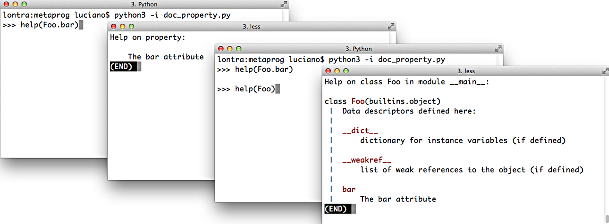

[[ch_dynamic_attrs]]
== Atributos dinâmicos e propriedades
:example-number: 0
:figure-number: 0

[quote, Martelli&#x2c; Ravenscroft &#x26; Holden, Why properties are important (Porque propriedades são importantes)]
____
A importância crucial das propriedades é que sua existência torna perfeitamente seguro,
e até aconselhável, expor atributos de dados públicos como parte da interface pública
de sua classe.footnote:[Alex Martelli, Anna Ravenscroft &#x26; Steve Holden,
https://fpy.li/pynut3[Python in a Nutshell, Third Edition] (O'Reilly), p. 123.]
____

No Python((("dynamic attributes and properties", "dynamic versus virtual attributes"))),
atributos de dados (ou campos) e métodos são conhecidos conjuntamente como _atributos_ .
Um método é um atributo invocável.
Atributos dinâmicos oferecem a mesma interface que os atributos de dados—isto é, `obj.atrib`—mas são computados sob demanda.
Isso atende ao _Princípio de Acesso Uniforme_ de Bertrand Meyer:

[quote, Bertrand Meyer, Object-Oriented Software Construction (Construção de Software Orientada a Objetos)]
____
Todos os serviços oferecidos por um módulo devem estar disponíveis por uma notação uniforme, que não revele se eles são implementados por armazenamento ou por computação.footnote:[Bertrand Meyer, Object-Oriented Software Construction, 2nd ed. (Pearson), p. 57.]
____

Há muitas formas de implementar atributos dinâmicos em Python.
Este capítulo trata das mais simples: o decorador `@property` e o método especial `+__getattr__+`.

Uma((("virtual attributes")))((("attributes", "virtual attributes"))) classe
definida pelo usuário pode implementar `+__getattr__+` para oferecer uma
variação de atributos dinâmicos que chamo de _atributos virtuais_: atributos
que não são declarados explicitamente em lugar algum no código-fonte da classe,
e que não estão presentes no `+__dict__+` das instâncias, mas que podem ser
obtidos de algum outro lugar ou calculados sob demanda sempre que um usuário
tenta ler um atributo inexistente tal como `obj.ausente`.

Programar atributos dinâmicos e virtuais é o tipo de metaprogramação que autores
de frameworks fazem. Entretanto, como as técnicas básicas no Python são simples,
podemos usá-las em tarefas cotidianas de processamento de dados. É por aí que
iniciaremos esse capítulo.

=== Novidades neste capítulo

A atualizações ((("dynamic attributes and properties", "significant changes to")))
deste capítulo foram motivadas pela discussão relativa a
`@functools.cached_property` (introduzido no Python 3.8), o uso
combinado de `@property` e `@functools.cache` (novo no 3.9). Isto afetou o
código das classes `Record` e `Event`, que aparecem na <<computed_props_sec>>.
Também fiz uma refatoração para aproveitar a otimização da
https://fpy.li/pep412[_PEP 412—Key-Sharing Dictionary_]
(Dicionário com chaves compartilhadas).

Para enfatizar as características mais relevantes, e ao mesmo tempo manter os
exemplos legíveis, removi algum código não-essencial—fundindo a antiga classe
`DbRecord` com `Record`, substituindo `shelve.Shelve` por um `dict` e suprimindo
a lógica para baixar o conjunto de dados da OSCON—que os exemplos agora carregam de
um arquivo local, disponível no https://fpy.li/code[«repositório de código»] do
_Python Fluente_.

=== Explorando dados com atributos dinâmicos

Nos((("dynamic attributes and properties", "data wrangling with dynamic attributes", id="DAPwrangl22")))((("data wrangling", "with dynamic attributes", secondary-sortas="dynamic attributes", id="DWdyatt22"))) próximos exemplos, vamos nos valer dos atributos dinâmicos para trabalhar com um conjunto de dados JSON publicado pela O'Reilly, para a conferência OSCON 2014. O <<ex_osconfeed_json>> mostra quatro registros daquele conjunto de dados.footnote:[A OSCON—O'Reilly Open Source Conference (_Conferência O'Reilly de Código Aberto_)—foi uma vítima da pandemia de COVID-19. O arquivo JSON original de 744 KB, que usei para esses exemplos, não está mais disponível online hoje (10 de janeiro de 2021). Você pode obter uma cópia do https://fpy.li/22-1[_osconfeed.json_] no repositório de exemplos do livro.]

[[ex_osconfeed_json]]
.Amostra de registros do osconfeed.json; abreviei o conteúdo de alguns campos
====
[source, json]
----
include::../code/22-dyn-attr-prop/oscon/osconfeed-sample.json[]
----
====

O <<ex_osconfeed_json>> mostra 4 dos 895 registros do arquivo JSON. O conjunto
completo total é um único objeto JSON, com a chave `"Schedule"` (cronograma), e seu
valor é outro mapeamento com quatro chaves: `"conferences"` (conferências),
`"events"` (eventos), `"speakers"` (palestrantes), e `"venues"` (locais).
Cada uma destas quatro chaves aponta para uma lista de registros. No
conjunto de dados completo, as listas de `"events"`, `"speakers"` e
`"venues"` contêm dezenas ou centenas de registros, mas `"conferences"`
contém apenas aquele único registro exibido na segunda linha do <<ex_osconfeed_json>>. Cada
registro inclui um campo `"serial"`, que é um identificador único do registro
dentro da lista onde ele está.

Usei o console de Python para explorar os dados, como mostra o <<ex_osconfeed_explore>>.

[[ex_osconfeed_explore]]
.Exploração interativa do osconfeed.json
====
[source, python]
----
include::../code/22-dyn-attr-prop/oscon/osconfeed_explore.rst[]
----
====
<1> `feed` é um `dict` contendo dicts e listas aninhados, com valores string e inteiros.
<2> Lista as quatro coleções de registros dentro de `'Schedule'`. 
<3> Exibe a contagem de registros para cada coleção.
<4> Navega pelos dicts e listas aninhados para obter o nome da última palestrante (`speaker`).
<5> Obtém o número de série daquela palestrante.
<6> Cada evento tem uma lista `'speakers'`, com o número de série de zero ou mais palestrantes.((("", startref="DWdyatt22")))

==== Explorando dados JSON e similares com atributos dinâmicos

O <<ex_osconfeed_explore>> é((("data wrangling", "JSON-like data",
id="DWjsaon22")))((("JSON-like data", id="jsonlike22"))) simples,
mas esta sintaxe é inconveniente:

[source, python]
----
feed['Schedule']['events'][40]['name']
----

Em JavaScript, é possível obter o mesmo valor escrevendo
`feed.Schedule.events[40].name`.
Não é difícil implementar uma classe parecida com
um `dict` para fazer o mesmo em Python—há inúmeras implementações na
Web.footnote:[Dois exemplos são https://fpy.li/22-2[`AttrDict`] e
https://fpy.li/22-3[`addict`].]
Escrevi `FrozenJSON`, que é mais simples que a maioria das soluções porque
só permite leitura: ela serve apenas para explorar os dados. `FrozenJSON` é
recursiva, lidando automaticamente com mapeamentos e listas aninhados.

O <<ex_explore0_demo>> é uma demonstração da `FrozenJSON`,
e o código-fonte aparece no <<ex_explore0>>.

[[ex_explore0_demo]]
.`FrozenJSON`, do <<ex_explore0>>, permite ler atributos como `name`, e invocar métodos como `++.keys()++` e `++.items()++`
====
[source, python]
----
include::../code/22-dyn-attr-prop/oscon/explore0.py[tags=EXPLORE0_DEMO]
----
====
<1> Cria uma instância de `FrozenJSON` a partir de `raw_feed`, feito de dicts e listas aninhados.
<2> `FrozenJSON` permite percorrer dicts aninhados usando a notação de atributos; aqui exibimos o tamanho da lista de palestrantes.
<3> Métodos dos dicts subjacentes também podem ser acessados; por exemplo, `.keys()`, para recuperar os nomes das coleções de registros.
<4> Usando `items()`, podemos buscar os nomes das listas de registros e seus conteúdos, para exibir o `len()` de cada uma.
<5> Uma `list`, tal como `feed.Schedule.speakers`, permanece uma lista, mas os itens dentro dela, se forem mapeamentos, são convertidos em um `FrozenJSON`.
<6> O item 40 na lista `events` era um objeto JSON; agora ele é uma instância de `FrozenJSON`.
<7> Registros de eventos têm uma lista de `speakers` com os números de série dos palestrantes.
<8> Tentar ler um atributo inexistente gera uma exceção `KeyError`, em vez da `AttributeError` usual.

A pedra angular da classe `FrozenJSON` é o método `+__getattr__+`, que já usamos
no exemplo `Vector` da <<vector_dynamic_attrs_sec>>, para recuperar componentes
de `Vector` por letra: `v.x`, `v.y`, `v.z`, etc. É importante lembrar que o
método especial `+__getattr__+` só é invocado pelo interpretador quando o
processo habitual não consegue recuperar um atributo (isto é, quando o atributo
acessado não é encontrado na instância, nem na sua classe ou suas superclasses).

O passo `⑧` do <<ex_explore0_demo>> expõe um pequeno problema em meu código:
tentar ler um atributo ausente deveria produzir uma exceção `AttributeError`, e
não a `KeyError` gerada. Quando implementei o tratamento de erro para fazer
isso, o método `+__getattr__+` se tornou duas vezes mais longo, ofuscando
a essência da lógica que eu queria apresentar. Dado que os usuários
devem saber que uma `FrozenJSON` é criada a partir de mapeamentos e listas,
levantar `KeyError` não é tão confuso assim.

[[ex_explore0]]
.explore0.py: transforma um conjunto de dados JSON em um `FrozenJSON` contendo objetos `FrozenJSON` aninhados, listas e tipos simples
====
[source, python]
----
include::../code/22-dyn-attr-prop/oscon/explore0.py[tags=EXPLORE0]
----
====

<1> Cria um `dict` a partir do argumento `mapping`. Isso garante que teremos um
mapeamento ou algo que poderá ser convertido para isso. O sublinhado duplo
no prefixo de `+__data+` o torna um atributo privado.

<2> `+__getattr__+` é invocado só quando não existe um atributo com aquele
`name`.

<3> Se `name` corresponde a um atributo da instância de `dict` `++__data++`,
devolve aquele atributo. É assim que chamadas como `feed.keys()` são tratadas: o
método `keys` é um atributo do `dict` `__data`.

<4> Caso contrário, obtém o item `+self.__data+` com a chave `name`, e
devolve o resultado da chamada `FrozenJSON.build()` com aquele
argumento.

<5> Implementar `+__dir__+` suporta a função embutida `dir()`, que por sua vez
suporta _auto-complete_ no console padrão de
Python, bem como no IPython, no Jupyter Notebook, etc. Este código simples vai
permitir _auto-complete_ recursivo baseado nas chaves em
`+self.__data+`, porque `+__getattr__+` cria instâncias de `FrozenJSON` sob
demanda, facilitando a exploração interativa dos dados.

<6> Este é um construtor alternativo, um uso comum do decorador `@classmethod`.

<7> Se `obj` é um mapeamento, cria um `FrozenJSON` com ele. Este é um exemplo de
tipagem ganso—veja a <<goose_typing_sec>> caso precise rever este conceito.

<8> Se for uma `MutableSequence`, criamos uma `list`, passando recursivamente
cada item em `obj` para `.build()`.

<9> Se não for um `dict` ou uma `list`, devolve o item como está.

Cada instância de `FrozenJSON` contém um atributo de instância privado
`+__data+`, armazenado sob o nome `++_FrozenJSON__data++`, como explicado na
<<private_protected_sec>>.

Tentativas de recuperar atributos por outros nomes vão disparar `+__getattr__+`.
Primeiro, esse método verá se o `dict` vinculado a `+self.__data+` tem um
atributo (não uma chave!) com aquele nome.
Assim podemos invocar métodos do `dict`, como `.items()`, pois neste caso
o `FrozenJSON` vai invocar `+self.__data.items()+`.
Se `+self.__data+` não tiver um atributo com o `name` dado, `+__getattr__+`
usa `name` como chave para recuperar um item de
`+self.__data+`, e passa aquele item para `FrozenJSON.build`. Assim podemos
navegar por estruturas aninhadas nos dados JSON, já que cada mapeamento aninhado
é convertido para outra instância de `FrozenJSON` pelo método de classe `build`.

Observe que `FrozenJSON` não transforma ou armazena o conjunto de dados original.
Conforme navegamos pelos dados, `+__getattr__+` cria continuamente instâncias de `FrozenJSON`.
Isto funciona bem com um conjunto de dados não muito grande,
em um script que só será usado para explorar ou converter os dados.

Qualquer script que gera dinamicamente nomes de atributos a partir de
dados arbitrários precisa lidar com uma questão: as chaves nos dados
podem não ser nomes adequados de atributos. A próxima seção fala disso.((("",
startref="jsonlike22")))((("", startref="DWjsaon22")))

[[dynamic_names_sec]]
==== O problema do nome de atributo inválido

O((("data wrangling", "invalid attribute name problem")))((("invalid attribute name problem")))
código de `FrozenJSON` não funciona com nomes de atributos que
sejam palavras reservadas de Python. Por exemplo, se você criar um objeto assim:

[source, python]
----
>>> student = FrozenJSON({'name': 'Jim Bo', 'class': 1982})
----

não será possível acessar `student.class`, porque `class` é uma palavra reservada no Python:

[source, python]
----
>>> student.class
  File "<stdin>", line 1
    student.class
         ^
SyntaxError: invalid syntax
----

Claro, sempre é possível fazer assim:

[source, python]
----
>>> getattr(student, 'class')
1982
----

Mas a ideia de `FrozenJSON` é oferecer acesso conveniente aos dados, então uma
solução melhor é verificar se uma chave no mapeamento passado para
`+FrozenJSON.__init__+` é uma palavra reservada e, em caso positivo, anexar um
`_` a ela, de forma que o atributo possa ser acessado assim:

[source, python]
----
>>> student.class_
1982
----

Podemos fazer isto substituindo o `+__init__+` de uma linha do <<ex_explore0>> pela versão no <<ex_explore1>>.

[[ex_explore1]]
.explore1.py: anexa um `_` a nomes de atributo que são palavras reservadas do Python
====
[source, python]
----
include::../code/22-dyn-attr-prop/oscon/explore1.py[tags=EXPLORE1]
----
====
<1> A função `keyword.iskeyword(…)` é o que precisamos; para usá-la, precisamos importar o módulo `keyword`;
a importação está antes deste trecho do código.

Um problema similar pode surgir se uma chave em um registro JSON não for um identificador válido em Python:

[source, python]
----
>>> x = FrozenJSON({'2be':'or not'})
>>> x.2be
  File "<stdin>", line 1
    x.2be
      ^
SyntaxError: invalid syntax
----

Essas chaves problemáticas são fáceis de detectar no Python 3, porque a classe
`str` oferece o método `s.isidentifier()`, que informa se `s` é um identificador
Python válido, de acordo com a gramática da linguagem. Mas transformar uma chave
que não seja um identificador válido em um nome de atributo válido não é
trivial. Uma solução seria implementar `+__getitem__+` para permitir acesso a
atributos usando uma notação como `x['2be']`. Em nome da simplicidade, não vou
me preocupar com esse problema.

Após essa pequena conversa sobre os nomes de atributos dinâmicos, vamos examinar
outra característica essencial de `FrozenJSON`: a lógica do método de classe
`build`. Este método é invocado por `+__getattr__+` para devolver um tipo
diferente de objeto, dependendo do valor do atributo que está sendo acessado:
estruturas aninhadas são convertidas para instâncias de `FrozenJSON` ou listas
de instâncias de `FrozenJSON`.

Em vez de usar um método de classe, podemos implementar esta lógica no método especial
`+__new__+`, como veremos a seguir.

[[flexible_new_sec]]
==== Criação flexível de objetos com `+__new__+`

Muitas((("data wrangling", "flexible object creation",
id="DWflex22")))((("&#x002A;&#x005F;new&#x002A;&#x005F;",
id="new22")))((("objects", "flexible object creation", id="Oflex22"))) vezes
dizemos que o `+__init__+` é o "método construtor", mas isso é porque adotamos o
jargão de outras linguagens.
No Python, `+__init__+` recebe `self` como primeiro
argumento, portanto o objeto já foi construído pelo interpretador quando ele invoca
`+__init__+`. Além disso, `+__init__+` não devolve um valor. Então, na
verdade, esse método é um inicializador, não propriamente um construtor.footnote:[Em Java acontece
a mesma coisa: a variável mágica `this` dentro de um "construtor" em Java já aponta
para um objeto previamente construído e alocado na memória, e o que resta para o seu código é apenas
inicializá-lo.]

Quando uma classe é invocada para criar uma instância, Python invoca o método especial 
`+__new__+` da classe para construir a instância.

É um método de classe, mas recebe tratamento especial,
então o decorador `@classmethod` não é aplicado a ele.
Python recebe a instância devolvida por `+__new__+`,
e daí a passa como o primeiro argumento (`self`) para `+__init__+`. 
Raramente precisamos escrever um `+__new__+`,
pois a implementação herdada de `object` atende aos casos comuns.

Se necessário, o método `+__new__+` pode devolver uma instância de uma classe diferente.
Quando isso acontece, o interpretador não invoca `+__init__+`.
Em outras palavras, a lógica de Python para criar um objeto é similar a esse pseudo-código:

[source, python]
----
# pseudocódigo
def criar(a_classe, algum_arg):
    novo_objeto = a_classe.__new__(algum_arg)
    if isinstance(novo_objeto, a_classe):
        novo_objeto.__init__(algum_arg)
    return novo_objeto

# as instruções abaixo são praticamente equivalentes
p = Quitute('pão de queijo')
p = criar(Quitute, 'pão de queijo')
----

O <<ex_explore2>> mostra uma variante de `FrozenJSON` onde refatorei a
lógica do método `build` para o método `+__new__+`.

[[ex_explore2]]
.explore2.py: usando `+__new__+` para criar novos objetos, que podem ou não ser instâncias de `FrozenJSON`
====
[source, python]
----
include::../code/22-dyn-attr-prop/oscon/explore2.py[tags=EXPLORE2]
----
====

<1> Por ser um método de classe, `+__new__+` recebe como primeiro argumento
 é a própria classe, e os demais argumentos são os mesmos passados
para `+__init__+`, exceto o `self`.

<2> O comportamento default é delegar para o `+__new__+` de uma superclasse.
Neste caso, estamos invocando o `+__new__+` da classe `object`, passando
`FrozenJSON` como único argumento.

<3> As linhas restantes de `+__new__+` são exatamente as do antigo método
`build`.

<4> Aqui é onde invocávamos `FrozenJSON.build`; agora invocamos apenas a
classe, e Python internamente invoca `+FrozenJSON.__new__+`.

O método `+__new__+` recebe uma classe como primeiro argumento porque,
normalmente, o objeto criado será uma instância daquela classe. Então, em
`+FrozenJSON.__new__+`, quando a expressão `+super().__new__(cls)+`
invoca `+object.__new__(FrozenJSON)+`, a instância criada pela classe `object`
será uma instância de `FrozenJSON`. O atributo `+__class__+` da nova
instância terá uma referência para `FrozenJSON`, apesar de que a instância
será construída por `+object.__new__+`,
implementado em C, nas entranhas do Python.

O conjunto de dados da OSCON está organizado de um jeito pouco amigável à
exploração interativa. Por exemplo, o evento no índice `40`, intitulado `'There
*Will* Be Bugs'` (Haverá Bugs) tem dois palestrantes, `3471` e `5199`. Encontrar
os nomes dos palestrantes é chato, pois esses são números de série e a lista
`Schedule.speakers` não está indexada por eles. Para obter cada palestrante,
precisamos iterar sobre a lista até encontrar um registro com o número de série
correspondente. Nossa próxima tarefa é reestruturar os dados para preparar a
recuperação automática de registros relacionados.((("",
startref="Oflex22")))((("", startref="new22")))((("",
startref="DWflex22")))((("", startref="DAPwrangl22")))

[[computed_props_sec]]
=== Propriedades computadas

Vimos o decorador `@property` pela primeira vez na <<hashable_vector2d_sec>>.
No <<ex_vector2d_v3>> do <<ch_pythonic_obj>>,
usei duas propriedades em `Vector2d` apenas para que os atributos `x` e `y` fossem limitados à leitura (_read-only_).
Aqui veremos propriedades que calculam valores,
levando a uma discussão sobre como armazenar tais valores.

Os((("computed properties", "properties that compute values")))((("dynamic attributes and properties",
"computed properties", id="DAPcomputp22")))
registros na lista `'events'` dos dados da OSCON contêm números de série
apontando para registros nas listas `'speakers'` e `'venues'`, como se fossem
chaves estrangeiras em um banco de dados relacional. Por
exemplo, esse é o registro de uma palestra (com a descrição parcial terminando
em reticências):

[source, json]
----
include::../code/22-dyn-attr-prop/oscon/osconfeed-talk.json[]
----

Vamos implementar uma classe `Event` com propriedades `venue` e `speakers`, para devolver automaticamente os dados relacionados—em outras palavras, "desreferenciar" o número de série.
Dada uma instância de `Event`, o <<ex22-7-added-uuid>> mostra o comportamento desejado.

[[ex22-7-added-uuid]]
.Ler `venue` e `speakers` devolve objetos `Record`
====
[source, python]
----
include::../code/22-dyn-attr-prop/oscon/schedule_v4.py[tags=SCHEDULE4_DEMO]
----
====
<1> Dada uma instância de `Event`...
<2> ...acessar `event.venue` devolve um objeto `Record` em vez de um número de série.
<3> Agora é fácil obter o nome do `venue`.
<4> A propriedade `event.speakers` devolve uma lista de instâncias de `Record`.

Como sempre, vamos criar o código passo a passo,
começando com a classe `Record` e uma função para
ler dados JSON e devolver um `dict` com instâncias de `Record`.

==== Passo 1: criação de atributos baseados em dados

O <<ex_schedule_v1_demo>> mostra((("computed properties",
"data-driven attribute creation", id="CPdatadriven22")))
o doctest para orientar este primeiro passo.

[[ex_schedule_v1_demo]]
.Testando schedule_v1.py (do <<ex_schedule_v1>>)
====
[source, python]
----
include::../code/22-dyn-attr-prop/oscon/schedule_v1.py[tags=SCHEDULE1_DEMO]
----
====
<1> Constrói um `dict` com os dados JSON; a função `load` está no <<ex_schedule_v1>>.
<2> As chaves em `records` são strings criadas a partir do tipo de registro e do número de série.
<3> `speaker` é uma instância da classe `Record`, definida no <<ex_schedule_v1>>.
<4> Campos do JSON original podem ser acessados como atributos de instância de `Record`.

O código de _schedule_v1.py_ está no <<ex_schedule_v1>>.

[[ex_schedule_v1]]
.schedule_v1.py: reorganizando os dados de agendamento da OSCON
====
[source, python]
----
include::../code/22-dyn-attr-prop/oscon/schedule_v1.py[tags=SCHEDULE1]
----
====

<1> Isto é um atalho comum para construir uma instância com atributos criados a partir de argumentos nomeados (a explicação detalhada está abaixo).

<2> Usa o campo `serial` para criar a representação customizada de `Record` exibida no <<ex_schedule_v1_demo>>.

<3> `load` vai devolver um `dict` de instâncias de `Record` no final.

<4> Analisa o JSON, devolvendo objetos Python nativos: listas, dicts, strings, números, etc.

<5> Itera sobre as quatro listas principais, chamadas `'conferences'`, `'events'`, `'speakers'`, e `'venues'`.

<6> `record_type` é o nome da lista sem o último caractere, então `speakers` se
torna `speaker`. No Python ≥ 3.9, podemos fazer isso de forma mais explícita com
`collection.removesuffix('s')`—veja a https://fpy.li/pep616[_PEP 616—String
methods to remove prefixes and suffixes_] (Métodos de string para remover prefixos
e sufixos).

<7> Cria a `key` no formato `'speaker.3471'`.

<8> Cria uma instância de `Record` e a armazena em `records` com a chave `key`.

O método `+Record.__init__+` ilustra um velho truque. Lembre-se de que o
`+__dict__+` de um objeto é onde são guardados seus atributos—a menos que
`+__slots__+` seja declarado na classe, como vimos na <<slots_sec>>. Daí,
atualizar o `+__dict__+` de uma instância é uma maneira fácil de criar um
punhado de atributos naquela instância.footnote:[`Bunch` ou "punhado" é o nome
da classe usada por Alex Martelli para compartilhar essa dica em uma receita de
2001 intitulada https://fpy.li/22-4["The simple but handy ‘collector of a bunch
of named stuff’ class" (_Uma classe simples mas prática 'coletora de um punhado
de coisas nomeadas'_)].]

[NOTE]
====

Dependendo da aplicação, a classe `Record` pode ter que lidar com chaves que não
sejam nomes de atributo válidos, como vimos na <<dynamic_names_sec>>. Tratar
essa questão nos desviaria da ideia principal deste exemplo, e o
problema não ocorre no conjunto de dados que estamos explorando.

====

A definição de `Record` no <<ex_schedule_v1>> é tão simples que você pode estar
se perguntando por que não a usei antes, em vez de `FrozenJSON`.
São duas razões. Primeiro, `FrozenJSON` funciona convertendo recursivamente os
mapeamentos aninhados e listas, mas `Record` não precisa fazer isso, pois nosso
conjunto de dados convertido não contém mapeamentos aninhados. Os
registros contêm apenas strings, inteiros, listas de strings e listas de
inteiros. A segunda razão: `FrozenJSON` oferece acesso aos atributos no `dict`
embutido `+__data+`—que usamos para invocar métodos como `.keys()`—e aqui
não precisamos desta funcionalidade.

[NOTE]
====

A biblioteca padrão de Python oferece classes similares a `Record`, onde cada
instância tem um conjunto arbitrário de atributos criados a partir de argumentos
nomeados passados a `+__init__+`:
https://fpy.li/bd[`types.SimpleNamespace`],
https://fpy.li/be[`argparse.Namespace`], e
https://fpy.li/bf[`multiprocessing.managers.Namespace`].
Escrevi a classe `Record`, mais simples, para destacar a ideia essencial:
`+__init__+` preenchendo o `+__dict__+` da instância.

====

Após reorganizar o conjunto de dados de cronograma, podemos aprimorar a classe
`Record` para obter automaticamente registros de `venue` e `speaker`
referenciados em um registro `event`. Vamos utilizar propriedades para fazer
exatamente isso nos próximos exemplos.((("", startref="CPdatadriven22")))

[[oscon_schedule_v2_sec]]
==== Passo 2: Propriedades para recuperar um registro relacionado

O((("computed properties", "property to retrieve linked records",
id="CPlinked22"))) objetivo da próxima versão é: dado um registro `event`, ler
sua propriedade `venue` vai devolver um `Record`. Isso é similar ao que o ORM
(_Object Relational Mapping_, Mapeamento Relacional de Objetos) do Django faz
quando acessamos um campo `ForeignKey`: em vez da chave, recebemos o
objeto relacionado.

Vamos começar pela propriedade `venue`. Veja a interação parcial no <<ex_schedule_v2_demo>>.

[[ex_schedule_v2_demo]]
.Extratos dos doctests de schedule_v2.py
====
[source, python]
----
include::../code/22-dyn-attr-prop/oscon/schedule_v2.py[tags=SCHEDULE2_DEMO]
----
====
<1> O método estático `Record.fetch` obtém um `Record` ou um  `Event` do conjunto de dados.
<2> Observe que `event` é uma instância da classe `Event`.
<3> Acessar `event.venue` devolve uma instância de `Record`.
<4> Agora é fácil encontrar o nome de um `event.venue`.
<5> A instância de `Event` também tem um atributo `venue_serial`, vindo dos dados JSON.

`Event` é uma subclasse de `Record`, acrescentando um `venue` para obter os registros relacionados, e um método `+__repr__+` especializado.

O código dessa seção está no módulo https://fpy.li/22-8[_schedule_v2.py_], no
https://fpy.li/code[repositório de código do _Python Fluente_].
O exemplo tem aproximadamente 50 linhas, então vou apresentá-lo em partes, começando pela classe `Record` aperfeiçoada.

[[ex_schedule_v2_record]]
.schedule_v2.py: a classe `Record` com um novo método `fetch`
====
[source, python]
----
include::../code/22-dyn-attr-prop/oscon/schedule_v2.py[tags=SCHEDULE2_RECORD]
----
====
<1> `inspect` será usado em `load`, lista do no <<ex_schedule_v2_load>>.
<2> No final, o atributo de classe privado `+__index+` preservará a referência ao `dict` devolvido por `load`.
<3> `fetch` é um `staticmethod`, para deixar explícito que seu efeito não é influenciado pela classe ou pela instância de onde ele é invocado.
<4> Preenche o `+Record.__index+`, se necessário.
<5> E o utiliza para obter um registro com uma dada `key`.

[TIP]
====
Esse é um exemplo onde o uso de `staticmethod` faz sentido.
O método `fetch` sempre age sobre o atributo de classe `Record.__index`, mesmo quando invocado desde uma subclasse, como `Event.fetch()`—que exploraremos a seguir.
Seria equivocado programá-lo como um método de classe, pois o primeiro argumento, `cls`, nunca é usado.
====

Agora podemos usar a propriedade na classe `Event`, listada no <<ex_schedule_v2_event>>.

[[ex_schedule_v2_event]]
.schedule_v2.py: a classe `Event`
====
[source, python]
----
include::../code/22-dyn-attr-prop/oscon/schedule_v2.py[tags=SCHEDULE2_EVENT]
----
====
[role="pagebreak-before less_space"]
<1> `Event` estende `Record`.
<2> Se a instância tem um atributo `name`, esse atributo será usado para produzir uma representação customizada.
Caso contrário, delega para o `+__repr__+` de `Record`.
<3> A propriedade `venue` cria uma `key` a partir do atributo `venue_serial`, e a passa para o método de classe `fetch`, herdado de `Record` (a razão para usar `+self.__class__+` logo ficará clara).

A segunda linha do método `venue` no <<ex_schedule_v2_event>> devolve
`+self.__class__.fetch(key)+`.
Por que não podemos simplesmente invocar `self.fetch(key)`?
A forma simples funciona com esse conjunto específico de dados da OSCON
porque não há registro de evento com uma chave `'fetch'`.
Mas, se um registro de evento tivesse uma chave chamada `'fetch'`,
então dentro daquela instância específica de `Event`,
a referência `self.fetch` apontaria para o valor daquele campo,
em vez do método de classe `fetch` que `Event` herda de `Record`.
Esse é um bug sutil, e poderia facilmente escapar aos testes,
pois depende do conjunto de dados.

[WARNING]
====
Ao criar nomes de atributos de instância a partir de dados, sempre existe o risco de bugs causados pelo ocultamento de atributos da classe—como métodos—ou perda de dados pela sobrescrita acidental de atributos de instância existentes. Estes problemas talvez expliquem por que os dicts de Python não são como objetos JavaScript, e isto é uma vantagem.
====

Se a classe `Record` se comportasse mais como um mapeamento, implementando um `+__getitem__+` dinâmico em vez de um `+__getattr__+` dinâmico, não haveria risco de bugs por ocultamento ou sobrescrita. Um mapeamento customizado seria provavelmente a forma pythônica de implementar `Record`. Mas se eu tivesse seguido por aquele caminho, não estaríamos estudando os truques e as armadilhas da programação dinâmica de atributos.

A parte final deste exemplo é a função `load` revisada, no <<ex_schedule_v2_load>>.

[[ex_schedule_v2_load]]
.schedule_v2.py: a função `load`
====
[source, python]
----
include::../code/22-dyn-attr-prop/oscon/schedule_v2.py[tags=SCHEDULE2_LOAD]
----
====

<1> Até aqui, nenhuma mudança em relação ao `load` em _schedule_v1.py_ (do
<<ex_schedule_v1>>).

<2> Muda a primeira letra de `record_type` para maiúscula, para criar um
possível nome de classe; por exemplo, `'event'` se torna `'Event'`.

<3> Obtém um objeto com aquele nome do escopo global do módulo; se aquele objeto
não existir, obtém a classe `Record`.

<4> Se o objeto recém-obtido é uma classe, e é uma subclasse de `Record`...

<5> ...vincula o nome `factory` a ele. Isto significa que `factory` pode ser
qualquer subclasse de `Record`, dependendo do `record_type`.

<6> Caso contrário, vincula `Record` ao nome `factory`.

<7> O laço `for`, que cria a `key` e armazena os registros, é o mesmo de antes,
exceto que...

<8> ...o objeto armazenado em `records` é construído por `factory`, e pode ser
uma instância de `Record` ou de uma subclasse, como `Event`,
selecionada de acordo com o `record_type`.

Observe que o único `record_type` que tem uma classe customizada é `Event`, mas
se você definir classes chamadas `Speaker` ou `Venue`, `load` usará automaticamente
aquelas classes ao criar e armazenar registros, em vez da classe `Record`.

Agora vamos aplicar a mesma ideia à nova propriedade `speakers`, na classe `Events`.((("", startref="CPlinked22")))

[[property_overriding_sec]]
==== Passo 3: Propriedade sobrescrevendo atributo existente

O((("computed properties", "property overriding existing attributes"))) nome da
propriedade `venue` no <<ex_schedule_v2_event>> não corresponde a um nome de
campo nos registros da coleção `"events"`. Seus dados vêm de um campo chamado
`venue_serial`. Por outro lado, cada registro na coleção `events` tem um campo
`speakers`, contendo uma lista de números de série. Queremos expor essa
informação na forma de uma propriedade `speakers` em instâncias de `Event`, que
devolverá uma lista de instâncias de `Record`. Esta colisão de nomes exige uma
atenção especial, como revela o <<ex_schedule_v3_speakers>>.

[[ex_schedule_v3_speakers]]
.schedule_v3.py: a propriedade `speakers`
====
[source, python]
----
include::../code/22-dyn-attr-prop/oscon/schedule_v3.py[tags=SCHEDULE3_SPEAKERS]
----
====
<1> Os dados que precisamos estão em um atributo `speakers`, mas precisamos obtê-los diretamente
do `+__dict__+` da instância, para evitar uma chamada recursiva à propriedade `speakers`.
<2> Devolve uma lista com todos os registros com chaves correspondendo aos números em `spkr_serials`.

Dentro do método `speakers`, uma tentativa de ler `self.speakers` invocará o
mesmo método, provocando um `RecursionError`. Entretanto,
acessando via `+self.__dict__['speakers']+`, evitamos o algoritmo de Python para
busca de atributos, a propriedade não é acessada, e evitamos a recursão. Por esta
razão, ler ou escrever dados diretamente no `+__dict__+` de um objeto é um
truque comum em metaprogramação no Python.

[WARNING]
====

O interpretador avalia `+obj.my_attr+` olhando primeiro a classe de `obj`. Se
existe uma propriedade com o nome `my_attr`, aquela propriedade oculta um
atributo de instância com o mesmo nome. Isto será demonstrado com exemplos na
<<prop_override_instance>>, e o <<ch_descriptors>> revelará que uma
propriedade é implementada como um _descriptor_ (descritor de atributo), 
uma abstração mais geral e poderosa.

====

Quando programei a compreensão de lista no <<ex_schedule_v3_speakers>>, meu
cérebro réptil de programador pensou: "Isso talvez seja custoso." Na verdade não
é, porque os eventos nos dados da OSCON contêm poucos palestrantes,
então programar algo mais complexo seria uma otimização prematura. Entretanto,
criar um _cache_ de uma propriedade é uma necessidade comum—mas não trivial.
Veremos então como fazer isso nos próximos exemplos.

[[cached_property_sec]]
==== Passo 4: Um _cache_ de propriedades sob medida

Fazer((("computed properties", "property caching", id="CPpcach22"))) _caching_
de propriedades é uma necessidade comum, pois há a expectativa de que uma
expressão como `event.venue` deveria ser pouco dispendiosa.footnote:[Isso é, na
verdade, uma desvantagem do Princípio de Acesso Uniforme de Meyer, mencionada no
início deste capítulo. Quem tiver interesse nesta discussão pode ler o
<<properties_soapbox>> opcional.] Alguma forma de _caching_ poderia se tornar
necessária caso o método `Record.fetch`, invocado nas propriedades de `Event`,
precise consultar um banco de dados ou uma API Web.

Na primeira edição de _Python Fluente_,
programei a lógica customizada de _caching_ para o método `speakers`,
como mostra o <<ex_schedule_v4_hasattr>>.

[[ex_schedule_v4_hasattr]]
.A lógica de _caching_ customizada usando `hasattr` impede a otimização de compartilhamento de chaves
====
[source, python]
----
include::../code/22-dyn-attr-prop/oscon/schedule_v4_hasattr.py[tags=SCHEDULE4_HASATTR_CACHE]
----
====
<1> Se a instância não tem um atributo chamado `__speaker_objs`, obtém os objetos `speaker` e os armazena ali..
<2> Devolve `self.__speaker_objs`.

O _caching_ caseiro no <<ex_schedule_v4_hasattr>> é bastante direto, mas criar atributos após a inicialização da instância frustra a otimização da
https://fpy.li/pep412[PEP 412—Key-Sharing Dictionary]
(Dicionário com chaves compartilhadas), como explicado na <<conseq_dict_internal_sec>>.
Dependendo do tamanho da massa de dados, a diferença de uso de memória pode ser importante.

Uma solução manual similar, compatível com a otimização de
compartilhamento de chaves, implica em escrever um `+__init__+` para a classe
`Event`, para criar o atributo de instância `+__speaker_objs+` inicializado para `None`, e
então usá-lo no método `speakers`. Veja o <<ex_schedule_v4>>.

[[ex_schedule_v4]]
.Armazenamento definido em `+__init__+` para viabilizar a otimização de compartilhamento de chaves
====
[source, python]
----
include::../code/22-dyn-attr-prop/oscon/schedule_v4.py[tags=SCHEDULE4_INIT]
# 15 lines omitted...
include::../code/22-dyn-attr-prop/oscon/schedule_v4.py[tags=SCHEDULE4_CACHE]
----
====

O <<ex_schedule_v4_hasattr>> e o <<ex_schedule_v4>> ilustram técnicas simples de
_caching_ bastante comuns em bases de código Python legadas. Entretanto, em
programas com múltiplas threads, _caches_ manuais como aqueles introduzem
condições de corrida que podem levar à corrupção de dados.
Se duas threads estão lendo uma propriedade que não foi armazenada no _cache_
anteriormente, a primeira thread precisará computar os dados para o atributo de
_cache_ `+__speaker_objs+` e a segunda thread pode ler
um valor inconsistente do _cache_.

Felizmente, Python 3.8 introduziu o decorador `@functools.cached_property`, que
é seguro para uso com threads (_thread safe_). Infelizmente, ele vem com algumas ressalvas,
discutidas a seguir.((("", startref="CPpcach22")))

[[caching_properties_sec]]
==== Passo 5: _Caching_ de propriedades com `functools`

O((("computed properties", "caching properties with functools", id="CPfunctool22")))((("functools module", "caching properties with", id="functools22"))) módulo `functools` oferece três decoradores para _caching_.
Vimos `@cache` e `@lru_cache` na <<memoization_sec>> (<<ch_closure_decorator>>). Python 3.8 introduziu `@cached_property`.

O decorador `functools.cached_property` faz _cache_ do resultado de um método em uma variável de instância com o mesmo nome.

Por exemplo, no <<ex_schedule_v5_cached_property>>, o valor computado pelo método `venue` é armazenado em um atributo `venue`, em `self`.
Após isso, quando código cliente tenta ler `venue`, o recém-criado atributo de instância `venue` é usado, em vez do método.

[[ex_schedule_v5_cached_property]]
.Uso simples de uma `@cached_property`
====
[source, python]
----
include::../code/22-dyn-attr-prop/oscon/schedule_v5.py[tags=SCHEDULE5_CACHED_PROPERTY]
----
====

Na <<property_overriding_sec>>, vimos que uma propriedade oculta um atributo de instância de mesmo nome.
Se isso é verdade, como `@cached_property` pode funcionar?
Se a propriedade sobrescreve o atributo de instância, o atributo `venue` será ignorado e o método `venue` será sempre invocado,
computando a `key` e rodando `fetch` todas as vezes!

A((("attribute descriptors", "overriding versus nonoverriding")))((("nonoverriding descriptors")))((("overriding descriptors"))) resposta é um pouco triste: `cached_property` é um nome enganador.
O decorador `@cached_property` não cria uma propriedade completa, ele cria um _descritor não dominante_. Um descritor é um objeto que gerencia o acesso a um atributo em outra classe.
Vamos mergulhar nos descritores no <<ch_descriptors>>.
O decorador `property` é uma API de alto nível para criar um _descritor dominante_.
O <<ch_descriptors>> inclui uma explicação completa sobre descritores _dominantes_ e _não dominantes_.

Por hora, vamos deixar de lado a implementação subjacente e nos concentrar nas
diferenças entre `cached_property` e `property` do ponto de vista de um usuário.
Raymond Hettinger os explica muito bem na https://fpy.li/bg[«Documentação do
Python»]:

[quote]
____

A mecânica de `cached_property()` é um tanto diferente da de `property()`. Uma
propriedade normal bloqueia a escrita em atributos, a menos que um _setter_ seja
definido. Uma `cached_property`, por outro lado, permite a escrita.

O decorador `cached_property` só funciona para consultas e apenas quando um
atributo de mesmo nome não existe. Quando acionada, `cached_property` escreve no
atributo de mesmo nome. Leituras e escritas subsequentes daquele atributo têm
precedência sobre o método decorado com `cached_property` e ele funciona como um
atributo normal.

O valor "cacheado" (_cached_) pode ser excluído apagando-se o atributo.
Isto permite que o método `cached_property` rode novamente.footnote:[Fonte:
documentação de https://fpy.li/bg[@functools.cached_property]. Sei que o autor
dessa explicação é Raymond Hettinger porque ele a escreveu em resposta a um
problema que eu reportei:
https://fpy.li/22-11[_bpo42781—functools.cached_property docs should explain
that it is non-overriding_] (a documentação de functools.cached_property deveria
explicar que ele é não-dominante). Hettinger é um grande colaborador da
documentação oficial de Python e de pacotes importantes da biblioteca padrão,
como o sensacional `itertools`.]

____

Voltando((("@cached_property"))) à nossa classe `Event`: o comportamento
específico de `@cached_property` o torna inadequado para decorar `speakers`,
porque aquele método depende de um atributo existente também chamado `speakers`,
contendo os números de série dos palestrantes do evento.

[WARNING]
====
`@cached_property` tem algumas importantes limitações:

* Ele não pode ser usado como um substituto direto de `@property`
se o método decorado acessa um atributo de instância de mesmo nome.
* Ele não pode ser usado em uma classe que defina `+__slots__+`.
* Ele impede a otimização de chaves compartilhadas do `+__dict__+` da instância, pois cria um atributo de instância após o `+__init__+`.
====

Apesar destas limitações, `@cached_property` supre uma necessidade comum de um modo simples,
e é seguro para usar com threads.
Seu https://fpy.li/22-13[código Python] é um exemplo do uso de uma
https://fpy.li/bp[_reentrant lock_] (trava reentrante ou trava recursiva).footnote:[Veja
https://fpy.li/bq[«Mutex recursivo»] na Wikipédia.]

A
https://fpy.li/bh[documentação] de `@cached_property`
recomenda uma solução alternativa que podemos usar com `speakers`:
empilhar decoradores `@property` e `@cache`, como mostro no <<ex_schedule_v5_property_over_cache>>.

[[ex_schedule_v5_property_over_cache]]
.Empilhando `@property` sobre `@cache`
====
[source, python]
----
include::../code/22-dyn-attr-prop/oscon/schedule_v5.py[tags=SCHEDULE5_PROPERTY_OVER_CACHE]
----
====
<1> A ordem é importante: `@property` vai acima...
<2> ...de `@cache`.

Lembre-se do significado dessa sintaxe, comentada em <<stacked_decorators_tip>>.
As três primeiras linhas do <<ex_schedule_v5_property_over_cache>> fazem isso:

[source, python]
----
speakers = property(cache(speakers))
----

O `@cache` é aplicado a `speakers`, devolvendo uma nova função.
Esta função é então decorada por `@property`,
que a substitui por uma propriedade criada na hora.

Isto encerra nossa discussão de propriedades somente para leitura e decoradores de _caching_, explorando o conjunto de dados da OSCON.

Na próxima seção iniciamos uma nova série de exemplos, criando propriedades de leitura e escrita.((("", startref="DAPcomputp22")))((("", startref="CPfunctool22")))((("", startref="functools22")))

[[prop_validation_sec]]
=== Propriedades para validação de atributos

Além((("attributes", "using properties for attribute validation", id="Aval22")))((("dynamic attributes and properties", "using properties for attribute validation", id="DAPval22"))) de computar valores de atributos, as propriedades também são usadas para impor regras de negócio, transformando um atributo público em um atributo protegido por um _getter_ e um _setter_, sem afetar o código cliente. Vamos explorar um exemplo mais elaborado.

==== LineItem Versão #1: Classe para um item em um pedido

Imagine uma aplicação para uma loja que vende alimentos orgânicos a granel, onde os
fregueses podem encomendar nozes, frutas secas e cereais por peso. Neste
sistema, cada pedido contém uma sequência de produtos, e cada produto é
representado por uma instância de uma classe, como no <<lineitem_class_v1>>.

[[lineitem_class_v1]]
.bulkfood_v1.py: a classe `LineItem` mais simples
====
[source, python]
----
include::../code/22-dyn-attr-prop/bulkfood/bulkfood_v1.py[tags=LINEITEM_V1]
----
====

Este código é simples e agradável. Talvez simples demais. <<lineitem_problem_v1>> mostra um problema.

[[lineitem_problem_v1]]
.Peso negativo resulta em subtotal negativo
====
[source, python]
----
include::../code/22-dyn-attr-prop/bulkfood/bulkfood_v1.py[tags=LINEITEM_PROBLEM_V1]
----
====

Apesar de ser um exemplo inventado, não é tão fantasioso quanto se poderia imaginar. Aqui está uma história do início da Amazon.com:

[quote, Jeff Bezos, fundador da Amazon.com]
____
Descobrimos que os clientes podiam encomendar uma quantidade negativa de livros! E nós creditaríamos seus cartões de crédito com o preço e, suponho, esperaríamos que eles nos enviassem os livros.footnote:[Citação direta de Jeff Bezos no artigo do _Wall Street Journal_ https://fpy.li/22-16[_Birth of a Salesman_] (O Nascimento de um Vendedor) publicado em 15 de outubro de 2011. Pelo menos em 2023, é necessário ser assinante para ler o artigo.]
____

Como evitar isso?
Poderíamos mudar a interface de `LineItem` para usar um _getter_ e um _setter_ para o atributo `weight` (peso).
Este seria o estilo Java, e não está errado, mas podemos fazer melhor.
É natural definir o `weight` de um item apenas atribuindo um valor a este atributo;
e talvez o sistema esteja em produção, com outras partes já acessando `item.weight` diretamente.
Neste caso, o estilo Python seria substituir o atributo de dados por uma propriedade.

==== LineItem versão #2: Uma propriedade de validação

Implementar uma propriedade nos permitirá usar um _getter_ e um _setter_,
sem mudar a interface pública de `LineItem`:
para definir o `weight` de um `LineItem` ainda poderemos escrever
`raisins.weight = 12`.

O <<lineitem_class_v2>> lista o código de uma propriedade de leitura e escrita para `weight`.

[[lineitem_class_v2]]
.bulkfood_v2.py: um `LineItem` com uma propriedade `weight`
====
[source, python]
----
include::../code/22-dyn-attr-prop/bulkfood/bulkfood_v2.py[tags=LINEITEM_V2]
----
====
<1> Aqui o _setter_ da propriedade já está em uso, assegurando que nenhuma instância com peso negativo possa ser criada.
<2> `@property` decora o método _getter_.
<3> Todos os métodos que implementam a propriedade compartilham o mesmo nome do atributo público: `weight`.
<4> O valor é armazenado em um atributo privado `+__weight+`.
<5> O _getter_ decorado ganha um atributo `.setter`, que também é um decorador; isto conecta o _getter_ e o _setter_.
<6> Se o valor for maior que zero, atualizamos o `+__weight+` privado.
<7> Caso contrário, um `ValueError` é levantado.

Observe como agora não é possível criar uma `LineItem` com peso inválido:

[source, python]
----
>>> walnuts = LineItem('walnuts', 0, 10.00)
Traceback (most recent call last):
    ...
ValueError: value must be > 0
----

Assim protegemos `weight` impedindo que usuários forneçam valores negativos.
Fregueses normalmente não podem definir o preço de um produto, mas um
erro administrativo ou um bug poderiam criar um `LineItem` com um `price`
negativo. Para evitar isso, poderíamos também transformar `price` em uma
propriedade, mas isso levaria a alguma repetição no nosso código.

Lembre-se da citação de Paul Graham no <<ch_generators>>: "Quando vejo padrões
em meus programas, considero isso um mau sinal." A cura para a repetição é a
abstração. Há duas maneiras de abstrair definições de propriedades: usar uma
fábrica de propriedades ou uma classe descritora. A abordagem via classe
descritora é mais flexível, e dedicaremos o <<ch_descriptors>> a uma discussão
completa deste mecanismo. Na verdade, propriedades são, elas mesmas, implementadas
como classes descritoras. Mas aqui vamos seguir com nossa exploração das
propriedades, implementando uma fábrica de propriedades em forma de função.

Mas antes de podermos implementar uma fábrica de propriedades, precisamos
entender melhor as propriedades em si.((("", startref="Aval22")))((("",
startref="DAPval22")))

=== Propriedades em profundidade

Apesar((("dynamic attributes and properties", "property class",
id="DAPpclass22")))((("property class", id="proclass22"))) de ser frequentemente
usada como um decorador, `property` é na verdade uma classe embutida. No Python,
funções e classes são muitas vezes intercambiáveis, pois ambas são invocáveis e
não há um operador `new` para instanciação de objeto, então invocar um
construtor não é diferente de invocar uma função fábrica. E ambas podem ser
usadas como decoradores, desde que elas devolvam um novo invocável, que seja um
substituto adequado do invocável decorado.

Esta é a assinatura completa do construtor de `property`:

[source, python]
----
property(fget=None, fset=None, fdel=None, doc=None)
----

Todos os argumentos são opcionais, e se uma função não é fornecida para algum deles,
a operação correspondente não será permitida pela propriedade resultante.

O tipo `property` foi introduzido no Python 2.2, mas a sintaxe `@` do decorador
só surgiu no Python 2.4. Então, por alguns anos, propriedades eram definidas
passando as funções de acesso nos dois primeiros argumentos.

A sintaxe "clássica" para definir propriedades sem decoradores é ilustrada pelo <<lineitem_class_v2b>>.

[[lineitem_class_v2b]]
.bulkfood_v2b.py: igual ao <<lineitem_class_v2>>, sem usar decoradores
====
[source, python]
----
include::../code/22-dyn-attr-prop/bulkfood/bulkfood_v2b.py[tags=LINEITEM_V2B]
----
====
<1> Um _getter_ simples.
<2> Um _setter_ simples.
<3> Cria a `property` e a vincula a um atributo da classe.

Em algumas situações, a forma clássica é melhor que a sintaxe do decorador; o código da fábrica de propriedade, que discutiremos em breve, é um exemplo. Por outro lado, no corpo de uma classe com muitos métodos, os decoradores tornam explícito quais são os _getters_ e os _setters_, sem depender da convenção do uso dos prefixos `get` e `set` em seus nomes.

A presença de uma propriedade em uma classe afeta como os atributos nas instâncias daquela classe podem ser encontrados, de uma forma que à primeira vista pode ser surpreendente. A próxima seção explica isso.

[[prop_override_instance]]
==== Propriedades sobrescrevem atributos de instância

Propriedades são sempre atributos de uma classe,
mas elas controlam o acesso a atributos nas instâncias da classe.

Na <<overriding_class_attributes_sec>>,
vimos que quando uma instância e sua classe têm um atributo de dados com o mesmo nome,
o atributo de instância sobrescreve, ou oculta,
o atributo da classe—ao menos quando lido através daquela instância.
O <<attr_override_demo1>> ilustra esse ponto.

[[attr_override_demo1]]
.Atributo de instância oculta o atributo de classe `data`
====
[source, python]
----
>>> class Class:  # <1>
...     data = 'the class data attr'
...     @property
...     def prop(self):
...         return 'the prop value'
...
>>> obj = Class()
>>> vars(obj)  # <2>
{}
>>> obj.data  # <3>
'the class data attr'
>>> obj.data = 'bar' # <4>
>>> vars(obj)  # <5>
{'data': 'bar'}
>>> obj.data  # <6>
'bar'
>>> Class.data  # <7>
'the class data attr'
----
====
<1> Define `Class` com dois atributos de classe: o atributo `data` e a propriedade `prop`.
<2> `vars` devolve o `+__dict__+` de `obj`, mostrando que ele não tem atributos de instância.
<3> Ler de `obj.data` obtém o valor de `Class.data`.
<4> Escrever em `obj.data` cria um atributo de instância.
<5> Inspeciona a instância, para ver o atributo de instância.
<6> Ler agora de `obj.data` obtém o valor do atributo da instância.
Quanto lido a partir da instância `obj`, o `data` da instância oculta o `data` da classe.
<7> O atributo `Class.data` está intacto.

Agora vamos tentar  sobrescrever o atributo `prop` na instância `obj`. Continuando a sessão de console anterior, temos o  <<attr_override_demo2>>.

[[attr_override_demo2]]
.Um atributo de instância não oculta uma propriedade da classe (continuando do <<attr_override_demo1>>)
====
[source, python]
----
>>> Class.prop  # <1>
<property object at 0x1072b7408>
>>> obj.prop  # <2>
'the prop value'
>>> obj.prop = 'foo'  # <3>
Traceback (most recent call last):
  ...
AttributeError: can't set attribute
>>> obj.__dict__['prop'] = 'foo'  # <4>
>>> vars(obj)  # <5>
{'data': 'bar', 'prop': 'foo'}
>>> obj.prop  # <6>
'the prop value'
>>> Class.prop = 'baz'  # <7>
>>> obj.prop  # <8>
'foo'
----
====
<1> Ler `prop` diretamente de `Class` obtém o próprio objeto propriedade, sem executar seu método _getter_.
<2> Ler `obj.prop` executa o _getter_ da propriedade.
<3> Tentar definir um atributo `prop` na instância falha.
<4> Inserir `'prop'` diretamente em `+obj.__dict__+` funciona.
<5> Podemos ver que agora `obj` tem dois atributos de instância: `data` e `prop`.
<6> Entretanto, ler `obj.prop` ainda executa o _getter_ da propriedade. A propriedade não é ocultada pelo atributo de instância.
<7> Sobrescrever `Class.prop` destrói o objeto propriedade.
<8> Agora `obj.prop` obtém o atributo de instância. `Class.prop` não é mais uma propriedade, então  ela não mais sobrescreve `obj.prop`.

Como uma demonstração final, vamos adicionar uma propriedade a `Class`, e vê-la  sobrescrever um atributo de instância. O <<attr_override_demo3>> retoma a sessão onde o <<attr_override_demo2>> parou.

[[attr_override_demo3]]
.Uma nova propriedade de classe oculta o atributo de instância existente (continuando do <<attr_override_demo2>>)
====
[source, python]
----
>>> obj.data  # <1>
'bar'
>>> Class.data  # <2>
'the class data attr'
>>> Class.data = property(lambda self: 'the "data" prop value')  # <3>
>>> obj.data  # <4>
'the "data" prop value'
>>> del Class.data  # <5>
>>> obj.data  # <6>
'bar'
----
====
<1> `obj.data` obtém o atributo de instância `data`.
<2> `Class.data` obtém o atributo de classe `data`.
<3> Sobrescreve `Class.data` com uma nova propriedade.
<4> `obj.data` está agora ocultado pela propriedade `Class.data`.
<5> Apaga a propriedade .
<6> `obj.data` agora lê novamente o atributo de instância `data`.

O ponto principal desta seção é que uma expressão como `obj.data` não começa a
busca por `data` em `obj`. A busca na verdade começa em `+obj.__class__+`, e
Python só olha para a instância `obj` se não houver uma propriedade
chamada `data` na classe. Isto se aplica a((("overriding descriptors"))) _descritores
dominantes_ em geral, dos quais as propriedades são apenas um exemplo. 
Para mais detalhes, aguarde o <<ch_descriptors>>.

Voltemos às propriedades. Toda unidade de código de Python—módulos, funções,
classes, métodos—pode conter uma docstring. O próximo tópico mostra como anexar
documentação às propriedades.

==== Documentação de propriedades

Quando ferramentas como uma IDE ou a função `help()` do console precisam mostrar a
documentação de uma propriedade, elas extraem a informação do atributo
`+__doc__+` da propriedade.

Se usada com a sintaxe clássica de invocação, `property` pode receber a string de documentação no argumento `doc`:

[source, python]
----
    weight = property(get_weight, set_weight, doc='weight in kilograms')
----

Alternativamente, a docstring do método _getter_—aquele que recebe o decorador `@property`—é usada
como documentação da propriedade toda. A <<help_foo_screens>> mostra telas de
ajuda geradas a partir do código no <<ex_foo_property_doc>>.

[[help_foo_screens]]
.Capturas de tela do console de Python para os comandos `help(Foo.bar)` e `help(Foo)`. O código-fonte está no <<ex_foo_property_doc>>.

[[ex_foo_property_doc]]
.Documentação para uma propriedade
====
[source, python]
----
include::../code/22-dyn-attr-prop/doc_property.py[tags=DOC_PROPERTY]
----
====

Agora que cobrimos o essencial sobre as propriedades, vamos voltar para a
questão de proteger os atributos `weight` e `price` de `LineItem`, para que eles
só aceitem valores maiores que zero—mas sem codar na unha dois pares
de _getters/setters_ praticamente idênticos.((("",
startref="DAPpclass22")))((("", startref="proclass22")))

[[coding_prop_factory_sec]]
=== Uma fábrica de propriedades

Vamos((("dynamic attributes and properties", "coding property factories",
id="DAPfactory22")))((("quantity properties", id="quantprop22"))) programar uma
fábrica para criar propriedades `quantity` (quantidade)—assim denominada porque
os atributos gerenciados representam quantidades que não podem ser negativas ou
zero na aplicação. O <<lineitem_class_v2prop_class>> mostra a aparência
cristalina da classe `LineItem` usando duas instâncias de propriedades
`quantity`: uma para gerenciar o atributo `weight`, a outra para o `price`.

[[lineitem_class_v2prop_class]]
.bulkfood_v2prop.py: a fábrica de propriedades `quantity` em ação
====
[source, python]
----
include::../code/22-dyn-attr-prop/bulkfood/bulkfood_v2prop.py[tags=LINEITEM_V2_PROP_CLASS]
----
====
<1> Usa a fábrica para definir a primeira propriedade customizada, `weight`, como um atributo de classe.
<2> Essa segunda chamada cria outra propriedade customizada, `price`.
<3> Aqui a propriedade já está ativa, assegurando que um peso negativo ou `0` seja rejeitado.
<4> As propriedades também são usadas aqui, para recuperar os valores armazenados na instância.

Recorde que propriedades são atributos de classe. Ao criar cada propriedade `quantity`, precisamos passar o nome do atributo de `LineItem` que será gerenciado por aquela propriedade específica. Ter que digitar a palavra `weight` duas vezes na linha abaixo é lamentável:

[source, python]
----
    weight = quantity('weight')
----

Mas evitar tal repetição é complicado, pois a propriedade não tem como saber
qual nome de atributo será vinculado a ela. Lembre-se: o lado direito de uma
atribuição é avaliado primeiro, então quando `quantity()` é invocada, o atributo
`weight` ainda não existe na classe.

[NOTE]
====
Aperfeiçoar a propriedade `quantity` para que o usuário
não precise redigitar o nome do atributo é um problema
não trivial de metaprogramação, que resolveremos no <<ch_descriptors>>.
====

O <<lineitem_class_v2prop>> apresenta a fábrica de propriedades
`quantity`.

[[lineitem_class_v2prop]]
.bulkfood_v2prop.py: a fábrica de propriedades `quantity`
====
[source, python]
----
include::../code/22-dyn-attr-prop/bulkfood/bulkfood_v2prop.py[tags=LINEITEM_V2_PROP_FACTORY_FUNCTION]
----
====
<1> O argumento `storage_name`, onde os dados de cada propriedade são armazenados; para `weight`, o nome do armazenamento será `'weight'`.
<2> O primeiro argumento do `qty_getter` poderia se chamar `self`, mas soaria estranho, pois isso não é o corpo de uma classe; `instance` se refere à instância de `LineItem` onde o atributo será armazenado.
<3> `qty_getter` se refere a `storage_name`, então ele será preservado na clausura desta função; o valor é obtido diretamente de `+instance.__dict__+`, para contornar a propriedade e evitar uma recursão infinita.
<4> `qty_setter` é definido, e também recebe `instance` como primeiro argumento.
<5> O `value` é armazenado diretamente no `+instance.__dict__+`, novamente contornando a propriedade.
<6> Cria e devolve um objeto propriedade customizado.

As partes do <<lineitem_class_v2prop>> que merecem um estudo mais cuidadoso giram em torno da variável `storage_name`.

Quando programamos uma propriedade da maneira tradicional, o nome do atributo onde um valor será armazenado está definido explicitamente nos métodos _getter_ e _setter_.
Mas aqui as funções `qty_getter` e `qty_setter` são genéricas, e dependem da variável `storage_name` para saber onde ler/escrever o atributo gerenciado no `+__dict__+` da instância.
Cada vez que a fábrica `quantity` é invocada para criar uma propriedade, `storage_name` precisa ser definida com um valor único.

As funções `qty_getter` e `qty_setter` serão encapsuladas pelo objeto `property`, criado na última linha da função fábrica. Mais tarde, quando forem chamadas para cumprir seus papéis, estas funções lerão a `storage_name` de suas clausuras para saber onde os valores dos atributos gerenciados estão armazenados.

No <<lineitem_class_v2prop_demo>>, criei e inspecionei uma instância de `LineItem`, expondo os atributos armazenados.

[[lineitem_class_v2prop_demo]]
.bulkfood_v2prop.py: explorando propriedades e atributos de armazenamento
====
[source, python]
----
include::../code/22-dyn-attr-prop/bulkfood/bulkfood_v2prop.py[tags=LINEITEM_V2_PROP_DEMO]
----
====
<1> Lendo o `weight` e o `price` através das propriedades que ocultam os atributos de instância de mesmo nome.
<2> Usando `vars` para inspecionar a instância `nutmeg`: aqui vemos os reais atributos de instância  usados para armazenar os valores.

Observe como as propriedades criadas por nossa fábrica se valem do comportamento descrito na <<prop_override_instance>>:
a propriedade `weight` sobrescreve o atributo de instância `weight`, de forma que qualquer referência a `self.weight` ou `nutmeg.weight` é tratada pelas funções da propriedade, e a única maneira de contornar a lógica da propriedade é acessando diretamente o `+__dict__+` da instância.

O código do <<lineitem_class_v2prop>> pode ser um pouco complicado, mas é conciso: seu tamanho é idêntico ao do par _getter/setter_ decorado que define apenas a propriedade `weight` no <<lineitem_class_v2>>. A definição de  `LineItem` no <<lineitem_class_v2prop_class>> é mais legível sem o ruído de _getters_ e _setters_.

Em um sistema real, o mesmo tipo de validação pode aparecer em muitos campos
espalhados por várias classes, e a fábrica `quantity` estaria em um módulo
utilitário, pronta para uso em todas as partes do sistema que precisem dela.
Depois, aquela fábrica simples poderia ser refatorada em uma classe descritora
mais extensível, com subclasses especializadas realizando diferentes validações.
Faremos isso no <<ch_descriptors>>.

Vamos agora encerrar a discussão das propriedades com a questão da exclusão de atributos.((("", startref="DAPfactory22")))((("", startref="quantprop22")))

[[attribute_deletion_sec]]
=== Tratando a exclusão de atributos

Podemos((("dynamic attributes and properties", "handling attribute deletion")))((("attributes", "handling attribute deletion")))((("del statement"))) usar a instrução `del` para excluir não apenas variáveis, mas também atributos:

[source, python]
----
>>> class Demo:
...    pass
...
>>> d = Demo()
>>> d.color = 'green'
>>> d.color
'green'
>>> del d.color
>>> d.color
Traceback (most recent call last):
  File "<stdin>", line 1, in <module>
AttributeError: 'Demo' object has no attribute 'color'
----

Na prática, a exclusão de atributos não é algo que se faça todo dia no Python, e a necessidade de lidar com isso no caso de uma propriedade é ainda mais rara. Mas tal operação é suportada, e consigo pensar em um exemplo bobo para demonstrá-la.

Em uma definição de propriedade, o decorador `@my_property.deleter` encapsula o método responsável por excluir o atributo gerenciado pela propriedade.
Como prometido, o tolo <<ex_black_knight>> foi inspirado pela cena com o Cavaleiro Negro, do filme _Monty Python e o Cálice Sagrado_.footnote:[Aquela cena sangrenta está https://fpy.li/22-17[disponível no Youtube] quando reviso essa seção, em outubro de 2021.]

[[ex_black_knight]]
.blackknight.py
====
[source, python]
----
include::../code/22-dyn-attr-prop/blackknight.py[tags=BLACK_KNIGHT]
----
====

Os doctests em _blackknight.py_ estão no <<demo_black_knight>>.

[[demo_black_knight]]
.blackknight.py: doctests para <<ex_black_knight>> (o Cavaleiro Negro nunca reconhece a derrota)
====
[source, python]
----
include::../code/22-dyn-attr-prop/blackknight.py[tags=BLACK_KNIGHT_DEMO]
----
====

Usando a sintaxe clássica de invocação em vez de decoradores, o argumento `fdel` configura a função de exclusão.
Por exemplo, a propriedade `member` seria escrita assim no corpo da classe `BlackKnight`:

[source, python]
----
    member = property(member_getter, fdel=member_deleter)
----

Se você não estiver usando uma propriedade, a exclusão de atributos pode ser tratada implementando o método especial de nível mais baixo `+__delattr__+`, apresentado na <<special_methods_for_attr_sec>>. Programar uma classe tola com `+__delattr__+` fica como exercício para a leitora que queira procrastinar.

Propriedades são recursos poderosos, mas algumas vezes alternativas mais simples ou de nível mais baixo são preferíveis.
Na seção final deste capítulo, vamos revisar algumas das APIs essenciais oferecidas pelo Python para programação de atributos dinâmicos.

=== Atributos e funções essenciais para tratamento de atributos

Ao longo((("dynamic attributes and properties", "essential attributes and functions for attribute handling", id="DAPessential22"))) deste capítulo, e mesmo antes no livro, usamos algumas funções embutidas e métodos especiais oferecidos pelo Python para lidar com atributos dinâmicos. Esta seção os reúne em um único lugar para uma visão geral, pois sua documentação está espalhada na documentação oficial.

==== Atributos especiais que afetam o tratamento de atributos

O comportamento de muitas das funções e dos métodos especiais elencados nas próximas seções dependem de três atributos especiais:

`+__class__+`:: Uma((("&#x005F;&#x005F;class&#x005F;&#x005F;"))) referência à classe do objeto (isto
é, `+obj.__class__+` é o mesmo que `type(obj)`). Python procura por métodos especiais tal como
`+__getattr__+` apenas na classe do objeto, e não nas instâncias em si.

`+__dict__+`:: Um((("&#x005F;&#x005F;dict&#x005F;&#x005F;")))((("&#x005F;&#x005F;slots&#x005F;&#x005F;"))) mapeamento que armazena os atributos passíveis de escrita de um objeto ou de uma classe. Um objeto que tenha um `+__dict__+` pode ter novos atributos arbitrários definidos a qualquer tempo. Se uma classe tem um atributo `+__slots__+`, então suas instâncias não podem ter um `+__dict__+`. Veja `+__slots__+` (abaixo).

`+__slots__+`:: Um atributo que pode ser definido em uma classe para economizar memória.
`+__slots__+` é uma `tuple` de strings, nomeando os atributos permitidosfootnote:[Alex Martelli assinala que, apesar de `+__slots__+` poder ser definido como uma `list`, é melhor ser explícito e sempre usar uma `tuple`, pois modificar a lista em `+__slots__+` após o processamento do corpo da classe não tem qualquer efeito. Assim, seria equivocado usar uma sequência mutável ali.]. Se o
nome `+'__dict__'+` não estiver em `+__slots__+`, as instâncias daquela classe então não terão um `+__dict__+` próprio, e apenas os atributos listados em `+__slots__+` serão permitidos naquelas instâncias.
Revise a <<slots_sec>> para recordar esse tópico.

[[bif_attribute_handling]]
==== Funções embutidas para tratamento de atributos

Essas cinco funções embutidas executam leitura, escrita e introspecção de atributos de objetos:

`dir([object])`:: Lista((("dir([object]) function")))((("functions", "dir([object]) function")))
a maioria dos atributos de um objeto. A
https://fpy.li/bj[documentação oficial]
diz que o objetivo de `dir` é o uso interativo, então ele não fornece uma lista completa de atributos,
mas um conjunto de nomes "interessantes". `dir` pode inspecionar objetos implementados com ou sem um `+__dict__+`.
O próprio atributo `+__dict__+` não é listado por `dir`, mas as chaves de `+__dict__+` são listadas.
Vários atributos especiais de classes, como 
`+__mro__+`, `+__bases__+` e `+__name__+`, também não são listados por `dir`.
Você pode customizar o comportamento de `dir` implementando o método especial `+__dir__+`,
como vimos no <<ex_explore0>>.
Se o argumento opcional `object` não for passado, `dir` lista os nomes definidos no escopo atual.

`getattr(object, name[, default])`:: Devolve((("functions", "getattr(object, name[, default]) function")))((("getattr(object, name[, default]) function"))) o atributo identificado pela string `name` no `object`. O principal caso de uso é obter atributos (ou métodos) cujos nomes são conhecidos só durante a execução do programa. Esta função pode recuperar um atributo da classe do objeto ou de uma superclasse. Se tal atributo não existir, `getattr` gera uma `AttributeError` ou devolve o valor `default`, se este argumento for passado.
Um ótimo exemplo de uso de `gettatr` aparece no
https://fpy.li/22-19[método `Cmd.onecmd`], no pacote `cmd` da biblioteca padrão, onde ela é usada para obter e executar um comando definido pelo usuário.

`hasattr(object, name)`:: Devolve `True` se o atributo nomeado existir em `object`, ou puder ser obtido de alguma forma através dele (por herança, por exemplo). A https://fpy.li/bk[«documentação»] explica: "Isto é implementado chamando `getattr(object, name)` e vendo se levanta um `AttributeError` ou não."

`setattr(object, name, value)`:: Atribui((("functions", "setattr(object, name, value) function"))) o `value` ao atributo denominado `name` do `object`, se o `object` permitir essa operação. Isto pode criar um novo atributo ou sobrescrever um atributo existente.

`vars([object])`:: Devolve((("vars([object]) function")))((("functions", "setattr(object, name, value) function"))) o `+__dict__+` de `object`; `vars` não funciona com instâncias de classes que definem `+__slots__+` e não têm um `+__dict__+` (compare com `dir`, que aceita essas instâncias). Sem argumentos, `vars()` faz o mesmo que `locals()`: devolve um `dict` representando o escopo local.

[[special_methods_for_attr_sec]]
==== Métodos especiais para tratamento de atributos

Quando implementados em uma classe definida pelo usuário, os métodos especiais listados abaixo controlam a recuperação, a atualização, a exclusão e a listagem de atributos.

Acessos((("getattr function")))((("setattr function")))((("functions", "hasattr function")))((("hasattr function")))((("functions", "getattr function")))((("functions", "setattr funcion"))) a atributos, usando a notação de ponto ou as funções embutidas `getattr`, `hasattr` e `setattr` disparam os métodos especiais correspondentes, listados aqui. A leitura e escrita de atributos como chaves no
`+__dict__+` da instância não dispara esses métodos especiais—e esta é a forma habitual de evitá-los quando necessário.

A seção https://fpy.li/bm["3.3.11. Pesquisa de método especial"] do capítulo "Modelo de dados" adverte:

[quote]
____
Para classes customizadas, as invocações implícitas de métodos especiais só têm garantia de funcionar corretamente se definidas em um tipo de objeto [a classe], não no dicionário de instância do objeto.
____

Em outras palavras, assuma que os métodos especiais serão acessados na própria
classe, mesmo quando o alvo da invocação é uma instância. Por esta razão, métodos
especiais não são ocultados por atributos de instância de mesmo nome.

Nos exemplos a seguir, assuma que há uma classe chamada `Class`, que `obj` é uma instância de `Class`, e que `atrib` é um atributo de `obj`.

Para cada um destes métodos especiais, não importa se o acesso ao atributo é
feito usando a notação de ponto ou uma das funções embutidas listadas na
<<bif_attribute_handling>>. Por exemplo, tanto `obj.atrib` quanto `getattr(obj,
'atrib')` disparam `+Class.__getattribute__(obj, 'atrib')+`.

`+__delattr__(self, name)+`:: Sempre((("&#x005F;&#x005F;delattr&#x005F;&#x005F;"))) invocado quando ocorre uma tentativa de excluir um atributo usando a instrução `del`; por exemplo, `del obj.atrib` dispara `+Class.__delattr__(obj, 'atrib')+`.
Se `atrib` for uma propriedade, seu método de exclusão nunca será invocado se a classe implementar
`+__delattr__+`.

`+__dir__(self)+`:: Invocado((("&#x005F;&#x005F;dir&#x005F;&#x005F;"))) quando `dir` é invocado sobre um objeto, para fornecer uma lista de atributos; por exemplo, `dir(obj)` dispara
`+Class.__dir__(obj)+`. Também é usado pelo recurso de auto-completar em todos os consoles modernos de Python.

`+__getattr__(self, name)+`::
Invocado((("&#x005F;&#x005F;getattr&#x005F;&#x005F;"))) apenas quando uma
tentativa de obter o atributo nomeado falha, após `obj`, `Class` e suas
superclasses serem pesquisadas. As expressões `obj.ausente`, `getattr(obj,
'ausente')` e `hasattr(obj, 'ausente')` podem disparar
`+Class.__getattr__(obj, 'ausente')+`, mas apenas se um atributo com o
nome `'ausente'` não for encontrado em `obj` ou em `Class` e suas superclasses.

`+__getattribute__(self, name)+`:: Sempre((("&#x005F;&#x005F;getattribute&#x005F;&#x005F;"))) invocado quando há uma tentativa de obter o atributo nomeado diretamente a partir de código Python (o interpretador pode ignorar isso em alguns casos, por exemplo para obter o método `+__repr__+`). A notação de ponto e as funções embutidas `getattr` e `hasattr` disparam este método. O método `+__getattr__+` só é invocado após `+__getattribute__+`, e apenas quando este gera um `AttributeError`. Para acessar atributos da instância `obj` sem entrar em uma recursão infinita, implementações de `+__getattribute__+` devem usar `+super().__getattribute__(obj, name)+`.

`+__setattr__(self, name, value)+`::
Sempre((("&#x005F;&#x005F;setattr&#x005F;&#x005F;"))) invocado quando há uma
tentativa de atribuir um valor ao atributo nomeado. A notação de ponto e a
função embutida `setattr` disparam esse método; por exemplo, tanto `obj.atrib =
42` quanto `setattr(obj, 'atrib', 42)` disparam `+Class.__setattr__(obj, 'atrib', 42)+`.

[WARNING]
====

Na prática, por serem invocados incondicionalmente, afetando praticamente todos
os acessos a atributos, os métodos especiais `+__getattribute__+` e
`+__setattr__+` são mais difíceis de usar corretamente que `+__getattr__+`, que
só trata acessos a atributos que não existem. Usar propriedades ou descritores
costuma ser mais fácil que definir `+__getattribute__+` ou
`+__setattr__+`.

====

Isso conclui nosso mergulho nas propriedades, nos métodos especiais e nas outras técnicas de programação de atributos dinâmicos.((("", startref="DAPessential22")))

=== Resumo do capítulo

Começamos((("dynamic attributes and properties", "overview of"))) nossa
discussão dos atributos dinâmicos mostrando exemplos práticos de classes
simples para facilitar a exploração de um conjunto de dados em JSON. O primeiro
exemplo foi a classe `FrozenJSON`, que converte listas e dicts aninhados em
instâncias aninhadas de `FrozenJSON`, e em listas de instâncias da mesma classe.
O código de `FrozenJSON` demonstrou o uso do método especial `+__getattr__+`
para converter estruturas de dados sob demanda, sempre que seus atributos eram
lidos. A última versão de `FrozenJSON` mostrou o uso do método construtor
`+__new__+` para transformar uma classe em uma fábrica flexível de objetos, não
restrita a instâncias de si mesma.

Convertemos então o conjunto de dados JSON em um `dict` que armazena instâncias da classe `Record`.
A primeira versão de `Record` tinha apenas algumas linhas e apresentou o truque de usar `+self.__dict__.update(**kwargs)+` para criar atributos arbitrários a partir de argumentos nomeados passados para `+__init__+`.
A segunda passagem acrescentou a classe `Event`, implementando a recuperação automática de registros relacionados através de propriedades.

Propriedades que devolvem valores calculados algumas vezes necessitam de _caching_, e falamos de algumas formas de fazer isso.
Após descobrir que `@functools.cached_property` não é sempre aplicável, aprendemos sobre uma alternativa: a combinação de `@property` acima de `@functools.cache`, nesta ordem.

A discussão sobre propriedades continuou com a classe `LineItem`, onde criamos
uma propriedade para evitar que um atributo `weight` receba valores negativos ou
zero, que não fazem sentido na lógica do negócio. Após um aprofundamento da
sintaxe e da semântica das propriedades, criamos uma fábrica de propriedades
para aplicar a mesma validação a `weight` e a `price`, sem precisar escrever
múltiplos _getters_ e _setters_. A fábrica de propriedades se apoiou em
conceitos sutis—como clausuras e a sobreposição de atributos de instância por
propriedades—para fornecer uma solução genérica elegante, usando para isso o
mesmo número de linhas que usamos antes para escrever manualmente a definição de
uma única propriedade.

Por fim, demos uma rápida passada pelo tratamento da exclusão de atributos com propriedades, seguida por um resumo dos principais atributos especiais, funções embutidas e métodos especiais que suportam a metaprogramação de atributos no núcleo da linguagem Python.

=== Leitura Complementar

A((("dynamic attributes and properties", "further reading on"))) documentação
oficial para as funções embutidas de tratamento de atributos e introspecção é o
capítulo
https://fpy.li/bn[«Funções embutidas»] da _Biblioteca Padrão de
Python_. Os métodos especiais relacionados e o atributo especial `+__slots__+`
estão documentados em _A Referência da Linguagem Python_, em
https://fpy.li/br[«Personalizando o acesso aos atributos»]. A semântica
de como métodos especiais são invocados ignorando as instâncias está explicada
em https://fpy.li/bs[«Pesquisa de método especial»]. 
A seção https://fpy.li/bt[«Atributos especiais»] trata dos atributos `+__class__+` e `+__dict__+`.

O https://fpy.li/pycook3[_Python Cookbook, 3rd. ed._], de David Beazley e Brian
K. Jones (O’Reilly), tem várias receitas relacionadas aos tópicos deste
capítulo, mas eu destaco três delas: A
_Recipe 8.8. Extending a Property in a Subclass_
(Estendendo uma Propriedade em uma Subclasse) trata da espinhosa questão de sobrescrever métodos dentro de uma
propriedade herdada de uma superclasse; a 
_Recipe 8.15. Delegating Attribute Access_
(Delegando o Acesso a Atributos) implementa uma classe
de fachada, demonstrando a maioria dos métodos especiais da
<<special_methods_for_attr_sec>> deste livro; e a
_Recipe 9.21. Avoiding Repetitive Property Methods_
(Evitando Métodos de Propriedade Repetitivos),
que foi a base da função fábrica de propriedades
que apresentei no <<lineitem_class_v2prop>>.

O https://fpy.li/pynut3[_Python in a Nutshell_, 3rd. ed.], de Alex Martelli,
Anna Ravenscroft e Steve Holden (O'Reilly), é rigoroso e objetivo. Eles dedicam
apenas três páginas a propriedades, mas isto foi possível porque o livro segue
um estilo de apresentação axiomático: as 15 ou 16 páginas precedentes fornecem
uma descrição minuciosa da semântica das classes de Python, a partir do zero,
incluindo descritores, que são como as propriedades são  implementadas debaixo
dos panos. Assim, quando Martelli et al. chegam às propriedades, eles concentram
várias ideias profundas naquelas três páginas—incluindo o trecho que selecionei
para abrir este capítulo.

Bertrand Meyer—citado na definição do Princípio do Acesso Uniforme no início do
capítulo—foi um pioneiro da metodologia _Design by
Contract_ [Projeto por Contrato], projetou a linguagem Eiffel,
e escreveu o excelente _Object-Oriented
Software Construction_, 2ª ed. (Pearson). Os primeiros seis capítulos são
uma das melhores introduções conceituais à análise e design orientados a objetos
que tenho notícia. O capítulo 11 apresenta a programação por contrato, e o
capítulo 35 traz as avaliações de Meyer de algumas das mais influentes
linguagens orientadas a objetos: Simula, Smalltalk, CLOS (the Common Lisp Object
System), Objective-C, {cpp}, e Java, com comentários curtos sobre algumas
outras. Spoiler: na última página do livro o autor revela que a "notação"
extremamente legível usada como pseudocódigo ao longo livro é
na verdade a linguagem Eiffel.

[role="pagebreak-before less_space"]
[[properties_soapbox]]
.Ponto de Vista
****

O Princípio de Acesso Uniforme de Meyer((("Soapbox sidebars", "Uniform Access Principle", id="Suaccess22")))((("Uniform Access Principle", id="uaccess22")))((("Meyer&#x27;s Uniform Access Principle", id="meyerua22")))((("dynamic attributes and properties", "Soapbox discussion", id="DAPsoap22"))) é esteticamente atraente. Como um programador usando uma API, eu não deveria ter de me preocupar se `product.price` simplesmente lê um atributo de dados ou executa uma computação. Como um consumidor e um cidadão, eu me importo: no comércio online atual, o valor de `product.price` muitas vezes depende de quem está perguntando, então ele certamente não é um mero atributo de dados. Na verdade, é uma prática comum apresentar um preço mais baixo se a consulta vem de fora da loja—por exemplo, de um mecanismo de comparação de preços. Isso pune os fregueses fiéis, que gostam de explorar sua loja favorita. Mas estou divagando.

A digressão anterior toca um ponto relevante para a programação: apesar do
Princípio de Acesso Uniforme fazer todo sentido em um mundo ideal, na realidade
os usuários de uma API podem precisar saber se ler `product.price` é
potencialmente dispendioso ou demorado demais. Isto é um problema geral das abstrações
em programação: elas dificultam raciocinar sobre o custo de computar
uma expressão durante a execução. Por outro lado, abstrações
permitem aos usuários da linguagem fazerem mais com menos código. É uma troca. Como de
hábito em questões de engenharia de software, o
https://fpy.li/22-26[«wiki original»] de Ward Cunningham contém argumentos inteligentes sobre os prós e contras do
https://fpy.li/22-27[_Uniform Access Principle_] (Princípio de Acesso Uniforme).

Em linguagens de programação orientadas a objetos, a aplicação ou violação do Princípio de Acesso Uniforme muitas vezes gira em torno da sintaxe de leitura de atributos de dados públicos versus a invocação de métodos _getter/setter_.

Smalltalk e Ruby resolvem essa questão de uma forma simples e elegante: elas não suportam nenhuma forma de atributos de dados públicos. Todo atributo de instância nessas linguagens é privado, então qualquer acesso a eles deve passar por métodos. Mas sua sintaxe torna isso indolor: em Ruby, `product.price` invoca o _getter_ de `price`; em Smalltalk, ele é simplesmente `product price`.

Na outra ponta do espectro, a linguagem Java permite ao programador escolher entre quatro modificadores de nível de acesso—incluindo o default sem nome que o https://fpy.li/22-28[«Java Tutorial»] chama de "_package-private_".

A prática geral, entretanto, não concorda com a sintaxe definida pelos projetistas de Java. Todos no campo de Java concordam que atributos devem ser `private`, e é necessário escrever isso explicitamente todas as vezes, porque não é o default. Quando todos os atributos são privados, todo acesso a eles de fora da classe precisa passar por métodos de acesso. Os IDEs de Java incluem atalhos para gerar métodos de acesso automaticamente. Infelizmente, o IDE não ajuda quando você precisa ler aquele código seis meses depois. É problema seu navegar por um oceano de métodos de acesso que não fazem nada, para encontrar aqueles que adicionam valor, implementando alguma lógica do negócio.

Alex Martelli fala pela maioria da comunidade Python quando chama métodos de acesso de "idiomatismos patéticos", e então apresenta
exemplos que parecem muito diferentes, mas fazem a mesma coisa:footnote:[Alex Martelli, _Python in a Nutshell_, 2ª ed. (O'Reilly), p. 101.]

[source, python]
----
um_objeto.contagem += 1
# bem melhor que...
um_objeto.set_contagem(um_objeto.get_contagem() + 1)
----

Algumas vezes, ao projetar uma API, me pergunto se todo método que não recebe argumentos (além de `self`) é uma função pura (isto é, devolve um valor mas não tem efeitos colaterais) não deveria ser substituído por uma propriedade somente de leitura. Neste capítulo, o método `LineItem.subtotal` (no <<lineitem_class_v2prop_class>>) seria um bom candidato a se tornar uma propriedade somente para leitura. Claro, isso exclui métodos projetados para modificar o objeto, tal como `my_list.clear()`. Seria uma péssima ideia transformar isso em uma propriedade, de tal forma que o mero acesso a `my_list.clear` apagaria o conteúdo da lista!

Na biblioteca GPIO https://fpy.li/22-29[_Pingo_] (mencionada na <<missing_method_sec>>), da qual sou co-autor, grande parte da API do usuário está baseada em propriedades. Por exemplo, para ler o valor atual de uma porta analógica, o usuário escreve `pin.value`, e definir o modo de uma porta digital é escrito `pin.mode = OUT`. Por trás da cortina, ler o valor de uma porta analógica ou definir o modo de uma porta digital pode implicar em bastante código, dependendo do driver específico da placa. Decidimos usar propriedades no Pingo porque queríamos que a API fosse confortável de usar até mesmo em ambientes interativos como um Jupyter Notebook, e achamos que `pin.mode = OUT` é mais fácil para os olhos e para os dedos que `pin.set_mode(OUT)`.

Apesar de achar a solução de Smalltalk e de Ruby mais limpa, acho que a abordagem de Python faz mais sentido que a de Java. Podemos começar simples, programando elementos de dados como atributos públicos, pois sabemos que eles sempre podem ser encapsulados por propriedades (ou descritores, dos quais falaremos no próximo capítulo).((("", startref="meyerua22")))((("", startref="uaccess22")))((("", startref="Suaccess22")))

**`+__new__+` é melhor que `new`**

Em Python((("function-class duality")))((("Soapbox sidebars",
"function-class duality"))) a instanciação de um objeto usa mesma
sintaxe que a invocação de uma função: `my_obj = spam()`,
onde `spam` pode ser uma classe ou qualquer
outro invocável.

Outras linguagens, influenciadas pela sintaxe do {cpp}, têm um operador `new`
que faz a instanciação parecer diferente de uma invocação. Na maior parte do
tempo, o usuário de uma API não se importa se `spam` é uma função ou uma classe.
Por anos tive a impressão que `property` era uma função. No uso cotidiano, não
faz diferença.

Há muitas boas razões para substituir construtores por fábricas.footnote:[As razões que menciono foram apresentadas no artigo intitulado https://fpy.li/22-30[_Java's new Considered Harmful_] (new de Java considerado nocivo), de Jonathan Amsterdam, publicado na Dr. Dobbs Journal, e em _Consider static factory methods instead of constructors_ (Considere substituir construtores por métodos fábrica estáticos), que é o Item 1 do premiado livro _Effective Java_, 3ª ed., de Joshua Bloch (Addison-Wesley).] Um motivo comum é limitar o número de instâncias, devolvendo objetos construídos anterioremente (como no padrão de projeto Singleton). Um uso relacionado é fazer _caching_ de uma construção de objeto dispendiosa. Além disso, às vezes é conveniente devolver objetos de tipos diferentes, dependendo dos argumentos passados.

Programar um construtor é simples; fornecer uma fábrica aumenta a flexibilidade
às custas de mais código. Em linguagens com um operador `new`, o projetista de
uma API precisa decidir se vai fornecer um construtor simples ou
investir em uma fábrica. Se a escolha inicial estiver errada, a correção pode
ser cara—tudo porque `new` é um operador.

Algumas vezes pode ser conveniente pegar o caminho inverso, e substituir uma função simples por uma classe.

Em Python, classes e funções são intercambiáveis em muitas situações.
Não apenas pela ausência de um operador `new` para construir instâncias,
mas também porque existe o método especial `+__new__+`,
que pode transformar uma classe em uma fábrica que produz objetos de diferentes tipos
(como vimos na <<flexible_new_sec>>), ou devolve instâncias pré-fabricadas em vez de criar uma nova instância toda vez.

Esta dualidade função-classe seria mais fácil de aproveitar se a
https://fpy.li/22-31[PEP 8—Style Guide for Python Code] (Guia de Estilo para Código Python)
não recomendasse `CamelCase` para nomes de classes.
Por outro lado, dezenas de classes na biblioteca padrão têm nomes apenas em minúsculas
(por exemplo, `property`, `str`, `defaultdict`, etc.).
Daí que talvez o uso de nomes de classe só com minúsculas seja uma vantagem, e não um bug.
Mas independente do ponto de vista, esta inconsistência
no uso de maiúsculas e minúsculas nos nomes de classes na biblioteca padrão de Python é desconfortável.

Apesar da invocação de uma função não ser diferente da invocação de uma classe,
é bom saber qual é qual porque podemos criar uma subclasse de uma classe, mas não de uma função.
Então eu, pessoalmente, uso `CamelCase` nas classes que escrevo,
e gostaria que todas as classea na biblioteca padrão de Python seguissem alguma convenção
para não evitar casos como `collections.OrderedDict` e `collections.defaultdict`.((("", startref="DAPsoap22")))
****
