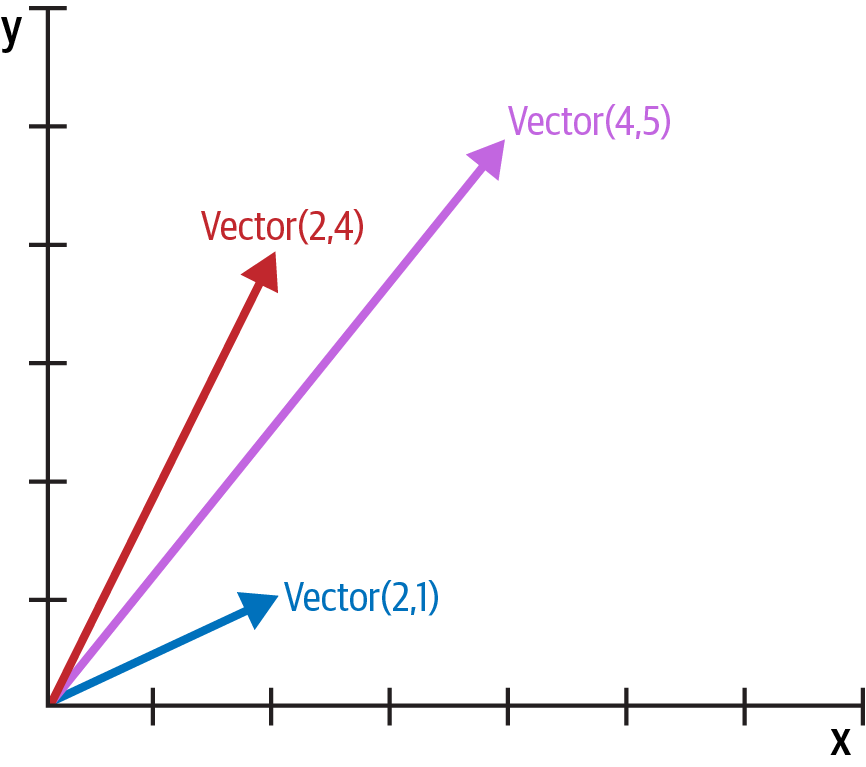
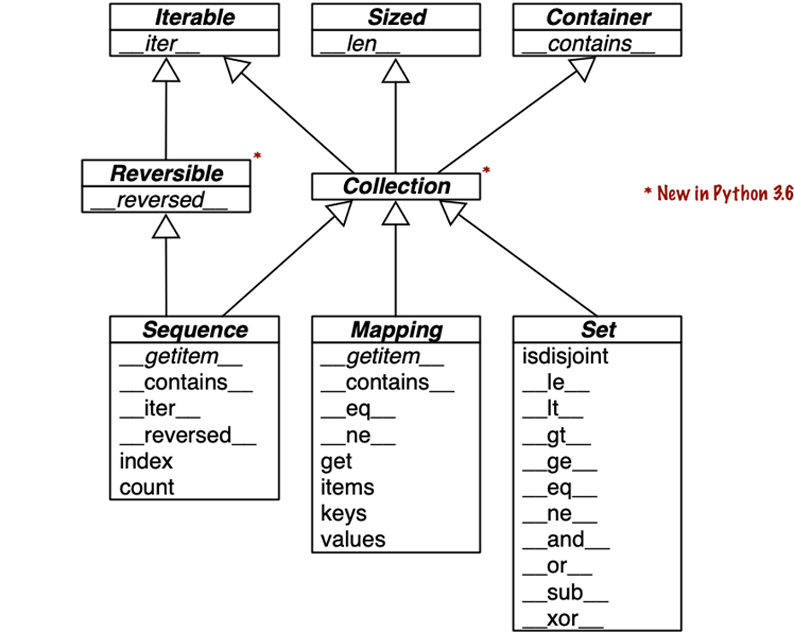

[[ch_data_model]]
== O modelo de dados de Python
:example-number: 0
:figure-number: 0

[quote, Jim Hugunin, criador do Jython&#x002C; co-criador do AspectJ&#x002C; e arquiteto do .Net DLR—Dynamic Language Runtime]
____
O senso estético de Guido para o design de linguagens é incrível.
Conheci muitos projetistas capazes de criar linguagens teoricamente lindas,
que ninguém jamais usaria.
Mas Guido é uma daquelas raras pessoas capazes de criar uma linguagem só um pouco menos teoricamente linda que,
por isso mesmo, é uma delícia para programar.
footnote:[Traduzido de
«Story of Jython» [.small]#&#91;fpy.li/1-1&#93;#,
prefácio de
«Jython Essentials» [.small]#&#91;fpy.li/1-2&#93;#,
de Samuele Pedroni e Noel Rappin (O'Reilly).]
____

Uma das melhores qualidades de Python é sua consistência.
Após trabalhar com Python por algum tempo, é possível intuir, de modo informado e correto,
o funcionamento de recursos que você acabou de conhecer.

Entretanto, se você aprendeu outra linguagem orientada a objetos antes de Python,
pode achar estranho usar `len(collection)` em vez de `collection.len()`.
Essa peculiaridade é a ponta de um iceberg que, quando bem compreendido,
é a chave para tudo aquilo que chamamos de _pythônico_.
O iceberg se chama Modelo de Dados de Python,
e é a API que usamos para fazer nossos objetos lidarem bem com
os recursos mais poderosos e característicos da linguagem.

É((("Python Data Model", "overview of"))) possível pensar no modelo de dados como
uma descrição de Python na forma de um framework.
Ele formaliza as interfaces dos elementos constituintes da própria linguagem,
como sequências, funções, iteradores, corrotinas, classes, gerenciadores de contexto e assim por diante.

Quando usamos um framework,
passamos um bom tempo programando métodos que são chamados pelo framework,
e não pelas nossas classes.
O mesmo acontece quando nos valemos do Modelo de Dados de Python para criar novas classes.
O interpretador de Python invoca((("special methods", "purpose of")))
métodos especiais para realizar operações básicas sobre os objetos,
muitas vezes acionadas por uma sintaxe especial.
Os((("special methods", "naming conventions")))((("&#x005F;&#x005F;
(double underscore)")))((("double underscore (&#x005F;&#x005F;)")))
nomes dos métodos especiais são sempre precedidos e seguidos de dois sublinhados.
Por exemplo, a sintaxe `obj[key]` está amparada no método especial `+__getitem__+`.
Para resolver `my_collection[key]`, o interpretador chama `+my_collection.__getitem__(key)+`.

[role="pagebreak-before"]
Implementamos métodos especiais quando queremos que nossos objetos suportem e interajam com
elementos fundamentais da linguagem, como:

* Coleções

* Acesso a atributos

* Iteração (incluindo iteração assíncrona com `+async for+`)

* Sobrecarga (_overloading_) de operadores

* Invocação de funções e métodos

* Representação e formatação de strings

* Programação assíncrona usando `+await+`

* Criação e destruição de objetos

* Contextos gerenciados usando as instruções `with` ou `async with`

.Mágica e o "dunder"
[NOTE]
====
O((("magic methods")))((("dunder methods")))
termo _método mágico_ é uma gíria usada para se referir aos métodos especiais,
mas como falamos de um método específico, por exemplo `+__getitem__+`?
Aprendi a dizer "dunder-getitem" com o autor e professor Steve Holden.
"Dunder" é uma contração da frase em inglês "double underscore before and after"
(_sublinhado duplo antes e depois_).
Por isso os métodos especiais são também conhecidos como _métodos dunder_.
O capítulo
«Análise Léxica» [.small]#&#91;fpy.li/2d&#93;#
de _A Referência da Linguagem Python_ adverte:
"_Qualquer_ uso de nomes no formato `+__*__+` que não siga explicitamente o uso documentado,
em qualquer contexto, está sujeito a quebra sem aviso prévio."
====

<<<

=== Novidades neste capítulo

Esse((("Python Data Model", "significant changes to"))) capítulo sofreu poucas alterações desde a primeira edição,
pois é uma introdução ao Modelo de Dados de Python, que é muito estável.
As mudanças mais significativas foram:

* Métodos especiais que suportam programação assíncrona e outras novas funcionalidades
foram acrescentados às tabelas na <<overview_special_methods>>.

* A <<collection_uml>>, mostrando o uso de métodos especiais na  <<collection_api>>,
incluindo a classe base abstrata `collections.abc.Collection`, introduzida no Python 3.6.

Além disso, aqui((("f-string syntax", "benefits of"))) e por toda essa segunda edição,
adotei a sintaxe _f-string_, introduzida no Python 3.6,
que é mais legível e muitas vezes mais conveniente que as notações de formatação de strings mais antigas:
o((("str.format() method")))((("&#x0025; (modulo) operator")))((("modulo (&#x0025;) operator")))
método `str.format()` e o operador `%`.

[role="man-height-1-125"]
[TIP]
====
Existe((("my_fmt.format() method"))) ainda uma razão para usar `my_fmt.format()`:
quando a definição de `my_fmt` precisa vir de um lugar diferente daquele onde
a operação de formatação precisa acontecer no código.
Por exemplo, quando `my_fmt` tem múltiplas linhas e é melhor definida em uma constante,
ou quando tem de vir de um arquivo de configuração ou de um banco de dados.
Essas são necessidades reais, mas não acontecem com frequência.
====

////
PROD: As is often the case, the TIP above may or may not run over the next paragraphs,
depending on some random factor I don't know how to control.
////

[[pythonic_card_deck]]
=== Um baralho pythônico

O <<ex_pythonic_deck>> é((("&#x005F;&#x005F;getitem&#x005F;&#x005F;",
id="getitem01")))((("&#x005F;&#x005F;len&#x005F;&#x005F;", id="len01")))((("Pythonic Card Deck example",
id="pycard01")))((("Python Data Model", "&#x005F;&#x005F;getitem&#x005F;&#x005F; and &#x005F;&#x005F;len&#x005F;&#x005F;",
id="PDMgetitem01", secondary-sortas="getitem")))((("special methods",
"&#x005F;&#x005F;getitem&#x005F;&#x005F; and &#x005F;&#x005F;len&#x005F;&#x005F;",
id="SMgetitem01", secondary-sortas="getitem")))((("card deck example", id="carddeck01")))
simples, mas demonstra as possibilidades que se abrem com a implementação de apenas dois métodos especiais,
`+__getitem__+` e `+__len__+`.

[[ex_pythonic_deck]]
.Um baralho como uma sequência de cartas
====
[source, python]
----
include::../code/01-data-model/frenchdeck.py[]
----
====

A((("collections.namedtuple"))) primeira coisa a notar é o uso de `collections.namedtuple`
para construir uma classe simples representando cartas individuais.
Usamos `namedtuple` para criar classes de objetos que são apenas um agrupamento de atributos,
sem métodos próprios, como um registro de banco de dados.
Neste exemplo, a utilizamos para fornecer uma boa representação textual para as cartas em um baralho,
como mostra a sessão no console:

[source, python]
----
>>> beer_card = Card('7', 'diamonds')
>>> beer_card
Card(rank='7', suit='diamonds')
----

Mas a parte central desse exemplo é a classe `FrenchDeck`.
Ela é curta, mas poderosa.
Primeiro, como qualquer coleção padrão de Python,
uma instância de `FrenchDeck` responde à
função((("len() function")))((("functions", "len() function"))) `len()`,
devolvendo o número de cartas naquele baralho:

[source, python]
----
>>> deck = FrenchDeck()
>>> len(deck)
52
----

Ler cartas específicas do baralho é fácil, graças ao método `+__getitem__+`.
Por exemplo, a primeira e a última carta:

[source, python]
----
>>> deck[0]
Card(rank='2', suit='spades')
>>> deck[-1]
Card(rank='A', suit='hearts')
----

Deveríamos criar um método para obter uma carta aleatória? Não é necessário.
Python((("random.choice function"))) já tem uma função que devolve um item aleatório de uma sequência: `random.choice`.
Podemos usá-la em uma instância de `FrenchDeck`:

[source, python]
----
>>> from random import choice
>>> choice(deck)
Card(rank='3', suit='hearts')
>>> choice(deck)
Card(rank='K', suit='spades')
>>> choice(deck)
Card(rank='2', suit='clubs')
----

Acabamos((("special methods", "advantages of using"))) de ver duas vantagens de usar
os métodos especiais no contexto do Modelo de Dados de Python.

* Os usuários de suas classes não precisam memorizar nomes arbitrários de métodos para operações comuns
("Como obter o número de itens? É `.size()`, `.length()` ou outra coisa?")

* É mais fácil de aproveitar a rica biblioteca padrão de Python e evitar reinventar a roda,
como no caso da função `random.choice`.

Mas não é só isso.

Como nosso `+__getitem__+` usa o((("square brackets ([])")))((("[] (square brackets)")))
operador `[]` de `self._cards`,
nosso baralho suporta fatiamento automaticamente.
Podemos olhar as três primeiras cartas no topo de um baralho,
e depois pegar só os ases, iniciando com o índice 12 e pulando 13 cartas por vez:

[source, python]
----
>>> deck[:3]
[Card(rank='2', suit='spades'), Card(rank='3', suit='spades'),
Card(rank='4', suit='spades')]
>>> deck[12::13]
[Card(rank='A', suit='spades'), Card(rank='A', suit='diamonds'),
Card(rank='A', suit='clubs'), Card(rank='A', suit='hearts')]
----

E como já temos o método especial `+__getitem__+`, nosso baralho é um objeto iterável,
ou seja, pode ser percorrido em um laço `for`:

[source, python]
----
>>> for card in deck:  # doctest: +ELLIPSIS
...   print(card)
Card(rank='2', suit='spades')
Card(rank='3', suit='spades')
Card(rank='4', suit='spades')
...
----

Também podemos iterar sobre o baralho na ordem inversa:

[source, python]
----
>>> for card in reversed(deck):  # doctest: +ELLIPSIS
...   print(card)
Card(rank='A', suit='hearts')
Card(rank='K', suit='hearts')
Card(rank='Q', suit='hearts')
...
----

.Reticências nos doctests
[NOTE]
====
Sempre((("doctest package", "ellipsis in")))((("ellipsis (&#x2026;)")))((("&#x2026; (ellipsis)"))) que possível,
extraí as listagens do console de Python usadas neste livro com o
«`doctest`» [.small]#&#91;fpy.li/2e&#93;#, para garantir a precisão.
Quando a saída era longa demais, a parte omitida está marcada por reticências (`\...`),
como na última linha do trecho de código anterior.

Nesse casos, usei((("&#x002B;ELLIPSIS directive"))) a diretiva `# doctest: +ELLIPSIS`
para fazer o doctest funcionar.
Ao experimentar esses exemplos no console iterativo,
pode omitir todos os comentários de doctest.
====

A iteração muitas vezes é implícita.
Python invoca o método `+__contains__+` da coleção para tratar o operador `in`: `student in team`.
Mas se a coleção não((("&#x005F;&#x005F;contains&#x005F;&#x005F;"))) fornece um método `+__contains__+`,
o operador `in` realiza uma busca sequencial.
No nosso caso, `in` funciona com nossa classe `FrenchDeck` porque ela é iterável.
Veja a seguir:

[source, python]
----
>>> Card('Q', 'hearts') in deck
True
>>> Card('7', 'beasts') in deck
False
----

E o ordenamento?
Um sistema comum de ordenar cartas é por seu valor numérico (ases sendo os mais altos) e depois por naipe,
na ordem espadas (o mais alto), copas, ouros e paus (o mais baixo).
Aqui está uma função que ordena as cartas com essa regra,
devolvendo `0` para o 2 de paus e `51` para o Ás de espadas.

[source, python]
----
suit_values = dict(spades=3, hearts=2, diamonds=1, clubs=0)

def spades_high(card):
    rank_value = FrenchDeck.ranks.index(card.rank)
    return rank_value * len(suit_values) + suit_values[card.suit]
----

Agora podemos ordenar nosso baralho usando `spades_high` como critério de ordenação:

[source, python]
----
>>> for card in sorted(deck, key=spades_high):  # doctest: +ELLIPSIS
...      print(card)
Card(rank='2', suit='clubs')
Card(rank='2', suit='diamonds')
Card(rank='2', suit='hearts')
... (46 cards omitted)
Card(rank='A', suit='diamonds')
Card(rank='A', suit='hearts')
Card(rank='A', suit='spades')
----

Apesar do `FrenchDeck` herdar implicitamente da classe `object`,
a maior parte de sua funcionalidade não é herdada, vem do modelo de dados e de composição.
Ao implementar os métodos especiais `+__len__+` e `+__getitem__+`,
nosso `FrenchDeck` se comporta como uma sequência Python padrão,
podendo assim se beneficiar de recursos centrais da linguagem (por exemplo, iteração e fatiamento),
e da biblioteca padrão, como mostramos nos exemplos usando `random.choice`,
`reversed`, e `sorted`.
Graças à composição,
as implementações de `+__len__+` e `+__getitem__+` podem delegar todo o trabalho para um objeto `list`,
especificamente `self._cards`.((("", startref="PDMgetitem01")))((("", startref="getitem01")))((("",
startref="len01")))((("", startref="pycard01")))((("", startref="SMgetitem01")))((("", startref="carddeck01")))

.Como embaralhar as cartas?
[NOTE]
=====================================================================
Como foi implementado até aqui, um `FrenchDeck` não pode ser embaralhado,
porque as cartas e suas posições não podem ser alteradas,
exceto violando o encapsulamento e manipulando o atributo `_cards` diretamente.
No «Capítulo 13» [.small]#&#91;vol.2, fpy.li/4q&#93;#
vamos corrigir isso acrescentando um método `+__setitem__+` de uma linha.
Você consegue imaginar como ele seria implementado?
=====================================================================

[[how_special_used]]
=== Como os métodos especiais são utilizados

A((("Python Data Model", "using special methods", id="PDMspecmeth01")))((("special methods", "calling")))
primeira coisa a saber sobre os métodos especiais é que eles são feitos para
serem chamados pelo interpretador Python, e não por você.
Você não escreve `+my_object.__len__()+`.
Escreve `len(my_object)` e, se `my_object` é uma instância de uma classe definida por você,
então Python chama o método `+__len__+` que você implementou.

Mas o interpretador pega um atalho quando está lidando com um tipo embutido como `list`, `str`, `bytearray`,
ou extensões compiladas como os arrays da NumPy.
As coleções de tamanho variável de Python escritas em C incluem uma
structfootnote:[Uma struct do C é um tipo de registro com campos nomeados.]
chamada `PyVarObject`, com um campo `ob_size` que registra a quantidade de itens na coleção.
Então, se `my_object` é uma instância de algum daqueles tipos embutidos,
`len(my_object)` devolve diretamente o valor do campo `ob_size`,
e isso é mais rápido que chamar um método.

Na maior parte das vezes, a chamada a um método especial é implícita.
Por exemplo, o comando `for i in x:` na verdade gera uma invocação de `iter(x)`,
que por sua vez pode chamar `+x.__iter__()+` se esse método estiver disponível,
ou usar `+x.__getitem__()+`, como no exemplo do `FrenchDeck`.

Em condições normais, seu código não deveria conter muitas chamadas diretas a métodos especiais.
A menos que você esteja fazendo muita metaprogramação,
implementar métodos especiais deve ser mais frequente que invocá-los explicitamente.
O((("&#x005F;&#x005F;init&#x005F;&#x005F;")))
único método especial que é chamado frequentemente pelo seu código é `+__init__+`,
para invocar a inicialização da superclasse na implementação do seu próprio `+__init__+`.

Geralmente, se você precisa invocar um método especial,
é melhor chamar a função embutida relacionada (por exemplo, `len`, `iter`, `str`, etc.).
Essas funções chamam o método especial correspondente,
mas também fornecem outros serviços e—para tipos embutidos—são mais rápidas que chamadas a métodos.

Na próxima seção veremos alguns dos usos mais importantes dos métodos especiais:

* Emular tipos numéricos
* Representar objetos na forma de strings
* Determinar o valor booleano de um objeto
* Implementar coleções

[[data_model_emulating_sec]]
==== Emulando tipos numéricos

Vários((("special methods", "emulating numeric types", id="SMnumeric01")))((("numeric types",
"emulating using special methods", id="NTemul01")))
métodos especiais permitem que objetos criados pelo usuário respondam a operadores como `+`.
Vamos tratar disso com mais detalhes no «Capítulo 16» [.small]#&#91;vol.2, fpy.li/4r&#93;#.
Aqui nosso objetivo é continuar ilustrando o uso dos métodos especiais, através de outro exemplo simples.

Vamos((("vectors", "representing two-dimensional", id="Vtwo01"))) implementar uma classe para representar
vetores bidimensionais—isto é, vetores euclidianos como aqueles usados em matemática e física
(<<vectors_fig>>).

[TIP]
======
O tipo embutido `complex` pode ser usado para representar vetores bidimensionais,
mas nossa classe pode ser estendida para representar vetores N-dimensionais.
Faremos isso no «Capítulo 17» [.small]#&#91;vol.3, fpy.li/4s&#93;#.
======

[[vectors_fig]]
.Soma de vetores bidimensionais; `Vector(2, 4) + Vector(2, 1)` devolve `Vector(4, 5)`.

Vamos começar a projetar a API para essa classe escrevendo uma sessão de console simulada,
que depois podemos usar como um doctest.
O trecho a seguir testa a adição de vetores ilustrada na <<vectors_fig>>:

[source, python]
----
>>> v1 = Vector(2, 4)
>>> v2 = Vector(2, 1)
>>> v1 + v2
Vector(4, 5)
----

Observe((("&#x002B; operator"))) como o operador `+` produz um novo objeto `Vector(4, 5)`.

A((("abs built-in function")))((("functions", "abs built-in function"))) função embutida `abs`
devolve o valor absoluto de números inteiros e de ponto flutuante, e a magnitude de números `complex`.
Então, por consistência, nossa API também usa `abs` para calcular a magnitude de um vetor:

[source, python]
----
>>> v = Vector(3, 4)
>>> abs(v)
5.0
----

Podemos((("&#x002A; (star) operator")))((("multiplication, scalar")))((("star (&#x002A;) operator")))
também implementar o operador `*`, para realizar multiplicação escalar
(isto é, multiplicar um vetor por um número para obter um novo vetor de mesma direção e magnitude multiplicada):

[source, python]
----
>>> v * 3
Vector(9, 12)
>>> abs(v * 3)
15.0
----

O <<ex_vector2d>> é uma classe `Vector` que implementa as operações descritas acima,
usando os métodos especiais((("&#x005F;&#x005F;repr&#x005F;&#x005F;",
id="repr01")))((("&#x005F;&#x005F;mul&#x005F;&#x005F;")))((("&#x005F;&#x005F;add&#x005F;&#x005F;")))((("&#x005F;&#x005F;abs&#x005F;&#x005F;")))
`+__repr__+`, `+__abs__+`, `+__add__+`, e `+__mul__+`.

[[ex_vector2d]]
.Uma classe simples para representar um vetor 2D.
====
[source, python]
----
include::../code/01-data-model/vector2d_pt.py[]
----
====

Implementamos cinco métodos especiais, além do costumeiro `+__init__+`.
Veja que nenhum deles é chamado diretamente dentro da classe ou durante seu uso normal,
ilustrado pelos doctests.
Como mencionado antes, o interpretador Python é o único usuário frequente da maioria dos métodos especiais.

O <<ex_vector2d>> implementa dois operadores: `{plus}` e `*`,
para demonstrar o uso básico de `+__add__+` e `+__mul__+`.
Nos dois casos, os métodos criam e devolvem uma nova instância de `Vector`,
e não modificam nenhum dos operandos: `self` e `other` são apenas lidos.
Esse é o comportamento esperado de operadores infixos: criar novos objetos e não tocar em seus operandos.
Vou falar mais sobre esse tópico no «Capítulo 16» [.small]#&#91;vol.2, fpy.li/4r&#93;#.

[WARNING]
====
Da forma como está implementado, o <<ex_vector2d>> permite multiplicar um `Vector` por um número,
mas não um número por um `Vector`,
violando a propriedade comutativa da multiplicação escalar.
Vamos consertar isso com o método especial `+__rmul__+` no «Capítulo 16» [.small]#&#91;vol.2, fpy.li/4r&#93;#.
====

Nas seções seguintes vamos discutir os outros métodos especiais em
`Vector`.((("", startref="SMnumeric01")))((("", startref="NTemul01")))((("", startref="Vtwo01")))

[[repr_intro]]
==== Representação como string

O((("special methods", "string representation")))((("strings", "representation using special methods")))
método especial `+__repr__+` é chamado pela função embutida `repr`
para obter a representação do objeto como uma string, para depuração.
Sem um `+__repr__+` customizado, o console de Python mostraria uma instância de `Vector` como
`<Vector object at 0x10e100070>`.

O console iterativo e o depurador chamam `repr` para exibir o resultado das expressões.
O `repr` também é usado:

* Pelo marcador posicional `%r` na formatação clássica com o operador `%`. Ex.: `'%r' % my_obj`
* Pelo sinalizador de conversão `!r` na nova
«sintaxe de strings de formato» [.small]#&#91;fpy.li/2f&#93;#
usada nas((("f-string syntax", "string representation using special methods")))
_f-strings_ e no método `str.format`. Ex: `f'{my_obj!r}'`

Note que a _f-string_ no nosso `+__repr__+` usa `!r` para obter a representação padrão dos atributos a serem exibidos.
Isso é uma boa prática, pois durante uma sessão de depuração podemos ver a diferença
entre `Vector(1, 2)` e `Vector('1', '2')`.
Este segundo objeto não funcionaria no contexto desse exemplo,
porque o construtor espera que os argumentos sejam números, não `str`.

A string devolvida por `+__repr__+` não deve ser ambígua e, se possível,
deve corresponder ao código-fonte necessário para recriar o objeto representado.
É por isso que nossa representação de `Vector` se parece com uma chamada ao construtor da classe,
por exemplo `Vector(3, 4)`.

Por((("&#x005F;&#x005F;str&#x005F;&#x005F;")))((("str() function")))((("functions", "str() function")))
outro lado, `+__str__+` é chamado pela função embutida `str()` e usado automaticamente pela função `print`.
Ele deve devolver uma string apropriada para ser exibida aos usuários finais da aplicação.

Algumas vezes a própria string devolvida por `+__repr__+` é adequada para exibir ao usuário,
e você não precisa programar `+__str__+`,
porque a implementação de `+__str__+` herdada da classe `object` já invoca `+__repr__+`.
O <<coord_tuple_ex>> é um dos muitos exemplos neste livro com um `+__str__+` customizado.

[TIP]
====
Programadores com experiência anterior em linguagens que contém o método `toString`
tendem a implementar `+__str__+` e não `+__repr__+`.
Se você for implementar apenas um desses métodos especiais, escolha `+__repr__+`.

«_What is the difference between `+__str__+` and `+__repr__+` in Python?_
(Qual a diferença entre `+__str__+` e `+__repr__+` em Python?)»
[.small]#&#91;fpy.li/1-5&#93;#
é uma questão no Stack Overflow  com excelentes contribuições dos pythonistas
Alex Martelli e Martijn Pieters.((("", startref="repr01")))
====

==== O valor booleano de um tipo customizado

Apesar ((("&#x005F;&#x005F;bool&#x005F;&#x005F;")))((("special methods",
"Boolean values of custom types")))((("Boolean values, custom types and")))((("bool type")))
de Python ter um tipo `bool`, a linguagem aceita qualquer objeto em um contexto booleano,
tal como as expressões controlando instruções `if` ou `while`, ou como operandos de `and`, `or` e `not`.
Para determinar se um valor `x` é _verdadeiro_ ou _falso_, Python invoca `bool(x)`,
que devolve somente `True` ou `False`.

Por padrão, instâncias de classes definidas pelo usuário são consideradas verdadeiras,
a menos que `+__bool__+` ou  `+__len__+` sejam implementadas.
Basicamente, `bool(x)` chama `+x.__bool__()+` e usa o resultado.
Se `+__bool__+` não está implementado, Python tenta invocar `+x.__len__()+`,
e se esse último devolver zero, `bool` devolve `False`.
Caso contrário, `bool` devolve `True`.

Nossa implementação de `+__bool__+` é simples:
ela devolve `False` se a magnitude do vetor for zero, caso contrário devolve `True`.
Convertemos a magnitude para um valor booleano usando `bool(abs(self))`,
porque espera-se que `+__bool__+` devolva um booleano.
Fora dos métodos `+__bool__+`, raramente é necessário chamar `bool()` explicitamente,
porque qualquer objeto pode ser usado em um contexto booleano.

Observe que o método especial `+__bool__+` permite que seus objetos sigam as
regras de teste do valor verdade definidas no
capítulo «Tipos Embutidos» [.small]#&#91;fpy.li/2g&#93;#
da documentação da _Biblioteca Padrão de Python_.

[NOTE]
====
Essa é uma implementação mais rápida de `+Vector.__bool__+`:

[source, python]
----
    def __bool__(self):
        return bool(self.x or self.y)
----

Isso é mais difícil de ler, mas evita a jornada através de `abs`, `+__abs__+`, os quadrados, e a raiz quadrada.
A conversão explícita para `bool` é necessária porque `+__bool__+` deve devolver um booleano,
e `or` devolve um dos seus operandos no formato original:
`x or y` resulta em `x` se `x` for verdadeiro, caso contrário resulta em `y`,
qualquer que seja o valor deste último.
====

////
PROD: last time I rendered this chapter in PDF, the NOTE before this comment was rendered
partially orverwriting the start of the following section.
I've seen this happening many times as wrote the book, and sometimes the issue goes away by itself.
Feel free to move the large [[collection_uml]] figure if needed.
////

[[collection_api]]
==== A API de Collection

A <<collection_uml>> documenta((("special methods", "Collection API",
id="SMcollection01")))((("Collection API", id="Cspeical01")))((("ABCs (abstract base classes)",
"UML class diagrams", id="abcs01")))((("UML class diagrams", "fundamental collection types")))
as interfaces dos tipos de coleções essenciais na linguagem.
Todas as classes no diagrama são ABCs—_classes base abstratas_
(_ABC_ é sigla para _Abstract Base Class_).
As ABCs e o módulo `collections.abc` são tratados no «Capítulo 13» [.small]#&#91;vol.2, fpy.li/4q&#93;#.
O objetivo dessa pequena seção é dar uma visão panorâmica das interfaces das coleções mais importantes de Python,
mostrando como elas são criadas a partir de métodos especiais.

[[collection_uml]]
.Diagrama de classes UML com os tipos fundamentais de coleções. Métodos com nome em _itálico_ são abstratos, então precisam ser implementados pelas subclasses concretas, como `list` e `dict`. O restante dos métodos têm implementações concretas, então as subclasses podem herdá-los.

Cada uma das ABCs no topo da hierarquia tem um único método especial.
A ABC `Collection` (introduzida no Python 3.6) unifica as três interfaces essenciais
que toda coleção deveria implementar:

* `Iterable`, para((("Iterable interface")))((("interfaces", "Iterable interface"))) suportar `for`,
«desempacotamento» [.small]#&#91;fpy.li/2h&#93;#,
e outras formas de iteração
* `Sized` para((("Sized interface")))((("interfaces", "Sized interface"))) suportar a função embutida `len`
* `Container` para((("Container interface")))((("interfaces", "Container interface"))) suportar o operador `in`

Na verdade, Python não exige que classes concretas herdem de qualquer dessas ABCs.
Qualquer classe que implemente `+__len__+` satisfaz a interface `Sized`.

Três especializações muito importantes de `Collection` são:

* `Sequence`, formalizando a interface de tipos embutidos como `list` e `str`
* `Mapping`, implementado por `dict`, `collections.defaultdict`, etc.
* `Set`, a interface dos tipos embutidos `set` e `frozenset`

Apenas `Sequence` é `Reversible`, porque sequências suportam o ordenamento arbitrário de seu conteúdo,
ao contrário de mapeamentos (_mappings_) e conjuntos (_sets_).

[NOTE]
====
Desde((("keys", "preserving key insertion order"))) Python 3.7, o tipo `dict` é oficialmente "ordenado",
mas isso só quer dizer que a ordem de inserção das chaves é preservada.
Você não pode rearranjar as chaves em um `dict` da forma que quiser.
====

Todos os métodos especiais na ABC `Set` implementam operadores infixos.
Por exemplo, `a & b` calcula a intersecção entre os conjuntos `a` e `b`,
e é implementada no método especial `+__and__+`.

Os próximos dois capítulos vão tratar em detalhes das sequências, mapeamentos e conjuntos da biblioteca padrão.

Agora vamos considerar as duas principais categorias dos métodos especiais definidos no Modelo de Dados de
Python.((("", startref="PDMspecmeth01")))((("", startref="SMcollection01")))((("", startref="Cspeical01")))((("", startref="abcs01")))

[[overview_special_methods]]
=== Visão geral dos métodos especiais

O((("Python Data Model", "special methods overview", id="PDMspmtov01")))((("special methods",
"special method names (operators excluded)")))
capítulo «Modelo de Dados» [.small]#&#91;fpy.li/2j&#93;#
de _A Referência da Linguagem Python_ lista mais de 80 nomes de métodos especiais.
Mais da metade deles implementa operadores aritméticos, de comparação, ou bit-a-bit.
Para ter uma visão geral do que está disponível, veja as tabelas a seguir.

A <<special_names_tbl>> mostra nomes de métodos especiais, excluindo aqueles usados para implementar
operadores infixos ou funções matemáticas fundamentais como `abs`.
A maioria desses métodos será tratado ao longo do livro, incluindo as adições mais recentes:
métodos especiais assíncronos como `+__anext__+` (acrescentado no Python 3.5),
e o método de configuração de classes, `+__init_subclass__+` (do Python 3.6).

[[special_names_tbl]]
.Nomes de métodos especiais (excluindo operadores)
[options="header", cols="2,3"]
|=================================================================================================
|Categoria|Nomes dos métodos
|Representação de string/bytes|`+__repr__  __str__  __format__  __bytes__  __fspath__+`
|Conversão para número|`+__bool__  __complex__  __int__  __float__  __hash__  __index__+`
|Emulação de coleções|`+__len__  __getitem__  __setitem__  __delitem__ __contains__+`
|Iteração|`+__iter__  __aiter__  __next__  __anext__  __reversed__+`
|Execução de invocávelfootnote:[NT: invocável é um objeto que contém código que pode ser executado com a sintaxe `o()`. Isso inclui funções, métodos, classes e outros objetos, como veremos em detalhes no <<ch_func_objects>>. A documentação do Python usa o termo "chamável". Adotamos "invocável" para evitar confusão entre dois sentidos do verbo "chamar": executar (uma função) ou nomear (a função chama-se...).] ou corrotina|`+__call__  __await__+`|Criação e destruição de instâncias|`+__new__  __init__  __del__+`
|Gerenciamento de atributos|`+__getattr__  __getattribute__  __setattr__  __delattr__  __dir__+`
|Descritores de atributos|`+__get__  __set__  __delete__  __set_name__+`
|Classes base abstratas|`+__instancecheck__  __subclasscheck__+`
|Metaprogramação de classes|`+__prepare__  __init_subclass__  __class_getitem__  __mro_entries__+`
|=================================================================================================

Operadores infixos e numéricos são suportados pelos métodos especiais listados na
<<special_operators_tbl>>.
Aqui os nomes mais recentes são `+__matmul__+`, `+__rmatmul__+`, e `+__imatmul__+`,
adicionados no Python 3.5 para suportar o uso de `@` como operador de multiplicação de matrizes,
como veremos no «Capítulo 16» [.small]#&#91;vol.2, fpy.li/4r&#93;#.((("special methods", "special method names and symbols for operators")))

[[special_operators_tbl]]
.Nomes e símbolos de métodos especiais para operadores
[options="header"]
|=====================================================================================================================================================================================
|Categoria do operador|Símbolos|Nomes de métodos
|Unário numérico| `-  +  abs()` | `+__neg__  __pos__  __abs__+`
|Comparação rica| `<  \<=  ==  !=  >  >=` | `+__lt__  __le__  __eq__  __ne__  __gt__  __ge__+`
|Aritmético| `+  -  *  /  //  %  @  divmod()  round()  **  pow()` | `+__add__  __sub__  __mul__ __truediv__ __floordiv__  __mod__ __matmul__ __divmod__  __round__  __pow__+`
|Aritmética reversa| (operadores aritméticos com operandos trocados) |`+__radd__  __rsub__  __rmul__  __rtruediv__  __rfloordiv__  __rmod__  __rmatmul__  __rdivmod__  __rpow__+`
|Atribuição aritmética aumentada| `+=  -=  \*=  /=  //=  %=  @=  **=` | `+__iadd__  __isub__  __imul__  __itruediv__  __ifloordiv__  __imod__  __imatmul__  __ipow__+`
|Bit a bit         | `&  \|  ^  <<  >>  ~` | `+__and__  __or__  __xor__  __lshift__  __rshift__  __invert__+`
|Bit a bit reversa| (operadores bit a bit com operandos trocados) | `+__rand__  __ror__  __rxor__  __rlshift__  __rrshift__+`
|Atribuição bit a bit aumentada|  `&=  \|=  ^=  <<=  >>=` | `+__iand__  __ior__  __ixor__  __ilshift__  __irshift__+`
|=====================================================================================================================================================================================

[NOTE]
====
Python invoca um método especial de operador reverso no segundo argumento
quando o método especial correspondente não pode ser usado no primeiro operando.
Atribuições aumentadas são um atalho combinando um operador infixo com uma atribuição de variável, por exemplo `a += b`.

O «Capítulo 16» [.small]#&#91;vol.2, fpy.li/4r&#93;#
explica em detalhes os operadores reversos e a atribuição aumentada.((("", startref="PDMspmtov01")))
====

=== Por que len não é um método?

Em 2013, fiz((("Python Data Model", "making len work with custom objects")))((("&#x005F;&#x005F;len&#x005F;&#x005F;")))
essa pergunta a Raymond Hettinger, um dos desenvolvedores principais do Python,
e sua resposta foi basicamente uma citação do
«"The Zen of Python" (_O Zen do Python_)» [.small]#&#91;fpy.li/1-8&#93;#: "a praticidade vence a pureza."
Na <<how_special_used>>, descrevi como `len(x)` roda muito rápido quando `x` é uma instância de um tipo embutido.
Nenhum método é chamado para os objetos embutidos do CPython: o tamanho é simplesmente lido de um campo em uma struct C.
Obter o número de itens em uma coleção é uma operação comum, e precisa funcionar de forma eficiente para tipos tão básicos e diferentes como
`str`, `list`, `memoryview`, e assim por diante.

Em outras palavras, `len` não é chamado como um método porque recebe um tratamento especial como parte do Modelo de Dados de Python,
da mesma forma que `abs`.
Mas graças ao método especial `+__len__+`, também é possível fazer `len` funcionar com objetos das nossas classes.
Isso é um compromisso justo entre a necessidade de objetos embutidos eficientes e a consistência da linguagem.
Também de "O Zen de Python": "Casos especiais não são especiais o bastante para quebrar as regras."

[NOTE]
====
Pensar em `abs` e `len` como operadores unários nos deixa mais inclinados a perdoar seus aspectos funcionais,
contrários à sintaxe de chamada de método que esperaríamos em uma linguagem orientada a objetos.
De fato, Python herdou muito de sua sintaxe e estruturas de dados da linguagem ABC,
onde existe o operador `#`,
que equivale ao `len`: em ABC, `len(s)` escreve-se `#s`.
Quando usado como operador infixo,
`x#s` conta as ocorrências de `x` em `s`,
que em Python obtemos com `s.count(x)`,
para qualquer sequência `s`.
====

[role="pagebreak-before less_space"]
=== Resumo do capítulo

Ao((("Python Data Model", "overview of"))) implementar métodos especiais,
as classes que você cria podem se comportar como os tipos embutidos,
permitindo o estilo de programação expressivo que a comunidade considera _pythônico_.

Uma exigência básica para um objeto em Python é fornecer strings representando a si mesmo que possam ser usadas,
uma para depuração e registro (_log_), outra para apresentar aos usuários finais.
É para isso que os métodos especiais `+__repr__+` e `+__str__+` existem no modelo de dados.

Emular sequências, como mostrado com o exemplo do `FrenchDeck`, é um dos usos mais comuns dos métodos especiais.
Por exemplo, bibliotecas de banco de dados frequentemente devolvem resultados de consultas na forma de coleções similares a sequências.
Tirar o máximo proveito dos tipos de sequências existentes é o assunto do <<ch_sequences>>.
Como implementar suas próprias sequências será visto no «Capítulo 12» [.small]#&#91;vol.2, fpy.li/4t&#93;#,
onde criaremos uma extensão multidimensional da classe `Vector`.

Graças à sobrecarga de operadores, Python oferece uma rica seleção de tipos numéricos,
desde os tipos embutidos até `decimal.Decimal` e `fractions.Fraction`,
todos eles suportando operadores aritméticos infixos.
A biblioteca de ciência de dados _NumPy_ suporta operadores infixos com matrizes e tensores.
A implementação de operadores—incluindo operadores reversos e atribuição aumentada—será vista no
«Capítulo 16» [.small]#&#91;vol.2, fpy.li/4r&#93;#,
usando melhorias do exemplo `Vector`.

Também veremos o uso e a implementação da maioria dos outros métodos especiais do Modelo de Dados de Python ao longo deste livro.

=== Para saber mais

O((("Python Data Model", "further reading on")))
capítulo «Modelo de Dados» [.small]#&#91;fpy.li/2j&#93;#
em _A Referência da Linguagem Python_ é a fonte canônica
para o assunto desse capítulo e de uma boa parte deste livro.

«Python in a Nutshell, 3rd ed.» [.small]#&#91;fpy.li/pynut3&#93;#,
de Alex Martelli, Anna Ravenscroft, e Steve Holden (O'Reilly)
tem uma excelente cobertura do modelo de dados.
Sua descrição da mecânica de acesso a atributos é a mais competente que já vi,
perdendo apenas para o próprio código-fonte em C do CPython.
Martelli também é um contribuidor prolífico do Stack Overflow,
com mais de 6200 respostas publicadas.
Veja «seu perfil de usuário no _Stack Overflow_» [.small]#&#91;fpy.li/1-9&#93;#.

David Beazley tem dois livros tratando do modelo de dados em detalhes, no contexto de Python 3:
«Python Essential Reference» [.small]#&#91;fpy.li/2k&#93;#, 4th ed. (Addison-Wesley), e
«Python Cookbook, 3rd ed» [.small]#&#91;fpy.li/pycook3&#93;# (O'Reilly), colaborando com Brian K. Jones.

«The Art of the Metaobject Protocol» [.small]#&#91;fpy.li/2m&#93;# (MIT Press)
de Gregor Kiczales, Jim des Rivieres, e Daniel G. Bobrow
explica o conceito de um protocolo de metaobjetos,
do qual o Modelo de Dados de Python é um exemplo.

<<<
.Ponto de Vista
****

[role="soapbox-title"]
**Modelo de dados ou modelo de objetos?**

Aquilo((("Soapbox sidebars", "data model versus object model")))((("Python Data Model", "Soapbox discussion")))
que a documentação de Python chama de "Modelo de Dados de Python", a maioria dos autores diria que é o "Modelo de objetos de Python"

O _Python in a Nutshell_, 3rd ed. de Martelli, Ravenscroft, e Holden, e o _Python Essential Reference_, 4th ed.,
de David Beazley são os melhores livros sobre o Modelo de Dados de Python, mas se referem a ele como o "modelo de objetos."
Na Wikipedia, a primeira definição de
«modelo de objetos» [.small]#&#91;fpy.li/1-10&#93;#
é: "as propriedades dos objetos em geral em uma linguagem de programação de computadores específica."
É disso que o Modelo de Dados de Python trata.
Neste livro, usarei "modelo de dados" porque esse é o título do
«capítulo de A Referência da Linguagem Python» [.small]#&#91;fpy.li/2j&#93;#
mais relevante para nossas discussões.

[role="soapbox-title"]
**Métodos de "trouxas"**

«_The Original Hacker's Dictionary_ (Dicionário Hacker Original)» [.small]#&#91;fpy.li/1-11&#93;#
define ((("Soapbox sidebars", "magic methods")))((("magic methods"))) _mágica_ como
"algo ainda não explicado ou muito complicado para explicar" ou "uma funcionalidade,
em geral não divulgada, que permite fazer algo que de outra forma seria impossível."

Ruby tem o equivalente aos métodos especiais, chamados de _métodos mágicos_ naquela comunidade.
Alguns na comunidade Python também adotam esse termo.
Acredito que os métodos especiais são o contrário de mágica.
Python e Ruby oferecem a seus usuários um rico protocolo de metaobjetos integralmente documentado,
permitindo que "trouxas" como você e eu possam emular muitas das funcionalidades disponíveis para os
mantenedores que escrevem os interpretadores daquelas linguagens.

Por outro lado, pense em Go.
Alguns objetos naquela linguagem têm funcionalidades que são mágicas,
no sentido de não poderem ser emuladas em nossos próprios objetos definidos pelo usuário.
Por exemplo, os arrays, strings e mapas de Go suportam o uso de colchetes para acesso a um item, na forma `a[i]`.
Mas não há como fazer a notação `[]` funcionar com um novo tipo de coleção definida por você.

Talvez, no futuro, os projetistas de Go melhorem seu protocolo de metaobjetos.
Em 2021, ele ainda é mais limitado do que Python, Ruby, e JavaScript oferecem.

[role="soapbox-title"]
**Metaobjetos**

_The Art of the Metaobject Protocol (AMOP)_ (_A Arte do protocolo de metaobjetos_)
é((("Soapbox sidebars", "metaobjects")))((("metaobjects"))) meu título favorito entre livros de computação.
Mas o menciono aqui porque o termo _protocolo de metaobjetos_ é útil para pensar sobre o Modelo de Dados de Python,
e sobre recursos similares em outras linguagens.
A parte _metaobjetos_ se refere aos objetos que são os componentes essenciais da própria linguagem.
Nesse contexto, _protocolo_ é sinônimo de _interface_.
Assim, um _protocolo de metaobjetos_ é um sinônimo chique para modelo de objetos:
uma API para os elementos fundamentais da linguagem.

Um protocolo de metaobjetos rico permite estender a linguagem para suportar novos paradigmas de programação.
Gregor Kiczales, o primeiro autor do _AMOP_, mais tarde se tornou um pioneiro da programação orientada a aspecto,
e o autor inicial do AspectJ, uma extensão de Java implementando aquele paradigma.
A programação orientada a aspecto é mais fácil de implementar em uma linguagem dinâmica como Python,
e alguns frameworks fazem exatamente isso.
Um exemplo importante é a
«_zope.interface_» [.small]#&#91;fpy.li/1-12&#93;#,
parte do framework Zope sobre o qual o sistema de gerenciamento de conteúdo
«_Plone_» [.small]#&#91;fpy.li/2n&#93;# é construído.
****

