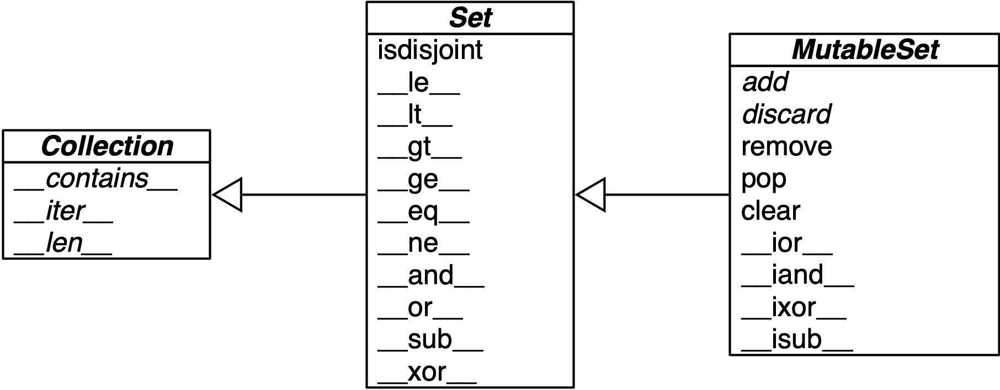

[[ch_dicts_sets]]
== Dicionários e conjuntos
:example-number: 0
:figure-number: 0

[quote, Lalo Martins, pioneiro do nomadismo digital e pythonista]
____
Python é feito basicamente de dicionários cobertos por muitas camadas de açúcar sintático
____

Usamos dicionários em todos os nossos programas Python.
Se não diretamente em nosso código, então indiretamente,
pois o tipo `dict` é um elemento fundamental da implementação de Python.
Atributos de classes e de instâncias,
espaços de nomes de módulos e argumentos nomeados de funções são alguns dos
elementos fundamentais de Python representados na memória por dicionários.
O `+__builtins__.__dict__+` armazena todos os tipos, funções e objetos embutidos.

Por seu papel crucial, os dicts de Python são extremamente otimizados—e continuam recebendo melhorias.
As _tabelas de hash_((("hash tables"))) são o motor por trás do alto desempenho dos dicts de Python.

Outros tipos embutidos baseados em tabelas de hash são `set` e `frozenset`.
Eles oferecem uma API mais completa e operadores mais robustos que
os conjuntos que você pode ter encontrado em outras linguagens populares.
Em especial, os conjuntos de Python implementam todas as operações fundamentais da teoria dos conjuntos,
como união, interseção, testes de subconjuntos, etc.
Com eles, podemos expressar algoritmos de forma mais declarativa,
evitando o excesso de loops e condicionais aninhados.

Aqui está um breve esquema do capítulo:

* A sintaxe moderna((("dictionaries and sets", "topics covered"))) para criar e manipular `dicts`
e mapeamentos, incluindo desempacotamento aumentado e _pattern matching_ (casamento de padrões)
* Métodos comuns dos tipos de mapeamentos
* Tratamento especial para chaves ausentes
* Variantes de `dict` na biblioteca padrão
* Os tipos `set` e `frozenset`
* As implicações das tabelas de hash no comportamento de conjuntos e dicionários.

=== Novidades neste capítulo

A((("dictionaries and sets", "significant changes to"))) maior parte das mudanças nessa
segunda edição se concentra em novos recursos relacionados a tipos de mapeamento:

* A <<modern_dict_syntax_sec>> fala da sintaxe aperfeiçoada de desempacotamento
e de diferentes maneiras de mesclar mapeamentos—incluindo os operadores `|` e `|=`, suportados pelos `dicts` desde o Python 3.9.
* A <<pattern_matching_mappings_sec>> ilustra o manuseio de mapeamentos com `match/case`, recurso que surgiu no Python 3.10.
* A <<ordereddict_sec>> agora se concentra nas pequenas, mas ainda relevantes, diferenças entre
`dict` e `OrderedDict`—levando em conta que, desde o Python 3.6, `dict` passou a manter a ordem de inserção das chaves.
* Novas seções sobre os objetos view devolvidos por `dict.keys`, `dict.items`, e `dict.values`:
a <<dictionary_views_sec>> e a <<set_ops_dict_views_sec>>.

A implementação interna de `dict` e `set` ainda está alicerçada em tabelas de hash,
mas o código de `dict` teve duas otimizações importantes,
que economizam memória e preservam a ordem de inserção das chaves.
A <<conseq_dict_internal_sec>> e a <<consequences_set_sec>>
resumem o que você precisa saber sobre isso para usar bem essas estruturas.

[NOTE]
====
Após((("dictionaries and sets", "internals of"))) acrescentar mais de 200 páginas a essa segunda edição, transferi a seção opcional
"Internals of sets and dicts" (_As entranhas dos sets e dos dicts_)
para o http://fluentpython.com, o site que complementa o livro.
Atualizei e expandi «um texto de 18 páginas» [.small]#&#91;fpy.li/hashint&#93;# com diagramas e explicações sobre:

* O algoritmo de tabela de hash, começando por seu uso em `set`, que é mais simples de entender.
* A otimização de memória que preserva a ordem de inserção de chaves em objetos `dict` (desde o Python 3.6) .
* O layout do compartilhamento de chaves em dicionários que mantêm atributos de
instância, o `+__dict__+` de objetos definidos pelo usuário (otimização implementada no Python 3.3).
====

[[modern_dict_syntax_sec]]
=== A sintaxe moderna dos dicts

As((("dictionaries and sets", "modern dict syntax", id="DASsyntax03"))) próximas seções descrevem
os recursos avançados de sintaxe para criação, desempacotamento e processamento de mapeamentos.
Alguns desses recursos não são novos na linguagem, mas podem ser novidade para você.
Outros requerem Python 3.9 (como o operador `|`) ou Python 3.10 (como `match/case`).
Vamos começar por um dos melhores e mais antigos desses recursos.

[[dictcomp_sec]]
==== Compreensões de dict

Desde((("dictcomps (dict comprehensions)"))) Python 2.7, a sintaxe das listcomps e genexps foi adaptada para compreensões de `dict`
(e também compreensões de `set`, que veremos em breve).
Uma _dictcomp_ (compreensão de dict) cria uma instância de `dict`, recebendo pares `key:value` de qualquer iterável.
O <<example3-1>> mostra o uso de compreensões de `dict` para criar dois dicionários a partir de uma mesma lista de tuplas.

[[example3-1]]
.Exemplos de compreensões de `dict`
====
[source, python]
----
>>> dial_codes = [                                                  # <1>
...     (880, 'Bangladesh'),
...     (55,  'Brazil'),
...     (86,  'China'),
...     (91,  'India'),
...     (62,  'Indonesia'),
...     (81,  'Japan'),
...     (234, 'Nigeria'),
...     (92,  'Pakistan'),
...     (7,   'Russia'),
...     (1,   'United States'),
... ]
>>> country_dial = {country: code for code, country in dial_codes}  # <2>
>>> country_dial
{'Bangladesh': 880, 'Brazil': 55, 'China': 86, 'India': 91,
 'Indonesia': 62, 'Japan': 81, 'Nigeria': 234, 'Pakistan': 92,
 'Russia': 7, 'United States': 1}
>>> {code: country.upper() for country, code                        # <3>
...     in sorted(country_dial.items())
...     if code < 70}
{55: 'BRAZIL', 62: 'INDONESIA', 7: 'RUSSIA', 1: 'UNITED STATES'}
----
====
<1> Um iterável de pares chave-valor como `dial_codes` pode ser passado diretamente para o construtor de `dict`, mas...
<2> ...aqui permutamos os pares: `country` é a chave, e `code` é o valor.
<3> Ordenando `country_dial` por nome, revertendo novamente os pares, colocando os valores em maiúsculas e filtrando os itens com `code < 70`.

Se você já usa listcomps, as dictcomps são um próximo passo natural.
Caso contrário, a propagação da sintaxe de compreensão mostra que agora é mais valioso que nunca se tornar fluente nessa técnica.

[[dict_unpacking_sec]]
==== Desempacotando mapeamentos

A «_PEP 448—Additional Unpacking Generalizations_ (Generalizações de desempacotamento adicionais)» [.small]#&#91;fpy.li/pep448&#93;#
melhorou o suporte ao desempacotamento de mapeamentos((("unpacking", "mapping unpackings")))((("mappings", "unpacking")))
de duas formas, desde o Python 3.5.

Primeiro, podemos((("&#x002A;&#x002A; (double star) operator")))((("double star (&#x002A;&#x002A;) operator")))
aplicar `**` a mais de um argumento em uma chamada de função.
Isso funciona quando todas as chaves são strings e únicas,
para todos os argumentos (porque argumentos nomeados duplicados são proibidos):

[source, python]
----
>>> def dump(**kwargs):
...     return kwargs
...
>>> dump(**{'x': 1}, y=2, **{'z': 3})
{'x': 1, 'y': 2, 'z': 3}
----

Em segundo lugar, `**` pode ser usado dentro de um literal `dict`—também múltiplas vezes:

[source, python]
----
>>> {'a': 0, **{'x': 1}, 'y': 2, **{'z': 3, 'x': 4}}
{'a': 0, 'x': 4, 'y': 2, 'z': 3}
----

Nesse caso, chaves duplicadas são permitidas.
Cada ocorrência sobrescreve ocorrências anteriores—observe o valor mapeado para `x` no exemplo.

Essa sintaxe também pode ser usada para mesclar mapas, mas isso pode ser feito de outras formas.
Siga comigo.

==== Fundindo mapeamentos com |

Desde a versão 3.9, Python((("mappings",
"merging")))((("&#x01C0; (pipe) operator")))((("pipe (&#x01C0;) operator")))((("&#x01C0;&#x3D; (pipe equals) operator")))((("pipe equals (&#x01C0;&#x3D;) operator")))
suporta o uso de `|` e `|=` para mesclar mapeamentos.
Isso faz todo sentido,
já que estes são também os operadores de união de conjuntos.

O operador `|` cria um novo mapeamento:

[source, python]
----
>>> d1 = {'a': 1, 'b': 3}
>>> d2 = {'a': 2, 'b': 4, 'c': 6}
>>> d1 | d2
{'a': 2, 'b': 4, 'c': 6}
----

Normalmente, o tipo do novo mapeamento será o mesmo do operando da esquerda—no exemplo,
`d1`—mas ele pode ser do tipo do segundo operando se tipos definidos pelo usuário estiverem envolvidos na operação,
dependendo das regras de sobrecarga de operadores,
que veremos no «Capítulo 16» [.small]#&#91;vol.2, fpy.li/16&#93;#.

Para atualizar mapeamentos existentes internamente, use `|=`.
Retomando o exemplo anterior, ali `d1` não foi modificado.
Mas aqui sim:

[source, python]
----
>>> d1
{'a': 1, 'b': 3}
>>> d1 |= d2
>>> d1
{'a': 2, 'b': 4, 'c': 6}
----

[TIP]
====
Se você precisa manter código rodando no Python 3.8 ou anterior, a seção
«_Motivation_» [.small]#&#91;fpy.li/3-1&#93;# da
«_PEP 584—Add Union Operators To dict_ (Acrescentar operadores de união a dict)» [.small]#&#91;fpy.li/pep584&#93;#
tem um bom resumo das outras formas de mesclar mapeamentos.
====

Agora vamos ver como o pattern matching se aplica aos mapeamentos.((("", startref="DASsyntax03")))

[[pattern_matching_mappings_sec]]
=== Pattern matching com mapeamentos

A((("pattern matching", "with mappings", secondary-sortas="mappings",
id="PMmap03")))((("mappings", "pattern matching with",
id="Mpattern03")))((("match/case statement")))((("dictionaries and sets", "pattern matching with mappings",
id="DASmap03")))
instrução `match/case` suporta sujeitos que sejam objetos de mapeamento.
Padrões para mapeamentos se parecem com literais `dict`,
mas podem casar com instâncias de qualquer subclasse real ou virtual de `collections.abc.Mapping`.footnote:[Uma
subclasse virtual é
qualquer classe registrada com uma chamada ao método `.register()` de uma ABC,
como explicado na «Seção 13.5.6» [vol.2, fpy.li/25&#93;.
Um tipo implementado através da API Python/C também serve, se tiver um bit de marcação específico setado no header.
Veja `Py_TPFLAGS_MAPPING` [fpy.li/2z&#93;]

Vimos apenas padrões com sequências no <<ch_sequences>>,
mas tipos diferentes de padrões podem ser combinados e aninhados.
Graças à desestruturação, o pattern matching é uma ferramenta poderosa para
processar registros estruturados como sequências e mapeamentos aninhados,
que frequentemente recebemos de APIs JSON ou bancos de dados
que suportam registros semi-estruturados,
como o MongoDB, o EdgeDB, ou o PostgreSQL.
O <<dict_match_ex>> demonstra isso.

As dicas de tipo simples em `get_creators` tornam claro que ela recebe um `dict` e devolve uma `list`.

[[dict_match_ex]]
.creator.py: `get_creators()` extrai o nome dos criadores em registros de mídia
====
[source, python]
----
include::../code/03-dict-set/py3.10/creator.py[tags=DICT_MATCH]
----
====
[role="pagebreak-before less_space"]
<1> Casa com qualquer mapeamento na forma `'type': 'book', 'api' :2`, e uma chave `'authors'`
mapeada para uma sequência.
Devolve os itens da sequência, como uma nova `list`.
<2> Casa com qualquer mapeamento na forma `'type': 'book', 'api' :1`, e uma chave `'author'`
mapeada para qualquer objeto.
Devolve aquele objeto dentro de uma `list`.
<3> Qualquer outro mapeamento na forma `'type': 'book'` é inválido e gera um `ValueError`.
<4> Casa qualquer mapeamento na forma `'type': 'movie'` e uma chave `'director'`
mapeada para um único objeto.
Devolve o objeto dentro de uma `list`.
<5> Qualquer outro sujeito é inválido e gera um `ValueError`.

O <<dict_match_ex>> mostra algumas práticas úteis para lidar com dados semi-estruturados, como registros JSON:

* Incluir um campo descrevendo o tipo de registro (por exemplo, `'type': 'movie'`)
* Incluir um campo identificando a versão do schema (por exemplo, `'api': 2'`),
para permitir evoluções futuras das APIs públicas.
* Ter cláusulas `case` para processar registros inválidos de um tipo específico (por exemplo, `'book'`),
bem como um `case` final para capturar tudo que tenha passado pelas condições anteriores.

Agora vamos ver como `get_creators` se comporta com alguns doctests concretos:

[source, python]
----
include::../code/03-dict-set/py3.10/creator.py[tags=DICT_MATCH_TEST]
----

Observe que a ordem das chaves nos padrões é irrelevante, mesmo se o sujeito for um `OrderedDict` como `b2`.

Diferente de patterns de sequência, patterns de mapeamento funcionam com matches parciais.
Nos doctests, os sujeitos `b1` e `b2` incluem uma chave `'title'`,
que não aparece em nenhum padrão `'book'`, mas mesmo assim casam.

Não há necessidade de usar `+**extra+` para casar pares chave-valor adicionais,
mas se você quiser capturá-los como um `dict`, pode prefixar uma variável com `**`.
Ela precisa ser a última do padrão, e `+**_+` é proibido, pois seria redundante.
Um exemplo simples:

[source, python]
----
>>> food = dict(category='ice cream', flavor='vanilla', cost=199)
>>> match food:
...     case {'category': 'ice cream', **details}:
...         print(f'Ice cream details: {details}')
...
Ice cream details: {'flavor': 'vanilla', 'cost': 199}
----

Na <<mappings_flexible_sec>>, vamos estudar o `defaultdict` e
outros mapeamentos onde buscas com chaves via `+__getitem__+`
(isto é, `d[chave]`) funcionam porque itens ausentes são criados na hora.
No contexto do pattern matching,
um match é bem sucedido apenas se o sujeito já tem as chaves necessárias no início do bloco `match`.

[TIP]
====
O tratamento automático de chaves ausentes não é acionado porque
o pattern matching sempre usa o método `d.get(key, sentinel)`—onde o
`sentinel` default é um marcador com valor especial, que não pode aparecer nos dados do usuário.
====

Vistas a sintaxe e a estrutura, vamos estudar a API dos mapeamentos.((("",
startref="PMmap03")))((("", startref="Mpattern03")))((("", startref="DASmap03")))

=== A API padrão dos tipos de mapeamentos

O((("dictionaries and sets", "standard API of mapping types", id="DASapi03")))((("mappings",
"standard API of mapping types", id="Mapi03")))((("collections.abc module",
"Mapping and MutableMapping ABCs")))((("MutableMapping ABC")))
módulo `collections.abc` contém as ABCs `Mapping` e `MutableMapping`,
descrevendo as interfaces de `dict` e de tipos similares.
Veja a <<mapping_uml>>.((("UML class diagrams", "simplified for MutableMapping and superclasses")))
A maior utilidade dessas ABCs é documentar e formalizar as interfaces padrão para os mapeamentos,
e servir de critério para testes com `isinstance` em código que precise suportar mapeamentos de forma geral:

[source, python]
----
>>> my_dict = {}
>>> isinstance(my_dict, abc.Mapping)
True
>>> isinstance(my_dict, abc.MutableMapping)
True
----

[TIP]
====
Usar `isinstance` com uma ABC é muitas vezes melhor que checar se um argumento de função
é do tipo concreto `dict`, porque daí tipos alternativos de mapeamentos podem ser usados.
Vamos discutir isso em detalhes no «Capítulo 13» [.small]#&#91;vol.2, fpy.li/13&#93;#.
====

[[mapping_uml]]
.Diagrama de classe simplificado para `MutableMapping` e suas superclasses de `collections.abc` (as setas de herança apontam das subclasses para as superclasses; nomes em itálico indicam classes e métodos abstratos
image::../images/flpy_0301.png[Diagrama de classes UML para `Mapping` e `MutableMapping`]

Para implementar um mapeamento customizado, é mais fácil estender `collections.UserDict`,
ou envolver um `dict` por composição, ao invés de criar uma subclasse dessas ABCs.
A classe `collections.UserDict` e todas as classes concretas de mapeamentos da biblioteca padrão
encapsulam o `dict` básico em suas implementações, que por sua vez é criado sobre uma tabela de hash.
Assim, todas elas compartilham a mesma limitação:
as((("keys", "hashability"))) chaves precisam ser _hashable_
(os valores não precisam ser _hashable_, só as chaves).
Se você precisa de uma recapitulação, a próxima seção explica isso.

<<<

[[what_is_hashable_sec]]
==== O que é hashable?

Aqui((("hashable, definition of"))) está parte da definição da palavra _hashable_,
adaptada do «Glossário de Python» [.small]#&#91;fpy.li/32&#93;#:

[quote]
____
Um objeto é _hashable_ se tem um código de hash que nunca muda durante seu ciclo de vida
(precisa ter um método `+__hash__+`) e pode ser comparado com outros objetos
(precisa ter um método `+__eq__+`).
Objetos _hashable_ que são comparados como iguais devem ter o mesmo código de hash.footnote:[O
verbete para "hashable" no
«_Glossário_ de Python» [.small]#&#91;fpy.li/32&#93;#
usa o termo "valor de hash" em vez de((("hash code, versus hash value"))) _código de hash_.
Prefiro _código de hash_ porque "valor" é um conceito frequentemente usado no contexto de mapeamentos,
onde itens são compostos de chaves e valores.
Então pode ser confuso se referir ao código de hash como um valor.
Nesse livro usarei apenas _código de hash_.]
____

Tipos numéricos((("numeric types", "hashability of"))) e os tipos planos imutáveis `str` e `bytes` são todos _hashable_.
Tipos contêineres são _hashable_ se forem imutáveis e se todos os objetos por eles contidos forem também _hashable_.
Um `frozenset` é sempre _hashable_, pois todos os elementos que ele contém são _hashable_, por definição.
Uma `tuple` é _hashable_ apenas se todos os seus itens também forem.
Observe as tuplas `tt`, `tl`, e `tf`:

[source, python]
----
>>> tt = (1, 2, (30, 40))
>>> hash(tt)
8027212646858338501
>>> tl = (1, 2, [30, 40])
>>> hash(tl)
Traceback (most recent call last):
  File "<stdin>", line 1, in <module>
TypeError: unhashable type: 'list'
>>> tf = (1, 2, frozenset([30, 40]))
>>> hash(tf)
-4118419923444501110
----

O código de hash de um objeto pode ser diferente dependendo da versão de Python, da arquitetura da máquina,
e pelo((("salt"))) _sal_ acrescentado ao cálculo do hash por razões de segurança.footnote:[Veja a
«_PEP 456—Secure and interchangeable hash algorithm_ (Algoritmo de hash seguro e intercambiável) [fpy.li/pep456&#93;
para saber mais sobre as implicações de segurança e as soluções adotadas.]
O código de hash de um objeto corretamente implementado tem a garantia de ser constante apenas dentro de um processo Python.

Tipos definidos pelo usuário são _hashable_ por default, pois seu código de hash é seu `id()`, e o método `+__eq__()+`
herdado da classe `object` apenas compara os IDs dos objetos.
Se um objeto implementar seu próprio `+__eq__()+`, que leve em consideração seu estado interno,
ele será _hashable_ apenas se seu `+__hash__()+` sempre devolver o mesmo código de hash.
Na prática, isso exige que `+__eq__()+` e `+__hash__()+` levem em conta apenas
atributos de instância que nunca mudem durante a vida do objeto.

Vamos agora revisar a API dos tipos de mapeamento mais comumente usados no Python: `dict`, `defaultdict`, e `OrderedDict`.

==== Revisão dos métodos mais comuns dos mapeamentos

A((("defaultdict")))((("OrderedDict")))((("collections.abc module", "defaultdict and OrderedDict")))
API básica para mapeamentos é bem completa.
A <<mapping_methods_tbl>> mostra os métodos implementados por `dict` e pelas variantes mais usadas:
`defaultdict` e `OrderedDict`, ambas classes definidas no módulo `collections`.

[role="pagebreak-before less_space"]
[[mapping_methods_tbl]]
.Métodos de `dict`, `collections.defaultdict`, e `collections.OrderedDict` (métodos comuns de `object` omitidos por concisão); argumentos opcionais então entre `[…]`
[options="header", cols="8,^2,^3,^4,14"]
|===========================================================================================================================================================================================================================================================================
|                             |dict  |default dict  |Ordered Dict  | &#xa0;
|                 `d.clear()` |  ●   |      ●      |      ●      | Remove todos os itens.
|         `+d.__contains__(k)+` |  ●   |      ●      |      ●      | `k in d`
|                  `d.copy()` |  ●   |      ●      |      ●      | Cópia rasa
|              `+d.__copy__()+` |      |      ●      |             | Suporte a `copy.copy(d)`.
|         `d.default_factory` |      |      ●      |             | Invocável que `+__missing__+` utiliza para criar valores ausentesfootnote:[`default_factory` não é um método, mas um atributo invocável definido pelo usuário quando um `defaultdict` é instanciado.]
|          `+d.__delitem__(k)+` |  ●   |      ●      |      ●      | `del d[k]`—remove item com chave `k`
| `d.fromkeys(it, [initial])` |  ●   |      ●      |      ●      | Novo mapeamento com chaves no iterável `it`, com um valor inicial opcional (o default é `None`)
|       `d.get(k, [default])` |  ●   |      ●      |      ●      | Obtém item com chave `k`, devolve `default` ou `None` se `k` não existir
|          `+d.__getitem__(k)+` |  ●   |      ●      |      ●      | ++d[k]++—obtém item com chave `k`
|                 `d.items()` |  ●   |      ●      |      ●      | Obtém uma _view_ dos itens—pares `(chave, valor)`
|              `+d.__iter__()+` |  ●   |      ●      |      ●      | Obtém iterador das chaves
|                  `d.keys()` |  ●   |      ●      |      ●      | Obtém _view_ das chaves
|               `+d.__len__()+` |  ●   |      ●      |      ●      | `len(d)`—quantidade de itens
|          `+d.__missing__(k)+` |      |      ●      |             | Chamado quando `+__getitem__+` não consegue encontrar a chave
|  `d.move_to_end(k, [last])` |      |             |      ●      | Move `k` para a primeira ou última posição (`last` é `True` por default).
|           `+d.__or__(other)+` |  ●   |      ●      |      ●      | Suporte a `d1 \| d2` para criar um novo `dict`, fundindo `d1` e `d2` (Python ≥ 3.9)
|          `+d.__ior__(other)+` |  ●   |      ●      |      ●      | Suporte a `d1 \|= d2` para atualizar `d1` com `d2` (Python ≥ 3.9)
|       `d.pop(k, [default])` |  ●   |      ●      |      ●      | Remove e devolve valor em `k`, ou `default` ou `None`, se `k` não existir
|               `d.popitem()` |  ●   |      ●      |      ●      | Remove e devolve, na forma `(chave, valor)`, o último item inseridofootnote:[`OrderedDict.popitem(last=False)` remove o primeiro item inserido (FIFO). O argumento nomeado `last` não é suportado por `dict` ou `defaultdict`, pelo menos até Python 3.10b3.]
|          `+d.__reversed__()+` |  ●   |      ●      |      ●      | Suporte a `reverse(d)`—devolve um iterador de chaves, da última para a primeira a serem inseridas
|          `+d.__ror__(other)+` |  ●   |      ●      |      ●      | Suporte a `other \| dd`—operador de união reverso (Python ≥ 3.9)footnote:[Operadores reversos são tratados no «Capítulo 16» [.small]#&#91;vol.2, fpy.li/16&#93;.&#93;#]
|`d.setdefault(k, [default])` |  ●   |      ●      |      ●      | Se `k in d`, devolve `d[k]`; senão, atribui `d[k] = default` e devolve isso
|       `+d.__setitem__(k, v)+` |  ●   |      ●      |      ●      | `d[k] = v`—coloca `v` em `k`
|   `d.update(m, [**kwargs])` |  ●   |      ●      |      ●      | Atualiza `d` com itens de um mapeamento ou iterável de pares `(chave, valor)`
|                `d.values()` |  ●   |      ●      |      ●      | Obtém uma _view_ dos valores
|===========================================================================================================================================================================================================================================================================

A forma como `d.update(m)` lida com seu primeiro argumento, `m`,
é um excelente exemplo((("duck typing"))) de _duck typing_ (_tipagem pato_):
ele primeiro verifica se `m` tem um método `keys` e, em caso afirmativo,
assume que `m` é um mapeamento.
Caso contrário, `update()` reverte para uma iteração sobre `m`,
presumindo que seus itens são pares `(chave, valor)`.
O construtor da maioria dos mapeamentos de Python usa internamente a lógica de `update()`,
o que quer dizer que eles podem ser inicializados por outros mapeamentos
ou a partir de qualquer objeto iterável que produza pares `(chave, valor)`.

Um método sutil dos mapeamentos é `setdefault()`.
Ele evita buscas redundantes de chaves quando precisamos atualizar o valor em um item no mesmo lugar.
A próxima seção mostra como ele pode ser usado.

==== Inserindo ou atualizando valores mutáveis

Alinhada((("fail-fast philosophy")))((("defensive programming")))((("mutable values, inserting or updating", id="MVinsert03")))
à filosofia de _falhar rápido_ de Python, a consulta a um `dict` com `d[k]` gera um erro quando `k` não é uma chave existente.
Pythonistas sabem que `d.get(k, default)` é uma alternativa a `d[k]` quando receber um valor default é
mais conveniente que tratar um `KeyError`.
Entretanto, se você está buscando um valor mutável e quer atualizá-lo, há um jeito melhor.

Considere um script para indexar texto, produzindo um mapeamento no qual cada chave é uma palavra,
e o valor é uma lista das posições onde aquela palavra ocorre, como mostrado no <<index0_output_ex>>.

[[index0_output_ex]]
.Saída parcial do <<index0_ex>> processando o texto "Zen of Python"; cada linha mostra uma palavra e uma lista de ocorrências na forma de pares `(line_number, column_number)` (número da linha, número da coluna).
====
[source]
----
$ python3 index0.py zen.txt
a [(19, 48), (20, 53)]
Although [(11, 1), (16, 1), (18, 1)]
ambiguity [(14, 16)]
and [(15, 23)]
are [(21, 12)]
aren [(10, 15)]
at [(16, 38)]
bad [(19, 50)]
be [(15, 14), (16, 27), (20, 50)]
beats [(11, 23)]
Beautiful [(3, 1)]
better [(3, 14), (4, 13), (5, 11), (6, 12), (7, 9), (8, 11), (17, 8), (18, 25)]
----
====

O <<index0_ex>> é um script aquém do ideal, para mostrar um caso em que `dict.get`
não é a melhor maneira de lidar com uma chave ausente.
Ele foi adaptado de um exemplo de Alex Martelli.footnote:[O script original aparece no slide 41 da
apresentação de Martelli, «"Re-learning Python" (_Reaprendendo Python_)» [.small]#&#91;fpy.li/3-5&#93;#.
O script é, na verdade, uma demonstração de `dict.setdefault`, como visto no nosso <<index_ex>>.]

[[index0_ex]]
.index0.py usa `dict.get` para obter e atualizar uma lista de ocorrências de palavras de um índice (uma solução melhor é apresentada no <<index_ex>>)
====
[source, python]
----
include::../code/03-dict-set/index0.py[tags=INDEX0]
----
====
<1> Obtém a lista de ocorrências de `word`, ou `[]` se a palavra não for encontrada.
<2> Acrescenta uma nova localização a `occurrences`.
<3> Coloca a `occurrences` modificada no dict `index`; isso exige uma segunda busca em `index`.
<4> Não estou chamando `str.upper` no argumento `key=` de `sorted`, apenas passando uma referência àquele método,
para que a função `sorted` possa usá-lo para normalizar as palavras antes de ordená-las.footnote:[Isso
é um exemplo do uso de um método como uma função de primeira classe, o assunto do <<ch_func_objects>>.]

As três linhas tratando de `occurrences` no <<index0_ex>> podem ser substituídas por uma linha
usando `dict.setdefault`. O <<index_ex>> fica mais próximo do código apresentado por Alex Martelli.

[[index_ex]]
.index.py usa `dict.setdefault` para obter e atualizar uma lista de ocorrências de uma palavra em uma linha de código; compare com o <<index0_ex>>
====
[source, python]
----
include::../code/03-dict-set/index.py[tags=INDEX]
----
====
<1> Obtém a lista de ocorrências de `word`, ou a define como `[]`, se não for encontrada;
`setdefault` devolve o valor, então ele pode ser atualizado sem uma segunda busca.

Em outras palavras, o resultado final desta linha...

[source, python]
----
my_dict.setdefault(key, []).append(new_value)
----

...é o mesmo que executar...

[source, python]
----
if key not in my_dict:
    my_dict[key] = []
my_dict[key].append(new_value)
----

...exceto que este último trecho de código executa pelo menos duas buscas por `key`—três se
a chave não for encontrada—enquanto `setdefault` faz tudo isso com uma única busca.

Uma questão relacionada, o tratamento de chaves ausentes em qualquer busca (e não apenas para inserção de valores),
é o assunto da próxima seção.((("", startref="MVinsert03")))((("", startref="Mapi03")))((("", startref="DASapi03")))

[[mappings_flexible_sec]]
=== Tratamento automático de chaves ausentes

Algumas vezes((("dictionaries and sets", "automatic handling of missing keys", id="DASmissing03")))((("keys",
"automatic handling of missing", id="Kauto03")))((("mappings", "automatic handling of missing keys", id="Mauto03")))
é conveniente que os mapeamentos devolvam algum valor padronizado quando se busca por uma chave ausente.
Há duas abordagens principais para esse fim: uma é usar um `defaultdict` em vez de um `dict` simples.
A outra é criar uma subclasse de `dict` ou de qualquer outro tipo de mapeamento e acrescentar um método `+__missing__+`.
Vamos ver as duas soluções a seguir.

[[defaultdict_sec]]
==== defaultdict: outra perspectiva sobre as chaves ausentes

Uma instância de `collections.defaultdict`((("defaultdict"))) cria itens com um valor default sob demanda,
sempre que uma chave ausente é buscada usando a sintaxe `d[k]`.
O <<index_default_ex>> usa `defaultdict` para fornecer outra solução elegante para o índice de palavras do  <<index_ex>>.

Funciona assim: ao instanciar um `defaultdict`,
você fornece um invocável que produz um valor default sempre que `+__getitem__+` recebe uma chave inexistente como argumento.

Por exemplo, dado um `defaultdict` criado por `dd = defaultdict(list)`,
se `'new-key'` não estiver em `dd`, a expressão `dd['new-key']` segue os seguintes passos:

. Chama `list()` para criar uma nova lista.
. Insere a lista em `dd` usando `'new-key'` como chave.
. Devolve uma referência para aquela lista.

O invocável que produz os valores default é mantido em um atributo de instância chamado `default_factory`.

[[index_default_ex]]
.index_default.py: usando um `defaultdict` em vez do método `setdefault`
====
[source, python]
----
include::../code/03-dict-set/index_default.py[tags=INDEX_DEFAULT]
----
====
<1> Cria um `defaultdict` com o construtor de  `list` como `default_factory`.
<2> Se `word` não está inicialmente no `index`, o `default_factory` é chamado para
produzir o valor ausente, que neste caso é uma `list` vazia,
que então é atribuída a `index[word]` e devolvida, de forma que a operação
`.append(location)` é sempre bem sucedida.

Se nenhum `default_factory` é fornecido, chaves ausentes geram `KeyError`, como esperado.

<<<
[WARNING]
====
O `default_factory` de um `defaultdict` só é invocado para fornecer valores default para chamadas a `+__getitem__+`,
não para outros métodos.
Por exemplo, se `dd` é um `defaultdict` e `k` uma chave ausente, `dd[k]` chamará `default_factory`
para criar um valor default,
mas `dd.get(k)` vai devolver `None`, e `k in dd` resulta `False`.
====

O mecanismo que faz `defaultdict` funcionar, chamando `default_factory`,
é o método especial `+__missing__+`, apresentado a seguir.

[[missing_method]]
==== O método `+__missing__+`

Por((("&#x005F;&#x005F;missing&#x005F;&#x005F;", id="missing03"))) trás da forma como os mapeamentos
lidam com chaves ausentes está o método muito apropriadamente chamado `+__missing__+`.footnote:[NT:
"Missing" significa ausente, faltando.]
Esse método não é definido na classe base `dict`, mas `dict` está ciente de sua possibilidade:
se você criar uma subclasse de `dict` e incluir um método `+__missing__+`, o `+dict.__getitem__+`
padrão vai chamar seu método sempre que uma chave não for encontrada, em vez de gerar um `KeyError`.

Suponha que você queira um mapeamento onde as chaves são convertidas para `str` quando são procuradas.
Um caso de uso concreto seria uma biblioteca para dispositivos IoT
(Internet of Things, _Internet das Coisas_)footnote:[Uma biblioteca dessas é a
«_Pingo.io_» [.small]#&#91;fpy.li/3-6&#93;#, que não está mais em desenvolvimento ativo.],
onde uma placa programável com portas genéricas programáveis (por exemplo, uma Raspberry Pi ou uma Arduino)
é representada por uma classe "Placa" com um atributo `minha_placa.portas`,
que é um mapeamento dos identificadores das portas físicas para objetos de software portas.
O identificador da porta física pode ser um número ou uma string como `"A0"` ou `"P9_12"`.
Por consistência, é desejável que todas as chaves em `placa.portas` sejam strings,
mas também é conveniente buscar uma porta por número, como em `meu-arduino.porta[13]`,
para evitar que iniciantes tropecem quando quiserem fazer piscar o LED na porta 13 de seus Arduinos.
O <<ex_strkeydict0_tests>> mostra como tal mapeamento funcionaria.

<<<
[[ex_strkeydict0_tests]]
.Ao buscar por uma chave não-string, `StrKeyDict0` a converte para `str` quando ela não é encontrada
====
[source, python]
----
include::../code/03-dict-set/strkeydict0.py[tags=STRKEYDICT0_TESTS]
----
====

O <<ex_strkeydict0>> implementa a classe `StrKeyDict0`, que passa nos doctests acima.

[TIP]
====
Uma forma melhor de criar um mapeamento definido pelo usuário é criar uma subclasse de
`collections.UserDict` em vez de `dict` (como faremos no <<ex_strkeydict>>).
Aqui criamos uma subclasse de `dict` apenas para mostrar que `+__missing__+`
é suportado pelo método embutido `+dict.__getitem__+`.
====

[[ex_strkeydict0]]
.`StrKeyDict0` converte chaves não-string para string no momento da consulta (veja os testes no <<ex_strkeydict0_tests>>)
====
[source, python]
----
include::../code/03-dict-set/strkeydict0.py[tags=STRKEYDICT0]
----
====
<1> `StrKeyDict0` herda de `dict`.
<2> Verifica se `key` já é uma `str`. Se é, e está ausente, gera um `KeyError`.
<3> Cria uma `str` de `key` e a procura.
<4> O método `get` delega para `+__getitem__+` usando a notação `self[key]`;
isso dá oportunidade para nosso `+__missing__+` agir.
<5> Se um `KeyError` foi gerado, `+__missing__+` já falhou, então devolvemos o `default`.
<6> Procura pela chave não-modificada (a instância pode conter chaves não-`str`),
depois por uma `str` criada a partir da chave.

Considere por um momento o motivo do teste `isinstance(key, str)` ser necessário na implementação de `+__missing__+`.

Sem aquele teste, nosso método `+__missing__+` funcionaria bem com qualquer chave `k`—`str` ou não—sempre que `str(k)`
produzisse uma chave existente.
Mas se `str(k)` não for uma chave existente, teríamos uma recursão infinita.
Na última linha de `+__missing__+`, `self[str(key)]` chamaria `+__getitem__+`,
passando aquela chave `str`, e `+__getitem__+`, por sua vez, chamaria
`+__missing__+` novamente.

<<<
O((("&#x005F;&#x005F;contains&#x005F;&#x005F;"))) método `+__contains__+` também é necessário para que
o comportamento nesse exemplo seja consistente, pois a operação `k in d` o chama,
mas o método herdado de `dict` não invoca `+__missing__+` com chaves ausentes.
Há um detalhe sutil em nossa implementação de `+__contains__+`:
não verificamos a existência da chave da forma pythônica normal—`k in d`—porque `str(key) in self` chamaria
`+__contains__+` recursivamente.
Evitamos isso procurando a chave explicitamente em `self.keys()`.

Uma busca como `k in my_dict.keys()` é eficiente em Python 3 mesmo para mapeamentos muito grandes,
porque `dict.keys()` devolve uma view, que é similar a um _set_, como veremos na <<set_ops_dict_views_sec>>.
Entretanto, lembre-se que `k in my_dict` faz o mesmo trabalho,
e é mais rápido porque evita a busca nos atributos para encontrar o método `.keys`.

Eu tinha uma razão específica para usar `self.keys()` no método `+__contains__+` do
<<ex_strkeydict0>>.
A verificação da chave não-modificada `++key in self.keys()++` é necessária por correção,
pois `StrKeyDict0` não obriga todas as chaves no dicionário a serem do tipo `str`.
Nosso único objetivo com esse exemplo simples foi fazer a busca "mais amigável",
e não forçar tipos.

[WARNING]
====
Classes definidas pelo usuário derivadas de mapeamentos da biblioteca padrão podem ou não usar
`+__missing__+` como alternativa em sua implementação de `+__getitem__+`, `get`, ou `+__contains__+`,
como explicado na próxima seção.
====

[[inconsistent_missing_sec]]
==== Uso inconsistente de `+__missing__+` na biblioteca padrão

Considere os seguintes cenários, e como eles afetam a busca de chaves ausentes:

subclasse de `dict`::
    Uma subclasse de `dict` que implemente apenas `+__missing__+` e nenhum outro método.
    Nesse caso, `+__missing__+` pode ser chamado apenas em `d[k]`, que usará o `+__getitem__+` herdado de `dict`.

<<<

subclasse de `collections.UserDict`::
    Da mesma forma, uma subclasse de `UserDict` que implemente apenas `+__missing__+` e nenhum outro método.
    O método `get` herdado de `UserDict` chama `+__getitem__+`.
    Isso significa que `+__missing__+` pode ser chamado para tratar de consultas com `d[k]` e com
    `d.get(k)`.

subclasse de `abc.Mapping` com o `+__getitem__+` mais simples possível::
    Uma subclasse mínima de `abc.Mapping`, implementando `+__missing__+` e os métodos abstratos obrigatórios,
    incluindo uma implementação de `+__getitem__+` que não chama `+__missing__+`.
    O método `+__missing__+` nunca é acionado nessa classe.

subclasse de `abc.Mapping` com `+__getitem__+` chamando `+__missing__+`::
    Uma subclasse mínima de `abc.Mapping`, implementando `+__missing__+` e os métodos abstratos obrigatórios,
    incluindo uma implementação de `+__getitem__+` que chama `+__missing__+`.
    O método `+__missing__+` é acionado nessa classe para consultas por chaves ausentes feitas com
    `d[k]`, `d.get(k)`, e `k in d`.

Veja
«_missing.py_» [.small]#&#91;fpy.li/3-7&#93;#
no repositório de exemplos de código para demonstrações dos cenários descritos acima.
Estes cenários supõem implementações mínimas.
Se a sua subclasse implementa `+__getitem__+`, `get`, e `+__contains__+`,
então você pode ou não fazer tais métodos usarem `+__missing__+`, dependendo de suas necessidades.
O ponto aqui é mostrar que é preciso ter cuidado ao criar subclasses dos mapeamentos da biblioteca padrão
para usar `+__missing__+`, porque as classes base suportam comportamentos default diferentes.
Não se esqueça de que o comportamento de `setdefault` e `update` também é afetado pela consulta de chaves.
E por fim, dependendo da lógica de seu `+__missing__+`,
pode ser necessário implementar uma lógica especial em `+__setitem__+`,
para evitar inconsistências ou comportamentos surpreendentes.
Veremos um exemplo disso na <<sublcassing_userdict_sec>>.

Até aqui tratamos dos tipos de mapeamentos `dict` e `defaultdict`,
mas a biblioteca padrão traz outras implementações de mapeamentos,
que discutiremos a seguir.((("", startref="missing03")))((("", startref="Mauto03")))((("",
startref="Kauto03")))((("", startref="DASmissing03")))

=== Variações de dict

Nessa((("dictionaries and sets", "variations of dict", id="DASvardict03"))) seção, falaremos brevemente sobre
os tipos de mapeamentos incluídos na biblioteca padrão diferentes de `defaultdict`, já visto na <<defaultdict_sec>>.

[[ordereddict_sec]]
==== collections.OrderedDict

Agora((("collections.abc module", "defaultdict and OrderedDict")))((("OrderedDict"))) que o `dict` embutido
também mantém as chaves ordenadas (desde o Python 3.6),
o motivo mais comum para usar `OrderedDict` é escrever código compatível com versões anteriores de Python.
Dito isso, a documentação lista algumas diferenças entre `dict` e `OrderedDict` que
ainda persistem e que cito aqui:

* A operação de igualdade para `OrderedDict` verifica a igualdade da ordenação.
* O método `popitem()` de `OrderedDict` tem uma assinatura diferente,
que aceita um argumento opcional especificando qual item será devolvido.
* `OrderedDict` tem um método `move_to_end()`, que reposiciona um elemento para uma ponta do dicionário de forma eficiente.
* `OrderedDict` foi projetado suportar bem as operações de reordenamento.
Economia de memória e desempenho de iteração ou de operações de atualização foram preocupações secundárias.
* Um `OrderedDict` lida melhor que um `dict` com operações frequentes de reordenamento.
Isso o torna adequado para monitorar acessos recentes (em um cache LRUfootnote:[NT: Least Recently Used, _Menos Recentemente Usado_,
esquema de cache que descarta o item armazenado que esteja há mais tempo sem ser acessado.], por exemplo).

[[chainmap_sec]]
==== collections.ChainMap

Uma((("collections.abc module", "ChainMap")))((("ChainMap"))) instância de `ChainMap` mantém
uma lista de mapeamentos que podem ser consultados como se fossem um mapeamento único.
A busca é realizada em cada mapa incluído, na ordem em que eles aparecem na chamada ao construtor,
e é bem sucedida assim que a chave é encontrada em um daqueles mapeamentos.
Por exemplo:

[source, python]
----
>>> d1 = dict(a=1, b=3)
>>> d2 = dict(a=2, b=4, c=6)
>>> from collections import ChainMap
>>> chain = ChainMap(d1, d2)
>>> chain['a']
1
>>> chain['c']
6
----

<<<

A instância de `ChainMap` não cria cópias dos mapeamentos, mantém referências para eles.
Atualizações ou inserções a um `ChainMap` afetam apenas o primeiro mapeamento passado.
Continuando do exemplo anterior:

[source, python]
----
>>> chain['c'] = -1
>>> d1
{'a': 1, 'b': 3, 'c': -1}
>>> d2
{'a': 2, 'b': 4, 'c': 6}
----

Um `ChainMap` é útil na implementação de linguagens com escopos aninhados,
onde cada mapeamento representa um contexto de escopo,
desde o escopo aninhado mais interno até o mais externo.
A seção
«Objetos ChainMap» [.small]#&#91;fpy.li/33&#93;#,
na documentação de `collections`, apresenta vários exemplos
incluindo esse trecho inspirado nas regras básicas de consulta de variáveis em Python:

[source, python]
----
import builtins
pylookup = ChainMap(locals(), globals(), vars(builtins))
----

A «Seção 18.3.4» [.small]#&#91;vol.3, fpy.li/4y&#93;# explica uma subclasse de `ChainMap` usada para implementar
um interpretador parcial da linguagem de programação Scheme.

==== collections.Counter

Um((("collections.abc module", "Counter")))((("Counter"))) mapeamento que mantém uma contagem para cada chave.
Atualizar uma chave existente adiciona à sua contagem.
Isso pode ser usado para contar instâncias de objetos _hashable_ ou como um _multiset_ (conjunto múltiplo),
discutido adiante nessa seção.
`Counter` implementa os operadores `+` e `-` para combinar contagens,
e outros métodos úteis, como `most_common([n])`,
que devolve uma lista ordenada de tuplas com os _n_ itens mais comuns e suas contagens; veja a
«documentação» [.small]#&#91;fpy.li/34&#93;#.

Aqui temos um `Counter` usado para contar as letras em palavras:

[source, python]
----
>>> ct = collections.Counter('abracadabra')
>>> ct
Counter({'a': 5, 'b': 2, 'r': 2, 'c': 1, 'd': 1})
>>> ct.update('aaaaazzz')
>>> ct
Counter({'a': 10, 'z': 3, 'b': 2, 'r': 2, 'c': 1, 'd': 1})
>>> ct.most_common(3)
[('a', 10), ('z', 3), ('b', 2)]
----

Observe que as chaves `'b'` e `'r'` estão empatadas em terceiro lugar, mas
`ct.most_common(3)` mostra apenas três contagens.

Para usar `collections.Counter` como um conjunto múltiplo, trate cada chave como um elemento de um conjunto,
e a contagem será o número de ocorrências daquele elemento no conjunto.

==== shelve.Shelf

O((("shelve module")))((("pickle module")))((("keys", "persistent storage for mapping"))) módulo `shelve`
na biblioteca padrão fornece armazenamento persistente a um mapeamento de chaves
em formato string para objetos Python serializados no formato binário `pickle`.
O nome curioso, _shelve_ (prateleira), faz sentido quando lembramos que potes de picles são armazenados em
prateleiras.

A função de módulo `shelve.open` devolve uma instância de `shelve.Shelf`—um banco de dados DBM simples de chave-valor,
baseado no módulo `dbm`, com as seguintes características:

* `shelve.Shelf` é uma subclasse de `abc.MutableMapping`,
então fornece os métodos essenciais esperados de um mapeamento.
* Além disso, `shelve.Shelf` fornece alguns outros métodos de gerenciamento de E/S, como `sync` e `close`.
* Uma instância de `Shelf` é um gerenciador de contexto,
então é possível usar um bloco `with` para garantir que ela seja fechada após o uso.
* Chaves e valores são salvos sempre que um novo valor é atribuído a uma chave.
* As chaves devem ser strings.
* Os valores devem ser objetos que o módulo `pickle` consiga serializar.

A documentação para os módulos
«shelve» [.small]#&#91;fpy.li/35&#93;#,
«dbm» [.small]#&#91;fpy.li/36&#93;#, e
«pickle» [.small]#&#91;fpy.li/37&#93;#
traz mais detalhes e também algumas ressalvas.

[WARNING]
====
O `pickle` de Python é fácil de usar nos casos mais simples, mas tem vários inconvenientes.
Leia «_Pickle’s nine flaws_ (Os nove defeitos de pickle)» [.small]#&#91;fpy.li/3-13&#93;#, de Ned Batchelder,
antes de adotar qualquer solução envolvendo `pickle`.
Em seu post, Ned menciona outros formatos de serialização que podem ser alternativas melhores.
====

As classes `OrderedDict`, `ChainMap`, `Counter`, e `Shelf` podem ser usadas diretamente,
mas também podem ser customizadas por subclasses.
`UserDict`, por outro lado, foi planejada apenas como uma classe base a ser estendida.

[[sublcassing_userdict_sec]]
==== Criando subclasses de UserDict em vez de dict

É ((("collections.abc module", "UserDict", id="coluserdict03")))((("UserDict", id="userdict03")))
melhor criar um novo tipo de mapeamento estendendo `collections.UserDict` em vez de `dict`.
Percebemos isso quando tentamos estender nosso `StrKeyDict0` do <<ex_strkeydict0>>
para assegurar que qualquer chave adicionada ao mapeamento seja armazenada como `str`.

A principal razão pela qual é melhor criar uma subclasse de `UserDict` em vez de `dict` é
que o tipo embutido tem alguns atalhos de implementação,
que acabam nos obrigando a sobrescrever métodos que poderíamos apenas herdar de `UserDict`
sem maiores problemas.footnote:[O problema exato de se criar subclasses de `dict` e de outros tipos embutidos
é tratado na «Seção 14.3» [.small]#&#91;vol.2, fpy.li/4z&#93;.&#93;#.]

Observe que `UserDict` não herda de `dict`, mas usa uma composição:
a classe tem uma instância interna de `dict`, chamada `data`, que mantém os itens propriamente ditos.
Isso evita recursão indesejada quando escrevemos métodos especiais, como `+__setitem__+`,
e simplifica a programação de `+__contains__+`, quando comparado com o <<ex_strkeydict0>>.

Graças((("keys", "converting nonstring keys to str"))) a `UserDict`, o `StrKeyDict` (<<ex_strkeydict>>)
é mais conciso que o `StrKeyDict0` (<<ex_strkeydict0>>), mas ainda faz melhor:
ele armazena todas as chaves como `str`,
evitando surpresas desagradáveis se a instância for criada ou atualizada com
dados contendo chaves de outros tipos (que não string).

<<<

[[ex_strkeydict]]
.`StrKeyDict` sempre converte chaves que não sejam strings para `str` na inserção, atualização e busca
====
[source, python]
----
include::../code/03-dict-set/strkeydict.py[tags=STRKEYDICT]
----
====
<1> `StrKeyDict` estende `UserDict`.
<2> `+__missing__+` é exatamente igual ao do <<ex_strkeydict0>>.
<3> `+__contains__+` é mais simples: podemos assumir que todas as chaves armazenadas são `str`,
e podemos operar sobre `self.data` em vez de invocar `self.keys()`, como fizemos em `StrKeyDict0`.
<4> `+__setitem__+` converte qualquer `key` para uma `str`.
Este método é mais fácil de  sobrescrever quando podemos delegar para o atributo `self.data`.

Como `UserDict` estende `abc.MutableMapping`, o restante dos métodos que fazem de `StrKeyDict`
um mapeamento completo são herdados de `UserDict`, `MutableMapping`, ou `Mapping`.
Estes últimos contêm vários métodos concretos úteis, apesar de serem classes base abstratas (ABCs).
Os seguintes métodos são dignos de nota:

`MutableMapping.update`:: Esse método poderoso pode ser chamado diretamente, mas também é usado por
`+__init__+` para criar a instância a partir de outros mapeamentos, de iteráveis de pares `(chave, valor)`,
e de argumentos nomeados.
Como usa `self[chave] = valor` para adicionar itens,
ele invoca nossa implementação de `+__setitem__+`.

`Mapping.get`:: No `StrKeyDict0` (<<ex_strkeydict0>>),
precisamos codar nosso próprio `get` para devolver os mesmos resultados de `+__getitem__+`,
mas no <<ex_strkeydict>> herdamos `Mapping.get`, que é implementado exatamente como fizemos
no `StrKeyDict0.get`
(confira o «código-fonte de Python» [.small]#&#91;fpy.li/3-14&#93;#).

[TIP]
====
Antoine Pitrou escreveu a
«_PEP 455—Adding a key-transforming dictionary to collections_
(Acrescentando um dicionário com transformação de chaves a collections)»
[.small]#&#91;fpy.li/pep455&#93;#
e um patch para aperfeiçoar o módulo `collections` com uma classe `TransformDict`,
que é mais genérico que `StrKeyDict` e preserva as chaves como fornecidas antes de aplicar a transformação.
A PEP 455 foi rejeitada em maio de 2015—veja a «mensagem de rejeição» [.small]#&#91;fpy.li/3-15&#93;#
de Raymond Hettinger.
Para experimentar com a `TransformDict`,
extraí o patch de Pitrou do «issue18986» [.small]#&#91;fpy.li/3-16&#93;#
para um módulo independente («`03-dict-set/transformdict.py`» [.small]#&#91;fpy.li/3-17&#93;#
disponível no «repositório de código da segunda edição do _Fluent Python_» [.small]#&#91;fpy.li/code&#93;#).
====

Sabemos que existem tipos de sequências imutáveis, mas e mapeamentos imutáveis?
Não existe um tipo real desses na biblioteca padrão, mas um substituto está disponível.
É o que vem a seguir.((("", startref="userdict03")))((("", startref="userdict03")))((("", startref="DASvardict03")))

=== Mapeamentos imutáveis

Os((("dictionaries and sets", "immutable mappings")))((("mappings", "immutable mappings")))((("immutable mappings")))
tipos de mapeamentos disponíveis na biblioteca padrão são todos mutáveis,
mas pode ser desejável impedir que os usuários mudem um mapeamento por acidente.
Um caso de uso concreto pode ser encontrado, novamente, em uma biblioteca de programação de hardware como
a((("Pingo library"))) _Pingo_, mencionada na <<missing_method>>:
o mapeamento `board.pins` representa as portas de GPIO (General Purpose Input/Output, _Entrada/Saída Genérica_)
em um dispositivo.
Dessa forma, seria útil evitar atualizações descuidadas de `board.pins`,
pois o hardware não pode ser modificado via software:
qualquer mudança no mapeamento o tornaria inconsistente com a realidade física do dispositivo.

O módulo `types` oferece uma classe invólucro (_wrapper_) chamada `MappingProxyType` que,
dado um mapeamento, devolve uma instância de `mappingproxy`,
que é um proxy somente para leitura (mas dinâmico) do mapeamento original.
Isso significa que atualizações ao mapeamento original são refletidas no `mappingproxy`,
mas nenhuma mudança pode ser feita através desse último.
Veja uma breve demonstração no <<ex_MappingProxyType>>.

[[ex_MappingProxyType]]
.`MappingProxyType` cria uma instância somente de leitura de `mappingproxy` a partir de um `dict`
====
[source, python]
----
>>> from types import MappingProxyType
>>> d = {1: 'A'}
>>> d_proxy = MappingProxyType(d)
>>> d_proxy
mappingproxy({1: 'A'})
>>> d_proxy[1]  <1>
'A'
>>> d_proxy[2] = 'x'  <2>
Traceback (most recent call last):
  File "<stdin>", line 1, in <module>
TypeError: 'mappingproxy' object does not support item assignment
>>> d[2] = 'B'
>>> d_proxy  <3>
mappingproxy({1: 'A', 2: 'B'})
>>> d_proxy[2]
'B'
>>>
----
====
<1> Os itens em `d` podem ser vistos através de `d_proxy`.
<2> Não é possível fazer modificações através de `d_proxy`.
<3> `d_proxy` é dinâmica: qualquer mudança em `d` é refletida ali.

Isso pode ser usado assim na prática, no cenário da programação de hardware:
o construtor em uma subclasse concreta `Board` preencheria um mapeamento privado com os objetos porta,
e o exporia aos clientes da API via um atributo público `.portas`, implementado como um `mappingproxy`.
Desta forma, os clientes não poderiam acrescentar, remover ou modificar as portas por acidente.

A seguir estudaremos _views_—que permitem operações de alto desempenho em um `dict`, sem cópias desnecessárias dos dados.

[[dictionary_views_sec]]
[role="pagebreak-before less_space"]
=== Views de dicionários

Objetos `dict`((("dictionaries and sets", "dictionary views", id="DASviews03"))) implementam os métodos
`.keys()`, `.values()`, e `.items()`, que devolvem instâncias de classes chamadas
`dict_keys`, `dict_values`, e `dict_items`, respectivamente.
Essas views de dicionário são projeções somente para leitura de estruturas de dados internas
usadas na implementação de `dict`.
Elas evitam o uso de memória adicional dos métodos equivalentes no Python 2,
que construíam listas, duplicando dados já presentes no `dict`.
E também substituem os métodos antigos que devolviam iteradores.

O <<ex_dict_values>> mostra algumas operações básicas suportadas por todas as views de dicionários.

[[ex_dict_values]]
.O método `.values()` devolve uma view dos valores em um `dict`
====
[source, python]
----
>>> d = dict(a=10, b=20, c=30)
>>> values = d.values()
>>> values
dict_values([10, 20, 30])  <1>
>>> len(values)  <2>
3
>>> list(values)  <3>
[10, 20, 30]
>>> reversed(values)  <4>
<dict_reversevalueiterator object at 0x10e9e7310>
>>> values[0] <5>
Traceback (most recent call last):
  File "<stdin>", line 1, in <module>
TypeError: 'dict_values' object is not subscriptable
----
====
<1> O `repr` de um objeto view mostra seu conteúdo.
<2> Podemos consultar a `len` de uma view.
<3> Views são iteráveis, então é fácil criar listas a partir delas.
<4> Views implementam `+__reversed__+`, devolvendo um iterador customizado.
<5> Não é possível usar `[]` para obter itens individuais de uma view.

Um objeto view é um proxy dinâmico.
Se o `dict` fonte é atualizado, as mudanças podem ser vistas imediatamente através de uma view existente.
Continuando do <<ex_dict_values>>:

[source, python]
----
>>> d['z'] = 99
>>> d
{'a': 10, 'b': 20, 'c': 30, 'z': 99}
>>> values
dict_values([10, 20, 30, 99])
----

As classes `dict_keys`, `dict_values`, e `dict_items` são internas:
elas não estão disponíveis via `+__builtins__+` ou qualquer módulo da biblioteca padrão,
e mesmo que você obtenha uma referência para uma delas,
não pode usar essa referência para criar uma view do zero no seu código Python:

[source, python]
----
>>> values_class = type({}.values())
>>> v = values_class()
Traceback (most recent call last):
  File "<stdin>", line 1, in <module>
TypeError: cannot create 'dict_values' instances
----

A classe `dict_values` é a view de dicionário mais simples—ela implementa apenas os métodos especiais
`+__len__+`, `+__iter__+`, e `+__reversed__+`.
Além desses métodos, `dict_keys` e `dict_items` implementam vários métodos dos _sets_,
quase tantos quanto a classe `frozenset`.
Após vermos os conjuntos, voltaremos a estudar `dict_keys` e `dict_items`,
na <<set_ops_dict_views_sec>>.

Agora vamos ver algumas regras e dicas baseadas na forma como `dict` é
implementado debaixo dos panos.((("", startref="DASviews03")))

[[conseq_dict_internal_sec]]
=== Consequências da implementação de dicts

A((("dictionaries and sets", "consequences of how dict works"))) implementação da tabela de hash do
`dict` de Python é muito eficiente, mas é importante entender os efeitos práticos desse design:

* Chaves((("keys", "practical consequences of using dict"))) devem ser objetos _hashable_.
Eles devem implementar métodos `+__hash__+` e `+__eq__+` apropriados, como descrito na <<what_is_hashable_sec>>.
* O acesso aos itens através da chave é muito rápido.
Mesmo que um `dict` tenha milhões de chaves, Python pode localizar uma chave diretamente,
computando o código hash da chave e derivando um deslocamento do índice na tabela de hash,
com um possível ônus de um pequeno número de tentativas até encontrar a entrada correspondente.
* A ordenação das chaves é preservada,
como efeito colateral de um layout de memória mais compacto para `dict` no CPython 3.6,
que se tornou um recurso oficial da linguagem no 3.7.
* Apesar de seu novo layout compacto, os dicts apresentam, inevitavelmente,
um uso adicional significativo de memória.
A estrutura de dados interna mais compacta para um contêiner seria um array de ponteiros para os
itens.footnote:[É assim que as tuplas são armazenadas.]
Comparado a isso, uma tabela de hash precisa armazenar mais dados para cada entrada e, para manter a eficiência,
Python precisa manter pelo menos um terço das linhas da tabela de hash vazias.
* Para economizar memória, evite criar atributos de instância fora do método `+__init__+`.

Essa última dica, sobre atributos de instância, é consequência do comportamento default de Python,
de armazenar atributos de instância em um atributo `+__dict__+` especial,
que é um `dict` vinculado a cada instância.footnote:[A menos que a classe tenha um atributo `+__slots__+`,
como explicado na «Seção 11.11» &#91;vol.2, fpy.li/52&#93;.]
Desde a implementação da
«_PEP 412—Key-Sharing Dictionary_ (Dicionário com chaves compartilhadas)» [.small]#&#91;fpy.li/pep412&#93;#,
no Python 3.3, instâncias de uma classe podem compartilhar uma tabela de hash comum, armazenada com a classe.
Essa tabela de hash comum é compartilhada pelo `+__dict__+` de cada nova instância que,
quando `+__init__+` retorna, tenha os mesmos nomes de atributos que a primeira instância a ser criada naquela classe.
O `+__dict__+` de cada instância então pode armazenar só seus próprios valores de atributos como
um array de ponteiros, sem as chaves.
Acrescentar um atributo de instância após o `+__init__+` obriga Python a criar uma nova tabela de hash
só para o `+__dict__+` daquela instância (este era o comportamento antes do Python 3.3).
De acordo com a PEP 412, essa otimização reduz o uso da memória entre 10% e 20% em programas orientados a objetos.
Os detalhes das otimizações do layout compacto e do compartilhamento de chaves são bastante complexos.
Para saber mais, leia «_Internals of sets and dicts_» [.small]#&#91;fpy.li/hashint&#93;#.

Agora vamos estudar conjuntos.

=== Teoria dos conjuntos

Conjuntos((("sets", "set theory", id=Stheory03")))((("dictionaries and sets", "set theory",
id="DASset03")))((("frozenset")))
não são novidade no Python, mas ainda são um tanto subutilizados.
O tipo `set` e seu irmão imutável, `frozenset`,
surgiram inicialmente como módulos na biblioteca padrão de Python 2.3,
e foram promovidos a tipos embutidos no Python 2.6.

[NOTE]
====
Nesse livro, uso a palavra "conjunto" para me referir tanto a `set` quanto a `frozenset`.
====

Um conjunto é uma coleção de objetos únicos.
Uma grande utilidade dos conjuntos é descartar itens duplicados:

[source, python]
----
>>> l = ['spam', 'spam', 'eggs', 'spam', 'bacon', 'eggs']
>>> set(l)
{'eggs', 'spam', 'bacon'}
>>> list(set(l))
['eggs', 'spam', 'bacon']
----

[TIP]
====
Para remover elementos duplicados preservando a ordem da primeira ocorrência de cada item,
você pode usar um `dict` simples, assim:
[source, python]
----
>>> dict.fromkeys(l).keys()
dict_keys(['spam', 'eggs', 'bacon'])
>>> list(dict.fromkeys(l).keys())
['spam', 'eggs', 'bacon']
----
====

Elementos de um conjunto devem ser _hashable_.
O tipo `set` não é _hashable_, então não é possível criar um `set` com instâncias aninhadas de `set`.
Mas `frozenset` é _hashable_, então você pode ter instâncias de `frozenset` dentro de um `set`.

Além de garantir que cada elemento é único,
os tipos conjunto implementam muitas operações entre conjuntos como operadores infixos.
Assim, dados dois conjuntos `a` e `b`, `a | b` devolve sua união,
`a & b` calcula a interseção, `a - b` a diferença, e `a ^ b` a diferença simétrica.
Quando bem utilizadas,
as operações de conjuntos podem reduzir tanto a contagem de linhas quanto o tempo de execução de programas Python,
ao mesmo tempo em que tornam o código mais legível e
mais fácil de entender—evitando loops e lógica condicional.

Por exemplo, imagine que você tem um grande conjunto de endereços de e-mail (o "palheiro", `haystack`)
e um conjunto menor de endereços (as "agulhas", `needles`),
e precisa contar quantas agulhas existem no palheiro.
Graças à interseção de `set` (o operador `&`),
é possível codar isso em uma expressão simples (veja o <<ex_set_ops_ex>>).

[[ex_set_ops_ex]]
.Conta as ocorrências de agulhas (_needles_) em um palheiro (_haystack_), ambos do tipo set
====
[source, python]
----
found = len(needles & haystack)
----
====

Sem o operador de interseção, seria necessário escrever o <<ex_set_loop_ex>> para realizar
a mesma tarefa executada pelo <<ex_set_ops_ex>>.

[[ex_set_loop_ex]]
.Conta as ocorrências de agulhas (_needles_) em um palheiro (_haystack_); mesmo resultado final do  <<ex_set_ops_ex>>
====
[source, python]
----
found = 0
for n in needles:
    if n in haystack:
        found += 1
----
====

O <<ex_set_ops_ex>> é um pouco mais rápido que o <<ex_set_loop_ex>>.
Por outro lado, o <<ex_set_loop_ex>> funciona para quaisquer objetos iteráveis `needles` e `haystack`,
enquanto o <<ex_set_ops_ex>> exige que ambos sejam conjuntos.
Mas se você não tem conjuntos à mão, pode sempre criá-los na hora, como mostra o <<ex_set_ops_ex2>>.

[[ex_set_ops_ex2]]
.Conta as ocorrências de agulhas (_needles_) em um palheiro (_haystack_); essas linhas funcionam com qualquer tipo iterável
====
[source, python]
----
found = len(set(needles) & set(haystack))

# another way:
found = len(set(needles).intersection(haystack))
----
====

Claro, há o custo extra envolvido na criação dos conjuntos no <<ex_set_ops_ex2>>,
mas se ou as `needles` ou o `haystack` já forem um `set`,
a alternativa no <<ex_set_ops_ex2>> pode ser mais barata que o <<ex_set_loop_ex>>.

Qualquer dos exemplos acima é capaz de buscar 1000 elementos em um `haystack` de 10 milhões
de itens em cerca de 0,3 milissegundos—isto é, cerca de 0,3 microsegundos por elemento.

Além do teste de existência extremamente rápido (graças à tabela de hash),
os tipos embutidos `set` e `frozenset` oferecem uma rica API para criar novos conjuntos ou,
no caso de `set`, para modificar conjuntos existentes.
Vamos discutir essas operações em breve, após uma observação sobre sintaxe.((("", startref="Stheory03")))

==== Sets literais

A((("sets", "set literals"))) sintaxe de literais `set`—`{1}`, `{1, 2}`, etc.—parece
muito com a notação matemática, mas há uma importante exceção:
não há notação literal para o `set` vazio, então precisamos nos lembrar de escrever `set()`.

[WARNING]
====
A expressão `{}` cria um +dict+ vazio, como sempre fez em Python.
Por isso é necessário usar `set()` para criar um `set` vazio.
====

No Python 3, a representação padrão dos sets como strings sempre usa a notação `{…}`,
exceto para o conjunto vazio:

[source, python]
----
>>> s = {1}
>>> type(s)
<class 'set'>
>>> s
{1}
>>> s.pop()
1
>>> s
set()
----

A sintaxe do `set` literal, como `{1, 2, 3}`, é mais rápida e mais legível que uma chamada ao construtor
(por exemplo, `set([1, 2, 3])`).
Essa última forma é mais lenta porque, para avaliá-la, Python precisa buscar o nome `set` para obter seu construtor,
daí criar uma lista e, finalmente, passá-la para o construtor.
Por outro lado, para processar um literal como `{1, 2, 3}`,
o Python roda um bytecode especializado, `BUILD_SET`.footnote:[Isso pode ser interessante, mas não é super importante.
Essa diferença de desempenho vai ocorrer apenas quando um conjunto literal for avaliado,
e isso acontece no máximo uma vez por processo Python—quando um módulo é compilado pela primeira vez.
Se tiver curiosidade, importe a função `dis` do módulo `dis`,
e use-a para inspecionar os bytecodes de um `set` literal—por exemplo
 `dis('{1}')`—e uma chamada ao construtor `set`—`+dis('set([1])')+`]

Não há sintaxe especial para representar literais `frozenset`—eles só podem ser criados chamando seu construtor.
Sua representação padrão como string no Python 3 se parece com uma chamada ao construtor
de `frozenset` com um argumento `set`.
Observe a saída no console:

[source, python]
----
>>> frozenset(range(10))
frozenset({0, 1, 2, 3, 4, 5, 6, 7, 8, 9})
----

==== Compreensões de conjuntos

Compreensões de conjuntos((("sets", "set comprehensions"))) (_setcomps_) apareceram há bastante tempo,
no Python 2.7, junto com as dictcomps que vimos na <<dictcomp_sec>>. O <<ex_setcomp>> mostra procedimento.

[[ex_setcomp]]
.Cria um conjunto de caracteres Latin-1 que têm a palavra "SIGN" em seus nomes Unicode
====
[source, python]
----
>>> from unicodedata import name  <1>
>>> {chr(i) for i in range(32, 256) if 'SIGN' in name(chr(i),'')}  <2>
{'§', '=', '¢', '#', '¤', '<', '¥', 'µ', '×', '$', '¶', '£', '©',
'°', '+', '÷', '±', '>', '¬', '®', '%'}
----
====
<1> Importa a função `name` de `unicodedata` para obter os nomes dos caracteres.
<2> Cria um conjunto de caracteres com códigos entre 32 e 255 que contenham a palavra `'SIGN'` em seus nomes.

A ordem da saída muda a cada processo Python, devido ao hash "salgado", mencionado na <<what_is_hashable_sec>>.

Questões de sintaxe à parte, vamos considerar agora o comportamento dos conjuntos.((("", startref="DASset03")))

[[consequences_set_sec]]
[role="pagebreak-before less_space"]
=== Consequências práticas da forma de funcionamento dos conjuntos

Os((("dictionaries and sets", "consequences of how set works")))((("sets", "consequences of how set works")))
tipos `set` e `frozenset` são ambos implementados com uma tabela de hash.
Isso tem os seguintes efeitos:

* Elementos de conjuntos precisam ser objetos _hashable_.
Eles precisam implementar métodos `+__hash__+` e `+__eq__+` adequados, como descrito na <<what_is_hashable_sec>>.
* O teste de existência de um elemento é muito eficiente.
Um conjunto pode ter milhões de elementos, mas um elemento pode ser localizado diretamente,
computando o código hash da chave e derivando um deslocamento do índice,
com o possível ônus de um pequeno número de tentativas até encontrar a entrada correspondente ou exaurir a busca.
* Conjuntos usam mais memória que um array de ponteiros para seus elementos—que é uma estrutura mais compacta,
porém menos eficiente para buscas quando seu tamanho cresce além de uns poucos elementos.
* A ordem dos elementos depende da ordem de inserção, mas não de forma útil ou confiável.
Se dois elementos são diferentes, mas têm o mesmo código hash,
sua posição depende de qual elemento foi inserido primeiro.
* Acrescentar elementos a um conjunto muda a ordem dos elementos existentes.
Isso ocorre porque o algoritmo se torna menos eficiente se a tabela de hash tiver mais de dois terços de ocupação,
então Python pode mover e redimensionar a tabela conforme ela cresce.
Quando isso acontece, os elementos são reinseridos e sua ordem relativa pode mudar.

Veja o post «_Internals of sets and dicts_» [.small]#&#91;fpy.li/hashint&#93;#
no _http://fluentpython.com_ para mais detalhes.

Agora vamos revisar a vasta seleção de operações oferecidas pelos conjuntos.

<<<

[[set_op_section]]
==== Operações de conjuntos

[[set_uml]]
.Diagrama de classes UML simplificado para `MutableSet` e suas superclasses em `collections.abc` (nomes em itálico são classes e métodos abstratos; métodos de operadores reversos foram omitidos por concisão).

A <<set_uml>> dá((("dictionaries and sets", "set operations", id="DASset03-ops")))((("sets",
"set operations", id="Soper03")))((("UML class diagrams", "simplified for MutableSet and superclasses")))
uma visão geral dos métodos disponíveis em conjuntos mutáveis e imutáveis.
Muitos deles são métodos especiais que sobrecarregam operadores, como `&` e `>=`.
A <<set_operators_tbl>> mostra os operadores matemáticos de conjuntos que têm
operadores ou métodos correspondentes no Python.
Note que alguns operadores e métodos realizam mudanças internas sobre o conjunto alvo
(por exemplo, `&=`, `difference_update`, etc.).
Tais operações não fazem sentido no mundo ideal dos conjuntos matemáticos,
e também não são implementadas em `frozenset`.

[TIP]
====
Os operadores infixos na <<set_operators_tbl>> exigem que os dois operandos sejam conjuntos,
mas todos os outros métodos recebem um ou mais argumentos iteráveis.
Por exemplo, para produzir a união de quatro coleções, `a`, `b`, `c`, e `d`, você pode chamar
`a.union(b, c, d)`, onde `a` precisa ser um `set`,
mas `b`, `c`, e `d` podem ser iteráveis de qualquer tipo que produza itens _hashable_.
Para criar um novo conjunto com a união de quatro iteráveis,
desde o Python 3.5 você pode escrever `{*a, *b, *c, *d}` ao invés de atualizar um conjunto existente, graças à
«_PEP 448—Additional Unpacking Generalizations_ (Generalizações de Desempacotamento Adicionais)» [.small]#&#91;fpy.li/pep448&#93;#.

====

[[set_operators_tbl]]
.Operações matemáticas com conjuntos: esses métodos produzem um novo conjunto ou atualizam o conjunto alvo internamente, se ele for mutável
[options="header", cols="^4,11,16"]
|====
|operador| método                           | 
| `s & z`  |                        `+s.__and__(z)+` | Interseção de `s` e `z`
| `z & s`  |                       `+s.__rand__(z)+` | Operador `&` reverso
|          |               `s.intersection(it, …)` | Interseção de `s` e todos os conjuntos construídos a partir de iteráveis `it`, etc.
| `s &= z` |                       `+s.__iand__(z)+` | `s` atualizado com a interseção de `s` e `z`
|          |        `s.intersection_update(it, …)` | `s`  atualizado com a interseção de `s` e todos os conjuntos construídos a partir de iteráveis `it`, etc.
| `s \| z` |                         `+s.__or__(z)+` | União de `s` e `z`
| `z \| s` |                        `+s.__ror__(z)+` | `\|` reverso
|          |                      `s.union(it, …)` | União de `s` e todos os conjuntos construídos a partir de iteráveis `it`, etc.
| `s \|= z`|                        `+s.__ior__(z)+` | `s` atualizado com a união de `s` e `z`
|          |                     `s.update(it, …)` | `s` atualizado com a união de `s` e todos os conjuntos construídos a partir de iteráveis `it`, etc.
| `s - z`  |                        `+s.__sub__(z)+` | Complemento relativo ou diferença entre `s` e `z`
| `z - s`  |                       `+s.__rsub__(z)+` | Operador `-` reverso
|          |                 `s.difference(it, …)` | Diferença entre `s` e todos os conjuntos construídos a partir de iteráveis `it`, etc.
| `s -= z` |                       `+s.__isub__(z)+` | `s` atualizado com a diferença entre `s` e `z`
|          |          `s.difference_update(it, …)` | `s` atualizado com a diferença entre `s` e todos os conjuntos construídos a partir de iteráveis `it`, etc.
| `s ^ z`  |                        `+s.__xor__(z)+` | Diferença simétrica (o complemento da interseção `s & z`)
| `z ^ s`  |                       `+s.__rxor__(z)+` | Operador `^` reverso
|          |          `s.symmetric_difference(it)` | Complemento de `s & set(it)`
| `s ^= z` |                       `+s.__ixor__(z)+` | `s` atualizado com a diferença simétrica de `s` e `z`
|          |`s.symmetric_difference_update(it, …)` | `s` atualizado com a diferença simétrica de  `s` e todos os conjuntos construídos a partir de iteráveis `it`, etc.
|====

A <<set_comparison_tbl>> lista predicados de conjuntos: operadores e métodos que devolvem `True` ou `False`.

[[set_comparison_tbl]]
.Operadores e métodos de comparação de conjuntos
[options="header",cols="^4,7,16"]
|====
|operador| método              | 
| `e in s`      | `+s.__contains__(e)+` | Elemento `e` é membro de `s`
| `s \<= z`      |       `+s.__le__(z)+` | `s` é um subconjunto do conjunto `z`
|               |    `s.issubset(it)` | `s` é um subconjunto do conjunto criado a partir do iterável `it`
| `s < z`       |       `+s.__lt__(z)+` | `s` é um subconjunto própriofootnote:[NT: Na teoria dos conjuntos, A é um _subconjunto próprio_ de B se A é subconjunto de B e A é diferente de B.] do conjunto `z`
| `s >= z`      |       `+s.__ge__(z)+` | `s` é um superconjunto do conjunto `z`
|               |  `s.issuperset(it)` | `s` é um superconjunto do conjunto criado a partir do iterável `it`
| `s > z`       |       `+s.__gt__(z)+` | `s` é um superconjunto próprio do conjunto `z`
|               |   `s.isdisjoint(z)` | `s` e `z` são disjuntos (não têm elementos em comum)
|====

Além de operadores e métodos derivados da teoria matemática dos conjuntos,
os tipos conjunto implementam outros métodos para tornar seu uso prático, resumidos na <<set_methods_tbl>>.

[[set_methods_tbl]]
.Métodos adicionais de conjuntos
[options="header",cols="5,^2,^4,15"]
|====
|                   | set | frozenset| &#xa0;
|        `s.add(e)` |  ●  |           | Adiciona elemento `e` a `s`
|       `s.clear()` |  ●  |           | Remove todos os elementos de `s`
|        `s.copy()` |  ●  |     ●     | Cópia rasa de `s`
|    `s.discard(e)` |  ●  |           | Remove elemento `e` de `s`, se existir
|    `+s.__iter__()+` |  ●  |     ●     | Obtém iterador de `s`
|     `+s.__len__()+` |  ●  |     ●     | `len(s)`
|         `s.pop()` |  ●  |           | Remove e devolve um elemento de `s`, gerando um `KeyError` se `s` estiver vazio
|     `s.remove(e)` |  ●  |           | Remove elemento `e` de `s`, gerando um `KeyError` se `e` não existir em `s`
|====

Isso encerra nossa visão geral dos recursos dos conjuntos.
Como prometido na <<dictionary_views_sec>>,
vamos agora ver como dois dos tipos de views de dicionários se comportam de forma muito similar
a um `frozenset`.((("", startref="Soper03")))((("", startref="DASset03-ops")))

[[set_ops_dict_views_sec]]
=== Operações de conjuntos em views de dict

A <<view_methods_tbl>> mostra((("dictionaries and sets", "set operations on dict views")))((("sets",
"set operations on dict views")))(((".keys method", primary-sortas="keys method")))(((".items method",
primary-sortas="items method")))
como os objetos view devolvidos pelos métodos `.keys()` e `.items()`
de dict são notavelmente similares a um `frozenset`.

[[view_methods_tbl]]
.Métodos implementados por `frozenset`, `dict_keys`, e `dict_items`
[options="header",cols="10,^5,^5,^6,15"]
|========================================================================================================================
|                                 | frozenset | dict_keys | dict_items | 
|                  `+s.__and__(z)+` |     ●     |     ●     |     ●      | `s & z` (interseção de  `s` e `z`)
|                 `+s.__rand__(z)+` |     ●     |     ●     |     ●      | operador `&` reverso
|              `+s.__contains__()+` |     ●     |     ●     |     ●      | `e in s`
|                      `s.copy()` |     ●     |           |            | Cópia rasa de `s`
|           `s.difference(it, …)` |     ●     |           |            | Diferença entre `s` e os iteráveis `it`, etc.
|         `s.intersection(it, …)` |     ●     |           |            | Interseção de `s` e dos iteráveis `it`, etc.
|               `s.isdisjoint(z)` |     ●     |     ●     |     ●      | `s` e `z` são disjuntos (não têm elementos em comum)
|                `s.issubset(it)` |     ●     |           |            | `s` é um subconjunto do iterável `it`
|              `s.issuperset(it)` |     ●     |           |            | `s` é um superconjunto do iterável `it`
|                  `+s.__iter__()+` |     ●     |     ●     |     ●      | Obtém iterador para `s`
|                   `+s.__len__()+` |     ●     |     ●     |     ●      | `len(s)`
|                   `+s.__or__(z)+` |     ●     |     ●     |     ●      | `s \| z` (união de `s` e `z`)
|                   `+s.__ror__()+` |     ●     |     ●     |     ●      | Operador `\|` reverso
|              `+s.__reversed__()+` |           |     ●     |     ●      | Obtém iterador para `s` com a ordem invertida
|                 `+s.__rsub__(z)+` |     ●     |     ●     |     ●      | Operador `-` reverso
|                  `+s.__sub__(z)+` |     ●     |     ●     |     ●      | `s - z` (diferença entre `s` e `z`)
|    `s.symmetric_difference(it)` |     ●     |           |            | Complemento de `s & set(it)`
|                `s.union(it, …)` |     ●     |           |            | União de `s` com iteráveis `it`, etc.
|                   `+s.__xor__()+` |     ●     |     ●     |     ●      | `s ^ z` (diferença simétrica de `s` e `z`)
|                  `+s.__rxor__()+` |     ●     |     ●     |     ●      | Operador `^` reverso
|========================================================================================================================

Especificamente, `dict_keys` e `dict_items` implementam os métodos especiais para suportar as poderosas operações de conjuntos
`&` (interseção), `|` (união), `-` (diferença), e `^` (diferença simétrica).

Por exemplo, usando `&` é fácil obter as chaves que aparecem em dois dicionários:

[source, python]
----
>>> d1 = dict(a=1, b=2, c=3, d=4)
>>> d2 = dict(b=20, d=40, e=50)
>>> d1.keys() & d2.keys()
{'b', 'd'}
----

<<<

Observe que o valor devolvido por `&` é um `set`.
Melhor ainda: os operadores de conjuntos das views de dicionários funcionam com instâncias de `set`.

[source, python]
----
>>> s = {'a', 'e', 'i'}
>>> d1.keys() & s
{'a'}
>>> d1.keys() | s
{'a', 'c', 'b', 'd', 'i', 'e'}
----

[WARNING]
====
Uma view obtida de `dict_items` só funciona como um conjunto se todos os valores naquele `dict` são _hashable_.
Tentar executar operações de conjuntos sobre uma view devolvida por `dict_items` que
contenha valores não-hashable gera um `TypeError: unhashable type 'T'`, sendo `T` o tipo do valor rejeitado.

Por outro lado, uma view devolvida por `dict_keys` sempre pode ser usada como um conjunto,
pois todas as chaves são _hashable_—por definição.
====

Usar operações de conjunto com views pode evitar a necessidade de muitos loops e ifs
quando seu código precisa inspecionar o conteúdo de dicionários.
Deixe a eficiente implementação de Python em C trabalhar para você!

Com isso, encerramos esse capítulo.

[role="pagebreak-before less_space"]
=== Resumo do capítulo

Dicionários((("dictionaries and sets", "overview of"))) são a pedra fundamental de Python.
Ao longo dos anos, a sintaxe literal `{k1: v1, k2: v2}`
passou a suportar desempacotamento com `**` e pattern matching, bem como com compreensões de `dict`.

Além do `dict` básico, a biblioteca padrão oferece mapeamentos práticos prontos para serem usados,
como o `defaultdict`, o `ChainMap`, e o `Counter`, todos definidos no módulo `collections`.
Com a nova implementação de `dict`, o `OrderedDict` não é mais tão útil quanto antes,
mas deve permanecer na biblioteca padrão para manter a compatibilidade
retroativa—e por suas características específicas ausentes em `dict`,
tal como a capacidade de levar em consideração o ordenamento das chaves em uma comparação `==`.
Também no módulo `collections` está o `UserDict`, uma classe base fácil de usar na criação de mapeamentos customizados.

Dois métodos poderosos disponíveis na maioria dos mapeamentos são `setdefault` e `update`.
O método `setdefault` pode atualizar itens que mantenham valores mutáveis—por exemplo,
em um `dict` de valores `list`—evitando uma segunda busca pela mesma chave.
O método `update` permite inserir ou sobrescrever itens em massa a partir de qualquer outro mapeamento,
desde iteráveis que forneçam pares `(chave, valor)` até argumentos nomeados.
Os construtores de mapeamentos também usam `update` internamente,
permitindo que instâncias sejam inicializadas a partir de outros mapeamentos,
de iteráveis e de argumentos nomeados.
Desde o Python 3.9 também podemos usar o operador `|=` para atualizar um mapeamento e
o operador `|` para criar um novo mapeamento pela união de dois mapeamentos.

Um gancho elegante na API de mapeamento é o método `+__missing__+`,
que permite customizar o que acontece quando uma chave não é encontrada ao se usar a sintaxe `d[k]`,
que invoca `+__getitem__+`.

O módulo `collections.abc` oferece as classes base abstratas `Mapping` e `MutableMapping` como interfaces padrão,
úteis para checagem de tipo durante a execução.
O `MappingProxyType`, do módulo `types`,
cria uma fachada imutável para um mapeamento que você precise proteger de modificações acidentais.
Existem também ABCs para `Set` e `MutableSet`.

Views de dicionários foram uma grande novidade no Python 3,
eliminando o uso desnecessário de memória dos métodos `.keys()`, `.values()`, e `.items()` de Python 2,
que criavam listas duplicando os dados na instância alvo de `dict`.
Além disso, as classes `dict_keys` e `dict_items` suportam os operadores e métodos mais úteis de `frozenset`.

[[further_reading_dict]]
[role="pagebreak-before less_space"]
=== Para saber mais

Na((("dictionaries and sets", "further reading on"))) documentação da Biblioteca Padrão de Python,
a seção
«collections—Tipos de dados de contêineres» [.small]#&#91;fpy.li/2w&#93;#
inclui exemplos e receitas práticas para vários tipos de mapeamentos.
O código-fonte do módulo, `+Lib/collections/__init__.py+`,
é uma excelente referência para qualquer um que deseje criar novos tipos de mapeamentos
ou entender a lógica dos tipos existentes.
O capítulo 1 do
«_Python Cookbook, 3rd ed._» [.small]#&#91;fpy.li/pycook3&#93;# (O'Reilly),
de David Beazley e Brian K. Jones traz 20 receitas práticas e
espertas usando estruturas de dados—a maioria mostrando formas inteligentes de usar `dict`.

Greg Gandenberger defende a continuidade do uso de `collections.OrderedDict`,
com os argumentos de que "explícito é melhor que implícito," compatibilidade retroativa,
e o fato de algumas ferramentas e bibliotecas presumirem que a ordenação das chaves de um `dict`
é irrelevante: «_Python Dictionaries Are Now Ordered. Keep Using OrderedDict_
(Os dicionários de Python agora são ordenados. Continue usando OrderedDict)»
[.small]#&#91;fpy.li/3-18&#93;#.

A «_PEP 3106—Revamping dict.keys(), .values() and .items()_ (Renovando dict.keys(), .values() e .items())» [.small]#&#91;fpy.li/pep3106&#93;#
foi onde Guido van Rossum apresentou o recurso de views de dicionário para Python 3.
No resumo, ele afirma que a ideia veio da Java Collections Framework.

O «_PyPy_» [.small]#&#91;fpy.li/3-19&#93;# foi o primeiro interpretador Python
a implementar a proposta de Raymond Hettinger para dicts compactos,
fato registrado em
«_Faster, more memory efficient and more ordered dictionaries on PyPy_
(Dicionários mais rápidos, mais eficientes em termos de memória e mais ordenados no PyPy)» [.small]#&#91;fpy.li/3-20&#93;#,
reconhecendo que um layout similar foi adotado no PHP 7, como descrito em
«_PHP's new hashtable implementation_ (A nova implementação de tabelas de hash de PHP)» [.small]#&#91;fpy.li/3-21&#93;#.
É sempre muito bom quando criadores citam trabalhos anteriores de outros.

Na PyCon 2017, Brandon Rhodes apresentou
«_The Dictionary Even Mightier_ (O dicionário, ainda mais poderoso)» [.small]#&#91;fpy.li/3-22&#93;#,
uma continuação de sua apresentação animada clássica
«_The Mighty Dictionary_ (O poderoso dicionário)» [.small]#&#91;fpy.li/3-23&#93;#,
incluindo animações de colisões de hash!
Outro vídeo atual, mas mais aprofundado, sobre o funcionamento interno do `dict` de Python é
«_Modern Dictionaries_ (Dicionários modernos)» [.small]#&#91;fpy.li/3-24&#93;# de Raymond Hettinger,
onde ele conta que, após não conseguir convencer os desenvolvedores de Python sobre os dicts compactos,
ele persuadiu a equipe do PyPy, que os adotou.
A ideia ganhou força, e finalmente foi
«adicionada» [.small]#&#91;fpy.li/3-25&#93;# ao CPython 3.6 por INADA Naoki.
Para saber todos os detalhes,
dê uma olhada nos extensos comentários no código-fonte do CPython em
«`Objects/dictobject.c`» [.small]#&#91;fpy.li/3-26&#93;# e no documento de design em
«`Objects/dictnotes.txt`» [.small]#&#91;fpy.li/3-27&#93;#.

A justificativa para a adição de conjuntos ao Python está documentada na
«_PEP 218--Adding a Built-In Set Object Type_ (Adicionando um objeto embutido de tipo conjunto)» [.small]#&#91;fpy.li/pep218&#93;#.
Quando a PEP 218 foi aprovada, nenhuma sintaxe literal especial foi adotada para conjuntos.
Os literais `set` foram criados no Python 3 e implementados retroativamente no Python 2.7,
assim como as compreensões de `dict` e `set`.
Na PyCon 2019, apresentei
«_Set Practice: learning from Python's set types_
(Prática de Conjuntos: aprendendo com os tipos conjunto de Python)» [.small]#&#91;fpy.li/3-29&#93;#,
(«video» [.small]#&#91;fpy.li/3-28&#93;#),
descrevendo casos de uso de conjuntos em programas reais, falando sobre o design de sua API,
e sobre a implementação da «`UintSet`» [.small]#&#91;fpy.li/3-30&#93;#, uma classe de conjunto para elementos inteiros,
usando um vetor de bits ao invés de uma tabela de hash,
inspirada por um exemplo do capítulo 6 do excelente livro
«A Linguagem de Programação Go» (Novatec),
de Alan Donovan e Brian Kernighan.

A revista _Spectrum_, do IEEE, tem um artigo sobre Hans Peter Luhn,
um prolífico inventor que patenteou um conjunto de cartões interligados que permitiam selecionar
receitas de coquetéis a partir dos ingredientes disponíveis, entre inúmeras outras invenções, incluindo...
tabelas de hash!
Veja «_Hans Peter Luhn and the Birth of the Hashing Algorithm_
(Hans Peter Luhn e o Nascimento do Algoritmo de Hash)» [.small]#&#91;fpy.li/3-31&#93;#.

<<<

.Ponto de Vista
****

[role="soapbox-title"]
*Açúcar sintático*

Meu((("dictionaries and sets", "Soapbox discussion")))((("Soapbox sidebars", "syntactic sugar")))((("syntactic sugar")))
amigo Geraldo Cohen certa vez observou que Python é "simples e correto."

Puristas de linguagens de programação gostam de desprezar a sintaxe como algo desimportante.

[quote, Alan Perlis]
____
Syntactic sugar causes cancer of the semicolon.footnote:[NT: Explicando o trocadilho intraduzível:
"colon", em inglês, designa "a parte central do intestino grosso"; "semicolon", por outro lado, é "ponto e vírgula".
A frase diz, literalmente, "Açúcar sintático causa câncer no ponto e vírgula",
que faz sentido em inglês pela proximidade sonora das palavras.]
____

A sintaxe é a interface de usuário de uma linguagem de programação, então tem muita importância na prática.
Antes de encontrar Python, fiz um pouco de programação para a web usando Perl e PHP.
A sintaxe nativa de mapeamentos nestas linguagens é muito útil.
Sinto muita falta dela quando tenho que usar Java ou C.

Uma boa sintaxe para mapeamentos literais é muito conveniente para configuração,
para implementações guiadas por tabelas, e para conter dados para prototipagem e testes.
Essa foi uma das lições que os projetistas do Go aprenderam com as linguagens dinâmicas.
A falta de uma boa forma de expressar dados estruturados no código empurrou
a comunidade Java a adotar o verboso e complicado XML como formato de dados.

JSON foi proposto como «_The Fat-Free Alternative to XML_ (A alternativa sem gordura ao XML)» [.small]#&#91;fpy.li/3-32&#93;#
e se tornou um grande sucesso, substituindo XML em vários contextos.
Uma sintaxe concisa para listas e dicionários resulta em um excelente formato para troca de dados.

PHP e Ruby imitaram a sintaxe de hash do Perl, usando `\=>` para ligar chaves a valores.
JavaScript usa `:` como Python.
Por que usar dois caracteres, quando um já é bem legível?

O JSON veio de JavaScript, mas por acaso também é quase um subconjunto exato da sintaxe de Python.
O JSON é compatível com Python, exceto por usar `true`, `false`, e `null` em vez de `True`, `False`, e `None`.

Armin Ronacher «tuitou» [.small]#&#91;fpy.li/3-33&#93;# que gosta de brincar com o espaço de nomes global de Python,
para acrescentar apelidos compatíveis com o JSON para o `True`, o `False`, e o `None` de Python,
pois daí ele pode colar trechos de JSON diretamente no console.
Sua ideia básica:

[role="pagebreak-before less_space"]
[source, python]
----
>>> true, false, null = True, False, None
>>> fruit = {
...     "type": "banana",
...     "avg_weight": 123.2,
...     "edible_peel": false,
...     "species": ["acuminata", "balbisiana", "paradisiaca"],
...     "issues": null,
... }
>>> fruit
{'type': 'banana', 'avg_weight': 123.2, 'edible_peel': False,
'species': ['acuminata', 'balbisiana', 'paradisiaca'], 'issues': None}
----

A sintaxe que todo mundo agora usa para trocar dados é a sintaxe de `dict` e `list` de Python.
Agora temos uma sintaxe agradável com a conveniência da preservação da ordem de inserção.

Simples e correto.
****

<<<
