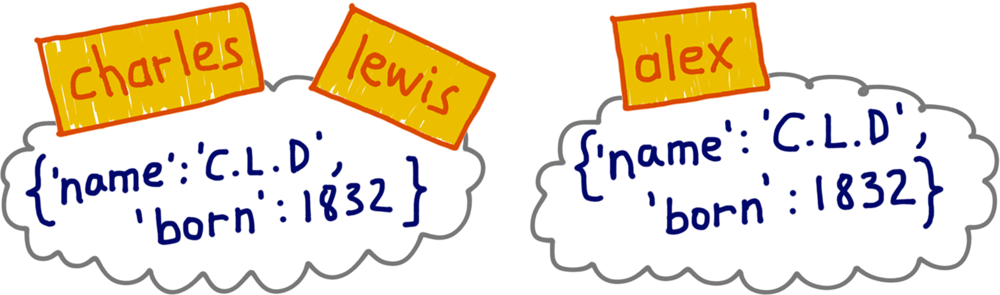
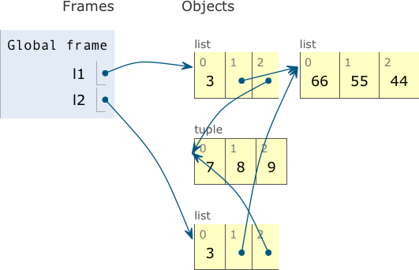
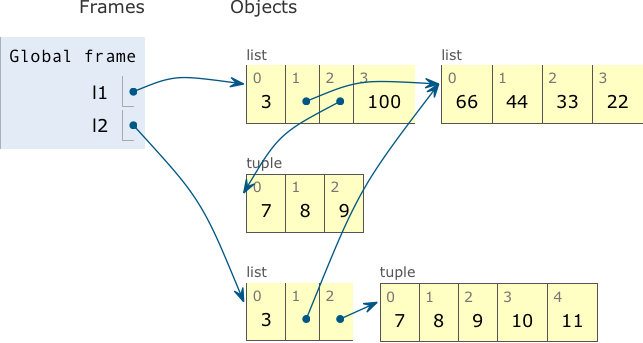

[[ch_refs_mut_mem]]
== Referências, mutabilidade, e memória
:example-number: 0
:figure-number: 0

[quote, Adaptado de “Alice Através do Espelho e o que Ela Encontrou Lá”, de Lewis Caroll]
____
“Você está triste,” disse o Cavaleiro em um tom de voz ansioso:
“deixe eu cantar para você uma canção reconfortante. […]
O nome da canção se chama ‘OLHOS DE HADOQUE’.”

“Oh, esse é o nome da canção?,” disse Alice, tentando parecer interessada.

“Não, você não entendeu,” retorquiu o Cavaleiro, um pouco irritado.
“É assim que o nome É CHAMADO.
O nome na verdade é ‘O ENVELHECIDO HOMEM VELHO.‘”
____

Alice e o Cavaleiro((("object references", "distinction between objects and their names")))
dão o tom do que veremos nesse capítulo.
O tema é a distinção entre objetos e seus nomes:
o nome não é o objeto, o nome é outra coisa.

Começamos o capítulo apresentando uma metáfora para variáveis em Python:
variáveis são rótulos, não caixas.
Mesmo que você já domine variáveis de referência,
a analogia pode ainda ser útil para ilustrar questões de _aliasing_ (“apelidamento”)
para outra pessoa.

Depois discutimos os conceitos de identidade, valor e apelidamento de objetos.
Uma característica surpreendente das tuplas é revelada:
elas são imutáveis, mas seus valores podem mudar.
Isso leva a uma discussão sobre cópias rasas e profundas.
Referências e parâmetros de funções são o tema seguinte:
o problema do parâmetro com default mutável e
formas seguras de lidar com argumentos mutáveis passados para nossas funções por clientes.

As últimas seções do capítulo tratam de coleta de lixo (_garbage collection_),
da instrução `del` e de algumas otimizações com objetos imutáveis em Python.

É um capítulo bastante árido,
mas os tópicos tratados podem explicar muitos bugs sutis em programas reais em Python,
além de boas práticas para evitá-los.

=== Novidades neste capítulo

Os tópicos tratados aqui são muito estáveis e fundamentais.
Não foi introduzida nenhuma mudança digna de nota nesta segunda edição.

Acrescentei um exemplo usando `is` para testar a existência de um objeto sentinela,
e um aviso sobre o mau uso do operador `is` no final da <<choosing_eq_v_is_sec>>.

Este capítulo estava na Parte IV, mas decidi abordar esses temas mais cedo,
pois eles funcionam melhor como o encerramento da Parte II, “Estruturas de Dados”,
que como abertura de “Práticas de Orientação a Objetos"

[NOTE]
====
A seção sobre “Referências Fracas” da primeira edição deste livro agora é
«um post em _fluentpython.com_» [.small]#&#91;fpy.li/weakref&#93;#.
====

Vamos começar desaprendendo que uma variável é como uma caixa onde você guarda dados.

=== Variáveis não são caixas

Em 1997, ((("object references", "variables as labels versus boxes", id="ORvar06")))((("variables",
"as labels versus boxes", secondary-sortas="labels versus boxes", id="Vlabel06")))
fiz um curso de verão sobre Java no MIT.
A professora Lynn Steinfootnote:[Lynn Andrea Stein é uma aclamada educadora de ciências da computação.
Ela atualmente leciona no «Olin College of Engineering» [.small]#&#91;fpy.li/6-1&#93;#.]
explicou que a metáfora comum, de “variáveis como caixas”,
na verdade atrapalha o entendimento de variáveis de
referência em linguagens orientadas a objetos.
As variáveis em Python são como variáveis de referência em Java;
uma metáfora melhor é pensar em uma variável como uma etiqueta
que dá nome a um objeto.
O exemplo e a figura a seguir ajudam a entender o motivo disso.

O <<ex_a_b_refs>> é uma interação simples que não pode ser explicada por “variáveis como caixas”.

[[ex_a_b_refs]]
.As variáveis `a` e `b` referem-se à mesma lista, não a cópias da lista.
====
[source, python]
----
>>> a = [1, 2, 3]  <1>
>>> b = a          <2>
>>> a.append(4)    <3>
>>> b              <4>
[1, 2, 3, 4]
----
====
<1> Cria uma lista [1, 2, 3] e a vincula à variável `a`.
<2> Vincula a variável `b` ao mesmo valor referenciado por `a`.
<3> Modifica a lista referenciada por `a`, anexando um novo item.
<4> É possível ver o efeito através da variável `b`.
Se você pensar em `b` como uma caixa que guardava uma cópia de
`[1, 2, 3]` da caixa `a`, este comportamento não faz sentido.

A <<var-boxes-x-labels>> explica por que a metáfora da caixa está errada em Python,
enquanto etiquetas apresentam uma imagem mais útil para entender como variáveis funcionam.

[[var-boxes-x-labels]]
.Se você imaginar variáveis como caixas, não é possível entender a atribuição em Python; por outro lado, imagine variáveis como etiquetas autocolantes e o <<ex_a_b_refs>> é facilmente explicável.
image::../images/flpy_0601.png[Boxes and labels diagram]

Assim, a instrução `b = a` não copia o conteúdo de uma caixa `a` para uma caixa `b`.
Ela cola uma nova etiqueta `b` no objeto que já tem a etiqueta `a`.

A professora Stein também falava sobre atribuição de uma maneira bastante específica.
Por exemplo, quando discutia sobre um objeto representando uma gangorra em uma simulação,
ela dizia:
“A variável g foi atribuída à gangorra”, mas nunca “A gangorra foi atribuída à variável g”.
Com variáveis de referência,
faz mais sentido dizer que a variável é atribuída a um objeto, não o contrário.
Afinal, o objeto é criado antes da atribuição.
O <<ex_var_assign_after>> prova que o lado direito de uma atribuição é processado primeiro.

Já que o verbo “atribuir” é usado de diferentes maneiras,
“vincular” é uma alternativa melhor:
a declaração de atribuição em Python `x = …` vincula o nome `x`
ao objeto criado ou referenciado no lado direito.
E o objeto precisa existir antes que um nome possa ser vinculado a ele,
como demonstra o <<ex_var_assign_after>>.

[[ex_var_assign_after]]
.Variáveis são vinculadas a objetos somente após os objetos serem criados
====
[source, python]
----
>>> class Gizmo:
...    def __init__(self):
...         print(f'Gizmo id: {id(self)}')
...
>>> x = Gizmo()
Gizmo id: 4301489152  <1>
>>> y = Gizmo() * 10  <2>
Gizmo id: 4301489432  <3>
Traceback (most recent call last):
  File "<stdin>", line 1, in <module>
TypeError: unsupported operand type(s) for *: 'Gizmo' and 'int'
>>>
>>> dir()  <4>
['Gizmo', '__builtins__', '__doc__', '__loader__', '__name__',
'__package__', '__spec__', 'x']
----
====
<1> A saída `Gizmo id: …` é um efeito colateral da criação de uma instância de `Gizmo`.
<2> Multiplicar uma instância de `Gizmo` levanta uma exceção.
<3> Aqui está a prova de que um segundo `Gizmo` foi de fato instanciado
antes que a multiplicação fosse tentada.
<4> Mas a variável `y` nunca foi criada, porque a exceção aconteceu
enquanto a parte direita da atribuição estava sendo executada.

[TIP]
====
Para entender uma atribuição em Python, leia primeiro o lado direito:
é ali que o objeto é criado ou recuperado.
Depois disso, a variável do lado esquerdo é vinculada ao objeto,
como uma etiqueta colada a ele.
Esqueça as caixas.
====

Como variáveis são apenas meras etiquetas,
nada impede que um objeto tenha várias etiquetas vinculadas a si.
Quando isso acontece, você tem _apelidos_ (aliases),
nosso próximo tópico.((("", startref="ORvar06")))((("", startref="Vlabel06")))

=== Identidade, igualdade e apelidos

Lewis Carroll((("object references", "aliasing", id="ORalias06")))((("aliasing", id="alias06")))
é o pseudônimo literário do Prof.
Charles Lutwidge Dodgson.
O Sr.
Carroll não é apenas igual ao Prof.
Dodgson;
eles são exatamente a mesma pessoa. <<ex_equal_and_same>>
expressa essa ideia em Python.

[[ex_equal_and_same]]
.`charles` e `lewis` se referem ao mesmo objeto
====
[source, python]
----
>>> charles = {'name': 'Charles L. Dodgson', 'born': 1832}
>>> lewis = charles  <1>
>>> lewis is charles
True
>>> id(charles), id(lewis)  <2>
(4300473992, 4300473992)
>>> lewis['balance'] = 950  <3>
>>> charles
{'name': 'Charles L. Dodgson', 'born': 1832, 'balance': 950}
----
====
<1> `lewis` é um apelido para `charles`.
<2> O operador `is` e a função `id` confirmam essa afirmação.
<3>  Adicionar um item a `lewis` é o mesmo que adicionar um item a `charles`.

Entretanto, suponha que um impostor—vamos chamá-lo de Dr.
Alexander Pedachenko—diga
que é o verdadeiro Charles L. Dodgson, nascido em 1832.
Suas credenciais podem ser as mesmas,
mas o Dr.
Pedachenko não é o Prof.
Dodgson. <<alias_x_copy>> ilustra esse cenário.

[[alias_x_copy]]
.`charles` e `lewis` estão vinculados ao mesmo objeto; `alex` está vinculado a um objeto diferente de valor igual.

O <<ex_equal_not_same>> constrói e testa o objeto `alex` como apresentado em <<alias_x_copy>>.

[[ex_equal_not_same]]
.`alex` e `charles` são iguais quando comparados, mas `alex` _não é_ `charles`
====
[source, python]
----
>>> charles = {'name': 'Charles L. Dodgson', 'born': 1832}
>>> alex = {'name': 'Charles L. Dodgson', 'born': 1832}  <1>
>>> alex == charles  <2>
True
>>> alex is not charles  <3>
True
----
====
<1> `alex` é uma referência a um objeto que é uma réplica  do objeto vinculado a `charles`.
<2> Os objetos são iguais quando comparados devido à implementação de `+__eq__+` na classe `dict`.
<3> Mas são objetos distintos.
Essa é a forma pythônica de escrever
a negação de uma comparação de identidade: `a is not b`.

<<ex_equal_and_same>> é um exemplo de _apelidamento_ (aliasing).
Naquele código, `lewis` e `charles` são apelidos: duas variáveis vinculadas ao mesmo objeto.
Por outro lado, `alex` não é um apelido para `charles`:
essas variáveis estão vinculadas a objetos diferentes.
Os
((("&#x3D;&#x3D; (equality) operator")))((("equality (&#x3D;&#x3D;) operator")))((("comparison operators")))
objetos vinculados a `alex` e `charles` têm o mesmo
__valor__ (é isso que `==` compara) mas têm identidades diferentes.

Na «Referência da Linguagem Python» [.small]#&#91;fpy.li/2x&#93;#, está escrito:

[quote]
____
A identidade de um objeto nunca muda após ele ter sido criado;
você pode pensar nela como o endereço do objeto na memória.
O operador `is` compara a identidade de dois objetos; a função
((("functions", "id() function")))((("id() function"))) `id()`
retorna um inteiro representando essa identidade.
____

O verdadeiro significado do `id` de um objeto depende da implementação da linguagem.
Em CPython, `id()` retorna o endereço de memória do objeto,
mas outro interpretador Python pode retornar algo diferente.
O ponto fundamental é que o `id` será sempre um valor numérico único,
e ele nunca mudará durante a vida do objeto.

<<<
Na prática, raramente usamos a função `id()` quando programamos.
A verificação de identidade é feita, na maior parte das vezes, com o operador `is`,
que compara os IDs dos objetos, então nosso código não precisa chamar `id()`
explicitamente.
A seguir falamos sobre `is` versus `==`.

[TIP]
====
Para o revisor técnico Leonardo Rochael,
o uso mais frequente de `id()` ocorre durante o processo de debugging,
quando o `repr()` de dois objetos são semelhantes,
mas você precisa saber se duas referências são apelidos ou apontam para objetos diferentes.
Se as referências estão em contextos diferentes--por exemplo, em stack frames
diferentes--pode não ser viável usar `is`.
====

[[choosing_eq_v_is_sec]]
==== Escolhendo entre == e is

O operador ((("is operator"))) `==` compara os valores de objetos (os dados que eles contêm),
enquanto `is` compara suas identidades.

Em geral, ao programar, nos preocupamos mais com os valores que com as identidades dos objetos.
Por este motivo `==` aparece com mais frequência que `is` em programas Python.

Entretanto, se você estiver comparando uma variável com um singleton (um objeto único)
faz mais sentido usar `is`.
O caso mais comum é verificar se uma variável está vinculada a `None`.
Esta é a forma recomendada de fazer isso:

[source, python]
----
x is None
----

E a forma apropriada de escrever sua negação é:

[source, python]
----
x is not None
----

`None` é o singleton mais comum que testamos com `is`.
Objetos sentinela são outro exemplo de singletons que testamos com `is`.
Veja um modo de criar e testar um objeto sentinela:

[source, python]
----
END_OF_DATA = object()
# ... many lines
def traverse(...):
    # ... more lines
    if node is END_OF_DATA:
        return
    # etc.
----

O operador `is` é mais rápido que `==`, pois não pode ser sobrecarregado.
Daí Python não precisa encontrar e invocar métodos especiais para calcular seu resultado
e o processamento é tão simples quanto comparar dois IDs, que são números inteiros.
Por outro lado, `a == b` é açúcar sintático para `+a.__eq__(b)+`.
O método `+__eq__+`, herdado de `object`, compara os IDs dos objetos,
então produz o mesmo resultado de `is`.
Mas a maioria dos tipos embutidos sobrescreve `+__eq__+` com implementações mais úteis,
que levam em consideração os valores dos atributos dos objetos.
A determinação da igualdade pode envolver muito processamento--por exemplo,
quando se comparam coleções grandes ou estruturas aninhadas com muitos níveis.

[WARNING]
====
Normalmente estamos mais interessados na igualdade que na identidade de objetos,
por isso o operador `==` é mais utilizado que `is`.
O caso mais comum para uso de `is` é comparar com `None`.
O `is` também é útil para testar valores de classes derivadas de `enum.Enum`.footnote:[Agradeço
a Ruan Comelli, revisor da tradução brasileira,
por ter me lembrado o caso de uso do operador `is` com objetos `Enum`.]
Se não estiver seguro, use `==`. Em geral, é o que você quer,
e também funciona com `None` e valores de `Enum`,
ainda que seja um menos eficiente.
====

Para concluir essa discussão de identidade versus igualdade,
vamos ver como o tipo notoriamente imutável `tuple` não é assim tão invariável quanto você poderia supor.

[[tuple_relative_immutable_sec]]
==== A imutabilidade relativa das tuplas

As tuplas, como((("tuples", "relative immutability of"))) a maioria das coleções em
Python#x2014;lists, dicts, sets, etc.&#x2014;são contêineres:
armazenam referências para objetos.footnote:[Ao contrário de sequências
planas de tipo único, como `str`, `byte` e `array.array`,
que não contêm referências e sim seu conteúdo -- caracteres, bytes e números -- armazenado
em um espaço contíguo de memória.]

Se os itens referenciados forem mutáveis, eles podem mudar, mesmo que a tupla em si não mude.
Em outras palavras, a imutabilidade das tuplas refere-se apenas ao conteúdo interno da
estrutura da instância de `tuple` (isto é, as referências que ela armazena),
e não se estende aos objetos referenciados.

O <<ex_mutable_tuples>> ilustra uma situação em que o valor de uma tupla muda
como resultado de mudanças em um objeto mutável ali referenciado.
O que não pode nunca mudar em uma tupla é a identidade dos itens que ela contém.

[[ex_mutable_tuples]]
.`t1` e `t2` inicialmente são iguais, mas a mudança em um item mutável dentro da tupla `t1` as torna diferentes
====
[source, python]
----
>>> t1 = (1, 2, [30, 40])  <1>
>>> t2 = (1, 2, [30, 40])  <2>
>>> t1 == t2  <3>
True
>>> id(t1[-1])  <4>
4302515784
>>> t1[-1].append(99)  <5>
>>> t1
(1, 2, [30, 40, 99])
>>> id(t1[-1])  <6>
4302515784
>>> t1 == t2  <7>
False
----
====
<1> `t1` é imutável, mas `t1[-1]` é mutável.
<2> Cria a tupla `t2`, cujos itens são iguais àqueles de `t1`.
<3> Apesar de serem objetos distintos, `t1` e `t2` são iguais quando comparados, como esperado.
<4> Obtém o id da lista na posição `t1[-1]`.
<5> Modifica diretamente a lista `t1[-1]`.
<6> O id de `t1[-1]` não mudou, apenas seu valor.
<7> `t1` e `t2` agora são diferentes

A imutabilidade relativa das tuplas está por trás do enigma da <<tuple_puzzler>>.
Esta é também razão pela qual não é possível gerar o hash de algumas tuplas,
como vimos na <<what_is_hashable_sec>>.

A distinção entre igualdade e identidade tem outras implicações quando você precisa copiar um objeto.
Uma cópia é um objeto igual com um `id` diferente.
Mas se um objeto contém outros objetos,
é preciso que a cópia duplique os objetos internos ou eles podem ser compartilhados?
Não há uma resposta única.
A seguir discutimos esse ponto.((("", startref="ORalias06")))((("", startref="alias06")))

=== A princípio, cópias são rasas

A ((("object references", "shallow copies", id="ORshallow06")))((("shallow copies",
id="shallow06")))((("copies", "shallow", id="Cshallow06")))((("lists", "shallow copies of",
id="Lshallow06")))forma mais fácil de copiar uma lista
(ou a maioria das coleções mutáveis nativas) é usando o construtor padrão do próprio tipo.
Por exemplo:

[source, python]
----
>>> l1 = [3, [55, 44], (7, 8, 9)]
>>> l2 = list(l1)  <1>
>>> l2
[3, [55, 44], (7, 8, 9)]
>>> l2 == l1  <2>
True
>>> l2 is l1  <3>
False
----
<1> `list(l1)` cria uma cópia de `l1`.
<2> As cópias são iguais...
<3> ...mas se referem a dois objetos diferentes.

Para listas e outras sequências mutáveis, o atalho `l2 = l1[:]` também cria uma cópia.

Contudo, tanto o construtor quanto `[:]` produzem uma _cópia rasa_ (shallow copy).
Isto é, o contêiner externo é duplicado, mas a cópia é preenchida com referências
para os mesmos itens contidos no contêiner original.
Isso economiza memória e não causa qualquer problema se todos os itens forem imutáveis.
Mas se existirem itens mutáveis, isso pode gerar surpresas desagradáveis.

No <<ex_shallow_copy>> criamos uma lista contendo outra lista e uma tupla,
e então fazemos algumas mudanças para ver como isso afeta os objetos referenciados.

<<<
[TIP]
====
Se você está conectado à internet,
recomendo que assista à animação interativa do
<<ex_shallow_copy>> no «_Online Python Tutor_» [.small]#&#91;fpy.li/6-3&#93;#.
No momento em que escrevo, o link direto para um exemplo pronto no _pythontutor.com_
não funciona sempre.
Mas a ferramenta é ótima, então vale a pena investir o tempo copiando e colando o código.
====

[[ex_shallow_copy]]
.Criando uma cópia rasa de uma lista contendo outra lista; copie e cole esse código para vê-lo animado no Online Python Tutor
====
[source, python]
----
l1 = [3, [66, 55, 44], (7, 8, 9)]
l2 = list(l1)      # <1>
l1.append(100)     # <2>
l1[1].remove(55)   # <3>
print('l1:', l1)
print('l2:', l2)
l2[1] += [33, 22]  # <4>
l2[2] += (10, 11)  # <5>
print('l1:', l1)
print('l2:', l2)
----
====
<1> `l2` é uma cópia rasa de `l1`. Este estado está representado na <<shallow_copy1>>.
<2> Concatenar `100` a `l1` não tem qualquer efeito sobre `l2`.
<3> Aqui removemos `55` da lista interna `l1[1]`. Isso afeta `l2`,
pois `l2[1]` está associado à mesma lista em `l1[1]`.
<4> Para um objeto mutável como a lista referida por `l2[1]`,
o operador `+=` altera a lista diretamente.
Essa mudança é visível em `l1[1]`,
que é um apelido para `l2[1]`.
<5> `+=` em uma tupla cria uma nova tupla e reassocia a variável `l2[2]` a ela.
Isso é equivalente a fazer `l2[2] = l2[2] + (10, 11)`.
Agora as tuplas na última posição de `l1` e `l2` não são mais o mesmo objeto.
Veja <<shallow_copy2>>.

A saída do <<ex_shallow_copy>> está no <<ex_shallow_copy_out>>,
e o estado final dos objetos está representado na <<shallow_copy2>>.

[[shallow_copy1]]
.Estado do programa imediatamente após a atribuição `l2 = list(l1)` em <<ex_shallow_copy>>. `l1` e `l2` se referem a listas diferentes, mas as listas compartilham referências para os mesmos objetos internos, a lista `[66, 55, 44]` e para a tupla `(7, 8, 9)`. (Diagrama gerado pelo Online Python Tutor)

[[ex_shallow_copy_out]]
.Saída do <<ex_shallow_copy>>
====
[source, python]
----
l1: [3, [66, 44], (7, 8, 9), 100]
l2: [3, [66, 44], (7, 8, 9)]
l1: [3, [66, 44, 33, 22], (7, 8, 9), 100]
l2: [3, [66, 44, 33, 22], (7, 8, 9, 10, 11)]
----
====

[[shallow_copy2]]
.Estado final de `l1` e `l2`: elas ainda compartilham referências para o mesmo objeto lista, que agora contém `[66, 44, 33, 22]`, mas a operação `l2[2] += (10, 11)` criou uma nova tupla com conteúdo `(7, 8, 9, 10, 11)`, sem relação com a tupla `(7, 8, 9)` referenciada por `l1[2]`. (Diagrama gerado pelo Online Python Tutor.)

Já deve estar claro que cópias rasas são fáceis de criar,
mas podem ou não ser o que você quer.
Nosso próximo tópico é a criação de cópias profundas.
((("", startref="ORshallow06")))((("", startref="shallow06")))((("",
startref="Cshallow06")))((("", startref="Lshallow06")))

[[deep_x_shallow_copies]]
==== Cópias profundas e cópias rasas

Trabalhar((("object references", "deep copies", id="ORdeep06")))((("copies", "deep",
id="Cdeep06")))((("deep copies", id="deepcopy06")))
com cópias rasas nem sempre é um problema,
mas algumas vezes você vai precisar criar cópias profundas
(isto é, cópias que não compartilham referências de objetos internos).
O módulo `copy` oferece as funções `deepcopy` e `copy`,
que retornam cópias profundas e rasas de objetos arbitrários, respectivamente.

Para ilustrar o uso de `copy()` e `deepcopy()`, <<ex_bus1>> define uma classe simples,
`Bus`, representando um ônibus escolar que é carregado com passageiros,
e então pega ou deixa passageiros ao longo de sua rota.

[[ex_bus1]]
.Bus pega ou deixa passageiros
====
[source, python]
----
include::../code/06-obj-ref/bus.py[tags=BUS_CLASS]
----
====

Agora, no <<ex_bus1_console>> interativo, vamos criar um objeto `bus1` e
dois clones: uma cópia rasa (`bus2`) e uma cópia profunda
(`bus3`). Então vemos o que acontece quando o `bus1` deixa um passageiro.

[[ex_bus1_console]]
.Os efeitos do uso de `copy` versus `deepcopy`
====
[source, python]
----
>>> import copy
>>> bus1 = Bus(['Alice', 'Bill', 'Claire', 'David'])
>>> bus2 = copy.copy(bus1)
>>> bus3 = copy.deepcopy(bus1)
>>> id(bus1), id(bus2), id(bus3)
(4301498296, 4301499416, 4301499752)  <1>
>>> bus1.drop('Bill')
>>> bus2.passengers
['Alice', 'Claire', 'David']          <2>
>>> id(bus1.passengers), id(bus2.passengers), id(bus3.passengers)
(4302658568, 4302658568, 4302657800)  <3>
>>> bus3.passengers
['Alice', 'Bill', 'Claire', 'David']  <4>
----
====
<1> Usando `copy` e `deepcopy`, criamos três instâncias distintas de `Bus`.
<2> Após `bus1` deixar `'Bill'`, ele também desaparece de `bus2`.
<3> A inspeção do atributo dos `passengers` mostra que
`bus1` e `bus2` compartilham o mesmo objeto lista, pois `bus2` é uma cópia rasa de `bus1`.
<4> `bus3` é uma cópia profunda de `bus1`,
então seu atributo `passengers` se refere a outra lista.

Em geral, criar cópias profundas não é uma questão simples.
Objetos podem conter referências cíclicas que fariam um algoritmo
ingênuo entrar em um loop infinito.
A função `deepcopy` memoriza os objetos já copiados,
e trata referências cíclicas corretamente.
Isto é demonstrado no <<ex_cycle1>>.

[[ex_cycle1]]
.Referências cíclicas: `b` tem uma referência para `a`; `b` é concatenado a `a`; ainda assim, `deepcopy` consegue copiar `a`.
====
[source, python]
----
>>> a = [10, 20]
>>> b = [a, 30]
>>> a.append(b)
>>> a
[10, 20, [[...], 30]]
>>> from copy import deepcopy
>>> c = deepcopy(a)
>>> c
[10, 20, [[...], 30]]
----
====

Além disso, algumas vezes uma cópia profunda pode ser profunda demais.
Por exemplo, objetos podem ter referências para recursos externos ou para
_singletons_ (objetos únicos) que não devem ser copiados.
Você pode controlar o comportamento de `copy` e de `deepcopy`
implementando os métodos especiais `+__copy__+` e `+__deepcopy__+`,
como descrito na
«documentação do módulo `copy`» [.small]#&#91;fpy.li/43&#93;#

O compartilhamento de objetos através de apelidos também explica
como a passagem de parâmetros funciona em Python,
e o problema do uso de tipos mutáveis como parâmetros default.
Vamos falar sobre essas questões a seguir.((("", startref="deepcopy06")))((("",
startref="Cdeep06")))((("", startref="ORdeep06")))

=== Parâmetros de função como referências

O((("object references", "function parameters as references",
id="ORfparam06")))((("call by sharing")))((("parameters", "parameter passing")))
único modo de passagem de parâmetros em Python é a _chamada por compartilhamento_
(_call by sharing_).
É o mesmo modo usado na maioria das linguagens orientadas a objetos,
incluindo Javascript, Ruby e Java (em Java isso se aplica aos tipos de referência;
tipos primitivos usam a chamada por valor).
Chamada por compartilhamento significa que cada parâmetro formal
da função recebe uma cópia de cada referência nos argumentos.
Em outras palavras, os parâmetros dentro da função se tornam apelidos dos argumentos passados.

O resultado desse esquema é que a função pode modificar qualquer objeto mutável
passado a ela como parâmetro, mas não pode mudar a identidade daqueles objetos
(isto é, ela não pode substituir integralmente um objeto por outro).
O <<ex_param_pass>> mostra uma função simples usando `+=` com um de seus parâmetros.
Quando passamos números, listas e tuplas para a função,
os argumentos originais são afetados de maneiras diferentes.
Veja só:

[[ex_param_pass]]
.Uma função pode mudar qualquer objeto mutável que receba
====
[source, python]
----
>>> def f(a, b):
...     a += b
...     return a
...
>>> x = 1
>>> y = 2
>>> f(x, y)
3
>>> x, y  <1>
(1, 2)
>>> a = [1, 2]
>>> b = [3, 4]
>>> f(a, b)
[1, 2, 3, 4]
>>> a, b  <2>
([1, 2, 3, 4], [3, 4])
>>> t = (10, 20)
>>> u = (30, 40)
>>> f(t, u)  <3>
(10, 20, 30, 40)
>>> t, u
((10, 20), (30, 40))
----
====
<1> O número `x` não se altera.
<2> A lista `a` é alterada.
<3> A tupla `t` não se altera.

Outra questão relacionada a parâmetros de função é o uso de valores mutáveis como defaults,
discutida a seguir.

[[mutable_default_parameter_sec]]
==== Por que evitar tipos mutáveis como default em parâmetros

Parâmetros opcionais((("mutable parameters", id="muttype06")))((("parameters", "mutable",
id="Pmut06"))) com valores default são um ótimo recurso para definição de funções em Python,
permitindo que nossas APIs evoluam mantendo a compatibilidade com versões anteriores.
Entretanto, evite usar objetos mutáveis como valores default em parâmetros.

Para ilustrar o motivo, no <<ex_haunted_bus>>
modificamos o método `+__init__+` da classe `Bus` do <<ex_bus1>> para criar `HauntedBus`.
Tentamos ser espertos: em vez do valor default `passengers=None`,
temos `passengers=[]`, para evitar o `if` do `+__init__+` anterior.
Essa "esperteza" causa problemas.

[[ex_haunted_bus]]
.Uma classe simples ilustrando o perigo de um default mutável
====
[source, python]
----
include::../code/06-obj-ref/haunted_bus.py[tags=HAUNTED_BUS_CLASS]
----
====
<1> Quando não passamos o argumento `passengers`,
esse parâmetro é vinculado ao objeto lista default, que inicialmente está vazia.
<2> Essa atribuição torna `self.passengers` um apelido de `passengers`,
que por sua vez é um apelido para a lista default,
quando um argumento `passengers` não é passado para a função.
<3> Quando os métodos `.remove()` e `.append()` são usados com `self.passengers`,
estamos, na verdade, mudando a lista default, que é um atributo do objeto-função.

<<demo_haunted_bus>> mostra o comportamento misterioso de `HauntedBus`.

[[demo_haunted_bus]]
.Ônibus assombrados por passageiros fantasmas
====
[source, python]
----
>>> bus1 = HauntedBus(['Alice', 'Bill'])  <1>
>>> bus1.passengers
['Alice', 'Bill']
>>> bus1.pick('Charlie')
>>> bus1.drop('Alice')
>>> bus1.passengers  <2>
['Bill', 'Charlie']
>>> bus2 = HauntedBus()  <3>
>>> bus2.pick('Carrie')
>>> bus2.passengers
['Carrie']
>>> bus3 = HauntedBus()  <4>
>>> bus3.passengers  <5>
['Carrie']
>>> bus3.pick('Dave')
>>> bus2.passengers  <6>
['Carrie', 'Dave']
>>> bus2.passengers is bus3.passengers  <7>
True
>>> bus1.passengers  <8>
['Bill', 'Charlie']
----
====
<1> `bus1` começa com uma lista de dois passageiros.
<2> Até aqui, tudo bem: nenhuma surpresa em `bus1`.
<3> `bus2` começa vazio, então a lista vazia default é vinculada a `self.passengers`.
<4> `bus3` também começa vazio, e novamente a lista default é atribuída.
<5> A lista default não está mais vazia!
<6> Agora `Dave`, pego pelo `bus3`, aparece no `bus2`.
<7> O problema: `bus2.passengers` e `bus3.passengers` se referem à mesma lista.
<8> Mas `bus1.passengers` é uma lista diferente.

O problema é que objetos `HauntedBus` que não recebem uma lista de passageiros
inicial compartilham a mesma lista de passageiros entre si.

Este tipo de bug pode ser muito sutil.
Como o <<demo_haunted_bus>> demonstra,
quando `HauntedBus` recebe uma lista com passageiros como parâmetro,
ele funciona como esperado.
Coisas estranhas acontecem somente quando `HauntedBus` começa vazio,
pois aí `self.passengers` se torna um apelido para o valor default do parâmetro `passengers`.
O problema é que cada valor default é processado quando a função é definida—normalmente
quando o módulo é carregado—e os valores default se tornam atributos do objeto-função.
Assim, se o valor default é um objeto mutável e você o altera,
a alteração vai afetar todas as futuras chamadas da função.

Depois de rodar o <<demo_haunted_bus>>,
podemos inspecionar o objeto `+HauntedBus.__init__+`
e ver fantasmas de estudantes assombrando o atributo `+__defaults__+`:

[source, python]
----
>>> dir(HauntedBus.__init__)  # doctest: +ELLIPSIS
['__annotations__', '__call__', ..., '__defaults__', ...]
>>> HauntedBus.__init__.__defaults__
(['Carrie', 'Dave'],)
----

Por fim, podemos verificar que `bus2.passengers` é um apelido vinculado
ao primeiro elemento do atributo `+HauntedBus.__init__.__defaults__+`:

[source, python]
----
>>> HauntedBus.__init__.__defaults__[0] is bus2.passengers
True
----

O problema com defaults mutáveis explica por que `None` é normalmente usado como
valor default para parâmetros que podem receber valores mutáveis.
No <<ex_bus1>>, `+__init__+` checa se o argumento `passengers` é `None`.
Se for, `self.passengers` é vinculado a uma nova lista vazia.
Se `passengers` não for `None`,
a implementação correta vincula uma cópia daquele argumento a `self.passengers`.
A próxima seção explica por que copiar o argumento é uma boa prática.

[[defensive_argument]]
==== Programação defensiva com argumentos mutáveis

Ao escrever uma função que recebe um argumento mutável,
você deve considerar com cuidado se o cliente que
chama sua função espera que o argumento passado seja modificado.

Por exemplo, se sua função recebe um `dict` e precisa modificá-lo durante seu processamento,
esse efeito colateral deve ou não ser visível fora da função?
A resposta, na verdade, depende do contexto.
É tudo uma questão de alinhar as expectativas do autor da função com as do cliente da função.

O último exemplo com ônibus neste capítulo mostra como o `TwilightBus` viola as expectativas
ao compartilhar sua lista de passageiros com seus clientes.
Antes de estudar a implementação, veja como a classe `TwilightBus` funciona pela
perspectiva de um cliente daquela classe, em <<demo_twilight_bus>>.

[[demo_twilight_bus]]
.Passageiros desaparecem quando são deixados por um `TwilightBus`
====
[source, python]
----
>>> basketball_team = ['Sue', 'Tina', 'Maya', 'Diana', 'Pat']  <1>
>>> bus = TwilightBus(basketball_team)  <2>
>>> bus.drop('Tina')  <3>
>>> bus.drop('Pat')
>>> basketball_team  <4>
['Sue', 'Maya', 'Diana']
----
====
<1> `basketball_team` contém o nome de cinco estudantes.
<2> Um `TwilightBus` é carregado com o time.
<3> O `bus` deixa uma estudante, depois outra.
<4> As passageiras desembarcadas desapareceram do time de basquete!

<<<
`TwilightBus` viola o "Princípio da Menor Surpresa", uma boa prática do design de
interfaces.footnote:[Ver «_Principle of least astonishment_» [.small]#&#91;fpy.li/6-5&#93;#.]
Com certeza, é surpreendente: quando o ônibus deixa uma estudante,
o nome dela é removido da escalação do time de basquete.

<<ex_twilight_bus>> é a implementação de `TwilightBus` e uma explicação do problema.

[[ex_twilight_bus]]
.Classe simples mostrando o perigo de mudar argumentos recebidos
====
[source, python]
----
include::../code/06-obj-ref/twilight_bus.py[tags=TWILIGHT_BUS_CLASS]
----
====
[role="pagebreak-before less_space"]
<1> Aqui temos o cuidado de criar uma lista vazia quando `passengers` é `None`.
<2> Entretanto, esta atribuição transforma `self.passengers` em um apelido para `passengers`,
que por sua vez é um apelido para o argumento passado para `+__init__+`
(i.e. `basketball_team` em <<demo_twilight_bus>>).
<3> Quando os métodos `.remove()` e `.append()` são usados com `self.passengers`,
estamos, na verdade, modificando a lista original recebida como argumento pelo construtor.

O problema aqui é que o ônibus está apelidando a lista passada para o construtor.
Ao invés disso, ele deveria manter sua própria lista de passageiros.
A solução é simples: em `+__init__+`, quando o parâmetro `passengers` é fornecido,
`self.passengers` deveria ser inicializado com uma cópia daquela lista,
como fizemos, de forma correta, no <<ex_bus1>>:

<<<
[source, python]
----
    def __init__(self, passengers=None):
        if passengers is None:
            self.passengers = []
        else:
            self.passengers = list(passengers) <1>
----
<1> Cria uma cópia da lista `passengers`,
ou converte o argumento para `list` se ele não for uma lista.

Agora nossa manipulação interna da lista de passageiros não afetará
o argumento usado para inicializar o ônibus.
E com uma vantagem adicional, essa solução é mais flexível:
agora o argumento passado no parâmetro `passengers` pode ser
uma tupla ou qualquer outro tipo iterável,
como `set` ou mesmo resultados de uma consulta a um banco de dados,
pois o construtor de `list` aceita qualquer iterável.
Ao criar nossa própria lista, estamos também assegurando que ela suporta os métodos necessários,
`.remove()` e `.append()`, operações que usamos nos métodos `.pick()` e `.drop()`.

[TIP]
====
A menos que um método tenha o objetivo explícito de alterar um objeto recebido como argumento,
você deveria pensar bem antes de apelidar tal objeto e simplesmente vinculá-lo a
uma variável interna de sua classe.
Quando em dúvida, crie uma cópia.
Os clientes de sua classe ficarão mais felizes.
Claro, criar uma cópia não é grátis: há custos de memória e processamento.
Entretanto, uma API que causa bugs sutis é
um problema bem maior que uma que seja um pouco mais lenta ou que use mais recursos.
====

Agora vamos conversar sobre uma das instruções mais obscuras de Python:
`del`.((("", startref="ORfparam06")))((("", startref="muttype06")))((("", startref="Pmut06")))

<<<

[[del_sec]]
=== del e coleta de lixo

[quote, “Modelo de Dados” capítulo de <em>A Referência da Linguagem Python</em>]
____
Os objetos((("object references", "del and garbage collection",
id="ORdel06")))((("garbage collection", id="garb06"))) nunca são destruídos explicitamente;
no entanto, quando eles se tornam inacessíveis, eles podem ser coletados como lixo.
____

A((("del statement", id="del06"))) primeira surpresa de `del` é não ser uma função,
mas uma instrução (_statement_).

Escrevemos `del x` e não `del(x)`—apesar dessa última forma funcionar também,
mas apenas porque as expressões `x` e `(x)` em geral têm o mesmo significado em Python.

O segundo aspecto surpreendente é que `del` apaga referências, não objetos.
A coleta de lixo pode eliminar um objeto da memória como resultado indireto de `del`,
se a variável apagada for a última referência ao objeto.
Reassociar uma variável também pode reduzir a zero o número de referências a um objeto,
causando sua destruição.

[source, python]
----
>>> a = [1, 2]  <1>
>>> b = a       <2>
>>> del a       <3>
>>> b           <4>
[1, 2]
>>> b = [3]     <5>
----
<1> Cria o objeto `[1, 2]` e vincula `a` a ele.
<2> Vincula `b` ao mesmo objeto `[1, 2]`.
<3> Apaga a referência `a`.
<4> `[1, 2]` não é afetado, pois `b` ainda aponta para ele.
<5> Reassociar `b` a um objeto diferente remove a última referência restante a `[1, 2]`.
Agora o coletor de lixo pode descartar aquele objeto.

[WARNING]
====
Existe((("&#x005F;&#x005F;del&#x005F;&#x005F;"))) um método especial `+__del__+`,
mas ele não causa a remoção de uma instância e não deve ser invocado em seu código.
O método `+__del__+` é invocado pelo interpretador Python quando a instância está prestes a ser destruída,
para dar a ela a chance de liberar recursos externos.
É muito raro ser preciso implementar `+__del__+` em seu código,
mas ainda assim alguns programadores Python perdem tempo codando este método sem necessidade.
O uso correto de `+__del__+` é bastante complexo.
Consulte
«`+__del__+`» [.small]#&#91;fpy.li/3x&#93;# no capítulo "Modelo de Dados" em _A Referência da Linguagem Python_.
====

No CPython, o algoritmo primário de coleta de lixo é ((("reference counting")))a contagem de referências.
Essencialmente, cada objeto mantém uma contagem do número de referências apontando para si.
Assim que a contagem chega a zero, o objeto é imediatamente destruído:
CPython invoca o método `+__del__+` no objeto (se definido)
e daí libera a memória alocada para aquele objeto.
No CPython 2.0, um algoritmo de coleta de lixo geracional foi acrescentado,
para detectar grupos de objetos envolvidos em referências cíclicas—grupos que
podem ser inacessíveis mesmo que existam referências restantes,
quando todas as referências mútuas estão contidas dentro daquele grupo.
Outras implementações de Python têm coletores de lixo mais sofisticados,
que não se baseiam na contagem de referências,
o que significa que o método `+__del__+` pode não ser chamado
imediatamente quando não existem mais referências ao objeto.
Veja «_PyPy, Garbage Collection, and a Deadlock_» [.small]#&#91;fpy.li/6-7&#93;#
de A. Jesse Jiryu Davis para uma discussão sobre os usos próprios e impróprios de `+__del__+`.

Para demonstrar o fim da vida de um objeto, <<ex_finalize>> usa `weakref.finalize`
para registrar uma função callback a ser chamada quando o objeto é destruído.

[[ex_finalize]]
.Detectando o fim de um objeto quando não resta nenhuma referência apontando para ele

====
[source, python]
----
>>> import weakref
>>> s1 = {1, 2, 3}
>>> s2 = s1         <1>
>>> def bye():      <2>
...     print('...like tears in the rain.')
...
>>> ender = weakref.finalize(s1, bye)  <3>
>>> ender.alive  <4>
True
>>> del s1
>>> ender.alive  <5>
True
>>> s2 = 'spam'  <6>
...like tears in the rain.
>>> ender.alive
False
----
====
<1> `s1` e `s2` são apelidos do mesmo conjunto, `{1, 2, 3}`.
<2> Para essa demonstração, a função `bye` não deve ser um método vinculado ao objeto prestes a ser destruído,
nem manter uma referência para o objeto.
<3> Registra o callback `bye` no objeto referenciado por `s1`.
<4> O atributo `.alive` é `True` antes do objeto `finalize` ser chamado.
<5> Como vimos, `del` não apaga o objeto, apenas a referência `s1` a ele.
<6> Reassociar a última referência, `s2`, torna `{1, 2, 3}` inacessível.
Ele é destruído, o callback `bye` é invocado, e `ender.alive` se torna `False`.

O ponto principal de <<ex_finalize>> é mostrar explicitamente que `del` não apaga objetos,
mas que objetos podem ser apagados como uma consequência de
ficarem inacessíveis após o uso de `del`.

Você pode estar se perguntando por que o objeto `{1, 2, 3}` foi destruído em <<ex_finalize>>.
Afinal, a referência `s1` foi passada para a função `finalize`,
que precisa tê-la mantido para conseguir monitorar o objeto e invocar o callback.
Isso funciona porque `finalize` mantém uma((("weak references")))
_referência fraca_ (_weak reference_) para {1, 2, 3}.
Referências fracas não aumentam a contagem de referências de um objeto.
Assim, uma referência fraca não evita que o objeto alvo seja removido pelo coletor de lixo.
Referências fracas são úteis em cenários de caching,
pois não queremos que os objetos "cacheados" sejam mantidos vivos apenas
por terem uma referência no cache.((("", startref="ORdel06")))((("", startref="del06")))((("", startref="garb06")))

[NOTE]
====
Referências fracas são um tópico muito especializado,
então decidi retirá-lo dessa segunda edição.
Em vez disso, publiquei a nota
«_Weak References_ em _fluentpython.com_» [.small]#&#91;fpy.li/weakref&#93;#.
====

<<<
=== Peças que Python prega com imutáveis

[NOTE]
====
Esta((("object references", "immutability and"))) seção opcional discute detalhes que
não são muito importantes para _usuários_ de Python,
e que podem não se aplicar a outras implementações da linguagem ou mesmo a futuras versões de CPython.
Mas já vi pessoas tropeçarem nesses casos obscuros e passarem a usar o((("is operator")))
operador `is` incorretamente, então decidi abordar esses detalhes.
====

Fiquei((("tuples", "immutability and"))) surpreso ao descobrir que, dada uma tupla `t`,
a chamada `t[:]` não cria uma cópia, mas devolve uma referência para o mesmo objeto.
Da mesma forma, `tuple(t)` também retorna uma referência para a mesma
tupla.footnote:[Isso está claramente documentado.
Digite `help(tuple)` no console de Python e leia:
"Se o argumento é uma tupla, o valor de retorno é o mesmo objeto."
Pensei que sabia tudo sobre tuplas antes de escrever esse livro.]

O <<ex_same_tuple>> demonstra esse fato.

[[ex_same_tuple]]
.Uma tupla construída a partir de outra é, na verdade, exatamente a mesma tupla.
====
[source, python]
----
>>> t1 = (1, 2, 3)
>>> t2 = tuple(t1)
>>> t2 is t1  <1>
True
>>> t3 = t1[:]
>>> t3 is t1  <2>
True
----
====
<1> `t1` e `t2` estão vinculadas ao mesmo objeto
<2> Assim como `t3`.

Podemos observar o mesmo comportamento com instâncias de `str`, `bytes` e `frozenset`.
Note que `frozenset` não é uma sequência, então `fs[:]`
não funciona se `fs` é um `frozenset`.
Mas `fs.copy()` tem o mesmo efeito: ele trapaceia e retorna uma referência ao mesmo objeto,
e não uma cópia.footnote:[Essa mentirinha inofensiva,
do método `copy` não copiar nada, é justificável pela compatibilidade da interface:
torna `frozenset` mais compatível com `set`.
De qualquer forma, não faz diferença para o usuário final
se dois objetos imutáveis idênticos são o mesmo ou são cópias.]

<<<
O <<ex_same_string>> mostra outra otimização, relacionada aos tipos `str` e `int`:

[[ex_same_string]]
.Strings e inteiros literais podem criar objetos compartilhados.
====
[source, python]
----
>>> s1 = 'ABC'
>>> s2 = 'ABC'  # <1>
>>> s2 is s1    # <2>
True
>>> n1 = 10  
>>> n2 = 10
>>> n1 is n2   # <3>
True
>>> n3 = 1729
>>> n4 = 1729
>>> n3 is n4   # <4>
False
----
====
<1> Criando duas `str` com o mesmo valor.
<2> Surpresa: `a` e `b` se referem ao mesmo objeto `str`!
<3> Alguns inteiros pequenos são compartilhados.
<4> Outros inteiros não são compartilhados.

O((("interning"))) compartilhamento de strings literais é
uma técnica de otimização chamada _internalização_ (_interning_).
O CPython usa uma técnica similar com inteiros pequenos,
para evitar a duplicação desnecessária de números que aparecem com muita frequência em programas,
como 0, 1, -1, etc.
Observe que o CPython não internaliza todas as strings e inteiros,
e o critério pelo qual ele faz isso é um detalhe de implementação não documentado.

[WARNING]
====
Não dependa da internalização de `str` ou `int`! +
Sempre use `==` em vez de `is` para comparar strings ou inteiros.
A internalização é uma otimização opcional.
====

Os truques discutidos nessa seção, incluindo o comportamento de `frozenset.copy()`,
são mentiras inofensivas que economizam memória e tornam o interpretador mais rápido.
Não se preocupe, elas não trarão nenhum problema, pois se aplicam apenas a tipos imutáveis.
Provavelmente, o melhor uso para esse tipo de detalhe é ganhar apostas contra outros
Pythonistas.footnote:[Um péssimo uso dessas informações seria perguntar sobre elas
quando entrevistando candidatos a emprego ou criando perguntas para exames de "certificação".
Há inúmeros fatos mais importantes e úteis para testar conhecimentos sobre Python.]

=== Resumo do capítulo

Todo((("object references", "overview of"))) objeto em Python tem uma identidade,
um tipo e um valor.
Apenas o valor do objeto pode mudar ao longo do
tempo.footnote:[Na verdade, o tipo de um objeto pode ser modificado,
bastando para isso atribuir uma classe diferente ao atributo `+__class__+` do objeto.
Mas isso é uma perversão, e eu me arrependo de ter escrito essa nota de rodapé.]

Se duas variáveis se referem a objetos imutáveis de valor igual (quando `a == b` é `True`),
na prática, dificilmente importa se elas se referem a cópias de mesmo valor
ou são apelidos do mesmo objeto, porque o valor de objeto imutável não muda.
Uma exceção é o caso das tuplas: se uma tupla contém referências para itens mutáveis,
então seu valor mudará quando o valor de um item mutável for alterado.
Na prática, esse cenário não é tão comum.
O que nunca muda numa coleção imutável são as identidades dos objetos mantidos ali.
A classe `frozenset` não sofre desse problema,
porque ela só pode conter elementos hashable,
e o valor de um objeto hashable não pode mudar, por definição.

O fato de variáveis conterem referências tem muitas consequências práticas
para a programação em Python:

* Uma atribuição simples não cria cópias.
* Uma atribuição composta com `+=` ou `*=` cria novos objetos se
a variável à esquerda da atribuição estiver vinculada a um objeto imutável,
mas pode modificar um objeto mutável diretamente.
* Atribuir um novo valor a uma variável existente não muda
o objeto previamente vinculado à variável.
Isso se chama _rebinding_ (re-vinculação);
a variável passa a se referir a um objeto diferente.
Se aquela variável era a última referência ao objeto anterior,
aquele objeto será eliminado pela coleta de lixo.

* Parâmetros de função são passados como apelidos,
o que significa que a função pode alterar qualquer objeto mutável recebido como argumento.
Não há como evitar isso, exceto criando cópias locais ou usando objetos imutáveis
(i.e., passando uma tupla em vez de uma lista)
* Usar objetos mutáveis como valores default de parâmetros de função é perigoso,
pois se os parâmetros forem modificados pela função, o default muda,
afetando chamadas posteriores que usem o default.

<<<
No CPython, um objeto é descartado assim que o número de referências a ele chega a zero.
Objetos também podem ser descartados se formarem grupos com
referências cíclicas sem nenhuma referência externa ao grupo.

Em algumas situações, pode ser útil manter uma referência para um objeto que
não vai, por si só, manter o objeto vivo.
Um exemplo é uma classe que queira manter o registro de todas as suas instâncias atuais.
Isso pode ser feito com referências fracas,
um mecanismo de baixo nível encontrado nas coleções `WeakValueDictionary`,
`WeakKeyDictionary`, `WeakSet`, e na função `finalize` do módulo `weakref`.
Leia «_Weak References_» [.small]#&#91;fpy.li/weakref&#93;#
para aprender mais sobre `weakref` no _fluentpython.com_.

=== Para saber mais

O((("object references", "further reading on"))) capítulo
«Modelo de Dados» [.small]#&#91;fpy.li/2j&#93;# de _A Referência da Linguagem Python_
inicia com uma explicação bastante clara sobre identidades e valores de objetos.

Wesley Chun, autor da série _Core Python_,
apresentou «_Understanding Python's Memory Model, Mutability, and Methods_» [.small]#&#91;fpy.li/6-8&#93;#
na EuroPython 2011, discutindo não apenas o tema desse capítulo como também o uso de métodos especiais.

Doug Hellmann escreveu os posts «_copy—Duplicate Objects_» [.small]#&#91;fpy.li/6-9&#93;# e
«weakref—Garbage-Collectable References to Objects» [.small]#&#91;fpy.li/6-10&#93;#,
cobrindo alguns dos tópicos que acabamos de tratar.

Você pode encontrar mais informações sobre o coletor de lixo geracional do CPython em
«gc—Interface para o coletor de lixo» [.small]#&#91;fpy.li/3y&#93;#,
que começa com a frase "Este módulo fornece uma interface para o coletor de lixo opcional."
O adjetivo "opcional" pode ser surpreendente,
mas o capítulo «Modelo de Dados» [.small]#&#91;fpy.li/2j&#93;# também afirma:

[quote]
____
Uma implementação tem permissão para adiar a coleta de lixo ou omiti-la completamente -- é
um detalhe de implementação como a coleta de lixo é implementada,
desde que nenhum objeto que ainda esteja acessível seja coletado.
____

<<<
Pablo Galindo escreveu um texto mais aprofundado sobre o Coletor de Lixo em Python, em
«_Design of CPython’s Garbage Collector_» [.small]#&#91;fpy.li/6-12&#93;#
no «_Python Developer’s Guide_» [.small]#&#91;fpy.li/6-13&#93;#,
voltado para contribuidores novos e experientes da implementação CPython.

O CPython 3.4 aperfeiçoou o tratamento de objetos que implementam `+__del__+`,
como descrito em «PEP 442—Safe object finalization» [.small]#&#91;fpy.li/6-14&#93;#.

A Wikipedia tem um artigo sobre «string interning» [.small]#&#91;fpy.li/6-15&#93;#,
que menciona o uso desta técnica em várias linguagens, incluindo Python.

A Wikipedia também tem um artigo sobre «_Haddocks' Eyes_» [.small]#&#91;fpy.li/6-16&#93;#,
a canção de Lewis Carroll que mencionei no início deste capítulo.
Os editores da Wikipedia escreveram que a letra é usada em trabalhos de lógica e filosofia
"para elaborar a condição simbólica do conceito de 'nome':
um nome como um marcador de identificação pode ser atribuído a qualquer coisa,
incluindo outro nome, introduzindo assim níveis diferentes de simbolização."

<<<
.Ponto de vista
****

[role="soapbox-title"]
*Tratamento igual para todos os objetos*

Aprendi((("object references", "Soapbox discussion")))((("Soapbox sidebars",
"equality (&#x3D;&#x3D;) operator")))((("&#x3D;&#x3D; (equality) operator")))((("equality (&#x3D;&#x3D;) operator")))
Java antes de conhecer Python.
O operador `==` em Java sempre me pareceu equivocado.
É mais comum que programadores estejam preocupados com a igualdade do que com a identidade.
Mas para objetos (não tipos primitivos), o `==` em Java compara identidades, não valores.
Mesmo para algo tão básico quanto comparar strings,
Java obriga você a usar o método `.equals`.
E mesmo assim, há outro problema: se você escrever `a.equals(b)` e `a` for `null`,
você causa uma _null pointer exception_ (exceção de ponteiro nulo).
Os projetistas de Java sentiram necessidade de sobrecarregar `+` para strings;
por que não seguiram com esta ideia e sobrecarregaram `==` também?

Python faz melhor.
O operador `==` compara valores de objetos; `is` compara referências.
E como Python permite sobrecarregar operadores,
`==` funciona de forma sensata com todos os objetos na biblioteca padrão,
incluindo `None`, que é um objeto de verdade, ao contrário do `null` de Java.

E claro, você pode definir `+__eq__+` nas suas próprias classes para controlar
o que `==` significa para suas instâncias.
Se você não sobrecarregar `+__eq__+`, o método herdado de `object` compara os IDs dos objetos,
então a regra básica é que cada instância de uma classe definida pelo usuário é considerada diferente.

Estas são algumas das coisas que me fizeram mudar de Java para Python
assim que terminei de ler _The Python Tutorial_ em uma tarde de setembro de 1998.

[role="soapbox-title"]
*Mutabilidade*

Este((("Soapbox sidebars", "mutability")))((("mutable objects")))((("objects", "mutable")))
capítulo não seria necessário se todos os objetos em Python fossem imutáveis.
Quando você está lidando com objetos imutáveis,
não faz diferença se as variáveis guardam os objetos em si ou referências para objetos compartilhados.

Se `a == b` é verdade, e nenhum dos dois objetos pode mudar,
eles podem perfeitamente ser o mesmo objeto.
Por isso a internalização de strings é segura.
A identidade dos objetos só é importante quando esses objetos podem mudar.

Em programação funcional "pura", todos os dados são imutáveis:
concatenar algo a uma coleção, na verdade, cria uma nova coleção.
Elixir é uma linguagem funcional prática e fácil de aprender,
na qual todos os tipos nativos são imutáveis, incluindo as listas.

Python, por outro lado, não é uma linguagem funcional,
muito menos uma linguagem funcional pura.
Instâncias de classes definidas pelo usuário são mutáveis por padrão em Python—como
na maioria das linguagens orientadas a objetos.
Ao criar seus próprios objetos, você precisa tomar o cuidado adicional de torná-los imutáveis,
se este for um requisito.
Cada atributo do objeto precisa ser também imutável,
senão você termina criando algo como uma tupla:
imutável quanto ao `id` do objeto,
mas seu valor pode mudar se a tupla contiver um objeto mutável.

Objetos mutáveis também são a razão pela qual programar com threads é tão difícil:
threads modificando objetos sem uma sincronização apropriada podem corromper dados.
Sincronização excessiva, por outro lado, causa deadlocks.
A linguagem e a plataforma Erlang—que inclui Elixir—foi projetada para maximizar
o tempo de execução em aplicações distribuídas de alta concorrência,
como aplicações de controle de telecomunicações.
Naturalmente, seus criadores tornaram os dados imutáveis por padrão.

[role="soapbox-title"]
*Destruição de objetos e coleta de lixo*

Não existe((("Soapbox sidebars",
"object destruction and garbage collection")))((("garbage collection")))
em Python uma forma de destruir um objeto diretamente.
E essa omissão é uma grande qualidade:
se você pudesse destruir um objeto a qualquer momento,
o que aconteceria com as referências que apontam para ele?

A coleta de lixo em CPython é feita principalmente por contagem de referências,
que é fácil de implementar, mas vulnerável a vazamentos de memória (_memory leaks_)
quando existem referências cíclicas.
Assim, com a versão 2.0 (de outubro de 2000),
um coletor de lixo geracional foi implementado,
e ele consegue descartar objetos inatingíveis que foram mantidos vivos por ciclos de referências.

Mas a contagem de referências ainda está lá como mecanismo básico,
e ela causa a destruição imediata de objetos com zero referências.
Isso significa que, em CPython -- pelo menos por hora -- é seguro escrever:

[source, python]
----
open('test.txt', 'wt', encoding='utf-8').write('1, 2, 3')
----

Este código é seguro porque a contagem de referências do objeto arquivo será zero
após o método `write` retornar, e o arquivo será fechado quando o objeto for descartado.
Entretanto, a mesma linha não é segura em Jython ou IronPython,
que usam o coletor de lixo dos runtimes de seus ambientes
(a Java VM e a .NET CLR, respectivamente), que são mais sofisticados,
mas não se baseiam em contagem de referências,
e podem demorar mais para destruir o objeto e fechar o arquivo.
Em todos os casos, incluindo em CPython, a melhor prática é fechar o arquivo explicitamente,
e a forma mais confiável de fazer isso é usando a instrução `with`,
que garante o fechamento do arquivo mesmo se acontecerem
exceções enquanto ele estiver aberto.
Usando `with`, a linha anterior se torna:

[source, python]
----
with open('test.txt', 'wt', encoding='utf-8') as fp:
    fp.write('1, 2, 3')
----

Se tiver interesse no assunto de coletores de lixo,
talvez queira ler o artigo de Thomas Perl,
«_Python Garbage Collector Implementations: CPython, PyPy and GaS_» [.small]#&#91;fpy.li/6-17&#93;#,
onde aprendi esses detalhes sobre a segurança de `open().write()` em CPython.

[role="soapbox-title"]
*Passagem de parâmetros: chamada por compartilhamento*

Uma maneira popular de explicar como a passagem de parâmetros
funciona em Python é a frase:
"Parâmetros são passados por valor, mas os valores são referências."
Isso não está errado,
mas causa confusão porque os modos mais comuns de passagem de parâmetros
em linguagens tradicionais são
_chamada por valor_ (a função recebe uma cópia dos argumentos) e
_chamada por referência_ (a função recebe um ponteiro para o argumento).

<<<
Em Python, a função recebe uma cópia dos argumentos,
mas os argumentos são sempre referências.
Então o valor de um objeto referenciado pode ser alterado pela função,
se ele for mutável, mas sua identidade não.
Além disso, como a função recebe uma cópia da referência em um argumento,
reatribuir a essa referência no corpo da função não tem efeito fora da função.

Adotei o termo _chamada por compartilhamento_ depois de
encontrar a definição de _call by sharing_ no livro
_Programming Language Pragmatics_, 3rd ed., de Michael L. Scott
(Morgan Kaufmann), seção _8.3.1: Parameter Modes._

****
