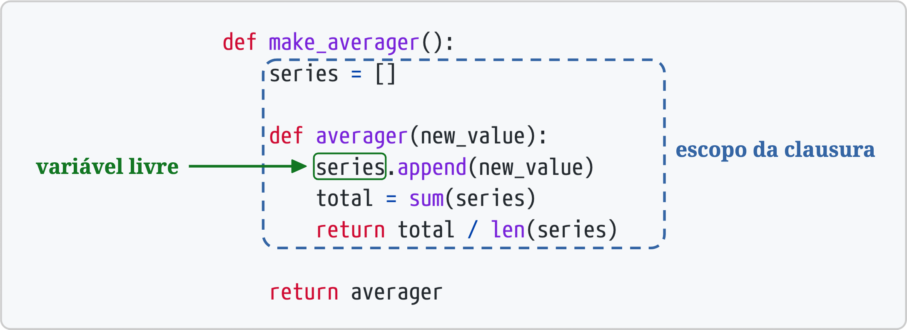

[[ch_closure_decorator]]
== Decoradores e Clausuras
:example-number: 0
:figure-number: 0

[quote, PEP 318—Decorators for Functions and Methods ("Decoradores para Funções e Métodos"—EN)]
____
Houve uma certa quantidade de reclamações sobre a escolha do nome "decorador"
para esse recurso. A mais frequente foi sobre o nome não ser consistente com seu
uso no livro da GoF.footnote:[GoF se refere ao livro __Design Patterns__
(traduzido no Brasil como _"Padrões de Projeto"_), de 1985. Seus quatro
autores ficaram conhecidos como a "Gang of Four" (_Gangue dos Quatro_).] O nome
++decorator++ provavelmente se origina de seu uso no âmbito dos
compiladores--uma árvore sintática é percorrida e anotada.
____

Decoradores de função((("decorators and closures", "purpose of"))) nos permitem
"marcar" funções no código-fonte, para aprimorar de alguma forma seu
comportamento. É um mecanismo muito poderoso. Por exemplo, o decorador
`@functools.cache` armazena um mapeamento de argumentos para resultados, e
depois usa esse mapeamento para evitar computar novamente o resultado quando a
função é chamada com argumentos já vistos. Isso pode acelerar muito uma
aplicação.

Para dominar esse recurso, é preciso antes entender clausuras (_closures_)—
nome dado à estrutura onde uma função captura variáveis presentes no escopo onde
a função é definida, necessárias para a execução da função
futuramente.footnote:[NT: Adotamos a tradução "clausura" para "closure".
O termo em inglês é pronunciado "clôujure", e o nome da linguagem Clojure brinca
com esse fato. Alguns autores usam "fechamento", mas esta é uma tradução de
"closure" no contexto da teoria dos conjuntos que não tem relação com "closure"
na teoria de linguagens de programação. Gosto da palavra clausura por uma
analogia cultural: em alguns conventos, a clausura é um espaço fechado onde 
freiras vivem em isolamento. Suas memórias são seu único vínculo com o exterior,
mas elas retratam o mundo do passado. Em programação, uma clausura é um espaço
isolado onde a função tem acesso a variáveis que existiam quando a própria
função foi criada, variáveis de um escopo que não existe mais, preservadas
apenas na memória clausura.]

A palavra reservada mais obscura de Python é `nonlocal`, introduzida no Python
3.0. É perfeitamente possível ter uma vida produtiva e lucrativa programando em
Python sem jamais usá-la, seguindo uma dieta estrita de orientação a objetos
centrada em classes. Entretanto, caso queira implementar seus próprios
decoradores de função, precisa entender clausuras, e então a necessidade de
`nonlocal` fica evidente.

Além de sua aplicação aos decoradores, clausuras também são essenciais para
qualquer tipo de programação utilizando _callbacks_, e para codar em um estilo
funcional quando isso fizer sentido.

O((("decorators and closures", "topics covered"))) objetivo final deste
capítulo é explicar exatamente como funcionam os decoradores de função, desde
simples decoradores de registro até os complicados decoradores parametrizados.
Mas antes de chegar a esse objetivo, precisamos tratar de:

* Como Python analisa a sintaxe de decoradores
* Como Python decide se uma variável é local
* Por que clausuras existem e como elas funcionam
* Qual problema é resolvido por `nonlocal`

Após criar essa base, chegaremos aos decoradores:

* Como implementar um decorador bem comportado
* Decoradores poderosos da biblioteca padrão: `@cache` e `@singledispatch`
* Como implementar um decorador parametrizado

=== Novidades neste capítulo

Nesta((("decorators and closures", "significant changes to"))) edição,
apresento o decorador de _caching_ `functools.cache` do Python
3.9 antes do `functools.lru_cache`, que é mais antigo.
A <<lru_cache_sec>> apresenta também o uso de `lru_cache`
sem argumentos, uma novidade do Python 3.8.

Expandi a <<generic_functions_sec>> para incluir dicas de tipo, a sintaxe
recomendada para usar `functools.singledispatch` desde o Python 3.7.

A <<parameterized_dec_sec>> agora inclui o <<clockdeco_param_cls_ex>>,
que usa uma classe e não uma clausura para implementar um decorador.

Começamos com a introdução aos decoradores mais suave que consegui imaginar.

=== Introdução aos decoradores

Um((("decorators and closures", "decorator basics", id="DACbasic09"))) decorador
é um invocável que recebe outra função como um argumento (a função decorada).

Um decorador pode executar algum processamento com a função decorada, e pode
devolver a mesma função ou substituí-la por outra função ou objeto invocável.footnote:[Se
você substituir "função" por "classe" na sentença anterior, o resultado é uma
descrição resumida do papel de um decorador de classe, assunto que veremos no
<<ch_class_metaprog>>.]

Em outras palavras, supondo a existência de uma função decoradora
chamada `decorate`, este código:

[source, python]
----
@decorate
def target():
    print('running target()')
----

tem o mesmo efeito de:

[source, python]
----
def target():
    print('running target()')

target = decorate(target)
----

O resultado final é o mesmo: após a execução de qualquer um destes exemplos,
o nome `target` está vinculado a qualquer que seja a função devolvida por
`decorate(target)`—que tanto pode ser a função inicialmente chamada `target`
quanto uma outra função diferente.

Para confirmar que a função decorada é substituída, veja a sessão de console no
<<decorator_replaces>>.

[[decorator_replaces]]
.Um decorador normalmente substitui uma função por outra, diferente
====
[source, python]
----
>>> def deco(func):
...     def inner():
...         print('running inner()')
...     return inner  <1>
...
>>> @deco
... def target():  <2>
...     print('running target()')
...
>>> target()  <3>
running inner()
>>> target  <4>
<function deco.<locals>.inner at 0x10063b598>
----
====
<1> `deco` devolve seu objeto função `inner`.
<2> `target` é decorada por `deco`.
<3> Invocar a `target` decorada causa, na verdade, a execução de `inner`.
<4> A inspeção revela que `target` é agora uma referência a `inner`.

Estritamente falando, decoradores são apenas açúcar sintático. Como vimos, é
sempre possível chamar um decorador como um invocável normal, passando outra
função como parâmetro. Algumas vezes isso inclusive é conveniente, especialmente
quando estamos fazendo _metaprogramação_—mudando o comportamento de um programa
durante a execução.

Três fatos essenciais sobre decoradores:

. Um decorador é uma função ou outro invocável.
. Um decorador pode, opcionalmente, substituir a função decorada por outra.
. Decoradores são executados assim que um módulo é carregado.

Vamos agora nos concentrar nesse terceiro ponto.((("", startref="DACbasic09")))

=== Quando Python executa decoradores

Uma((("decorators and closures", "decorator execution")))((("import time versus
runtime"))) característica fundamental dos decoradores é serem executados logo
após a função decorada ser definida. Isso normalmente acontece no
momento da importação (_import time_), ou seja, quando um módulo é carregado pelo Python.
Observe _registration.py_ no <<registration_ex>>.

[[registration_ex]]
.O módulo registration.py
====
[source, python]
----
include::../code/09-closure-deco/registration.py[tags=REGISTRATION]
----
====
<1> `registry` vai armazenar referências para funções decoradas por `@register`.
<2> `register` recebe uma função como argumento.
<3> Exibe a função que está sendo decorada, para demonstração.
<4> Insere `func` em `registry`.
<5> É obrigatório devolver uma função;
aqui devolvemos a mesma função recebida como argumento.
<6> `f1` e `f2` são decoradas por `@register`.
<7> `f3` não é decorada.
<8> `main` exibe `registry`, depois chama `f1()`, `f2()`, e `f3()`.
<9> `main()` só é invocada se _registration.py_ for executado como um script.

O resultado da execução de _registration.py_ é assim:

----
$ python3 registration.py
running register(<function f1 at 0x100631bf8>)
running register(<function f2 at 0x100631c80>)
running main()
registry -> [<function f1 at 0x100631bf8>, <function f2 at 0x100631c80>]
running f1()
running f2()
running f3()
----

Observe que `register` roda (duas vezes) antes de qualquer outra função no
módulo. Quando `register` é chamada, ela recebe o objeto função a ser decorado
como argumento—por exemplo, `<function f1 at 0x100631bf8>`.

Após o carregamento do módulo, a lista `registry` contém referências para as
duas funções decoradas: `f1` e `f2`. Essas funções, bem como `f3`, são executadas
apenas quando chamadas explicitamente por `main`.

Se _registration.py_ for importado (e não executado como um script), a saída é
essa:

[source, python]
----
>>> import registration
running register(<function f1 at 0x10063b1e0>)
running register(<function f2 at 0x10063b268>)
----

Nesse momento, se você inspecionar `registry`, verá isso:

[source, python]
----
>>> registration.registry
[<function f1 at 0x10063b1e0>, <function f2 at 0x10063b268>]
----

O ponto central do <<registration_ex>> é enfatizar que decoradores de função são
executados assim que o módulo é importado, mas as funções decoradas só rodam
quando são invocadas explicitamente. Isso ressalta a diferença entre o
_momento da importação_ e o _momento da execução_
na operação de um módulo em Python.

[[registration_deco_sec]]
=== Decoradores de registro

Considerando((("decorators and closures", "registration
decorators")))((("registration decorators"))) a forma como decoradores são
normalmente usados em código do mundo real, o <<registration_ex>> é incomum por
dois motivos:

* A função do decorador é definida no mesmo módulo das funções decoradas.
Tipicamente, um decorador é definido em um módulo de uma biblioteca 
e aplicado a funções de outros módulos de bibliotecas ou aplicações.
* O decorador `register` devolve a mesma função recebida como
argumento. Na prática, a maior parte dos decoradores define e devolve uma função
interna.

Apesar do decorador `register` no <<registration_ex>> devolver a função decorada
inalterada, esta técnica não é inútil. Decoradores parecidos são usados por muitos
frameworks Python para adicionar funções a um registro central—por exemplo, um
registro mapeando padrões de URLs para funções que geram respostas HTTP. Tais
decoradores de registro podem ou não modificar as funções decoradas.

Vamos ver um decorador de registro em ação na <<decorated_strategy>> (<<ch_design_patterns>>).

A maioria dos decoradores modifica a função decorada. Eles normalmente fazem
isso definindo e devolvendo uma função interna para substituir a função
decorada. Código que usa funções internas quase sempre depende de clausuras para
operar corretamente. Para entender as clausuras, precisamos dar um passo atrás e
revisar como o escopo de variáveis funciona no Python.

=== Regras de escopo de variáveis

No((("decorators and closures", "variable scope rules",
id="DACvars09")))((("variable scope rules", id="vsr09")))((("scope",
"variable scope rules", id="Svsr09"))) <<ex_global_undef>>, definimos e testamos uma
função que lê duas variáveis: uma variável local `a`—definida como parâmetro de
função—e a variável `b`, que não é definida em lugar algum na função.

[[ex_global_undef]]
.Função lendo uma variável local e uma variável global
====
[source, python]
----
>>> def f1(a):
...     print(a)
...     print(b)
...
>>> f1(3)
3
Traceback (most recent call last):
  File "<stdin>", line 1, in <module>
  File "<stdin>", line 3, in f1
NameError: global name 'b' is not defined
----
====

O erro obtido não é surpreendente. Continuando do <<ex_global_undef>>, se
atribuirmos um valor a um `b` global e então chamarmos `f1`, funciona:

[source, python]
----
>>> b = 6
>>> f1(3)
3
6
----

Agora vamos ver um exemplo que pode ser surpreendente.

Leia com atenção a função `f2`, no <<ex_local_unbound>>. As primeiras duas linhas
são as mesmas da `f1` do <<ex_global_undef>>, e então ela faz uma atribuição a
`b`. Mas para com um erro no segundo `print`, antes da atribuição ser executada.

[[ex_local_unbound]]
.A variável `b` é local, porque um valor é atribuído a ela no corpo da função
====
[source, python]
----
>>> b = 6
>>> def f2(a):
...     print(a)
...     print(b)
...     b = 9
...
>>> f2(3)
3
Traceback (most recent call last):
  File "<stdin>", line 1, in <module>
  File "<stdin>", line 3, in f2
UnboundLocalError: local variable 'b' referenced before assignment
----
====

Observe que a saída começa com `3`, provando que o comando `print(a)` foi
executado. Mas o segundo, `print(b)`, nunca roda. Quando vi isso pela primeira
vez, me espantei. Achei que o `6` seria exibido, pois há uma variável
global `b`, e a atribuição para a variável local `b` ocorre após `print(b)`.

Mas quando Python compila o corpo da função, ele decide que `b` é
uma variável local, por ser atribuída dentro da função. O bytecode gerado
reflete essa decisão. O código tentará acessar `b` no escopo local. Mais tarde, quando a
chamada `f2(3)` acontece, o corpo de `f2` obtém e exibe o valor da variável
local `a`, mas ao tentar obter o valor da variável local `b`, descobre que `b`
não está vinculado a nada.

Isso não é um bug, mas uma escolha de projeto:
Python não exige que você declare variáveis,
mas assume que uma variável que recebe uma atribuição no corpo de uma função
é uma variável local.
Isso é muito melhor que o comportamento de Javascript, que também não requer
declarações de variáveis, mas se você esquecer de declarar uma variável como
local (com `var`), pode acabar alterando uma variável global por acidente.

Se queremos que o interpretador trate `b` como uma variável global e também
atribuir um novo valor a ela dentro da função, usamos a declaração `global`:

[source, python]
----
>>> b = 6
>>> def f3(a):
...     global b
...     print(a)
...     print(b)
...     b = 9
...
>>> f3(3)
3
6
>>> b
9
----

Nos exemplos anteriores, vimos dois escopos em ação:

O escopo global do módulo:: Composto((("scope", "module global scope"))) por
nomes atribuídos a valores fora de qualquer bloco de classe ou função.

O escopo local da função f3:: Composto((("scope", "function local scope"))) por
nomes atribuídos a valores como parâmetros, ou diretamente no corpo da função.

Há um outro escopo de onde variáveis podem vir, chamado _nonlocal_, e ele é
fundamental para clausuras; vamos tratar disso em breve.

Agora que vimos como o escopo de variáveis funciona no Python, podemos
enfrentar as clausuras na <<closures_sec>>.
Se tiver curiosidade sobre as diferenças no bytecode das funções no <<#ex_global_undef>>
e no <<#ex_local_unbound>>, veja o quadro a seguir.((("",
startref="DACvars09")))((("", startref="vsr09")))((("", startref="Svsr09")))

.Comparando bytecodes
****

O((("dis module")))((("bytecode, disassembling")))((("functions", "disassembling bytecode of")))
módulo `dis` descompila o bytecode de funções.
Leia no <<#ex_f1_dis>> e no <<#ex_f2_dis>> os
bytecodes de `f1` e `f2`, do <<#ex_global_undef>> e do <<#ex_local_unbound>>,
respectivamente.

[[ex_f1_dis]]
.Bytecode da função `f1` do <<ex_global_undef>>
====
[source, python]
----
>>> from dis import dis
>>> dis(f1)
  2          0 LOAD_GLOBAL         0 (print)  <1>
             3 LOAD_FAST           0 (a)  <2>
             6 CALL_FUNCTION       1 (1 positional, 0 keyword pair)
             9 POP_TOP

  3         10 LOAD_GLOBAL         0 (print)
            13 LOAD_GLOBAL         1 (b)  <3>
            16 CALL_FUNCTION       1 (1 positional, 0 keyword pair)
            19 POP_TOP
            20 LOAD_CONST          0 (None)
            23 RETURN_VALUE
----
====
<1> Carrega o nome global `print`.
<2> Carrega o nome local `a`.
<3> Carrega o nome global `b`.

Compare o bytecode de `f1`, visto no <<ex_f1_dis>> acima, com o bytecode de `f2` no <<ex_f2_dis>>.

[[ex_f2_dis]]
.Bytecode da função `f2` do <<ex_local_unbound>>
====
[source, python]
----
>>> dis(f2)
  2          0 LOAD_GLOBAL         0 (print)
             3 LOAD_FAST           0 (a)
             6 CALL_FUNCTION       1 (1 positional, 0 keyword pair)
             9 POP_TOP

  3         10 LOAD_GLOBAL         0 (print)
            13 LOAD_FAST           1 (b)  <1>
            16 CALL_FUNCTION       1 (1 positional, 0 keyword pair)
            19 POP_TOP

  4         20 LOAD_CONST          1 (9)
            23 STORE_FAST          1 (b)
            26 LOAD_CONST          0 (None)
            29 RETURN_VALUE
----
====
<1> Carrega o nome _local_ `b`. Isso mostra que o compilador considera `b` uma
variável local, mesmo com uma atribuição a `b` ocorrendo mais tarde, porque a
natureza da variável—se ela é ou não local—não pode mudar no corpo da função.

A máquina virtual (VM) do CPython que executa o bytecode é uma máquina de pilha
(_stack machine_), então as operações `LOAD` e `POP` se referem à pilha. A descrição
mais detalhada dos opcodes de Python está além da finalidade desse livro, mas
eles estão documentados com o módulo, em
https://fpy.li/5x["dis—Disassembler de bytecode de Python"].

****

[[closures_sec]]
=== Clausuras

Na((("decorators and closures", "closure basics", id="DACclos09")))((("anonymous
functions"))) blogosfera, as clausuras são algumas vezes confundidas com funções
anônimas. Muita gente confunde por causa da história paralela destes conceitos:
definir funções dentro de outras funções se torna mais comum e conveniente quando
existem funções anônimas.
E clausuras só fazem sentido a partir do momento em que você tem funções aninhadas.
Daí que muitos aprendem as duas ideias ao mesmo tempo.

Na verdade, uma clausura é uma função—vamos chamá-la de `f`—com um escopo
estendido, incorporando variáveis acessadas no corpo de `f` que não são nem
variáveis globais nem variáveis locais de `f`. Tais variáveis devem vir do
escopo local de uma função externa que englobe `f`.

Não interessa se a função é anônima ou não; o que importa é que ela pode
acessar variáveis não-globais definidas fora de seu corpo.

É um conceito difícil de entender, melhor ilustrado por um exemplo.

Imagine uma função `avg`, para calcular a média de uma série de valores que
cresce continuamente; por exemplo, o preço diário de um produto
ao longo de toda a sua história. A cada dia, um novo preço é acrescentado,
e a média é computada levando em conta todos os preços até então.

Começando do zero, `avg` poderia ser usada assim:

[source, python]
----
>>> avg(10)
10.0
>>> avg(11)
10.5
>>> avg(12)
11.0
----

Como `avg` é definida, e onde fica o histórico com os valores anteriores?

Para começar, o <<ex_average_oo>> mostra uma implementação baseada em uma classe.

[[ex_average_oo]]
.average_oo.py: uma classe para calcular uma média cumulativa
====
[source, python]
----
class Averager():

    def __init__(self):
        self.series = []

    def __call__(self, new_value):
        self.series.append(new_value)
        total = sum(self.series)
        return total / len(self.series)
----
====

A classe `Averager` cria instâncias invocáveis:

[source, python]
----
>>> avg = Averager()
>>> avg(10)
10.0
>>> avg(11)
10.5
>>> avg(12)
11.0
----

O <<ex_average_fn>>, a seguir, é uma implementação funcional, usando a função de
ordem superior `make_averager`.

[[ex_average_fn]]
.average.py: uma função de ordem superior para a calcular uma média cumulativa
====
[source, python]
----
def make_averager():
    series = []

    def averager(new_value):
        series.append(new_value)
        total = sum(series)
        return total / len(series)

    return averager
----
====

Quando invocada, `make_averager` devolve um objeto função `averager`. Cada vez
que um `averager` é invocado, ele insere o argumento recebido na série, e
calcula a média atual, como mostra o <<ex_average_demo1>>.

[[ex_average_demo1]]
.Testando o <<ex_average_fn>>
====
[source, python]
----
>>> avg = make_averager()
>>> avg(10)
10.0
>>> avg(11)
10.5
>>> avg(15)
12.0
----
====

Note as semelhanças entre os dois exemplos: chamamos `Averager()` ou
`make_averager()` para obter um objeto invocável `avg`, que atualizará a série
histórica e calculará a média atual. No <<ex_average_oo>>, `avg` é uma instância
de `Averager`, no <<ex_average_fn>> é a função interna  `averager`. Nos dois
casos, basta chamar `avg(n)` para incluir `n` na série e obter a média
atualizada.

É óbvio onde o `avg` da classe `Averager` armazena o histórico: no atributo de
instância `self.series`. Mas onde a função `avg` no <<ex_average_fn>> encontra a
`series`?

Observe que `series` é uma variável local de `make_averager`, pois a atribuição
`series = []` acontece no corpo daquela função. Mas quando `avg(10)` é chamada,
`make_averager` já retornou, e seu escopo local não existe mais.

Dentro de `averager`, `series` é uma((("free variables")))((("variables",
"free"))) _variável livre_: uma variável que é mencionada mas não é
um parâmetro, e não tem uma atribuição no escopo local.
Esse termo técnico é essencial para entender
uma clausura. Veja a <<closure_fig>>.

[[closure_fig]]
.A clausura de `averager` estende o escopo daquela função para incluir a vinculação da variável livre `series`.

Podemos inspecionar o objeto `averager` para ver como Python armazena os nomes
das variáveis locais e variáveis livres no atributo `+__code__+`,
que representa o corpo compilado da função. O <<ex_average_demo2>> demonstra isso.

[[ex_average_demo2]]
.Inspecionando a função criada por `make_averager` no <<ex_average_fn>>
====
[source, python]
----
>>> avg.__code__.co_varnames
('new_value', 'total')
>>> avg.__code__.co_freevars
('series',)
----
====

O valor de `series` é armazenado no atributo `+__closure__+` da função 
`avg`. Cada item em `+avg.__closure__+` corresponde a um nome em `+__code__+`.
Esses itens são `cells`, e têm um atributo chamado `cell_contents`, onde o valor
real pode ser encontrado. O <<ex_average_demo3>> mostra esses atributos.

[[ex_average_demo3]]
.Continuando do <<ex_average_demo1>>
====
[source, python]
----
>>> avg.__code__.co_freevars
('series',)
>>> avg.__closure__
(<cell at 0x107a44f78: list object at 0x107a91a48>,)
>>> avg.__closure__[0].cell_contents
[10, 11, 12]
----
====

Resumindo: uma clausura é uma função que retém os vínculos das variáveis livres
que existem quando a função é definida, de forma que elas possam ser usadas mais tarde,
quando a função for invocada, mas o escopo de sua definição não puder mais ser acessado.

Note que a única situação na qual uma função pode ter de lidar com variáveis
externas não-globais é quando ela estiver aninhada dentro de outra função, e
aquelas variáveis sejam parte do escopo local da função externa.((("",
startref="DACclos09")))

[[nonlocal_sec]]
=== A declaração nonlocal

A((("decorators and closures", "nonlocal declarations",
id="DACnonlocal09")))((("nonlocal keyword", id="nonlocal09")))((("keywords",
"nonlocal keyword", id="Knon09"))) implementação anterior de `make_averager` funciona,
mas é ineficiente. No <<ex_average_fn>>, armazenamos todos os valores na série
histórica e calculamos sua `sum` cada vez que `averager` é invocada. Uma
implementação melhor armazenaria apenas o total e a contagem de itens até aquele
momento, e calcularia a média com esses dois números.

O <<ex_average_broken>> é uma implementação errada, apenas para ilustrar.
Consegue ver onde o código quebra?

[[ex_average_broken]]
.Função de ordem superior incorreta para calcular uma média cumulativa sem armazenar todo o histórico
====
[source, python]
----
def make_averager():
    count = 0
    total = 0

    def averager(new_value):
        count += 1
        total += new_value
        return total / count

    return averager
----
====

Ao testar o <<ex_average_broken>>, o resultado é um erro:

[source, python]
----
>>> avg = make_averager()
>>> avg(10)
Traceback (most recent call last):
  ...
UnboundLocalError: local variable 'count' referenced before assignment
>>>
----

O problema é que a instrução `count += 1` significa o mesmo que
`count = count + 1`, quando `count` é um número ou qualquer tipo imutável.
Então, estamos realmente atribuindo um valor a `count` no corpo de `averager`,
e isso a torna uma variável local. O mesmo problema afeta a variável `total`.

Não tivemos esse problema no <<ex_average_fn>>, porque nunca atribuimos nada ao
nome `series`; apenas chamamos `series.append` e invocamos `sum` e `len` nele.
Nos valemos, então, do fato de listas serem mutáveis.

Mas com tipos imutáveis, como números, strings, tuplas, etc., só é possível ler,
nunca atualizar. Se você reatribuir, como em `count += 1`,
estará implicitamente criando uma variável local `count`. Ela não será mais uma
variável livre, e seu valor não será atualizado na clausura.

A palavra reservada `nonlocal` foi introduzida no Python 3 para contornar esse
problema. Ela permite declarar uma variável livre, mesmo quando
a variável é atribuída dentro da função. Se um novo valor é atribuído a uma variável
`nonlocal`, o valor armazenado na clausura é atualizado. 
O <<ex_average_fixed>> é a implementação correta da versão otimizada de `make_averager`.

[[ex_average_fixed]]
.Calcula uma média cumulativa sem armazenar todo o histórico
====
[source, python]
----
def make_averager():
    count = 0
    total = 0

    def averager(new_value):
        nonlocal count, total
        count += 1
        total += new_value
        return total / count

    return averager
----
====

Após estudar o `nonlocal`, podemos resumir como a consulta de variáveis funciona
no Python.

[[var_lookup_logic_sec]]
==== A lógica do acesso a variáveis

Quando((("variables", "lookup logic"))) uma função é definida, o compilador de
bytecode de Python determina como encontrar uma variável `x` que aparece na
função, baseado nas seguintes regras:footnote:[Agradeço ao revisor técnico
Leonardo Rochael por sugerir esse resumo.]

* Se há uma declaração `global x`, então `x` está vinculada à variável global `x`
do módulo.footnote:[Python não tem um escopo global de programa, apenas escopos globais de módulos.]
* Se há uma declaração `nonlocal x`, então `x` está vinculada à variável local `x` na função circundante mais próxima de onde `x` for definida.
* Se `x` é um parâmetro ou tem um valor atribuído a si no corpo da função, então `x` é uma variável local.
* Se `x` é referenciada mas não atribuída, e não é um parâmetro:
** `x` será procurada nos escopos locais do corpos das funções circundantes (os escopos não-locais).
** Se `x` não for encontrada nos escopos circundantes, será lida do escopo global do módulo.
** Se `x` não for encontrada no escopo global, será lida de `+__builtins__.__dict__+`.

Tendo visto as clausuras de Python, podemos agora implementar decoradores com funções
aninhadas.((("", startref="DACnonlocal09")))((("", startref="nonlocal09")))((("", startref="Knon09")))

=== Implementando um decorador simples

O <<ex_clockdeco0>> é((("decorators and closures", "decorator implementation",
id="DACdecimp09"))) um decorador que cronometra cada invocação da função
decorada e exibe o tempo decorrido, os argumentos passados, e o resultado da
chamada.

[[ex_clockdeco0]]
._clockdeco0.py_: decorador simples que mostra o tempo de execução de funções
====
[source, python]
----
include::../code/09-closure-deco/clock/clockdeco0.py[]
----
====
<1> Define a função interna `clocked` para aceitar qualquer número de argumentos posicionais.
<2> Essa linha só funciona porque a clausura de `clocked` engloba a variável livre `func`.
<3> Devolve a função interna para substituir a função decorada.

O <<ex_clockdeco_demo>> demonstra o uso do decorador `clock`.

[[ex_clockdeco_demo]]
.Usando o decorador `clock`
====
[source, python]
----
include::../code/09-closure-deco/clock/clockdeco_demo.py[]
----
====

O resultado da execução do <<ex_clockdeco_demo>> é o seguinte:

[source]
----
$ python3 clockdeco_demo.py
**************************************** Calling snooze(.123)
[0.12363791s] snooze(0.123) -> None
**************************************** Calling factorial(6)
[0.00000095s] factorial(1) -> 1
[0.00002408s] factorial(2) -> 2
[0.00003934s] factorial(3) -> 6
[0.00005221s] factorial(4) -> 24
[0.00006390s] factorial(5) -> 120
[0.00008297s] factorial(6) -> 720
6! = 720
----

==== Como isso funciona

Lembre-se de que esse código:

[source, python]
----
@clock
def factorial(n):
    return 1 if n < 2 else n*factorial(n-1)
----

na verdade faz isso:

[source, python]
----
def factorial(n):
    return 1 if n < 2 else n*factorial(n-1)

factorial = clock(factorial)
----

Então, nos dois exemplos, `clock` recebe a função `factorial` como seu argumento
`func` (veja o <<ex_clockdeco0>>). Ela então cria e devolve a função `clocked`,
que o interpretador Python atribui a `factorial` (no primeiro exemplo, por baixo
dos panos). De fato, se você importar o módulo `clockdeco_demo` e verificar o
`+__name__+` de `factorial`, verá isso:

[source, python]
----
>>> import clockdeco_demo
>>> clockdeco_demo.factorial.__name__
'clocked'
>>>
----

O nome `factorial` agora é uma referência para a função `clocked`. Daqui por
diante, cada vez que `factorial(n)` for invocada, `clocked(n)` será executada.
Essencialmente, `clocked` faz o seguinte:

. Registra o tempo inicial `t0`.
. Chama a função `factorial` original, salvando o resultado.
. Computa o tempo decorrido.
. Formata e exibe os dados coletados.
. Devolve o resultado salvo no passo 2.

Esse é o comportamento típico de um decorador: ele substitui a função decorada
com uma nova função que aceita os mesmos argumentos e (normalmente) devolve o
que quer que a função decorada deveria devolver, enquanto realiza também algum
processamento adicional.

[TIP]
====
Em _Padrões de Projetos_, de Gamma et al., a descrição curta do padrão decorador
começa assim: "Atribui dinamicamente responsabilidades adicionais a um objeto."
Decoradores de função se encaixam nessa descrição. Mas, no nível da
implementação, os decoradores de Python guardam pouca semelhança com o decorador
clássico descrito no _Padrões de Projetos_ original.
No _<<closures_soapbox>>_ escrevi mais sobre esse assunto.
====

O decorador `clock` implementado no <<ex_clockdeco0>> tem alguns defeitos: ele
não aceita argumentos nomeados, e encobre o `+__name__+` e o `+__doc__+` da
função decorada. O <<ex_clockdeco2>> usa o decorador `functools.wraps` para
copiar os atributos relevantes de `func` para `clocked`.
Nesta nova versão, os argumentos nomeados também são tratados corretamente.

[[ex_clockdeco2]]
._clockdeco.py_: um decorador `clock` melhorado
====
[source, python]
----
include::../code/09-closure-deco/clock/clockdeco.py[]
----
====

O `functools.wraps` é apenas um dos decoradores prontos para uso da biblioteca
padrão. Na próxima seção, veremos o decorador mais útil oferecido por
`functools`: `cache`.((("", startref="DACdecimp09")))

=== Decoradores na biblioteca padrão

Python((("decorators and closures", "decorators in Python standard library",
id="DACstandard09"))) tem três funções embutidas projetadas para decorar
métodos: `property`, `classmethod` e `staticmethod`. Vamos discutir `property`
na <<prop_validation_sec>> e os outros na <<classmethod_x_staticmethod_sec>>.

No <<ex_clockdeco2>> vimos outro decorador importante: `functools.wraps`, um
auxiliar na criação de decoradores bem comportados. Três dos decoradores mais
interessantes da biblioteca padrão são `cache`, `lru_cache` e
`singledispatch`—todos do módulo `functools`. Falaremos deles a seguir.

[[memoization_sec]]
==== Memoização com functools.cache

O((("memoization", id="memoiz09")))((("functools module", "functools.cache
decorator", id="functool09"))) decorador `functools.cache` implementa
_memoização_:footnote:[Esclarecendo, isso não é um erro de ortografia:
https://fpy.li/9-2[_memoization_] é um termo da ciência da computação vagamente
relacionado a "memorização", mas não idêntico.] uma técnica de otimização que
armazena os resultados de invocações de uma função dispendiosa em um _cache_,
evitando repetir o processamento para argumentos previamente utilizados.

Uma boa demonstração é aplicar `@cache` à função recursiva, e dolorosamente
lenta, que gera o __enésimo__ número da sequência de Fibonacci, como mostra o
<<ex_fibo_demo>>.

[[ex_fibo_demo]]
.Algoritmo recursivo e ridiculamente dispendioso para calcular o enésimo número na série de Fibonacci
====
[source, python]
----
include::../code/09-closure-deco/fibo_demo.py[]
----
====

Aqui está o resultado da execução de _fibo_demo.py_. Exceto pela última linha,
toda a saída é produzida pelo decorador `clock`:

[source, text]
----
$ python3 fibo_demo.py
[0.00000042s] fibonacci(0) -> 0
[0.00000049s] fibonacci(1) -> 1
[0.00006115s] fibonacci(2) -> 1
[0.00000031s] fibonacci(1) -> 1
[0.00000035s] fibonacci(0) -> 0
[0.00000030s] fibonacci(1) -> 1
[0.00001084s] fibonacci(2) -> 1
[0.00002074s] fibonacci(3) -> 2
[0.00009189s] fibonacci(4) -> 3
[0.00000029s] fibonacci(1) -> 1
[0.00000027s] fibonacci(0) -> 0
[0.00000029s] fibonacci(1) -> 1
[0.00000959s] fibonacci(2) -> 1
[0.00001905s] fibonacci(3) -> 2
[0.00000026s] fibonacci(0) -> 0
[0.00000029s] fibonacci(1) -> 1
[0.00000997s] fibonacci(2) -> 1
[0.00000028s] fibonacci(1) -> 1
[0.00000030s] fibonacci(0) -> 0
[0.00000031s] fibonacci(1) -> 1
[0.00001019s] fibonacci(2) -> 1
[0.00001967s] fibonacci(3) -> 2
[0.00003876s] fibonacci(4) -> 3
[0.00006670s] fibonacci(5) -> 5
[0.00016852s] fibonacci(6) -> 8
8
----

O desperdício é óbvio: `fibonacci(1)` é chamada oito vezes, `fibonacci(2)` cinco vezes, etc.
Mas acrescentar apenas duas linhas, para usar `cache`, melhora muito o desempenho. Veja o <<fibo_demo_cache_ex>>.

[[fibo_demo_cache_ex]]
.Implementação mais rápida, usando _caching_
====
[source, python]
----
include::../code/09-closure-deco/fibo_demo_cache.py[]
----
====
<1> Essa linha funciona com Python 3.9 ou posterior.
Veja a <<lru_cache_sec>> para uma alternativa que suporta versões anteriores de Python.
<2> Esse é um exemplo de decoradores empilhados:
`@cache` é aplicado à função devolvida por `@clock`.

[[stacked_decorators_tip]]
.Decoradores empilhados
[TIP]
====
Para((("stacked decorators"))) entender os decoradores empilhados (_stacked decorators_),
lembre-se de que `@` é açúcar sintático para aplicar a função decoradora à função
abaixo dela. Se houver mais de um decorador, eles se comportam como
invocações aninhadas.

Este código...

[source, python]
----
@alpha
@beta
def my_fn():
    ...
----

...faz o mesmo que este:

[source, python]
----
my_fn = alpha(beta(my_fn))
----

Em outras palavras, o decorador `beta` é aplicado primeiro, e a função devolvida
por ele é então passada para `alpha`.

====

Usando o `cache` no <<fibo_demo_cache_ex>>, a função `fibonacci` é chamada
apenas uma vez para cada valor de `n`:

[source, text]
----
$ python3 fibo_demo_lru.py
[0.00000043s] fibonacci(0) -> 0
[0.00000054s] fibonacci(1) -> 1
[0.00006179s] fibonacci(2) -> 1
[0.00000070s] fibonacci(3) -> 2
[0.00007366s] fibonacci(4) -> 3
[0.00000057s] fibonacci(5) -> 5
[0.00008479s] fibonacci(6) -> 8
8
----

Em outro teste, para calcular `fibonacci(30)`, o <<fibo_demo_cache_ex>> fez as
31 chamadas necessárias em 0,00017s (tempo total), enquanto o <<ex_fibo_demo>>
sem cache, demorou 12,09s em um notebook Intel Core i7, porque chamou
`fibonacci(1)` 832.040 vezes, num total de 2.692.537 chamadas!

Todos os argumentos recebidos pela função decorada devem ser _hashable_,
pois o _cache_ usa um `dict` para armazenar os resultados, e as chaves
são formadas pelos argumentos posicionais e nomeados usados nas chamadas.

Além de tornar viáveis esses algoritmos recursivos tolos, `@cache` brilha de
verdade em aplicações que precisam buscar informações de APIs remotas.

[WARNING]
====
O `functools.cache` pode consumir toda a memória disponível, se houver um número
muito grande de itens no cache. Eu o considero mais adequado para scripts
rápidos de linha de comando. Para processos de longa duração, recomendo usar
`functools.lru_cache` com um parâmetro `maxsize` adequado, como explicado na
próxima seção.((("", startref="DACstandard09")))((("",
startref="memoiz09")))((("", startref="functool09")))
====

[[lru_cache_sec]]
==== Usando o lru_cache

O((("functools module", "functools.lru_cache function"))) decorador
`functools.cache` é, na realidade, um mero invólucro em torno da antiga função
`functools.lru_cache`, que é mais flexível e também compatível com
versões anteriores ao Python 3.9.

A maior vantagem de `@lru_cache` é a possibilidade de limitar seu uso de memória
através do parâmetro `maxsize`, que tem um default bastante pequeno: 128.
Isso significa que o cache pode armazenar no máximo 128 resultados.

LRU((("Least Recently Used (LRU)"))) é a sigla de _Least Recently Used_
("Usado Menos Recentemente"). Significa que registros que há algum
tempo não são lidos, são descartados para dar lugar a novos itens.

Desde o Python 3.8, `lru_cache` pode ser aplicado de duas formas.
Esta é a forma mais simples:

[source, python]
----
@lru_cache
def função_dispendiosa(a, b):
    ...
----

A outra forma é invocá-lo como uma função,
com `()` (funciona desde o Python 3.2):

[source, python]
----
@lru_cache()
def função_dispendiosa(a, b):
    ...
----

Nos dois casos, os parâmetros default seriam utilizados.
São eles:

`maxsize=128`::
    Estabelece o número máximo de registros a serem armazenados.
    Após o cache estar cheio, o registro menos recentemente usado é descartado,
    para dar lugar a cada novo item.
    Para um desempenho ótimo, `maxsize` deve ser uma potência de 2.
    Se você passar `maxsize=None`, a lógica LRU é desabilitada e o cache funciona mais rápido,
    mas os itens nunca são descartados, podendo levar a um consumo excessivo de memória.
    É assim que o `@functools.cache` funciona.

`typed=False`::
    Determina se os resultados de diferentes tipos de argumentos devem ser armazenados separadamente.
    Por exemplo, na configuração default,
    argumentos inteiros e de ponto flutuante considerados iguais são armazenados apenas uma vez.
    Assim, haverá apenas uma entrada para as chamadas `f(1)` e `f(1.0)`.
    Se `typed=True`, aqueles argumentos produziriam registros diferentes,
    possivelmente armazenando resultados distintos.

Eis um exemplo de invocação de `@lru_cache` com parâmetros diferentes dos defaults:

[source, python]
----
@lru_cache(maxsize=2**20, typed=True)
def costly_function(a, b):
    ...
----

Vamos agora examinar outro decorador poderoso: `functools.singledispatch`.

[[generic_functions_sec]]
==== Funções genéricas com despacho único

Imagine((("single dispatch generic functions",
id="singlegen09")))((("functions", "single dispatch generic functions",
id="Fsingle09")))((("generic functions, single dispatch", id="genfunc09"))) que
estamos criando uma ferramenta para depurar aplicações web. Queremos gerar
código HTML para tipos diferentes de objetos Python.

Poderíamos começar com uma função como essa:

[source, python]
----
import html

def htmlize(obj):
    content = html.escape(repr(obj))
    return f'<pre>{content}</pre>'
----

Isso funcionará para qualquer tipo de objeto, mas agora queremos estender a
função para gerar HTML específico para determinados tipos. Alguns exemplos
seriam:

`str`:: Substituir os caracteres de mudança de linha na string por `' \n'` e
usar tags `
` em vez de `<pre>`.

`int`:: Mostrar o número em formato decimal e hexadecimal (com um caso especial
para `bool`).

`list`:: Gerar uma lista em HTML, formatando cada item de acordo com seu tipo.

`float` e `Decimal`:: Mostrar o valor como de costume, mas também na forma de
fração (por que não?).

O comportamento que desejamos aparece no <<singledispatch_demo>>.

[[singledispatch_demo]]
.`htmlize()` gera HTML adaptado para diferentes tipos de objetos
====
[source, python]
----
include::../code/09-closure-deco/htmlizer.py[tags=HTMLIZE_DEMO]
----
====
<1> A função original é registrada para `object`,
então ela serve para capturar e tratar todos os tipos de argumentos
que não foram capturados pelas outras implementações.
<2> Objetos `str` também passam por escape de HTML,
mas são cercados por `

`, com quebras de linha ` ` inseridas antes de cada `'\n'`.
<3> Um `int` é exibido nos formatos decimal e hexadecimal, dentro de um bloco `<pre></pre>`.
<4> Cada item na lista é formatado de acordo com seu tipo,
e a sequência inteira é apresentada como uma lista HTML.
<5> Apesar de ser um subtipo de `int`, `bool` recebe um tratamento especial.
<6> Mostra `Fraction` como uma fração.
<7> Mostra `float` e `Decimal` com a fração equivalente aproximada.

[[single_dispatch_sec]]
===== Despacho único de funções

Como não temos no Python a sobrecarga de métodos ao estilo de Java, não podemos
simplesmente criar variações de `htmlize` com assinaturas diferentes para cada
tipo de dado que queremos tratar de forma distinta. Uma solução possível em
Python seria transformar `htmlize` em uma função de despacho, com uma cadeia de
`if/elif/…` ou `match/case/…` chamando funções especializadas como
`htmlize_str`, `htmlize_int`, etc. Isso não é extensível pelos usuários de nosso
módulo, e é desajeitado: com o tempo, a função `htmlize` ficaria muito longa,
e o acoplamento entre ela e as funções especializadas seria forte demais.

O decorador((("functools module", "functools.singledispatch decorator",
id="functoolssingle09"))) `functools.singledispatch` permite que diferentes
módulos contribuam para a solução geral, e que você forneça facilmente funções
especializadas, mesmo para tipos pertencentes a pacotes externos que não possam
ser editados. Se você decorar uma função simples com `@singledispatch`, ela se
torna o ponto de entrada para uma _função genérica_: um grupo de funções que
executam a mesma operação de formas diferentes, dependendo do tipo do primeiro
argumento. Este é o significado do termo _single dispatch_ (despacho único).
Se mais argumentos fossem usados para selecionar a função específica,
teríamos despacho múltiplo (_multiple dispatch_), um recurso nativo em
linguagens como Common Lisp, Julia e C#.

O <<singledispatch_ex>> mostra como funciona o despacho único.

[WARNING]
====
`functools.singledispatch` existe desde o Python 3.4, mas só passou a suportar
a sintaxe com dicas de tipo no Python 3.7.
As últimas duas funções no <<singledispatch_ex>>
ilustram a sintaxe que funciona em todas as versões de Python desde a 3.4.
====

[[singledispatch_ex]]
.`@singledispatch` cria uma `@htmlize.register` customizada, para juntar várias funções em uma função genérica
====
[source, python]
----
include::../code/09-closure-deco/htmlizer.py[tags=HTMLIZE]
----
====
<1> `@singledispatch` marca a função base, que trata o tipo `object`.
<2> Cada função especializada é decorada com `@«base».register`.
<3> O tipo do primeiro argumento passado durante a execução determina
quando essa definição de função em particular será utilizada.
O nome das funções especializadas é irrelevante;
`_` é uma boa escolha para deixar isso claro.footnote:[Infelizmente,
o Mypy 0.770 reclama quando vê múltiplas funções com o mesmo nome.]
<4> Registra uma nova função para cada tipo que precisa de tratamento especial,
com uma dica de tipo correspondente no primeiro parâmetro.
<5> As ABCs em `numbers` são úteis para uso em conjunto com
`singledispatch`.footnote:[Apesar do alerta em <<numeric_tower_warning>>,
as ABCs de `numbers` não foram descontinuadas, e você as encontra em código de Python 3.]
<6> `bool` é um _subtipo-de_ `numbers.Integral`,
mas a lógica de `singledispatch` busca a implementação com o tipo correspondente mais específico,
independente da ordem na qual eles aparecem no código.
<7> Se você não quiser ou não puder adicionar dicas de tipo à função decorada,
você pode passar o tipo para o decorador `@«base».register`.
Essa sintaxe funciona em Python 3.4 ou posterior.
<8> O decorador `@«base».register` devolve a função sem decoração,
então é possível empilhá-los para registrar dois ou mais tipos na mesma
implementação.footnote:[Talvez algum dia seja possível expressar isso com
um único `@htmlize.register` sem parâmetros, e uma dica de tipo usando `Union`.
Mas quando tentei, Python gerou um `TypeError`
com uma mensagem dizendo que `Union` não é uma classe.
Então, apesar da _sintaxe_ da PEP 484 ser suportada, a _semântica_ ainda não chegou lá.]

Sempre que possível, registre as funções especializadas para tratar ABCs
(classes abstratas), como `numbers.Integral` e `abc.MutableSequence`, ao invés
das implementações concretas como `int` e `list`. Isso permite ao seu código
suportar uma variedade maior de tipos compatíveis. Por exemplo, uma extensão de
Python pode fornecer alternativas para o tipo `int` com número fixo de bits como
subclasses de `numbers.Integral`.footnote:[NumPy, por exemplo, implementa vários
tipos de https://fpy.li/9-3[números inteiros e de ponto flutuante] (EN) em
formatos voltados para a arquitetura da máquina.]

[TIP]
====
Usar ABCs ou `typing.Protocol` com `@singledispatch` permite que seu código
suporte classes existentes ou futuras que sejam subclasses reais ou virtuais
daquelas ABCs, ou que implementem aqueles protocolos. O uso de ABCs e o conceito
de uma subclasse virtual são assuntos do <<ch_ifaces_prot_abc>>.
====

Uma qualidade notável do mecanismo de `singledispatch` é que você pode registrar
funções especializadas em qualquer lugar do sistema, em qualquer módulo. Se mais
tarde você adicionar um módulo com um novo tipo definido pelo usuário, é fácil
acrescentar uma nova função específica para tratar aquele tipo. É possível
também escrever funções customizadas para classes que você não escreveu e não
pode modificar.

O `singledispatch` foi uma adição muito bem pensada à biblioteca padrão, e
oferece outras facilidades que não cabem neste livro. Uma boa
referência é a https://fpy.li/pep443[_PEP 443—Single-dispatch generic functions_]
mas ela não menciona o uso de dicas de tipo, que foram criadas depois.
A documentação do módulo `functools` foi melhorada e oferece um tratamento mais
atualizado, com vários exemplos na seção referente ao
https://fpy.li/5y[`singledispatch`].

[NOTE]
====

O `@singledispatch` não foi criado para trazer para Python a sobrecarga de
métodos no estilo de Java. Uma classe única com muitas variações sobrecarregadas
de um método é melhor que uma única função com uma longa sequência de blocos
`if/elif/elif/elif`. Mas as duas soluções concentram responsabilidade demais
em uma única unidade de código—a classe ou a função.
A vantagem de `@singledispatch` é seu suporte à extensão modular: cada módulo
pode registrar uma função especializada para cada tipo suportado. Em um caso de
uso realista, as implementações das funções genéricas não estariam todas no
mesmo módulo, como ocorre no <<singledispatch_ex>>.

====

Vimos decoradores recebendo argumentos, como `@lru_cache(maxsize=1024)` e o
`htmlize.register(float)` criado  por `@singledispatch` no
<<singledispatch_ex>>. A próxima seção mostra como criar decoradores com
parâmetros.((("", startref="singlegen09")))((("", startref="Fsingle09")))((("",
startref="genfunc09")))((("", startref="functoolssingle09")))

[[parameterized_dec_sec]]
=== Decoradores parametrizados

Ao((("decorators and closures", "parameterized decorators",
id="DACparam09")))((("parameterized decorators", id="paramdec09"))) analisar um
decorador no código-fonte, Python passa a função decorada como primeiro
argumento para a função do decorador. Mas como fazemos um decorador aceitar
outros argumentos? A resposta é: criar uma fábrica de decoradores que recebe
aqueles argumentos e devolve um decorador, que é então aplicado à função a ser
decorada. Complicado? Sim. Mas vamos começar com um exemplo baseado no
decorador mais simples que vimos: `register` no <<registration_ex_repeat>>.

[[registration_ex_repeat]]
.O módulo registration.py resumido, do <<registration_ex>>, repetido aqui por conveniência
====
[source, python]
----
include::../code/09-closure-deco/registration_abridged.py[tags=REGISTRATION_ABRIDGED]
----
====

==== Um decorador de registro parametrizado

Para((("registration decorators", id="regdecor09"))) tornar mais fácil a
habilitação ou desabilitação do registro executado por `register`, faremos esse
último aceitar um parâmetro opcional `active` que, se `False`, não registra a
função decorada. Conceitualmente, a nova função `register` não é um decorador,
mas uma fábrica de decoradores. Quando chamada, ela devolve o decorador que será
realmente aplicado à função alvo.

[[registration_param_ex]]
.Para aceitar parâmetros, o novo decorador `register` precisa ser invocado como uma função
====
[source, python]
----
include::../code/09-closure-deco/registration_param.py[tags=REGISTRATION_PARAM]
----
====
<1> `registry` é agora um `set`, tornando mais rápido acrescentar ou remover funções.
<2> `register` recebe um argumento nomeado opcional.
<3> A função interna `decorate` é o verdadeiro decorador; observe como ela aceita uma função como argumento.
<4> Registra `func` apenas se o argumento `active` (obtido da clausura) for `True`.
<5> Se `active` é falso, remove a função (sem efeito se a função não está no `set`).
<6> Como `decorate` é um decorador, tem que devolver uma função.
<7> `register` é nossa fábrica de decoradores, então devolve `decorate`.
<8> A fábrica `@register` precisa ser invocada como uma função, com os parâmetros desejados.
<9> Mesmo se nenhum parâmetro for passado,
ainda assim `register` deve ser invocada como uma função: `@register()`
para criar e devolver o verdadeiro decorador, `decorate`.

O ponto central aqui é que `register()` devolve `decorate`, que então é aplicado
à função decorada.

O código do <<registration_param_ex>> está em um módulo _registration_param.py_.
Se o importarmos, veremos o seguinte:

[source, python]
----
>>> import registration_param
running register(active=False)->decorate(<function f1 at 0x10063c1e0>)
running register(active=True)->decorate(<function f2 at 0x10063c268>)
>>> registration_param.registry
[<function f2 at 0x10063c268>]
----

Veja como apenas a função `f2` aparece no `registry`; `f1` não aparece porque
`active=False` foi passado para a fábrica de decoradores `register`, então o
`decorate` aplicado a  `f1` não adiciona essa função a `registry`.

Se, ao invés de usar a sintaxe `@`, usarmos `register` como uma função regular,
a sintaxe necessária para decorar uma função `f` seria `register()(f)`, para
inserir `f` ao `registry`, ou `register(active=False)(f)`, para não inseri-la
(ou removê-la). Veja o <<registration_param_demo>> para uma demonstração da
adição e remoção de funções do `registry`.

[[registration_param_demo]]
.Usando o módulo registration_param listado no <<registration_param_ex>>
====
[source, python]
----
>>> from registration_param import *
running register(active=False)->decorate(<function f1 at 0x10073c1e0>)
running register(active=True)->decorate(<function f2 at 0x10073c268>)
>>> registry  # <1>
{<function f2 at 0x10073c268>}
>>> register()(f3)  # <2>
running register(active=True)->decorate(<function f3 at 0x10073c158>)
<function f3 at 0x10073c158>
>>> registry  # <3>
{<function f3 at 0x10073c158>, <function f2 at 0x10073c268>}
>>> register(active=False)(f2)  # <4>
running register(active=False)->decorate(<function f2 at 0x10073c268>)
<function f2 at 0x10073c268>
>>> registry  # <5>
{<function f3 at 0x10073c158>}
----
====
<1> Quando o módulo é importado, `f2` é inserida no `registry`.
<2> A expressão `register()` devolve `decorate`, que então é aplicado a `f3`.
<3> A linha anterior adicionou `f3` ao `registry`.
<4> Essa chamada remove `f2` do `registry`.
<5> Confirma que apenas `f3` permanece no `registry`.

O funcionamento de decoradores parametrizados é bastante complexo, e esse que
acabamos de discutir é mais simples que a maioria. Decoradores parametrizados em
geral substituem a função decorada, e sua construção exige um nível adicional de
aninhamento. Vamos agora explorar a arquitetura de uma dessas pirâmides de
funções.((("", startref="regdecor09")))

==== Um decorador parametrizado de cronometragem

Nesta((("clock decorators", "parameterized", id="CDparam09"))) seção vamos
revisitar o decorador `clock`, acrescentando um recurso: os usuários podem
passar uma string para formatar o relatório sobre a função cronometrada.
Veja o <<clockdeco_param_ex>>.

[NOTE]
====

Para simplificar, o <<clockdeco_param_ex>> está baseado na implementação inicial
de `clock` no <<ex_clockdeco0>>, e não na versão melhorada do
<<ex_clockdeco2>> que usa `@functools.wraps`, acrescentando assim mais uma
camada de função.

====

[[clockdeco_param_ex]]
.Módulo clockdeco_param.py: o decorador `clock` parametrizado
====
[source, python]
----
include::../code/09-closure-deco/clock/clockdeco_param.py[tags=CLOCKDECO_PARAM]
----
====
<1> Formato padrão da saída citando variáveis locais da função `clocked`.
<2> `clock` é a nossa fábrica de decoradores parametrizados.
<3> `decorate` é o verdadeiro decorador.
<4> `clocked` envolve a função decorada.
<5> `_result` é o resultado real da função decorada.
<6> `_args` armazena os verdadeiros argumentos de `clocked`, enquanto `args` é a `str` usada para exibição.
<7> `result` é a `str` que representa `_result`, para uso no formato.
<8> Usar `**locals()` aqui permite que qualquer variável local de `clocked` seja
referenciada em `fmt`.footnote:[O revisor técnico Miroslav Šedivý observou:
"Isso também quer dizer que analisadores de código-fonte (_linters_) vão
reclamar de variáveis não utilizadas, pois eles tendem a ignorar o uso de
`locals()`." Sim, esse é mais um exemplo de como ferramentas estáticas de
checagem desencorajam o uso dos recursos dinâmicos de Python que me
atraíram (e a incontáveis outros programadores) quando adotei a linguagem.
Para deixar o _linter_ feliz, eu poderia escrever o nome de cada variável duas vezes na chamada:
`fmt.format(elapsed=elapsed, name=name, args=args, result=result)`.
Prefiro não fazer isso. Se você usa ferramentas
estáticas de checagem, é importante saber quando ignorá-las.]
<9> `clocked` vai substituir a função decorada, então ela deve devolver o mesmo que aquela função devolve.
<10> `decorate` devolve `clocked`.
<11> `clock` devolve `decorate`.
<12> Nesse auto-teste, `clock()` é chamado sem argumentos,
então o decorador aplicado usará o formato default, `str`.

Se você rodar o <<clockdeco_param_ex>> no console, o resultado é o seguinte:

[source]
----
$ python3 clockdeco_param.py
[0.12412500s] snooze(0.123) -> None
[0.12411904s] snooze(0.123) -> None
[0.12410498s] snooze(0.123) -> None
----

Para exercitar a nova funcionalidade, veremos mais dois
módulos que usam o `clockdeco_param`,
o <<#ex_clockdecoparam_demo1>> e o
<<#ex_clockdecoparam_demo2>>, e as saídas que eles produzem.

[[ex_clockdecoparam_demo1]]
.clockdeco_param_demo1.py
====
[source, python]
----
include::../code/09-closure-deco/clock/clockdeco_param_demo1.py[]
----
====

Saída do <<ex_clockdecoparam_demo1>>:

[source]
----
$ python3 clockdeco_param_demo1.py
snooze: 0.12414693832397461s
snooze: 0.1241159439086914s
snooze: 0.12412118911743164s
----

[[ex_clockdecoparam_demo2]]
.clockdeco_param_demo2.py
====
[source, python]
----
include::../code/09-closure-deco/clock/clockdeco_param_demo2.py[]
----
====

Saída do <<ex_clockdecoparam_demo2>>:

[source]
----
$ python3 clockdeco_param_demo2.py
snooze(0.123) dt=0.124s
snooze(0.123) dt=0.124s
snooze(0.123) dt=0.124s
----

[NOTE]
====

Lennart Regebro—um dos revisores técnicos da primeira edição—argumenta que seria
melhor programar decoradores como classes implementando `+__call__+`, e não como
funções, como os exemplos neste capítulo. Concordo que aquela abordagem é
melhor para decoradores não-triviais. Mas para explicar a ideia básica desse
recurso da linguagem, funções são mais fáceis de entender.
Para conhecer técnicas mais robustas de criação de decoradores,
veja as referências na <<decorator_further>>, especialmente o blog
de Graham Dumpleton e o módulo `wrapt`.

====

A próxima seção traz um exemplo no estilo recomendado por Regebro e Dumpleton.((("", startref="CDparam09")))

==== Um decorador de cronometragem em forma de classe

Como((("clock decorators", "class-based"))) um último exemplo,
o <<clockdeco_param_cls_ex>> mostra a implementação de um decorador parametrizado `clock`,
programado como uma classe com `+__call__+`.
Compare o <<clockdeco_param_ex>> com o <<clockdeco_param_cls_ex>>.
Qual você prefere?

[[clockdeco_param_cls_ex]]
.Módulo clockdeco_cls.py: decorador parametrizado `clock`, implementado como uma classe
====
[source, python]
----
include::../code/09-closure-deco/clock/clockdeco_cls.py[tags=CLOCKDECO_CLS]
----
====
<1> Ao invés de uma função externa `clock`, a classe `clock` é nossa fábrica de
decoradores parametrizados. Escrevi `clock` com `c` minúsculo para deixar claro que
essa implementação substitui exatamente a função `clock` no
<<clockdeco_param_ex>>.
<2> O argumento passado em `clock(my_format)` é
atribuído ao parâmetro `fmt` aqui. O construtor da classe devolve uma instância
de `clock`, com `my_format` armazenado em `self.fmt`.
<3> `+__call__+` torna a
instância de `clock` invocável. Quando chamada, a instância substitui a função
decorada com `clocked`.
<4> `clocked` envolve a função decorada.

Isso encerra nossa exploração dos decoradores de função. Veremos os decoradores
de classe no <<ch_class_metaprog>>.((("", startref="DACparam09")))((("",
startref="paramdec09")))

=== Resumo do capítulo

Percorremos((("decorators and closures", "overview of"))) um terreno difícil
neste capítulo. Tentei tornar a jornada tão suave quanto possível, mas entramos
nos domínios da meta-programação, onde nada é simples.

Partimos de um decorador simples `@register`, sem uma função interna, e
terminamos com um `@clock()` parametrizado envolvendo dois níveis de funções
aninhadas.

Decoradores de registro, apesar de serem essencialmente simples, têm aplicações
reais nos frameworks Python. Vamos aplicar a ideia de registro em uma
implementação do padrão de projeto Estratégia, no <<ch_design_patterns>>.

Entender como os decoradores realmente funcionam exigiu falar da diferença entre
_momento de importação_ e _momento de execução_. Então mergulhamos no escopo de
variáveis, clausuras e a nova declaração `nonlocal`. Dominar as clausuras e
`nonlocal` é valioso não apenas para criar decoradores, mas também para escrever
programas orientados a eventos para GUIs ou E/S assíncrona com _callbacks_, e
para adotar um estilo funcional quando fizer sentido.

Decoradores parametrizados quase sempre implicam em pelo menos dois níveis de
funções aninhadas, talvez mais se você quiser usar `@functools.wraps`, e
produzir um decorador com um suporte melhor a técnicas mais avançadas. Uma
dessas técnicas é o empilhamento de decoradores, que vimos no
<<fibo_demo_cache_ex>>. Para decoradores mais sofisticados, uma implementação
baseada em classes pode ser mais fácil de ler e manter.

Como exemplos de decoradores parametrizados na biblioteca padrão, visitamos os
poderosos `@cache` e `@singledispatch`, do módulo `functools`.

[[decorator_further]]
=== Para saber mais

O((("decorators and closures", "further reading on"))) item #26 do livro
https://fpy.li/effectpy[_Effective Python_, 2nd ed.] (Addison-Wesley), de
Brett Slatkin, trata das melhores práticas para decoradores de função, e
recomenda sempre usar `functools.wraps`—que vimos no
<<ex_clockdeco2>>.footnote:[Como queria manter o código o mais simples possível,
não segui o excelente conselho de Slatkin em todos os exemplos.]

Graham Dumpleton tem, em seu blog, uma https://fpy.li/9-5[série de posts
abrangentes] sobre técnicas para implementar decoradores bem comportados,
começando com https://fpy.li/9-6[_How you implemented your Python decorator is
wrong_ (A forma como você implementou seu decorador em Python está errada)].
Seus conhecimentos sobre o tema também aparecem
no módulo https://fpy.li/9-7[`wrapt`], que ele escreveu para simplificar a
implementação de decoradores e invólucros (_wrappers_) dinâmicos de função,
que suportam introspecção e se comportam de forma correta quando decorados
novamente, quando aplicados a métodos e quando usados como descritores de
atributos (o <<ch_descriptors>> é sobre descritores).

https://fpy.li/9-8["Metaprogramming" (_Metaprogramação_)] (EN), o capítulo 9 do
_Python Cookbook_, 3ª ed. de David Beazley e Brian K. Jones (O'Reilly), tem
várias receitas ilustrando desde decoradores elementares até alguns muito
sofisticados, incluindo um que pode ser invocado como um decorador regular ou
como uma fábrica de decoradores, por exemplo, `@clock` ou `@clock()`. É a
"Recipe 9.6. Defining a Decorator That Takes an Optional Argument" (_Receita
9.6. Definindo um Decorador Que Recebe um Argumento Opcional_)  desse livro de
receitas.

Michele Simionato criou https://fpy.li/9-9[_decorator_],
um pacote para "simplificar o uso de decoradores para o programador comum,
e popularizar os decoradores através da apresentação de vários exemplos
não-triviais", de acordo com sua documentação.

Criada quando os decoradores ainda eram um recurso novo no Python, a página wiki
https://fpy.li/9-10[_Python Decorator Library_] tem dezenas de exemplos. Como
começou há muitos anos, algumas das técnicas apresentadas foram suplantadas, mas
ela ainda é uma excelente fonte de inspiração.

https://fpy.li/9-11[_Closures in Python_] é um post curto de Fredrik Lundh,
explicando a terminologia das clausuras.

A https://fpy.li/9-12[_PEP 3104—Access to Names in Outer Scopes_] (Acesso a Nomes
em Escopos Externos) descreve a introdução da declaração `nonlocal`.
Ela também inclui uma excelente revisão de como essa questão foi resolvida
em outras linguagens dinâmicas (Perl, Ruby, JavaScript, etc.)
e os prós e contras das opções de design disponíveis para Python.

Em um nível mais teórico, a
https://fpy.li/9-13[_PEP 227—Statically Nested Scopes_]
(Escopos estaticamente Aninhados_) documenta a introdução do
escopo léxico como um opção no Python 2.1 e como padrão no Python 2.2,
explicando a justificativa e as opções de design para a implementação de
clausuras no Python.

A https://fpy.li/9-14[_PEP 443_] traz a justificativa e uma descrição
detalhada do mecanismo de funções genéricas de despacho único. Um post de Guido
van Rossum de março de 2005
https://fpy.li/9-15[_Five-Minute Multimethods in Python_]
(Multi-métodos de cinco minutos em Python_), mostra os passos
para uma implementação de funções genéricas (também chamadas multi-métodos)
usando decoradores. O código de multi-métodos de Guido é interessante, mas é
apenas um exemplo didático. Para conhecer uma implementação de funções genéricas
de despacho múltiplo moderna e pronta para uso em produção, veja a
https://fpy.li/9-16[_Reg_] de Martijn Faassen–autor de
https://fpy.li/9-17[_Morepath_], um framework web guiado por modelos
e orientado a REST.

[[closures_soapbox]]
.Ponto de vista
****

[role="soapbox-title"]
**Escopo dinâmico versus escopo léxico**

O((("Soapbox sidebars", "dynamic scope versus lexical scope",
id="SSdynamic09")))((("decorators and closures", "Soapbox discussion",
id="DACsoap09")))((("scope", "dynamic scope versus lexical scope",
id="Scynamic09"))) projetista de qualquer linguagem que contenha funções de
primeira classe se depara com essa questão: sendo um objeto de primeira classe,
uma função é definida dentro de um determinado escopo, mas pode ser invocada em
outros escopos. O problema é: como avaliar as variáveis livres? A solução
mais simples de implementar chama-se "escopo dinâmico".
Isso significa que variáveis livres são avaliadas olhando para dentro
do ambiente onde a função é invocada.

Se Python tivesse escopo dinâmico e não tivesse clausuras, poderíamos improvisar
`avg` (similar ao <<ex_average_fn>>) desta forma:

[source, python]
----
>>> ### esta não é uma sessão real de Python! ###
>>> avg = make_averager()
>>> series = []  # <1>
>>> avg(10)
10.0
>>> avg(11)  # <2>
10.5
>>> avg(12)
11.0
>>> series = [1]  # <3>
>>> avg(5)
3.0
----
<1> Antes de usar `avg`, precisamos definir por nós mesmos `series = []`,
então precisamos saber que `averager` (dentro de `make_averager`)
se refere a uma lista chamada `series`.
<2> Por trás da cortina, `series` acumula os valores cuja média será calculada.
<3> Quando `series = [1]` é executada, a lista anterior é perdida.
Isso poderia ocorrer por acidente,
ao computar duas médias cumulativas independentes ao mesmo tempo.

O ideal é que funções sejam opacas, sua implementação invisível para os usuários.
Mas com escopo dinâmico, se a função usa variáveis livres, o programador precisa
saber do funcionamento interno da função, para poder preparar um
ambiente onde ela execute corretamente. Após anos lutando com a linguagem de
preparação de documentos LaTeX, o excelente livro _Practical LaTeX_ (LaTeX
Prático), de George Grätzer (Springer), me ensinou que as variáveis no LaTeX
usam escopo dinâmico. Por isso me confundiam tanto!

O Lisp do Emacs também usa escopo dinâmico, pelo menos como default. Veja
https://fpy.li/9-18[_Dynamic Binding_] (Vinculação Dinâmica) no manual do
Emacs para uma breve explicação.

O escopo dinâmico é mais fácil de implementar, e essa foi provavelmente a razão
de John McCarthy ter tomado esse caminho quando criou o Lisp, a primeira
linguagem a ter funções de primeira classe. O texto de Paul Graham,
https://fpy.li/9-19[_The Roots of Lisp_] (As Raízes do Lisp) é uma explicação
acessível do artigo original de John McCarthy sobre a linguagem Lisp,
https://fpy.li/9-20[_Recursive Functions of Symbolic Expressions and Their Computation by
Machine, Part I_] (Funções Recursivas de Expressões Simbólicas e Sua
Computação por Máquina). O artigo de McCarthy é uma obra prima no
nível da Nona Sinfonia de Beethoven. Paul Graham o traduziu
do jargão matemático para um inglês mais compreensível e código executável.

O comentário de Paul Graham explica como o escopo dinâmico é complexo. Citando
_The Roots of Lisp_:

[quote]
____
É um testemunho eloquente dos perigos do escopo dinâmico, que mesmo o primeiro
exemplo de funções de ordem superior em Lisp estivesse errado por causa dele.
Talvez, em 1960, McCarthy não estivesse inteiramente ciente das implicações do
escopo dinâmico, que continuou presente nas implementações de Lisp por um tempo
surpreendentemente longo—até Sussman e Steele desenvolverem o Scheme, em 1975. O
escopo léxico não complica demais a definição de `eval`, mas pode tornar mais
difícil escrever compiladores.
____

Atualmente, o escopo léxico é o padrão: variáveis livres são avaliadas
considerando o ambiente onde a função foi definida. O escopo léxico complica a
implementação de linguagens com funções de primeira classe, pois requer o
suporte a clausuras. Por outro lado, o escopo léxico torna o código-fonte mais
fácil de ler. A maioria das linguagens inventadas desde o Algol tem escopo
léxico. Uma exceção notável é o JavaScript, onde a variável especial `this` é
confusa, pois pode ter escopo léxico ou dinâmico, https://fpy.li/9-21[dependendo
da forma como o código for escrito] (EN).

Por muitos anos, o `lambda` de Python não implementava clausuras, contribuindo para
a má fama deste recurso entre os fãs da programação funcional na blogosfera.
Isso foi resolvido no Python 2.2 (de dezembro de 2001), mas a blogosfera nunca perdoa.
Desde então, `lambda` é triste apenas devido à sua sintaxe
limitada.((("", startref="Scynamic09")))((("", startref="SSdynamic09")))

[role="soapbox-title"]
**Os decoradores de Python e o padrão de projeto Decorator**

Os decoradores de função((("Soapbox sidebars", "Python decorators and decorator
design pattern"))) de Python se encaixam na descrição geral dos decoradores de
Gamma et al. em _Padrões de Projeto_: "Acrescenta responsabilidades adicionais a
um objeto de forma dinâmica. Decoradores fornecem uma alternativa flexível à
criação de subclasses para estender funcionalidade."

Ao nível da implementação, os decoradores de Python não lembram o padrão de
projeto decorador clássico, mas é possível fazer uma analogia.

No padrão de projeto, `Decorador` e `Componente` são classes abstratas. Uma
instância de um decorador concreto envolve uma instância de um componente
concreto para adicionar comportamentos a ela. Citando _Padrões de Projeto_:

[quote]
____

O decorador se adapta à interface do componente decorado, assim sua presença é
transparente para os clientes do componente. O decorador encaminha requisições
para o componente e pode executar ações adicionais (tal como desenhar uma borda)
antes ou depois do encaminhamento. A transparência permite aninhar decoradores
de forma recursiva, possibilitando assim um número ilimitado de
responsabilidades adicionais. (p. 175 da edição em inglês)
____

No Python, a função decoradora faz o papel de uma subclasse concreta de
`Decorador`, e a função interna que ela devolve é uma instância do decorador. A
função devolvida envolve a função a ser decorada, que é análoga ao componente no
padrão de projeto. A função devolvida é transparente, pois se adapta à interface
do componente (ao aceitar os mesmos argumentos). Pegando emprestado da citação
anterior, podemos adaptar a última frase para dizer que "A transparência permite
empilhar decoradores, possibilitando assim um número ilimitado de comportamentos
adicionais".

Veja que não estou sugerindo que decoradores de função devam ser usados para
implementar o padrão decorador em programas Python. Pode até ser possível em
situações específicas, mas em geral o padrão decorador é melhor implementado
com classes representando o decorador e os componentes que ela vai envolver.((("",
startref="DACsoap09")))

****
