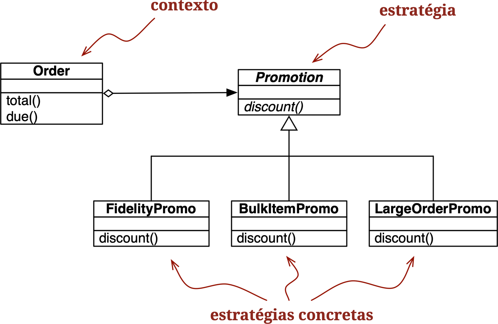

[[ch_design_patterns]]
== Padrões de projetos com funções de primeira classe
:example-number: 0
:figure-number: 0

[quote, Ralph Johnson, co-autor do clássico "Padrões de Projetos"]
____
Conformidade a padrões não é medida de virtude.footnote:[De um slide na
palestra _Root Cause Analysis of Some Faults in Design Patterns_ (Análise das
Causas Básicas de Alguns Defeitos em Padrões de Projetos), apresentada por
Ralph Johnson no IME/CCSL da Universidade de São Paulo, em 15 de novembro de
2014.]
____

Em((("functions, design patterns with first-class", "dynamic languages and")))
engenharia de software, um
https://fpy.li/5z[_padrão de projeto_] é uma receita genérica para solucionar
um problema de design comum.
Não é preciso conhecer padrões de projeto para acompanhar esse
capítulo, vou explicar os padrões usados nos exemplos.

O uso de padrões de projeto em programação foi popularizado pelo livro seminal
_Padrões de Projetos: Soluções Reutilizáveis de Software Orientados a Objetos_
(Addison-Wesley), de Erich Gamma, Richard Helm, Ralph Johnson e John
Vlissides—também conhecidos como _the Gang of Four_ (A Gangue dos Quatro) ou pela
sigla _GoF_. O
livro é um catálogo de 23 padrões, aprensentados como arranjos de
classes e exemplificados com código em {cpp}, mas considerados úteis
também em outras linguagens orientadas a objetos.

Apesar dos padrões de projeto serem independentes da linguagem, isso não
significa que todo padrão se aplica a todas as linguagens. Por exemplo, o
https://fpy.li/17[«Capítulo 17»] (vol.3) vai mostrar que não faz sentido implementr a receita do padrão
https://fpy.li/10-2[Iterador (_Iterator_)] em Python, pois esse padrão está
embutido na linguagem e pronto para ser usado, na forma de geradores—que não
precisam de classes para funcionar, e exigem menos código que a receita
do livro clássico.

Na introdução da obra, os autores reconhecem que a linguagem
usada na implementação determina quais padrões são relevantes:

[quote]
____
A escolha da linguagem de programação é importante, pois ela influencia nosso
ponto de vista. Nossos padrões supõe uma linguagem com recursos equivalentes aos
de Smalltalk e do {cpp}—e essa escolha determina o que pode e o que não pode ser
facilmente implementado. Se tivéssemos presumido uma linguagem procedural,
poderíamos ter incluído padrões de projetos chamados "Herança", "Encapsulamento"
e "Polimorfismo". Da mesma forma, alguns de nossos padrões são suportados
diretamente por linguagens orientadas a objetos menos conhecidas. CLOS, por
exemplo, tem multi-métodos, reduzindo a necessidade de um padrão como o
Visitante.footnote:[_Visitor_, Citado da página 4 da edição em inglês de
_Padrões de Projeto_.]
____

Em sua apresentação de 1996, https://fpy.li/norvigdp[_Design Patterns in Dynamic
Languages_] (Padrões de Projetos em Linguagens Dinâmicas), Peter Norvig
afirma que 16 dos 23 padrões do livro original se tornam
"invisíveis ou mais simples" em uma linguagem dinâmica (slide 9). Ele se
refere às linguagens Lisp e Dylan, mas vários recursos dinâmicos citados
também existem em Python. Em especial, em uma linguagem que oferece
funções de primeira classe, Norvig sugere repensar os padrões
clássicos conhecidos como _Strategy_ (Estratégia), _Command_ (Comando), 
_Template Method_ (Método Gabarito) e _Visitor_ (Visitante).

O objetivo desse capítulo é mostrar como, em certos casos, funções podem
realizar o mesmo trabalho de classes, com menos código e mais clareza.
Vamos refatorar uma implementaçao de Estratégia usando funções como
objetos, removendo muito código redundante.
Vamos também discutir uma abordagem similar para simplificar o padrão Comando.

=== Novidades neste capítulo

Movi((("functions, design patterns with first-class", "significant changes to")))
este capítulo para o final da Parte II, para poder então aplicar o
decorador de registro na <<decorated_strategy_sec>>, e também usar dicas de tipo nos
exemplos. A maior parte das dicas de tipo usadas nesse capítulo são simples,
e ajudam na legibilidade.

[[strategy_case_study]]
=== Estudo de caso: refatorando Estratégia

Estratégia((("functions, design patterns with first-class", "refactoring
strategies", id="FDPrefactor10"))) é um bom exemplo de um padrão de projeto que
pode ser mais simples em Python, usando funções como objetos de primeira classe.
Na próxima seção vamos descrever e implementar Estratégia usando a estrutura
"clássica" descrita em _Padrões de Projetos_. Se você estiver familiarizado com
o padrão original, pode pular direto para <<pythonic_strategy>>, onde
refatoramos o código usando funções, eliminando várias linhas.

==== Estratégia clássica

O((("refactoring strategies", "classic", id="RSclassic10")))((("classic refactoring strategy",
id="classicref10")))((("Strategy pattern", id="stratpat10")))((("UML class diagrams",
"Strategy design pattern"))) diagrama
de classes UML na <<strategy_uml>> retrata um arranjo de classes exemplificando
o padrão Estratégia.

[[strategy_uml]]
.Diagrama de classes UML para calcular descontos em pedidos, com o padrão de projeto Estratégia.

O padrão Estratégia é resumido assim em _Padrões de Projetos_:

[quote]
____
Define uma família de algoritmos, encapsula cada um deles, e os torna
intercambiáveis. Estratégia permite que o algoritmo varie de forma independente
dos clientes que o usam.
____

Um exemplo claro de Estratégia, aplicado ao domínio do ecommerce, é o cálculo de
descontos em pedidos de acordo com os atributos do cliente ou pela inspeção dos
itens do pedido.

Considere uma loja online com as seguintes regras para descontos:

* Clientes com 1.000 ou mais pontos de fidelidade recebem um desconto global de 5% por pedido.
* Um desconto de 10% é aplicado a cada item com 20 ou mais unidades no mesmo pedido.
* Pedidos com pelo menos 10 itens diferentes recebem um desconto global de 7%.

Para simplificar, vamos assumir que apenas um desconto pode ser aplicado a cada pedido.

O diagrama de classes UML para o padrão Estratégia aparece na <<strategy_uml>>. Seus participantes são:

Contexto (_Context_):: Oferece um serviço delegando parte do processamento para
componentes intercambiáveis, que implementam algoritmos alternativos.
Neste exemplo, o contexto é uma classe `Order`, configurada para aplicar um
desconto promocional de acordo com um algoritmo entre vários possíveis.

Estratégia (_Strategy_):: A interface comum dos componentes que implementam
diferentes algoritmos. No nosso exemplo, esse papel cabe a uma classe abstrata
chamada `Promotion`.

Estratégia concreta (_Concrete strategy_):: Cada uma das subclasses concretas de
Estratégia. `FidelityPromo`, `BulkPromo`, e `LargeOrderPromo` são as três
estratégias concretas implementadas.

O código no <<ex_classic_strategy>> segue o modelo da <<strategy_uml>>. Como
descrito em _Padrões de Projetos_, a estratégia concreta é escolhida pelo
cliente da classe de contexto. No nosso exemplo, antes de instanciar um pedido,
o sistema deveria, de alguma forma, selecionar a estratégia de desconto
promocional e passá-la para o construtor de `Order`. A seleção da estratégia
está fora do escopo do padrão.

[[ex_classic_strategy]]
.Implementação da classe `Order` com estratégias de desconto intercambiáveis
====
[source, python]
----
include::../code/10-dp-1class-func/classic_strategy.py[tags=CLASSIC_STRATEGY]
----
====

Observe que no  <<ex_classic_strategy>>, programei `Promotion` como uma classe
base abstrata (ABC), para usar o decorador `@abstractmethod` e deixar o padrão
mais explícito.

O <<ex_classic_strategy_tests>> apresenta os doctests usados para demonstrar e
verificar a operação de um módulo implementando as regras descritas
anteriormente.

[[ex_classic_strategy_tests]]
.Amostra de uso da classe `Order` com a aplicação de diferentes promoções
====
[source, python]
----
include::../code/10-dp-1class-func/classic_strategy.py[tags=CLASSIC_STRATEGY_TESTS]
----
====
<1> Dois clientes: `joe` tem 0 pontos de fidelidade, `ann` tem 1.100.
<2> Um carrinho de compras com três itens.
<3> A promoção `FidelityPromo` não dá qualquer desconto para `joe`.
<4> `ann` recebe um desconto de 5% porque tem pelo menos 1.000 pontos.
<5> O `banana_cart` contém 30 unidade do produto `"banana"` e 10 maçãs.
<6> Graças à `BulkItemPromo`, `joe` recebe um desconto de $1,50 no preço das bananas.
<7> O `long_cart` tem 10 itens diferentes, cada um custando $1,00.
<8> `joe` recebe um desconto de 7% no pedido total, por causa da `LargerOrderPromo`.

O <<ex_classic_strategy>> funciona, mas podemos implementar a mesma funcionalidade
com menos linhas de código usando funções como objetos.
Vejamos como.((("", startref="stratpat10")))((("", startref="classicref10")))((("",
startref="RSclassic10")))

[[pythonic_strategy]]
==== Estratégia baseada em funções

Cada((("refactoring strategies", "function-oriented",
id="RSfunction10")))((("function-oriented refactoring strategy",
id="funcorient01"))) estratégia concreta no <<ex_classic_strategy>> é uma classe
com um único método, `discount`. Além disso, as instâncias de estratégia não tem
nenhum estado (nenhum atributo de instância). Você poderia dizer que elas se
parecem muito com funções simples, e estaria certa. O <<ex_strategy>> é uma
refatoração do <<ex_classic_strategy>>, substituindo as estratégias concretas
por funções simples e removendo a classe abstrata `Promo`. São necessários
apenas alguns pequenos ajustes na classe `Order`.footnote:[Precisei
reimplementar `Order` com `@dataclass` devido a um bug no Mypy. Você pode
ignorar esse detalhe, pois essa classe funciona também com `NamedTuple`,
exatamente como no <<ex_classic_strategy>>. Quando `Order` é uma `NamedTuple`, o
Mypy 0.910 encerra com erro ao checar a dica de tipo para `promotion`. Tentei
acrescentar `# type ignore` àquela linha específica, mas o erro persistia.
Entretanto, se `Order` for criada com `@dataclass`, o Mypy trata corretamente a
mesma dica de tipo. O https://fpy.li/10-3[Issue &#35;9397] não havia sido resolvido
em 19 de julho de 2021, quando essa nota foi escrita. Espero que o problema
tenha sido solucionado quando você estiver lendo isso. NT: Aparentemente foi
resolvido. O Issue &#35;9397 gerou o
https://fpy.li/62[Issue &#35;12629], fechado com indicação
de solucionado em agosto de 2022, o último comentário indicando que a opção de
linha de comando `--enable-recursive-aliases` do Mypy evita os erros
relatados).]

[[ex_strategy]]
.A classe `Order` com as estratégias de descontos implementadas como funções
====
[source, python]
----
include::../code/10-dp-1class-func/strategy.py[tags=STRATEGY]
----
====

<1> Essa dica de tipo diz: `promotion` pode ser `None`, ou pode ser um invocável
que recebe uma `Order` como argumento e devolve um `Decimal`.
<2> Para calcular o desconto, invocamos `self.promotion`,
passando `self` como argumento. Veja a razão disso logo abaixo.
<3> Nenhuma classe abstrata.
<4> Cada estratégia é uma função.

.Por que self.promotion(self)?
[TIP]
====
Na classe `Order`, `promotion` não é um método. É um atributo de instância que
por acaso é invocável. Então a primeira parte da expressão, `self.promotion`,
busca aquele invocável. Mas, ao invocá-lo, precisamos fornecer uma instância de
`Order`, que neste caso é `self`. Por isso `self` aparece duas vezes na
expressão.

A https://fpy.li/8e[«Seção 23.4»] (vol.3) vai explicar o mecanismo que vincula
automaticamente métodos a instâncias. Mas isso não se aplica a `promotion`,
pois este atributo não é um método.
====

O código no <<ex_strategy>> é mais curto que o do <<ex_classic_strategy>>. Usar
a nova `Order` é também um pouco mais simples, como mostram os doctests no
<<ex_strategy_tests>>.

[[ex_strategy_tests]]
.Amostra do uso da classe `Order` com as promoções como funções
====
[source, python]
----
include::../code/10-dp-1class-func/strategy.py[tags=STRATEGY_TESTS]
----
====
<1> Mesmos dispositivos de teste do <<ex_classic_strategy>>.
<2> Para aplicar uma estratégia de desconto a uma `Order`, passamos a função de promoção como argumento.
<3> Uma função de promoção diferente é usada aqui e no teste seguinte.

Observe os textos explicativos do <<ex_strategy_tests>>: não há necessidade
de instanciar um novo objeto `promotion` com cada novo pedido:
as funções já estão prontas para usar.

É interessante notar que no _Padrões de Projetos_, os autores sugerem que:
"Objetos Estratégia muitas vezes são bons "peso mosca"
(_flyweight_)".footnote:[veja a página 323 da edição em inglês de _Padrões de
Projetos_.] O padrão _Peso Mosca_ é definido em outra parte do livro
assim: "Um _peso mosca_ é um objeto compartilhado que pode ser usado em
múltiplos contextos simultaneamente."footnote:[Ibid., p. 196.]
O compartilhamento é recomendado para reduzir o custo da criação de um novo
objeto concreto de estratégia, quando a mesma estratégia é aplicada repetidamente
a cada novo contexto—no nosso exemplo, a cada nova instância de `Order`. 
Se uma loja que recebe 100.000 pedidos por dia, cada estratégia concreta
será instanciada milhares de vezes.
Então, para reduzir o custo de processamento do padrão Estratégia,
os autores recomendam a aplicação de mais um padrão. Enquanto isso,
o número de linhas e o custo de manutenção de seu código vai aumentando.

Um caso de uso mais espinhoso, com estratégias concretas complexas mantendo
estados internos, pode exigir a combinação de todas as partes dos padrões de
projeto Estratégia e Peso Mosca. Muitas vezes, porém, estratégias concretas não
têm estado interno; elas lidam apenas com dados vindos do contexto. Neste caso,
não tenha dúvida, use as boas e velhas funções ao invés de escrever classes de
um só metodo implementando uma interface de um só método declarada em outra
classe diferente. Uma função pesa menos que uma instância de uma classe definida
pelo usuário, e não há necessidade do Peso Mosca, pois cada função da estratégia
é criada apenas uma vez por processo Python, quando o módulo é carregado. Uma
função também é um "objeto compartilhado que pode ser usado em múltiplos
contextos simultaneamente".

Uma vez implementado o padrão Estratégia com funções, outras possibilidades nos
ocorrem. Suponha que você queira criar uma "meta-estratégia", que seleciona o
melhor desconto disponível para uma dada `Order`. Nas próximas seções vamos
estudar as refatorações adicionais para implementar esse requisito, usando
abordagens que se valem de funções e módulos vistos como objetos.((("",
startref="RSfunction10")))((("", startref="funcorient01")))

==== Escolhendo a melhor estratégia: abordagem simples

Dados((("refactoring strategies", "choosing the best"))) os mesmos clientes e
carrinhos de compras dos testes no <<ex_strategy_tests>>, vamos agora
acrescentar três testes adicionais ao  <<ex_strategy_best_tests>>.

[[ex_strategy_best_tests]]
.A função `best_promo` aplica todos os descontos e devolve o maior
====
[source, python]
----
include::../code/10-dp-1class-func/strategy_best.py[tags=STRATEGY_BEST_TESTS]
----
====
<1> `best_promo` selecionou a `larger_order_promo` para o cliente `joe`.
<2> Aqui `joe` recebeu o desconto de `bulk_item_promo`, por comprar muitas bananas.
<3> Neste caso `best_promo` deu à cliente fiel `ann` o desconto de fidelidade: `fidelity_promo`.

A implementação de `best_promo` é simples. Veja o <<ex_strategy_best>>.

[[ex_strategy_best]]
.`best_promo` encontra o desconto máximo iterando sobre uma lista de funções
====
[source, python]
----
include::../code/10-dp-1class-func/strategy_best.py[tags=STRATEGY_BEST]
----
====
<1> `promos`: lista de estratégias implementadas como funções.
<2> `best_promo` recebe uma instância de `Order` como argumento, como as outras funções `*_promo`.
<3> Usando uma expressão geradora, aplicamos cada uma das funções de `promos` a `order`,
e devolvemos o maior desconto encontrado.

O <<ex_strategy_best>> é bem direto: `promos` é uma `list` de funções.
Quando você se acostuma à ideia de funções como objetos de primeira classe, o
próximo passo é notar como pode ser útil construir estruturas de dados
contendo funções.

Apesar do <<ex_strategy_best>> funcionar e ser fácil de ler, há alguma
duplicação que poderia levar a um bug sutil: para adicionar uma nova estratégia,
precisamos escrever a função e lembrar de incluí-la na lista `promos`. De outra
forma a nova promoção só funcionará quando passada explicitamente como argumento
para `Order`, e não será considerada por `best_promotion`.

Vamos examinar algumas soluções para essa questão.

==== Encontrando estratégias em um módulo

Módulos((("refactoring strategies", "finding strategies in modules",
id="RSfind10"))) também são objetos de primeira classe no Python, e a biblioteca
padrão oferece várias funções para lidar com eles. A((("functions", "globals()
function")))((("globals() function"))) função embutida `globals` é descrita
assim na documentação de Python:

`globals()`:: Devolve um dicionário representando a tabela de nomes do
escopo global. Isso é sempre o dicionário do módulo atual
(dentro de uma função, é o módulo onde ela foi definida, não o módulo
onde é invocada).

O <<ex_strategy_best2>> é uma forma um tanto _hacker_ de usar `globals` para
ajudar `best_promo` a encontrar automaticamente outras funções `*_promo`
disponíveis.

[[ex_strategy_best2]]
.A lista `promos` é construída a partir da introspecção do espaço de nomes global do módulo
====
[source, python]
----
include::../code/10-dp-1class-func/strategy_best2.py[tags=STRATEGY_BEST2]
----
====
<1> Importa as funções de promoções, para que fiquem disponíveis no espaço de
nomes global.footnote:[Tanto o flake8 quanto o VS Code reclamam que esses nomes
são importados mas não são usados. Por definição, ferramentas de análise
estática não conseguem lidar com a natureza dinâmica de Python. Se seguirmos
todos os conselhos dessas ferramentas, logo estaremos escrevendo programas
austeros e prolixos similares aos de Java, mas com a sintaxe de Python.]
<2> Itera sobre cada item no `dict` devolvido por `globals()`.
<3> Seleciona apenas aqueles valores onde o nome termina com o sufixo `_promo` e...
<4> ...filtra e remove a própria `best_promo`,
para evitar uma recursão infinita quando `best_promo` for invocada.
<5> Nenhuma mudança em `best_promo`.

Outra forma de coletar as promoções disponíveis seria criar um módulo e colocar
nele todas as funções de estratégia, exceto `best_promo`.

No <<ex_strategy_best3>>, a única mudança significativa é que a lista de funções
de estratégia é criada pela introspecção de um módulo separado chamado
`promotions`. Veja que o <<ex_strategy_best3>> depende da importação do módulo
`promotions` bem como de funções de introspecção de alto
nível do módolo `inspect` da biblioteca padrão.

[[ex_strategy_best3]]
.A lista `promos` é construída a partir da introspecção de um novo módulo, `promotions`
====
[source, python]
----
include::../code/10-dp-1class-func/strategy_best3.py[tags=STRATEGY_BEST3]
----
====

A função `inspect.getmembers` devolve os atributos de um objeto—neste caso, o
módulo `promotions`—opcionalmente filtrados por um predicado (uma função
booleana). Usamos `inspect.isfunction` para obter apenas as funções.

O <<ex_strategy_best3>> funciona independente dos nomes dados às funções;
o que importa é que o módulo `promotions` contém apenas funções que, dado um
pedido, calculam os descontos. Claro, isso é uma suposição implícita do código.
Se alguém criasse uma função com uma assinatura diferente no módulo
`promotions`, `best_promo` geraria um erro ao tentar aplicá-la a um pedido.

Poderíamos acrescentar testes mais estritos para filtrar as funções, por exemplo
inspecionando seus argumentos. O ponto principal do <<ex_strategy_best3>> não é
oferecer uma solução completa, mas enfatizar um uso possível da introspecção de
módulo.

Uma alternativa mais explícita para coletar dinamicamente as funções de desconto
promocional seria usar um decorador simples. É nosso próximo tópico.((("",
startref="FDPrefactor10")))((("", startref="RSfind10")))

[[decorated_strategy_sec]]
=== Estratégia melhorado com decorador

Lembre-se((("functions, design patterns with first-class", "decorator-enhanced
strategy pattern", id="FDPdecorator10")))((("refactoring strategies",
"decorator-enhanced pattern", id="RSdecorator10")))((("decorator-enhanced
strategy pattern", id="decenh10"))) que nossa principal objeção ao
<<ex_strategy_best>> foi a repetição dos nomes das funções em suas definições e
na lista `promos`, usada pela função `best_promo` para determinar o maior
desconto aplicável. A repetição é problemática porque alguém pode acrescentar
uma nova função de estratégia promocional e esquecer de adicioná-la manualmente
à lista `promos`—caso em que `best_promo` vai ignorar a nova
estratégia, introduzindo um bug silencioso. O <<ex_strategy_best31>>
resolve esse problema com a técnica vista na <<registration_deco_sec>>.

[[ex_strategy_best31]]
.A lista `promos` é preenchida pelo decorador `promotion`
====
[source, python]
----
include::../code/10-dp-1class-func/strategy_best4.py[tags=STRATEGY_BEST4]
----
====
<1> A lista `promos` é global no módulo, e começa vazia.
<2> `promotion` é um decorador de registro: ele devolve a função `promo` inalterada, após inserí-la na lista `promos`.
<3> Nenhuma mudança é necessária em `best_promo`, pois ela se baseia na lista `promos`.
<4> Qualquer função decorada com `@promotion` será adicionada a `promos`.

Essa solução tem várias vantagens sobre aquelas apresentadas anteriormente:

* As funções de estratégia de promoção não precisam usar nomes especiais—não há
necessidade do sufixo `_promo`.
* O decorador `@promotion` realça o propósito da função decorada, e também torna
mais fácil desabilitar temporariamente uma promoção: basta transformar a linha
do decorador em comentário.
* Estratégias de desconto promocional podem ser definidas em outros módulos, em
qualquer lugar do sistema, desde que o decorador `@promotion` seja aplicado a
elas.

Na próxima seção vamos discutir Comando (_Command_)—outro padrão de projeto que
é algumas vezes implementado via classes de um só metodo, quando funções simples
seriam suficientes.((("", startref="decenh10")))((("",
startref="RSdecorator10")))((("", startref="FDPdecorator10")))

=== O padrão Comando

Comando((("functions, design patterns with first-class", "Command pattern",
id="FDPcommand10")))((("Command pattern", id="cmmd10")))((("refactoring
strategies", "Command pattern", id="RScmmnd10")))((("UML class diagrams",
"Command design pattern"))) é outro padrão de projeto que pode ser simplificado
com o uso de funções passadas como argumentos. A <<command_uml>> mostra o
arranjo das classes nesse padrão.

[[command_uml]]
.Diagrama de classes UML para um editor de texto controlado por menus, implementado com o padrão de projeto Comando. Cada comando pode ter um receptor diferente: o objeto que implementa a ação. Para `PasteCommand`, o receptor é Document. Para `OpenCommand`, o receptor é a aplicação.
image::../images/flpy_1002.png[align="center",pdfwidth=12cm]

O objetivo de Comando é desacoplar um objeto que invoca uma operação (o
_invoker_ ou solicitante) do objeto fornecedor que implementa aquela operação (o
_receiver_ ou receptor). No exemplo em _Padrões de Projetos_, cada solicitante é
um item de menu em uma aplicação gráfica, e os receptores são o documento sendo
editado ou a própria aplicação.

A ideia é colocar um objeto `Command` entre os dois, implementando uma interface
com um único método, `execute`, que chama algum método no receptor para executar
a operação desejada. Assim, o solicitante não precisa conhecer a interface do
receptor, e receptors diferentes podem ser adaptados com diferentes subclasses
de `Command`. O solicitante é configurado com um comando concreto, e o opera
chamando seu método `execute`. Observe na <<command_uml>> que `MacroCommand`
pode armazenar um sequência de comandos; seu método `execute()` chama o mesmo
método em cada comando armazenado.

Citando _Padrões de Projetos_, "Comandos são um substituto orientado a objetos
para _callbacks_." A pergunta é: precisamos de um substituto orientado a objetos
para _callbacks_? Algumas vezes sim, mas nem sempre.

Em vez de dar ao solicitante uma instância de `Command`, podemos dar
a ele uma função. Em vez de invocar `command.execute()`, o solicitante pode
apenas invoca `command()`. O `MacroCommand` pode ser programado como uma classe que
implementa `+__call__+`. Instâncias de `MacroCommand` seriam invocáveis, cada
uma contendo uma lista de comandos para invocação futura, como implementado no
<<ex_macro_command>>.

[[ex_macro_command]]
.Cada instância de `MacroCommand` tem uma lista interna de comandos
====
[source, python]
----
class MacroCommand:
    """A command that executes a list of commands"""

    def __init__(self, commands):
        self.commands = list(commands)  # <1>

    def __call__(self):
        for command in self.commands:  # <2>
            command()
----
====
<1> Criar uma nova lista com os itens do argumento `commands` garante que ela
seja iterável e mantém uma cópia local de referências a comandos em cada
instância de `MacroCommand`.
<2> Quando uma instância de `MacroCommand` é invocada, cada comando em
`self.commands` é chamado em sequência.

Usos mais avançados do padrão Comando—para implementar "desfazer", por
exemplo—podem exigir mais que uma simples função de _callback_. Mesmo assim,
Python oferece algumas alternativas que merecem ser consideradas:

* Uma instância invocável como `MacroCommand` no <<ex_macro_command>> pode
manter qualquer estado que seja necessário, e oferecer outros métodos além de
`+__call__+`.

* Uma clausura pode ser usada para armazenar algum estado interno em uma função entre
invocações.

Isso encerra nossa revisão do padrão Comando usando funções de primeira classe.
Por alto, a abordagem aqui foi similar à que aplicamos a Estratégia: substituir
por funções as instâncias de uma classe participante que implementava uma interface
de método único. Afinal, todo invocável de Python implementa uma
interface de método único, e esse método se chama `+__call__+`.((("",
startref="RScmmnd10")))((("", startref="cmmd10")))((("",
startref="FDPcommand10")))

[[design_patterns_summary]]
=== Resumo do capítulo

Como((("functions, design patterns with first-class", "overview of"))) apontou
Peter Norvig alguns anos após o surgimento do clássico _Padrões de Projetos_,
"16 dos 23 padrões têm implementações qualitativamente mais simples em Lisp ou
Dylan que em {cpp}, pelo menos para alguns usos de cada padrão".
Python compartilha alguns dos recursos dinâmicos das linguagens Lisp e Dylan,
especialmente funções de primeira classe, nosso foco neste capítulo.

Na mesma palestra citada no início deste capítulo, refletindo sobre o 20º
aniversário de _Padrões de Projetos: Soluções Reutilizáveis de Software
Orientados a Objetos_, Ralph Johnson afirmou que um dos defeitos do livro é:
"Excesso de ênfase nos padrões como linhas de chegada, em vez de como etapas em
um processo de design".footnote:[_Root Cause Analysis of Some Faults in Design
Patterns_ (Análise das Causas Básicas de Alguns Defeitos em Padrões de
Projetos), palestra apresentada por Johnson no IME/CCSL da Universidade de São
Paulo, em 15 de novembro de 2014.] Neste capítulo usamos o padrão Estratégia
como ponto de partida: uma solução que funcionava, mas que simplificamos usando
funções de primeira classe.

Em muitos casos, funções ou objetos invocáveis oferecem um caminho mais natural
para implementar _callbacks_ em Python que a imitação dos padrões Estratégia ou
Comando como descritos pela Gangue dos Quatro em _Padrões de
Projetos_. A refatoração de Estratégia e a discussão de Comando nesse capítulo
são exemplos de uma ideia mais geral: algumas vezes você pode encontrar uma
padrão de projeto ou uma API que exigem que seus componentes implementem uma
interface com um único método, e aquele método tem um nome que soa muito
genérico, como "executar", "rodar" ou "fazer". Tais padrões ou APIs podem
frequentemente ser implementados em Python com menos código repetitivo, usando
funções como objetos de primeira classe.

[[dp_further]]
=== Para saber mais

A((("functions, design patterns with first-class", "further reading on")))
Receita 8.21. _Implementing the Visitor Pattern_ (Implementando o Padrão
Visitante) no _Python Cookbook 3rd ed_, mostra uma implementação elegante
do padrão Visitante, na qual uma classe `NodeVisitor`
trata métodos como objetos de primeira classe.

Sobre o tópico mais geral de padrões de projetos, a oferta de leituras para o
programador Python não é tão numerosa quando aquela disponível para as
comunidades de outras linguagens.

_Learning Python Design Patterns_, de Gennadiy Zlobin (Packt),
é o único livro inteiramente dedicado a
padrões em Python que encontrei. Mas o trabalho de Zlobin é muito breve (100
páginas) e trata de apenas 8 dos 23 padrões de projeto originais.

_Expert Python Programming_, de Tarek Ziadé (Packt), é um dos melhores livros
sobre Python em nível intermediário, e seu capítulo final,
_Useful Design Patterns_ (Padrões de Projetos Úteis),
apresenta vários padrões clássicos com uma abordagem pythônica.

Alex Martelli já apresentou várias palestras sobre padrões de projetos em
Python. Há um vídeo de sua https://fpy.li/10-5[apresentação na EuroPython] (EN)
e um https://fpy.li/10-6[conjunto de slides em seu site pessoal] (EN). Ao longo
dos anos, encontrei diferentes jogos de slides e vídeos de diferentes tamanhos,
então vale a pena tentar uma busca mais ampla com o nome dele e as palavras
"Python Design Patterns".

Há muitos livros sobre padrões de projetos com ênfase em Java.
Meu preferido é _Head First Design Patterns_ (Use a Cabeça: 
Padrões de Projeto), 2ª ed., de Eric Freeman e Elisabeth Robson (O'Reilly).
Eles explicam 16 dos 23 padrões clássicos. Se você gosta do estilo
amalucado da série _Head First_ e precisa de uma introdução a esse tópico, vai
adorar esse livro. A segunda edição foi atualizada
para incorporar o uso de funções de primeira classe em Java,
tornando alguns dos exemplos mais próximos do modo como escreveríamos em
Python.

Para um olhar moderno sobre padrões, do ponto de vista de uma linguagem dinâmica
com tipagem pato (_duck typing_) e funções de primeira classe, _Design Patterns in Ruby_
("Padrões de Projetos em Ruby") de Russ Olsen (Addison-Wesley) traz muitas
ideias aplicáveis também ao Python. A despeito de suas muitas diferenças
sintáticas, no nível semântico Python e Ruby estão mais próximos entre si que de
Java ou do {cpp}.

No slides de https://fpy.li/norvigdp[_Design Patterns in Dynamic Languages_] (Padrões de
Projetos em Linguagens Dinâmicas), Peter Norvig mostra como funções
de primeira classe e outros recursos dinâmicos tornam vários dos padrões de
projeto originais mais simples ou mesmo desnecessários.

A "Introdução" do _Padrões de Projetos_ original, de Gamma et al. já vale o
preço do livro—mais até que o catálogo de 23 padrões, que inclui desde receitas
muito importantes até algumas raramente úteis. Alguns princípios de projetos de
software muito conhecidos, como "Programe para uma interface, não para uma
implementação" e "Prefira a composição de objetos à herança de classe",
são citações daquela introdução.

A ideia de padrões de projetos se originou com o arquiteto Christopher
Alexander et al., e foi apresentada no livro _A Pattern Language_ ("Uma
Linguagem de Padrões") (Oxford University Press). A ideia de Alexander é criar
um vocabulário padronizado, permitindo que equipes compartilhem decisões comuns
em projetos de edificações. M. J. Dominus wrote https://fpy.li/10-7[_"Design
Patterns" Aren't_] (Padrões de Projetos Não São), uma curiosa apresentação de
slides acompanhada de um texto argumentando que a visão original de Alexander
sobre os padrões é mais profunda e mais humanista, e também se aplica à
engenharia de software.

.Ponto de vista
****

**Padrões para quem precisa de padrões**

Python((("functions, design patterns with first-class", "Soapbox
discussion")))((("Soapbox sidebars", "design patterns"))) tem funções de
primeira classe e tipos de primeira classe, e Norvig afima que esses recursos
afetam 10 dos 23 padrões (slide 10 de
https://fpy.li/norvigdp[_Design Patterns in Dynamic Languages_]).
Na <<generic_functions_sec>>, vimos que Python também tem funções
genéricas de despacho único, uma forma limitada dos multi-métodos do
CLOS, que Gamma et al. sugerem como uma maneira mais simples de implementar o
padrão clássico Visitante (_Visitor_). Norvig, por outro lado, diz (no slide 10)
que os multi-métodos simplificam o padrão Construtor (_Builder_).
Ligar padrões de projetos a recursos de linguagens não é uma ciência exata.

Em cursos a redor do mundo todo, padrões de projetos são frequentemente
ensinados usando exemplos em Java. Ouvi mais de um estudante dizer que eles
foram levados a crer que os padrões de projeto originais são úteis qualquer que
seja a linguagem usada na implementação. A verdade é que os 23 padrões
"clássicos" de _Padrões de Projetos_ se aplicam muito bem ao Java, apesar de
terem sido apresentados principalmente no contexto do {cpp} (no livro, há alguns
exemplos em Smalltalk). Mas isso não significa que todos aqueles
padrões podem ser aplicados de forma igualmente satisfatória a qualquer
linguagem. Os autores dizem explicitamente, logo no início de seu livro, que
"alguns de nossos padrões são suportados diretamente por linguagens orientadas a
objetos menos conhecidas" (a citação completa apareceu na primeira página deste
capítulo).

Agora que Python está se tornando cada vez mais popular no ambiente acadêmico,
podemos esperar que novos livros sobre padrões de projetos sejam escritos com
foco nesta linguagem. Além disso, o Java 8 introduziu referências a
métodos e funções anônimas, e esses recursos muito esperados devem incentivar o
surgimento de novas abordagens aos padrões em Java—reconhecendo que, à medida
que as linguagens evoluem, também é preciso evoluir nosso entendimento sobre
quando e como aplicar os padrões de projetos clássicos.

[role="soapbox-title"]
**O chamado da natureza**

Enquanto((("Soapbox sidebars", "&#x005F;&#x005F;call&#x005F;&#x005F;",
secondary-sortas="call")))((("&#x005F;&#x005F;call&#x005F;&#x005F;")))
trabalhávamos juntos para dar os toques finais a este livro, o revisor técnico
Leonardo Rochael pensou:

Se funções têm um método `+__call__+`, e métodos também são invocáveis, será que
os métodos `+__call__+` também tem um método `+__call__+`?

Não sei se a descoberta do Leo é util, mas com certeza é curiosa:

[source, python]
----
>>> def turtle():
...     return 'eggs'
...
>>> turtle()
'eggs'
>>> turtle.__call__()
'eggs'
>>> turtle.__call__.__call__()
'eggs'
>>> turtle.__call__.__call__.__call__()
'eggs'
>>> turtle.__call__.__call__.__call__.__call__()
'eggs'
>>> turtle.__call__.__call__.__call__.__call__.__call__()
'eggs'
>>> turtle.__call__.__call__.__call__.__call__.__call__.__call__()
'eggs'
----

https://fpy.li/10-8[_Turtles all the way down!_]footnote:[NT:
Literalmente: "Tartarugas até lá embaixo".
Esta é uma forma poética de falar sobre regressão infinita,
em alusão ao mito de que a Terra 
se apoia sobre uma tartaruga gigante,
que se apoia sobre outra tartaruga gigante,
que se apoia sobre outra tartaruga gigante,
que se apoia sobre outra tartaruga gigante,
que se apoia sobre outra tartaruga gigante,
que se apoia sobre outra tartaruga gigante,
que se apoia sobre outra tartaruga gigante,
que se apoia sobre outra tartaruga gigante...]

****

<<<
