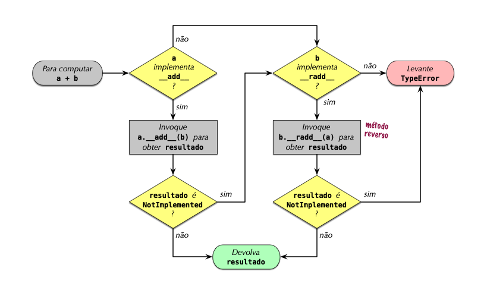

[[ch_op_overload]]
== Sobrecarga de operadores
:example-number: 0
:figure-number: 0

[quote, James Gosling, Criador de Java]
____

Certas coisas me deixam meio dividido, como a sobrecarga de operadores. Deixei
a sobrecarga de operadores de fora em uma decisão bastante pessoal, pois tinha
visto gente demais abusar [deste recurso] no {cpp}.footnote:[Fonte:
https://fpy.li/16-1[_The C Family of Languages: Interview with Dennis Ritchie,
Bjarne Stroustrup, and James Gosling_] (A Família de Linguagens C: entrevista
com Dennis Ritchie, Bjarne Stroustrup, e James Gosling).]

____

Em((("operator overloading", "infix operators")))((("infix operators"))) Python,
podemos calcular juros compostos usando uma fórmula escrita assim:

[source, python]
----
interest = principal * ((1 + rate) ** periods - 1)
----

Operadores que aparecem entre operandos, como `{plus}` em `1 + rate`, são
_operadores infixos_. No Python, operadores infixos podem lidar com qualquer
tipo arbitrário. Assim, se você está trabalhando com dinheiro de verdade, pode
armazenar `principal`, `rate`, e `periods` como números exatos—instâncias da
classe `decimal.Decimal` de Python. A mesma fórmula vai funcionar como escrita,
calculando um resultado exato.

Mas em Java, se você mudar de `float` para `BigDecimal`, para obter resultados
exatos, não é mais possível usar operadores infixos, porque naquela linguagem
eles só funcionam com tipos primitivos como `float` ou `long`.
Veja a mesma fórmula escrita em Java para funcionar com números `BigDecimal`:

[source, java]
----
BigDecimal interest = principal.multiply(BigDecimal.ONE.add(rate)
                        .pow(periods).subtract(BigDecimal.ONE));
----

Está claro que operadores infixos tornam as fórmulas mais legíveis. A sobrecarga
de operadores é necessária para suportar a notação infixa de operadores com
tipos definidos pelo usuário ou em extensões compiladas, como os arrays da NumPy.
Oferecer a sobrecarga de operadores em uma linguagem de alto nível e fácil de
usar foi talvez uma das principais razões do grande sucesso de Python na
ciência de dados, incluindo as aplicações científicas e financeiras.

Na https://fpy.li/84[«Seção 1.3.1»] (vol.1), vimos algumas implementações
triviais de operadores em uma classe básica `Vector`.
Escrevi os métodos `+__add__+` e `+__mul__+` no https://fpy.li/8w[«Exemplo 2 do Capítulo 1»] (vol.1)
para demonstrar como os métodos especiais suportam a sobrecarga de operadores,
mas deixei passar alguns problemas sutis naquelas implementações.
Além disso, no <<ex_vector2d_v0>> do <<ch_pythonic_obj>> notamos que o
método `+Vector2d.__eq__+` considera `True` a seguinte expressão:
`Vector(3, 4) == [3, 4]`. Tal resultado pode fazer sentido ou não. Neste capítulo vamos
cuidar destes problemas, e((("operator overloading", "topics covered")))
falaremos também de:

* Como um método de operador infixo deve indicar que não consegue tratar um operando
* Tipagem pato e tipagem ganso para lidar com operandos de tipos diferentes
* O comportamento especial dos operadores de comparação rica (`==`, `>`, `{lte}`, etc.)
* O tratamento padrão de operadores de atribuição aumentada, como `{iadd}`, e como sobrecarregá-los

=== Novidades neste capítulo

A tipagem ganso((("operator overloading", "significant changes to"))) é uma
parte fundamental de Python, mas as ABCs `numbers` não são suportadas na tipagem
estática. Então, mudei o <<ex_vector_v7>> para usar tipagem pato, em vez de uma
checagem explícita usando `isinstance` contra `numbers.Real`.footnote:[As demais
ABCs na biblioteca padrão de Python funcionam bem para tipagem ganso e tipagem
estática. O problema com as ABCs `numbers` é explicado na
<<numbers_abc_proto_sec>>.]

Na primeira edição do _Python Fluente_, tratei do operador de multiplicação de
matrizes `@` como uma mudança futura, pois o Python 3.5 ainda estava em desenvolvimento.
Agora o `@` está integrado ao fluxo do capítulo na <<matmul_operator_sec>>.
Aproveitei a tipagem ganso para tornar a implementação de `+__matmul__+`
mais segura na primeira edição, sem comprometer sua flexibilidade.

A <<further_reading_op_sec>> agora inclui algumas novas referências—incluindo um
post do blog de Guido van Rossum. Também inclui menções a duas bibliotecas
que demonstram usos interessantes da sobrecarga de operadores em contextos
não numéricos: `pathlib` e `Scapy`.

[[op_overloading_101_sec]]
=== Introdução à sobrecarga de operadores

A sobrecarga de operadores((("operator overloading", "basics of"))) permite que
objetos definidos pelo usuário suportem operadores infixos como `{plus}` e
`|`, ou com operadores unários como `-` e `~`.
De forma geral, em Python a notação de invocação de função (`f()`),
o acesso a atributos (`p.x`) e o acesso a itens e o fatiamento (`v[0]`)
também são operadores, mas este capítulo trata dos operadores unários e infixos.

A sobrecarga de operadores tem má reputação em certos círculos. É um recurso que
pode ser abusado, resultando em programadores confusos, bugs, e gargalos de
desempenho inesperados. Mas se bem utilizada, possibilita APIs agradáveis de
usar e código legível. Python alcança um bom equilíbrio entre flexibilidade,
usabilidade e segurança, pela imposição de algumas limitações:

* Não é permitido modificar o significado dos operadores para os tipos embutidos.
* Não é permitido criar novos operadores, apenas sobrecarregar os existentes.
* Alguns poucos operadores não podem ser sobrecarregados:
`is`, `and`, `or` e `not` (mas os operadores `==`, `&`, `|`, e `~` podem).

No <<ch_seq_methods>>, na classe `Vector`, já apresentamos um operador infixo:
`==`, suportado pelo método `+__eq__+`. Neste capítulo, vamos melhorar a
implementação de `+__eq__+` para lidar melhor com operandos de outros tipos além
de `Vector`. Entretanto, os operadores de comparação rica (`==`, `!=`, `>`, `<`,
`>=`, `{lte}`) são casos especiais de sobrecarga de operadores, então
começaremos sobrecarregando quatro operadores aritméticos em `Vector`: os
operadores unários `-` e `{plus}`, seguido pelos infixos `{plus}` e `*`.

Vamos começar pelo tópico mais fácil: operadores unários.

=== Operadores unários

Na((("operator overloading", "unary operators",
id="OOunary16")))((("unary operators", id="unary16")))
Referência da Linguagem Python, a seção
https://fpy.li/7n[Operações aritméticas unárias e bit a bit],
cita três operadores unários, listados abaixo com os seus métodos especiais:

`-` implementado por `+__neg__+`::
Negativo((("&#x005F;&#x005F;neg&#x005F;&#x005F;"))) aritmético unário. Se `x` é
`42` então `-x == -42`.

`{plus}` implementado por `+__pos__+`::
Positivo((("&#x005F;&#x005F;pos&#x005F;&#x005F;"))) aritmético unário. Em geral,
`x == +x`, mas há alguns poucos casos em que isto não ocorre. Veja:
<<when_plus_x_sec>> (ao final desta seção).

`~` implementado por `+__invert__+`::
Negação((("&#x005F;&#x005F;invert&#x005F;&#x005F;"))) binária, ou inversão
bit a bit de um inteiro, definida como `~x == -(x+1)`. Se `x` é `2` então
`~x == -3`, porque a representação binária de `2` é `0010` e `-3` é `1101`.
Veja https://fpy.li/7p[Complemento para dois] na Wikipédia para entender
esta representação de inteiros com sinal.

O capítulo Modelo de Dados na Referência da Linguagem Python_ também inclui a
função embutida `abs()` como um operador unário. O método especial associado é
`+__abs__+`, como já vimos.

É fácil suportar operadores unários. Basta implementar o método especial
apropriado, que receberá apenas um argumento: `self`. Use a lógica que fizer
sentido na sua classe, mas respeite a regra geral dos operadores: sempre
devolva um novo objeto. Em outras palavras, não modifique o receptor (`self`),
mas crie e devolva uma nova instância do tipo adequado.

No caso de `-` e `{plus}`, o resultado será provavelmente uma instância da mesma
classe de `self`. Para o `{plus}` unário, se o receptor for imutável você
deveria devolver `self`; caso contrário, devolva uma cópia de `self`. Para
`abs()`, o resultado deve ser um número escalar.footnote:[Em matemática, um
"escalar" é um número que pode ser representado por um ponto em uma linha, ou
"escala". Em Python, instâncias de `int`, `float`, `decimal.Decimal` e
`fraction.Fraction` são escalares, mas um `complex` não é um escalar.]

Já no caso de `~`, é difícil determinar o que seria um resultado razoável se
você não estiver lidando com bits de um número inteiro. No pacote de análise de
dados https://fpy.li/pandas[_pandas_], o til nega condições booleanas de
filtragem; veja exemplos na documentação do _pandas_, em
https://fpy.li/16-4[_Boolean indexing_] (indexação booleana).

Como prometido acima, vamos implementar vários novos operadores na classe
`Vector`, do  <<ch_seq_methods>>. O <<ex_vector_v6_unary>> mostra o método
`+__abs__+`, que já estava no  <<ex_vector_v5>> (Capítulo 12),
e os novos métodos `+__neg__+` e `+__pos__+` para operadores unários.

[[ex_vector_v6_unary]]
.vector_v6.py: operadores unários `-` e `{plus}` implementados.
====
[source, python]
----
include::../code/16-op-overloading/vector_v6.py[tags=VECTOR_V6_UNARY]
----
====
<1> Para computar `-v`, cria um novo `Vector` com a negação de cada componente de `self`.
<2> Para computar `+v`, cria um novo `Vector` com cada componente de `self`.

Lembre-se que instâncias de `Vector` são iteráveis, e o `+Vector.__init__+`
recebe um argumento iterável, por isso implementações de `+__neg__+` e
`+__pos__+` são tão simples.

Não vamos implementar `+__invert__+`. Se um usuário tentar escrever `~v` para
uma instância de `Vector`, Python vai gerar um  `TypeError` com uma mensagem
clara: “bad operand type for unary ~: `'Vector'`” (operando inválido para o ~
unário: `'Vector'`).

O quadro a seguir trata de uma curiosidade que algum dia poderá ajudar você a
ganhar uma aposta sobre o `{plus}` unário.

[[when_plus_x_sec]]
[role="pagebreak-before less_space"]
.Quando x e +x não são iguais
****

Todo mundo espera que `x == +x`, e isso é verdade no Python quase todo o tempo,
mas encontrei dois casos na biblioteca padrão onde `x != +x`.

O((("decimal.Decimal class"))) primeiro caso envolve a classe `decimal.Decimal`.
Você pode obter `x != +x` se `x` é uma instância de `Decimal`, criada em um dado
contexto aritmético e `+x` for então calculada em um contexto com definições
diferentes. Por exemplo, `x` é calculado em um contexto com uma determinada
precisão, mas a precisão do contexto é modificada e daí `+x` é avaliado.
Veja o <<ex_unary_plus_decimal>>.

[[ex_unary_plus_decimal]]
.Uma mudança na precisão do contexto aritmético pode fazer `x` se tornar diferente de `+x`
====
[source, python]
----
include::../code/16-op-overloading/unary_plus_decimal.py[tags=UNARY_PLUS_DECIMAL]
----
====
<1> Obtém uma referência ao contexto aritmético global atual.
<2> Define a precisão do contexto aritmético em `40`.
<3> Computa `1/3` usando a precisão atual.
<4> Inspeciona o resultado; há 40 dígitos após o ponto decimal.
<5> `one_third == +one_third` é `True`.
<6> Diminui a precisão para `28`—a precisão default de `Decimal`.
<7> Agora `one_third == +one_third` é `False`.
<8> Inspeciona `+one_third`; aqui há 28 dígitos após o `'.'` .

O fato é que cada ocorrência da expressão `+one_third` produz uma nova instância
de `Decimal` a partir do valor de `one_third`, mas usando a precisão do contexto
aritmético atual.

Encontrei o segundo caso onde `+x != +x+` na
https://fpy.li/34[documentação] de `collections.Counter`. A classe `Counter`
implementa vários operadores aritméticos, incluindo o `{plus}` infixo, para
somar a contagem de duas instâncias de `Counter`. Entretanto, por razões
práticas, a adição em `Counter` descarta do resultado qualquer item com contagem
negativa ou zero. E o `{plus}` unário é um atalho para somar um `Counter` vazio,
produzindo um novo `Counter`, que preserva só as contagens maiores que
zero. Veja o <<ex_unary_plus_counter>>.

[[ex_unary_plus_counter]]
.O + unário produz um novo `Counter`sem as contagens negativas ou zero
====
[source, python]
----
>>> ct = Counter('abracadabra')
>>> ct
Counter({'a': 5, 'r': 2, 'b': 2, 'd': 1, 'c': 1})
>>> ct['r'] = -3
>>> ct['d'] = 0
>>> ct
Counter({'a': 5, 'b': 2, 'c': 1, 'd': 0, 'r': -3})
>>> +ct
Counter({'a': 5, 'b': 2, 'c': 1})
----
====

Como visto, `+ct` devolve um contador onde todas as contagens são maiores que
zero.

Agora voltamos à nossa programação normal.((("", startref="OOunary16")))((("",
startref="unary16")))

****

[[overloading_plus_sec]]
=== Sobrecarregando + para adição de Vector

A((("operator overloading", "overloading &#x002B; for vector addition",
id="OOplus16")))((("mathematical vector operations")))((("&#x002B; operator",
id="Plusover16")))((("vectors", "overloading &#x002B; for vector addition",
id="Voverload16"))) classe `Vector` é um tipo sequência, e a seção
https://fpy.li/6n[Emulando tipos contêineres] da documentação oficial do Python
diz que sequências devem suportar o operadores `{plus}` para concatenação e `\*`
para repetição. Entretanto, aqui vamos implementar `{plus}` e `*` como operações
matemáticas de vetores, algo um pouco mais complicado porém mais útil para um
tipo `Vector`.

[TIP]
====

Usuários que desejem concatenar ou repetir instâncias de `Vector` podem
convertê-las para tuplas ou listas, aplicar o operador e convertê-las de
volta—graças ao fato de `Vector` ser iterável e poder ser criado a partir de um
iterável:

[source, python]
----
>>> v_concat = Vector(list(v1) + list(v2))
>>> v_repeat = Vector(tuple(v1) * 5)
----

====

Somar dois vetores euclidianos resulta em um novo vetor cujos componentes
são as somas dos componentes correspondentes dos operandos. Ilustrando:

[source, python]
----
>>> v1 = Vector([3, 4, 5])
>>> v2 = Vector([6, 7, 8])
>>> v1 + v2
Vector([9.0, 11.0, 13.0])
>>> v1 + v2 == Vector([3 + 6, 4 + 7, 5 + 8])
True
----

E o que acontece se tentarmos somar duas instâncias de `Vector` de tamanhos
diferentes? Poderíamos gerar um erro, mas considerando as aplicações práticas
(tal como recuperação de informação), é melhor preencher o `Vector` menor com
zeros. Esse é o resultado que queremos:

[source, python]
----
>>> v1 = Vector([3, 4, 5, 6])
>>> v3 = Vector([1, 2])
>>> v1 + v3
Vector([4.0, 6.0, 5.0, 6.0])
----

Dados esses requisitos básicos, podemos implementar `+__add__+` como no
<<ex_vector_add_t1>>.

[[ex_vector_add_t1]]
.Método `+Vector.__add__+`, versão #1
====
[source, python]
----
    # inside the Vector class

    def __add__(self, other):
        pairs = itertools.zip_longest(self, other, fillvalue=0.0)  # <1>
        return Vector(a + b for a, b in pairs)  # <2>
----
====

<1> `pairs` é um gerador que produz tuplas `(a, b)`, onde `a` vem de `self` e
`b` de `other`. Se `self` e `other` tiverem tamanhos diferentes, `fillvalue`
fornece os valores que faltam no o iterável mais curto.

<2> Um novo `Vector` é criado a partir de uma expressão geradora, produzindo uma
soma para cada `(a, b)` de `pairs`.

Note que `+__add__+` devolve uma nova instância de `Vector`, sem modificar
`self` ou `other`.

[WARNING]
====

Métodos especiais implementando operadores unários ou infixos não devem nunca
modificar o valor dos operandos. Espera-se que expressões com tais operandos
produzam resultados criando novos objetos. Só operadores de atribuição
aumentada podem modificar o primeiro operando (`self`), quando ele é mutável,
como discutido na <<augmented_assign_ops>>.

====

O <<ex_vector_add_t1>> permite somar um `Vector` a um `Vector2d`, a
uma tupla, como prova o <<ex_vector_add_demo_mixed_ok>>.

[[ex_vector_add_demo_mixed_ok]]
.Nossa versão #1 de `+Vector.__add__+` também aceita objetos diferentes de ++Vector++
====
[source, python]
----
>>> v1 = Vector([3, 4, 5])
>>> v1 + (10, 20, 30)
Vector([13.0, 24.0, 35.0])
>>> from vector2d_v3 import Vector2d
>>> v2d = Vector2d(1, 2)
>>> v1 + v2d
Vector([4.0, 6.0, 5.0])
----
====

Os dois usos de `{plus}` no <<ex_vector_add_demo_mixed_ok>> funcionam porque
`+__add__+` usa `zip_longest(…)`, capaz de consumir qualquer iterável, e a
expressão geradora que cria um novo `Vector` simplesmente efetua a operação `a +
b` com os pares produzidos por `zip_longest(…)`, então qualquer iterável que produza
números compatíveis com `float` servirá.

Entretanto, se trocarmos a ordem dos operandos, a soma de tipos diferentes falha.
Veja o <<ex_vector_add_demo_mixed_fail>>.

[[ex_vector_add_demo_mixed_fail]]
.A versão #1 de `+Vector.__add__+` falha se o operador da esquerda não for um `Vector`
====
[source, python]
----
>>> v1 = Vector([3, 4, 5])
>>> (10, 20, 30) + v1
Traceback (most recent call last):
  File "<stdin>", line 1, in <module>
TypeError: can only concatenate tuple (not "Vector") to tuple
>>> from vector2d_v3 import Vector2d
>>> v2d = Vector2d(1, 2)
>>> v2d + v1
Traceback (most recent call last):
  File "<stdin>", line 1, in <module>
TypeError: unsupported operand type(s) for +: 'Vector2d' and 'Vector'
----
====

Para suportar operações envolvendo objetos de tipos diferentes, Python
implementa um mecanismo especial de despacho para os métodos especiais de
operadores infixos. Dada a expressão `a + b`, o interpretador executará os
seguintes passos (veja também a <<operator_flowchart>>):

. Se `a` implementa `+__add__+`, Python invoca `+a.__add__(b)+` e devolve o
resultado, a menos que seja `NotImplemented`.

. Se `a` não implementa `+__add__+`, ou a chamada `+a.__add__(b)+` devolve
`NotImplemented`, Python verifica se `b` implementa `+__radd__+`, e então invoca
`+b.__radd__(a)+` e devolve o resultado, a menos que seja `NotImplemented`.

. Se `b` não implementa `+__radd__+`, ou a chamada `+b.__radd__(a)+`
devolve `NotImplemented`, Python gera um `TypeError` com a mensagem
"unsupported operand types" (tipos de operandos não suportados).

[TIP]
====
O método `+__radd__+` é chamado de variante "reversa" ou "refletida"
de `+__add__+`. Adotei o termo geral "métodos especiais reversos".
A documentação de Python usa os dois termos. O
https://fpy.li/dtmodel[capítulo Modelo de Dados]
usa "refletido", mas em
https://fpy.li/16-7[Implementando operações aritméticas],
a documentação do módulo menciona métodos "adiante" (_forward_)
e "reverso" (_reverse_), uma terminologia que considero
melhor, pois "adiante" e "reverso" descrevem sentidos opostos,
mas o oposto de "refletido" não é tão evidente.
====

[[operator_flowchart]]
.Fluxograma para computar `a + b` com `+__add__+` e `+__radd__+`.

Assim, para fazer as somas de tipos diferentes no
<<ex_vector_add_demo_mixed_fail>> funcionarem, precisamos implementar o método
`+Vector.__radd__+`, que Python vai invocar como alternativa, se o operando à
esquerda não implementar `+__add__+`, ou se implementar mas devolver
`NotImplemented`, indicando que não sabe como tratar o operando à direita.

[WARNING]
====

Não confunda `NotImplemented` com `NotImplementedError`. O primeiro é um valor
_singleton_ especial, que um método especial de operador infixo deve devolver
para informar o interpretador que não consegue tratar um dado operando.

Por sua vez, `NotImplementedError` é uma exceção que um método abstrato pode
levantar para avisar que subclasses devem sobrescrever este método. Esta exceção
é antiga no Python; atualmente a melhor forma de marcar um método abstrato é
usar o decorador `@abc.abstractmethod`.

====

A implementação viável mais simples de `+__radd__+` aparece no <<ex_vector_add_t2>>.

[[ex_vector_add_t2]]
.Os  métodos `+__add__+` e `+__radd__+` de `Vector`
====
[source, python]
----
    # inside the Vector class

    def __add__(self, other):  # <1>
        pairs = itertools.zip_longest(self, other, fillvalue=0.0)
        return Vector(a + b for a, b in pairs)

    def __radd__(self, other):  # <2>
        return self + other
----
====

<1> Nenhuma mudança no `+__add__+` do <<ex_vector_add_t1>>; ele é listado aqui
porque é usado por `+__radd__+`.

<2> `+__radd__+` apenas delega para `+__add__+`.

Muitas vezes, `+__radd__+` pode ser simples assim: apenas a invocação do
operador apropriado, delegando para `+__add__+` neste caso. Isso se aplica para
qualquer operador comutativo. O `{plus}` é comutativo quando lida com números ou
com nossos vetores, mas não é comutativo ao concatenar sequências no Python.

Se `+__radd__+` apenas invoca `+__add__+`, aqui está uma forma mais eficiente de
obter o mesmo efeito:

[source, python]
----
    def __add__(self, other):
        pairs = itertools.zip_longest(self, other, fillvalue=0.0)
        return Vector(a + b for a, b in pairs)

    __radd__ = __add__
----

Os métodos no <<ex_vector_add_t2>> funcionam com objetos `Vector` ou com
qualquer iterável com itens numéricos, tal como um `Vector2d`, uma tupla de
inteiros ou um `array` de números de ponto flutuante. Mas se alimentado com um
objeto não-iterável, `+__add__+` gera uma exceção com uma mensagem não muito
útil, como no <<ex_vector_error_iter>>.

[[ex_vector_error_iter]]
.O método `+Vector.__add__+` precisa de operandos iteráveis
====
[source, python]
----
>>> v1 + 1
Traceback (most recent call last):
  File "<stdin>", line 1, in <module>
  File "vector_v6.py", line 328, in __add__
    pairs = itertools.zip_longest(self, other, fillvalue=0.0)
TypeError: zip_longest argument #2 must support iteration
----
====

E pior ainda, recebemos uma mensagem enganosa se um operando for iterável,
mas seus itens não puderem ser somados aos itens `float` no `Vector`. Veja
o <<ex_vector_error_iter_not_add>>.

[[ex_vector_error_iter_not_add]]
.O método `+Vector.__add__+` exige um iterável com itens numéricos
====
[source, python]
----
>>> v1 + 'ABC'
Traceback (most recent call last):
  File "<stdin>", line 1, in <module>
  File "vector_v6.py", line 329, in __add__
    return Vector(a + b for a, b in pairs)
  File "vector_v6.py", line 243, in __init__
    self._components = array(self.typecode, components)
  File "vector_v6.py", line 329, in <genexpr>
    return Vector(a + b for a, b in pairs)
TypeError: unsupported operand type(s) for +: 'float' and 'str'
----
====

Tentei somar um `Vector` a uma `str`, mas a mensagem reclama de `float` e `str`.

Na verdade, os problemas no <<ex_vector_error_iter>> e no
<<ex_vector_error_iter_not_add>> são mais profundos que meras mensagens de erro
obscuras: se um método especial de operando não é capaz de devolver um resultado
válido por incompatibilidade de tipos, ele tem que devolver `NotImplemented` e
não gerar um `TypeError`. Ao devolver `NotImplemented`, a porta fica aberta para
o outro operando executar a operação, quando Python tentar invocar o método
reverso em sua classe.

No espírito da tipagem pato, não vamos testar o tipo do operando `other` ou o
tipo de seus elementos. Vamos capturar as exceções e devolver `NotImplemented`.
Se o interpretador ainda não tiver invertido os operandos, tentará isso em seguida.
Se a invocação do método reverso devolver `NotImplemented`, então Python irá
gerar um `TypeError` com uma mensagem de erro padrão "unsupported operand
type(s) for +: 'Vector' and 'str'” (_tipos de operandos não suportados para +:
`Vector` e `str`_)

A implementação final dos métodos especiais de adição de `Vector` está no <<ex_vector_v6>>.

[[ex_vector_v6]]
.vector_v6.py: métodos do operador `{plus}` adicionados a vector_v5.py (no <<ex_vector_v5>>)
====
[source, python]
----
include::../code/16-op-overloading/vector_v6.py[tags=VECTOR_V6_ADD]
----
====

Observe que agora `+__add__+` captura um `TypeError` e devolve `NotImplemented`.

[WARNING]
====

Se um método de operador infixo gera uma exceção, ele interrompe o algoritmo de
despacho do operador. No caso específico de `TypeError`, geralmente é melhor
capturar esta exceção e devolver `NotImplemented`. Isto permite que o
interpretador tente chamar o método reverso do segundo operando.

====

Agora que já sobrecarregamos o operador `{plus}` com segurança, implementando `+__add__+` e `+__radd__+`, vamos enfrentar outro operador infixo: `*`.((("", startref="OOplus16")))((("", startref="Plusover16")))((("", startref="Voverload16")))

[[overloading_mul_sec]]
=== Sobrecarregando * para multiplicação por escalar

O((("operator overloading", "overloading &#x002A; for scalar multiplication",
id="OOscalar16")))((("* (star) operator", id="starover16")))((("star (*)
operator", id="staroverb16")))((("multiplication, scalar", id="Mscalar16"))) que
significa `Vector([1, 2, 3]) * x`? Se `x` é um número escalar, isto é uma
"multiplicação por escalar", e o resultado deve ser um novo `Vector` com cada
componente multiplicado por `x`—também conhecida como multiplicação elemento a
elemento (_elementwise multiplication_):

[source, python]
----
>>> v1 = Vector([1, 2, 3])
>>> v1 * 10
Vector([10.0, 20.0, 30.0])
>>> 11 * v1
Vector([11.0, 22.0, 33.0])
----

[NOTE]
====

Outro tipo de multiplicação envolvendo operandos de `Vector` é o produto escalar
de dois vetores (_dot product_). O resultado de um produto escalar é um número
escalar, e não um vetor. É como uma multiplicação de matrizes, se tomarmos um
vetor como uma matriz de 1 &#x00D7; N e o outro como uma matriz de N &#x00D7; 1.
Vamos implementar este operador em nossa classe `Vector` na
<<matmul_operator_sec>>.

====

Voltando à nossa multiplicação por escalar, começamos novamente com os métodos
`+__mul__+` e `+__rmul__+` mais simples possíveis que possam funcionar:

[source, python]
----
    # inside the Vector class

    def __mul__(self, scalar):
        return Vector(n * scalar for n in self)

    __rmul__(self, scalar):
        return self * scalar
----

Estes métodos funcionam, exceto quando recebem operandos incompatíveis. O
argumento `scalar` precisa ser um número que, quando multiplicado por um
`float`, produz outro `float` (porque nossa classe `Vector` usa, internamente,
um `array` de números de ponto flutuante). Então um número `complex` não serve,
mas o escalar pode ser um `int`, um `bool` (porque `bool` é subclasse  de `int`)
ou mesmo uma instância de `fractions.Fraction`. No <<ex_vector_v7>>, o método
`+__mul__+` não faz qualquer checagem de tipos explícita com `scalar`. Em vez
disso, o converte em um `float`, e devolve `NotImplemented` se a conversão
falhar. É mais um exemplo prático de tipagem pato.

[[ex_vector_v7]]
.vector_v7.py: métodos do operador `*` adicionados
====
[source, python]
----
class Vector:
    typecode = 'd'

    def __init__(self, components):
        self._components = array(self.typecode, components)

    # vários métodos omitidos no livro; código completo em
    # https://github.com/fluentpython/example-code-2e

    def __mul__(self, scalar):
        try:
            factor = float(scalar)
        except TypeError:  # <1>
            return NotImplemented  # <2>
        return Vector(n * factor for n in self)

    def __rmul__(self, scalar):
        return self * scalar  # <3>
----
====
<1> Se `scalar` não pode ser convertido para `float`...

<2> ...não temos como lidar com ele, então devolvemos `NotImplemented`, para
permitir ao Python tentar `+__rmul__+` no operando `scalar`.

<3> Neste exemplo, `+__rmul__+` funciona bem apenas executando `self * scalar`,
que delega a operação para o método `+__mul__+`.

Com o <<ex_vector_v7>>, é possível multiplicar um `Vector` por valores escalares
de tipos numéricos comuns e não tão comuns:

[source, python]
----
>>> v1 = Vector([1.0, 2.0, 3.0])
>>> 14 * v1
Vector([14.0, 28.0, 42.0])
>>> v1 * True
Vector([1.0, 2.0, 3.0])
>>> from fractions import Fraction
>>> v1 * Fraction(1, 3)
Vector([0.3333333333333333, 0.6666666666666666, 1.0])
----

Agora que podemos multiplicar `Vector` por valores escalares, vamos ver como
implementar o produto de um `Vector` por outro `Vector`.

[NOTE]
====

Na primeira edição de _Python Fluente_, usei tipagem ganso no <<ex_vector_v7>>:
checava o argumento `scalar` de `+__mul__+` com `isinstance(scalar,
numbers.Real)`. Agora evito usar as ABCs de `numbers`, por não serem
suportadas pelas anotações de tipo introduzidas na PEP 484. Usar durante a
execução tipos que não podem ser também checados de forma estática me parece uma
má ideia.

Outra alternativa seria checar com o protocolo `typing.SupportsFloat`, que vimos
na <<runtime_checkable_proto_sec>>. Escolhi usar tipagem pato naquele exemplo
por considerar que pythonistas fluentes devem se sentir confortáveis com esse
padrão de programação.

Mas `+__matmul__+`, no <<ex_vector_v7_matmul>>, que é novo e foi escrito para
essa segunda edição, é um bom exemplo de tipagem ganso.((("",
startref="starover16")))((("", startref="staroverb16")))((("",
startref="OOscalar16")))((("", startref="Mscalar16")))

====

[[matmul_operator_sec]]
=== Usando @ como operador infixo

O símbolo `@`((("operator overloading", "using @ as infix operator",
id="OOatsign16")))((("@ sign", id="atinfix16")))((("infix operators",
id="infixop16"))) é o prefixo de decoradores de função, mas desde 2015
também pode ser usado como um operador infixo.

Por muitos anos, o produto escalar (_dot product_) era escrito
como `numpy.dot(a, b)` na biblioteca NumPy.
A notação de invocação de função faz com que fórmulas mais longas sejam difíceis
de traduzir da notação matemática para Python,footnote:[Veja o
<<operator_soapbox>> para uma discussão deste problema.] então a comunidade de
computação numérica fez campanha pela
https://fpy.li/pep465[_PEP 465—A dedicated infix operator for matrix multiplication_]
(Um operador infixo dedicado para multiplicação de matrizes),
que foi implementada no Python 3.5. Hoje podemos escrever `a @ b`
para computar o produto de dois arrays da NumPy.

O operador `@` é suportado pelos métodos especiais `+__matmul__+`,
`+__rmatmul__+` e `+__imatmul__+`, cujos nomes derivam de "matrix
multiplication". Até o Python 3.10, estes métodos não são usados em lugar algum
na biblioteca padrão, mas são reconhecidos pelo interpretador desde o Python
3.5, então nós e os desenvolvedores da NumPy podemos implementar o operador
`@` em nossas classes. O analisador sintático de Python foi modificado para
aceitar o novo operador, pois `a @ b` era um erro de sintaxe até o Python 3.4.

Os testes simples abaixo mostram como `@` deve funcionar com instâncias de `Vector`:

[source, python]
----
>>> va = Vector([1, 2, 3])
>>> vz = Vector([5, 6, 7])
>>> va @ vz == 38.0  # 1*5 + 2*6 + 3*7
True
>>> [10, 20, 30] @ vz
380.0
>>> va @ 3
Traceback (most recent call last):
...
TypeError: unsupported operand type(s) for @: 'Vector' and 'int'
----

O resultado de `va @ vz` no exemplo acima é o mesmo que obtemos no NumPy
fazendo o produto escalar de arrays com os mesmos valores:

[source, python]
----
>>> import numpy as np
>>> np.array([1, 2, 3]) @ np.array([5, 6, 7])
38
----

O <<ex_vector_v7_matmul>> mostra o código dos métodos especiais relevantes na classe `Vector`.

[[ex_vector_v7_matmul]]
.vector_v7.py: operator `@` methods
====
[source, python]
----
class Vector:
    # vários métodos omitidos nesta listagem

    def __matmul__(self, other):
        if (isinstance(other, abc.Sized) and  # <1>
            isinstance(other, abc.Iterable)):
            if len(self) == len(other):  # <2>
                return sum(a * b for a, b in zip(self, other))  # <3>
            else:
                raise ValueError('@ requires vectors of equal length.')
        else:
            return NotImplemented

    def __rmatmul__(self, other):
        return self @ other
----
====
<1> Ambos os operandos precisam implementar `+__len__+` e `+__iter__+`...
<2> ...e ter o mesmo tamanho, para permitir...
<3> ...uma linda aplicação de `sum`, `zip` e uma expressão geradora.

[[zip_strict_tip]]
.O novo recurso de zip() no Python 3.10
[TIP]
====

Desde o Python 3.10, a função embutida `zip` aceita um argumento opcional apenas
nomeado, `strict`. Quando `strict=True`, a função gera um `ValueError` se os
iteráveis têm tamanhos diferentes. O default é `False`. Esse novo comportamento
estrito se alinha à filosofia de https://fpy.li/16-8[_falhar rápido_] de Python.
No <<ex_vector_v7_matmul>>, poderíamos trocar o `if` interno por um `try/except
ValueError` e acrescentar `strict=True` à invocação de `zip`. Neste caso específico,
como `self` e `other` suportam `+__len__+`,
considero o teste explícito com `if` melhor por ser mais claro.
O `strict` é mais valioso quando o `zip` vai lidar com iteradores,
que não têm `+__len__+`.

====

O <<ex_vector_v7_matmul>> é um bom exemplo prático de tipagem ganso. Não usamos
`isinstance(other, Vector)`, porque queremos oferecer mais flexibilidade para os
usuários. Suportamos operandos que sejam instâncias de `abc.Sized` e
`abc.Iterable`. Estas duas ABCs implementam o `+__subclasshook__+`, portanto
qualquer objeto que forneça `+__len__+` e `+__iter__+` satisfaz nosso teste—não
há necessidade de criar subclasses concretas dessas ABCs ou sequer registrar-se
com elas, como explicado na <<subclasshook_sec>>. Em particular, nossa classe
`Vector` não é subclasse nem de `abc.Sized` nem de `abc.Iterable`, mas passa os
testes de `isinstance` contra aquelas ABCs, pois implementa os métodos
necessários.

Vamos revisar os operadores aritméticos suportados pelo Python antes de
mergulhar na categoria especial dos operadores de comparação rica
(<<rich_comp_op_sec>>).((("", startref="atinfix16")))((("", startref="OOatsign16")))

=== Resumindo os operadores aritméticos

Ao implementar `{plus}`, `*`, e `@`, vimos((("operator overloading", "infix
operator method names"))) os padrões de programação mais comuns para operadores
infixos. As técnicas descritas são aplicáveis a todos os operadores listados na
<<infix_operator_names_tbl>> (os operadores de atribuição aritmética serão tratados na
<<augmented_assign_ops>>).

[[infix_operator_names_tbl]]
.Nomes dos métodos de operadores infixos (os operadores internos são usados para atribuição aumentada; operadores de comparação estão na <<reversed_rich_comp_op_tbl>>)
[options="header"]
[cols="18,25,27,27,50"]
|=================================================================================================
| op  | direto   | reverso   | interno  | descrição
| `{plus}`       | `+__add__+`   | `+__radd__+`  | `+__iadd__+`  | Adição ou concatenação
| `-`       | `+__sub__+`   | `+__rsub__+`  | `+__isub__+`  | Subtração
| `*`       | `+__mul__+`   | `+__rmul__+`  | `+__imul__+`  | Multiplicação ou repetição
| `/`       | `+__truediv__+`   | `+__rtruediv__+`  | `+__itruediv__+`  | Divisão exata
| `//`      | `+__floordiv__+`  | `+__rfloordiv__+`     | `+__ifloordiv__+`     | Divisão inteira
| `%`       | `+__mod__+`       | `+__rmod__+`  | `+__imod__+`  | Módulo (resto)
| `divmod()`| `+__divmod__+`    | `+__rdivmod__+`   | `+__idivmod__+`   | Devolve uma tupla com o quociente da divisão inteira e o módulo
| `**`, `pow()`   | `+__pow__+`   | `+__rpow__+`  | `+__ipow__+`  | Exponenciaçãofootnote:[`pow` pode receber um terceiro argumento opcional, `modulo`: `pow(a, b, modulo)`, também suportado pelos métodos especiais quando invocados diretamente (por exemplo, `+a.__pow__(b, modulo)+`).]
| `@`       | `+__matmul__+`    | `+__rmatmul__+`   | `+__imatmul__+`   | Multiplicação de matrizes
| `&`       | `+__and__+`   | `+__rand__+`  | `+__iand__+`  | E binário (bit a bit)
| \|        | `+__or__+`    | `+__ror__+`   | `+__ior__+`   | OU binário (bit a bit)
| `^`       | `+__xor__+`   | `+__rxor__+`  | `+__ixor__+`  | XOR binário (bit a bit)
| `<<`      | `+__lshift__+`    | `+__rlshift__+`   | `+__ilshift__+`   | Deslocamento de bits para a esquerda
| `>>`      | `+__rshift__+`    | `+__rrshift__+`   | `+__irshift__+`   | Deslocamento de bits para a direita
|=================================================================================================

Operadores de comparação rica usam regras diferentes.((("", startref="infixop16")))

[[rich_comp_op_sec]]
=== Operadores de comparação rica

O((("operator overloading", "rich comparison operators",
id="OOrich16")))((("rich comparison operators", id="richcomp16")))((("comparison operators",
id="comop16"))) tratamento
dos operadores de comparação rica `==`, `!=`, `>`, `<`, `>=` e `{lte}` pelo
interpretador Python é similar ao que já vimos, com uma importante diferença:
não existem métodos reversos com o prefixo `+__r…__+`.
Os mesmos métodos são usados para invocações diretas ou reversas do
operador. As regras estão resumidas na <<reversed_rich_comp_op_tbl>>.

Por exemplo, no caso de `==`, tanto a chamada direta quanto a reversa invocam
`+__eq__+`, apenas permutando os argumentos. Uma chamada direta a `+__gt__+`
pode ser seguida de uma chamada reversa a `+__lt__+`, com os argumentos
permutados.

Nos casos de `==` e `!=`, se o método não existe no segundo operando,
ou devolve `NotImplemented`, os métodos correspondentes `+__eq__+` e `+__ne__+`
herdados da classe `object` comparam os IDs dos objetos, então não ocorre `TypeError`.

[[reversed_rich_comp_op_tbl]]
.Comparação rica: a última coluna mostra o resultado quando as tentativas devolvem `NotImplemented` ou o operando não implementa o método.
[options="header"]
[cols="22,13,23,23,50"]
|=================================================================================================
| grupo    | op | invocação direta | invocação reversa | quando não implementado
| *igualdade* | `a == b`       | `+a.__eq__(b)+`       | `+b.__eq__(a)+`       | Devolve `id(a) == id(b)`
|          | `a != b`       | `+a.__ne__(b)+`       | `+b.__ne__(a)+`       | Devolve `not (a == b)`
| *ordenação* | `a > b`        | `+a.__gt__(b)+`       | `+b.__lt__(a)+`       | Levanta `TypeError`
|          | `a < b`        | `+a.__lt__(b)+`       | `+b.__gt__(a)+`       | Levanta `TypeError`
|          | `a >= b`       | `+a.__ge__(b)+`       | `+b.__le__(a)+`       | Levanta `TypeError`
|          | `a {lte} b`       | `+a.__le__(b)+`       | `+b.__ge__(a)+`       | Levanta `TypeError`
|=================================================================================================

Considerando estas regras, vamos revisar e aperfeiçoar o comportamento do método
`+Vector.__eq__+`, escrito assim no __vector_v5.py__ (<<ex_vector_v5>>):

[source, python]
----
class Vector:
    # várias linhas omitidas

    def __eq__(self, other):
        return (len(self) == len(other) and
                all(a == b for a, b in zip(self, other)))
----

Este método produz os resultados do <<eq_initial_demo>>.

[[eq_initial_demo]]
.Comparando um `Vector` a um `Vector`, a um `Vector2d`, e a uma tupla
====
[source, python]
----
>>> va = Vector([1.0, 2.0, 3.0])
>>> vb = Vector(range(1, 4))
>>> va == vb  # <1>
True
>>> vc = Vector([1, 2])
>>> from vector2d_v3 import Vector2d
>>> v2d = Vector2d(1, 2)
>>> vc == v2d  # <2>
True
>>> t3 = (1, 2, 3)
>>> va == t3  # <3>
True
----
====
<1> Duas instâncias de `Vector` com componentes numéricos iguais são iguais.
<2> Um `Vector` e um `Vector2d` também são iguais se seus componentes são iguais.
<3> Um `Vector` também é considerado igual a uma tupla ou qualquer sequência
com itens escalares de valor igual.

O último resultado no <<eq_initial_demo>> pode ser indesejável. Queremos mesmo
que um `Vector` seja considerado igual a uma tupla contendo os mesmos números?
Não tenho uma regra fixa sobre isso; depende do contexto da aplicação. O "Zen of
Python" diz:

[quote]
____
Em face da ambiguidade, rejeite a tentação de adivinhar.
____

Liberalidade excessiva na avaliação de operandos pode levar a resultados
surpreendentes, e programadores odeiam surpresas.

Buscando inspiração no próprio Python, vemos que `[1, 2] == (1, 2)` é `False`.
Então, seremos conservadores e faremos checagem de tipos. Se o
segundo operando for uma instância de `Vector` (ou uma instância de uma
subclasse de `Vector`), então usaremos a mesma lógica do `+__eq__+` atual. Caso
contrário, devolvemos `NotImplemented` e deixamos Python cuidar do caso. Veja o
<<ex_vector_v8_eq>>.

[[ex_vector_v8_eq]]
.vector_v8.py: `+__eq__+` aperfeiçoado na classe `Vector`
====
[source, python]
----
include::../code/16-op-overloading/vector_v8.py[tags=VECTOR_V8_EQ]
----
====

<1> Se o operando `other` é uma instância de `Vector` (ou de uma subclasse de
`Vector`), executa a comparação como antes.

<2> Caso contrário, devolve `NotImplemented`.

Rodando os testes do <<eq_initial_demo>> com o novo `+Vector.__eq__+` do
<<ex_vector_v8_eq>>, obtemos os resultados do <<eq_demo_new_eq>>.

[[eq_demo_new_eq]]
.Mesmas comparações do <<eq_initial_demo>>: o último resultado mudou
====
[source, python]
----
>>> va = Vector([1.0, 2.0, 3.0])
>>> vb = Vector(range(1, 4))
>>> va == vb  # <1>
True
>>> vc = Vector([1, 2])
>>> from vector2d_v3 import Vector2d
>>> v2d = Vector2d(1, 2)
>>> vc == v2d  # <2>
True
>>> t3 = (1, 2, 3)
>>> va == t3  # <3>
False
----
====
<1> Mesmo resultado de antes, como esperado.
<2> Mesmo resultado de antes, mas por quê? Explicação a seguir.
<3> Resultado diferente; era o que queríamos. Mas por que isso funciona?
Continue lendo...

Dos três resultados no <<eq_demo_new_eq>>, o primeiro não é novidade, mas os
dois últimos foram causados por `+__eq__+` devolver `NotImplemented` no
<<ex_vector_v8_eq>>. Eis o que acontece no exemplo com um `Vector` e um
`Vector2d`, `vc == v2d`, passo a passo:

. Para avaliar `vc == v2d`, Python invoca `Vector.__eq__(vc, v2d)`.

. `+Vector.__eq__(vc, v2d)+` verifica que `v2d` não é um `Vector` e devolve
`NotImplemented`.

. Diante do resultado `NotImplemented`, Python tenta `+Vector2d.__eq__(v2d,
vc)+`.

. `+Vector2d.__eq__(v2d, vc)+` transforma os dois operandos em tuplas e os
compara: o resultado é `True` (o código de `+Vector2d.__eq__+` está no
<<ex_vector2d_v3_full>>).

Já para a comparação `va == t3`, entre `Vector` e `tuple` no <<eq_demo_new_eq>>,
os passos são:

. Para avaliar `va == t3`, Python invoca `+Vector.__eq__(va, t3)+`.

. `+Vector.__eq__(va, t3)+` verifica que `t3` não é um `Vector` e devolve
`NotImplemented`.

. Diante do resultado `NotImplemented`, Python tenta `+tuple.__eq__(t3,
va)+`.

. `+tuple.__eq__(t3, va)+` não tem a menor ideia do que seja um `Vector`, então
devolve `NotImplemented`.

. No caso especial de `==`, se a chamada reversa devolve `NotImplemented`,
Python compara os IDs dos objetos, como último recurso.

Não precisamos implementar `+__ne__+` para `!=`, pois o comportamento
alternativo do `+__ne__+` herdado de `object` nos serve: quando `+__eq__+` é
definido e não devolve `NotImplemented`, `+__ne__+` devolve a negação booleana
do resultado de `+__eq__+`.

Em outras palavras, dados os mesmos objetos que usamos no <<eq_demo_new_eq>>, os
resultados de `!=` são consistentes:

[source, python]
----
>>> va != vb
False
>>> vc != v2d
False
>>> va != (1, 2, 3)
True
----

O `+__ne__+` herdado de `object` funciona como o código abaixo (mas
o original é escrito em C):footnote:[A lógica de `+object.__eq__+` e
`+object.__ne__+` está na função `object_richcompare` em
https://fpy.li/16-9[_Objects/typeobject.c_], no código-fonte do CPython.]

[source, python]
----
    def __ne__(self, other):
        eq_result = self == other
        if eq_result is NotImplemented:
            return NotImplemented
        else:
            return not eq_result
----

Vimos o básico da sobrecarga de operadores infixos.
Agora veremos uma categoria diferente: os operadores de atribuição
aumentada.((("", startref="comop16")))((("", startref="richcomp16")))((("",
startref="OOrich16")))

[[augmented_assign_ops]]
=== Operadores de atribuição aumentada

Nossa((("operator overloading", "augmented assignment operators",
id="OOaugmented16")))((("augmented assignment operators",
id="augmented16")))
classe `Vector` já suporta os operadores de atribuição aumentada `{iadd}` e `*=`.
Isso acontece porque a atribuição aumentada trabalha com sequências imutáveis
criando novas instâncias e re-vinculando a variável à esquerda do operador.

O <<eq_demo_augm_assign_immutable>> os mostra em ação.

[[eq_demo_augm_assign_immutable]]
.Usando `{iadd}` e `*=` com instâncias de `Vector`
====
[source, python]
----
>>> v1 = Vector([1, 2, 3])
>>> v1_alias = v1  # <1>
>>> id(v1)  # <2>
4302860128
>>> v1 += Vector([4, 5, 6])  # <3>
>>> v1  # <4>
Vector([5.0, 7.0, 9.0])
>>> id(v1)  # <5>
4302859904
>>> v1_alias  # <6>
Vector([1.0, 2.0, 3.0])
>>> v1 *= 11  # <7>
>>> v1  # <8>
Vector([55.0, 77.0, 99.0])
>>> id(v1)
4302858336
----
====

<1> Cria um alias, para podermos inspecionar o objeto `Vector([1, 2, 3])` mais
tarde.

<2> Verifica o `id` do `Vector` inicial, vinculado a `v1`.

<3> Executa a adição aumentada.

<4> O resultado esperado...

<5> ...mas foi criado um novo `Vector`.

<6> Inspeciona `v1_alias` para confirmar que o `Vector` original não foi
alterado.

<7> Executa a multiplicação aumentada.

<8> Novamente, o resultado é o esperado, mas um novo `Vector` foi criado.

Se uma classe não implementa os métodos internos listados na
<<infix_operator_names_tbl>>, os operadores de atribuição aumentada funcionam
como açúcar sintático: `+a += b+` é avaliado exatamente como `+a = a + b+`. Este
é o comportamento esperado para tipos imutáveis, e se você fornecer `+__add__+`,
então `{iadd}` funcionará sem qualquer código adicional.

Entretanto, se você implementar um método interno tal como `+__iadd__+`,
aquele método será chamado para computar o resultado de `a += b`. Como indica
seu nome, espera-se que esses operadores modifiquem internamente o operando da
esquerdafootnote:[NT: O prefixo "i" nos nomes destes métodos se refere a
_in-place_, traduzido como "interno" na documentação brasileira oficial de Python.],
e não criem um novo objeto como resultado.

[WARNING]
====

Nunca devemos implementar métodos internos para atribuição aumentada
em tipos imutáveis como nossa classe `Vector`. Pode ser óbvio, mas vale a pena
enfatizar. Por este motivo, deixaremos de lado o tema dos vetores nos próximos
exemplos.

====

Para mostrar o código de um método interno de atribuição aumentada, vamos
estender a classe `BingoCage` do <<ex_tombola_bingo>> para implementar
`+__add__+` e `+__iadd__+`.

Vamos chamar a subclasse de `AddableBingoCage`. Os doctests da classe
(<<demo_addable_bingo_add>>)
mostram o comportamento esperado do operador `{plus}`.

[[demo_addable_bingo_add]]
.O operador `{plus}` cria uma nova instância de `AddableBingoCage`
====
[source, python]
----
include::../code/16-op-overloading/bingoaddable.py[tags=ADDABLE_BINGO_ADD_DEMO]
----
====

<1> Cria uma instância de `globe` com cinco itens (cada uma das `vowels`).

<2> Extrai um dos itens, e verifica que é uma das `vowels`.

<3> Confirma que `globe` tem agora quatro itens.

<4> Cria uma segunda instância, com três itens.

<5> Cria uma terceira instância pela soma das duas anteriores. Esta instância
tem sete itens.

<6> Tentar adicionar uma `AddableBingoCage` a uma `list` falha com um
`TypeError`. A mensagem de erro é produzida pelo interpretador de Python quando
nosso método `+__add__+` devolve `NotImplemented`.

Como uma `AddableBingoCage` é mutável, o <<demo_addable_bingo_iadd>> mostra como
ela funcionará quando implementarmos `+__iadd__+`.

[[demo_addable_bingo_iadd]]
.Uma `AddableBingoCage` existente pode ser carregada com `{iadd}` (continuando do <<demo_addable_bingo_add>>)
====
[source, python]
----
include::../code/16-op-overloading/bingoaddable.py[tags=ADDABLE_BINGO_IADD_DEMO]
----
====

<1> Cria um alias para podermos checar a identidade do objeto mais tarde.

<2> `globe` tem quatro itens aqui.

<3> Uma instância de  `AddableBingoCage` pode receber itens de outra instância
da mesma classe.

<4> O operador à direita de `{iadd}` também pode ser qualquer iterável.

<5> Durante todo esse exemplo, `globe` sempre se refere ao mesmo objeto que
`globe_orig`.

<6> Tentar adicionar um não-iterável a uma `AddableBingoCage` falha com uma
mensagem de erro apropriada.

Observe que o operador `{iadd}` é mais liberal que `{plus}` quanto ao segundo
operando. Com `{plus}`, queremos que ambos os operandos sejam do mesmo tipo
(neste caso, `AddableBingoCage`), pois se aceitássemos tipos diferentes, isso
poderia causar confusão quanto ao tipo do resultado, violando a propriedade
comutativa da adição. Com o `{iadd}`, a situação é mais clara: o objeto à
esquerda do operador é atualizado internamente, então não há dúvida quanto ao
tipo do resultado.

[TIP]
====

Validei os comportamentos diversos de `{plus}` e `{iadd}` observando como
funciona o tipo embutido `list`. Ao escrever `my_list + x`, você só pode
concatenar uma `list` a outra `list`, mas se você escrever `my_list += x`, você
pode estender a lista da esquerda com itens de qualquer iterável `x` à direita
do operador. É assim que o método `list.extend()` funciona: ele aceita qualquer
argumento iterável.

====

Agora que vimos o comportamento desejado para `AddableBingoCage`, podemos
estudar sua implementação no <<ex_addable_bingo>>. Lembre-se de que `BingoCage`,
do <<ex_tombola_bingo>>, é uma subclasse concreta da ABC `Tombola` do
<<ch_ifaces_prot_abc>>, <<ex_tombola_abc>>.

[[ex_addable_bingo]]
.bingoaddable.py: `AddableBingoCage` é subclasse de `BingoCage` com suporte aos operadores `{plus}` e `{iadd}`
====
[source, python]
----
include::../code/16-op-overloading/bingoaddable.py[tags=ADDABLE_BINGO]
----
====

<1> `AddableBingoCage` estende `BingoCage`.

<2> Nosso `+__add__+` só vai funcionar se o segundo operando for uma instância
de `Tombola`.

<3> Em `+__iadd__+`, obtém os itens de `other`, se for uma instância de
`Tombola`.

<4> Caso contrário, tenta obter um iterador sobre `other`
(estudaremos a função embutida `iter` no https://fpy.li/17[«Capítulo 17»] (vol.3)).

<5> Se aquilo falhar, gera uma exceção explicando o que o usuário deve fazer.
Sempre que possível, mensagens de erro devem orientar o usuário para a solução.

<6> Se chegamos até aqui, podemos carregar o `other_iterable` em `self`.

<7> Muito importante: os métodos especiais de atribuição aumentada de objetos
mutáveis devem devolver `self`. É o que os usuários esperam.

Podemos resumir toda a ideia dos operadores de atribuição interna comparando
as instruções `return` que devolvem os resultados em `+__add__+` e em
`+__iadd__+` no <<ex_addable_bingo>>:

`+__add__+`:: O resultado é computado chamando o construtor `AddableBingoCage`
para criar uma nova instância.

`+__iadd__+`:: O resultado é `self`, após ele ter sido modificado.

Uma última observação sobre o <<ex_addable_bingo>>: não implementei `+__radd__+`
em `AddableBingoCage`, porque não há necessidade. O método direto `+__add__+` só
vai lidar com operandos do mesmo tipo à direita, então se Python tentar computar
`a + b`, onde `a` é uma `AddableBingoCage` e `b` não, devolvemos
`NotImplemented`&#x2014;talvez a classe de `b` possa fazer isso funcionar. Mas
se a expressão for `b + a` e `b` não for uma `AddableBingoCage`, e devolver
`NotImplemented`, então é melhor deixar Python desistir e gerar um `TypeError`,
pois não temos como tratar `b`.

[TIP]
====

Se um método de operador infixo direto (por exemplo `+__mul__+`)
é projetado para funcionar apenas com operandos do mesmo tipo de `self`, é
inútil implementar o método reverso correspondente (por exemplo, `+__rmul__+`)
pois, por definição, esse método só será invocado quando estivermos lidando com
um operando de um tipo diferente.

====

Assim terminamos nossa exploração de sobrecarga de operadores no Python.((("",
startref="OOaugmented16")))((("", startref="augmented16")))((("",
startref="addassigna16")))((("", startref="stareqa16")))((("",
startref="adassb16")))((("", startref="stareqb16")))

=== Resumo do capítulo

Começamos((("operator overloading", "overview of"))) o capítulo revisando
algumas restrições impostas pelo Python à sobrecarga de operadores: é impossível
redefinir operadores nos tipos embutidos, a sobrecarga está limitada aos
operadores existentes, e alguns operadores não podem ser sobrecarregados (`is`,
`and`, `or`, `not`).

Colocamos a mão na massa com os operadores unários, implementando `+__neg__+` e
`+__pos__+`. A seguir vieram os operadores infixos, começando por `{plus}`,
suportado pelo método `+__add__+`. Vimos  que operadores unários e infixos devem
produzir resultados criando novos objetos, sem nunca modificar seus operandos.
Para suportar operações com outros tipos, devolvemos o valor especial
`NotImplemented` (não uma exceção) permitindo ao interpretador tentar novamente
chamando o método especial reverso do segundo operando (por exemplo,
`+__radd__+`). O algoritmo usado pelo Python para tratar operadores infixos está
resumido no fluxograma da <<operator_flowchart>>.

Misturar operandos de mais de um tipo exige detectar os operandos que não
podemos tratar. Neste capítulo fizemos isso de duas maneiras: ao modo da tipagem
pato, apenas fomos em frente e tentamos a operação, capturando uma exceção de
`TypeError` se ela acontecesse; mais tarde, em `+__mul__+` e `+__matmul__+`,
usamos um teste `isinstance` explícito. Há prós e contras nas duas abordagens:
tipagem pato é mais flexível, mas a checagem explícita de tipo é mais
previsível.

De modo geral, bibliotecas deveriam tirar proveito da tipagem pato—abrindo a
porta para objetos de outros tipos, desde que eles suportem as operações
necessárias. Entretanto, o algoritmo de despacho de operadores de Python pode
produzir mensagens de erro enganosas ou resultados inesperados quando combinado
com a tipagem pato. Por essa razão, a disciplina da checagem de tipos com
invocações de `isinstance` contra ABCs é muitas vezes útil quando escrevemos
métodos especiais para sobrecarga de operadores. Esta é a técnica batizada de
tipagem ganso (_goose typing_) por Alex Martelli—como vimos na
<<goose_typing_sec>>. A tipagem ganso é um compromisso entre a flexibilidade e a
segurança, porque os tipos definidos pelo usuário, existentes ou futuros, podem
ser declarados como subclasses reais ou virtuais de uma ABC. Além disso, se uma
ABC implementa o `+__subclasshook__+`, objetos podem então passar por checagens
com `isinstance` contra aquela ABC apenas fornecendo os métodos exigidos—sem
necessidade de ser uma subclasse ou de se registrar com a ABC.

O próximo tópico tratado foram os operadores de comparação rica. Implementamos
`==` com `+__eq__+` e descobrimos que Python oferece uma implementação
conveniente de `!=` no `+__ne__+` herdado da classe base `object`. A forma como
Python avalia esses operadores, bem como `>`, `<`, `>=`, e `{lte}`, é um pouco
diferente, com uma lógica especial para a escolha do método reverso, e um
tratamento alternativo para `==` e `!=` que nunca gera erros, pois a classe
`object` já implementa os métodos necessários.

Na última seção, nos concentramos nos operadores de atribuição aumentada. Vimos
que Python os trata, por default, como uma combinação do operador simples
seguido de uma atribuição: `a {iadd} b` é avaliado exatamente como +
`a = a + b`.
Isto sempre cria um novo objeto, então funciona para tipos mutáveis ou
imutáveis.

Para objetos mutáveis, podemos implementar métodos especiais de atualização
interna, tal como `+__iadd__+` para `{iadd}`, e alterar o valor do operando à
esquerda. Para demonstrar isto na prática, implementamos uma subclasse de
`BingoCage`, suportando `{iadd}` para adicionar itens ao reservatório de itens
para sorteio, de modo similar à forma como o tipo embutido `list` suporta
`{iadd}` como um atalho para o método `list.extend()`. Vimos que `{plus}`
tende a ser mais estrito que `{iadd}` em relação aos tipos aceitos. Em
sequências, `{plus}` normalmente exige que ambos os operandos sejam do mesmo
tipo, enquanto `{iadd}` muitas vezes aceita qualquer iterável como o operando à
direita do operador.

[[further_reading_op_sec]]
=== Para saber mais

Guido van Rossum((("operator overloading", "further reading on"))) escreveu uma
boa apologia da sobrecarga de operadores em
https://fpy.li/16-10[_Why operators are useful_] (Porque operadores são úteis).
Trey Hunner postou
https://fpy.li/16-11[_Tuple ordering and deep comparisons in Python_]
(Ordenação de tuplas e comparações profundas em Python),
argumentando que os operadores de comparação rica de Python são mais flexíveis e
poderosos do que os programadores vindos de outras linguagens costumam pensar.

A sobrecarga de operadores é uma área da programação em Python onde testes com
`isinstance` são comuns. A melhor prática relacionada a tais testes é a tipagem
ganso, tratada na <<goose_typing_sec>>. Se você pulou essa parte, assegure-se de
voltar lá e ler aquela seção.

A principal referência para os métodos especiais de operadores é o capítulo
https://fpy.li/2j[Modelo de Dados] na documentação de Python. Outra
leitura relevante é
https://fpy.li/7r[Implementando as operações aritméticas]
no módulo `numbers` da biblioteca padrão de Python.

Um exemplo brilhante de sobrecarga de operadores apareceu no pacote
https://fpy.li/16-13[`pathlib`], a partir do Python 3.4. Sua classe `Path`
sobrecarrega o operador `/` para construir caminhos do sistema de arquivos a
partir de strings, como mostra o exemplo abaixo, da documentação:

[source, python]
----
>>> p = Path('/etc')
>>> q = p / 'init.d' / 'reboot'
>>> q
PosixPath('/etc/init.d/reboot')
----

Outro exemplo não aritmético de sobrecarga de operadores está na biblioteca
https://fpy.li/16-14[Scapy], usada para "enviar, farejar, dissecar e forjar
pacotes de rede". Na Scapy, o operador `/` cria pacotes empilhando campos de
diferentes camadas da rede. Veja https://fpy.li/16-15[_Stacking layers_]
(Empilhando camadas) para mais detalhes.

Se você está prestes a implementar operadores de comparação, estude
`functools.total_ordering`. Esse é um decorador de classes que gera
automaticamente os métodos para todos os operadores de comparação rica em
qualquer classe que defina ao menos alguns deles. Veja a
https://fpy.li/7q[documentação do módulo functools].

Se tiver curiosidade sobre o despacho de métodos de operadores em linguagens com
tipagem dinâmica, duas leituras fundamentais são
https://fpy.li/16-17[_A Simple Technique for Handling Multiple Polymorphism_]
(Uma técnica simples para tratar polimorfismo múltiplo), de Dan Ingalls
(membro da equipe original de Smalltalk), e
https://fpy.li/16-18[_Arithmetic and Double Dispatching in Smalltalk-80_]
(Aritmética e despacho duplo no Smalltalk-80), de Kurt J.
Hebel e Ralph Johnson (Johnson ficou famoso como um dos autores do livro
_Padrões de Projetos_ original).

Os dois artigos discutem em profundidade o poder do polimorfismo em linguagens
com tipagem dinâmica, como Smalltalk, Python e Ruby. Python não implementa
despacho duplo exatamente como descrito naqueles artigos. O algoritmo de
despacho duplo em Python, usando operadores diretos e reversos, é mais fácil de
suportar em classes definidas pelo usuário que o despacho duplo clássico, mas
exige tratamento especial pelo interpretador. Por outro lado, o despacho duplo
clássico é uma técnica geral, que pode ser usada no Python ou em qualquer
linguagem orientada a objetos, para além do contexto específico de operadores
infixos. E, de fato, Ingalls, Hebel e Johnson usam exemplos muito diferentes
para descrever essa técnica.

O texto
https://fpy.li/16-1[_The C Family of Languages: Interview with Dennis Ritchie, Bjarne Stroustrup, and James Gosling_]
(A Família de Linguagens C: entrevista com Dennis Ritchie, Bjarne Stroustrup, e James
Gosling), de onde tirei a epígrafe deste capítulo, apareceu na _Java Report_, 5(7),
julho de 2000, e na _{cpp} Report_, 12(7), julho/agosto de 2000,
juntamente com outros trechos que usei no Ponto de Vista deste capítulo (logo
adiante). Se você se interessa pelo design de linguagens de programação, faça
um favor a si mesmo e leia aquela entrevista.

[[operator_soapbox]]
.Ponto de Vista
****

**Sobrecarga de operadores: prós e contras**

James Gosling, citado((("operator overloading",
"Soapbox discussion")))((("Soapbox sidebars", "operator overloading"))) no início
deste capítulo, tomou a decisão consciente de excluir a sobrecarga de operadores
quando projetou o Java. Na entrevista
https://fpy.li/16-1[_The C Family of Languages_] ele diz:

[quote]
____
Talvez uns 20 a 30% da população acha que sobrecarga de
operadores é obra do demônio; alguém fez algo com sobrecarga de operadores
que realmente os tirou do sério, porque usaram algo como + para inserção em
listas, e isso torna a vida muito, muito confusa. Muito do problema vem do
fato de existirem apenas uma meia dúzia de operadores que podem ser
sobrecarregados de forma razoável, mas existem milhares ou milhões de operadores
que as pessoas gostariam de definir—então é preciso escolher, e muitas vezes as
escolhas entram em conflito com a sua intuição.
____

Guido van Rossum escolheu o caminho do meio no suporte à sobrecarga de
operadores: ele não deixou a porta aberta para que os usuários criassem novos
operadores arbitrários como `{lte}&#62;` ou `:-)`, evitando uma Torre de Babel
de operadores customizados, e que o analisador sintático de Python
continue simples. Python também não permite a sobrecarga dos operadores dos
tipos embutidos, outra limitação que promove a legibilidade e o desempenho
previsível.

Gosling continua:

[quote]
____

E então há uma comunidade de aproximadamente 10% que havia de fato usado a
sobrecarga de operadores de forma apropriada, e que realmente gostavam disso, e
para quem isso era realmente importante; essas são quase exclusivamente pessoas
que fazem trabalho numérico, onde a notação é muito importante para avivar a
intuição [das pessoas], porque elas vêm com uma intuição sobre o que `{plus}`
significa, e a poder dizer `a + b`, onde a e b são números complexos ou matrizes
ou alguma outra coisa, realmente faz sentido.

____

Claro, há benefícios em não permitir a sobrecarga de operadores em uma
linguagem. Já ouvi o argumento de que C é melhor que {cpp}; para
programação de sistemas, porque a sobrecarga de operadores em {cpp} pode
fazer com que operações dispendiosas pareçam triviais. Duas linguagens modernas
bem sucedidas, que compilam para executáveis binários, fizeram escolhas opostas:
Go não tem sobrecarga de operadores, https://fpy.li/16-21[Rust tem].

Mas operadores sobrecarregados, quando usados de forma sensata, tornam o código
mais fácil de ler e escrever. É um ótimo recurso em uma linguagem de alto nível
moderna.

**Um exemplo de avaliação preguiçosa**

Se você olhar de perto o _traceback_ no <<ex_vector_error_iter_not_add>>, vai
encontrar evidências da avaliação https://fpy.li/16-22[preguiçosa] de
expressões geradoras. O <<ex_vector_error_iter_not_add_repeat>> é o mesmo
_traceback_, agora com explicações.

[[ex_vector_error_iter_not_add_repeat]]
.Mesmo que o <<ex_vector_error_iter_not_add>>
====
[source, python]
----
>>> v1 + 'ABC'
Traceback (most recent call last):
  File "<stdin>", line 1, in <module>
  File "vector_v6.py", line 329, in __add__
    return Vector(a + b for a, b in pairs)  # <1>
  File "vector_v6.py", line 243, in __init__
    self._components = array(self.typecode, components)  # <2>
  File "vector_v6.py", line 329, in <genexpr>
    return Vector(a + b for a, b in pairs)  # <3>
TypeError: unsupported operand type(s) for +: 'float' and 'str'
----
====

<1> A chamada a `Vector` recebe uma expressão geradora como seu argumento
`components`. Nenhum problema nesse estágio.

<2> A genexp `components` é passada para o construtor de `array`. Dentro do
construtor de `array`, Python tenta iterar sobre a genexp, causando a avaliação
do primeiro item `a + b`. É quando ocorre o `TypeError`.

<3> A exceção se propaga para a chamada ao construtor de `Vector`, onde é
relatada.

Isso mostra como a expressão geradora é avaliada no último instante possível, e
não onde é definida no código-fonte.

Se, por outro lado, o construtor de `Vector` fosse invocado como
`Vector([a + b for a, b in pairs])`, então a exceção ocorreria bem ali,
porque a compreensão de lista tentou criar uma `list` para ser passada como
argumento para a chamada a `Vector()`. O corpo de `+Vector.__init__+`
nunca seria alcançado.

O https://fpy.li/17[«Capítulo 17»] (vol.3) vai tratar das expressões geradoras em detalhes, mas eu não
queria deixar essa demonstração acidental de sua natureza preguiçosa passar
despercebida.

****
