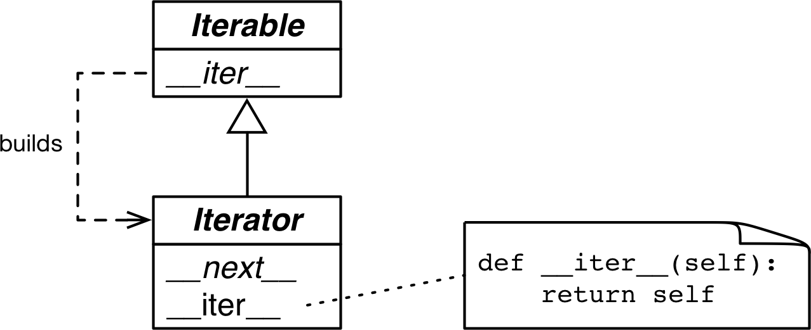
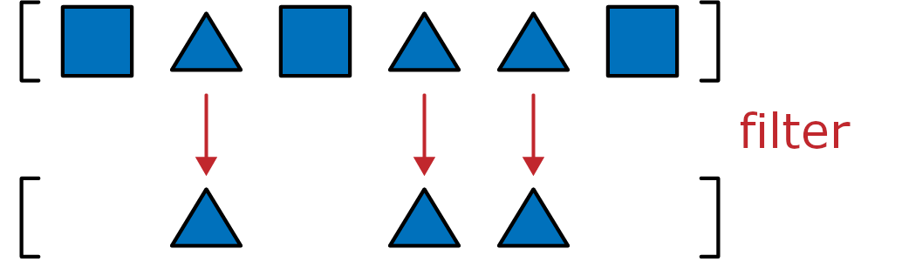
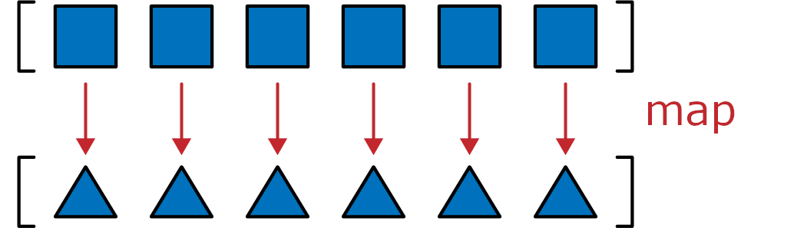
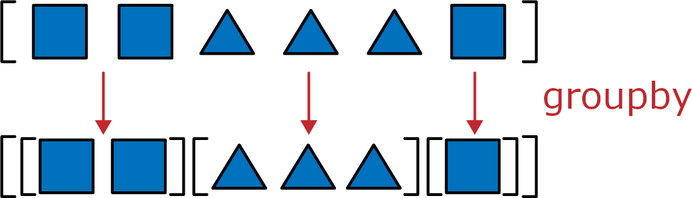
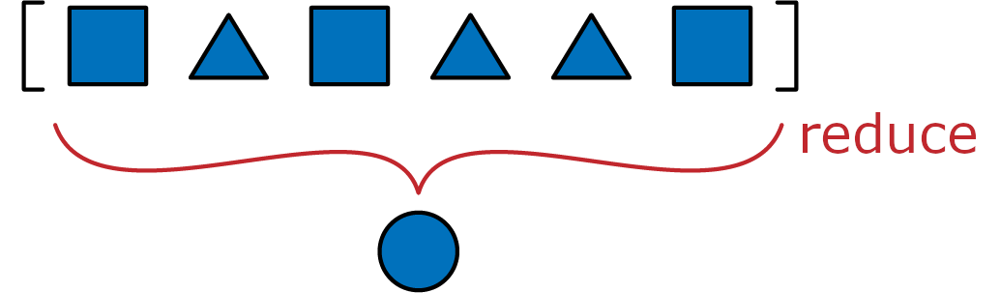

[[ch_generators]]
== Iteradores, geradores e corrotinas clássicas
:example-number: 0
:figure-number: 0

[quote, Paul Graham, hacker de Lisp e investidor]
____

Quando vejo padrões em meus programas, considero isso um mau sinal. +
A forma de um programa deve refletir apenas o problema que ele precisa
resolver. Qualquer
outra regularidade no código é, pelo menos para mim, +
um sinal de que estou usando
abstrações que não são poderosas o suficiente— +
muitas vezes estou gerando à mão
as expansões de alguma macro que preciso escrever.footnote:[De
https://fpy.li/17-1[_Revenge of the Nerds_] (A Revanche dos Nerds), um post de
blog.]

____

A iteração((("iterators", "role of"))) é fundamental para o processamento de
dados: programas aplicam computações sobre séries de dados, de pixels a
nucleotídeos. Se os dados não cabem na memória, precisamos buscar esses itens de
forma _preguiçosa_—um de cada vez e sob demanda. É isso que um iterador faz.
Este capítulo mostra como o padrão de projeto _Iterator_ (Iterador) está
embutido na linguagem Python, de modo que nunca será necessário programá-lo
manualmente.

Todas as coleções padrão de Python são _iteráveis_.
Um _iterável_ é um objeto que fornece um _iterador_,
que Python usa para suportar operações como:

* O laço `for`
* Compreensões de lista, dict e set
* Atribuições com desempacotamento de tuplas
* Criação de instâncias de coleções

Este((("iterators", "topics covered")))((("generators", "topics
covered")))((("coroutines", "topics covered"))) capítulo cobre os seguintes
tópicos:

* Como Python usa a função embutida `iter()` para lidar com objetos iteráveis

* Como é o padrão _Iterator_ clássico escrito em Python

* Porque podemos substituir o padrão _Iterator_ clássico por uma função geradora
ou por uma expressão geradora

* Como funciona uma função geradora, em detalhes, linha a linha

* Como aproveitar o poder das funções geradoras de uso geral da biblioteca padrão

* Usando expressões `yield from` para combinar geradores

* Porque geradores e corrotinas clássicas se parecem, mas são usados de formas
muito diferentes e não devem ser misturadas

=== Novidades neste capítulo

A <<yield_from_sec0>> agora inclui experimentos simples
demonstrando o comportamento de geradores com `yield from`, e um exemplo de
código para percorrer uma estrutura de dados em árvore, desenvolvido passo a passo.

Novas seções explicam as dicas de tipo para os tipos `Iterable`, `Iterator` e
`Generator`.

A última grande seção do capítulo, <<classic_coroutines_sec>>, é agora uma
introdução de 9 páginas a um tópico que ocupava um capítulo de 40 páginas na
primeira edição. Atualizei e publiquei https://fpy.li/oldcoro[«no site»]
que acompanha o livro
o capítulo _Classic Coroutines_ da primeira edição (em inglês).
Era o capítulo mais difícil do livro,
mas ficou menos relevante após a introdução das corrotinas nativas
no Python 3.5 (estudaremos as corrotinas nativas no <<ch_async>>).

Vamos começar examinando como a função embutida `iter()` torna as sequências
iteráveis.

=== Uma sequência de palavras

Vamos((("iterators", "sequence protocol", id="Isequence17")))((("sequence protocol",
id="seqpro17"))) começar nossa exploração de iteráveis implementando
uma classe `Sentence`: seu construtor recebe uma string de texto e daí podemos
iterar sobre a "sentença" palavra por palavra. A primeira versão vai implementar
o protocolo de sequência e será iterável, pois todas as sequências são
iteráveis—como sabemos desde o <<ch_data_model>>. Agora veremos exatamente
por que isso acontece.

O <<ex_sentence0>> mostra uma classe `Sentence` que permite
ler as palavras de um texto por índice.

[[ex_sentence0]]
.sentence.py: `Sentence` como uma sequência de palavras
====
[source, python]
----
include::../code/17-it-generator/sentence.py[tags=SENTENCE_SEQ]
----
====

<1> `.findall` devolve a lista com todos os trechos não sobrepostos
correspondentes à expressão regular, como uma lista de strings.

<2> `self.words` preserva o resultado de `.findall`, então basta devolver a
palavra em um dado índice.

<3> Para completar o protocolo de sequência, implementamos `+__len__+`, apesar
dele não ser necessário para criar um iterável.

<4> `reprlib.repr` devolve representações abreviadas,
como vimos ao implementar +__repr__+ na
classe `Vector` da <<vector_take1_sec>>.

Por default, `reprlib.repr` limita a string gerada a 30 caracteres. Veja como
`Sentence` é usada na sessão de console do <<demo_sentence0>>.

[[demo_sentence0]]
.Testando a iteração em uma instância de `Sentence`
====
[source, python]
----
>>> s = Sentence('"The time has come," the Walrus said,')  # <1>
>>> s
Sentence('"The time ha... Walrus said,')  # <2>
>>> for word in s:  # <3>
...     print(word)
The
time
has
come
the
Walrus
said
>>> list(s)  # <4>
['The', 'time', 'has', 'come', 'the', 'Walrus', 'said']
----
====

<1> Uma sentença criada a partir de uma string.

<2> Observe a saída de `+__repr__+` gerada por `reprlib.repr`, usando `'\...'`.

<3> Instâncias de `Sentence` são iteráveis; veremos a razão em seguida.

<4> Sendo iteráveis, objetos `Sentence` podem ser usados como entrada para criar
listas e outros tipos iteráveis.

Nas próximas páginas vamos desenvolver outras classes `Sentence` que passam nos
testes do <<demo_sentence0>>. Entretanto, a implementação no <<ex_sentence0>>
difere das outras por ser também uma sequência, e então é possível obter
palavras usando um índice:

[source, python]
----
>>> s[0]
'The'
>>> s[5]
'Walrus'
>>> s[-1]
'said'
----

Programadores Python sabem que sequências são iteráveis. Agora vamos descobrir
exatamente o porquê disso.((("", startref="Isequence17")))((("",
startref="seqpro17")))

[[iter_func_sec]]
=== Porque sequências são iteráveis: a função `iter`

Para((("functions", "iter() function")))((("iterators", "iter() function",
id="Iinterfun17")))((("iter() function", id="iterfunc17")))
iterar sobre um objeto `x`, o interpretador Python invoca `iter(x)`.

A função embutida `iter`:

. Verifica se o objeto implementa o método `+__iter__+`, e o invoca para obter
um iterador.

. Se `+__iter__+` não for implementado, mas `+__getitem__+` sim, então `iter`
cria um iterador que tenta buscar itens pelo índice, a partir de `0` (zero).

. Se isso falhar, Python gera um `TypeError`, com a mensagem `'C' object is
not iterable` ("objeto 'C' não é iterável"), onde `C` é a classe do objeto alvo.

Por isso todas as sequências de Python são iteráveis: por definição, todas
implementam `+__getitem__+`. Na verdade, todas as sequências padrão também
implementam `+__iter__+`, e as classes de sequências que você criar também devem
implementar este método. A iteração automática via `+__getitem__+` existe para
manter a compatibilidade retroativa, e pode desaparecer em algum momento—mas
eu duvido que será removida no futuro.

Como mencionado na <<python_digs_seq_sec>>, esta é uma forma extrema de tipagem pato:
um objeto é considerado iterável não apenas quando implementa o método
especial `+__iter__+`, mas também quando implementa `+__getitem__+`. Confira:

[source, python]
----
>>> class Spam:
...     def __getitem__(self, i):
...         print('->', i)
...         raise IndexError()
...
>>> spam_can = Spam()
>>> iter(spam_can)
<iterator object at 0x10a878f70>
>>> list(spam_can)
-> 0
[]
>>> from collections import abc
>>> isinstance(spam_can, abc.Iterable)
False
----

Se uma classe fornece `+__getitem__+`, a função embutida `iter()` aceita uma
instância daquela classe como iterável e cria um iterador a partir da instância.
A maquinaria de iteração de Python chamará `+__getitem__+` com índices,
começando de 0, e entenderá um `IndexError` como sinal de que não há mais itens.

Observe que, apesar de `spam_can` ser iterável (seu método `+__getitem__+`
poderia fornecer itens), ela não é reconhecida assim por uma chamada a
`isinstance` contra `abc.Iterable`.

Na tipagem ganso (_goose typing_), a definição de um iterável é mais simples, mas
não tão flexível: um objeto é considerado iterável se implementa o método
`+__iter__+`. Não é necessário ser subclasse ou se registrar como subclasse virtual,
pois `abc.Iterable`
implementa o `+__subclasshook__+`, como visto na <<subclasshook_sec>>.
Demonstração:

[source, python]
----
>>> class GooseSpam:
...     def __iter__(self):
...         pass
...
>>> from collections import abc
>>> issubclass(GooseSpam, abc.Iterable)
True
>>> goose_spam_can = GooseSpam()
>>> isinstance(goose_spam_can, abc.Iterable)
True
----

[TIP]
====

Desde o Python 3.10, a forma mais precisa de checar se um objeto `x` é iterável
é invocar `iter(x)` e tratar a exceção `TypeError` se ele não for. Isso é mais
preciso que usar `isinstance(x, abc.Iterable)`, porque `iter(x)` também leva em
consideração o método legado `+__getitem__+`, enquanto a ABC `Iterable` não
considera tal método.

====

Verificar explicitamente se um objeto é iterável pode não valer a pena, se você
for iterar sobre o objeto logo após a checagem. Afinal, quando se tenta iterar
sobre um não-iterável, a exceção gerada pelo Python é bem explícita:
`TypeError: 'C' object is not iterable` (o objeto 'C' não é
iterável). Se você quiser fazer algo além de gerar um `TypeError`, então
faça isso em um bloco `try/except` ao invés de realizar uma checagem explícita.
A checagem explícita pode fazer sentido se você estiver guardando o objeto para
iterar sobre ele mais tarde; neste caso, falhar logo facilita o diagnóstico de erros.

A função embutida `iter()` é usada mais frequentemente pelo Python do que em
código que nós escrevemos. Há uma segunda maneira de usá-la, mas não é muito conhecida.

[[iter_closer_look_sec]]
==== Usando `iter` com um invocável

Podemos((("objects", "callable objects", id="Oiter17")))((("callable objects",
"using iter() with", id="COiter17"))) chamar `iter()` com dois argumentos, para
criar um iterador a partir de uma função ou de qualquer objeto invocável. Nesta
forma de uso, o primeiro argumento deve ser um invocável que será invocado sem argumentos
repetidamente para produzir valores, e o segundo argumento é um
https://fpy.li/17-2[«sentinel value»] (valor sentinela): um valor que, quando devolvido
pelo invocável, faz o iterador gerar um `StopIteration` ao invés de produzir o
valor sentinela.

O exemplo a seguir mostra como usar `iter` para rolar um dado de seis faces
enquanto o valor `1` não é sorteado:

[source, python]
----
>>> def d6():
...     return randint(1, 6)
...
>>> d6_iter = iter(d6, 1)
>>> d6_iter
<callable_iterator object at 0x10a245270>
>>> for roll in d6_iter:
...     print(roll)
...
4
3
6
3
----

Observe que a função `iter` devolve um `callable_iterator`. O laço `for` no
exemplo pode rodar por um longo tempo, mas nunca vai devolver `1`, pois esse é o
valor sentinela. Como é comum com iteradores, o objeto `d6_iter` se torna inútil
após ser esgotado. Para recomeçar, é necessário reconstruir o iterador,
invocando novamente `iter()`.

A https://fpy.li/97[«documentação de
`iter`»] inclui a seguinte explicação e código de exemplo:footnote:[NT:
Mudei um pouco a tradução, e
https://fpy.li/98[«sugeri a melhoria»] no
repositório oficial da tradução PT-BR da documentação do Python.]

[quote]
____

Uma aplicação útil da segunda forma de `iter()` é construir um
leitor bloco-a-bloco (_block reader_).
Por exemplo, ler blocos de 64 bytes de um arquivo binário de banco de dados
até que o final do arquivo seja atingido:

____

[source, python]
----
from functools import partial

with open('mydata.db', 'rb') as f:
    read_block = partial(f.read, 64)
    for block in iter(read_block, b''):
        process_block(block)
----

Para deixar o código mais fácil de ler, adicionei a atribuição `read_block`, que não está no
https://fpy.li/97[«exemplo original»].
A função `partial()` é necessária porque o invocável passado a
`iter()` não pode requerer argumentos. No exemplo, um objeto `bytes` vazio é a
sentinela, pois é isso que `f.read` devolve quando não há mais bytes para ler.
A variável `block` pode receber menos de 64 bytes uma vez no final do arquivo,
mas nunca receberá 0 bytes, porque `b''` é o valor sentinela.

A próxima seção detalha a relação entre iteráveis e iteradores.((("",
startref="Iinterfun17")))((("", startref="iterfunc17")))((("",
startref="Oiter17")))((("", startref="COiter17")))

=== Iteráveis versus iteradores

Da((("iterators", "versus iterables", secondary-sortas="iterables",
id="IOvie17")))((("iterables", "versus iterators", secondary-sortas="iterators",
id="IEvio17"))) explicação na <<iter_func_sec>> podemos extrapolar a seguinte
definição:

iterável:: Qualquer objeto a partir do qual a função embutida `iter` consegue
obter um iterador. Objetos que implementam um método `+__iter__+` devolvendo um
iterador são iteráveis. Sequências são sempre iteráveis, bem como objetos que
implementam um método `+__getitem__+` que aceite índices iniciando em 0.

É importante deixar clara a relação entre iteráveis e iteradores: Python obtém
um iterador a partir de um iterável.

Aqui está um simples laço `for` iterando sobre uma `str`. A `str` `'ABC'` é o
iterável aqui. Você não vê, mas há um iterador por trás das cortinas:

[source, python]
----
>>> s = 'ABC'
>>> for char in s:
...     print(char)
...
A
B
C
----

Se não existisse uma instrução `for` e fosse preciso emular o mecanismo do `for`
à mão com um laço `while`, isso é o que teríamos que escrever:

[source, python]
----
>>> s = 'ABC'
>>> it = iter(s)  # <1>
>>> while True:
...     try:
...         char = next(it)  # <2>
...     except StopIteration:  # <3>
...         del it  # <4>
...         break  # <5>
...     print(char)  # <6>
A
B
C
----
<1> Cria um iterador `it` a partir de um iterável.
<2> Chama `next` repetidamente com o iterador, para obter o item seguinte.
<3> O iterador gera `StopIteration` quando não há mais itens.
<4> Libera a referência a `it`—o objeto iterador é descartado.
<5> Sai do laço.
<6> Exibe `char`. Esta variável continua existindo depois do laço.

`StopIteration` sinaliza que o iterador esgotou.
Esta exceção é tratada internamente pelo Python, dentro da lógica dos
laços `for` e de outros contextos de iteração,
como compreensões de lista, desempacotamento de iteráveis, etc.

A interface padrão de um iterador em Python tem dois métodos:

`+__next__+`:: Devolve o próximo item da série,
gerando `StopIteration` se não há mais nenhum.

`+__iter__+`:: Devolve `self`; assim o iterador pode ser
usado quando um iterável é esperado. Por exemplo, em um laço `for`.

Esta interface está formalizada na ABC `collections.abc.Iterator`,
que declara o método abstrato `+__next__+`,
e é uma subclasse de ++Iterable++—onde o método abstrato `+__iter__+` é declarado.
Veja a <<iterable_fig>>.

[[iterable_fig]]
.As ABCs `Iterable` e `Iterator`. Métodos em itálico são abstratos. Um `+Iterable.__iter__+` concreto deve devolver uma nova instância de `Iterator`. Um `Iterator` concreto deve implementar `+__next__+`. O método `+Iterator.__iter__+` apenas devolve a própria instância.

O código-fonte de `collections.abc.Iterator` aparece no <<abc_iterator_src>>.

[[abc_iterator_src]]
.Classe `abc.Iterator`; extraído de https://fpy.li/17-5[__Lib/_collections_abc.py__]
====
[source, python]
----
class Iterator(Iterable):

    __slots__ = ()

    @abstractmethod
    def __next__(self):
        """Return the next item from the iterator.
        When exhausted, raise StopIteration"""
        raise StopIteration

    def __iter__(self):
        return self

    @classmethod
    def __subclasshook__(cls, C):  # <1>
        if cls is Iterator:
            return _check_methods(C, '__iter__', '__next__')  # <2>
        return NotImplemented
----
====

<1> `+__subclasshook__+` suporta a checagem de tipos estrutural com `isinstance`
e `issubclass`. Vimos isso na <<subclasshook_sec>>.

<2> `_check_methods` percorre o atributo `+__mro__+` da classe, para checar se
os métodos estão implementados em sua classe base ou outra superclasse.
Ele está definido no mesmo
módulo, __Lib/_collections_abc.py__. Se os métodos estiverem implementados, a
classe `C` será reconhecida como uma subclasse virtual de `Iterator`. Em outras
palavras, `issubclass(C, Iterable)` devolverá `True`.

[WARNING]
====

O método abstrato da ABC `Iterator` é `+it.__next__()+` no Python 3 e
`it.next()` no Python 2. Como sempre, você deve evitar invocar métodos especiais
diretamente. Use apenas `next(it)`: essa função embutida faz a coisa certa no
Python 2 e no 3—algo útil para quem está migrando bases de código do 2 para o 3.

====

O código-fonte do módulo https://fpy.li/17-6[_Lib/types.py_] no Python 3.9 tem
um comentário dizendo:

----
Iteradores no Python não são uma questão de tipo, mas sim de protocolo.
Um número grande e variável de tipos embutidos implementa *alguma*
forma de iterador. Não verifique o tipo! Em vez disso, use `hasattr`
para detectar os atributos "__iter__" e "__next__".
----

Isto é exatamente o que o método `+__subclasshook__+` da ABC
`abc.Iterator` faz.

[TIP]
====

Dado o conselho de __Lib/types.py__ e a lógica implementada em
__Lib/_collections_abc.py__, a melhor forma de checar se um objeto `x` é um
iterador é invocar `isinstance(x, abc.Iterator)`. Graças ao
`+Iterator.__subclasshook__+`, este teste funciona mesmo quando a
classe de `x` não é uma subclasse real ou virtual de `Iterator`.

====

Voltando à nossa classe `Sentence` no <<ex_sentence0>>, usando o console de
Python podemos ver claramente como o iterador é criado por `iter()` e
consumido por `next()`:

[source, python]
----
>>> s3 = Sentence('Life of Brian')  # <1>
>>> it = iter(s3)  # <2>
>>> it  # doctest: +ELLIPSIS
<iterator object at 0x...>
>>> next(it)  # <3>
'Life'
>>> next(it)
'of'
>>> next(it)
'Brian'
>>> next(it)  # <4>
Traceback (most recent call last):
  ...
StopIteration
>>> list(it)  # <5>
[]
>>> list(iter(s3))  # <6>
['Life', 'of', 'Brian']
----
<1> Cria uma sentença `s3` com três palavras.
<2> Obtém um iterador a partir de `s3`.
<3> `next(it)` devolve a próxima palavra.
<4> Não há mais palavras, então o iterador gera uma exceção `StopIteration`.
<5> Uma vez esgotado, um iterador vai sempre lançar `StopIteration`,
indicando que não há mais itens.
<6> Para percorrer a sentença novamente, precisamos criar um novo iterador.

Como os únicos métodos exigidos de um iterador são `+__next__+` e `+__iter__+`,
não há como checar se há itens restantes, exceto invocando `next()` e capturando
`StopIteration`. Além disso, não é possível "reiniciar" um iterador. Se precisar
começar de novo, invoque `iter()` novamente no iterável que criou o
iterador original. Invocar `iter()` no próprio iterador esgotado não funciona,
pois—como já mencionado—a implementação de `+Iterator.__iter__+`
apenas devolve `self`, e isso não reinicia o iterador.

Esta interface minimalista faz sentido porque, na realidade, nem todos os
iteradores são reiniciáveis. Por exemplo, se um iterador está lendo pacotes da
rede, não há como "rebobiná-lo".footnote:[Agradeço ao revisor técnico Leonardo
Rochael por este ótimo exemplo.]

A primeira versão de `Sentence`, no <<ex_sentence0>>, era iterável graças ao
tratamento especial dispensado pela função `iter` às sequências. A seguir,
vamos codar variações de `Sentence` que implementam `+__iter__+` para
devolver iteradores.((("", startref="IOvie17")))((("", startref="IEvio17")))

=== Classes `Sentence` com `+__iter__+`

As((("iterators", "Sentence classes with &#x005F;&#x005F;iter&#x005F;&#x005F;",
id="ITsentence17")))((("&#x005F;&#x005F;iter&#x005F;&#x005F;",
id="iter17")))((("Sentence classes", id="sentclass17"))) próximas variantes de
`Sentence` implementam o protocolo iterável padrão, primeiro implementando o
padrão de projeto _Iterable_ e depois com funções geradoras.

==== Sentence versão #2: um iterador clássico

A próxima implementação de `Sentence` segue a forma do padrão de projeto _Iterator_ clássico, do livro _Padrões de Projeto_.
Observe que isso não é Python idiomático, como as refatorações seguintes deixarão claro.
Mas é útil para mostrar a distinção entre uma coleção iterável e um iterador que trabalha com ela.

A classe `Sentence` no <<ex_sentence1>> é iterável por implementar o método especial `+__iter__+`,
que cria e devolve um `SentenceIterator`. É assim que um iterável e um iterador se relacionam.

[[ex_sentence1]]
.sentence_iter.py: `Sentence` implementada usando o padrão _Iterator_
====
[source, python]
----
include::../code/17-it-generator/sentence_iter.py[tags=SENTENCE_ITER]
----
====
<1> O método `+__iter__+` é o único acréscimo à implementação anterior de
`Sentence`. Esta versão não tem `+__getitem__+`, para deixar claro que a
classe é iterável por implementar `+__iter__+`.
<2> `+__iter__+` atende ao protocolo iterável instanciando e devolvendo um iterador.
<3> `SentenceIterator` preserva uma referência para a lista de palavras.
<4> `self.index` determina a próxima palavra a ser recuperada.
<5> Obtém a palavra em `self.index`.
<6> Se não há palavra em `self.index`, levanta `StopIteration`.
<7> Incrementa `self.index`.
<8> Devolve a palavra.
<9> Implementa `+self.__iter__+` para suportar `iter(self)`.

O código do <<ex_sentence1>> passa nos testes do <<demo_sentence0>>.

Veja que não é de fato necessário implementar `+__iter__+` em `SentenceIterator`
para este exemplo funcionar, mas é recomendado: supõe-se que iteradores
implementem tanto `+__next__+` quanto `+__iter__+`, e fazer isso permite ao
nosso iterador passar no teste `issubclass(SentenceIterator, abc.Iterator)`. Se
tivéssemos tornado `SentenceIterator` uma subclasse de `abc.Iterator`, teríamos
herdado o método concreto `+abc.Iterator.__iter__+`.

É bastante trabalho (pelo menos para nós, programadores mimados pelo
Python). Observe que a maior parte do código em `SentenceIterator` serve para
gerenciar o estado interno do iterador. Logo veremos como evitar essa
burocracia. Mas antes, um pequeno desvio para tratar de um atalho de
implementação que pode parecer tentador, mas é apenas errado.

[[iterable_not_self_iterator_sec]]
==== Não torne o iterável também um iterador

Uma causa comum de erros na criação de iteráveis e iteradores é confundir os dois.
Para deixar claro: um iterável tem um método `+__iter__+` que instancia um novo iterador a cada invocação.
Um iterador implementa um método `+__next__+`, que devolve itens individuais, e um método
`+__iter__+`, que devolve `self`.

Assim, iteradores também são iteráveis, mas iteráveis não são iteradores.

Pode ser tentador implementar `+__next__+` além de `+__iter__+` na classe
`Sentence`, tornando cada instância de `Sentence` ao mesmo tempo um iterável e
um iterador de si mesma. Mas raramente isso é uma boa ideia. Também é um
anti-padrão comum, de acordo com Alex Martelli, que tem vasta experiência
revisando código no Google.

A seção "Aplicabilidade" do padrão de projeto _Iterator_ no livro _Padrões de Projeto_ diz:

[quote]
____
Use o padrão Iterator para:

* Acessar o conteúdo de um objeto agregado sem expor sua representação interna.

* Suportar travessias múltiplas de objetos agregados.

* Fornecer uma interface uniforme para atravessar diferentes estruturas agregadas (isto é, para suportar iteração polimórfica).
____

Para "suportar travessias múltiplas", deve ser possível obter múltiplos
iteradores independentes a partir de um mesmo objeto iterável, e cada
iterador deve preservar seu próprio estado interno. Assim, uma implementação
adequada do padrão exige que cada invocação de `iter(meu_iterável)` crie um novo
iterador independente. Por isto precisamos da classe
`SentenceIterator` neste exemplo.

Agora((("yield keyword", id="yielda17")))((("keywords", "yield keyword",
id=Kyielda17"))) que sabemos como funciona o padrão _Iterator_
clássico, veremos que não precisamos
"escrever à mão" nenhuma classe de iterador em Python,
graças à instrução `yield`, que foi inspirada pela linguagem
https://fpy.li/17-7[_CLU_], criada por um time liderado por Barbara Liskov.

As próximas seções apresentam versões mais idiomáticas de `Sentence`.

==== Sentence versão #3: uma função geradora

Uma((("generators", "Sentence classes with"))) implementação pythônica da mesma
funcionalidade usa um gerador, evitando todo o trabalho para implementar a
classe `SentenceIterator`. A explicação completa do gerador está logo após o
<<ex_sentence2>>.

[[ex_sentence2]]
.sentence_gen.py: `Sentence` implementada usando um gerador
====
[source, python]
----
include::../code/17-it-generator/sentence_gen.py[tags=SENTENCE_GEN]
----
====

<1> Itera sobre `self.words`.

<2> Produz a `word` atual.

<3> Um `return` explícito não é necessário. Uma função geradora
não gera `StopIteration`: ela simplesmente termina quando acaba de produzir
valores.footnote:[Ao revisar esse código, Alex Martelli sugeriu que o corpo
deste método poderia ser simplesmente `return iter(self.words)`. Ele está certo:
o resultado da invocação de `+self.words.__iter__()+` também seria um iterador,
como deve ser. Entretanto, usei um laço `for` com `yield` aqui para introduzir a
sintaxe de uma função geradora, que exige a instrução `yield`, como veremos na
próxima seção. Durante a revisão da segunda edição deste livro, Leonardo Rochael
sugeriu ainda outro atalho para o corpo de `+__iter__+`: `yield from
self.words`. Também vamos falar de `yield from` mais adiante neste mesmo
capítulo.]

<4> Não precisamos escrever uma classe iteradora!

Temos aqui mais uma implementação de `Sentence` que passa nos
testes do <<demo_sentence0>>.

No código de `Sentence` do <<ex_sentence1>>, `+__iter__+` chamava o construtor
`SentenceIterator` para criar e devolver um iterador. Agora o iterador do
<<ex_sentence2>> é um objeto gerador, criado automaticamente quando o
método `+__iter__+` é invocado, porque neste exemplo `+__iter__+` é uma função geradora.

A seguir: uma explicação bem completa sobre geradores.

==== Como funciona um gerador

Qualquer((("generators", "yield keyword"))) função de Python contendo a
instrução `yield` em seu corpo é uma função geradora: uma função que, quando
invocada, devolve um objeto gerador. Em outras palavras, uma função geradora é
uma fábrica de geradores.

[role="man-height3"]
[TIP]
====

O único elemento sintático que identifica uma função geradora
é a presença da instrução `yield` em algum lugar de seu corpo.
Alguns defenderam que uma nova palavra reservada (como `gen`), deveria ser
usada no lugar de `def` para declarar funções geradoras, mas Guido não
concordou. Seus argumentos estão na https://fpy.li/pep255[_PEP 255—Simple
Generators_] (Geradoras Simples).footnote:[Eu algumas vezes acrescento um
prefixo ou sufixo `gen` ao nomear funções geradoras, mas essa não é uma prática
comum. E claro que não é possível fazer isso ao implementar um iterável: o
método especial obrigatório deve se chamar `+__iter__+`.]

====

O <<gen-func-ex-three-yield>> mostra o comportamento de uma função geradora simples.footnote:[Agradeço a David Kwast por sugerir esse exemplo.]

[[gen-func-ex-three-yield]]
.Uma função geradora que produz três números((("generators", "examples of", id="genex17")))
====
[source, python]
----
>>> def gen_123():
...     yield 1  # <1>
...     yield 2
...     yield 3
...
>>> gen_123  # doctest: +ELLIPSIS
<function gen_123 at 0x...>  # <2>
>>> gen_123()   # doctest: +ELLIPSIS
<generator object gen_123 at 0x...>  # <3>
>>> for i in gen_123():  # <4>
...     print(i)
1
2
3
>>> g = gen_123()  # <5>
>>> next(g)  # <6>
1
>>> next(g)
2
>>> next(g)
3
>>> next(g)  # <7>
Traceback (most recent call last):
  ...
StopIteration
----
====

<1> O corpo de uma função geradora muitas vezes contém `yield` dentro de um
laço, mas não necessariamente; aqui eu apenas repeti `yield` três vezes.

<2> Olhando mais de perto, vemos que `gen_123` é um objeto função.

<3> Mas quando invocado, `gen_123()` devolve um objeto gerador.

<4> Objetos geradores implementam a interface `Iterator`, então são também
iteráveis.

<5> Atribuímos esse novo objeto gerador a `g`, para podermos testar seu
funcionamento.

<6> Como `g` é um iterador, chamar `next(g)` obtém o próximo item produzido por
`yield`.

<7> Quando a função geradora termina, o objeto gerador levanta uma `StopIteration`.

Uma função geradora cria um objeto gerador que encapsula o corpo da função.
Quando invocamos `next()` no objeto gerador,
a execução avança para o próximo `yield` no corpo da função,
e a chamada a `next()` resulta no valor produzido quando o corpo da função é suspenso.
Por fim, o objeto gerador externo criado  pelo Python levanta `StopIteration` quando a função retorna, de acordo com o protocolo `Iterator`.

[TIP]
====

Acho útil ser rigoroso ao falar sobre valores obtidos a partir de um gerador. É
confuso dizer que um gerador "devolve" ou "retorna" valores. Funções devolvem
valores. A chamada a uma função geradora devolve um gerador. Um gerador produz
(_yields_) valores. Um gerador não "devolve" valores no sentido comum do termo:
a instrução `return` no corpo de uma função geradora faz com que uma
`StopIteration` seja levantada pelo objeto gerador. Se você escrever `return x`
na função geradora, quem a chamou pode recuperar o valor de `x` embrulhado na
exceção `StopIteration`, mas normalmente isso é feito automaticamente usando a
sintaxe `yield from`, como veremos na <<coro_return_sec>>.

====

O <<ex_gen_ab>> torna mais explícita a interação entre um laço `for` e o corpo da função geradora.

[[ex_gen_ab]]
.Uma função geradora que exibe mensagens quando roda
====
[source, python]
----
>>> def gen_AB():
...     print('start')
...     yield 'A'          # <1>
...     print('continue')
...     yield 'B'          # <2>
...     print('end.')      # <3>
...
>>> for c in gen_AB():     # <4>
...     print('-->', c)    # <5>
...
start     <6>
--> A     <7>
continue  <8>
--> B     <9>
end.      <10>
>>>       <11>
----
====

<1> A primeira chamada implícita a `next()` no laço `for` em `④` vai exibir
`'start'` e parar no primeiro `yield`, produzindo o valor `'A'`.

<2> A segunda chamada implícita a `next()` no laço `for` vai exibir `'continue'`
e parar no segundo `yield`, produzindo o valor `'B'`.

<3> A terceira chamada a `next()` vai exibir `'end.'` e continuar até o final do
corpo da função, fazendo com que o objeto gerador levante uma `StopIteration`.

<4> Para iterar, o mecanismo do `for` faz o equivalente a `g = iter(gen_AB())`
para obter um objeto gerador, e daí `next(g)` a cada iteração.

<5> O laço exibe `-{rt-arrow}` e o valor devolvido por `next(g)`. Esse resultado
só aparece após a saída das chamadas `print` dentro da função geradora.

<6> O texto `start` vem de `print('start')` no corpo do gerador.

<7> `yield 'A'` no corpo do gerador produz o valor `'A'` consumido pelo laço
`for`, que é atribuído à variável `c` e resulta na saída `-{rt-arrow} A`.

<8> A iteração continua com a segunda chamada a `next(g)`, avançando no corpo do
gerador de `yield 'A'` para `yield 'B'`. O texto `continue` é gerado pelo
segundo `print` no corpo do gerador.

<9> `yield 'B'` produz o valor 'B' consumido pelo laço `for`, que é atribuído à
variável `c` do laço, que então exibe `-{rt-arrow} B`.

<10> A iteração continua com uma terceira chamada a `next(it)`, avançando para o
final do corpo da função. O texto `end.` é exibido por causa do terceiro `print`
no corpo do gerador.

<11> Quando a função geradora chega ao final, o objeto gerador levanta uma
`StopIteration`. O mecanismo do laço `for` captura essa exceção, e o laço
encerra naturalmente.

Espero agora ter deixado claro como `+Sentence.__iter__+` no <<ex_sentence2>>
funciona: `+__iter__+` é uma função geradora que, quando invocada, cria um objeto
gerador que implementa a interface `Iterator`, então a classe `SentenceIterator`
não é mais necessária.

A segunda versão de `Sentence` é mais concisa que a primeira, mas não é tão
preguiçosa quanto poderia ser. Atualmente, a _preguiça_ é considerada uma
virtude, pelo menos em linguagens de programação e APIs. Uma implementação
preguiçosa adia a produção de valores até o último momento possível. Isso
economiza memória e também pode evitar o desperdício de ciclos de CPU.

A seguir, criaremos classes `Sentence` preguiçosas.((("",
startref="ITsentence17")))((("", startref="iter17")))((("",
startref="sentclass17")))((("", startref="genex17")))((("",
startref="yielda17")))((("", startref="Kyielda17")))

=== Sentenças preguiçosas

As((("iterators", "lazy sentences", id="Ilazy17")))((("generators",
"lazy generators", id="Glazy17")))((("lazy sentences", id="lazysen17")))
últimas variações de `Sentence` são preguiçosas, valendo-se de uma
função geradora do módulo `re`.

==== Sentence versão #4: um gerador preguiçoso

A interface `Iterator` foi projetada para ser preguiçosa: `next(my_iterator)`
produz um item por vez. O oposto de preguiçosa é ávida: avaliação preguiçosa
(_lazy evaluation_) e avaliação ávida (_eager evaluation_) são termos técnicos da teoria
das linguagens de programação.footnote:[NT: Em português a
literatura usa também avaliação _estrita_ e _não estrita_.
Optamos pelos termos "preguiçosa" e "ávida", que são mais descritivos.]

Até aqui, nossas implementações de `Sentence` não são preguiçosas,
pois o `+__init__+` cria avidamente uma lista com todas as palavras no texto, vinculando-as ao atributo `self.words`.
Isso exige o processamento do texto inteiro, e a lista pode acabar usando tanta memória quanto o próprio texto (provavelmente mais: vai depender de quantos caracteres que não fazem parte de palavras existirem no texto).
A maior parte deste trabalho será inútil se o usuário iterar apenas sobre as primeiras palavras.
Se você está se perguntando se "Existiria uma forma preguiçosa de fazer isso em Python?", a resposta muitas vezes é "Sim".

A função `re.finditer` é uma versão preguiçosa de `re.findall`. Em vez de uma lista, `re.finditer` devolve um gerador que produz instâncias de `re.MatchObject` sob demanda.
Se existirem muitos itens, `re.finditer` economiza muita memória.
Com ela, nossa terceira versão de `Sentence` agora é preguiçosa:
ela só lê a próxima palavra do texto quando necessário.
O código está no <<ex_sentence3>>.

[[ex_sentence3]]
.sentence_gen2.py: `Sentence` implementada usando uma função geradora que invoca a função geradora `re.finditer`
====
[source, python]
----
include::../code/17-it-generator/sentence_gen2.py[tags=SENTENCE_GEN2]
----
====
<1> Não é necessário manter uma lista `words`.
<2> `finditer` cria um iterador sobre os termos encontrados com `RE_WORD` em `self.text`, produzindo instâncias de `MatchObject`.
<3> `match.group()` extrai o texto da instância de `MatchObject`.

Geradores são um ótimo atalho, mas o código pode ser ainda mais conciso com uma expressão geradora.

==== Sentence versão #5: Expressão geradora preguiçosa

Podemos substituir funções geradoras simples—como aquela na última
classe `Sentence` (no <<ex_sentence3>>)—por uma expressão geradora.
Assim como uma compreensão de lista cria listas, uma expressão geradora cria objetos geradores.
O <<ex_gen_ab_genexp>> compara o comportamento nos dois casos.

[[ex_gen_ab_genexp]]
.A função geradora `gen_AB` é usada primeiro por uma compreensão de lista, depois por uma expressão geradora
====
[source, python]
----
>>> def gen_AB():  # <1>
...     print('start')
...     yield 'A'
...     print('continue')
...     yield 'B'
...     print('end.')
...
>>> res1 = [x*3 for x in gen_AB()]  # <2>
start
continue
end.
>>> for i in res1:  # <3>
...     print('-->', i)
...
--> AAA
--> BBB
>>> res2 = (x*3 for x in gen_AB())  # <4>
>>> res2
<generator object <genexpr> at 0x10063c240>
>>> for i in res2:  # <5>
...     print('-->', i)
...
start      # <6>
--> AAA
continue
--> BBB
end.
----
====
<1> Esta é a mesma função `gen_AB` do <<ex_gen_ab>>.
<2> A compreensão de lista itera avidamente sobre os itens produzidos pelo objeto gerador devolvido por `gen_AB()`: `'A'` e `'B'`. Observe a saída nas linhas seguintes: `start`, `continue`, `end.`
<3> Este laço `for` itera sobre a lista `res1` criada pela compreensão de lista.
<4> A expressão geradora devolve `res2`, um objeto gerador. O gerador não é consumido aqui.
<5> Este gerador obtém itens de `gen_AB` apenas quando o laço `for` itera sobre `res2`. Cada iteração do laço `for` invoca, implicitamente, `next(res2)`, que por sua vez invoca `next()` sobre o objeto gerador devolvido por `gen_AB()`, fazendo este último avançar até o próximo `yield`.
<6> Observe como a saída de `gen_AB()` se intercala com a saída do `print` no laço `for`.

Podemos usar uma expressão geradora para reduzir ainda mais o código na classe `Sentence`. Veja o <<ex_sentence4>>.

[[ex_sentence4]]
.sentence_genexp.py: `Sentence` implementada usando uma expressão geradora
====
[source, python]
----
include::../code/17-it-generator/sentence_genexp.py[tags=SENTENCE_GENEXP]
----
====

A única diferença com o <<ex_sentence3>> é o método `+__iter__+`, que aqui não é uma função geradora (ela não contém uma instrução `yield`) mas usa uma expressão geradora para criar um gerador e devolvê-lo. O resultado final é o mesmo: quem invoca `+__iter__+` recebe um objeto gerador.

Expressões geradoras são "açúcar sintático": sempre podem ser substituídas por funções geradoras, mas às vezes são mais convenientes. A próxima seção trata do uso de expressões geradoras.((("", startref="Ilazy17")))((("", startref="Glazy17")))((("", startref="lazysen17")))

=== Quando usar expressões geradoras

Usei((("generators", "when to use generator expressions")))((("generator
expressions (genexps)"))) expressões geradoras quando implementamos a
classe `Vector` no <<ex_vector_v5>> do <<ch_seq_methods>>. Estes
métodos contêm expressões geradoras: `+__eq__+`, `+__hash__+`, `+__abs__+`,
`angle`, `angles`, `format`, `+__add__+`, e `+__mul__+`.
Em todos eles, uma compreensão de
lista também funcionaria, usando mais memória para armazenar os
valores da lista intermediária.

No <<ex_sentence4>>, vimos que uma expressão geradora é um atalho sintático para
criar um gerador sem definir e invocar uma função. Por outro lado, funções
geradoras são mais flexíveis: podemos programar uma lógica complexa, com
várias instruções, e podemos até usá-las como _corrotinas_, como veremos na
<<classic_coroutines_sec>>.

Nos casos mais simples, uma expressão geradora é mais fácil de ler de relance, como mostra o exemplo de `Vector`.

Minha regra básica para escolher qual sintaxe usar é simples: se a expressão geradora exige mais que um par de linhas, prefiro escrever uma função geradora, em nome da legibilidade.

[TIP]
.Dica de sintaxe
====

Quando uma expressão geradora é passada como único argumento a uma função ou construtor,
não é necessário escrever um par de parênteses para
invocar função e outro par ao redor da expressão geradora.
Um único par é
suficiente, como na invocação do construtor `Vector` no método `+__mul__+` do
<<ex_vector_v5>>, reproduzido abaixo:

[source, python]
----
def __mul__(self, scalar):
    if isinstance(scalar, numbers.Real):
        return Vector(n * scalar for n in self)
    else:
        return NotImplemented
----

Entretanto, se a invocação exigir mais argumentos após a expressão
geradora, é preciso cercá-la com parênteses para evitar um
`SyntaxError`.

====

Os exemplos de `Sentence` vistos até aqui mostram geradores fazendo o papel do padrão _Iterator_ clássico: obter itens de uma coleção.
Mas podemos também usar geradores para produzir valores sem acessar uma estrutura de dados.
A próxima seção mostra um exemplo.

Mas antes, uma pequena discussão sobre os conceitos sobrepostos de _iterador_  e _gerador_.

.Comparando iteradores e geradores
****

Na((("iterators", "versus generators", secondary-sortas="generators")))((("generators", "versus iterators", secondary-sortas="iterators"))) documentação e na base de código oficiais de Python, a terminologia em torno de iteradores e geradores é inconsistente e está em evolução.
Adotei as seguintes definições:

iterador::
    Termo geral para qualquer objeto que implementa um método `+__next__+`.
    Iteradores são projetados para produzir dados a serem consumidos pelo código cliente, isto é, o código que controla o iterador através de um laço `for` ou outro mecanismo de iteração, ou chamando `next(it)` explicitamente no iterador—apesar desse uso explícito incomum.
    Na prática, a maioria dos iteradores que usamos no Python são _geradores_.

gerador::
    Um iterador criado pelo compilador do Python.
    Para criar um gerador, não implementamos uma classe com `+__next__+`.
    Em vez disso, usamos((("yield keyword")))((("keywords", "yield keyword"))) a palavra reservada `yield` para criar uma _função geradora_, que é uma fábrica de _objetos geradores_.
    Uma _expressão geradora_ é outra maneira de criar um objeto gerador.
    Objetos geradores fornecem `+__next__+`, portanto são iteradores.
    Desde o Python 3.5, também temos _geradores assíncronos_, declarados com `async def`.
    Vamos estudá-los no <<ch_async>>.

O https://fpy.li/99[_Glossário de Python_]
introduziu recentemente o termo
https://fpy.li/9a[«iterador gerador»]
para se referir a objetos geradores criados por funções geradoras,
enquanto o verbete para
https://fpy.li/9b[«expressão geradora»] diz que ela devolve um "iterador".

Mas, para o interpretador Python,
os objetos devolvidos em ambos os casos são objetos geradores:

[source, python]
----
>>> def g():
...     yield 0
...
>>> g()
<generator object g at 0x10e6fb290>
>>> ge = (c for c in 'XYZ')
>>> ge
<generator object <genexpr> at 0x10e936ce0>
>>> type(g()), type(ge)
(<class 'generator'>, <class 'generator'>)
----

****

=== Um gerador de progressão aritmética

O((("generators", "arithmetic progression generators", id="Garith17")))
padrão _Iterator_ clássico trata de navegar por uma estrutura de dados.
Sua interface padrão é um método que fornece o próximo item de uma série.
Tal interface também é útil quando os itens são produzidos sob demanda,
ao invés de serem lidos de uma coleção.
Por exemplo, a função embutida `range` gera uma progressão aritmética (PA)
de inteiros.
E se precisarmos gerar uma PA com números de qualquer tipo, não apenas inteiros?

O <<ap_class_demo>> mostra alguns testes no console com uma classe `ArithmeticProgression`, que veremos em breve.
A assinatura do construtor no <<ap_class_demo>> é `ArithmeticProgression(begin, step[, end])`.
A assinatura completa da função embutida `range` é `range(start, stop[, step])`.
Escolhi implementar uma assinatura diferente porque o `step` é obrigatório,
mas o `end` é opcional.
Também mudei os nomes dos argumentos `start/stop` para `begin/end`,
para deixar claro que optei por uma assinatura diferente.
Para cada teste no <<ap_class_demo>>, chamo `list()` com o resultado para exibir os valores gerados.

[[ap_class_demo]]
.Demonstração de uma classe `ArithmeticProgression`
====
[source, python]
----
include::../code/17-it-generator/aritprog_v1.py[tags=ARITPROG_CLASS_DEMO]
----
====

Observe que o tipo dos números na progressão aritmética resultante
segue o tipo de `begin + step`, de acordo com as regras de coerção numérica da aritmética de Python.
No <<ap_class_demo>>, você pode ver listas de números `int`, `float`, `Fraction`, e `Decimal`.
O <<ex_ap_class>> mostra a implementação da classe `ArithmeticProgression`.

[[ex_ap_class]]
.A classe `ArithmeticProgression`
====
[source, python]
----
include::../code/17-it-generator/aritprog_v1.py[tags=ARITPROG_CLASS]
----
====

<1> `+__init__+` exige dois argumentos: `begin` e `step`; `end` é opcional, se for `None`, a série será ilimitada.

<2> Obtém o tipo somando `self.begin` e `self.step`. Por exemplo, se um for `int` e o outro `float`, o `result_type` será `float`.

<3> Esta linha cria um `result` com o mesmo valor numérico de `self.begin`, mas coagido para o tipo das somas subsequentes.footnote:[No Python 2, havia uma função embutida `coerce()`, mas ela não existe mais no Python 3. Foi considerada desnecessária, pois as regras de coerção numérica estão implícitas nos métodos dos operadores aritméticos. Então, a melhor forma que pude imaginar para forçar o valor inicial para o mesmo tipo do restante da série foi realizar a adição e usar seu tipo para converter o resultado. Perguntei sobre isso na Python-list e recebi uma excelente https://fpy.li/17-11[«resposta de Steven D'Aprano»].]

<4> Para melhorar a legibilidade, o sinalizador `forever` será `True` se o atributo `self.end` for `None`, resultando em uma série ilimitada.

<5> Este laço roda `forever` (para sempre) ou até o resultado ser igual ou maior que `self.end`. Quando este laço termina, a função retorna.

<6> O `result` atual é produzido.

<7> O próximo resultado em potencial é calculado. Ele pode nunca ser produzido, se o laço `while` terminar.

Na última linha do <<ex_ap_class>>,
em vez de somar `self.step` ao `result` anterior a cada volta do laço,
optei por ignorar o `result` existente: cada novo `result` é criado somando `self.begin` a `self.step` multiplicado por `index`.
Isso evita o efeito cumulativo de erros após a adição sucessiva de números de ponto flutuante.
Alguns experimentos simples revelam a diferença:

[source, python]
----
>>> 100 * 1.1
110.00000000000001
>>> sum(1.1 for _ in range(100))
109.99999999999982
>>> 1000 * 1.1
1100.0
>>> sum(1.1 for _ in range(1000))
1100.0000000000086
----

A classe `ArithmeticProgression` do <<ex_ap_class>> 
é outro exemplo do uso de uma função geradora para implementar o método especial `+__iter__+`.
Agora, se o único objetivo de uma classe é criar um gerador pela implementação de `+__iter__+`,
podemos substituir a classe inteira por uma função geradora.
Afinal, uma função geradora é uma fábrica de geradores.

O <<ex_ap_genfunc1>> mostra uma função geradora chamada `aritprog_gen`, que
realiza a mesma tarefa da `ArithmeticProgression`, mas com menos código. Se, em
vez de chamar `ArithmeticProgression`, você chamar `aritprog_gen`, os testes no
<<ap_class_demo>> são todos bem-sucedidos.footnote:[O diretório
__17-it-generator/__ no https://fpy.li/code[«repositório de código»] do _Python
Fluente_ inclui doctests e um script, __aritprog_runner.py__, que roda os testes
contra todas as variações dos scripts __aritprog*.py__.]

[[ex_ap_genfunc1]]
.a função geradora `aritprog_gen`
====
[source, python]
----
include::../code/17-it-generator/aritprog_v2.py[tags=ARITPROG_GENFUNC]
----
====

O <<ex_ap_genfunc1>> é elegante, mas lembre-se sempre: há muitos geradores prontos para uso na biblioteca padrão, e a próxima seção vai mostrar uma implementação mais curta, usando o módulo `itertools`.

[[ap_itertools_sec]]
==== Progressão aritmética com itertools

O((("itertools module"))) módulo `itertools` no Python 3.10 contém 20 funções geradoras, que podem ser combinadas de várias maneiras interessantes.

Por exemplo, a função `itertools.count` devolve um gerador que produz números. Sem argumentos, ele produz uma série de inteiros começando de `0`. Mas você pode fornecer os valores opcionais `start` e `step`, para obter um resultado similar ao das nossas funções `aritprog_gen`:

[source, python]
----
>>> import itertools
>>> gen = itertools.count(1, .5)
>>> next(gen)
1
>>> next(gen)
1.5
>>> next(gen)
2.0
>>> next(gen)
2.5
----

[WARNING]
====
`itertools.count` nunca para, então se você chamar `list(count())`, Python vai tentar criar uma `list` que preencheria todos os chips de memória já fabricados.
Na prática, sua máquina vai ficar muito mal-humorada bem antes da chamada fracassar.
====

Por outro lado, temos também a função `itertools.takewhile`: ela devolve um
gerador que consome outro gerador e para quando um predicado resulta falso.
Então podemos combinar os dois e escrever o seguinte:

[source, python]
----
>>> gen = itertools.takewhile(lambda n: n < 3, itertools.count(1, .5))
>>> list(gen)
[1, 1.5, 2.0, 2.5]
----

Aproveitando `takewhile` e `count`, o <<ex_almost_aritprog>> fica mais conciso.

[[ex_almost_aritprog]]
.aritprog_v3.py: funciona como as funções `aritprog_gen` anteriores
====
[source, python]
----
include::../code/17-it-generator/aritprog_v3.py[tags=ARITPROG_ITERTOOLS]
----
====

Observe que  `aritprog_gen` no <<ex_almost_aritprog>> não é uma função geradora: não há um `yield` em seu corpo.
Mas ela devolve um gerador, exatamente como faz uma função geradora.

A lição do <<ex_almost_aritprog>> é:
ao implementar geradores, veja o que já está disponível na biblioteca padrão,
caso contrário você tem uma boa chance de reinventar a roda.
Por isso a próxima seção trata de várias funções geradoras prontas para usar.((("", startref="Garith17")))

[[stdlib_generators_sec]]
=== Funções geradoras na biblioteca padrão

A((("generators", "generator functions in Python standard library",
id="Ggenfunc17"))) biblioteca padrão oferece muitos geradores, desde objetos de
arquivo de texto fornecendo iteração linha por linha até a incrível função
https://fpy.li/17-12[os.walk], que produz nomes de arquivos percorrendo uma
árvore de diretórios, reduzindo uma busca recursiva no sistema de arquivos
a um simples laço `for`.

A função geradora `os.walk` é impressionante, mas nesta seção quero me
concentrar em funções genéricas que recebem iteráveis arbitrários como argumento
e devolvem geradores que produzem itens selecionados, agregados ou reordenados.

==== Funções geradoras de seleção

[[filter_fig_2]]
.Funções geradoras de seleção criam geradores que selecionam itens conforme algum critério.

((("filtering generator functions")))O primeiro grupo são funções geradoras de
seleção: elas devolvem um gerador que produz um subconjunto dos itens do
iterável de entrada, sem mudar os itens em si.

O exemplo mais conhecido é a função embutida `filter`:

`filter(predicate, it)`::
    Aplica `predicate` para cada item de `iterable`, produzindo o item se
    `predicate(item)` resulta verdadeiro. Quando `predicate` é `None`,
    apenas itens verdadeiros serão produzidos.

Como `filter`, a maioria das funções listadas na <<filter_genfunc_tbl>>
recebe uma `predicate` (uma função booleana de um argumento) que será aplicada a
cada item no iterável de entrada, para determinar se aquele item será incluído
na saída. A exceção é `itertools.compress`, que consome dois iteráveis, sendo
que o segundo iterável fornece valores para decidir quais itens do primeiro iterável serão produzidos.
Veja o uso de `compress` no <<demo_filter_genfunc>>.

<<<

[[filter_genfunc_tbl]]
.`itertools`: funções geradoras de seleção
[options="header", cols="5,9"]
|=======================
|Função|Descrição
|`compress(it, selector_it)`|Consome dois iteráveis em paralelo; produz itens de `it` sempre que o item correspondente em `selector_it` é verdadeiro
|`dropwhile(predicate, it)`|Consome `it`, pulando itens enquanto `predicate` resultar verdadeiro, e daí produz todos os elementos restantes (nenhuma verificação adicional é realizada)
|`filterfalse(predicate, it)`|Como a `filter`, mas invertendo a lógica: produz itens quando `predicate` resulta falso
|`islice(it, stop)` +
 `islice(it, start, stop, step=1)`|Produz itens de uma fatia de `it`, similar a `s[:stop]` ou `s[start:stop:step]`, mas `it` é qualquer iterável e a operação é preguiçosa
|`takewhile(predicate, it)`|Produz itens enquanto `predicate`  resultar verdadeiro, e daí para (nenhuma verificação adicional é realizada).
|=======================

A seção de console no <<demo_filter_genfunc>> demonstra o uso dos geradores de seleção.

[[demo_filter_genfunc]]
.Exemplos de funções geradoras de seleção
====
[source, python]
----
>>> def vowel(c):
...     return c.lower() in 'aeiou'
...
>>> list(filter(vowel, 'Aardvark'))
['A', 'a', 'a']
>>> import itertools
>>> list(itertools.filterfalse(vowel, 'Aardvark'))
['r', 'd', 'v', 'r', 'k']
>>> list(itertools.dropwhile(vowel, 'Aardvark'))
['r', 'd', 'v', 'a', 'r', 'k']
>>> list(itertools.takewhile(vowel, 'Aardvark'))
['A', 'a']
>>> list(itertools.compress('Aardvark', (1, 0, 1, 1, 0, 1)))
['A', 'r', 'd', 'a']
>>> list(itertools.islice('Aardvark', 4))
['A', 'a', 'r', 'd']
>>> list(itertools.islice('Aardvark', 4, 7))
['v', 'a', 'r']
>>> list(itertools.islice('Aardvark', 1, 7, 2))
['a', 'd', 'a']
----
====

==== Funções geradoras de transformação

[[map_fig_2]]
.Funções geradoras de transformação criam geradores que aplicam uma função aos itens da entrada, produzindo itens transformados.

O((("mappings", "mapping generator functions"))) grupo seguinte contém os
geradores de transformação. Estes geradores produzem
itens computados a partir de cada item individual no iterável de entrada—ou
iteráveis, nos casos de `map` e `starmap`. 
Se a entrada vier de mais de um iterável, a saída para assim que o primeiro
iterável de entrada for esgotado.

[[mapping_genfunc_tbl]]
.Funções geradoras de transformação (embutidas)
[options="header", cols="7,10"]
|============================
|Função|Descrição
|`enumerate(iterable, start=0)`|Produz tuplas de dois itens na forma `(index, item)`, onde `index` é contado a partir de `start`, e `item` é obtido do `iterable`
|`map(func, it1, [it2, …, itN])`|Aplica `func` a cada item de `it`, produzindo o resultado; se forem fornecidos N iteráveis, `func` deve aceitar N argumentos, e os iteráveis serão consumidos em paralelo
|============================

O módulo `itertools` oferece mais duas funções geradoras de transformação:

[[mapping_genfunc_itertools_tbl]]
.`itertools`: funções geradoras de transformação
[options="header", cols="4,9"]
|==========================
|Função|Descrição
|`starmap(func, it)`|Aplica `func` a cada item de `it`, produzindo o resultado; o iterável de entrada deve produzir itens iteráveis `iit`, e `func` é aplicada na forma `func(*iit)`
|`accumulate(it, [func])`|Produz somas cumulativas; se `func` for fornecida, produz o resultado da aplicação de `func` ao primeiro par de itens, depois ao primeiro resultado e ao próximo item, etc.
|==========================

O <<demo_accumulate_genfunc>> demonstra alguns usos de `itertools.accumulate`.

[[demo_accumulate_genfunc]]
.Exemplos das funções geradoras de `itertools.accumulate`
====
[source, python]
----
>>> import itertools
>>> sample = [5, 4, 2, 8, 7, 6, 3, 0, 9, 1]
>>> list(itertools.accumulate(sample))  # <1>
[5, 9, 11, 19, 26, 32, 35, 35, 44, 45]
>>> list(itertools.accumulate(sample, min))  # <2>
[5, 4, 2, 2, 2, 2, 2, 0, 0, 0]
>>> list(itertools.accumulate(sample, max))  # <3>
[5, 5, 5, 8, 8, 8, 8, 8, 9, 9]
>>> import operator
>>> list(itertools.accumulate(sample, operator.mul))  # <4>
[5, 20, 40, 320, 2240, 13440, 40320, 0, 0, 0]
>>> list(itertools.accumulate(range(1, 11), operator.mul))
[1, 2, 6, 24, 120, 720, 5040, 40320, 362880, 3628800]  # <5>
----
====
<1> Soma acumulada.
<2> Mínimo corrente.
<3> Máximo corrente.
<4> Produto acumulado.
<5> Fatoriais de `1!` a `10!`.

As demais funções de transformação são demonstradas no <<demo_mapping_genfunc>>.

[[demo_mapping_genfunc]]
.Exemplos de funções geradoras de transformação
====
[source, python]
----
>>> list(enumerate('albatroz', 1))  # <1>
[(1, 'a'), (2, 'l'), (3, 'b'), (4, 'a'), (5, 't'), (6, 'r'), (7, 'o'), (8, 'z')]
>>> import operator
>>> list(map(operator.mul, range(11), range(11)))  # <2>
[0, 1, 4, 9, 16, 25, 36, 49, 64, 81, 100]
>>> list(map(operator.mul, range(11), [2, 4, 8]))  # <3>
[0, 4, 16]
>>> list(map(lambda a, b: (a, b), range(11), [2, 4, 8]))  # <4>
[(0, 2), (1, 4), (2, 8)]
>>> import itertools
>>> list(itertools.starmap(operator.mul, enumerate('albatroz', 1)))  # <5>
['a', 'll', 'bbb', 'aaaa', 'ttttt', 'rrrrrr', 'ooooooo', 'zzzzzzzz']
>>> sample = [5, 4, 2, 8, 7, 6, 3, 0, 9, 1]
>>> list(itertools.starmap(lambda a, b: b / a,
...     enumerate(itertools.accumulate(sample), 1)))  # <6>
[5.0, 4.5, 3.6666666666666665, 4.75, 5.2, 5.333333333333333,
5.0, 4.375, 4.888888888888889, 4.5]
----
====
<1> Número de letras na palavra, começando por `1`.
<2> Os quadrados dos inteiros de `0` a `10`.
<3> Multiplicando os números de dois iteráveis em paralelo; os resultados cessam quando o iterável menor termina.
<4> Isso é o que faz a função embutida `zip`.
<5> Repete cada letra na palavra de acordo com a posição da letra na palavra, começando por `1`.
<6> Média corrente.

==== Funções geradoras de mesclagem

A seguir temos o grupo de geradores de mesclagem (_merge_).
Elas mesclam os itens de vários iteráveis de entrada.

O exemplo mais conhecido é a função embutida `zip`:

`zip(it1, …, itN, strict=False)`::
    Produz tuplas de N elementos criadas a partir de itens obtidos dos iteráveis em paralelo, terminando silenciosamente quando o menor iterável é esgotado, a menos que `strict=True` for passado (a partir do Python 3.10). Quando `strict=True`, um `ValueError` é gerado se algum iterável esgotar antes dos outros. O default é `False`, para manter a compatibilidade retroativa.

Na <<merging_genfunc_tbl>>, vale notar que `chain` e `chain.from_iterable`
consomem os iteráveis de entrada um após o outro, enquanto `product`, e
`zip_longest` consomem os iteráveis de entrada em paralelo, como faz a função
`zip`.

[[merging_genfunc_tbl]]
.`itertools`: funções geradoras que mesclam os iteráveis de entrada
[options="header", cols="7,13"]
|===================
|Função|Descrição
|`chain(it1, …, itN)`|Produz todos os itens de `it1`, a seguir de `it2`, etc., continuamente.
|`chain.from_iterable(it)`|Produz todos os itens de cada iterável produzido por `it`, um após o outro, continuamente; `it` é um iterável cujos itens também são iteráveis, uma lista de tuplas, por exemplo
|`product(it1, …, itN, repeat=1)`|Produto cartesiano: produz tuplas de N elementos criadas combinando itens de cada iterável de entrada, como laços `for` aninhados produziriam; `repeat` permite que os iteráveis de entrada sejam consumidos mais de uma vez
|`zip_longest(it1, …, itN, fillvalue=None)`|Produz tuplas de N elementos criadas a partir de itens obtidos dos iteráveis em paralelo, terminando apenas quando o último iterável for esgotado,  preenchendo os itens ausentes com o `fillvalue`
|===================

O <<demo_merging_genfunc>> demonstra o uso destas funções geradoras. 
Lembre-se de que o nome `zip` refere-se ao zíper (ou fecho-éclair) e não tem relação com a compressão de dados.
Tanto `zip` quanto `itertools.zip_longest` foram apresentadas no <<zip_box>>.

[[demo_merging_genfunc]]
.Exemplos de funções geradoras de fusão
====
[source, python]
----
>>> list(itertools.chain('ABC', range(2)))  # <1>
['A', 'B', 'C', 0, 1]
>>> list(itertools.chain(enumerate('ABC')))  # <2>
[(0, 'A'), (1, 'B'), (2, 'C')]
>>> list(itertools.chain.from_iterable(enumerate('ABC')))  # <3>
[0, 'A', 1, 'B', 2, 'C']
>>> list(zip('ABC', range(5), [10, 20, 30, 40]))  # <4>
[('A', 0, 10), ('B', 1, 20), ('C', 2, 30)]
>>> list(itertools.zip_longest('ABC', range(5)))  # <5>
[('A', 0), ('B', 1), ('C', 2), (None, 3), (None, 4)]
>>> list(itertools.zip_longest('ABC', range(5), fillvalue='?'))  # <6>
[('A', 0), ('B', 1), ('C', 2), ('?', 3), ('?', 4)]
----
====
[role="pagebreak-before less_space"]
<1> `chain` é normalmente invocada com dois ou mais iteráveis.
<2> `chain` não faz nada de útil se invocada com um único iterável.
<3> Mas `chain.from_iterable` pega cada item do iterável e os encadeia em sequência, desde que cada item seja também iterável.
<4> Qualquer número de iteráveis pode ser consumido em paralelo por `zip`, mas o gerador sempre para assim que o primeiro iterável acaba. No Python ≥ 3.10, se o argumento `strict=True` for passado e um iterável terminar antes dos outros, um `ValueError` é gerado.
<5> `itertools.zip_longest` funciona como `zip`, exceto por consumir todos os iteráveis de entrada até o fim, preenchendo as tuplas de saída com `None` nas posições correspondentes aos iteráveis esgotados antes do iterável mais longo.
<6> O argumento nomeado `fillvalue` especifica um valor de preenchimento customizado.

O gerador `itertools.product` é uma forma preguiçosa de gerar produtos cartesianos.
Na <<cartesian_product_sec>>, criamos produtos cartesianos de modo ávido
usando compreensões de lista com mais de uma instrução `for`.
Expressões geradoras com várias instruções `for` também podem ser usadas
para produzir produtos cartesianos de forma preguiçosa.
O <<demo_product_genfunc>> demonstra `itertools.product`.

[[demo_product_genfunc]]
.Exemplo da função geradora `itertools.product`
====
[source, python]
----
>>> list(itertools.product('ABC', range(2)))  # <1>
[('A', 0), ('A', 1), ('B', 0), ('B', 1), ('C', 0), ('C', 1)]
>>> suits = 'spades hearts diamonds clubs'.split()
>>> list(itertools.product('AK', suits))  # <2>
[('A', 'spades'), ('A', 'hearts'), ('A', 'diamonds'), ('A', 'clubs'),
('K', 'spades'), ('K', 'hearts'), ('K', 'diamonds'), ('K', 'clubs')]
>>> list(itertools.product('ABC'))  # <3>
[('A',), ('B',), ('C',)]
>>> list(itertools.product('ABC', repeat=2))  # <4>
[('A', 'A'), ('A', 'B'), ('A', 'C'), ('B', 'A'), ('B', 'B'),
('B', 'C'), ('C', 'A'), ('C', 'B'), ('C', 'C')]
>>> list(itertools.product(range(2), repeat=3))
[(0, 0, 0), (0, 0, 1), (0, 1, 0), (0, 1, 1), (1, 0, 0),
(1, 0, 1), (1, 1, 0), (1, 1, 1)]
>>> rows = itertools.product('AB', range(2), repeat=2)
>>> for row in rows: print(row)
...
('A', 0, 'A', 0)
('A', 0, 'A', 1)
('A', 0, 'B', 0)
('A', 0, 'B', 1)
('A', 1, 'A', 0)
('A', 1, 'A', 1)
('A', 1, 'B', 0)
('A', 1, 'B', 1)
('B', 0, 'A', 0)
('B', 0, 'A', 1)
('B', 0, 'B', 0)
('B', 0, 'B', 1)
('B', 1, 'A', 0)
('B', 1, 'A', 1)
('B', 1, 'B', 0)
('B', 1, 'B', 1)
----
====
<1> O produto cartesiano de uma `str` com três caracteres e um `range` com dois inteiros produz seis tuplas (porque `3 * 2` é `6`).
<2> O produto de duas cartas altas (`'AK'`) e quatro naipes é uma série de oito tuplas.
<3> Dado um único iterável, `product` produz uma série de tuplas de um elemento—muito pouco útil.
<4> O argumento nomeado `repeat=N` diz à função para consumir cada iterável de entrada `N` vezes.

Outras((("input expanding generator functions"))) funções geradoras expandem a entrada, produzindo mais de um valor por item de entrada. Elas estão listadas na <<expanding_genfunc_tbl>>.

[[expanding_genfunc_tbl]]
.`itertools`: funções geradoras que expandem cada item de entrada em múltiplos itens de saída
[options="header", cols="6, 9"]
|====================
|Função|Descrição
|`combinations(it, out_len)`|Produz combinações com `out_len` itens a partir dos itens produzidos por `it`
|`combinations_with_replacement( +
it, out_len)`|Produz combinações com `out_len` itens a partir dos itens produzidos por `it`, incluindo combinações com itens repetidos
|`count(start=0, step=1)`|Produz números começando em `start`, somando `step` para obter o número seguinte, indefinidamente
|`cycle(it)`|Produz itens de `it`, armazenando uma cópia de cada, e então produz a sequência inteira repetida, indefinidamente
|`pairwise(it)`|Produz pares sobrepostos sucessivos, obtidos do iterável de entrada (novidade do Python 3.10)
|`permutations(it, out_len=None)`|Produz permutações de `out_len` itens a partir dos itens produzidos por `it`; por default, `out_len` é `len(list(it))`
|`repeat(item, [times])`|Produz um item repetidamente, indefinidamente, a menos que um número de `times` (vezes) seja especificado
|====================

As funções `count` e `repeat` de `itertools` devolvem geradores que conjuram itens do nada:
elas não consomem itens de um iterável de entrada.
Já vimos `itertools.count` na <<ap_itertools_sec>>.

O gerador `cycle` faz uma cópia do iterável de entrada e produz seus itens repetidamente.
O <<demo_count_repeat_genfunc>> ilustra o uso de `count`, `cycle`, `pairwise` e `repeat`.

[[demo_count_repeat_genfunc]]
.`count`, `cycle`, `pairwise`, e `repeat`
====
[source, python]
----
>>> ct = itertools.count()  # <1>
>>> next(ct)  # <2>
0
>>> next(ct), next(ct), next(ct)  # <3>
(1, 2, 3)
>>> list(itertools.islice(itertools.count(1, .3), 3))  # <4>
[1, 1.3, 1.6]
>>> cy = itertools.cycle('ABC')  # <5>
>>> next(cy)
'A'
>>> list(itertools.islice(cy, 7))  # <6>
['B', 'C', 'A', 'B', 'C', 'A', 'B']
>>> list(itertools.pairwise(range(7)))  # <7>
[(0, 1), (1, 2), (2, 3), (3, 4), (4, 5), (5, 6)]
>>> rp = itertools.repeat(7)  # <8>
>>> next(rp), next(rp)
(7, 7)
>>> list(itertools.repeat(8, 4))  # <9>
[8, 8, 8, 8]
>>> list(map(operator.mul, range(11), itertools.repeat(5)))  # <10>
[0, 5, 10, 15, 20, 25, 30, 35, 40, 45, 50]
----
====
<1> Cria `ct`, um gerador `count`.
<2> Obtém o primeiro item de `ct`.
<3> Não posso criar uma `list` a partir de `ct`, pois `ct` nunca para. Então pego os próximos três itens.
<4> Posso criar uma `list` de um gerador `count` se ele for limitado por `islice` ou `takewhile`.
<5> Cria um gerador `cycle` a partir de `'ABC'`, e obtém seu primeiro item, `'A'`.
<6> Uma `list` só pode ser criada se limitada por `islice`; os próximos sete itens são obtidos aqui.
<7> Para cada item na entrada, `pairwise` produz uma tupla de dois elementos com aquele item e o próximo—se existir um próximo item. Disponível no Python ≥ 3.10.
<8> Cria um gerador `repeat` que produzirá o número `7` para sempre.
<9> Um gerador `repeat` pode ser limitado passando o argumento `times`: aqui o número `8` será produzido `4` vezes.
<10> Um uso comum de `repeat`: fornecer um argumento fixo em `map`; aqui ele fornece o multiplicador `5`.

As funções geradoras `combinations`, `combinations_with_replacement` e
`permutations`--juntamente com  `product`—são chamadas _geradoras combinatórias_
na https://fpy.li/9c[«documentação do `itertools`»]. Também há uma
relação muito próxima entre `itertools.product` e o restante das funções
_combinatórias_, como mostra o <<demo_conbinatoric_genfunc>>.

[[demo_conbinatoric_genfunc]]
.Funções geradoras combinatórias produzem múltiplos valores para cada item de entrada
====
[source, python]
----
>>> list(itertools.combinations('ABC', 2))  # <1>
[('A', 'B'), ('A', 'C'), ('B', 'C')]
>>> list(itertools.combinations_with_replacement('ABC', 2))  # <2>
[('A', 'A'), ('A', 'B'), ('A', 'C'), ('B', 'B'), ('B', 'C'), ('C', 'C')]
>>> list(itertools.permutations('ABC', 2))  # <3>
[('A', 'B'), ('A', 'C'), ('B', 'A'), ('B', 'C'), ('C', 'A'), ('C', 'B')]
>>> list(itertools.product('ABC', repeat=2))  # <4>
[('A', 'A'), ('A', 'B'), ('A', 'C'), ('B', 'A'), ('B', 'B'), ('B', 'C'),
('C', 'A'), ('C', 'B'), ('C', 'C')]
----
====
<1> Todas as combinações com `len()==2` a partir dos itens em `'ABC'`; a ordem dos itens nas tuplas geradas é irrelevante (elas poderiam ser conjuntos).
<2> Todas as combinações com `len()==2` a partir dos itens em `'ABC'`, incluindo combinações com itens repetidos.
<3> Todas as permutações com `len()==2` a partir dos itens em `'ABC'`; a ordem dos itens nas tuplas geradas é relevante.
<4> Produto cartesiano de `'ABC'` e `'ABC'` (esse é o efeito de `repeat=2`).

==== Funções geradoras de rearranjo

As últimas funções geradoras que vamos examinar nessa seção
produzem todos os itens dos iteráveis de entrada, mas rearranjados de
alguma forma. Aqui estão duas funções que devolvem múltiplos geradores:
`itertools.groupby` e `itertools.tee`.

A função embutida `reversed` é o único gerador tratado neste capítulo que não
aceita qualquer iterável como entrada, apenas sequências. Faz sentido: como
`reversed` produzirá os itens do último para o primeiro, só funciona com uma
sequência porque seu tamanho é conhecido, então é possível acessar o último item
diretamente.
Ao produzir cada item sob demanda, `reversed` evita o custo de criar uma cópia
invertida da sequência.

[[expanding_genfunc_tbl2]]
.Funções geradoras de rearranjo
[options="header", cols="2,4,7"]
|=====================
|Módulo|Função|Descrição
|`itertools`|`groupby(it, key=None)`|Produz tuplas de 2 elementos na forma `(key, group)`, onde `key` é o critério de agrupamento e `group` é um gerador que produz os itens no grupo
|(embutida)|`reversed(seq)`|Produz os itens de `seq` na ordem inversa, do último para o primeiro; `seq` deve ser uma sequência ou implementar o método especial `+__reversed__+`
|`itertools`|`tee(it, n=2)`|Produz uma tupla de N geradores, cada um produzindo os itens do iterável de entrada de forma independente
|=====================

O <<demo_groupby_reversed_genfunc>> demonstra o uso de `itertools.groupby` e da função embutida `reversed`. Observe que `itertools.groupby` assume que o iterável de entrada está ordenado pelo critério de agrupamento, ou que pelo menos os itens estejam agrupados por aquele critério—mesmo que não estejam completamente ordenados.

[[groupby_fig_2]]
.A função geradora `groupby` produz vários geradores, agrupando os itens da entrada segundo algum critério.

O revisor técnico Miroslav Šedivý sugeriu esse caso de uso:
você pode ordenar objetos `datetime` em ordem cronológica, e então `groupby` por dia da semana, para obter o grupo com os dados de segunda-feira, seguidos pelos dados de terça, etc., e então da segunda (da semana seguinte) novamente, e assim por diante.

[[demo_groupby_reversed_genfunc]]
.`itertools.groupby`
====
[source, python]
----
>>> list(itertools.groupby('LLLLAAGGG'))  # <1>
[('L', <itertools._grouper object at 0x102227cc0>),
('A', <itertools._grouper object at 0x102227b38>),
('G', <itertools._grouper object at 0x102227b70>)]
>>> for char, group in itertools.groupby('LLLLAAAGG'):  # <2>
...     print(char, '->', list(group))
...
L -> ['L', 'L', 'L', 'L']
A -> ['A', 'A',]
G -> ['G', 'G', 'G']
>>> animals = ['duck', 'eagle', 'rat', 'giraffe', 'bear',
...            'bat', 'dolphin', 'shark', 'lion']
>>> animals.sort(key=len)  # <3>
>>> animals
['rat', 'bat', 'duck', 'bear', 'lion', 'eagle', 'shark',
'giraffe', 'dolphin']
>>> for length, group in itertools.groupby(animals, len):  # <4>
...     print(length, '->', list(group))
...
3 -> ['rat', 'bat']
4 -> ['duck', 'bear', 'lion']
5 -> ['eagle', 'shark']
7 -> ['giraffe', 'dolphin']
>>> for length, group in itertools.groupby(reversed(animals), len): # <5>
...     print(length, '->', list(group))
...
7 -> ['dolphin', 'giraffe']
5 -> ['shark', 'eagle']
4 -> ['lion', 'bear', 'duck']
3 -> ['bat', 'rat']
>>>
----
====
<1> `groupby` produz tuplas de `(key, group_generator)`.
<2> Tratar geradores `groupby` envolve iteração aninhada: neste caso, o laço `for` externo e o construtor de `list` interno.
<3> Ordena `animals` pelo tamanho de cada string.
<4> Novamente, um laço sobre o par `key` e `group`, para exibir `key` e expandir o `group` em uma `list`.
<5> Aqui o gerador `reverse` itera sobre `animals` da direita para a esquerda.

A última das funções geradoras nesse grupo é `iterator.tee`, que apresenta um
comportamento singular: ela produz múltiplos geradores a partir de um único
iterável de entrada, cada um deles produzindo todos os itens daquele iterável.
Estes geradores podem ser consumidos de forma independente, como mostra o
<<demo_tee_genfunc>>.

[[demo_tee_genfunc]]
.`itertools.tee` produz múltiplos geradores, cada um produzindo todos os itens do gerador de entrada
====
[source, python]
----
>>> list(itertools.tee('ABC'))
[<itertools._tee object at 0x10222abc8>, <itertools._tee object at 0x10222ac08>]
>>> g1, g2 = itertools.tee('ABC')
>>> next(g1)
'A'
>>> next(g2)
'A'
>>> next(g2)
'B'
>>> list(g1)
['B', 'C']
>>> list(g2)
['C']
>>> list(zip(*itertools.tee('ABC')))
[('A', 'A'), ('B', 'B'), ('C', 'C')]
----
====

Observe que vários exemplos nesta seção usam combinações de funções geradoras.
Esta é uma característica poderosa destas funções:
como recebem geradores como argumentos e devolvem geradores como resultado,
elas podem ser combinadas de muitas formas diferentes.

Vamos agora revisar outro grupo de funções da biblioteca padrão que lidam com iteráveis.((("", startref="Ggenfunc17")))

[[iterable_reducing_sec]]
=== Funções de redução de iteráveis

[[reduce_fig_2]]
.A função `reduce` aplica uma função aos sucessivos itens da entrada, gerando um único resultado acumulado.

Todas((("generators", "iterable reducing functions", id="Greduc17")))((("iterables", "iterable reducing functions", id="Ireduc17")))((("reducing functions", id="redfunc17"))) as funções na <<tbl_iter_reducing>> recebem um iterável e devolvem um resultado único.
Elas são conhecidas como funções de "redução", "dobra" (_folding_) ou "acumulação".

A função de redução mais flexível é `functools.reduce`:

`functools.reduce(func, it, [initial])`::
    Devolve o resultado da aplicação de `func` ao primeiro par de itens,
    depois aplica `func` ao resultado anterior e ao terceiro item, e assim por diante.
    Se `initial` for passado, esse argumento formará o par inicial com o primeiro item do iterável `it`.

Podemos implementar cada uma das funções embutidas listadas a seguir com `functools.reduce`,
mas elas estão embutidas no Python por simplificarem os casos de uso mais comuns de `functools.reduce`.
Vimos uma explicação mais aprofundada sobre `functools.reduce` na <<multi_hashing_sec>>.

Nos casos de `all` e `any`, há uma importante otimização não suportada por `functools.reduce`:
`all` e `any` implementam o retorno por curto-circuito—isto é,
elas param de consumir o iterador assim que o resultado é determinado.
Veja o último teste com `any` no <<all_any_demo>>.

[[tbl_iter_reducing]]
.Funções embutidas que leem iteráveis e devolvem um único valor
[options="header", cols="2,5"]
|===============================================
|Função|Descrição
|`all(it)`|Devolve `True` se todos os itens em `it` forem verdadeiros, `False` em caso contrário; `all([])` devolve `True`
|`any(it)`|Devolve `True` se qualquer item em `it` for verdadeiro, `False` em caso contrário; `any([])` devolve `False`
|`max(it, [key=,] [default=])`|Devolve o valor máximo entre os itens de `it`;footnote:[Pode também ser invocado na forma
`+max(arg1, arg2, …, [key=?])+`, devolvendo então o valor máximo entre os argumentos passados.] `key` é uma função de ordenação, como em `sorted`; `default` é devolvido se o iterável estiver vazio
|`min(it, [key=,] [default=])`|Devolve o valor mínimo entre os itens de `it`.footnote:[Pode também ser invocado na forma
`+min(arg1, arg2, …, [key=?])+`, devolvendo então o valor mínimo entre os argumentos passados.] `key` é uma função de ordenação, como em `sorted`; `default` é devolvido se o iterável estiver vazio
|`sum(it, start=0)`|A soma de todos os itens em `it`, acrescida do valor opcional `start` (para uma precisão melhor na adição de números de ponto flutuante, use `math.fsum`)
|===============================================

O <<all_any_demo>> exemplifica a operação de `all` e de `any`.

[[all_any_demo]]
.Resultados de `all` e `any` para algumas sequências
====
[source, python]
----
>>> all([1, 2, 3])
True
>>> all([1, 0, 3])
False
>>> all([])
True
>>> any([1, 2, 3])
True
>>> any([1, 0, 3])
True
>>> any([0, 0.0])
False
>>> any([])
False
>>> g = (n for n in [0, 0.0, 7, 8])
>>> any(g)  # <1>
True
>>> next(g)  # <2>
8
----
====
<1> `any` iterou sobre `g` até `g` produzir `7`; neste momento `any` parou e devolveu `True`.
<2> É por isso que `8` ainda restava.

Outra função embutida que recebe um iterável e devolve outra coisa é `sorted`.
Diferente de `reversed`, que é uma função geradora, `sorted` cria e devolve uma nova `list`.
Afinal, cada um dos itens no iterável de entrada precisa ser lido para que todos possam ser ordenados, e a ordenação acontece em uma `list`; `sorted` então apenas devolve aquela `list` após terminar seu processamento.
Menciono `sorted` aqui porque ela consome um iterável arbitrário.

Claro, `sorted` e as funções de redução só funcionam com iteráveis que terminam.
Caso contrário, eles seguirão consumindo itens e nunca devolverão um resultado.

[NOTE]
====
Se você chegou até aqui, já viu o conteúdo mais importante e útil deste capítulo.
As seções restantes tratam de recursos avançados de geradores,
que a maioria de nós não vê ou precisa com muita frequência,
tal como a instrução `yield from` e as corrotinas clássicas.

Há também seções sobre dicas de tipo para iteráveis, iteradores e corrotinas clássicas.
====

A sintaxe `yield from` fornece uma nova forma de combinar geradores. É nosso próximo assunto.((("", startref="Greduc17")))((("", startref="Ireduc17")))((("", startref="redfunc17")))

[[yield_from_sec0]]
=== Subgeradores com `yield from`

A sintaxe da expressão `yield from`((("generators", "subgenerators with yield from expression", id="Gsubyield17")))((("yield from expression", id="yieldfrom17"))) foi introduzida no Python 3.3, para permitir que um gerador delegue tarefas a um subgerador.

Antes da introdução de `yield from`, usávamos um laço `for` quando um gerador precisava produzir valores de outro gerador:

[source, python]
----
>>> def sub_gen():
...     yield 1.1
...     yield 1.2
...
>>> def gen():
...     yield 1
...     for i in sub_gen():
...         yield i
...     yield 2
...
>>> for x in gen():
...     print(x)
...
1
1.1
1.2
2
----

Podemos obter o mesmo resultado usando `yield from`, como se vê no <<ex_simple_yield_from>>.

[[ex_simple_yield_from]]
.Experimentando `yield from`
====
[source, python]
----
>>> def sub_gen():
...     yield 1.1
...     yield 1.2
...
>>> def gen():
...     yield 1
...     yield from sub_gen()
...     yield 2
...
>>> for x in gen():
...     print(x)
...
1
1.1
1.2
2
----
====

No <<ex_simple_yield_from>>, o((("delegating generators")))((("subgenerators")))((("client codes")))
laço `for` é o _código cliente_,
`gen` é o _gerador delegante_ e `sub_gen` é o _subgerador_.
Observe que `yield from` suspende `gen`, e `sub_gen` toma o controle até se esgotar.
Os valores produzidos por `sub_gen` passam através de `gen` diretamente para o laço `for` do cliente.
Enquanto isso, `gen` está suspenso e não pode ver os valores que passam por ele.
`gen` continua apenas quando `sub_gen` termina.

Quando o subgerador contém uma instrução `return` com um valor, aquele valor pode ser capturado pelo gerador delegante, com o uso de `yield from` como parte de uma expressão.
Veja a demonstração no <<ex_simple_yield_from_return>>.

[[ex_simple_yield_from_return]]
.`yield from` recebe o valor devolvido pelo subgerador
====
[source, python]
----
>>> def sub_gen():
...     yield 1.1
...     yield 1.2
...     return 'Done!'
...
>>> def gen():
...     yield 1
...     result = yield from sub_gen()
...     print('<--', result)
...     yield 2
...
>>> for x in gen():
...     print(x)
...
1
1.1
1.2
<-- Done!
2
----
====

Agora que já vimos o básico sobre `yield from`, vamos estudar alguns exemplos simples mas práticos de sua utilização.

[[reinventing_chain_sec]]
==== Reinventando `chain`

Vimos((("chain generator"))) na <<merging_genfunc_tbl>> que `itertools` fornece
um gerador `chain`, que produz itens a partir de vários iteráveis, iterando
sobre o primeiro, depois sobre o segundo, e assim por diante, até o último.
A maioria das funções de `itertools` são escritas em C, incluindo `chain`.
Abaixo está uma implementação caseira de `chain`, com laços `for`
aninhados, em Python:

[source, python]
----
>>> def chain(*iterables):
...     for it in iterables:
...         for i in it:
...             yield i
...
>>> s = 'ABC'
>>> r = range(3)
>>> list(chain(s, r))
['A', 'B', 'C', 0, 1, 2]
----

O gerador `chain`, no código acima, está delegando para cada iterável `it`, controlando cada `it` no laço `for` interno.
Aquele laço interno pode ser substituído por uma expressão `yield from`, como mostra a seção de console a seguir:

[source, python]
----
>>> def chain(*iterables):
...     for i in iterables:
...         yield from i
...
>>> list(chain(s, t))
['A', 'B', 'C', 0, 1, 2]
----

O uso de `yield from` neste exemplo está correto, e o código é mais legível, mas parece açúcar sintático, com pouco ganho real.
Vamos então desenvolver um exemplo mais interessante.

[[traversing_tree_sec]]
==== Percorrendo uma árvore

Nessa((("tree structures, traversing", id="treetravers17"))) seção, veremos `yield from` em um script para percorrer uma estrutura de árvore.
Vou desenvolvê-lo passo a passo, em _baby steps_ (passinhos de bebê).

A estrutura de árvore nesse exemplo é a https://fpy.li/9d[«hierarquia das exceções»] de Python.
Mas o padrão pode ser adaptado para exibir uma árvore de diretórios ou qualquer outra estrutura de árvore.

Começando de `BaseException` no nível zero, a hierarquia de exceções tem cinco
níveis de profundidade no Python 3.10. Nosso primeiro passinho será exibir
o nível zero.

Dada uma classe raiz, o gerador `tree` no <<ex_tree_step0>> produz o nome dessa classe e para.

[[ex_tree_step0]]
.tree/step0/tree.py: produz o nome da classe raiz e para
====
[source, python]
----
include::../code/17-it-generator/tree/step0/tree.py[]
----
====

A saída do <<ex_tree_step0>> tem apenas uma linha:

[source]
----
BaseException
----

O próximo pequeno passo nos leva ao nível 1.
O gerador `tree` produzirá o nome da classe raiz e os nomes de cada subclasse direta.
Os nomes das subclasses são indentados para explicitar a hierarquia.
Esta é a saída que queremos:

[source]
----
$ python3 tree.py
BaseException
    Exception
    GeneratorExit
    SystemExit
    KeyboardInterrupt
----

O <<ex_tree_step1>> produz a saída acima.

[[ex_tree_step1]]
.tree/step1/tree.py: produz o nome da classe raiz e das subclasses diretas
====
[source, python]
----
include::../code/17-it-generator/tree/step1/tree.py[]
----
====
<1> Para suportar a saída indentada, produz o nome da classe e seu nível na hierarquia.
<2> Usa o método especial `+__subclasses__+` para obter uma lista de subclasses.
<3> Produz o nome da subclasse e o nível (`1`).
<4> Cria a string de indentação de `4` espaços vezes o `level`. No nível zero, isso será uma string vazia.

No <<ex_tree_step2>>, refatorei `tree` para separar o caso especial da classe raiz, processando as subclasses no gerador `sub_tree`.
Em `yield from`, o gerador `tree` é suspenso, e `sub_tree` passa a produzir valores.

[[ex_tree_step2]]
.tree/step2/tree.py: `tree` produz o nome da classe raiz, e então delega para `sub_tree`
====
[source, python]
----
include::../code/17-it-generator/tree/step2/tree.py[]
----
====
<1> Delega para `sub_tree`, para produzir os nomes das subclasses.
<2> Produz o nome de cada subclasse e o nível (`1`). Por causa do `yield from sub_tree(cls)` dentro de `tree`, esses valores escapam completamente ao gerador `tree` ...
<3> ... e são recebidos aqui diretamente.

Seguindo o método de _baby steps_, apresento o código mais simples que consigo imaginar para chegar ao nível 2.
Para percorrer uma árvore https://fpy.li/9e[primeiro em produndidade (_depth-first_)], após produzir cada nó do nível 1, quero produzir os filhotes daquele nó no nível 2 antes de voltar ao nível 1.
Um laço `for` aninhado cuida disso, como no <<ex_tree_step3>>.

[[ex_tree_step3]]
.tree/step3/tree.py: `sub_tree` percorre os níveis 1 e 2, primeiro em profundidade
====
[source, python]
----
include::../code/17-it-generator/tree/step3/tree.py[]
----
====

Este é o resultado da execução de _step3/tree.py_, do <<ex_tree_step3>>:

[source]
----
$ python3 tree.py
BaseException
    Exception
        TypeError
        StopAsyncIteration
        StopIteration
        ImportError
        OSError
        EOFError
        RuntimeError
        NameError
        AttributeError
        SyntaxError
        LookupError
        ValueError
        AssertionError
        ArithmeticError
        SystemError
        ReferenceError
        MemoryError
        BufferError
        Warning
    GeneratorExit
    SystemExit
    KeyboardInterrupt
----

Você pode já ter percebido para onde isso segue, mas vou insistir mais uma vez nos pequenos passos:
vamos atingir o nível 3, acrescentando ainda outro laço `for` aninhado.
Não há novidades no resto do programa, então o <<ex_tree_step4>> mostra apenas o gerador `sub_tree`.

[[ex_tree_step4]]
.O gerador `sub_tree` de _tree/step4/tree.py_
====
[source, python]
----
include::../code/17-it-generator/tree/step4/tree.py[tags=SUB_TREE]
----
====

Há um padrão claro no <<ex_tree_step4>>.
Entramos em um laço `for` para obter as subclasses do nível N.
A cada volta do laço, produzimos uma subclasse do nível N, e então iniciamos outro laço `for` para visitar o nível N+1.

Na <<reinventing_chain_sec>>, vimos como é possível substituir um laço `for` aninhado controlando um gerador com `yield from` sobre o mesmo gerador.
Podemos aplicar aquela ideia aqui, se fizermos `sub_tree` aceitar um parâmetro `level`, usando `yield from` recursivamente e
passando a subclasse atual como nova classe raiz com o número do nível seguinte.
Veja o <<ex_tree_step5>>.

[[ex_tree_step5]]
.tree/step5/tree.py: a `sub_tree` recursiva vai tão longe quanto a memória permitir
====
[source, python]
----
include::../code/17-it-generator/tree/step5/tree.py[]
----
====

O <<ex_tree_step5>> pode percorrer árvores de qualquer profundidade,
limitado apenas pelo limite de recursão de Python.
O limite default permite 1.000 funções pendentes.

Qualquer bom tutorial sobre recursão enfatizará a importância de ter um caso base,
para evitar uma recursão infinita.
Um caso base é um ramo condicional que retorna sem fazer uma chamada recursiva.
O caso base é frequentemente implementado com uma instrução `if`.
No <<ex_tree_step5>>, `sub_tree` não tem um `if`,
mas há uma condicional implícita no laço `for`:
Se `cls.__subclasses__()` devolver uma lista vazia, o corpo do laço não é executado,
e assim a chamada recursiva não ocorre.
O caso base ocorre quando a classe `cls` não tem subclasses.
Nesse caso, `sub_tree` não produz nada, apenas retorna.

O <<ex_tree_step5>> funciona como planejado,
mas podemos fazê-lo mais conciso recordando o padrão que observamos quando
alcançamos o nível 3 (no <<ex_tree_step4>>):
produzimos uma subclasse de nível N, e então iniciamos um laço `for`
aninhado para visitar o nível N+1.
No <<ex_tree_step5>>, substituímos o laço aninhado por `yield from`.
Agora podemos fundir `tree` e `sub_tree` em um único gerador.
O <<ex_tree_step6>> é o último passo deste exemplo.

[[ex_tree_step6]]
.tree/step6/tree.py: chamadas recursivas de `tree` passam um argumento `level` incrementado
====
[source, python]
----
include::../code/17-it-generator/tree/step6/tree.py[]
----
====

No início da <<yield_from_sec0>>, vimos como `yield from` conecta a subgeradora diretamente ao código cliente, escapando do gerador delegante.
Aquela conexão se torna realmente importante quando geradores são usados como corrotinas, e não apenas produzem mas também consomem valores do código cliente, como veremos na <<classic_coroutines_sec>>.

Após esse primeiro encontro com `yield from`, vamos olhar as dicas de tipo para iteráveis e iteradores.((("", startref="treetravers17")))((("", startref="yieldfrom17")))((("", startref="Gsubyield17")))

[[generic_iterable_types_sec]]
=== Tipos iteráveis genéricos

A((("generators", "generic iterable types")))((("iterators", "generic iterable types"))) biblioteca padrão de Python contém muitas funções que aceitam argumentos iteráveis.
Em seu código, tais funções podem ser anotadas como a função `zip_replace`, vista no <<replacer_ex>>,
usando `collections.abc.Iterable` (ou `typing.Iterable`, se você precisa suportar Python 3.8 ou anterior, como explicado no <<legacy_deprecated_typing_box>>). Veja o <<replacer_iterable_ex>>.

[[replacer_iterable_ex]]
.replacer.py devolve um iterador de tuplas de strings
====
[source, python]
----
include::../code/08-def-type-hints/replacer.py[tags=ZIP_REPLACE]
----
====
<1> Define um apelido (_alias_) de tipo; isso não é obrigatório, mas torna a próxima dica de tipo mais legível.
Desde o Python 3.10, a variável `FromTo` deve ter uma dica de tipo `typing.TypeAlias`, para esclarecer a razão para esta atribuição: +
`FromTo: TypeAlias = tuple[str, str]`
<2> Anota `changes` para aceitar um `Iterable` de tuplas `FromTo`.

Tipos `Iterator` não aparecem com a mesma frequência de tipos `Iterable`, mas eles também são simples de escrever.
O <<fibo_gen_annot_ex>> mostra o famoso gerador de Fibonacci, anotado.

[[fibo_gen_annot_ex]]
._fibo_gen.py_: `fibonacci` devolve um gerador de inteiros
====
[source, python]
----
include::../code/17-it-generator/fibo_gen.py[]
----
====

Observe que o tipo `Iterator` é usado para geradores criados como funções com `yield`,
bem como para iteradores escritos "à mão", como classes que implementam `+__next__+`.
Há também o tipo `collections.abc.Generator`
(e o decontinuado `typing.Generator` correspondente)
que podemos usar para anotar objetos geradores,
mas ele é verboso e redundante para geradores usados como iteradores,
que não recebem valores via `.send()`.

O <<iter_gen_type_ex>>, quando checado com o Mypy, revela que o tipo `Iterator` é, na verdade, um caso especial simplificado do tipo `Generator`.

[[iter_gen_type_ex]]
.itergentype.py: duas formas de anotar iteradores
====
[source, python]
----
include::../code/17-it-generator/iter_gen_type.py[]
----
====
<1> Uma expressão geradora que produz palavras reservadas de Python com menos de `5` caracteres.
<2> O Mypy infere: `typing.Generator[builtins.str*, None, None]`.footnote:[Na versão 0.910, a versão mais recente disponível quando escrevi este capítulo), o Mypy ainda utiliza os tipos descontinuados de `typing`.]
<3> Isso também produz strings, mas acrescentei uma dica de tipo explícita.
<4> Tipo revelado: `typing.Iterator[builtins.str]`.

`abc.Iterator[str]` é _consistente-com_ `abc.Generator[str, None, None]`,
assim o Mypy não reporta erros na checagem de tipos no <<iter_gen_type_ex>>.

`Iterator[T]` é um atalho para `Generator[T, None, None]`.
Ambas as anotações significam "um gerador que produz itens do tipo `T`, mas não consome ou devolve valores."
Geradores capazes de consumir e devolver valores são corrotinas, nosso próximo tópico.

[[classic_coroutines_sec]]
=== Corrotinas clássicas

[NOTE]
====

A https://fpy.li/pep342[_PEP 342—Coroutines via Enhanced Generators_]
(Corrotinas via geradores aprimorados) introduziu o método `.send()` e outros
recursos que tornaram possível usar geradores como corrotinas. A PEP 342 usa a
palavra "corrotina" (_coroutine_) no mesmo sentido que estou usando aqui. É
lamentável que a documentação oficial de Python e da biblioteca padrão agora
use uma terminologia inconsistente para se referir a geradores usados como
corrotinas, obrigando-me a adotar o qualificador "corrotina clássica", para
diferenciá-las das novas "corrotinas nativas".

Após o lançamento de Python 3.5, a tendência é usar "corrotina" como sinônimo de
"corrotina nativa". Mas a PEP 342 não está descontinuada, e as corrotinas
clássicas ainda funcionam como originalmente projetadas, apesar de não serem
mais suportadas pela biblioteca `asyncio`.

====

Entender as corrotinas clássicas((("coroutines", "understanding classic"))) no
Python é mais confuso porque elas são, na verdade, geradores usados de uma forma
diferente. Vamos então dar um passo atrás e examinar outro recurso de Python que
pode ser usado de duas maneiras.

Vimos na <<tuples_more_than_lists_sec>> que é possível usar instâncias de
`tuple` como registros ou como sequências imutáveis. Quando usadas como um
registro, espera-se que uma tupla tenha um número fixo de itens, e cada
item pode ter um tipo diferente. Quando usadas como listas imutáveis, uma tupla
pode ter qualquer tamanho, e espera-se que todos os itens sejam do mesmo tipo.
Por isso, há duas formas de anotar tuplas com dicas de tipo:

[source, python]
----
# Um registro de cidade, como nome, país e população:
city: tuple[str, str, int]

# Uma sequência imutável de nomes de domínios:
domains: tuple[str, ...]
----

Algo similar ocorre com geradores.
Eles são normalmente usadas como iteradores, mas podem também ser usados como corrotinas.
Na verdade, _corrotina_ é uma função geradora, criada com a ((("yield keyword")))((("keywords", "yield keyword"))) palavra-chave `yield` em seu corpo.
E um((("coroutine objects"))) _objeto corrotina_ é um objeto gerador, fisicamente.
Apesar de compartilharem a mesma implementação subjacente em C, os casos de uso de geradores e corrotinas em Python são tão diferentes que há duas formas de escrever dicas de tipo para elas:

[source, python]
----
# A variável `readings` pode ser vinculada a um iterador
# ou a um objeto gerador que produz itens `float`:
readings: Iterator[float]

# A variável `sim_taxi` pode ser vinculada a uma corrotina
# representando um táxi em uma simulação de eventos discretos.
# Ela produz eventos, recebe um `float` de data/hora, e devolve
# o número de viagens realizadas durante a simulação:
sim_taxi: Generator[Event, float, int]
----

Para aumentar a confusão, os autores do módulo `typing` decidiram nomear
aquele tipo `Generator`, quando ele de fato descreve a API de um
objeto gerador projetado para ser usado como uma corrotina,
enquanto geradores são mais frequentemente usados como iteradores.

A
https://fpy.li/9f[«documentação do módulo `typing`»]
descreve assim os parâmetros de tipo formais de `Generator`:

[source, python]
----
Generator[YieldType, SendType, ReturnType]
----

O `SendType` só é relevante quando o gerador é usado como uma corrotina.
Aquele parâmetro é o tipo de `x` na chamada `gen.send(x)`.
É um erro invocar `.send()` em um gerador escrito para se comportar como um iterador em vez de uma corrotina.
Da mesma forma, `ReturnType` só faz sentido para anotar uma corrotina,
pois iteradores não devolvem valores como fazem as funções comuns.
A única operação razoável em um gerador usado como um iterador é
invocar `next(it)` direta ou indiretamente, via laços `for` e
outras formas de iteração. O `YieldType` é o tipo do valor
devolvido em uma chamada a `next(it)`.

O tipo `Generator` tem os mesmos parâmetros de tipo de
https://fpy.li/typecoro[`typing.Coroutine`]:

[source, python]
----
Coroutine[YieldType, SendType, ReturnType]
----

A
https://fpy.li/typecoro[documentação de `typing.Coroutine`]
diz literalmente:
"A variância e a ordem das variáveis de tipo correspondem às de `Generator`."
Mas `typing.Coroutine` (descontinuada)
e `collections.abc.Coroutine` (genérica a partir de Python 3.9)
foram projetadas para anotar apenas corrotinas nativas, e não corrotinas clássicas.
Se você quiser usar dicas de tipo em corrotinas clássicas,
terá que anotá-las como
`Generator[YieldType, SendType, ReturnType]`.

David Beazley criou algumas das melhores palestras e algumas das oficinas mais abrangentes sobre corrotinas clássicas.
No https://fpy.li/17-18[material de seu curso na PyCon 2009] há um slide chamado
_Keeping It Straight_ ("Cada coisa em seu lugar"), onde se lê:

____
* Geradoras produzem dados para iteração
* Corrotinas são consumidoras de dados
* Para não explodir seu cérebro, não misture os dois conceitos
* Corrotinas não têm relação com iteração
* Nota: Há uma forma de fazer `yield` produzir um valor em uma corrotina,
mas isso não está ligado à iteração.footnote:[Slide 33, _Keeping It Straight_ em
https://fpy.li/17-18[_A Curious Course on Coroutines and Concurrency_]
(Um Curioso Curso sobre Corrotinas e Concorrência).]
____

Vamos ver agora como as corrotinas clássicas funcionam.

==== Exemplo: Corrotina para computar uma média móvel

Quando((("coroutines", "computing running averages", id="CRavg17")))((("running averages, computing",
id="runavg17")))((("averages, computing", id="avg17")))
discutimos clausuras no <<ch_closure_decorator>>, estudamos objetos para
computar uma média móvel. O <<ex_average_oo>> mostra uma classe e o
<<ex_average_fixed>> apresenta uma função de ordem superior devolvendo uma
função que preserva as variáveis `total` e `count` entre invocações, em uma
clausura. O <<ex_coroaverager>> mostra como fazer o mesmo com uma
corrotina.footnote:[Este exemplo foi inspirado por um trecho enviado por Jacob
Holm à lista Python-ideas, em uma mensagem intitulada
https://fpy.li/17-20[_Yield-From: Finalization guarantees_] (Yield-From:
Garantias de finalização). Algumas variantes aparecem mais tarde na mesma
thread, e Holm dá mais explicações na
https://fpy.li/17-21[«mensagem 003912»].]

[[ex_coroaverager]]
.coroaverager.py: corrotina para computar uma média móvel
====
[source, python]
----
include::../code/17-it-generator/coroaverager.py[tags=CORO_AVERAGER]
----
====

<1> Esta função devolve um gerador que produz valores `float`, aceita valores
`float` via `.send()`, e não devolve um valor útil ao retornar.footnote:[Na
verdade, ela nunca retorna, a menos que uma exceção interrompa o laço. O Mypy
0.910 aceita tanto `None` quanto `typing.NoReturn` como parâmetro de tipo
devolvido pelo gerador—mas ele também aceita `str` naquela posição, então
aparentemente o Mypy não consegue analisar completamente o
código da corrotina, pelo menos em sua versão 0.910.]

<2> Este laço infinito significa que a corrotina continuará produzindo médias
enquanto o código cliente enviar valores.

<3> A instrução `yield` aqui suspende a corrotina, produz um resultado para o
cliente e—mais tarde—recebe um valor enviado pelo código de invocação para a
corrotina, iniciando outra iteração do laço infinito.

Em uma corrotina, `total` e `count` podem ser variáveis locais:
não precisamos usar atributos de uma instância ou uma clausura para preservar o contexto
enquanto a corrotina está suspensa, esperando pelo próximo `.send()`.
Por isso as corrotinas são substitutas atraentes para _callbacks_
em programação assíncrona—elas preservam o estado local entre ativações.

O <<ex_coroaverager_test>> executa doctests mostrando a corrotina `averager` em operação.

[[ex_coroaverager_test]]
.coroaverager.py: doctest para a corrotina de média móvel do <<ex_coroaverager>>
====
[source, python]
----
include::../code/17-it-generator/coroaverager.py[tags=CORO_AVERAGER_TEST]
----
====
<1> Cria o objeto corrotina.
<2> Inicializa a corrotina. Isso produz o valor inicial de `average`: 0.0.
<3> Agora estamos conversando: cada chamada a `.send()` produz a média atual.

No <<ex_coroaverager_test>>, a chamada `next(coro_avg)` faz a corrotina avançar até o `yield`, produzindo o valor inicial de `average`.
Também é possível inicializar a corrotina chamando `coro_avg.send(None)`—na verdade é isso que a função embutida `next()` faz.
Mas você não pode enviar qualquer valor diferente de `None`,
pois a corrotina só pode aceitar um valor enviado quando está suspensa, em uma linha de `yield`.
Invocar `next()` ou `.send(None)` para avançar até o primeiro `yield` é conhecido como 
_priming the coroutine_ (preparando a corrotina).

Após cada ativação, a corrotina é suspensa exatamente na((("yield keyword")))((("keywords", "yield keyword"))) palavra-chave `yield`, e espera que um valor seja enviado.
A linha `coro_avg.send(10)` fornece aquele valor, ativando a corrotina.
A expressão `yield` se resolve para o valor 10, que é atribuído à variável `term`.
O restante do laço atualiza as variáveis `total`, `count`, e `average`.
A próxima volta do laço `while` produz `average`, e a corrotina é novamente suspensa na palavra-chave `yield`.

O leitor atento pode estar ansioso para saber como a execução de uma instância de `averager`
(por exemplo, `coro_avg`) pode ser encerrada, pois seu corpo é um laço infinito.
Em geral, não precisamos encerrar um gerador, pois será coletado como lixo assim que não existirem mais referências válidas para ele.
Se for necessário encerrá-la explicitamente, use o método `.close()`, como mostra o <<ex_coroaverager_test_cont>>.

[[ex_coroaverager_test_cont]]
.coroaverager.py: continuando de <<ex_coroaverager_test>>
====
[source, python]
----
include::../code/17-it-generator/coroaverager.py[tags=CORO_AVERAGER_TEST_CONT]
----
====
<1> `coro_avg` é a instância criada no <<ex_coroaverager_test>>.
<2> O método `.close()` gera uma exceção `GeneratorExit` na expressão `yield` suspensa.
Se não for tratada na função corrotina, a exceção a encerra.
`GeneratorExit` é capturada pelo objeto gerador que encapsula a corrotina—por isso não a vemos.
<3> Invocar `.close()` em uma corrotina previamente encerrada não tem efeito.
<4> Tentar usar `.send()` em uma corrotina encerrada levanta `StopIteration`.

Além do método `.send()`, a
https://fpy.li/pep342[_PEP 342—Coroutines via Enhanced Generators_]
(Corrotinas via geradores aprimorados) também criou uma forma de uma corrotina devolver um valor.
A próxima seção mostra como fazer isso.((("", startref="avg17")))((("", startref="runavg17")))((("", startref="CRavg17")))

[[coro_return_sec]]
==== Devolvendo um valor a partir de uma corrotina

Vamos((("coroutines", "returning values from", id="Cvalue17"))) agora estudar outra corrotina para computar uma média.
Esta versão não produzirá resultados parciais.
Em vez disso, ela devolve uma tupla com o número de termos e a média.
Dividi a listagem em duas partes, no <<ex_returning_averager_top>> e no <<ex_returning_averager_coro>>.

[[ex_returning_averager_top]]
.coroaverager2.py: a primeira parte do arquivo
====
[source, python]
----
include::../code/17-it-generator/coroaverager2.py[tags=RETURNING_AVERAGER_TOP]
----
====

<1> A corrotina `averager2` no <<ex_returning_averager_coro>> vai devolver uma
instância de `Result`.

<2> `Result` é, na verdade, uma subclasse de `tuple`, que tem um método
`.count()`, que não preciso neste exemplo. O comentário `# type: ignore` evita que o Mypy
reclame sobre a redeclaração do atributo `count`.footnote:[Considerei renomear o
atributo, mas `count` é o melhor nome para a variável local na corrotina, e é o
nome que usei para essa variável em exemplos similares ao longo do livro, então
faz sentido usar o mesmo nome no atributo de `Result`. Não hesito em usar `# type:
ignore` para evitar as limitações e os aborrecimentos de checadores de tipos
estáticos, quando se submeter à ferramenta tornaria o código pior ou
desnecessariamente complicado.]

<3> Uma classe para criar um valor sentinela com um `+__repr__+` legível.

<4> O valor sentinela que vou usar para fazer a corrotina parar de coletar dados
e devolver um resultado.

<5> Vou usar esse apelido de tipo para o segundo parâmetro de tipo devolvido
pela corrotina `Generator`, o parâmetro `SendType`.

A definição de `SendType` também funciona no Python 3.10 mas, se não for
necessário suportar versões mais antigas, é melhor escrever a anotação assim,
após importar `TypeAlias` de `typing`:

[source, python]
----
SendType: TypeAlias = float | Sentinel
----

Usar `|` em vez de `typing.Union` é tão conciso e legível que eu provavelmente não criaria aquele apelido de tipo. Em vez disso, escreveria a assinatura de `averager2` assim:

[source, python]
----
def averager2(verbose: bool=False) -> Generator[None, float | Sentinel, Result]:
----

Vamos agora estudar o código da corrotina em si (no <<ex_returning_averager_coro>>).

[[ex_returning_averager_coro]]
.coroaverager2.py: corrotina que devolve um resultado final
====
[source, python]
----
include::../code/17-it-generator/coroaverager2.py[tags=RETURNING_AVERAGER]
----
====
<1> Para essa corrotina, o tipo produzido ('YieldType') é `None`, porque ela não produz dados. Ela recebe dados do tipo `SendType` e devolve uma tupla `Result` quando termina o processamento.
<2> Usar `yield` assim só faz sentido em corrotinas, pois elas consomem dados. Esta linha produz `None`, mas recebe um `term` na próxima invocação de `.send(term)`.
<3> Se `term` é um `Sentinel`, sai do laço. Graças a essa checagem com `isinstance`...
<4> ...Mypy me permite somar `term` a `total` sem sinalizar um erro (eu não poderia somar um `float` a um objeto que pode ser um `float` ou um `Sentinel`).
<5> Esta linha só será alcançada se um `Sentinel` for enviado para a corrotina.

Vamos ver agora como podemos usar essa corrotina,
começando por um exemplo simples, que não devolve um resultado (no <<ex_coro_averager2_demo_1>>).

[[ex_coro_averager2_demo_1]]
.coroaverager2.py: doctest mostrando `.cancel()`
====
[source, python]
----
include::../code/17-it-generator/coroaverager2.py[tags=RETURNING_AVERAGER_DEMO_1]
----
====
<1> Lembre-se de que `averager2` não produz resultados parciais. Ela produz `None`, que o console de Python omite.
<2> Invocar `.close()` nessa corrotina a faz parar, mas não devolve um resultado, pois a exceção `GeneratorExit` é gerada na linha `yield` da corrotina, então a instrução `return` nunca é alcançada.

Vamos então fazê-la funcionar, no <<ex_coro_averager2_demo_2>>.

[[ex_coro_averager2_demo_2]]
.coroaverager2.py: doctest mostrando `StopIteration` com um `Result`
====
[source, python]
----
include::../code/17-it-generator/coroaverager2.py[tags=RETURNING_AVERAGER_DEMO_2]
----
====
<1> Enviar um valor `Sentinel()` faz a corrotina sair do laço e devolver um `Result`. O objeto gerador que encapsula a corrotina gera então uma `StopIteration`.
<2> A instância de `StopIteration` tem um atributo `value` vinculado ao valor do comando `return` que encerrou a corrotina.
<3> Acredite se quiser!

Esta ideia de "contrabandear" o valor devolvido para fora de uma corrotina
dentro de uma exceção `StopIteration` é um _hack_. Entretanto, este _hack_ é parte da
https://fpy.li/pep342[_PEP 342—Coroutines via Enhanced Generators_],
e está documentada com a
https://fpy.li/9m[«exceção `StopIteration`»]
e na seção
https://fpy.li/9n[_Expressões yield_]
do capítulo 6 de
_A Referência da Linguagem Python_.

Um gerador delegante pode obter o valor devolvido por uma corrotina diretamente, usando a sintaxe
`yield from`, como demonstrado no <<ex_coro_averager2_demo_3>>.

[[ex_coro_averager2_demo_3]]
.coroaverager2.py: doctest mostrando `StopIteration` com um `Result`
====
[source, python]
----
include::../code/17-it-generator/coroaverager2.py[tags=RETURNING_AVERAGER_DEMO_3]
----
====

<1> `res` vai coletar o valor devolvido por `averager2`; o mecanismo de `yield
from` recupera o valor devolvido ao tratar a exceção `StopIteration`, que
sinaliza o encerramento da corrotina. Quando `True`, o parâmetro `verbose` faz a
corrotina exibir o valor recebido, tornando sua operação visível.

<2> Preste atenção na saída desta linha quando o gerador for acionado.

<3> Devolve o resultado. Ele também estará encapsulado em `StopIteration`.

<4> Cria o objeto corrotina delegante.

<5> Este laço vai controlar a corrotina delegante.

<6> O primeiro valor enviado é `None`, para preparar a corrotina; o último é a
sentinela, para pará-la.

<7> Captura `StopIteration` para obter o valor devolvido por `compute`.

<8> Após as linhas exibidas por `averager2` e `compute`, recebemos a instância
de `Result`.

Mesmo com esses exemplos aqui, que não fazem muita coisa, o código é difícil de
entender. Controlar a corrotina com chamadas `.send()` e recuperar os resultados
é complicado, exceto com `yield from`—mas só podemos usar essa sintaxe dentro de
um gerador/corrotina, que no fim precisa ser controlada por algum código
não-trivial, como mostra o <<ex_coro_averager2_demo_3>>.

Os exemplos anteriores mostram que o uso direto de corrotinas é incômodo e
confuso. Acrescente o tratamento de exceções e o método de corrotina `.throw()`,
e os exemplos ficam ainda mais complicados. Não vou tratar de `.throw()` nesse
livro porque—como `.send()`—ele só é útil para controlar corrotinas
"manualmente", e não recomendo fazer isso, a menos que você esteja criando um
novo framework baseado em corrotinas do zero .

[NOTE]
====
Se tiver interesse em uma discussão mais profunda sobre corrotinas clássicas—incluindo o método `.throw()`—por favor veja
https://fpy.li/oldcoro[_Classic Coroutines_] no site que acompanha o livro,
_https://fluentpython.com_.
Aquele texto inclui pseudo-código similar ao Python detalhando como `yield from` controla geradores e corrotinas, bem como uma pequena simulação de eventos discretos, demonstrando uma forma de concorrência usando corrotinas sem um framework de programação assíncrona.
====

Na prática, qualquer trabalho produtivo com corrotinas exige o apoio de um framework especializado.
É isso que `asyncio` oferecia para corrotinas clássicas lá atrás, no Python 3.3.
Com o advento das corrotinas nativas no Python 3.5, os mantenedores de Python estão gradualmente eliminando o suporte a corrotinas clássicas no `asyncio`.
Mas os mecanismos subjacentes são muito similares.
A sintaxe `async def` torna as corrotinas nativas mais visíveis no código,
um grande benefício por si só.
Internamente, as corrotinas nativas usam `await` em vez de `yield from` para delegar a outras corrotinas.
O <<ch_async>> é todo sobre este assunto.

Vamos agora encerrar o capítulo com uma seção alucinante sobre co-variância e contravariância em dicas de tipo para corrotinas.((("", startref="Cvalue17")))

[[generic_classic_coroutine_types_sec]]
==== Dicas de tipo genéricas para corrotinas clássicas

Na((("coroutines", "generic type hints for")))((("type hints (type annotations)", "generic type hints for coroutines")))
<<contravariant_types_sec>>,
mencionei `typing.Generator` como um dos poucos tipos da biblioteca padrão com um parâmetro de tipo contravariante.
Agora que estudamos as corrotinas clássicas, estamos prontos para entender este tipo genérico.

É assim que `typing.Generator` era https://fpy.li/17-25[declarado]
no módulo _typing.py_ de Python 3.6:footnote:[Desde o Python 3.7,
`typing.Generator` e outros tipos que correspondem a ABCs em `collections.abc` foram refatorados e encapsulados nas ABCs correspondentes, então seus parâmetros genéricos não são visíveis no código-fonte de _typing.py_ . Por isso estou fazendo referência ao código-fonte do Python 3.6 aqui.]

[source, python]
----
T_co = TypeVar('T_co', covariant=True)
V_co = TypeVar('V_co', covariant=True)
T_contra = TypeVar('T_contra', contravariant=True)

# muitas linhas omitidas

class Generator(Iterator[T_co], Generic[T_co, T_contra, V_co],
                extra=_G_base):
----

Esta declaração de tipo genérico significa que uma dica de tipo de `Generator` requer aqueles três parâmetros de tipo que vimos antes:

[source, python]
----
my_coro : Generator[YieldType, SendType, ReturnType]
----

Nas declarações das variáveis de tipo nos parâmetros formais, vemos que `YieldType` e `ReturnType` são covariantes, mas `SendType` é contravariante.
Para entender a razão disso, considere que `YieldType` e `ReturnType` são tipos de "saída".
Ambos descrevem dados que saem do objeto corrotina—isto é, o objeto gerador quando usado como um objeto corrotina..

Faz sentido que esses parâmetros sejam covariantes, pois qualquer código esperando uma corrotina que produz números de ponto flutuante pode usar uma corrotina que produz inteiros.
Por isso `Generator` é covariante em seu parâmetro `YieldType`.
O mesmo raciocínio se aplica ao parâmetro `ReturnType`—também covariante.

Usando a notação introduzida na <<covariant_types_sec>>, a covariância do primeiro e do terceiro parâmetros pode ser expressa pelos símbolos `:>` apontando para a mesma direção:

[source]
----
                       float :> int
Generator[float, Any, float] :> Generator[int, Any, int]
----

`YieldType` e `ReturnType` são exemplos da primeira regra apresentada na <<variance_rules_sec>>:

[quote]
____
. Se um parâmetro de tipo formal define um tipo para dados que saem de um objeto, ele pode ser covariante.
____

Por outro lado, `SendType` é um parâmetro de "entrada":
ele é o tipo do argumento `value` do método `.send(value)` do objeto corrotina.
Código cliente que precisa enviar números de ponto flutuante para uma corrotina não pode usar uma corrotina que receba `int` como o `SendType`, porque `float` não é um subtipo de `int`.
Em outras palavras, `float` não é _consistente-com_ `int`.
Mas o cliente pode usar uma corrotina que tenha `complex` como `SendType`,
pois `float` é um subtipo de `complex`,
e portanto `float` é _consistente-com_ `complex`.

A notação `:>` torna visível a contravariância do segundo parâmetro:

[source]
----
                     float :> int
Generator[Any, float, Any] <: Generator[Any, int, Any]
----

Este é um exemplo da segunda regra geral da variância:

[quote]
____
[start=2]
. Se um parâmetro de tipo formal define um tipo para dados que entram em um objeto após sua construção inicial, ele pode ser contravariante.
____

Esta alegre discussão sobre variância encerra o capítulo mais longo do livro.

=== Resumo do capítulo

A iteração((("iterators", "overview of")))((("generators", "overview of")))((("coroutines", "overview of"))) está integrada tão profundamente à linguagem que gosto de dizer que Python _groks_ iteráveis.footnote:[De acordo com o https://fpy.li/17-26[_Jargon file_], "to grok" não é meramente entender algo, mas absorver de uma forma que "aquilo se torna parte de você, parte de sua identidade".]
A integração do padrão _Iterator_ na semântica de Python é um exemplo perfeito de como padrões de projeto não são aplicáveis a todas as linguagens de programação.
No Python, um _Iterator_ clássico, implementado "à mão", como no <<ex_sentence1>>, não tem qualquer função prática, exceto como exemplo didático.

Neste capítulo, criamos algumas versões de uma classe para iterar sobre palavras individuais em arquivos de texto (que podem ser muito grandes).
Vimos como Python usa a função embutida `iter()` para criar iteradores a partir de objetos similares a sequências.
Criamos um iterador clássico como uma classe com `+__next__()+`, e então usamos geradores,
para tornar a classe `Sentence` mais concisa e legível a cada nova refatoração.

Daí criamos um gerador de progressões aritméticas, e mostramos como usar o módulo `itertools` para simplificar o código.
A isso se seguiu uma revisão da maioria das funções geradoras de uso geral na biblioteca padrão.

A seguir estudamos expressões `yield from` no contexto de geradores simples, com os exemplos `chain` e `tree`.

A última seção foi sobre corrotinas clássicas, um tópico de importância decrescente após a introdução das corrotinas nativas, no Python 3.5.
Apesar de difíceis de usar na prática, corrotinas clássicas são os alicerces das corrotinas nativas, e a expressão `yield from` é precursora direta de `await`.

Também abordamos dicas de tipo para os tipos `Iterable`, `Iterator`, e `Generator`—com esse último oferecendo um raro exemplo concreto de um parâmetro de tipo contravariante.

=== Para saber mais

Uma((("iterators", "further reading on")))((("generators", "further reading on")))((("coroutines", "further reading on"))) explicação técnica detalhada sobre geradores aparece na _A Referência da Linguagem Python_, em https://fpy.li/9g[_Expressões yield_].
A PEP onde as funções geradoras foram definidas é a https://fpy.li/pep255[_PEP 255--Simple Generators_].

A documentação do módulo https://fpy.li/9c[_itertools_] é excelente,
especialmente por todos os exemplos incluídos. Apesar das funções daquele módulo
serem implementadas em C, a documentação mostra como algumas delas poderiam ser
escritas em Python, frequentemente se valendo de outras funções no módulo. Os
exemplos de uso também são ótimos; por exemplo, há um trecho mostrando
como usar a função `accumulate` para amortizar um empréstimo com juros, dada uma
lista de pagamentos ao longo do tempo. Há também a seção
https://fpy.li/9h[_Receitas com itertools_], com funções adicionais de alto
desempenho, usando as funções de `itertools` como base.

Além da biblioteca padrão de Python, recomendo o pacote
https://fpy.li/17-30[_More Itertools_], que continua a bela tradição do
`itertools`, oferecendo geradores poderosos, acompanhados de muitos exemplos e
receitas úteis.

_Iterators and Generators_, o capítulo 4 de _Python Cookbook_, 3ª ed., de David Beazley e Brian K. Jones (O'Reilly), traz 16 receitas sobre o assunto, de muitos ângulos diferentes, concentradas em aplicações práticas. O capítulo contém algumas receitas esclarecedoras com `yield from`.

Sebastian Rittau—atualmente um dos principais colaboradores do _typeshed_—explica por que iteradores devem ser iteráveis. Ele observou, em 2006, que https://fpy.li/17-31[_Java: Iterators are not Iterable_] (Java: Iteradores não são Iteráveis).

A sintaxe de `yield from` é explicada, com exemplos, na seção _What's New in
Python 3.3_ (Novidades no Python 3.3) da
https://fpy.li/17-32[_PEP 380-Syntax for Delegating to a Subgenerator_] (Sintaxe para Delegar para um Subgerador).
Meu artigo
https://fpy.li/oldcoro[_Classic Coroutines_]
_http://fluentpython.com_
explica `yield from` em
profundidade, incluindo pseudo-código em Python de sua implementação em C.

David Beazley é a autoridade máxima sobre geradores e corrotinas clássicas no Python. O
https://fpy.li/pycook3[_Python Cookbook, 3rd. ed._],
(O'Reilly), que ele escreveu com Brian Jones, traz inúmeras receitas com corrotinas.
Os tutoriais de Beazley sobre esse tópico nas PyCon são famosos por sua profundidade e abrangência.
O primeiro foi na PyCon US 2008:
https://fpy.li/17-33[_Generator Tricks for Systems Programmers_] (Truques com Geradoras para Programadores de Sistemas).
Na PyCon US 2009 aconteceu o lendário
https://fpy.li/17-34[_A Curious Course on Coroutines and Concurrency_] (Um Curioso Curso sobre Corrotinas e Concorrência)
(links de vídeo difíceis de encontrar para as três partes:
https://fpy.li/17-35[parte 1],
https://fpy.li/17-36[parte 2], e
https://fpy.li/17-37[parte 3]).
Seu tutorial na PyCon 2014 em Montreal foi
https://fpy.li/17-38[_Generators: The Final Frontier_] (Geradores: A Fronteira Final), onde ele apresenta mais exemplos de concorrência—então é, na  verdade, mais relacionado aos tópicos do <<ch_async>>.
Dave não consegue deixar de explodir cérebros em suas aulas, então, na última parte de _A Fronteira Final_, corrotinas substituem o padrão clássico _Visitor_ em um analisador de expressões aritméticas.

Corrotinas permitem organizar o código de novas maneiras e, assim como a recursão e o polimorfismo (despacho dinâmico),
leva um tempo para a gente se dar conta de suas possibilidades.
Um exemplo interessante de um algoritmo clássico reescrito com corrotinas aparece no post
https://fpy.li/17-39[_Greedy algorithm with coroutines_] (Algoritmo guloso com corrotinas), de James Powell.

O https://fpy.li/17-40[_Effective Python_, 1ª ed.] (Addison-Wesley), de Brett Slatkin,
tem um excelente capítulo curto chamado _Consider Coroutines to Run Many Functions Concurrently_
(Considere as Corrotinas para Executar Muitas Funções de Forma Concorrente).
Esse capítulo não aparece na segunda edição de _Effective Python_,
mas ainda está https://fpy.li/17-41[«disponível online»] como um capítulo de amostra.
Slatkin apresenta o melhor exemplo que já vi do controle de corrotinas com `yield from`:
uma implementação do https://fpy.li/9j[_Jogo da Vida_], de John Conway, no qual corrotinas gerenciam o estado de cada célula conforme o jogo avança.
Refatorei o código do exemplo do Jogo da Vida—separando funções e classes que implementam o jogo dos trechos de teste no código original de Slatkin.
Também reescrevi os testes como doctests, então você pode ver o resultados de várias corrotinas e classes sem executar o script.
Publiquei o https://fpy.li/17-43[«exemplo refatorado»] como um https://fpy.li/17-44[_GitHub gist_].

.Ponto de Vista
****

*A interface Iterador minimalista de Python*

Na((("iterators", "Soapbox discussion")))((("generators",
"Soapbox discussion")))((("coroutines", "Soapbox discussion")))((("Soapbox sidebars",
"minimalistic iterator interface"))) seção _Implementação_ do padrão
_Iterator_,footnote:[Gamma et. al., _Design Patterns: Elements of Reusable
Object-Oriented Software_, p. 261.], a Gangue dos Quatro escreveu:

[quote]
____
A interface mínima de Iterator consiste das operações First, Next, IsDone, e CurrentItem.
____

Entretanto, esta mesma frase tem uma nota de rodapé, onde se lê:

[quote]
____
Podemos tornar esta interface ainda menor, fundindo Next, IsDone, e CurrentItem em uma única operação que avança para o próximo objeto e o devolve. Se a travessia estiver encerrada, esta operação daí devolve um valor especial (0, por exemplo), que marca o final da iteração.
____

Isto é próximo do que temos em Python: um único método `+__next__+`, faz o serviço.
Mas em vez de uma sentinela, que poderia passar despercebida por engano ou distração, a exceção `StopIteration` sinaliza o final da iteração. Simples e correto: esse é o jeito de Python.

*Geradoras plugáveis*

Qualquer((("Soapbox sidebars", "pluggable generators", id="SSplgen17"))) um que gerencie grandes conjuntos de dados encontra muitos usos para geradores.
Esta é a história da primeira vez que criei uma solução prática baseada em geradores.

Muitos anos atrás, eu trabalhava na BIREME, uma biblioteca digital operada pela OPAS/OMS (Organização Pan-Americana da Saúde/Organização Mundial da Saúde) em São Paulo, Brasil. Entre os conjuntos de dados bibliográficos criados pela BIREME estão a LILACS (Literatura Latino-Americana e do Caribe em Ciências da Saúde) e a SciELO (Scientific Electronic Library Online), duas bases de dados abrangentes, indexando a literatura de pesquisa em ciências da saúde produzida na região.

Desde o final dos anos 1980, o sistema de banco de dados usado para gerenciar a
LILACS é o CDS/ISIS, um banco de dados não-relacional orientado a documentos,
criado pela UNESCO. Uma de minhas tarefas era pesquisar alternativas para uma
possível migração da LILACS--e eventualmente também a SciELO--para um banco de
dados documental moderno de código aberto, tal como o CouchDB ou o MongoDB.
Naquela época publiquei um artigo científico explicando o modelo de dados
semi-estruturado e as diferentes formas de representar dados CDS/ISIS com
registros do tipo JSON:
https://fpy.li/17-45[_From ISIS to CouchDB: Databases and Data Models for Bibliographic Records_]
(Do ISIS ao CouchDB: Bancos de Dados e Modelos de Dados para Registros Bibliográficos).

Como parte daquela pesquisa, escrevi um script Python para ler um arquivo
CDS/ISIS e escrever um arquivo JSON adequado para importação pelo CouchDB ou
pelo MongoDB. Inicialmente, o arquivo lia arquivos no formato ISO-2709,
exportados pelo CDS/ISIS. A leitura e a escrita tinham de ser feitas de forma
incremental, pois os conjuntos de dados completos eram muito maiores que a
memória principal. Isso era fácil: cada iteração do laço `for`
principal lia um registro do arquivo _.iso_, o manipulava e escrevia no arquivo
de saída _.json_.

Entretanto, por razões operacionais, foi considerado necessário que o
_isis2json.py_ suportasse outro formato de dados do CDS/ISIS: os arquivos
binários _.mst_, usados em produção na BIREME--para evitar uma exportação
dispendiosa para ISO-2709. Agora eu tinha um problema: as bibliotecas usadas
para ler arquivos ISO-2709 e _.mst_ tinham APIs muito diferentes. E o laço de
escrita JSON já era complicado, pois o script aceitava
várias opções na linha de comando para reestruturar cada registro de saída.
Seria ainda mais complicado ler dados usando duas APIs diferentes no mesmo laço `for` onde o JSON era produzido.

A solução foi isolar a lógica de leitura em um par de funções geradoras: uma para cada formato de entrada suportado. No fim, dividi o script _isis2json.py_ em quatro funções. Você pode ver o código-fonte em Python 2, com suas dependências, no repositório https://fpy.li/17-46[_fluentpython/isis2json_] no GitHub.footnote:[O código está em Python 2 porque uma de suas dependências opcionais é uma biblioteca Java chamada _Bruma_, que podemos importar quando executamos o script com o Jython—que ainda não suporta Python 3.]

Aqui está uma visão geral em alto nível de como o script está estruturado:

`main`:: A função `main` usa `argparse` para ler opções de linha de comando que configuram a estrutura dos registros de saída. Baseado na extensão do nome do arquivo de entrada, uma função geradora é selecionada para ler os dados e produzir os registros, um por vez.

`iter_iso_records`:: Função geradora que lê arquivos _.iso_ (que se presume estarem no formato ISO-2709). Ela aceita dois argumentos: o nome do arquivo e `isis_json_type`, uma das opções relacionadas à estrutura do registro. Cada iteração de seu laço `for` lê um registro, cria um `dict` vazio, o preenche com dados dos campos, e produz o `dict`.

`iter_mst_records`:: Função geradora que lê arquivos _.mst_.footnote:[A biblioteca usada para ler o complicado formato binário _.mst_ é escrita em Java, então esta funcionalidade só está disponível quando _isis2json.py_ é executado com o interpretador Jython, versão 2.5 ou superior. Para mais detalhes, veja o arquivo https://fpy.li/17-47[_README.rst_] no repositório. As dependências são importadas dentro das funções geradoras que precisam delas, então o script pode rodar mesmo quando apenas uma das bibliotecas externas está instalada.] Se você examinar o código-fonte de _isis2json.py_, vai notar que ela não é tão simples quanto `iter_iso_records`, mas sua interface e estrutura geral é a mesma: a função recebe como argumentos um nome de arquivo e um `isis_json_type`, e entra em um laço `for`, que cria e produz por iteração um `dict`, representando um único registro.

`write_json`:: Função que escreve os registros JSON, um por vez. Ela recebe numerosos argumentos, mas o primeiro—++input_gen++—é uma referência para uma função geradora: `iter_iso_records` ou `iter_mst_records`. O laço `for` principal itera sobre os dicionários produzidos pelo gerador `input_gen` escolhido, os reestrutura de diferentes formas, conforme as opções de linha de comando, e anexa o registro JSON ao arquivo de saída.

Aproveitando as funções geradoras, consegui isolar completamente a leitura da escrita.
Claro, a maneira mais simples de isolar as duas operações seria ler todos os registros para a memória e então escrevê-los no disco.
Mas essa não era uma opção viável, pelo tamanho dos conjuntos de dados.
Usando geradores, a leitura e a escrita são intercaladas, então o script pode processar arquivos de qualquer tamanho.
Além disso, a lógica especial para ler um registro em formatos de entrada diferentes está isolada da lógica de reestruturação de cada registro para escrita.

Agora, se precisarmos que _isis2json.py_ suporte um formato de entrada adicional—digamos, MARCXML, da Biblioteca do Congresso dos EUA—será fácil acrescentar uma terceira função geradora para implementar a lógica de leitura, sem mudar nada na complicada função `write_json`.

Não foi uma grande inovação, mas é um exemplo real onde os geradores permitiram
uma solução eficiente e flexível para processar bancos de dados como um fluxo de
registros, mantendo o uso de memória baixo e independente do tamanho do conjunto
de dados.((("", startref="SSplgen17")))

****
